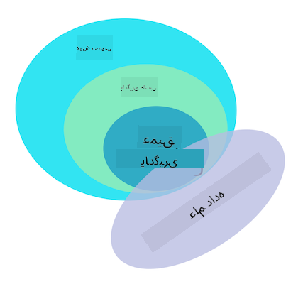

<!--
CO_OP_TRANSLATOR_METADATA:
{
  "original_hash": "73e9a7245aa57f00cd413ffd22c0ccb6",
  "translation_date": "2025-09-03T23:37:27+00:00",
  "source_file": "1-Introduction/1-intro-to-ML/README.md",
  "language_code": "fa"
}
-->
# مقدمه‌ای بر یادگیری ماشین

## [آزمون پیش از درس](https://gray-sand-07a10f403.1.azurestaticapps.net/quiz/1/)

---

> 🎥 روی تصویر بالا کلیک کنید تا ویدیوی کوتاهی درباره این درس مشاهده کنید.

به این دوره آموزشی درباره یادگیری ماشین کلاسیک برای مبتدیان خوش آمدید! چه کاملاً تازه‌کار باشید و چه یک متخصص یادگیری ماشین که به دنبال مرور یک موضوع خاص است، خوشحالیم که به ما پیوسته‌اید! هدف ما ایجاد یک نقطه شروع دوستانه برای مطالعه یادگیری ماشین شماست و خوشحال می‌شویم بازخورد شما را ارزیابی، پاسخ داده و در این دوره بگنجانیم. [بازخورد خود را ارائه دهید](https://github.com/microsoft/ML-For-Beginners/discussions).

> 🎥 روی تصویر بالا کلیک کنید تا ویدیویی از جان گوتاگ از MIT درباره یادگیری ماشین مشاهده کنید.

---
## شروع به کار با یادگیری ماشین

قبل از شروع این دوره، باید کامپیوتر خود را آماده کنید تا بتوانید نوت‌بوک‌ها را به صورت محلی اجرا کنید.

- **کامپیوتر خود را با این ویدیوها تنظیم کنید**. از لینک‌های زیر استفاده کنید تا [نصب پایتون](https://youtu.be/CXZYvNRIAKM) روی سیستم خود را یاد بگیرید و [ویرایشگر متن](https://youtu.be/EU8eayHWoZg) را برای توسعه تنظیم کنید.
- **پایتون را یاد بگیرید**. توصیه می‌شود که درک پایه‌ای از [پایتون](https://docs.microsoft.com/learn/paths/python-language/?WT.mc_id=academic-77952-leestott) داشته باشید، یک زبان برنامه‌نویسی مفید برای دانشمندان داده که در این دوره از آن استفاده می‌کنیم.
- **Node.js و جاوااسکریپت را یاد بگیرید**. ما همچنین چند بار در این دوره از جاوااسکریپت برای ساخت اپلیکیشن‌های وب استفاده می‌کنیم، بنابراین باید [node](https://nodejs.org) و [npm](https://www.npmjs.com/) نصب شده باشند و [Visual Studio Code](https://code.visualstudio.com/) برای توسعه پایتون و جاوااسکریپت در دسترس باشد.
- **یک حساب GitHub ایجاد کنید**. از آنجا که ما را در [GitHub](https://github.com) پیدا کرده‌اید، ممکن است قبلاً حساب داشته باشید، اما اگر ندارید، یکی ایجاد کنید و سپس این دوره را برای استفاده شخصی خود فورک کنید. (لطفاً به ما یک ستاره بدهید 😊)
- **Scikit-learn را بررسی کنید**. با [Scikit-learn](https://scikit-learn.org/stable/user_guide.html)، مجموعه‌ای از کتابخانه‌های یادگیری ماشین که در این درس‌ها به آنها اشاره می‌کنیم، آشنا شوید.

---
## یادگیری ماشین چیست؟

اصطلاح "یادگیری ماشین" یکی از محبوب‌ترین و پرکاربردترین اصطلاحات امروز است. احتمال زیادی وجود دارد که حداقل یک بار این اصطلاح را شنیده باشید، اگر با فناوری آشنایی داشته باشید، فارغ از اینکه در چه حوزه‌ای کار می‌کنید. اما مکانیزم یادگیری ماشین برای اکثر افراد یک راز است. برای یک مبتدی در یادگیری ماشین، این موضوع گاهی اوقات می‌تواند گیج‌کننده باشد. بنابراین، مهم است که بفهمیم یادگیری ماشین واقعاً چیست و آن را گام به گام، از طریق مثال‌های عملی یاد بگیریم.

---
## منحنی هیجان

> Google Trends نشان‌دهنده "منحنی هیجان" اخیر اصطلاح "یادگیری ماشین" است.

---
## جهانی اسرارآمیز

ما در جهانی پر از اسرار جذاب زندگی می‌کنیم. دانشمندان بزرگی مانند استیون هاوکینگ، آلبرت انیشتین و بسیاری دیگر زندگی خود را وقف جستجوی اطلاعات معناداری کرده‌اند که اسرار دنیای اطراف ما را آشکار می‌کند. این همان وضعیت انسانی یادگیری است: یک کودک انسان چیزهای جدیدی یاد می‌گیرد و ساختار دنیای خود را سال به سال با رشد به بزرگسالی کشف می‌کند.

---
## مغز کودک

مغز و حواس یک کودک حقایق اطراف خود را درک می‌کنند و به تدریج الگوهای پنهان زندگی را یاد می‌گیرند که به کودک کمک می‌کند قوانین منطقی برای شناسایی الگوهای یادگرفته شده بسازد. فرآیند یادگیری مغز انسان، انسان‌ها را به پیچیده‌ترین موجودات زنده این دنیا تبدیل کرده است. یادگیری مداوم با کشف الگوهای پنهان و سپس نوآوری بر اساس آن الگوها به ما امکان می‌دهد که در طول زندگی خود بهتر و بهتر شویم. این ظرفیت یادگیری و قابلیت تکامل به مفهومی به نام [انعطاف‌پذیری مغز](https://www.simplypsychology.org/brain-plasticity.html) مرتبط است. به طور سطحی، می‌توانیم برخی شباهت‌های انگیزشی بین فرآیند یادگیری مغز انسان و مفاهیم یادگیری ماشین ترسیم کنیم.

---
## مغز انسان

[مغز انسان](https://www.livescience.com/29365-human-brain.html) چیزهایی را از دنیای واقعی درک می‌کند، اطلاعات درک‌شده را پردازش می‌کند، تصمیمات منطقی می‌گیرد و بر اساس شرایط اقدامات خاصی انجام می‌دهد. این همان چیزی است که ما آن را رفتار هوشمندانه می‌نامیم. وقتی فرآیند رفتار هوشمندانه را به صورت مصنوعی به یک ماشین برنامه‌ریزی کنیم، به آن هوش مصنوعی (AI) می‌گویند.

---
## برخی اصطلاحات

اگرچه ممکن است این اصطلاحات گیج‌کننده باشند، یادگیری ماشین (ML) یک زیرمجموعه مهم از هوش مصنوعی است. **یادگیری ماشین به استفاده از الگوریتم‌های تخصصی برای کشف اطلاعات معنادار و یافتن الگوهای پنهان از داده‌های درک‌شده برای تأیید فرآیند تصمیم‌گیری منطقی می‌پردازد**.

---
## هوش مصنوعی، یادگیری ماشین، یادگیری عمیق

> نموداری که روابط بین هوش مصنوعی، یادگیری ماشین، یادگیری عمیق و علم داده را نشان می‌دهد. اینفوگرافیک توسط [Jen Looper](https://twitter.com/jenlooper) الهام گرفته از [این گرافیک](https://softwareengineering.stackexchange.com/questions/366996/distinction-between-ai-ml-neural-networks-deep-learning-and-data-mining)

---
## مفاهیمی که پوشش داده می‌شوند

در این دوره آموزشی، ما فقط مفاهیم اصلی یادگیری ماشین را که یک مبتدی باید بداند پوشش می‌دهیم. ما آنچه را که "یادگیری ماشین کلاسیک" می‌نامیم، عمدتاً با استفاده از Scikit-learn، یک کتابخانه عالی که بسیاری از دانش‌آموزان برای یادگیری اصول استفاده می‌کنند، بررسی می‌کنیم. برای درک مفاهیم گسترده‌تر هوش مصنوعی یا یادگیری عمیق، داشتن دانش بنیادی قوی از یادگیری ماشین ضروری است، و ما قصد داریم آن را در اینجا ارائه دهیم.

---
## در این دوره شما یاد خواهید گرفت:

- مفاهیم اصلی یادگیری ماشین
- تاریخچه یادگیری ماشین
- یادگیری ماشین و عدالت
- تکنیک‌های یادگیری ماشین در رگرسیون
- تکنیک‌های یادگیری ماشین در طبقه‌بندی
- تکنیک‌های یادگیری ماشین در خوشه‌بندی
- تکنیک‌های پردازش زبان طبیعی در یادگیری ماشین
- تکنیک‌های پیش‌بینی سری‌های زمانی در یادگیری ماشین
- یادگیری تقویتی
- کاربردهای واقعی یادگیری ماشین

---
## مواردی که پوشش داده نمی‌شوند

- یادگیری عمیق
- شبکه‌های عصبی
- هوش مصنوعی

برای تجربه یادگیری بهتر، از پیچیدگی‌های شبکه‌های عصبی، یادگیری عمیق - ساخت مدل‌های چندلایه با استفاده از شبکه‌های عصبی - و هوش مصنوعی اجتناب خواهیم کرد، که در یک دوره آموزشی دیگر به آن‌ها خواهیم پرداخت. همچنین یک دوره آموزشی آینده درباره علم داده ارائه خواهیم داد تا بر این جنبه از این حوزه بزرگ‌تر تمرکز کنیم.

---
## چرا یادگیری ماشین مطالعه کنیم؟

یادگیری ماشین، از دیدگاه سیستمی، به عنوان ایجاد سیستم‌های خودکار تعریف می‌شود که می‌توانند الگوهای پنهان را از داده‌ها یاد بگیرند تا به تصمیم‌گیری هوشمندانه کمک کنند.

این انگیزه به طور آزادانه از نحوه یادگیری مغز انسان برخی چیزها بر اساس داده‌هایی که از دنیای بیرونی درک می‌کند، الهام گرفته شده است.

✅ برای یک لحظه فکر کنید که چرا یک کسب‌وکار ممکن است بخواهد از استراتژی‌های یادگیری ماشین استفاده کند به جای ایجاد یک موتور مبتنی بر قوانین سخت‌کد شده.

---
## کاربردهای یادگیری ماشین

کاربردهای یادگیری ماشین اکنون تقریباً همه جا هستند و به اندازه داده‌هایی که در جوامع ما جریان دارند، فراگیر شده‌اند؛ داده‌هایی که توسط تلفن‌های هوشمند، دستگاه‌های متصل و سیستم‌های دیگر تولید می‌شوند. با توجه به پتانسیل عظیم الگوریتم‌های پیشرفته یادگیری ماشین، محققان قابلیت‌های آن‌ها را برای حل مشکلات چندبعدی و چندرشته‌ای واقعی با نتایج مثبت عالی بررسی کرده‌اند.

---
## مثال‌هایی از یادگیری ماشین کاربردی

**شما می‌توانید یادگیری ماشین را به روش‌های مختلفی استفاده کنید**:

- پیش‌بینی احتمال بیماری از تاریخچه پزشکی یا گزارش‌های بیمار.
- استفاده از داده‌های هواشناسی برای پیش‌بینی رویدادهای آب‌وهوایی.
- درک احساسات یک متن.
- شناسایی اخبار جعلی برای جلوگیری از انتشار تبلیغات.

مالی، اقتصاد، علوم زمین، اکتشافات فضایی، مهندسی زیست‌پزشکی، علوم شناختی و حتی حوزه‌های علوم انسانی یادگیری ماشین را برای حل مشکلات سنگین پردازش داده در حوزه خود تطبیق داده‌اند.

---
## نتیجه‌گیری

یادگیری ماشین فرآیند کشف الگوها را با یافتن بینش‌های معنادار از داده‌های واقعی یا تولیدشده خودکار می‌کند. این فناوری در کاربردهای تجاری، بهداشتی و مالی، و بسیاری دیگر ارزش خود را ثابت کرده است.

در آینده نزدیک، درک اصول یادگیری ماشین برای افراد در هر حوزه‌ای به دلیل پذیرش گسترده آن ضروری خواهد بود.

---
# 🚀 چالش

در یک کاغذ یا با استفاده از یک اپلیکیشن آنلاین مانند [Excalidraw](https://excalidraw.com/)، تفاوت‌های بین هوش مصنوعی، یادگیری ماشین، یادگیری عمیق و علم داده را ترسیم کنید. برخی ایده‌ها درباره مشکلاتی که هر یک از این تکنیک‌ها در حل آن‌ها خوب هستند اضافه کنید.

# [آزمون پس از درس](https://gray-sand-07a10f403.1.azurestaticapps.net/quiz/2/)

---
# مرور و مطالعه شخصی

برای یادگیری بیشتر درباره نحوه کار با الگوریتم‌های یادگیری ماشین در فضای ابری، این [مسیر یادگیری](https://docs.microsoft.com/learn/paths/create-no-code-predictive-models-azure-machine-learning/?WT.mc_id=academic-77952-leestott) را دنبال کنید.

یک [مسیر یادگیری](https://docs.microsoft.com/learn/modules/introduction-to-machine-learning/?WT.mc_id=academic-77952-leestott) درباره اصول یادگیری ماشین بگذرانید.

---
# تکلیف

[شروع به کار کنید](assignment.md)

---

**سلب مسئولیت**:  
این سند با استفاده از سرویس ترجمه هوش مصنوعی [Co-op Translator](https://github.com/Azure/co-op-translator) ترجمه شده است. در حالی که ما تلاش می‌کنیم دقت را حفظ کنیم، لطفاً توجه داشته باشید که ترجمه‌های خودکار ممکن است شامل خطاها یا نادرستی‌ها باشند. سند اصلی به زبان اصلی آن باید به عنوان منبع معتبر در نظر گرفته شود. برای اطلاعات حساس، توصیه می‌شود از ترجمه حرفه‌ای انسانی استفاده کنید. ما مسئولیتی در قبال سوء تفاهم‌ها یا تفسیرهای نادرست ناشی از استفاده از این ترجمه نداریم.