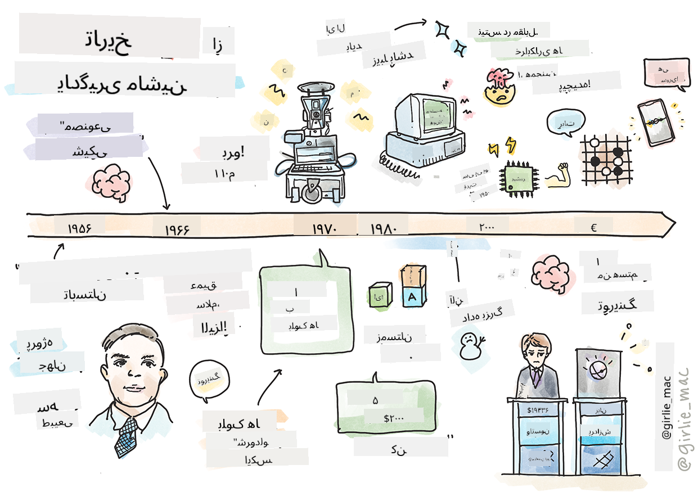
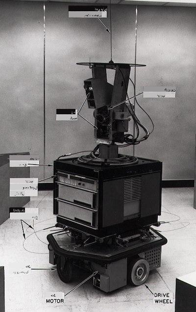
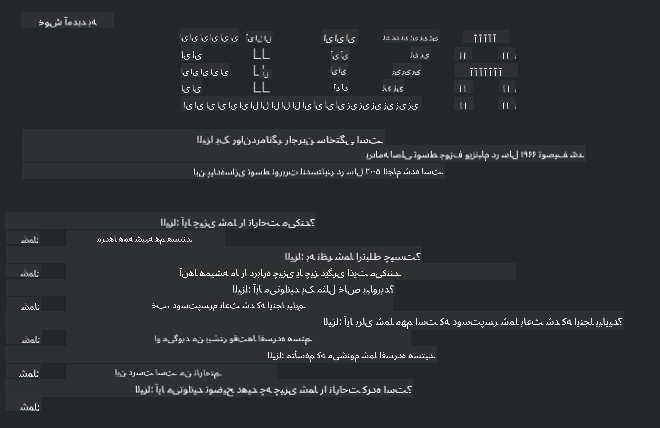

<!--
CO_OP_TRANSLATOR_METADATA:
{
  "original_hash": "b2d11df10030cacc41427a1fbc8bc8f1",
  "translation_date": "2025-09-03T23:41:05+00:00",
  "source_file": "1-Introduction/2-history-of-ML/README.md",
  "language_code": "fa"
}
-->
# تاریخچه یادگیری ماشین

> اسکیچ‌نوت توسط [تومومی ایمورا](https://www.twitter.com/girlie_mac)

## [آزمون پیش از درس](https://gray-sand-07a10f403.1.azurestaticapps.net/quiz/3/)

---

> 🎥 برای مشاهده ویدئوی کوتاهی که این درس را توضیح می‌دهد، روی تصویر بالا کلیک کنید.

در این درس، به بررسی نقاط عطف مهم در تاریخچه یادگیری ماشین و هوش مصنوعی خواهیم پرداخت.

تاریخچه هوش مصنوعی (AI) به عنوان یک حوزه علمی با تاریخچه یادگیری ماشین در هم تنیده است، زیرا الگوریتم‌ها و پیشرفت‌های محاسباتی که زیربنای یادگیری ماشین هستند، به توسعه هوش مصنوعی کمک کرده‌اند. به یاد داشته باشید که اگرچه این حوزه‌ها به عنوان زمینه‌های مجزا از دهه ۱۹۵۰ شکل گرفتند، اما [کشفیات الگوریتمی، آماری، ریاضیاتی، محاسباتی و فنی](https://wikipedia.org/wiki/Timeline_of_machine_learning) مهمی پیش از این دوره رخ داده و با آن همپوشانی داشته‌اند. در واقع، انسان‌ها برای [صدها سال](https://wikipedia.org/wiki/History_of_artificial_intelligence) به این سوالات فکر کرده‌اند: این مقاله به بررسی پایه‌های فکری تاریخی ایده «ماشین متفکر» می‌پردازد.

---
## کشفیات برجسته

- ۱۷۶۳، ۱۸۱۲ [قضیه بیز](https://wikipedia.org/wiki/Bayes%27_theorem) و پیشینیان آن. این قضیه و کاربردهای آن زیربنای استنتاج را تشکیل می‌دهند و احتمال وقوع یک رویداد را بر اساس دانش قبلی توصیف می‌کنند.
- ۱۸۰۵ [نظریه کمترین مربعات](https://wikipedia.org/wiki/Least_squares) توسط ریاضیدان فرانسوی آدریان-ماری لژاندر. این نظریه که در واحد رگرسیون یاد خواهید گرفت، به برازش داده‌ها کمک می‌کند.
- ۱۹۱۳ [زنجیره‌های مارکوف](https://wikipedia.org/wiki/Markov_chain)، که به نام ریاضیدان روسی آندری مارکوف نام‌گذاری شده است، برای توصیف دنباله‌ای از رویدادهای ممکن بر اساس یک حالت قبلی استفاده می‌شود.
- ۱۹۵۷ [پرسیپترون](https://wikipedia.org/wiki/Perceptron) نوعی طبقه‌بند خطی است که توسط روانشناس آمریکایی فرانک روزنبلات اختراع شد و زیربنای پیشرفت‌های یادگیری عمیق است.

---

- ۱۹۶۷ [نزدیک‌ترین همسایه](https://wikipedia.org/wiki/Nearest_neighbor) الگوریتمی است که در ابتدا برای مسیریابی طراحی شد. در زمینه یادگیری ماشین، برای شناسایی الگوها استفاده می‌شود.
- ۱۹۷۰ [پس‌انتشار خطا](https://wikipedia.org/wiki/Backpropagation) برای آموزش [شبکه‌های عصبی پیش‌خور](https://wikipedia.org/wiki/Feedforward_neural_network) استفاده می‌شود.
- ۱۹۸۲ [شبکه‌های عصبی بازگشتی](https://wikipedia.org/wiki/Recurrent_neural_network) شبکه‌های عصبی مصنوعی هستند که از شبکه‌های عصبی پیش‌خور مشتق شده‌اند و گراف‌های زمانی ایجاد می‌کنند.

✅ کمی تحقیق کنید. چه تاریخ‌های دیگری به عنوان نقاط عطف در تاریخ یادگیری ماشین و هوش مصنوعی برجسته هستند؟

---
## ۱۹۵۰: ماشین‌هایی که فکر می‌کنند

آلن تورینگ، فردی واقعاً شگفت‌انگیز که [در سال ۲۰۱۹ توسط عموم مردم](https://wikipedia.org/wiki/Icons:_The_Greatest_Person_of_the_20th_Century) به عنوان بزرگ‌ترین دانشمند قرن بیستم انتخاب شد، به عنوان کسی که به شکل‌گیری مفهوم «ماشینی که می‌تواند فکر کند» کمک کرد، شناخته می‌شود. او با مخالفان و نیاز خود به شواهد تجربی برای این مفهوم دست و پنجه نرم کرد و بخشی از این کار را با ایجاد [آزمون تورینگ](https://www.bbc.com/news/technology-18475646) انجام داد که در درس‌های پردازش زبان طبیعی (NLP) به آن خواهید پرداخت.

---
## ۱۹۵۶: پروژه تحقیقاتی تابستانی دارتموث

"پروژه تحقیقاتی تابستانی دارتموث در زمینه هوش مصنوعی یک رویداد مهم برای هوش مصنوعی به عنوان یک حوزه علمی بود" و در اینجا بود که اصطلاح «هوش مصنوعی» ابداع شد ([منبع](https://250.dartmouth.edu/highlights/artificial-intelligence-ai-coined-dartmouth)).

> هر جنبه‌ای از یادگیری یا هر ویژگی دیگر هوش را می‌توان به گونه‌ای دقیق توصیف کرد که بتوان ماشینی ساخت که آن را شبیه‌سازی کند.

---

محقق اصلی، پروفسور ریاضیات جان مک‌کارتی، امیدوار بود "بر اساس این فرضیه پیش برود که هر جنبه‌ای از یادگیری یا هر ویژگی دیگر هوش را می‌توان به گونه‌ای دقیق توصیف کرد که ماشینی بتواند آن را شبیه‌سازی کند." شرکت‌کنندگان شامل یکی دیگر از بزرگان این حوزه، ماروین مینسکی، بودند.

این کارگاه به آغاز و تشویق چندین بحث از جمله "ظهور روش‌های نمادین، سیستم‌های متمرکز بر حوزه‌های محدود (سیستم‌های خبره اولیه) و سیستم‌های استنتاجی در مقابل سیستم‌های استقرایی" اعتبار داده شده است ([منبع](https://wikipedia.org/wiki/Dartmouth_workshop)).

---
## ۱۹۵۶ - ۱۹۷۴: "سال‌های طلایی"

از دهه ۱۹۵۰ تا اواسط دهه ۱۹۷۰، خوش‌بینی زیادی وجود داشت که هوش مصنوعی می‌تواند بسیاری از مشکلات را حل کند. در سال ۱۹۶۷، ماروین مینسکی با اطمینان اعلام کرد که "در عرض یک نسل ... مشکل ایجاد 'هوش مصنوعی' به طور اساسی حل خواهد شد." (مینسکی، ماروین (۱۹۶۷)، محاسبات: ماشین‌های محدود و نامحدود، انگلوود کلیفس، نیوجرسی: پرنتیس-هال)

تحقیقات پردازش زبان طبیعی رونق گرفت، جستجو بهبود یافت و قدرتمندتر شد، و مفهوم «جهان‌های کوچک» ایجاد شد، جایی که وظایف ساده با استفاده از دستورالعمل‌های زبان ساده انجام می‌شد.

---

تحقیقات توسط آژانس‌های دولتی به خوبی تأمین مالی شد، پیشرفت‌هایی در محاسبات و الگوریتم‌ها حاصل شد، و نمونه‌های اولیه ماشین‌های هوشمند ساخته شدند. برخی از این ماشین‌ها عبارتند از:

* [ربات شیکی](https://wikipedia.org/wiki/Shakey_the_robot)، که می‌توانست به طور هوشمندانه حرکت کند و تصمیم بگیرد که چگونه وظایف را انجام دهد.

    
    > شیکی در سال ۱۹۷۲

---

* الیزا، یک «چت‌بات» اولیه، می‌توانست با مردم گفتگو کند و به عنوان یک «روان‌درمانگر» ابتدایی عمل کند. در درس‌های NLP بیشتر درباره الیزا خواهید آموخت.

    
    > نسخه‌ای از الیزا، یک چت‌بات

---

* "جهان بلوک‌ها" نمونه‌ای از یک جهان کوچک بود که در آن بلوک‌ها می‌توانستند چیده و مرتب شوند و آزمایش‌هایی در آموزش ماشین‌ها برای تصمیم‌گیری انجام می‌شد. پیشرفت‌هایی که با کتابخانه‌هایی مانند [SHRDLU](https://wikipedia.org/wiki/SHRDLU) حاصل شد، به پیشبرد پردازش زبان کمک کرد.

    

    > 🎥 برای مشاهده ویدئو کلیک کنید: جهان بلوک‌ها با SHRDLU

---
## ۱۹۷۴ - ۱۹۸۰: "زمستان هوش مصنوعی"

تا اواسط دهه ۱۹۷۰، مشخص شد که پیچیدگی ساخت ماشین‌های «هوشمند» دست کم گرفته شده و وعده‌های آن، با توجه به قدرت محاسباتی موجود، بیش از حد بزرگ‌نمایی شده است. تأمین مالی کاهش یافت و اعتماد به این حوزه کاهش یافت. برخی از مسائلی که بر اعتماد تأثیر گذاشتند عبارت بودند از:
---
- **محدودیت‌ها**. قدرت محاسباتی بسیار محدود بود.
- **انفجار ترکیبی**. تعداد پارامترهایی که باید آموزش داده می‌شد، به صورت نمایی افزایش یافت، بدون اینکه قدرت و قابلیت محاسباتی به موازات آن تکامل یابد.
- **کمبود داده**. کمبود داده فرآیند آزمایش، توسعه و بهبود الگوریتم‌ها را مختل کرد.
- **آیا سوالات درستی می‌پرسیم؟**. خود سوالاتی که مطرح می‌شدند، زیر سوال رفتند. محققان با انتقاداتی درباره رویکردهایشان مواجه شدند:
  - آزمون‌های تورینگ با نظریاتی مانند «اتاق چینی» زیر سوال رفتند که مطرح می‌کرد، "برنامه‌نویسی یک کامپیوتر دیجیتال ممکن است باعث شود که به نظر برسد زبان را می‌فهمد، اما نمی‌تواند درک واقعی ایجاد کند." ([منبع](https://plato.stanford.edu/entries/chinese-room/))
  - اخلاق معرفی هوش مصنوعی‌هایی مانند «روان‌درمانگر» الیزا به جامعه به چالش کشیده شد.

---

در همین زمان، مدارس مختلف فکری در زمینه هوش مصنوعی شکل گرفتند. یک دوگانگی بین [روش‌های "شلخته" و "مرتب"](https://wikipedia.org/wiki/Neats_and_scruffies) ایجاد شد. آزمایشگاه‌های _شلخته_ برنامه‌ها را تا رسیدن به نتایج دلخواه تنظیم می‌کردند. آزمایشگاه‌های _مرتب_ "بر منطق و حل مسئله رسمی تمرکز داشتند". الیزا و SHRDLU سیستم‌های _شلخته_ شناخته‌شده‌ای بودند. در دهه ۱۹۸۰، با افزایش تقاضا برای بازتولیدپذیری سیستم‌های یادگیری ماشین، رویکرد _مرتب_ به تدریج پیشتاز شد زیرا نتایج آن توضیح‌پذیرتر بودند.

---
## سیستم‌های خبره دهه ۱۹۸۰

با رشد این حوزه، مزایای آن برای کسب‌وکارها آشکارتر شد و در دهه ۱۹۸۰ سیستم‌های «خبره» گسترش یافتند. "سیستم‌های خبره از اولین اشکال موفق نرم‌افزار هوش مصنوعی (AI) بودند." ([منبع](https://wikipedia.org/wiki/Expert_system)).

این نوع سیستم در واقع _ترکیبی_ بود، که بخشی از آن شامل یک موتور قوانین برای تعریف نیازهای کسب‌وکار و بخشی دیگر شامل یک موتور استنتاج بود که از سیستم قوانین برای استنتاج حقایق جدید استفاده می‌کرد.

این دوره همچنین شاهد توجه بیشتر به شبکه‌های عصبی بود.

---
## ۱۹۸۷ - ۱۹۹۳: "سرمای هوش مصنوعی"

گسترش سخت‌افزارهای تخصصی سیستم‌های خبره اثر نامطلوبی داشت و بیش از حد تخصصی شد. ظهور کامپیوترهای شخصی نیز با این سیستم‌های بزرگ، تخصصی و متمرکز رقابت کرد. دموکراتیزه شدن محاسبات آغاز شد و در نهایت راه را برای انفجار مدرن داده‌های بزرگ هموار کرد.

---
## ۱۹۹۳ - ۲۰۱۱

این دوره شاهد عصر جدیدی برای یادگیری ماشین و هوش مصنوعی بود که توانست برخی از مشکلات ناشی از کمبود داده و قدرت محاسباتی را حل کند. حجم داده‌ها به سرعت افزایش یافت و به طور گسترده‌تری در دسترس قرار گرفت، چه خوب و چه بد، به ویژه با ظهور گوشی‌های هوشمند در حدود سال ۲۰۰۷. قدرت محاسباتی به صورت نمایی گسترش یافت و الگوریتم‌ها نیز همراه با آن تکامل یافتند. این حوزه شروع به بلوغ کرد زیرا روزهای آزاد و بی‌قید گذشته به تدریج به یک رشته علمی واقعی تبدیل شد.

---
## اکنون

امروزه یادگیری ماشین و هوش مصنوعی تقریباً در تمام جنبه‌های زندگی ما حضور دارند. این دوره نیازمند درک دقیق خطرات و اثرات بالقوه این الگوریتم‌ها بر زندگی انسان‌ها است. همان‌طور که برد اسمیت از مایکروسافت بیان کرده است: "فناوری اطلاعات مسائلی را مطرح می‌کند که به قلب حفاظت از حقوق اساسی بشر مانند حریم خصوصی و آزادی بیان می‌پردازد. این مسائل مسئولیت شرکت‌های فناوری که این محصولات را ایجاد می‌کنند، افزایش می‌دهد. به نظر ما، این مسائل همچنین نیازمند مقررات دولتی مدبرانه و توسعه هنجارهایی در مورد استفاده‌های قابل قبول است" ([منبع](https://www.technologyreview.com/2019/12/18/102365/the-future-of-ais-impact-on-society/)).

---

هنوز مشخص نیست که آینده چه چیزی در بر دارد، اما مهم است که این سیستم‌های کامپیوتری و نرم‌افزارها و الگوریتم‌هایی که اجرا می‌کنند را درک کنیم. امیدواریم این برنامه درسی به شما کمک کند تا درک بهتری پیدا کنید تا بتوانید خودتان تصمیم بگیرید.

> 🎥 برای مشاهده ویدئو کلیک کنید: یان لکون در این سخنرانی تاریخچه یادگیری عمیق را توضیح می‌دهد

---
## 🚀چالش

یکی از این لحظات تاریخی را بررسی کنید و درباره افرادی که پشت آن بودند بیشتر بیاموزید. شخصیت‌های جذابی وجود دارند و هیچ کشف علمی‌ای در خلأ فرهنگی ایجاد نشده است. چه چیزی کشف می‌کنید؟

## [آزمون پس از درس](https://gray-sand-07a10f403.1.azurestaticapps.net/quiz/4/)

---
## مرور و مطالعه شخصی

موارد زیر را مشاهده و گوش دهید:

[این پادکست که در آن امی بوید درباره تکامل هوش مصنوعی صحبت می‌کند](http://runasradio.com/Shows/Show/739)

---

## تکلیف

[یک خط زمانی ایجاد کنید](assignment.md)

---

**سلب مسئولیت**:  
این سند با استفاده از سرویس ترجمه هوش مصنوعی [Co-op Translator](https://github.com/Azure/co-op-translator) ترجمه شده است. در حالی که ما تلاش می‌کنیم دقت را حفظ کنیم، لطفاً توجه داشته باشید که ترجمه‌های خودکار ممکن است شامل خطاها یا نادرستی‌ها باشند. سند اصلی به زبان اصلی آن باید به عنوان منبع معتبر در نظر گرفته شود. برای اطلاعات حساس، توصیه می‌شود از ترجمه حرفه‌ای انسانی استفاده کنید. ما مسئولیتی در قبال سوء تفاهم‌ها یا تفسیرهای نادرست ناشی از استفاده از این ترجمه نداریم.