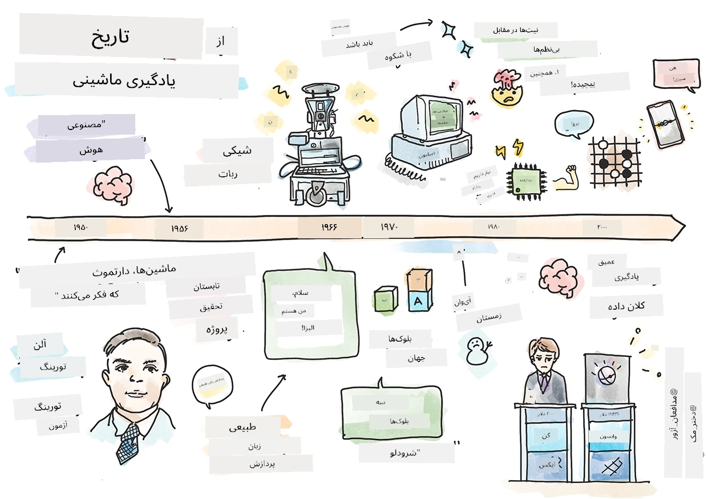
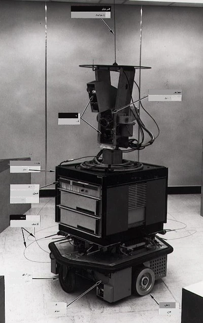
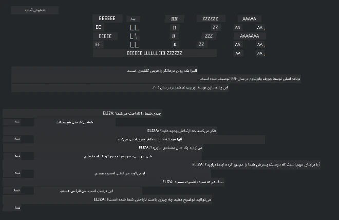

# تاریخچه یادگیری ماشین

> نوت اسکچ توسط [تومومی ایمورا](https://www.twitter.com/girlie_mac)

## [آزمون پیش‌کلاسی](https://ff-quizzes.netlify.app/en/ml/)

---

> 🎥 برای مشاهده یک ویدیو کوتاه که این درس را پوشش می‌دهد، روی تصویر بالا کلیک کنید.

در این درس، ما گام به گام با رویدادهای مهم تاریخ یادگیری ماشین و هوش مصنوعی آشنا خواهیم شد.

تاریخچه هوش مصنوعی (AI) به عنوان یک رشته، درهم تنیده با تاریخچه یادگیری ماشین است، زیرا الگوریتم‌ها و پیشرفت‌های محاسباتی که پایه‌ی یادگیری ماشین هستند، به توسعه‌ی هوش مصنوعی کمک کرده‌اند. مفید است به یاد داشته باشیم که در حالی که این رشته‌ها به عنوان حوزه‌های تحقیقاتی متمایز از دهه ۱۹۵۰ به ثمر نشستند، [کشفیات الگوریتمی، آماری، ریاضی، محاسباتی و فنی مهم](https://wikipedia.org/wiki/Timeline_of_machine_learning) که پیش از آن و موازی با آن دوره بوده‌اند نیز وجود دارند. در واقع، مردم برای [صدها سال](https://wikipedia.org/wiki/History_of_artificial_intelligence) در مورد این سوالات فکر کرده‌اند: این مقاله به بنیان‌های فکری تاریخی ایده «ماشین متفکر» می‌پردازد.

---
## کشفیات برجسته

- ۱۷۶۳، ۱۸۱۲ [قضیه بیز](https://wikipedia.org/wiki/Bayes%27_theorem) و پیشینیان آن. این قضیه و کاربردهای آن پایه‌های استنباط هستند و احتمالی بودن وقوع یک رویداد را بر اساس دانش قبلی توضیح می‌دهند.
- ۱۸۰۵ [نظریه کمترین مربعات](https://wikipedia.org/wiki/Least_squares) توسط ریاضیدان فرانسوی آدریَن-ماری له‌ژَند. این نظریه که در واحد رگرسیون ما یاد خواهید گرفت، به برازش داده‌ها کمک می‌کند.
- ۱۹۱۳ [زنجیره‌های مارکوف](https://wikipedia.org/wiki/Markov_chain)، که به نام ریاضی‌دان روسی آندری مارکوف نامگذاری شده است، برای توصیف توالی احتمالی رویدادها بر اساس وضعیت قبلی استفاده می‌شود.
- ۱۹۵۷ [پرسپترون](https://wikipedia.org/wiki/Perceptron) نوعی طبقه‌بند خطی است که توسط روانشناس آمریکایی فرانک روزنبلات اختراع شده و پایه پیشرفت‌های یادگیری عمیق است.

---

- ۱۹۶۷ [نزدیکترین همسایه](https://wikipedia.org/wiki/Nearest_neighbor) الگوریتمی بود که در ابتدا برای ترسیم مسیر طراحی شد. در زمینه یادگیری ماشین برای شناسایی الگوها استفاده می‌شود.
- ۱۹۷۰ [پس‌انتشار خطا](https://wikipedia.org/wiki/Backpropagation) برای آموزش [شبکه‌های عصبی پیش‌خور](https://wikipedia.org/wiki/Feedforward_neural_network) به کار می‌رود.
- ۱۹۸۲ [شبکه‌های عصبی بازگشتی](https://wikipedia.org/wiki/Recurrent_neural_network) شبکه‌های عصبی مصنوعی مشتق شده از شبکه‌های عصبی پیش‌خور هستند که گراف‌های زمانی ایجاد می‌کنند.

✅ اندکی تحقیق کنید. چه تاریخ‌های دیگری به عنوان نقاط عطف در تاریخ یادگیری ماشین و هوش مصنوعی برجسته هستند؟

---
## ۱۹۵۰: ماشین‌هایی که فکر می‌کنند

آلن تورینگ، فردی واقعاً شگفت‌انگیز که توسط [عموم مردم در سال ۲۰۱۹](https://wikipedia.org/wiki/Icons:_The_Greatest_Person_of_the_20th_Century) به عنوان بزرگ‌ترین دانشمند قرن بیستم انتخاب شد، به عنوان کسی شناخته می‌شود که پایه‌های مفهوم «ماشینی که می‌تواند فکر کند» را بنا گذاشت. او با مخالفان و نیاز خود به شواهد تجربی درباره این مفهوم رو به رو شد و بخشی از آن را با ایجاد [آزمون تورینگ](https://www.bbc.com/news/technology-18475646) انجام داد، که شما در درس‌های پردازش زبان طبیعی (NLP) خواهید آموخت.

---
## ۱۹۵۶: پروژه تحقیقاتی تابستانی دارتموث

«پروژه تحقیقاتی تابستانی دارتموث در زمینه هوش مصنوعی یک رویداد مهم برای هوش مصنوعی به عنوان یک رشته بود» و در اینجا اصطلاح «هوش مصنوعی» ساخته شد ([منبع](https://250.dartmouth.edu/highlights/artificial-intelligence-ai-coined-dartmouth)).

> هر جنبه‌ای از یادگیری یا هر ویژگی دیگری از هوش می‌تواند به طور دقیق به گونه‌ای توصیف شود که ماشینی بتواند آن را شبیه‌سازی کند.

---

پژوهشگر اصلی، پروفسور ریاضی جان مک‌کارتی، امیدوار بود «بر اساس فرضیه اینکه هر جنبه‌ای از یادگیری یا هر ویژگی دیگری از هوش می‌تواند به طور دقیق به گونه‌ای توصیف شود که ماشینی بتواند آن را شبیه‌سازی کند» پیش برود. شرکت‌کنندگان شامل شخص برجسته دیگری در این زمینه، ماروین مینسکی بودند.

این کارگاه آغاز و تشویق چندین بحث را به عهده داشت، از جمله «ظهور روش‌های نمادین، سیستم‌های متمرکز بر حوزه‌های محدود (سیستم‌های خبره اولیه) و سیستم‌های استنتاجی در برابر سیستم‌های استقرایی.» ([منبع](https://wikipedia.org/wiki/Dartmouth_workshop)).

---
## ۱۹۵۶ - ۱۹۷۴: «سال‌های طلایی»

از دهه ۱۹۵۰ تا اواسط دهه ۷۰، امید زیادی وجود داشت که هوش مصنوعی بتواند بسیاری از مشکلات را حل کند. در سال ۱۹۶۷، ماروین مینسکی با اطمینان اعلام کرد که «در عرض یک نسل … مشکل ایجاد 'هوش مصنوعی' تا حد زیادی حل خواهد شد.» (Minsky, Marvin (1967)، محاسبات: ماشین‌های متناهی و نامتناهی، انگلوود کلیفس، نیوجرسی: Prentice-Hall)

پژوهش پردازش زبان طبیعی شکوفا شد، جست‌وجو بهبود یافت و قدرتمندتر شد و مفهوم «جهان‌های میکرو» ایجاد شد که در آنها وظایف ساده با استفاده از دستورات زبان ساده انجام می‌شد.

---

تحقیق به خوبی توسط سازمان‌های دولتی حمایت مالی شد، پیشرفت‌هایی در محاسبات و الگوریتم‌ها انجام شد و نمونه‌هایی از ماشین‌های هوشمند ساخته شدند. برخی از این ماشین‌ها عبارتند از:

* [شیکی ربات](https://wikipedia.org/wiki/Shakey_the_robot) که می‌توانست حرکت کند و تصمیم بگیرد چگونه وظایف را «هوشمندانه» انجام دهد.

    
    > شیکی در سال ۱۹۷۲

---

* الیزا، یک «چتر بات» اولیه، می‌توانست با مردم گفتگو کند و به عنوان یک «روح‌بخش» ابتدایی عمل کند. شما در درس‌های NLP بیشتر با الیزا آشنا خواهید شد.

    
    > نسخه‌ای از الیزا، یک چت بات

---

* «جهان بلوک‌ها» نمونه‌ای از یک میکرو جهان بود که در آن بلوک‌ها می‌توانستند روی هم چیده و مرتب شوند و آزمایش‌هایی در زمینه آموزش به ماشین‌ها برای تصمیم‌گیری انجام می‌شد. پیشرفت‌هایی که با کتابخانه‌هایی مانند [SHRDLU](https://wikipedia.org/wiki/SHRDLU) ساخته شده بود، به پیشرفت پردازش زبان کمک کرد.

    

    > 🎥 برای مشاهده ویدیو روی تصویر بالا کلیک کنید: جهان بلوک‌ها با SHRDLU

---
## ۱۹۷۴ - ۱۹۸۰: «زمستان هوش مصنوعی»

تا اواسط دهه ۷۰، مشخص شد که پیچیدگی ساخت «ماشین‌های هوشمند» کمتر از آنچه تصور می‌شد نبوده و وعده‌های آن با قدرت محاسبات موجود بیش از حد برآورد شده بود. تأمین مالی کاهش یافت و اعتماد به این رشته کم شد. برخی از مسائل که بر اعتماد تأثیر گذاشتند عبارتند از:
---
- **محدودیت‌ها**. قدرت محاسباتی بسیار محدود بود.
- **انفجار ترکیبی**. تعداد پارامترهایی که نیاز به آموزش داشتند به طور نمایی افزایش یافت، در حالی که قدرت و ظرفیت محاسباتی به همان نسبت رشد نکرد.
- **کمبود داده**. کمبود داده‌ها فرآیند آزمایش، توسعه و پالایش الگوریتم‌ها را مختل کرد.
- **آیا سوالات درستی می‌پرسیم؟**. خود سوالات مطرح شده، مورد پرسش قرار گرفتند. پژوهشگران با انتقاداتی درباره رویکردهای خود مواجه شدند:
  - آزمایش‌های تورینگ از جمله طریق «نظریه اتاق چینی» مورد سوال قرار گرفت، که این فرض را مطرح کرد که «برنامه‌نویسی یک کامپیوتر دیجیتال ممکن است باعث شود به نظر برسد زبان را می‌فهمد اما فهم واقعی تولید نمی‌کند.» ([منبع](https://plato.stanford.edu/entries/chinese-room/))
  - اخلاقی بودن معرفی هوش‌های مصنوعی مانند «روان‌درمانگر» الیزا به جامعه به چالش کشیده شد.

---

در همین زمان، مدارس فکری مختلف هوش مصنوعی شکل گرفتند. یک دوگانگی بین روش‌های ["ناخوش‌یمن" در مقابل "مرتب هوش مصنوعی"](https://wikipedia.org/wiki/Neats_and_scruffies) ایجاد شد. آزمایشگاه‌های _ناخوش‌یمن_ برنامه‌ها را برای ساعت‌ها تا رسیدن به نتایج مطلوب دستکاری می‌کردند. آزمایشگاه‌های _مرتب_ «بر منطق و حل مسئله رسمی تمرکز داشتند». الیزا و SHRDLU سیستم‌های _ناخوش‌یمن_ شناخته شده بودند. در دهه ۱۹۸۰، با ظهور نیاز به قابل تکرار کردن سیستم‌های یادگیری ماشین، رویکرد _مرتب_ به تدریج جلو آمد چون نتایج آن قابل توضیح‌تر بود.

---
## سیستم‌های خبره دهه ۱۹۸۰

با رشد این رشته، مزیت آن برای کسب و کار روشن‌تر شد و در دهه ۱۹۸۰ گسترش «سیستم‌های خبره» نیز افزایش یافت. «سیستم‌های خبره از اولین اشکال موفق نرم‌افزار هوش مصنوعی (AI) بودند.» ([منبع](https://wikipedia.org/wiki/Expert_system))

این نوع سیستم در واقع _ترکیبی_ بود، تا حدی شامل موتور قوانین تعیین کننده نیازهای تجاری و موتور استنتاج که بر سیستم قوانین تکیه داشت تا حقایق جدید را استنتاج کند.

این دوران نیز شاهد افزایش توجه به شبکه‌های عصبی بود.

---
## ۱۹۸۷ - ۱۹۹۳: «کاهش هوش مصنوعی»

گسترش سخت‌افزارهای تخصصی سیستم‌های خبره اثر ناگواری داشت که آنها بیش از حد تخصصی شدند. همچنین ظهور کامپیوترهای شخصی با این سیستم‌های بزرگ، تخصصی و متمرکز رقابت کرد. دموکراتیزه شدن محاسبات آغاز شده بود و در نهایت راه را برای انفجار داده‌های بزرگ مدرن فراهم کرد.

---
## ۱۹۹۳ - ۲۰۱۱

این دوره شاهد شروع دوران جدیدی برای یادگیری ماشین و هوش مصنوعی بود که بتوانند برخی مشکلات ناشی از کمبود داده و قدرت محاسبات قبلی را حل کنند. مقدار داده‌ها به سرعت افزایش یافت و بیشتر در دسترس قرار گرفت، هم به خیر و هم به شر، به ویژه با ظهور گوشی‌های هوشمند در حدود ۲۰۰۷. قدرت محاسباتی به طور نمایی افزایش یافت و الگوریتم‌ها به موازات آن تکامل یافتند. این رشته شروع به کسب بلوغ کرد و روزهای آزاد گذشته به یک رشته واقعی تبدیل شدند.

---
## اکنون

امروزه یادگیری ماشین و هوش مصنوعی تقریباً بر هر بخش از زندگی ما تأثیر دارند. این دوران نیازمند درک دقیق ریسک‌ها و اثرات بالقوه این الگوریتم‌ها بر زندگی انسان‌ها است. همانطور که برد اسمیت از مایکروسافت گفته، «فناوری اطلاعات مسائلی را مطرح می‌کند که به اصل حفاظت‌های حقوق بنیادین بشری مانند حریم خصوصی و آزادی بیان مرتبط است. این مسائل مسئولیت شرکت‌های فناورانه را که این محصولات را ایجاد می‌کنند افزایش می‌دهد. از نظر ما، همچنین نیازمند مقررات دولتی با دقت و توسعه هنجارهایی درباره کاربردهای قابل قبول است» ([منبع](https://www.technologyreview.com/2019/12/18/102365/the-future-of-ais-impact-on-society/)).

---

آینده چه خواهد بود هنوز در هاله‌ای از ابهام است، اما مهم است که این سیستم‌های کامپیوتری و نرم‌افزارها و الگوریتم‌هایی که اجرا می‌کنند را درک کنیم. امیدواریم این برنامه درسی به شما کمک کند تا درک بهتری پیدا کنید تا بتوانید خود تصمیم بگیرید.

> 🎥 برای مشاهده ویدیو روی تصویر بالا کلیک کنید: یان لکون در این سخنرانی درباره تاریخچه یادگیری عمیق صحبت می‌کند

---
## 🚀چالش

به یکی از این لحظات تاریخی عمیق شوید و درباره افراد پشت آن بیشتر بیاموزید. شخصیت‌های جذابی وجود دارند و هیچ کشف علمی در خلأ فرهنگی ایجاد نشده است. چه کشف می‌کنید؟

## [آزمون پس‌کلاسی](https://ff-quizzes.netlify.app/en/ml/)

---
## مرور و مطالعه خودآموز

این موارد را مشاهده و گوش کنید:

[این پادکست که در آن ایمی بوید درباره تحول هوش مصنوعی صحبت می‌کند](http://runasradio.com/Shows/Show/739)

---

## تکلیف

[یک خط زمانی ایجاد کنید](assignment.md)

---

<!-- CO-OP TRANSLATOR DISCLAIMER START -->
**سلب مسئولیت**:
این سند با استفاده از سرویس ترجمه هوش مصنوعی [Co-op Translator](https://github.com/Azure/co-op-translator) ترجمه شده است. در حالی که ما در تلاش برای دقت هستیم، لطفاً توجه داشته باشید که ترجمه‌های خودکار ممکن است شامل خطاها یا نادرستی‌هایی باشند. سند اصلی به زبان مادری خود باید به عنوان منبع معتبر در نظر گرفته شود. برای اطلاعات حیاتی، ترجمه حرفه‌ای انسانی توصیه می‌شود. ما در قبال هرگونه سوء تفاهم یا برداشت نادرست ناشی از استفاده از این ترجمه مسئولیتی نداریم.
<!-- CO-OP TRANSLATOR DISCLAIMER END -->