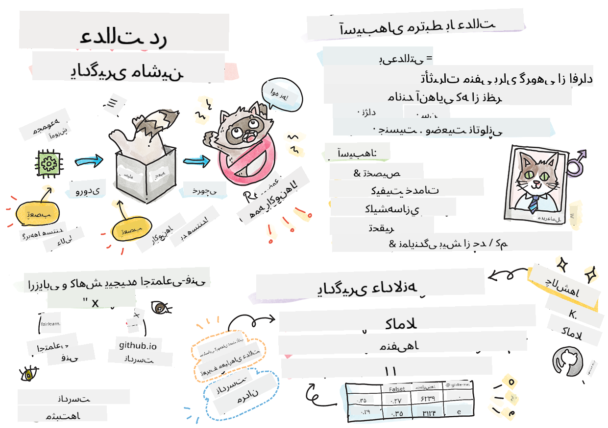

<!--
CO_OP_TRANSLATOR_METADATA:
{
  "original_hash": "8f819813b2ca08ec7b9f60a2c9336045",
  "translation_date": "2025-09-03T23:29:27+00:00",
  "source_file": "1-Introduction/3-fairness/README.md",
  "language_code": "fa"
}
-->
# ساخت راه‌حل‌های یادگیری ماشین با هوش مصنوعی مسئولانه

> اسکیچ‌نوت توسط [Tomomi Imura](https://www.twitter.com/girlie_mac)

## [آزمون پیش از درس](https://gray-sand-07a10f403.1.azurestaticapps.net/quiz/5/)

## مقدمه

در این دوره آموزشی، شما شروع به کشف خواهید کرد که چگونه یادگیری ماشین می‌تواند و در حال حاضر زندگی روزمره ما را تحت تأثیر قرار می‌دهد. حتی اکنون، سیستم‌ها و مدل‌ها در وظایف تصمیم‌گیری روزانه مانند تشخیص‌های پزشکی، تأیید وام یا شناسایی تقلب دخیل هستند. بنابراین، مهم است که این مدل‌ها به خوبی کار کنند تا نتایجی قابل اعتماد ارائه دهند. همانند هر برنامه نرم‌افزاری، سیستم‌های هوش مصنوعی نیز ممکن است انتظارات را برآورده نکنند یا نتایج نامطلوبی داشته باشند. به همین دلیل ضروری است که بتوانیم رفتار یک مدل هوش مصنوعی را درک و توضیح دهیم.

تصور کنید چه اتفاقی می‌افتد وقتی داده‌هایی که برای ساخت این مدل‌ها استفاده می‌کنید فاقد برخی از جمعیت‌شناسی‌ها مانند نژاد، جنسیت، دیدگاه سیاسی، مذهب یا نمایندگی نامتناسب این جمعیت‌شناسی‌ها باشد. اگر خروجی مدل به گونه‌ای تفسیر شود که به نفع یک گروه خاص باشد، چه پیامدی برای برنامه خواهد داشت؟ علاوه بر این، اگر مدل نتیجه‌ای نامطلوب داشته باشد و به افراد آسیب برساند، چه اتفاقی می‌افتد؟ چه کسی مسئول رفتار سیستم‌های هوش مصنوعی است؟ این‌ها برخی از سوالاتی هستند که در این دوره آموزشی بررسی خواهیم کرد.

در این درس، شما:

- اهمیت عدالت در یادگیری ماشین و آسیب‌های مرتبط با آن را درک خواهید کرد.
- با تمرین بررسی موارد استثنایی و سناریوهای غیرمعمول برای اطمینان از قابلیت اطمینان و ایمنی آشنا خواهید شد.
- نیاز به توانمندسازی همه افراد از طریق طراحی سیستم‌های فراگیر را درک خواهید کرد.
- اهمیت حفاظت از حریم خصوصی و امنیت داده‌ها و افراد را بررسی خواهید کرد.
- اهمیت رویکرد شفاف برای توضیح رفتار مدل‌های هوش مصنوعی را خواهید دید.
- به اهمیت مسئولیت‌پذیری برای ایجاد اعتماد در سیستم‌های هوش مصنوعی توجه خواهید کرد.

## پیش‌نیاز

به عنوان پیش‌نیاز، لطفاً مسیر یادگیری "اصول هوش مصنوعی مسئولانه" را بگذرانید و ویدیوی زیر را در این موضوع مشاهده کنید:

برای یادگیری بیشتر درباره هوش مصنوعی مسئولانه، این [مسیر یادگیری](https://docs.microsoft.com/learn/modules/responsible-ai-principles/?WT.mc_id=academic-77952-leestott) را دنبال کنید.

> 🎥 برای مشاهده ویدیو روی تصویر بالا کلیک کنید: رویکرد مایکروسافت به هوش مصنوعی مسئولانه

## عدالت

سیستم‌های هوش مصنوعی باید با همه افراد به طور عادلانه رفتار کنند و از تأثیرگذاری متفاوت بر گروه‌های مشابه اجتناب کنند. برای مثال، زمانی که سیستم‌های هوش مصنوعی راهنمایی‌هایی در مورد درمان پزشکی، درخواست‌های وام یا اشتغال ارائه می‌دهند، باید توصیه‌های مشابهی به همه افراد با شرایط مشابه ارائه دهند. هر یک از ما به عنوان انسان، تعصباتی داریم که بر تصمیمات و اقدامات ما تأثیر می‌گذارد. این تعصبات می‌توانند در داده‌هایی که برای آموزش سیستم‌های هوش مصنوعی استفاده می‌کنیم، مشهود باشند. چنین دستکاری‌هایی گاهی به صورت ناخواسته اتفاق می‌افتد. اغلب دشوار است که آگاهانه بدانیم چه زمانی در داده‌ها تعصب وارد می‌کنیم.

**"بی‌عدالتی"** شامل تأثیرات منفی یا "آسیب‌ها" برای یک گروه از افراد است، مانند گروه‌هایی که بر اساس نژاد، جنسیت، سن یا وضعیت معلولیت تعریف می‌شوند. آسیب‌های اصلی مرتبط با عدالت را می‌توان به صورت زیر طبقه‌بندی کرد:

- **تخصیص**، اگر یک جنسیت یا قومیت به عنوان مثال بر دیگری ترجیح داده شود.
- **کیفیت خدمات**. اگر داده‌ها را برای یک سناریوی خاص آموزش دهید اما واقعیت بسیار پیچیده‌تر باشد، این منجر به خدمات ضعیف می‌شود. برای مثال، یک دستگاه پخش صابون که نمی‌تواند پوست تیره را تشخیص دهد. [منبع](https://gizmodo.com/why-cant-this-soap-dispenser-identify-dark-skin-1797931773)
- **تحقیر**. انتقاد ناعادلانه و برچسب زدن به چیزی یا کسی. برای مثال، یک فناوری برچسب‌گذاری تصویر به اشتباه تصاویر افراد با پوست تیره را به عنوان گوریل برچسب‌گذاری کرد.
- **نمایندگی بیش از حد یا کم**. ایده این است که یک گروه خاص در یک حرفه خاص دیده نمی‌شود و هر خدمات یا عملکردی که به ترویج این موضوع ادامه دهد، به آسیب کمک می‌کند.
- **کلیشه‌سازی**. ارتباط دادن یک گروه خاص با ویژگی‌های از پیش تعیین‌شده. برای مثال، یک سیستم ترجمه زبان بین انگلیسی و ترکی ممکن است به دلیل کلمات با ارتباطات کلیشه‌ای به جنسیت، نادرست عمل کند.

> ترجمه به ترکی

> ترجمه به انگلیسی

هنگام طراحی و آزمایش سیستم‌های هوش مصنوعی، باید اطمینان حاصل کنیم که هوش مصنوعی عادلانه است و به گونه‌ای برنامه‌ریزی نشده است که تصمیمات متعصبانه یا تبعیض‌آمیز بگیرد، تصمیماتی که انسان‌ها نیز از گرفتن آن‌ها منع شده‌اند. تضمین عدالت در هوش مصنوعی و یادگیری ماشین همچنان یک چالش پیچیده اجتماعی-فنی است.

### قابلیت اطمینان و ایمنی

برای ایجاد اعتماد، سیستم‌های هوش مصنوعی باید در شرایط عادی و غیرمنتظره قابل اعتماد، ایمن و سازگار باشند. مهم است بدانیم که سیستم‌های هوش مصنوعی در شرایط مختلف چگونه رفتار خواهند کرد، به ویژه زمانی که با موارد استثنایی مواجه می‌شوند. هنگام ساخت راه‌حل‌های هوش مصنوعی، باید تمرکز زیادی بر نحوه مدیریت طیف گسترده‌ای از شرایطی که این راه‌حل‌ها ممکن است با آن‌ها روبرو شوند، وجود داشته باشد. برای مثال، یک خودروی خودران باید ایمنی افراد را به عنوان اولویت اصلی در نظر بگیرد. در نتیجه، هوش مصنوعی که خودرو را هدایت می‌کند باید تمام سناریوهای ممکن را که خودرو ممکن است با آن‌ها مواجه شود، مانند شب، طوفان، کولاک، کودکان در حال دویدن در خیابان، حیوانات خانگی، ساخت‌وسازهای جاده‌ای و غیره در نظر بگیرد. میزان توانایی یک سیستم هوش مصنوعی در مدیریت طیف گسترده‌ای از شرایط به طور قابل اعتماد و ایمن، سطح پیش‌بینی‌پذیری دانشمند داده یا توسعه‌دهنده هوش مصنوعی را در طول طراحی یا آزمایش سیستم منعکس می‌کند.

> [🎥 برای مشاهده ویدیو اینجا کلیک کنید: ](https://www.microsoft.com/videoplayer/embed/RE4vvIl)

### فراگیری

سیستم‌های هوش مصنوعی باید به گونه‌ای طراحی شوند که همه افراد را درگیر و توانمند کنند. هنگام طراحی و پیاده‌سازی سیستم‌های هوش مصنوعی، دانشمندان داده و توسعه‌دهندگان هوش مصنوعی باید موانع احتمالی را که ممکن است به طور ناخواسته افراد را مستثنی کند، شناسایی و برطرف کنند. برای مثال، یک میلیارد نفر در سراسر جهان با معلولیت زندگی می‌کنند. با پیشرفت هوش مصنوعی، آن‌ها می‌توانند به طیف گسترده‌ای از اطلاعات و فرصت‌ها در زندگی روزمره خود دسترسی آسان‌تری داشته باشند. با رفع این موانع، فرصت‌هایی برای نوآوری و توسعه محصولات هوش مصنوعی با تجربیات بهتر که به نفع همه است، ایجاد می‌شود.

> [🎥 برای مشاهده ویدیو اینجا کلیک کنید: فراگیری در هوش مصنوعی](https://www.microsoft.com/videoplayer/embed/RE4vl9v)

### امنیت و حریم خصوصی

سیستم‌های هوش مصنوعی باید ایمن باشند و به حریم خصوصی افراد احترام بگذارند. افراد به سیستم‌هایی که حریم خصوصی، اطلاعات یا زندگی آن‌ها را به خطر می‌اندازند، کمتر اعتماد می‌کنند. هنگام آموزش مدل‌های یادگیری ماشین، ما برای دستیابی به بهترین نتایج به داده‌ها متکی هستیم. در این فرآیند، منبع داده و یکپارچگی آن باید در نظر گرفته شود. برای مثال، آیا داده‌ها توسط کاربر ارائه شده‌اند یا به صورت عمومی در دسترس بوده‌اند؟ علاوه بر این، هنگام کار با داده‌ها، توسعه سیستم‌های هوش مصنوعی که بتوانند اطلاعات محرمانه را محافظت کنند و در برابر حملات مقاوم باشند، بسیار مهم است. با گسترش هوش مصنوعی، حفاظت از حریم خصوصی و امنیت اطلاعات شخصی و تجاری مهم‌تر و پیچیده‌تر می‌شود. مسائل مربوط به حریم خصوصی و امنیت داده‌ها نیازمند توجه ویژه‌ای در هوش مصنوعی هستند زیرا دسترسی به داده‌ها برای سیستم‌های هوش مصنوعی ضروری است تا پیش‌بینی‌ها و تصمیمات دقیق و آگاهانه‌ای درباره افراد انجام دهند.

> [🎥 برای مشاهده ویدیو اینجا کلیک کنید: امنیت در هوش مصنوعی](https://www.microsoft.com/videoplayer/embed/RE4voJF)

- به عنوان یک صنعت، ما پیشرفت‌های قابل توجهی در زمینه حریم خصوصی و امنیت داشته‌ایم که به طور قابل توجهی توسط مقرراتی مانند GDPR (مقررات عمومی حفاظت از داده‌ها) تقویت شده است.
- با این حال، در سیستم‌های هوش مصنوعی باید به تنش بین نیاز به داده‌های شخصی بیشتر برای شخصی‌تر و مؤثرتر کردن سیستم‌ها و حریم خصوصی اذعان کنیم.
- همان‌طور که با ظهور کامپیوترهای متصل به اینترنت شاهد افزایش چشمگیر مسائل امنیتی بودیم، اکنون نیز شاهد افزایش قابل توجه مسائل امنیتی مرتبط با هوش مصنوعی هستیم.
- در عین حال، شاهد استفاده از هوش مصنوعی برای بهبود امنیت بوده‌ایم. به عنوان مثال، اکثر اسکنرهای ضدویروس مدرن امروز توسط هوش مصنوعی هدایت می‌شوند.
- ما باید اطمینان حاصل کنیم که فرآیندهای علم داده ما به طور هماهنگ با آخرین شیوه‌های حریم خصوصی و امنیت ترکیب شوند.

### شفافیت

سیستم‌های هوش مصنوعی باید قابل درک باشند. بخش مهمی از شفافیت، توضیح رفتار سیستم‌های هوش مصنوعی و اجزای آن‌ها است. بهبود درک سیستم‌های هوش مصنوعی مستلزم آن است که ذینفعان بفهمند این سیستم‌ها چگونه و چرا کار می‌کنند تا بتوانند مسائل احتمالی عملکرد، نگرانی‌های ایمنی و حریم خصوصی، تعصبات، شیوه‌های انحصاری یا نتایج ناخواسته را شناسایی کنند. ما همچنین معتقدیم که کسانی که از سیستم‌های هوش مصنوعی استفاده می‌کنند باید صادق و شفاف باشند که چه زمانی، چرا و چگونه تصمیم به استفاده از آن‌ها گرفته‌اند. همچنین محدودیت‌های سیستم‌هایی که استفاده می‌کنند را توضیح دهند. برای مثال، اگر یک بانک از یک سیستم هوش مصنوعی برای پشتیبانی از تصمیمات وام‌دهی مصرف‌کننده استفاده کند، مهم است که نتایج را بررسی کند و بفهمد کدام داده‌ها بر توصیه‌های سیستم تأثیر می‌گذارند. دولت‌ها شروع به تنظیم هوش مصنوعی در صنایع مختلف کرده‌اند، بنابراین دانشمندان داده و سازمان‌ها باید توضیح دهند که آیا یک سیستم هوش مصنوعی الزامات قانونی را برآورده می‌کند، به ویژه زمانی که نتیجه‌ای نامطلوب وجود دارد.

> [🎥 برای مشاهده ویدیو اینجا کلیک کنید: شفافیت در هوش مصنوعی](https://www.microsoft.com/videoplayer/embed/RE4voJF)

- به دلیل پیچیدگی سیستم‌های هوش مصنوعی، درک نحوه کار آن‌ها و تفسیر نتایج دشوار است.
- این عدم درک بر نحوه مدیریت، عملیاتی کردن و مستندسازی این سیستم‌ها تأثیر می‌گذارد.
- این عدم درک، مهم‌تر از همه، بر تصمیماتی که با استفاده از نتایج این سیستم‌ها گرفته می‌شود، تأثیر می‌گذارد.

### مسئولیت‌پذیری

افرادی که سیستم‌های هوش مصنوعی را طراحی و پیاده‌سازی می‌کنند باید مسئول نحوه عملکرد سیستم‌های خود باشند. نیاز به مسئولیت‌پذیری به ویژه در فناوری‌های حساس مانند تشخیص چهره بسیار مهم است. اخیراً، تقاضا برای فناوری تشخیص چهره، به ویژه از سوی سازمان‌های اجرای قانون که پتانسیل این فناوری را در مواردی مانند یافتن کودکان گمشده می‌بینند، افزایش یافته است. با این حال، این فناوری‌ها می‌توانند به طور بالقوه توسط یک دولت برای به خطر انداختن آزادی‌های اساسی شهروندان خود، مثلاً با امکان نظارت مداوم بر افراد خاص، استفاده شوند. بنابراین، دانشمندان داده و سازمان‌ها باید مسئول تأثیر سیستم هوش مصنوعی خود بر افراد یا جامعه باشند.

> 🎥 برای مشاهده ویدیو روی تصویر بالا کلیک کنید: هشدارهای نظارت گسترده از طریق تشخیص چهره

در نهایت، یکی از بزرگ‌ترین سوالات نسل ما، به عنوان اولین نسلی که هوش مصنوعی را به جامعه می‌آورد، این است که چگونه می‌توان اطمینان حاصل کرد که کامپیوترها همچنان به مردم پاسخگو خواهند بود و چگونه می‌توان اطمینان حاصل کرد که افرادی که کامپیوترها را طراحی می‌کنند به همه افراد دیگر پاسخگو خواهند بود.

## ارزیابی تأثیر

قبل از آموزش یک مدل یادگیری ماشین، مهم است که یک ارزیابی تأثیر انجام شود تا هدف سیستم هوش مصنوعی، استفاده مورد نظر، محل استقرار و افرادی که با سیستم تعامل خواهند داشت، مشخص شود. این ارزیابی‌ها برای بازبینان یا آزمایش‌کنندگان مفید است تا بدانند چه عواملی را هنگام شناسایی خطرات احتمالی و پیامدهای مورد انتظار در نظر بگیرند.

موارد زیر حوزه‌های تمرکز هنگام انجام ارزیابی تأثیر هستند:

- **تأثیر منفی بر افراد**. آگاهی از هرگونه محدودیت یا الزامات، استفاده‌های پشتیبانی‌نشده یا هرگونه محدودیت شناخته‌شده که عملکرد سیستم را مختل می‌کند، برای اطمینان از عدم استفاده از سیستم به گونه‌ای که به افراد آسیب برساند، حیاتی است.
- **نیازهای داده**. درک نحوه و محل استفاده سیستم از داده‌ها به بازبینان کمک می‌کند تا هرگونه نیاز داده‌ای که باید به آن توجه شود (مانند مقررات داده GDPR یا HIPPA) را بررسی کنند. علاوه بر این، بررسی کنید که آیا منبع یا مقدار داده برای آموزش کافی است.
- **خلاصه تأثیر**. فهرستی از آسیب‌های احتمالی که ممکن است از استفاده از سیستم ناشی شود، جمع‌آوری کنید. در طول چرخه عمر یادگیری ماشین، بررسی کنید که آیا مسائل شناسایی‌شده کاهش یافته یا برطرف شده‌اند.
- **اهداف قابل اجرا** برای هر یک از شش اصل اصلی. ارزیابی کنید که آیا اهداف هر یک از اصول برآورده شده‌اند و آیا شکاف‌هایی وجود دارد.

## اشکال‌زدایی با هوش مصنوعی مسئولانه

مشابه اشکال‌زدایی یک برنامه نرم‌افزاری، اشکال‌زدایی یک سیستم هوش مصنوعی فرآیندی ضروری برای شناسایی و رفع مشکلات در سیستم است. عوامل زیادی وجود دارند که می‌توانند بر عملکرد یک مدل تأثیر بگذارند و باعث شوند که به درستی یا به طور مسئولانه عمل نکند. اکثر معیارهای عملکرد مدل‌های سنتی، تجمیعات کمی از عملکرد مدل هستند که برای تحلیل چگونگی نقض اصول هوش مصنوعی مسئولانه کافی نیستند. علاوه بر این، یک مدل یادگیری ماشین یک جعبه سیاه است که درک آنچه باعث نتیجه آن می‌شود یا ارائه توضیح زمانی که اشتباه می‌کند را دشوار می‌کند. در ادامه این دوره، یاد خواهیم گرفت که چگونه از داشبورد هوش مصنوعی مسئولانه برای کمک به اشکال‌زدایی سیستم‌های هوش مصنوعی استفاده کنیم. این داشبورد ابزاری جامع برای دانشمندان داده و توسعه‌دهندگان هوش مصنوعی فراهم می‌کند تا:

- **تحلیل خطا**. برای شناسایی توزیع خطای مدل که می‌تواند بر عدالت یا قابلیت اطمینان سیستم تأثیر بگذارد.
- **نمای کلی مدل**. برای کشف جایی که در عملکرد مدل در میان گروه‌های داده تفاوت وجود دارد.
- **تحلیل داده‌ها**. برای درک توزیع داده‌ها و شناسایی هرگونه تعصب احتمالی در داده‌ها که می‌تواند منجر به مسائل عدالت، فراگیری و قابلیت اطمینان شود.
- **قابلیت تفسیر مدل**. برای درک آنچه بر پیش‌بینی‌های مدل تأثیر می‌گذارد یا آن را تحت تأثیر قرار می‌دهد. این امر در توضیح رفتار مدل که برای شفافیت و مسئولیت‌پذیری مهم است، کمک می‌کند.

## 🚀 چالش

برای جلوگیری از ورود آسیب‌ها در وهله اول، باید:

- تنوع پس‌زمینه‌ها و دیدگاه‌ها را در میان افرادی که روی سیستم‌ها کار می‌کنند، داشته باشیم.
- در مجموعه داده‌هایی که تنوع جامعه ما را منع
در این درس، شما با مفاهیم اولیه عدالت و ناعدالتی در یادگیری ماشین آشنا شدید.

این کارگاه را مشاهده کنید تا عمیق‌تر به این موضوعات بپردازید:

- در جستجوی هوش مصنوعی مسئولانه: تبدیل اصول به عمل توسط بسیمرا نوشی، مهرنوش سامکی و آمیت شارما

> 🎥 برای مشاهده ویدیو روی تصویر بالا کلیک کنید: RAI Toolbox: چارچوب متن‌باز برای ساخت هوش مصنوعی مسئولانه توسط بسیمرا نوشی، مهرنوش سامکی و آمیت شارما

همچنین بخوانید:

- مرکز منابع هوش مصنوعی مسئولانه مایکروسافت: [Responsible AI Resources – Microsoft AI](https://www.microsoft.com/ai/responsible-ai-resources?activetab=pivot1%3aprimaryr4)

- گروه تحقیقاتی FATE مایکروسافت: [FATE: Fairness, Accountability, Transparency, and Ethics in AI - Microsoft Research](https://www.microsoft.com/research/theme/fate/)

RAI Toolbox:

- [مخزن GitHub ابزار هوش مصنوعی مسئولانه](https://github.com/microsoft/responsible-ai-toolbox)

درباره ابزارهای Azure Machine Learning برای تضمین عدالت مطالعه کنید:

- [Azure Machine Learning](https://docs.microsoft.com/azure/machine-learning/concept-fairness-ml?WT.mc_id=academic-77952-leestott)

## تکلیف

[ابزار هوش مصنوعی مسئولانه را بررسی کنید](assignment.md)

---

**سلب مسئولیت**:  
این سند با استفاده از سرویس ترجمه هوش مصنوعی [Co-op Translator](https://github.com/Azure/co-op-translator) ترجمه شده است. در حالی که ما تلاش می‌کنیم دقت را حفظ کنیم، لطفاً توجه داشته باشید که ترجمه‌های خودکار ممکن است شامل خطاها یا نادرستی‌ها باشند. سند اصلی به زبان اصلی آن باید به عنوان منبع معتبر در نظر گرفته شود. برای اطلاعات حساس، توصیه می‌شود از ترجمه حرفه‌ای انسانی استفاده کنید. ما مسئولیتی در قبال سوء تفاهم‌ها یا تفسیرهای نادرست ناشی از استفاده از این ترجمه نداریم.