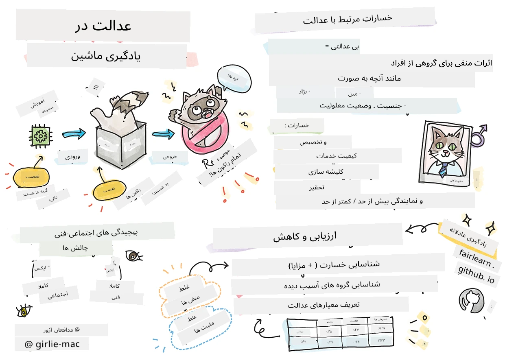
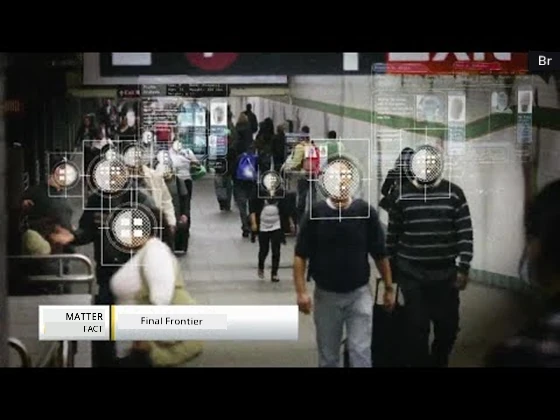

# ساخت راه‌حل‌های یادگیری ماشین با هوش مصنوعی مسئولانه
 

> اسکچ نوت از [Tomomi Imura](https://www.twitter.com/girlie_mac)

## [آزمون پیش‌درس](https://ff-quizzes.netlify.app/en/ml/)
 
## معرفی

در این برنامه آموزشی، شما شروع به کشف اینکه چگونه یادگیری ماشین می‌تواند و در زندگی روزمره ما تأثیرگذار است، خواهید کرد. حتی اکنون، سیستم‌ها و مدل‌ها در کارهای تصمیم‌گیری روزانه، مانند تشخیص‌های پزشکی، تصویب وام‌ها یا شناسایی تقلب دخیل هستند. بنابراین، مهم است که این مدل‌ها به‌خوبی کار کنند تا نتایجی قابل اعتماد ارائه دهند. همانند هر برنامه نرم‌افزاری، سیستم‌های هوش مصنوعی ممکن است انتظارات را برآورده نکنند یا نتیجه نامطلوب داشته باشند. به همین دلیل ضروری است که بتوان رفتار مدل هوش مصنوعی را فهمید و توضیح داد.

تصور کنید چه اتفاقی می‌افتد وقتی داده‌هایی که برای ساخت این مدل‌ها استفاده می‌کنید فاقد برخی جمعیت‌شناسی‌ها مانند نژاد، جنسیت، دیدگاه سیاسی، مذهب باشد یا جمعیت‌شناسی‌ها را به‌طور نامتناسبی نمایش دهد. وقتی خروجی مدل به نفع برخی جمعیت‌شناسی‌ها تفسیر شود چه؟ پیامد این برای کاربرد چیست؟ علاوه بر این، وقتی مدل نتیجه‌ای نامطلوب دارد و به افراد آسیب می‌رساند چه؟ چه کسی مسئول رفتار سیستم‌های هوش مصنوعی است؟ این‌ها برخی سوالاتی هستند که در این برنامه آموزشی بررسی خواهیم کرد.

در این درس، شما:

- آگاهی خود را نسبت به اهمیت عدالت در یادگیری ماشین و آسیب‌های مرتبط با عدالت افزایش می‌دهید.
- با تمرین بررسی موارد پرت و سناریوهای غیرمعمول برای اطمینان از قابلیت اطمینان و ایمنی آشنا می‌شوید.
- درک نیاز به توانمندسازی همه افراد با طراحی سیستم‌های فراگیر را کسب می‌کنید.
- اهمیت حفاظت از حریم خصوصی و امنیت داده‌ها و افراد را بررسی می‌کنید.
- اهمیت داشتن رویکرد جعبه شیشه‌ای برای توضیح رفتار مدل‌های هوش مصنوعی را می‌بینید.
- مراقب این باشید که چگونه مسئولیت‌پذیری برای ایجاد اعتماد در سیستم‌های هوش مصنوعی ضروری است.

## پیش‌نیاز

به عنوان پیش‌نیاز، لطفاً "اصول هوش مصنوعی مسئولانه" را از مسیر یادگیری بگذرانید و ویدیو زیر را در این موضوع مشاهده کنید:

با دنبال کردن این [مسیر یادگیری](https://docs.microsoft.com/learn/modules/responsible-ai-principles/?WT.mc_id=academic-77952-leestott) بیشتر درباره هوش مصنوعی مسئولانه بیاموزید.

> 🎥 برای ویدیو: رویکرد مایکروسافت به هوش مصنوعی مسئولانه، روی تصویر بالا کلیک کنید

## عدالت

سیستم‌های هوش مصنوعی باید با همه به طور عادلانه رفتار کنند و از تأثیرگذاری متفاوت روی گروه‌های مشابهی از مردم پرهیز کنند. به عنوان مثال، وقتی سیستم‌های هوش مصنوعی راهنمایی در مورد درمان پزشکی، درخواست وام یا استخدام ارائه می‌دهند، باید به همه با علائم، شرایط مالی یا صلاحیت‌های حرفه‌ای مشابه، توصیه‌های یکسانی بدهند. هر یک از ما به عنوان انسان‌ها دارای تعصبات به ارث برده شده‌ای هستیم که تصمیمات و اقدامات ما را تحت تأثیر قرار می‌دهند. این تعصبات ممکن است در داده‌هایی که برای آموزش سیستم‌های هوش مصنوعی استفاده می‌کنیم آشکار باشند. گاهی این دستکاری غیرفعالانه و ناخواسته اتفاق می‌افتد. اغلب دشوار است به صورت آگاهانه بدانیم که چه زمانی تعصب را در داده‌ها وارد می‌کنیم.

**«بی‌عدالتی»** شامل تأثیرات منفی یا «آسیب‌ها» بر گروهی از افراد است، مانند گروه‌هایی که بر اساس نژاد، جنسیت، سن یا وضعیت معلولیت تعریف شده‌اند. آسیب‌های اصلی مربوط به عدالت را می‌توان به شرح زیر طبقه‌بندی کرد:

- **تخصیص**، اگر به عنوان مثال جنسیت یا قومیت خاصی بر دیگری ترجیح داده شود.
- **کیفیت خدمات**. اگر داده‌ها برای یک سناریوی خاص آموزش داده شوند اما واقعیت پیچیده‌تر باشد، منجر به خدمات ضعیف می‌شود. برای مثال، یک دستگاه پخش مایع دستشویی که ظاهراً نمی‌تواند افراد با پوست تیره را تشخیص دهد. [ارجاع](https://gizmodo.com/why-cant-this-soap-dispenser-identify-dark-skin-1797931773)
- **نقد ناعادلانه**. به ناحق چیزی یا کسی را نقد و برچسب زدن. به عنوان مثال، تکنولوژی برچسب‌گذاری تصاویر بدنام، تصاویر افراد با پوست تیره را به اشتباه به عنوان گوریل برچسب زد.
- **نمایندگی بیش از حد یا کمتر از حد**. ایده این است که گروه خاصی در حرفه‌ای دیده نمی‌شود و هر خدمتی یا عملکردی که این وضعیت را تداوم می‌بخشد، به آسیب کمک می‌کند.
- **کلیشه‌سازی**. نسبت دادن ویژگی‌های پیش‌فرض به یک گروه مشخص. به عنوان مثال، سیستم ترجمه زبانی بین انگلیسی و ترکی ممکن است به دلیل کلمات با ارتباطات کلیشه‌ای جنسیتی دچار اشتباه شود.

> ترجمه به ترکی

> ترجمه بازگشت به انگلیسی

هنگام طراحی و آزمایش سیستم‌های هوش مصنوعی، باید اطمینان حاصل کنیم که هوش مصنوعی عادلانه است و برنامه‌ای برای اتخاذ تصمیمات مغرضانه یا تبعیض‌آمیز ندارد، که انسان‌ها نیز از انجام آن منع شده‌اند. تضمین عدالت در هوش مصنوعی و یادگیری ماشین همچنان یک چالش پیچیده اجتماعی-فنی است.

### قابلیت اطمینان و ایمنی

برای ایجاد اعتماد، سیستم‌های هوش مصنوعی باید قابل اطمینان، ایمن و ثابت در شرایط عادی و غیرمنتظره باشند. مهم است بدانیم سیستم‌های هوش مصنوعی چگونه در شرایط مختلف، به ویژه موارد پرت، رفتار خواهند کرد. هنگام ساخت راه‌حل‌های هوش مصنوعی باید تمرکز زیادی بر نحوه برخورد با شرایط متنوعی که سیستم ممکن است با آن روبرو شود، گذاشته شود. برای مثال، یک خودرو خودران باید ایمنی مردم را در اولویت قرار دهد. در نتیجه، هوش مصنوعی که خودرو را هدایت می‌کند باید همه سناریوهای ممکن مانند شب، رعد و برق یا بوران، کودکانی که از خیابان عبور می‌کنند، حیوانات خانگی، ساخت‌وسازهای جاده‌ای و غیره را مدنظر داشته باشد. اینکه یک سیستم هوش مصنوعی چگونه می‌تواند طیف وسیعی از شرایط را به‌طور قابل اعتماد و ایمن مدیریت کند، بازتابی از میزان پیش‌بینی دانشمند داده یا توسعه‌دهنده هوش مصنوعی در طراحی یا آزمایش سیستم است.

> [🎥 برای ویدیو اینجا کلیک کنید: ](https://www.microsoft.com/videoplayer/embed/RE4vvIl)

### جامعیت

سیستم‌های هوش مصنوعی باید به گونه‌ای طراحی شوند که همه را درگیر و توانمند کنند. هنگام طراحی و پیاده‌سازی سیستم‌های هوش مصنوعی، دانشمندان داده و توسعه‌دهندگان هوش مصنوعی موانع احتمالی در سیستم را شناسایی و برطرف می‌کنند که ممکن است به‌طور ناخواسته افراد را کنار بگذارد. به عنوان مثال، حدود یک میلیارد نفر دارای معلولیت در سراسر جهان وجود دارند. با پیشرفت هوش مصنوعی، این افراد می‌توانند دسترسی آسان‌تری به طیف گسترده‌ای از اطلاعات و فرصت‌ها در زندگی روزمره‌شان داشته باشند. با رفع این موانع، فرصت‌هایی برای نوآوری و توسعه محصولات هوش مصنوعی با تجربه بهتر که به نفع همه است ایجاد می‌شود.

> [🎥 برای ویدیوی جامعیت در هوش مصنوعی اینجا کلیک کنید](https://www.microsoft.com/videoplayer/embed/RE4vl9v)

### امنیت و حریم خصوصی

سیستم‌های هوش مصنوعی باید ایمن باشند و به حریم خصوصی افراد احترام بگذارند. مردم به سیستم‌هایی که حریم خصوصی، اطلاعات یا زندگی‌شان را به خطر می‌اندازند کمتر اعتماد می‌کنند. هنگام آموزش مدل‌های یادگیری ماشین، ما برای تولید بهترین نتایج به داده‌ها اعتماد می‌کنیم. در این فرآیند، منشأ داده و یکپارچگی آن باید مورد توجه قرار گیرد. برای مثال، آیا داده توسط کاربر ارسال شده یا به صورت عمومی در دسترس است؟ سپس، هنگام کار با داده‌ها، توسعه سیستم‌های هوش مصنوعی که بتوانند اطلاعات محرمانه را محافظت کنند و در برابر حملات مقاومت کنند، بسیار حیاتی است. با گسترش هوش مصنوعی، حفاظت از حریم خصوصی و امنیت اطلاعات شخصی و تجاری مهم‌تر و پیچیده‌تر می‌شود. مسائل مربوط به حریم خصوصی و امنیت داده‌ها نیازمند توجه ویژه برای هوش مصنوعی هستند، زیرا دسترسی به داده برای سیستم‌های هوش مصنوعی برای ارائه پیش‌بینی‌ها و تصمیمات دقیق و آگاهانه درباره افراد ضروری است.

> [🎥 برای ویدیوی امنیت در هوش مصنوعی اینجا کلیک کنید](https://www.microsoft.com/videoplayer/embed/RE4voJF)

- به عنوان یک صنعت، در زمینه حریم خصوصی و امنیت پیشرفت‌های قابل توجهی داشته‌ایم که عمدتاً توسط مقرراتی مانند GDPR (مقررات عمومی حفاظت از داده‌ها) تقویت شده است.
- اما در سیستم‌های هوش مصنوعی باید تنش بین نیاز به داده‌های شخصی بیشتر برای شخصی‌تر و مؤثرتر کردن سیستم‌ها و حفظ حریم خصوصی را بپذیریم.
- همانند تولد کامپیوترهای متصل به اینترنت، شاهد افزایش چشمگیر مسائل امنیتی مرتبط با هوش مصنوعی نیز هستیم.
- در عین حال، دیده‌ایم که هوش مصنوعی برای بهبود امنیت استفاده می‌شود. به عنوان مثال، اکثر نرم‌افزارهای ضدویروس مدرن امروزه توسط قواعد هوش مصنوعی هدایت می‌شوند.
- باید اطمینان حاصل کنیم که فرایندهای علم داده ما با آخرین شیوه‌های حریم خصوصی و امنیت هماهنگ باشد.

### شفافیت
سیستم‌های هوش مصنوعی باید قابل فهم باشند. بخش حیاتی شفافیت، توضیح رفتار سیستم‌های هوش مصنوعی و اجزای آن‌ها است. بهبود درک سیستم‌های هوش مصنوعی نیازمند آن است که سهام‌داران بفهمند چگونه و چرا این سیستم‌ها کار می‌کنند تا بتوانند مشکلات احتمالی عملکرد، نگرانی‌های ایمنی و حریم خصوصی، تعصبات، رفتارهای تبعیض‌آمیز یا نتایج ناخواسته را شناسایی کنند. همچنین معتقدیم کسانی که از سیستم‌های هوش مصنوعی استفاده می‌کنند باید درباره زمانی که، چرا و چگونه تصمیم به استفاده از آن‌ها می‌گیرند صادق و شفاف باشند. همچنین باید محدودیت‌های سیستم‌هایی که استفاده می‌کنند را بپذیرند. به عنوان مثال، اگر بانکی از سیستم هوش مصنوعی برای حمایت از تصمیمات وام‌دهی مصرف‌کنندگان استفاده می‌کند، مهم است که نتایج بررسی شده و داده‌هایی که بر توصیه‌های سیستم تأثیر می‌گذارند فهمیده شوند. دولت‌ها شروع به تنظیم مقررات هوش مصنوعی در صنایع مختلف کرده‌اند، بنابراین دانشمندان داده و سازمان‌ها باید توضیح دهند که آیا سیستم هوش مصنوعی با الزامات نظارتی مطابقت دارد، به ویژه زمانی که نتیجه نامطلوبی رخ داده است.

> [🎥 برای ویدیو شفافیت در هوش مصنوعی اینجا کلیک کنید](https://www.microsoft.com/videoplayer/embed/RE4voJF)

- به دلیل پیچیدگی سیستم‌های هوش مصنوعی، درک چگونگی کار آن‌ها و تفسیر نتایج دشوار است.
- این کمبود درک بر نحوه مدیریت، عملیاتی شدن و مستندسازی این سیستم‌ها تأثیر می‌گذارد.
- این کمبود درک بخصوص روی تصمیماتی که بر اساس نتایج این سیستم‌ها گرفته می‌شود، تأثیرگذار است.

### مسئولیت‌پذیری
 
افرادی که سیستم‌های هوش مصنوعی را طراحی و پیاده‌سازی می‌کنند باید مسئول چگونگی عملکرد سیستم‌هایشان باشند. نیاز به مسئولیت‌پذیری به ویژه برای فناوری‌های حساس مانند تشخیص چهره حیاتی است. اخیراً تقاضا برای فناوری تشخیص چهره رو به افزایش است، به خصوص از طرف سازمان‌های اجرای قانون که پتانسیل این فناوری را در مواردی مانند یافتن کودکان گمشده می‌بینند. با این حال، این فناوری‌ها می‌توانند توسط دولت‌ها برای تهدید آزادی‌های اساسی شهروندان استفاده شوند، به عنوان مثال با نظارت مداوم بر افراد خاص. بنابراین، دانشمندان داده و سازمان‌ها باید مسئول باشند که سیستم هوش مصنوعی‌شان چگونه بر افراد یا جامعه تأثیر می‌گذارد.

> 🎥 برای ویدیو: هشدارهای نظارت گسترده از طریق تشخیص چهره، روی تصویر بالا کلیک کنید

در نهایت یکی از بزرگ‌ترین سوالات نسل ما، به عنوان نسل اولی که هوش مصنوعی را به جامعه وارد می‌کند، این است که چگونه اطمینان حاصل کنیم که کامپیوترها همچنان نسبت به مردم پاسخگو باقی بمانند و چگونه اطمینان حاصل کنیم کسانی که کامپیوترها را طراحی می‌کنند نسبت به همه باقی مردم پاسخگو باشند.

## ارزیابی تاثیر

قبل از آموزش یک مدل یادگیری ماشین، مهم است که ارزیابی تأثیر انجام شود تا هدف از سیستم هوش مصنوعی، نحوه استفاده مورد نظر، محل استقرار و افرادی که با سیستم تعامل دارند، درک شود. این موارد برای ارزیابان یا تست‌کنندگان سیستم مفید است تا عوامل مورد توجه هنگام شناسایی خطرات احتمالی و پیامدهای پیش‌بینی شده را بدانند.

حوزه‌های اصلی هنگام انجام ارزیابی تأثیر عبارتند از:

* **تأثیر منفی بر افراد**. آگاهی از هرگونه محدودیت یا نیازمندی، استفاده غیرمجاز یا هر محدودیت شناخته شده که کارایی سیستم را مختل کند، برای اطمینان از عدم استفاده سیستم به روش مضر برای افراد حیاتی است.
* **نیازهای داده‌ای**. درک این که سیستم چگونه و کجا از داده استفاده می‌کند، به ارزیابان این امکان را می‌دهد که هر نیاز داده‌ای که باید رعایت شود (مانند مقررات GDPR یا HIPAA) را بررسی کنند. علاوه بر این، منبع یا مقدار داده برای آموزش کافی بودن را ارزیابی کنند.
* **خلاصه تأثیر**. فهرستی از آسیب‌های احتمالی ناشی از استفاده از سیستم جمع‌آوری کنید. در طول چرخه عمر یادگیری ماشین، بررسی کنید که آیا مسائل شناسایی شده کاهش یافته یا برطرف شده‌اند.
* **اهداف قابل اعمال** برای هر یک از شش اصل اصلی. ارزیابی کنید که آیا اهداف هر اصل برآورده شده‌اند و آیا شکاف‌هایی وجود دارد یا خیر.

## اشکال‌زدایی با هوش مصنوعی مسئولانه

مشابه اشکال‌زدایی برنامه نرم‌افزاری، اشکال‌زدایی سیستم هوش مصنوعی فرآیندی ضروری برای شناسایی و حل مشکلات در سیستم است. عوامل زیادی می‌توانند باعث شوند مدل مطابق انتظار یا به صورت مسئولانه عمل نکند. اکثر معیارهای عملکرد مدل سنتی، مقادیر عددی کلی عملکرد مدل هستند که برای تحلیل نقض اصول هوش مصنوعی مسئولانه کافی نیستند. علاوه بر این، مدل یادگیری ماشین جعبه سیاهی است که درک محرک‌های خروجی آن یا ارائه توضیح در هنگام خطا را دشوار می‌کند. در ادامه این دوره، یاد می‌گیریم چگونه از داشبورد هوش مصنوعی مسئولانه برای کمک به اشکال‌زدایی سیستم‌های هوش مصنوعی استفاده کنیم. این داشبورد ابزار جامع برای دانشمندان داده و توسعه‌دهندگان هوش مصنوعی فراهم می‌کند تا:

* **تحلیل خطا**. شناسایی توزیع خطاهای مدل که می‌تواند بر عدالت یا قابلیت اطمینان سیستم تأثیر بگذارد.
* **نمای کلی مدل**. کشف نقاط اختلاف عملکرد مدل در داده‌های گروه‌های مختلف.
* **تحلیل داده**. فهم توزیع داده‌ها و شناسایی هر گونه تعصب احتمالی که ممکن است به مشکلات عدالت، جامعیت یا قابلیت اطمینان منجر شود.
* **تفسیری بودن مدل**. درک عوامل مؤثر بر پیش‌بینی‌های مدل که به توضیح رفتار مدل، مهم برای شفافیت و مسئولیت‌پذیری کمک می‌کند.

## 🚀 چالش
 
برای جلوگیری از وارد شدن آسیب‌ها از ابتدا، باید:

- تنوعی از پیش‌زمینه‌ها و دیدگاه‌ها را در میان افرادی که روی سیستم‌ها کار می‌کنند داشته باشیم.
- در مجموعه داده‌هایی سرمایه‌گذاری کنیم که تنوع جامعه ما را منعکس کنند.
- روش‌های بهتری در طول چرخه عمر یادگیری ماشین برای شناسایی و اصلاح هوش مصنوعی مسئولانه هنگام وقوع آن توسعه دهیم.

درباره سناریوهای واقعی فکر کنید که در آن عدم اطمینان مدل در ساخت و استفاده از مدل مشخص است. چه موارد دیگری باید در نظر بگیریم؟

## [آزمون پس از درس](https://ff-quizzes.netlify.app/en/ml/)

## مرور و خودآموزی
 

در این درس، شما برخی اصول اولیه مفاهیم عدالت و بی‌عدالتی در یادگیری ماشین را یاد گرفته‌اید.  
 
برای بررسی عمیق‌تر موضوعات، این کارگاه را تماشا کنید: 

- در جستجوی هوش مصنوعی مسئولانه: به‌کارگیری اصول در عمل توسط بِسمیرا نوشی، مهرنوش سامکی و آمیـت شارما

> 🎥 برای مشاهده ویدئو، روی تصویر بالا کلیک کنید: جعبه‌ابزار هوش مصنوعی مسئولانه: چارچوب متن‌باز برای ساخت هوش مصنوعی مسئول توسط بِسمیرا نوشی، مهرنوش سامکی و آمیـت شارما

همچنین بخوانید: 

- مرکز منابع هوش مصنوعی مسئول ماکروسافت: [منابع هوش مصنوعی مسئول – Microsoft AI](https://www.microsoft.com/ai/responsible-ai-resources?activetab=pivot1%3aprimaryr4) 

- گروه پژوهشی FATE ماکروسافت: [FATE: عدالت، پاسخگویی، شفافیت و اخلاق در هوش مصنوعی - Microsoft Research](https://www.microsoft.com/research/theme/fate/) 

جعبه‌ابزار هوش مصنوعی مسئولانه: 

- [مخزن گیت‌هاب جعبه‌ابزار هوش مصنوعی مسئولانه](https://github.com/microsoft/responsible-ai-toolbox)

درباره ابزارهای Azure Machine Learning برای اطمینان از عدالت بخوانید:

- [Azure Machine Learning](https://docs.microsoft.com/azure/machine-learning/concept-fairness-ml?WT.mc_id=academic-77952-leestott) 

## تمرین

[کاوش در جعبه‌ابزار هوش مصنوعی مسئولانه](assignment.md)

---

<!-- CO-OP TRANSLATOR DISCLAIMER START -->
**سلب مسئولیت**:
این سند با استفاده از سرویس ترجمه هوش مصنوعی [Co-op Translator](https://github.com/Azure/co-op-translator) ترجمه شده است. در حالی که ما در تلاش برای دقت هستیم، لطفاً توجه داشته باشید که ترجمه‌های خودکار ممکن است شامل خطاها یا نادرستی‌هایی باشند. سند اصلی به زبان مادری خود باید به عنوان منبع معتبر در نظر گرفته شود. برای اطلاعات حیاتی، ترجمه حرفه‌ای انسانی توصیه می‌شود. ما در قبال هرگونه سوء تفاهم یا برداشت نادرست ناشی از استفاده از این ترجمه مسئولیتی نداریم.
<!-- CO-OP TRANSLATOR DISCLAIMER END -->