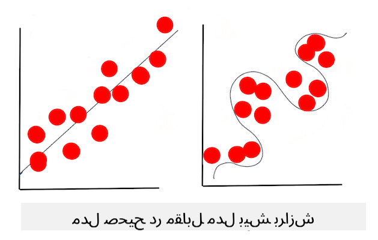

<!--
CO_OP_TRANSLATOR_METADATA:
{
  "original_hash": "dc4575225da159f2b06706e103ddba2a",
  "translation_date": "2025-09-03T23:33:47+00:00",
  "source_file": "1-Introduction/4-techniques-of-ML/README.md",
  "language_code": "fa"
}
-->
# تکنیک‌های یادگیری ماشین

فرآیند ساخت، استفاده و نگهداری مدل‌های یادگیری ماشین و داده‌هایی که از آن‌ها استفاده می‌شود، بسیار متفاوت از بسیاری از جریان‌های کاری توسعه دیگر است. در این درس، این فرآیند را روشن می‌کنیم و تکنیک‌های اصلی که باید بدانید را توضیح می‌دهیم. شما:

- فرآیندهای پایه‌ای یادگیری ماشین را در سطح بالا درک خواهید کرد.
- مفاهیم پایه‌ای مانند «مدل‌ها»، «پیش‌بینی‌ها» و «داده‌های آموزشی» را بررسی خواهید کرد.

## [پرسش‌نامه قبل از درس](https://gray-sand-07a10f403.1.azurestaticapps.net/quiz/7/)

> 🎥 برای مشاهده ویدئوی کوتاه مربوط به این درس، روی تصویر بالا کلیک کنید.

## مقدمه

در سطح بالا، هنر ایجاد فرآیندهای یادگیری ماشین (ML) شامل چندین مرحله است:

1. **تصمیم‌گیری درباره سؤال**. بیشتر فرآیندهای یادگیری ماشین با پرسیدن یک سؤال شروع می‌شوند که نمی‌توان آن را با یک برنامه شرطی ساده یا موتور مبتنی بر قوانین پاسخ داد. این سؤالات اغلب حول پیش‌بینی‌هایی بر اساس مجموعه‌ای از داده‌ها می‌چرخند.
2. **جمع‌آوری و آماده‌سازی داده‌ها**. برای پاسخ دادن به سؤال خود، به داده نیاز دارید. کیفیت و گاهی اوقات کمیت داده‌های شما تعیین می‌کند که چقدر می‌توانید به سؤال اولیه خود پاسخ دهید. تجسم داده‌ها جنبه مهمی از این مرحله است. این مرحله همچنین شامل تقسیم داده‌ها به گروه‌های آموزشی و آزمایشی برای ساخت مدل است.
3. **انتخاب روش آموزشی**. بسته به سؤال شما و ماهیت داده‌هایتان، باید انتخاب کنید که چگونه می‌خواهید مدلی بسازید که بهترین بازتاب داده‌های شما باشد و پیش‌بینی‌های دقیقی بر اساس آن انجام دهد. این بخش از فرآیند یادگیری ماشین نیاز به تخصص خاص و اغلب مقدار قابل توجهی آزمایش دارد.
4. **آموزش مدل**. با استفاده از داده‌های آموزشی، از الگوریتم‌های مختلف برای آموزش مدل استفاده می‌کنید تا الگوهای موجود در داده‌ها را شناسایی کند. مدل ممکن است از وزن‌های داخلی استفاده کند که می‌توان آن‌ها را تنظیم کرد تا بخش‌های خاصی از داده‌ها را نسبت به دیگران ترجیح دهد و مدل بهتری بسازد.
5. **ارزیابی مدل**. از داده‌هایی که قبلاً دیده نشده‌اند (داده‌های آزمایشی) از مجموعه جمع‌آوری‌شده خود استفاده می‌کنید تا ببینید مدل چگونه عمل می‌کند.
6. **تنظیم پارامترها**. بر اساس عملکرد مدل خود، می‌توانید فرآیند را با استفاده از پارامترها یا متغیرهای مختلفی که رفتار الگوریتم‌های مورد استفاده برای آموزش مدل را کنترل می‌کنند، دوباره انجام دهید.
7. **پیش‌بینی**. از ورودی‌های جدید برای آزمایش دقت مدل خود استفاده کنید.

## چه سؤالی باید پرسید؟

کامپیوترها به‌طور خاص در کشف الگوهای پنهان در داده‌ها مهارت دارند. این قابلیت برای محققانی که سؤالاتی درباره یک حوزه خاص دارند که نمی‌توان به راحتی با ایجاد یک موتور مبتنی بر قوانین شرطی پاسخ داد، بسیار مفید است. برای مثال، در یک وظیفه بیمه‌ای، یک دانشمند داده ممکن است بتواند قوانین دستی درباره مرگ و میر افراد سیگاری در مقابل غیرسیگاری‌ها ایجاد کند.

با این حال، وقتی متغیرهای زیادی وارد معادله می‌شوند، یک مدل یادگیری ماشین ممکن است برای پیش‌بینی نرخ مرگ و میر آینده بر اساس تاریخچه سلامت گذشته کارآمدتر باشد. یک مثال شادتر ممکن است پیش‌بینی آب و هوا برای ماه آوریل در یک مکان خاص باشد که بر اساس داده‌هایی شامل عرض جغرافیایی، طول جغرافیایی، تغییرات آب و هوایی، نزدیکی به اقیانوس، الگوهای جریان جت و موارد دیگر انجام می‌شود.

✅ این [اسلایدها](https://www2.cisl.ucar.edu/sites/default/files/2021-10/0900%20June%2024%20Haupt_0.pdf) درباره مدل‌های آب و هوا، دیدگاه تاریخی برای استفاده از یادگیری ماشین در تحلیل آب و هوا ارائه می‌دهند.

## وظایف پیش از ساخت

قبل از شروع به ساخت مدل خود، چندین وظیفه وجود دارد که باید انجام دهید. برای آزمایش سؤال خود و ایجاد یک فرضیه بر اساس پیش‌بینی‌های مدل، باید چندین عنصر را شناسایی و تنظیم کنید.

### داده‌ها

برای پاسخ دادن به سؤال خود با هر نوع قطعیتی، به مقدار مناسبی از داده‌های مناسب نیاز دارید. در این مرحله دو کار باید انجام دهید:

- **جمع‌آوری داده‌ها**. با توجه به درس قبلی درباره انصاف در تحلیل داده‌ها، داده‌های خود را با دقت جمع‌آوری کنید. از منابع این داده‌ها، هرگونه تعصب ذاتی که ممکن است داشته باشند، آگاه باشید و منشأ آن‌ها را مستند کنید.
- **آماده‌سازی داده‌ها**. فرآیند آماده‌سازی داده‌ها شامل چندین مرحله است. ممکن است نیاز باشد داده‌ها را جمع‌آوری و نرمال‌سازی کنید اگر از منابع متنوعی آمده باشند. می‌توانید کیفیت و کمیت داده‌ها را از طریق روش‌های مختلفی مانند تبدیل رشته‌ها به اعداد (همان‌طور که در [خوشه‌بندی](../../5-Clustering/1-Visualize/README.md) انجام می‌دهیم) بهبود دهید. همچنین ممکن است داده‌های جدیدی بر اساس داده‌های اصلی تولید کنید (همان‌طور که در [طبقه‌بندی](../../4-Classification/1-Introduction/README.md) انجام می‌دهیم). می‌توانید داده‌ها را پاک‌سازی و ویرایش کنید (همان‌طور که قبل از درس [برنامه وب](../../3-Web-App/README.md) انجام خواهیم داد). در نهایت، ممکن است نیاز باشد داده‌ها را تصادفی‌سازی و مخلوط کنید، بسته به تکنیک‌های آموزشی خود.

✅ پس از جمع‌آوری و پردازش داده‌های خود، لحظه‌ای وقت بگذارید تا ببینید آیا شکل آن‌ها به شما اجازه می‌دهد سؤال مورد نظر خود را پاسخ دهید یا خیر. ممکن است داده‌ها در وظیفه مورد نظر شما عملکرد خوبی نداشته باشند، همان‌طور که در درس‌های [خوشه‌بندی](../../5-Clustering/1-Visualize/README.md) کشف می‌کنیم!

### ویژگی‌ها و هدف

یک [ویژگی](https://www.datasciencecentral.com/profiles/blogs/an-introduction-to-variable-and-feature-selection) یک خاصیت قابل اندازه‌گیری از داده‌های شما است. در بسیاری از مجموعه داده‌ها، به‌صورت عنوان ستون مانند «تاریخ»، «اندازه» یا «رنگ» بیان می‌شود. متغیر ویژگی شما، که معمولاً در کد به‌صورت `X` نشان داده می‌شود، متغیر ورودی است که برای آموزش مدل استفاده خواهد شد.

هدف چیزی است که شما سعی دارید پیش‌بینی کنید. هدف که معمولاً به‌صورت `y` در کد نشان داده می‌شود، پاسخ به سؤالی است که شما سعی دارید از داده‌های خود بپرسید: در ماه دسامبر، کدو تنبل‌های ارزان‌تر چه **رنگی** خواهند داشت؟ در سان‌فرانسیسکو، کدام محله‌ها بهترین **قیمت** املاک را خواهند داشت؟ گاهی هدف به‌عنوان ویژگی برچسب نیز شناخته می‌شود.

### انتخاب متغیر ویژگی

🎓 **انتخاب ویژگی و استخراج ویژگی** چگونه می‌دانید کدام متغیر را هنگام ساخت مدل انتخاب کنید؟ احتمالاً فرآیند انتخاب ویژگی یا استخراج ویژگی را طی خواهید کرد تا متغیرهای مناسب برای بهترین مدل را انتخاب کنید. با این حال، آن‌ها یکسان نیستند: «استخراج ویژگی ویژگی‌های جدیدی از توابع ویژگی‌های اصلی ایجاد می‌کند، در حالی که انتخاب ویژگی یک زیرمجموعه از ویژگی‌ها را بازمی‌گرداند.» ([منبع](https://wikipedia.org/wiki/Feature_selection))

### تجسم داده‌های خود

یکی از جنبه‌های مهم ابزارهای دانشمند داده، قدرت تجسم داده‌ها با استفاده از چندین کتابخانه عالی مانند Seaborn یا MatPlotLib است. نمایش داده‌های خود به‌صورت بصری ممکن است به شما اجازه دهد تا همبستگی‌های پنهانی را کشف کنید که می‌توانید از آن‌ها استفاده کنید. تجسم‌های شما ممکن است به شما کمک کنند تا تعصب یا داده‌های نامتعادل را کشف کنید (همان‌طور که در [طبقه‌بندی](../../4-Classification/2-Classifiers-1/README.md) کشف می‌کنیم).

### تقسیم مجموعه داده

قبل از آموزش، باید مجموعه داده خود را به دو یا چند بخش با اندازه‌های نابرابر تقسیم کنید که همچنان داده‌ها را به‌خوبی نمایندگی کنند.

- **آموزشی**. این بخش از مجموعه داده برای آموزش مدل شما استفاده می‌شود. این مجموعه بخش عمده‌ای از مجموعه داده اصلی را تشکیل می‌دهد.
- **آزمایشی**. مجموعه داده آزمایشی یک گروه مستقل از داده‌ها است، که اغلب از داده‌های اصلی جمع‌آوری شده است، که برای تأیید عملکرد مدل ساخته شده استفاده می‌کنید.
- **اعتباریابی**. مجموعه اعتباریابی یک گروه کوچک‌تر مستقل از نمونه‌ها است که برای تنظیم پارامترهای مدل یا معماری آن استفاده می‌کنید تا مدل را بهبود دهید. بسته به اندازه داده‌های شما و سؤالی که می‌پرسید، ممکن است نیازی به ساخت این مجموعه سوم نداشته باشید (همان‌طور که در [پیش‌بینی سری زمانی](../../7-TimeSeries/1-Introduction/README.md) اشاره می‌کنیم).

## ساخت مدل

با استفاده از داده‌های آموزشی، هدف شما ساخت یک مدل یا نمای آماری از داده‌های خود است که با استفاده از الگوریتم‌های مختلف آن را **آموزش** می‌دهید. آموزش مدل آن را در معرض داده‌ها قرار می‌دهد و به آن اجازه می‌دهد فرضیاتی درباره الگوهای مشاهده‌شده ایجاد کند، آن‌ها را تأیید کند و بپذیرد یا رد کند.

### تصمیم‌گیری درباره روش آموزشی

بسته به سؤال شما و ماهیت داده‌های شما، روشی برای آموزش آن انتخاب خواهید کرد. با مرور [مستندات Scikit-learn](https://scikit-learn.org/stable/user_guide.html) - که در این دوره استفاده می‌کنیم - می‌توانید روش‌های مختلفی برای آموزش مدل را بررسی کنید. بسته به تجربه شما، ممکن است مجبور شوید چندین روش مختلف را امتحان کنید تا بهترین مدل را بسازید. احتمالاً فرآیندی را طی خواهید کرد که در آن دانشمندان داده عملکرد مدل را با تغذیه داده‌های دیده‌نشده ارزیابی می‌کنند، دقت، تعصب و سایر مسائل کاهش‌دهنده کیفیت را بررسی می‌کنند و مناسب‌ترین روش آموزشی را برای وظیفه مورد نظر انتخاب می‌کنند.

### آموزش مدل

با داشتن داده‌های آموزشی، آماده هستید تا آن را «تناسب» دهید و یک مدل ایجاد کنید. متوجه خواهید شد که در بسیاری از کتابخانه‌های یادگیری ماشین کدی به نام 'model.fit' وجود دارد - در این زمان است که متغیر ویژگی خود را به‌صورت آرایه‌ای از مقادیر (معمولاً 'X') و یک متغیر هدف (معمولاً 'y') ارسال می‌کنید.

### ارزیابی مدل

پس از تکمیل فرآیند آموزش (ممکن است برای آموزش یک مدل بزرگ چندین تکرار یا «دوره» طول بکشد)، قادر خواهید بود کیفیت مدل را با استفاده از داده‌های آزمایشی برای سنجش عملکرد آن ارزیابی کنید. این داده‌ها زیرمجموعه‌ای از داده‌های اصلی هستند که مدل قبلاً آن‌ها را تحلیل نکرده است. می‌توانید جدولی از معیارهای مربوط به کیفیت مدل خود چاپ کنید.

🎓 **تناسب مدل**

در زمینه یادگیری ماشین، تناسب مدل به دقت عملکرد زیرین مدل اشاره دارد که تلاش می‌کند داده‌هایی را که با آن‌ها آشنا نیست تحلیل کند.

🎓 **تناسب کم** و **تناسب بیش از حد** مشکلات رایجی هستند که کیفیت مدل را کاهش می‌دهند، زیرا مدل یا به اندازه کافی خوب تناسب ندارد یا بیش از حد تناسب دارد. این باعث می‌شود مدل پیش‌بینی‌هایی انجام دهد که یا بیش از حد با داده‌های آموزشی هماهنگ هستند یا خیلی کم هماهنگ هستند. یک مدل با تناسب بیش از حد داده‌های آموزشی را بیش از حد خوب پیش‌بینی می‌کند زیرا جزئیات و نویز داده‌ها را بیش از حد خوب یاد گرفته است. یک مدل با تناسب کم دقیق نیست زیرا نمی‌تواند داده‌های آموزشی خود یا داده‌هایی که هنوز «ندیده» است را به‌درستی تحلیل کند.

> اینفوگرافیک توسط [Jen Looper](https://twitter.com/jenlooper)

## تنظیم پارامترها

پس از تکمیل آموزش اولیه، کیفیت مدل را مشاهده کنید و بهبود آن را با تنظیم «ابرپارامترهای» آن در نظر بگیرید. درباره این فرآیند بیشتر بخوانید [در مستندات](https://docs.microsoft.com/en-us/azure/machine-learning/how-to-tune-hyperparameters?WT.mc_id=academic-77952-leestott).

## پیش‌بینی

این لحظه‌ای است که می‌توانید از داده‌های کاملاً جدید برای آزمایش دقت مدل خود استفاده کنید. در یک تنظیم یادگیری ماشین «کاربردی»، جایی که شما دارایی‌های وب را برای استفاده از مدل در تولید می‌سازید، این فرآیند ممکن است شامل جمع‌آوری ورودی کاربر (برای مثال فشار دادن یک دکمه) برای تنظیم یک متغیر و ارسال آن به مدل برای استنتاج یا ارزیابی باشد.

در این درس‌ها، شما کشف خواهید کرد که چگونه از این مراحل برای آماده‌سازی، ساخت، آزمایش، ارزیابی و پیش‌بینی استفاده کنید - تمام حرکات یک دانشمند داده و بیشتر، همان‌طور که در سفر خود برای تبدیل شدن به یک مهندس یادگیری ماشین «تمام‌عیار» پیشرفت می‌کنید.

---

## 🚀چالش

یک نمودار جریان رسم کنید که مراحل یک متخصص یادگیری ماشین را نشان دهد. در حال حاضر خود را در کدام مرحله می‌بینید؟ پیش‌بینی می‌کنید کجا با دشواری مواجه شوید؟ چه چیزی به نظر شما آسان می‌آید؟

## [پرسش‌نامه بعد از درس](https://gray-sand-07a10f403.1.azurestaticapps.net/quiz/8/)

## مرور و مطالعه شخصی

به‌صورت آنلاین به دنبال مصاحبه‌هایی با دانشمندان داده بگردید که درباره کار روزانه خود صحبت می‌کنند. اینجا [یکی](https://www.youtube.com/watch?v=Z3IjgbbCEfs) از آن‌ها است.

## تکلیف

[مصاحبه با یک دانشمند داده](assignment.md)

---

**سلب مسئولیت**:  
این سند با استفاده از سرویس ترجمه هوش مصنوعی [Co-op Translator](https://github.com/Azure/co-op-translator) ترجمه شده است. در حالی که ما برای دقت تلاش می‌کنیم، لطفاً توجه داشته باشید که ترجمه‌های خودکار ممکن است شامل خطاها یا نادرستی‌هایی باشند. سند اصلی به زبان اصلی آن باید به عنوان منبع معتبر در نظر گرفته شود. برای اطلاعات حساس، ترجمه حرفه‌ای انسانی توصیه می‌شود. ما هیچ مسئولیتی در قبال سوءتفاهم‌ها یا تفسیرهای نادرست ناشی از استفاده از این ترجمه نداریم.