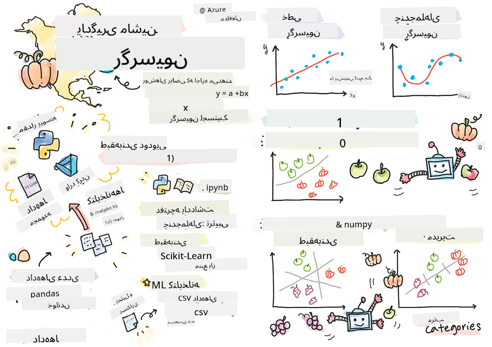
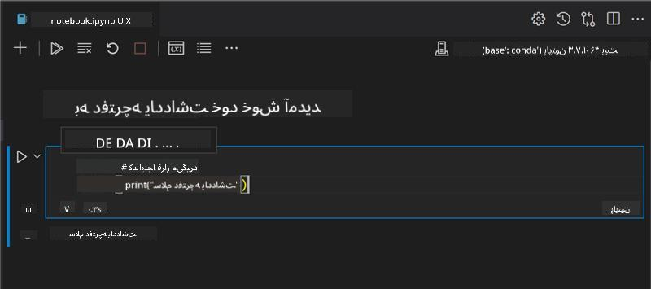
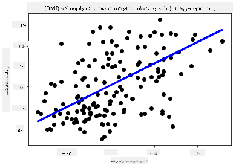

<!--
CO_OP_TRANSLATOR_METADATA:
{
  "original_hash": "6b1cb0e46d4c5b747eff6e3607642760",
  "translation_date": "2025-09-03T22:34:35+00:00",
  "source_file": "2-Regression/1-Tools/README.md",
  "language_code": "fa"
}
-->
# شروع کار با پایتون و Scikit-learn برای مدل‌های رگرسیون



> اسکچ‌نوت توسط [Tomomi Imura](https://www.twitter.com/girlie_mac)

## [آزمون پیش از درس](https://gray-sand-07a10f403.1.azurestaticapps.net/quiz/9/)

> ### [این درس به زبان R نیز موجود است!](../../../../2-Regression/1-Tools/solution/R/lesson_1.html)

## مقدمه

در این چهار درس، یاد می‌گیرید که چگونه مدل‌های رگرسیون بسازید. به زودی در مورد کاربردهای آن صحبت خواهیم کرد. اما قبل از هر کاری، مطمئن شوید که ابزارهای مناسب برای شروع فرآیند را در اختیار دارید!

در این درس، یاد می‌گیرید که چگونه:

- کامپیوتر خود را برای انجام وظایف یادگیری ماشین محلی تنظیم کنید.
- با نوت‌بوک‌های Jupyter کار کنید.
- از Scikit-learn استفاده کنید، از جمله نصب آن.
- با یک تمرین عملی، رگرسیون خطی را بررسی کنید.

## نصب‌ها و تنظیمات

[](https://youtu.be/-DfeD2k2Kj0 "یادگیری ماشین برای مبتدیان - آماده‌سازی ابزارها برای ساخت مدل‌های یادگیری ماشین")

> 🎥 روی تصویر بالا کلیک کنید تا ویدیوی کوتاهی درباره تنظیم کامپیوتر برای یادگیری ماشین مشاهده کنید.

1. **پایتون را نصب کنید.** مطمئن شوید که [پایتون](https://www.python.org/downloads/) روی کامپیوتر شما نصب شده است. شما از پایتون برای بسیاری از وظایف داده‌کاوی و یادگیری ماشین استفاده خواهید کرد. اکثر سیستم‌های کامپیوتری از قبل نصب پایتون را دارند. همچنین [بسته‌های کدنویسی پایتون](https://code.visualstudio.com/learn/educators/installers?WT.mc_id=academic-77952-leestott) مفیدی وجود دارند که برای برخی کاربران فرآیند نصب را آسان‌تر می‌کنند.

   با این حال، برخی از کاربردهای پایتون به یک نسخه خاص از نرم‌افزار نیاز دارند، در حالی که برخی دیگر به نسخه دیگری نیاز دارند. به همین دلیل، کار در یک [محیط مجازی](https://docs.python.org/3/library/venv.html) مفید است.

2. **نصب Visual Studio Code.** مطمئن شوید که Visual Studio Code روی کامپیوتر شما نصب شده است. این دستورالعمل‌ها را برای [نصب Visual Studio Code](https://code.visualstudio.com/) دنبال کنید. شما در این دوره از پایتون در Visual Studio Code استفاده خواهید کرد، بنابراین ممکن است بخواهید نحوه [پیکربندی Visual Studio Code](https://docs.microsoft.com/learn/modules/python-install-vscode?WT.mc_id=academic-77952-leestott) برای توسعه پایتون را مرور کنید.

   > با کار کردن روی این مجموعه از [ماژول‌های یادگیری](https://docs.microsoft.com/users/jenlooper-2911/collections/mp1pagggd5qrq7?WT.mc_id=academic-77952-leestott) با پایتون راحت‌تر شوید.
   >
   > [](https://youtu.be/yyQM70vi7V8 "تنظیم پایتون با Visual Studio Code")
   >
   > 🎥 روی تصویر بالا کلیک کنید تا ویدیویی درباره استفاده از پایتون در VS Code مشاهده کنید.

3. **نصب Scikit-learn.** با دنبال کردن [این دستورالعمل‌ها](https://scikit-learn.org/stable/install.html) Scikit-learn را نصب کنید. از آنجا که باید از پایتون 3 استفاده کنید، توصیه می‌شود از یک محیط مجازی استفاده کنید. توجه داشته باشید که اگر این کتابخانه را روی یک مک M1 نصب می‌کنید، دستورالعمل‌های خاصی در صفحه لینک شده وجود دارد.

4. **نصب Jupyter Notebook.** شما باید [بسته Jupyter](https://pypi.org/project/jupyter/) را نصب کنید.

## محیط نویسندگی یادگیری ماشین شما

شما از **نوت‌بوک‌ها** برای توسعه کد پایتون و ایجاد مدل‌های یادگیری ماشین استفاده خواهید کرد. این نوع فایل ابزاری رایج برای دانشمندان داده است و با پسوند `.ipynb` شناسایی می‌شود.

نوت‌بوک‌ها محیطی تعاملی هستند که به توسعه‌دهنده اجازه می‌دهند هم کدنویسی کنند و هم یادداشت‌ها و مستندات مربوط به کد را اضافه کنند، که برای پروژه‌های تحقیقاتی یا آزمایشی بسیار مفید است.

[](https://youtu.be/7E-jC8FLA2E "یادگیری ماشین برای مبتدیان - تنظیم Jupyter Notebooks برای شروع ساخت مدل‌های رگرسیون")

> 🎥 روی تصویر بالا کلیک کنید تا ویدیوی کوتاهی درباره این تمرین مشاهده کنید.

### تمرین - کار با یک نوت‌بوک

در این پوشه، فایل _notebook.ipynb_ را پیدا خواهید کرد.

1. فایل _notebook.ipynb_ را در Visual Studio Code باز کنید.

   یک سرور Jupyter با پایتون 3+ راه‌اندازی خواهد شد. در نوت‌بوک بخش‌هایی وجود دارد که می‌توانید آن‌ها را `اجرا` کنید، یعنی قطعات کد. می‌توانید یک بلوک کد را با انتخاب آیکونی که شبیه دکمه پخش است اجرا کنید.

2. آیکون `md` را انتخاب کنید و کمی متن مارک‌داون اضافه کنید، مانند متن زیر: **# به نوت‌بوک خود خوش آمدید**.

   سپس کمی کد پایتون اضافه کنید.

3. در بلوک کد تایپ کنید: **print('hello notebook')**.
4. فلش را برای اجرای کد انتخاب کنید.

   باید عبارت چاپ شده را ببینید:

    ```output
    hello notebook
    ```



می‌توانید کد خود را با یادداشت‌هایی ترکیب کنید تا نوت‌بوک را خودمستند کنید.

✅ برای یک لحظه فکر کنید که محیط کاری یک توسعه‌دهنده وب چقدر با محیط یک دانشمند داده متفاوت است.

## شروع به کار با Scikit-learn

حالا که پایتون در محیط محلی شما تنظیم شده و با نوت‌بوک‌های Jupyter راحت هستید، بیایید با Scikit-learn نیز آشنا شویم. Scikit-learn (که به صورت `سای` مانند `ساینس` تلفظ می‌شود) یک [API گسترده](https://scikit-learn.org/stable/modules/classes.html#api-ref) ارائه می‌دهد که به شما در انجام وظایف یادگیری ماشین کمک می‌کند.

طبق گفته [وب‌سایت آن‌ها](https://scikit-learn.org/stable/getting_started.html)، "Scikit-learn یک کتابخانه یادگیری ماشین متن‌باز است که از یادگیری نظارت‌شده و بدون نظارت پشتیبانی می‌کند. همچنین ابزارهای مختلفی برای برازش مدل، پیش‌پردازش داده‌ها، انتخاب مدل و ارزیابی، و بسیاری از امکانات دیگر ارائه می‌دهد."

در این دوره، از Scikit-learn و ابزارهای دیگر برای ساخت مدل‌های یادگیری ماشین استفاده خواهید کرد تا وظایفی را که به آن‌ها "یادگیری ماشین سنتی" می‌گوییم انجام دهید. ما عمداً از شبکه‌های عصبی و یادگیری عمیق اجتناب کرده‌ایم، زیرا این موضوعات در دوره "هوش مصنوعی برای مبتدیان" ما بهتر پوشش داده می‌شوند.

Scikit-learn ساخت مدل‌ها و ارزیابی آن‌ها را برای استفاده آسان می‌کند. این کتابخانه عمدتاً بر استفاده از داده‌های عددی تمرکز دارد و شامل چندین مجموعه داده آماده برای استفاده به عنوان ابزارهای یادگیری است. همچنین مدل‌های از پیش ساخته شده‌ای برای دانشجویان دارد تا آن‌ها را امتحان کنند. بیایید فرآیند بارگذاری داده‌های از پیش بسته‌بندی شده و استفاده از یک تخمین‌گر برای اولین مدل یادگیری ماشین با Scikit-learn را با داده‌های پایه بررسی کنیم.

## تمرین - اولین نوت‌بوک Scikit-learn شما

> این آموزش از [مثال رگرسیون خطی](https://scikit-learn.org/stable/auto_examples/linear_model/plot_ols.html#sphx-glr-auto-examples-linear-model-plot-ols-py) در وب‌سایت Scikit-learn الهام گرفته شده است.

[](https://youtu.be/2xkXL5EUpS0 "یادگیری ماشین برای مبتدیان - اولین پروژه رگرسیون خطی شما در پایتون")

> 🎥 روی تصویر بالا کلیک کنید تا ویدیوی کوتاهی درباره این تمرین مشاهده کنید.

در فایل _notebook.ipynb_ مرتبط با این درس، تمام سلول‌ها را با فشار دادن آیکون "سطل زباله" پاک کنید.

در این بخش، با یک مجموعه داده کوچک درباره دیابت که در Scikit-learn برای اهداف آموزشی ساخته شده است کار خواهید کرد. تصور کنید که می‌خواهید یک درمان برای بیماران دیابتی آزمایش کنید. مدل‌های یادگیری ماشین ممکن است به شما کمک کنند تعیین کنید کدام بیماران بر اساس ترکیب متغیرها بهتر به درمان پاسخ می‌دهند. حتی یک مدل رگرسیون بسیار ساده، زمانی که به صورت تصویری نمایش داده شود، ممکن است اطلاعاتی درباره متغیرهایی ارائه دهد که به شما در سازماندهی آزمایش‌های بالینی نظری کمک کند.

✅ روش‌های مختلفی برای رگرسیون وجود دارد و انتخاب شما بستگی به سوالی دارد که می‌خواهید پاسخ دهید. اگر می‌خواهید قد احتمالی یک فرد با توجه به سن او را پیش‌بینی کنید، از رگرسیون خطی استفاده می‌کنید، زیرا به دنبال یک **مقدار عددی** هستید. اگر می‌خواهید بدانید که آیا یک نوع غذا باید به عنوان وگان در نظر گرفته شود یا نه، به دنبال **تخصیص دسته‌بندی** هستید، بنابراین از رگرسیون لجستیک استفاده می‌کنید. بعداً درباره رگرسیون لجستیک بیشتر یاد خواهید گرفت. کمی فکر کنید که چه سوالاتی می‌توانید از داده‌ها بپرسید و کدام یک از این روش‌ها مناسب‌تر است.

بیایید این کار را شروع کنیم.

### وارد کردن کتابخانه‌ها

برای این کار، برخی کتابخانه‌ها را وارد می‌کنیم:

- **matplotlib**. این یک [ابزار گرافیکی](https://matplotlib.org/) مفید است و از آن برای ایجاد نمودار خطی استفاده خواهیم کرد.
- **numpy**. [numpy](https://numpy.org/doc/stable/user/whatisnumpy.html) یک کتابخانه مفید برای کار با داده‌های عددی در پایتون است.
- **sklearn**. این همان کتابخانه [Scikit-learn](https://scikit-learn.org/stable/user_guide.html) است.

برخی کتابخانه‌ها را برای کمک به وظایف خود وارد کنید.

1. واردات را با تایپ کد زیر اضافه کنید:

   ```python
   import matplotlib.pyplot as plt
   import numpy as np
   from sklearn import datasets, linear_model, model_selection
   ```

   در کد بالا، `matplotlib` و `numpy` را وارد می‌کنید و `datasets`، `linear_model` و `model_selection` را از `sklearn` وارد می‌کنید. `model_selection` برای تقسیم داده‌ها به مجموعه‌های آموزشی و آزمایشی استفاده می‌شود.

### مجموعه داده دیابت

مجموعه داده [دیابت](https://scikit-learn.org/stable/datasets/toy_dataset.html#diabetes-dataset) شامل 442 نمونه داده درباره دیابت است که دارای 10 متغیر ویژگی است. برخی از این متغیرها عبارتند از:

- سن: سن به سال
- شاخص توده بدنی (BMI)
- فشار خون متوسط (BP)
- سلول‌های T: نوعی از گلبول‌های سفید خون

✅ این مجموعه داده شامل مفهوم "جنسیت" به عنوان یک متغیر ویژگی است که در تحقیقات مربوط به دیابت مهم است. بسیاری از مجموعه داده‌های پزشکی شامل این نوع طبقه‌بندی باینری هستند. کمی فکر کنید که چگونه چنین دسته‌بندی‌هایی ممکن است بخش‌هایی از جمعیت را از درمان‌ها مستثنی کنند.

حالا داده‌های X و y را بارگذاری کنید.

> 🎓 به یاد داشته باشید، این یادگیری نظارت‌شده است و ما به یک هدف نام‌گذاری شده 'y' نیاز داریم.

در یک سلول کد جدید، مجموعه داده دیابت را با فراخوانی `load_diabetes()` بارگذاری کنید. ورودی `return_X_y=True` نشان می‌دهد که `X` یک ماتریس داده و `y` هدف رگرسیون خواهد بود.

1. چند دستور چاپ اضافه کنید تا شکل ماتریس داده و اولین عنصر آن را نشان دهید:

    ```python
    X, y = datasets.load_diabetes(return_X_y=True)
    print(X.shape)
    print(X[0])
    ```

    چیزی که به عنوان پاسخ دریافت می‌کنید، یک تاپل است. کاری که انجام می‌دهید این است که دو مقدار اول تاپل را به ترتیب به `X` و `y` اختصاص می‌دهید. درباره [تاپل‌ها](https://wikipedia.org/wiki/Tuple) بیشتر بیاموزید.

    می‌توانید ببینید که این داده‌ها شامل 442 آیتم هستند که به صورت آرایه‌هایی با 10 عنصر شکل گرفته‌اند:

    ```text
    (442, 10)
    [ 0.03807591  0.05068012  0.06169621  0.02187235 -0.0442235  -0.03482076
    -0.04340085 -0.00259226  0.01990842 -0.01764613]
    ```

    ✅ کمی درباره رابطه بین داده‌ها و هدف رگرسیون فکر کنید. رگرسیون خطی روابط بین ویژگی X و متغیر هدف y را پیش‌بینی می‌کند. آیا می‌توانید [هدف](https://scikit-learn.org/stable/datasets/toy_dataset.html#diabetes-dataset) مجموعه داده دیابت را در مستندات پیدا کنید؟ این مجموعه داده چه چیزی را نشان می‌دهد، با توجه به هدف؟

2. در مرحله بعد، بخشی از این مجموعه داده را برای رسم انتخاب کنید. این کار را با انتخاب ستون سوم مجموعه داده انجام دهید. می‌توانید این کار را با استفاده از عملگر `:` برای انتخاب تمام سطرها و سپس انتخاب ستون سوم با استفاده از شاخص (2) انجام دهید. همچنین می‌توانید داده‌ها را به صورت آرایه 2 بعدی تغییر شکل دهید - همانطور که برای رسم لازم است - با استفاده از `reshape(n_rows, n_columns)`. اگر یکی از پارامترها -1 باشد، بعد مربوطه به طور خودکار محاسبه می‌شود.

   ```python
   X = X[:, 2]
   X = X.reshape((-1,1))
   ```

   ✅ در هر زمان، داده‌ها را چاپ کنید تا شکل آن‌ها را بررسی کنید.

3. حالا که داده‌ها آماده رسم هستند، می‌توانید ببینید آیا یک ماشین می‌تواند یک تقسیم منطقی بین اعداد در این مجموعه داده تعیین کند. برای این کار، باید هم داده‌ها (X) و هم هدف (y) را به مجموعه‌های آزمایشی و آموزشی تقسیم کنید. Scikit-learn یک روش ساده برای انجام این کار دارد؛ می‌توانید داده‌های آزمایشی خود را در یک نقطه مشخص تقسیم کنید.

   ```python
   X_train, X_test, y_train, y_test = model_selection.train_test_split(X, y, test_size=0.33)
   ```

4. حالا آماده آموزش مدل خود هستید! مدل رگرسیون خطی را بارگذاری کنید و آن را با مجموعه‌های آموزشی X و y خود با استفاده از `model.fit()` آموزش دهید:

    ```python
    model = linear_model.LinearRegression()
    model.fit(X_train, y_train)
    ```

    ✅ `model.fit()` یک تابع است که در بسیاری از کتابخانه‌های یادگیری ماشین مانند TensorFlow مشاهده خواهید کرد.

5. سپس، با استفاده از داده‌های آزمایشی، یک پیش‌بینی ایجاد کنید. این پیش‌بینی برای رسم خط بین گروه‌های داده استفاده خواهد شد.

    ```python
    y_pred = model.predict(X_test)
    ```

6. حالا وقت آن است که داده‌ها را در یک نمودار نشان دهید. Matplotlib ابزاری بسیار مفید برای این کار است. یک نمودار پراکندگی از تمام داده‌های آزمایشی X و y ایجاد کنید و از پیش‌بینی برای رسم خط در مناسب‌ترین مکان بین گروه‌های داده مدل استفاده کنید.

    ```python
    plt.scatter(X_test, y_test,  color='black')
    plt.plot(X_test, y_pred, color='blue', linewidth=3)
    plt.xlabel('Scaled BMIs')
    plt.ylabel('Disease Progression')
    plt.title('A Graph Plot Showing Diabetes Progression Against BMI')
    plt.show()
    ```

   
✅ کمی فکر کنید که اینجا چه اتفاقی می‌افتد. یک خط مستقیم از میان نقاط کوچک زیادی از داده عبور می‌کند، اما دقیقاً چه کاری انجام می‌دهد؟ آیا می‌توانید ببینید که چگونه باید بتوانید از این خط برای پیش‌بینی محل قرارگیری یک نقطه داده جدید و دیده‌نشده در رابطه با محور y نمودار استفاده کنید؟ سعی کنید کاربرد عملی این مدل را به زبان بیاورید.

تبریک می‌گویم، شما اولین مدل رگرسیون خطی خود را ساختید، با آن یک پیش‌بینی انجام دادید و آن را در یک نمودار نمایش دادید!

---
## 🚀چالش

یک متغیر متفاوت از این مجموعه داده را رسم کنید. نکته: این خط را ویرایش کنید: `X = X[:,2]`. با توجه به هدف این مجموعه داده، چه چیزی می‌توانید درباره پیشرفت بیماری دیابت کشف کنید؟

## [آزمون پس از درس](https://gray-sand-07a10f403.1.azurestaticapps.net/quiz/10/)

## مرور و مطالعه شخصی

در این آموزش، شما با رگرسیون خطی ساده کار کردید، نه رگرسیون تک‌متغیره یا چندمتغیره. کمی درباره تفاوت‌های این روش‌ها بخوانید یا به [این ویدیو](https://www.coursera.org/lecture/quantifying-relationships-regression-models/linear-vs-nonlinear-categorical-variables-ai2Ef) نگاهی بیندازید.

بیشتر درباره مفهوم رگرسیون بخوانید و فکر کنید که چه نوع سوالاتی می‌توانند با این تکنیک پاسخ داده شوند. این [آموزش](https://docs.microsoft.com/learn/modules/train-evaluate-regression-models?WT.mc_id=academic-77952-leestott) را بگیرید تا درک خود را عمیق‌تر کنید.

## تکلیف

[یک مجموعه داده متفاوت](assignment.md)

---

**سلب مسئولیت**:  
این سند با استفاده از سرویس ترجمه هوش مصنوعی [Co-op Translator](https://github.com/Azure/co-op-translator) ترجمه شده است. در حالی که ما تلاش می‌کنیم دقت را حفظ کنیم، لطفاً توجه داشته باشید که ترجمه‌های خودکار ممکن است شامل خطاها یا نادرستی‌ها باشند. سند اصلی به زبان اصلی آن باید به عنوان منبع معتبر در نظر گرفته شود. برای اطلاعات حساس، توصیه می‌شود از ترجمه حرفه‌ای انسانی استفاده کنید. ما مسئولیتی در قبال سوء تفاهم‌ها یا تفسیرهای نادرست ناشی از استفاده از این ترجمه نداریم.