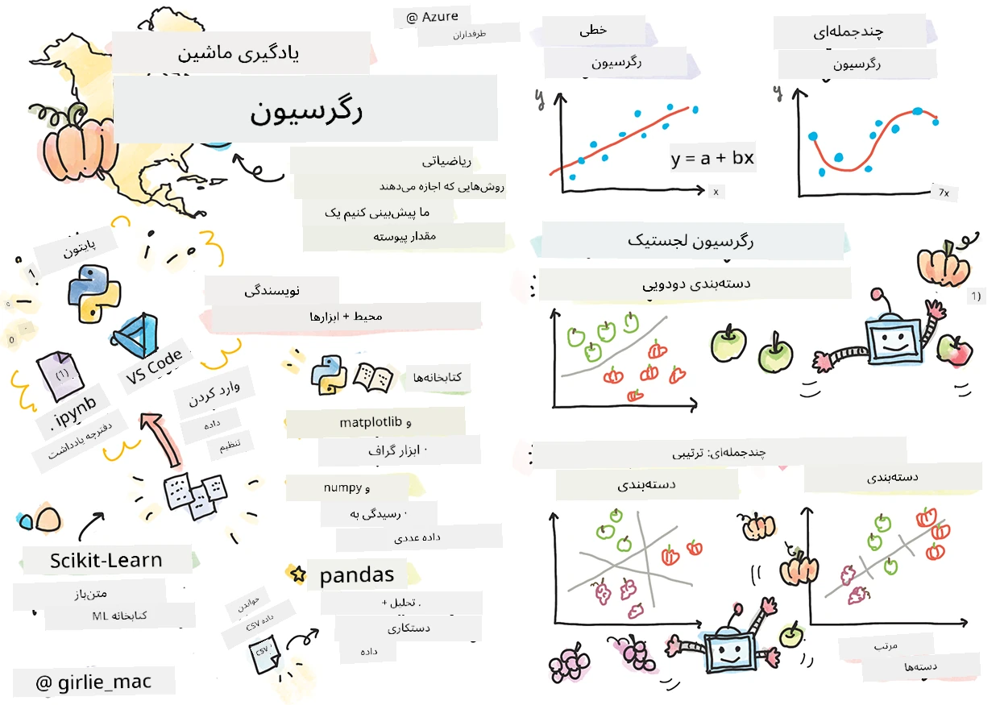
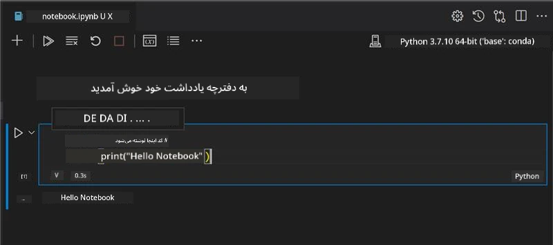
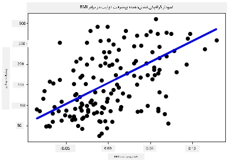

# شروع کار با پایتون و Scikit-learn برای مدل‌های رگرسیون



> اسکچ‌نوت توسط [Tomomi Imura](https://www.twitter.com/girlie_mac)

## [آزمون قبل از درس](https://ff-quizzes.netlify.app/en/ml/)

> ### [این درس به زبان R نیز موجود است!](../../../../2-Regression/1-Tools/solution/R/lesson_1.html)

## مقدمه

در این چهار درس، با نحوه ساخت مدل‌های رگرسیون آشنا خواهید شد. به زودی درباره کاربردهای آن‌ها صحبت خواهیم کرد. اما پیش از انجام هر کاری، مطمئن شوید که ابزارهای مناسب برای شروع فرآیند در اختیار دارید!

در این درس، خواهید آموخت چگونه:

- رایانه خود را برای انجام وظایف یادگیری ماشین محلی پیکربندی کنید.
- با Jupyter Notebooks کار کنید.
- از Scikit-learn استفاده کنید، شامل نصب آن.
- با تمرینی عملی، رگرسیون خطی را بررسی کنید.

## نصب و پیکربندی‌ها

[](https://youtu.be/-DfeD2k2Kj0 "یادگیری ماشین برای مبتدیان - آماده‌سازی ابزارها برای ساخت مدل‌های یادگیری ماشین")

> 🎥 برای مشاهده ویدیوی کوتاه درباره تنظیم رایانه برای یادگیری ماشین روی تصویر بالا کلیک کنید.

1. **نصب پایتون**. مطمئن شوید که [پایتون](https://www.python.org/downloads/) روی رایانه شما نصب شده است. شما برای بسیاری از کارهای داده‌کاوی و یادگیری ماشین به پایتون نیاز خواهید داشت. بیشتر سیستم‌های کامپیوتری از قبل پایتون را نصب دارند. بسته‌های [Python Coding Packs](https://code.visualstudio.com/learn/educators/installers?WT.mc_id=academic-77952-leestott) مفیدی هم موجود است که نصب را برای برخی کاربران آسان‌تر می‌کند.

   برخی کاربردهای پایتون نیاز به نسخه خاصی از نرم‌افزار دارند، در حالی که برخی دیگر نسخه‌ای متفاوت. به همین دلیل، کار در یک [محیط مجازی](https://docs.python.org/3/library/venv.html) مفید است.

2. **نصب Visual Studio Code**. مطمئن شوید که Visual Studio Code روی رایانه شما نصب شده است. برای نصب پایه‌ای به این دستورالعمل‌ها برای [نصب Visual Studio Code](https://code.visualstudio.com/) مراجعه کنید. شما در این دوره قرار است از پایتون در Visual Studio Code استفاده کنید، پس ممکن است بخواهید نحوه [پیکربندی Visual Studio Code](https://docs.microsoft.com/learn/modules/python-install-vscode?WT.mc_id=academic-77952-leestott) برای توسعه پایتون را مرور کنید.

   > با گذراندن این مجموعه از [ماژول‌های آموزش](https://docs.microsoft.com/users/jenlooper-2911/collections/mp1pagggd5qrq7?WT.mc_id=academic-77952-leestott)، با پایتون راحت شوید.
   >
   > [](https://youtu.be/yyQM70vi7V8 "راه‌اندازی پایتون با Visual Studio Code")
   >
   > 🎥 برای ویدیویی درباره استفاده از پایتون در VS Code روی تصویر بالا کلیک کنید.

3. **نصب Scikit-learn**، با دنبال کردن [این دستورالعمل‌ها](https://scikit-learn.org/stable/install.html). از آنجایی که باید از پایتون ۳ استفاده کنید، توصیه می‌شود از محیط مجازی استفاده کنید. اگر این کتابخانه را روی یک مک با پردازنده M1 نصب می‌کنید، دستورالعمل‌های خاصی در صفحه فوق وجود دارد.

1. **نصب Jupyter Notebook**. شما باید [بسته Jupyter](https://pypi.org/project/jupyter/) را نصب کنید.

## محیط نویسندگی شما برای یادگیری ماشین

شما از **دفترچه‌ها (notebooks)** برای توسعه کد پایتون خود و ایجاد مدل‌های یادگیری ماشین استفاده خواهید کرد. این نوع فایل ابزاری رایج در علوم داده است و با پسوند `.ipynb` شناسایی می‌شود.

دفترچه‌ها محیطی تعاملی هستند که به توسعه‌دهنده اجازه می‌دهد هم کد بنویسد و هم یادداشت‌ها و مستندات پیرامون کد را اضافه کند که برای پروژه‌های تجربی یا پژوهشی بسیار مفید است.

[](https://youtu.be/7E-jC8FLA2E "یادگیری ماشین برای مبتدیان - راه‌اندازی Jupyter Notebooks برای شروع ساخت مدل‌های رگرسیون")

> 🎥 برای مشاهده ویدیوی کوتاه درباره این تمرین روی تصویر بالا کلیک کنید.

### تمرین - کار با یک دفترچه

در این پوشه، فایل _notebook.ipynb_ را پیدا خواهید کرد.

1. فایل _notebook.ipynb_ را در Visual Studio Code باز کنید.

   یک سرور Jupyter با پایتون ۳+ شروع به کار خواهد کرد. بخش‌هایی از دفترچه که می‌توانید آن‌ها را `run` کنید، بخش‌هایی از کد هستند. می‌توانید یک بلوک کد را با انتخاب آیکونی که شبیه دکمه پخش است اجرا کنید.

1. آیکون `md` را انتخاب کنید و کمی متن مارک‌داون اضافه کنید، از جمله متن زیر: **# به دفترچه خود خوش آمدید**

   سپس، کمی کد پایتون اضافه کنید.

1. کد **print('hello notebook')** را در بلوک کد تایپ کنید.
1. برای اجرای کد، روی فلش کلیک کنید.

   باید عبارت چاپ‌شده را ببینید:

    ```output
    hello notebook
    ```



می‌توانید کد خود را با کامنت‌هایی برای خودتان همراه کنید تا دفترچه مستند شود.

✅ کمی فکر کنید که محیط کاری یک توسعه‌دهنده وب چقدر با محیط کاری یک دانشمند داده متفاوت است.

## راه‌اندازی و شروع کار با Scikit-learn

حال که پایتون در محیط محلی شما راه‌اندازی شده است و با Jupyter Notebooks راحت هستید، بیایید با Scikit-learn هم همینقدر راحت شویم (تلفظ آن `سای` مثل science است). Scikit-learn یک [رابط برنامه‌نویسی گسترده](https://scikit-learn.org/stable/modules/classes.html#api-ref) فراهم می‌کند تا به شما در انجام وظایف یادگیری ماشین کمک کند.

طبق گفته وب‌سایت آن‌ها [وب‌سایت](https://scikit-learn.org/stable/getting_started.html) "Scikit-learn یک کتابخانه متن باز یادگیری ماشین است که یادگیری نظارت‌شده و نظارت‌نشده را پشتیبانی می‌کند. همچنین ابزارهای مختلفی برای برازش مدل، پیش‌پردازش داده، انتخاب و ارزیابی مدل و بسیاری کاربردهای دیگر فراهم می‌آورد."

در این دوره، از Scikit-learn و ابزارهای دیگر برای ساخت مدل‌های یادگیری ماشین استفاده خواهید کرد تا وظایفی که ما «یادگیری ماشین سنتی» می‌نامیم را انجام دهید. عمدتاً از شبکه‌های عصبی و یادگیری عمیق اجتناب کرده‌ایم، چون آن‌ها را بهتر در دوره آینده «هوش مصنوعی برای مبتدیان» پوشش خواهیم داد.

Scikit-learn ساخت مدل‌ها و ارزیابی آن‌ها را بسیار ساده کرده است. عمدتاً بر استفاده از داده‌های عددی تمرکز دارد و چندین مجموعه داده آماده برای یادگیری دارد. همچنین مدل‌هایی آماده برای امتحان دانشجویان دارد. ابتدا پروسه بارگذاری داده‌های بسته‌بندی شده و استفاده از یک تخمین‌زن داخلی را برای اولین مدل ML با Scikit-learn و داده‌های پایه بررسی کنیم.

## تمرین - اولین دفترچه Scikit-learn شما

> این آموزش بر اساس [مثال رگرسیون خطی](https://scikit-learn.org/stable/auto_examples/linear_model/plot_ols.html#sphx-glr-auto-examples-linear-model-plot-ols-py) در وب‌سایت Scikit-learn الهام گرفته شده است.


[](https://youtu.be/2xkXL5EUpS0 "یادگیری ماشین برای مبتدیان - اولین پروژه رگرسیون خطی شما در پایتون")

> 🎥 برای مشاهده ویدیوی کوتاه درباره این تمرین روی تصویر بالا کلیک کنید.

در فایل _notebook.ipynb_ مربوط به این درس، همه سلول‌ها را با کلیک روی آیکون سطل زباله پاک کنید.

در این بخش، با یک مجموعه داده کوچک درباره دیابت کار خواهید کرد که به منظور یادگیری در Scikit-learn ساخته شده است. تصور کنید می‌خواهید درمانی برای بیماران دیابتی آزمایش کنید. مدل‌های یادگیری ماشین می‌توانند به شما کمک کنند تعیین کنید کدام بیماران بهتر به درمان پاسخ می‌دهند، بر اساس ترکیبی از متغیرها. حتی یک مدل رگرسیون بسیار ساده، وقتی تجسم شود، می‌تواند اطلاعاتی درباره متغیرها نشان دهد که به سازماندهی آزمایشات بالینی نظری شما کمک کند.

✅ روش‌های مختلف رگرسیون وجود دارند و انتخاب یکی به پاسخ موردنظر شما بستگی دارد. اگر بخواهید ارتفاع احتمالی یک شخص در سن مشخص را پیش‌بینی کنید، از رگرسیون خطی استفاده می‌کنید چون دنبال یک **مقدار عددی** هستید. اگر بخواهید بدانید یک نوع غذای خاص باید به عنوان گیاه‌خواری شمرده شود یا نه، به دنبال **دسته‌بندی** هستید، پس از رگرسیون لجستیک استفاده می‌کنید. درباره رگرسیون لجستیک بعداً بیشتر خواهید آموخت. کمی در مورد سوالاتی که می‌توانید از داده‌ها بپرسید فکر کنید و کدام روش برای آن مناسب‌تر است.

بریم سراغ این کار.

### وارد کردن کتابخانه‌ها

برای این کار برخی کتابخانه‌ها را وارد می‌کنیم:

- **matplotlib**. این یک [ابزار رسم نمودار مفید](https://matplotlib.org/) است و ما از آن برای رسم نمودار خطی استفاده خواهیم کرد.
- **numpy**. [numpy](https://numpy.org/doc/stable/user/whatisnumpy.html) کتابخانه‌ای مفید برای مدیریت داده‌های عددی در پایتون است.
- **sklearn**. این کتابخانه [Scikit-learn](https://scikit-learn.org/stable/user_guide.html) است.

برخی کتابخانه‌ها را برای انجام وظایف خود وارد کنید.

1. واردات را با تایپ کد زیر اضافه کنید:

   ```python
   import matplotlib.pyplot as plt
   import numpy as np
   from sklearn import datasets, linear_model, model_selection
   ```

   شما در بالا `matplotlib`، `numpy` را وارد کرده‌اید و نیز از `sklearn`، `datasets`، `linear_model` و `model_selection` را وارد کرده‌اید. `model_selection` برای تقسیم داده‌ها به مجموعه‌های آموزش و تست استفاده می‌شود.

### مجموعه داده دیابت

مجموعه داده [دیابت داخلی](https://scikit-learn.org/stable/datasets/toy_dataset.html#diabetes-dataset) شامل ۴۴۲ نمونه داده درباره دیابت است، با ۱۰ متغیر ویژگی که برخی از آن‌ها شامل:

- سن: سن بر حسب سال
- bmi: شاخص توده بدنی
- bp: فشار خون متوسط
- s1 tc: سلول‌های T (نوعی از سلول‌های سفید خون)

✅ این مجموعه داده مفهوم «جنسیت» را به عنوان متغیر ویژگی مهمی برای تحقیقات درباره دیابت شامل می‌شود. بسیاری از مجموعه داده‌های پزشکی این نوع دسته‌بندی دودویی را دارند. کمی فکر کنید که چنین دسته‌بندی‌هایی چطور ممکن است بخشی از جمعیت را از درمان‌ها کنار بگذارند.

حال، داده‌های X و y را بارگذاری کنید.

> 🎓 به یاد داشته باشید، این یادگیری نظارت‌شده است و باید «y» هدف نام‌گذاری شده وجود داشته باشد.

در یک سلول کد جدید، مجموعه داده دیابت را با فراخوانی `load_diabetes()` بارگذاری کنید. ورودی `return_X_y=True` به معنای این است که `X` یک ماتریس داده و `y` هدف رگرسیون خواهد بود.

1. چند دستور print برای نشان دادن شکل ماتریس داده و اولین عنصر آن اضافه کنید:

    ```python
    X, y = datasets.load_diabetes(return_X_y=True)
    print(X.shape)
    print(X[0])
    ```

    آنچه برمی‌گردید به صورت یک تاپل است. کاری که می‌کنید این است که دو مقدار اول تاپل را به ترتیب به `X` و `y` انتساب دهید. درباره [تاپل‌ها](https://wikipedia.org/wiki/Tuple) بیشتر بدانید.

    می‌توانید ببینید این داده ۴۴۲ مورد دارد که در آرایه‌ای با ۱۰ عنصر شکل داده شده است:

    ```text
    (442, 10)
    [ 0.03807591  0.05068012  0.06169621  0.02187235 -0.0442235  -0.03482076
    -0.04340085 -0.00259226  0.01990842 -0.01764613]
    ```

    ✅ کمی درباره رابطه بین داده و هدف رگرسیون فکر کنید. رگرسیون خطی روابط بین ویژگی X و متغیر هدف y را پیش‌بینی می‌کند. آیا می‌توانید [هدف](https://scikit-learn.org/stable/datasets/toy_dataset.html#diabetes-dataset) مجموعه داده دیابت را در مستندات پیدا کنید؟ این مجموعه داده با آن هدف چه چیزی را نشان می‌دهد؟

2. سپس بخشی از این مجموعه داده را برای رسم انتخاب کنید، با انتخاب ستون سوم مجموعه داده. برای این کار می‌توانید از عملگر `:` برای انتخاب همه ردیف‌ها استفاده کنید، و سپس ستون سوم را با ایندکس (2) انتخاب کنید. همچنین می‌توانید داده را به آرایه ۲ بعدی تغییر شکل دهید - برای رسم لازم است - با استفاده از `reshape(n_rows, n_columns)`. اگر یکی از پارامترها -۱ باشد، بعد متناظر به طور خودکار محاسبه می‌شود.

   ```python
   X = X[:, 2]
   X = X.reshape((-1,1))
   ```

   ✅ در هر لحظه داده را چاپ کنید تا شکل آن را چک کنید.

3. حال که داده آماده رسم است، می‌توانید ببینید که آیا ماشین می‌تواند تقسیم منطقی بین اعداد این مجموعه داده تشخیص دهد یا نه. برای این کار باید داده‌ها (X) و هدف (y) را به مجموعه‌های تست و آموزش تقسیم کنید. Scikit-learn راه ساده‌ای برای این کار دارد؛ می‌توانید داده تست خود را در نقطه‌ای مشخص تقسیم کنید.

   ```python
   X_train, X_test, y_train, y_test = model_selection.train_test_split(X, y, test_size=0.33)
   ```

4. حال آماده آموزش مدل خود هستید! مدل رگرسیون خطی را بارگذاری کنید و آن را با مجموعه‌های آموزش X و y خود با استفاده از `model.fit()` آموزش دهید:

    ```python
    model = linear_model.LinearRegression()
    model.fit(X_train, y_train)
    ```

    ✅ `model.fit()` تابعی است که در بسیاری از کتابخانه‌های یادگیری ماشین مانند TensorFlow خواهید دید.

5. سپس با استفاده از داده‌های تست، پیش‌بینی ایجاد کنید، با استفاده از تابع `predict()`. این برای رسم خط میان گروه‌های داده مدل استفاده خواهد شد.

    ```python
    y_pred = model.predict(X_test)
    ```

6. اکنون زمان نمایش داده‌ها با یک نمودار است. Matplotlib ابزاری بسیار مفید برای این کار است. یک scatterplot از تمام داده‌های تست X و y ایجاد کنید، و با استفاده از پیش‌بینی خط را در مناسب‌ترین محل بین گروه‌های داده مدل رسم کنید.

    ```python
    plt.scatter(X_test, y_test,  color='black')
    plt.plot(X_test, y_pred, color='blue', linewidth=3)
    plt.xlabel('Scaled BMIs')
    plt.ylabel('Disease Progression')
    plt.title('A Graph Plot Showing Diabetes Progression Against BMI')
    plt.show()
    ```

   


   ✅ کمی فکر کنید درباره‌ی آنچه اینجا اتفاق می‌افتد. یک خط مستقیم از میان بسیاری نقاط کوچک داده عبور می‌کند، اما دقیقاً چه کاری انجام می‌دهد؟ آیا می‌توانید ببینید چگونه باید بتوانید از این خط استفاده کنید تا پیش‌بینی کنید یک نقطه داده جدید و دیده نشده باید نسبت به محور y نمودار کجا قرار گیرد؟ سعی کنید کاربرد عملی این مدل را به زبان بیاورید.

تبریک می‌گویم، شما اولین مدل رگرسیون خطی خود را ساختید، با آن پیش‌بینی انجام دادید و آن را در یک نمودار نمایش دادید!

---
## 🚀چالش

یک متغیر متفاوت از این مجموعه داده رسم کنید. راهنمایی: این خط را ویرایش کنید: `X = X[:,2]`. با توجه به هدف این مجموعه داده، چه چیزهایی می‌توانید درباره پیشرفت بیماری دیابت کشف کنید؟
## [آزمون پس از درس](https://ff-quizzes.netlify.app/en/ml/)

## مرور و خودآموزی

در این آموزش، شما با رگرسیون خطی ساده کار کردید، نه رگرسیون خطی تک‌متغیره یا چندگانه. کمی درباره تفاوت‌های این روش‌ها بخوانید، یا به [این ویدیو](https://www.coursera.org/lecture/quantifying-relationships-regression-models/linear-vs-nonlinear-categorical-variables-ai2Ef) نگاهی بیندازید.

بیشتر درباره مفهوم رگرسیون بخوانید و فکر کنید که چه نوع سوالاتی را می‌توان با این تکنیک پاسخ داد. این [آموزش](https://docs.microsoft.com/learn/modules/train-evaluate-regression-models?WT.mc_id=academic-77952-leestott) را برای تعمیق درک خود بگذرانید.

## تمرین

[یک مجموعه داده متفاوت](assignment.md)

---

<!-- CO-OP TRANSLATOR DISCLAIMER START -->
**سلب مسئولیت**:
این سند با استفاده از سرویس ترجمه هوش مصنوعی [Co-op Translator](https://github.com/Azure/co-op-translator) ترجمه شده است. در حالی که ما در تلاش برای دقت هستیم، لطفاً توجه داشته باشید که ترجمه‌های خودکار ممکن است شامل خطاها یا نادرستی‌هایی باشند. سند اصلی به زبان مادری خود باید به عنوان منبع معتبر در نظر گرفته شود. برای اطلاعات حیاتی، ترجمه حرفه‌ای انسانی توصیه می‌شود. ما در قبال هرگونه سوء تفاهم یا برداشت نادرست ناشی از استفاده از این ترجمه مسئولیتی نداریم.
<!-- CO-OP TRANSLATOR DISCLAIMER END -->