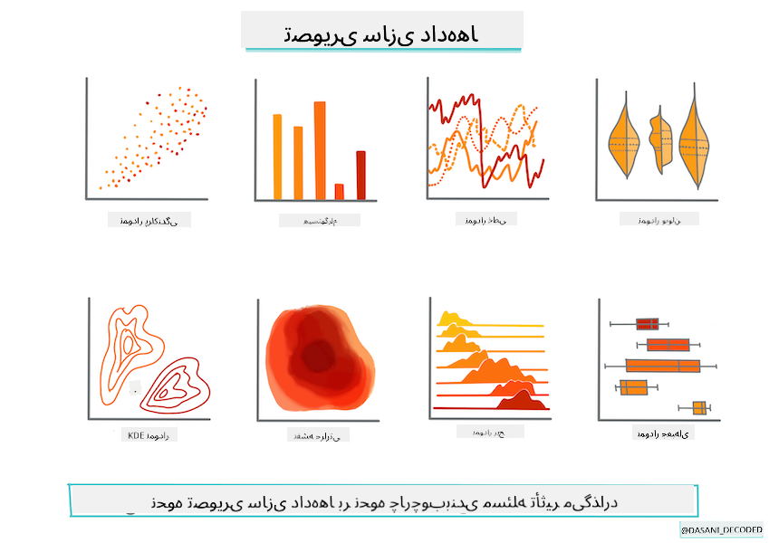
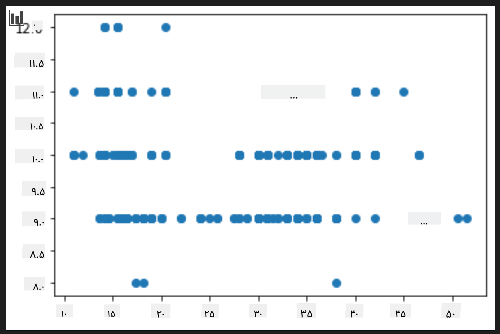
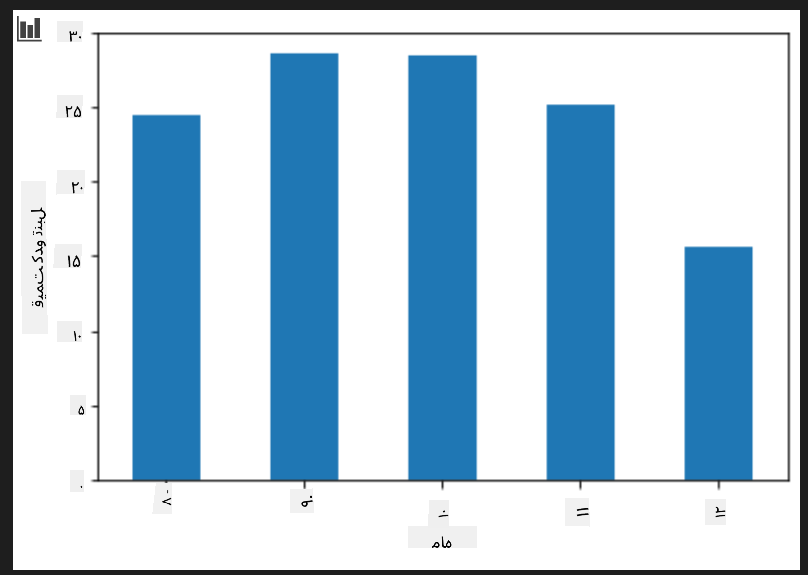

<!--
CO_OP_TRANSLATOR_METADATA:
{
  "original_hash": "a683e1fe430bb0d4a10b68f6ca15e0a6",
  "translation_date": "2025-09-03T22:39:08+00:00",
  "source_file": "2-Regression/2-Data/README.md",
  "language_code": "fa"
}
-->
# ساخت یک مدل رگرسیون با استفاده از Scikit-learn: آماده‌سازی و تجسم داده‌ها



اینفوگرافیک توسط [داسانی مادپالی](https://twitter.com/dasani_decoded)

## [آزمون پیش از درس](https://gray-sand-07a10f403.1.azurestaticapps.net/quiz/11/)

> ### [این درس به زبان R نیز موجود است!](../../../../2-Regression/2-Data/solution/R/lesson_2.html)

## مقدمه

حالا که ابزارهای لازم برای شروع ساخت مدل‌های یادگیری ماشین با Scikit-learn را در اختیار دارید، آماده‌اید تا سوالاتی از داده‌های خود بپرسید. هنگام کار با داده‌ها و اعمال راه‌حل‌های یادگیری ماشین، بسیار مهم است که بدانید چگونه سوالات درست بپرسید تا بتوانید پتانسیل‌های داده‌های خود را به درستی کشف کنید.

در این درس، شما یاد خواهید گرفت:

- چگونه داده‌های خود را برای ساخت مدل آماده کنید.
- چگونه از Matplotlib برای تجسم داده‌ها استفاده کنید.

## پرسیدن سوالات درست از داده‌ها

سوالی که می‌خواهید پاسخ آن را بیابید، تعیین می‌کند که از چه نوع الگوریتم‌های یادگیری ماشین استفاده خواهید کرد. کیفیت پاسخی که دریافت می‌کنید نیز به شدت به ماهیت داده‌های شما بستگی دارد.

به [داده‌ها](https://github.com/microsoft/ML-For-Beginners/blob/main/2-Regression/data/US-pumpkins.csv) که برای این درس ارائه شده است نگاهی بیندازید. می‌توانید این فایل .csv را در VS Code باز کنید. با یک نگاه سریع متوجه می‌شوید که داده‌ها شامل مقادیر خالی و ترکیبی از رشته‌ها و داده‌های عددی هستند. همچنین یک ستون عجیب به نام 'Package' وجود دارد که داده‌های آن ترکیبی از 'sacks'، 'bins' و مقادیر دیگر است. در واقع، داده‌ها کمی به هم ریخته هستند.

[](https://youtu.be/5qGjczWTrDQ "یادگیری ماشین برای مبتدیان - چگونه یک مجموعه داده را تحلیل و پاکسازی کنیم")

> 🎥 روی تصویر بالا کلیک کنید تا ویدیوی کوتاهی درباره آماده‌سازی داده‌ها برای این درس مشاهده کنید.

در واقع، بسیار نادر است که یک مجموعه داده کاملاً آماده برای استفاده و ساخت مدل یادگیری ماشین به شما داده شود. در این درس، یاد می‌گیرید که چگونه یک مجموعه داده خام را با استفاده از کتابخانه‌های استاندارد پایتون آماده کنید. همچنین تکنیک‌های مختلفی برای تجسم داده‌ها خواهید آموخت.

## مطالعه موردی: 'بازار کدو تنبل'

در این پوشه، یک فایل .csv در پوشه اصلی `data` به نام [US-pumpkins.csv](https://github.com/microsoft/ML-For-Beginners/blob/main/2-Regression/data/US-pumpkins.csv) پیدا خواهید کرد که شامل 1757 خط داده درباره بازار کدو تنبل است که بر اساس شهرها گروه‌بندی شده‌اند. این داده‌ها خام هستند و از [گزارش‌های استاندارد بازارهای محصولات خاص](https://www.marketnews.usda.gov/mnp/fv-report-config-step1?type=termPrice) که توسط وزارت کشاورزی ایالات متحده منتشر شده‌اند، استخراج شده‌اند.

### آماده‌سازی داده‌ها

این داده‌ها در حوزه عمومی قرار دارند. می‌توان آن‌ها را از وب‌سایت USDA به صورت فایل‌های جداگانه برای هر شهر دانلود کرد. برای جلوگیری از داشتن فایل‌های جداگانه زیاد، ما تمام داده‌های شهرها را در یک صفحه گسترده ترکیب کرده‌ایم، بنابراین تا حدی داده‌ها را _آماده_ کرده‌ایم. حالا بیایید نگاهی دقیق‌تر به داده‌ها بیندازیم.

### داده‌های کدو تنبل - نتیجه‌گیری اولیه

چه چیزی در مورد این داده‌ها متوجه می‌شوید؟ قبلاً دیدید که ترکیبی از رشته‌ها، اعداد، مقادیر خالی و مقادیر عجیب وجود دارد که باید آن‌ها را درک کنید.

چه سوالی می‌توانید از این داده‌ها با استفاده از تکنیک رگرسیون بپرسید؟ مثلاً "پیش‌بینی قیمت یک کدو تنبل برای فروش در یک ماه خاص". با نگاه دوباره به داده‌ها، تغییراتی وجود دارد که باید برای ایجاد ساختار داده‌ای لازم برای این کار انجام دهید.

## تمرین - تحلیل داده‌های کدو تنبل

بیایید از [Pandas](https://pandas.pydata.org/) که ابزاری بسیار مفید برای شکل‌دهی داده‌ها است، برای تحلیل و آماده‌سازی این داده‌های کدو تنبل استفاده کنیم.

### ابتدا، بررسی تاریخ‌های گمشده

ابتدا باید اقداماتی برای بررسی تاریخ‌های گمشده انجام دهید:

1. تاریخ‌ها را به فرمت ماه تبدیل کنید (این تاریخ‌ها به فرمت ایالات متحده هستند، یعنی `MM/DD/YYYY`).
2. ماه را به یک ستون جدید استخراج کنید.

فایل _notebook.ipynb_ را در Visual Studio Code باز کنید و صفحه گسترده را به یک دیتافریم جدید Pandas وارد کنید.

1. از تابع `head()` برای مشاهده پنج ردیف اول استفاده کنید.

    ```python
    import pandas as pd
    pumpkins = pd.read_csv('../data/US-pumpkins.csv')
    pumpkins.head()
    ```

    ✅ از چه تابعی برای مشاهده پنج ردیف آخر استفاده می‌کنید؟

1. بررسی کنید که آیا داده‌های گمشده‌ای در دیتافریم فعلی وجود دارد:

    ```python
    pumpkins.isnull().sum()
    ```

    داده‌های گمشده وجود دارد، اما شاید برای کار فعلی اهمیتی نداشته باشد.

1. برای کار با دیتافریم خود راحت‌تر، فقط ستون‌هایی را که نیاز دارید با استفاده از تابع `loc` انتخاب کنید. این تابع از دیتافریم اصلی گروهی از ردیف‌ها (به عنوان پارامتر اول) و ستون‌ها (به عنوان پارامتر دوم) را استخراج می‌کند. عبارت `:` در مثال زیر به معنای "همه ردیف‌ها" است.

    ```python
    columns_to_select = ['Package', 'Low Price', 'High Price', 'Date']
    pumpkins = pumpkins.loc[:, columns_to_select]
    ```

### دوم، تعیین میانگین قیمت کدو تنبل

فکر کنید چگونه می‌توانید میانگین قیمت یک کدو تنبل را در یک ماه خاص تعیین کنید. برای این کار به کدام ستون‌ها نیاز دارید؟ نکته: به سه ستون نیاز خواهید داشت.

راه‌حل: میانگین ستون‌های `Low Price` و `High Price` را برای پر کردن ستون جدید Price محاسبه کنید و ستون Date را به گونه‌ای تبدیل کنید که فقط ماه را نشان دهد. خوشبختانه، طبق بررسی بالا، هیچ داده گمشده‌ای برای تاریخ‌ها یا قیمت‌ها وجود ندارد.

1. برای محاسبه میانگین، کد زیر را اضافه کنید:

    ```python
    price = (pumpkins['Low Price'] + pumpkins['High Price']) / 2

    month = pd.DatetimeIndex(pumpkins['Date']).month

    ```

   ✅ هر داده‌ای که می‌خواهید بررسی کنید را با استفاده از `print(month)` چاپ کنید.

2. حالا داده‌های تبدیل‌شده خود را به یک دیتافریم جدید Pandas کپی کنید:

    ```python
    new_pumpkins = pd.DataFrame({'Month': month, 'Package': pumpkins['Package'], 'Low Price': pumpkins['Low Price'],'High Price': pumpkins['High Price'], 'Price': price})
    ```

    چاپ دیتافریم شما یک مجموعه داده تمیز و مرتب را نشان می‌دهد که می‌توانید مدل رگرسیون جدید خود را بر اساس آن بسازید.

### اما صبر کنید! چیزی عجیب اینجا وجود دارد

اگر به ستون `Package` نگاه کنید، کدو تنبل‌ها در پیکربندی‌های مختلفی فروخته می‌شوند. برخی در اندازه‌های '1 1/9 bushel' فروخته می‌شوند، برخی در اندازه‌های '1/2 bushel'، برخی به ازای هر کدو تنبل، برخی به ازای هر پوند، و برخی در جعبه‌های بزرگ با عرض‌های مختلف.

> به نظر می‌رسد وزن کردن کدو تنبل‌ها به طور مداوم بسیار دشوار است

با بررسی داده‌های اصلی، جالب است که هر چیزی که `Unit of Sale` آن برابر با 'EACH' یا 'PER BIN' است، همچنین نوع `Package` آن به صورت هر اینچ، هر جعبه، یا 'each' است. به نظر می‌رسد وزن کردن کدو تنبل‌ها به طور مداوم بسیار دشوار است، بنابراین بیایید آن‌ها را با انتخاب فقط کدو تنبل‌هایی که در ستون `Package` آن‌ها عبارت 'bushel' وجود دارد، فیلتر کنیم.

1. یک فیلتر در بالای فایل، زیر وارد کردن اولیه .csv اضافه کنید:

    ```python
    pumpkins = pumpkins[pumpkins['Package'].str.contains('bushel', case=True, regex=True)]
    ```

    اگر اکنون داده‌ها را چاپ کنید، می‌بینید که فقط حدود 415 ردیف داده شامل کدو تنبل‌هایی که به صورت بوشل فروخته می‌شوند، باقی مانده است.

### اما صبر کنید! یک کار دیگر هم باید انجام دهید

آیا متوجه شدید که مقدار بوشل در هر ردیف متفاوت است؟ باید قیمت‌ها را نرمال‌سازی کنید تا قیمت‌ها را به ازای هر بوشل نشان دهید، بنابراین کمی محاسبه انجام دهید تا آن را استاندارد کنید.

1. این خطوط را بعد از بلوک ایجاد دیتافریم جدید `new_pumpkins` اضافه کنید:

    ```python
    new_pumpkins.loc[new_pumpkins['Package'].str.contains('1 1/9'), 'Price'] = price/(1 + 1/9)

    new_pumpkins.loc[new_pumpkins['Package'].str.contains('1/2'), 'Price'] = price/(1/2)
    ```

✅ طبق گفته [The Spruce Eats](https://www.thespruceeats.com/how-much-is-a-bushel-1389308)، وزن یک بوشل به نوع محصول بستگی دارد، زیرا این یک اندازه‌گیری حجمی است. "یک بوشل گوجه‌فرنگی، برای مثال، باید 56 پوند وزن داشته باشد... برگ‌ها و سبزیجات فضای بیشتری با وزن کمتر اشغال می‌کنند، بنابراین یک بوشل اسفناج فقط 20 پوند است." این موضوع بسیار پیچیده است! بیایید به تبدیل بوشل به پوند نپردازیم و به جای آن قیمت را بر اساس بوشل محاسبه کنیم. تمام این مطالعه درباره بوشل‌های کدو تنبل، با این حال، نشان می‌دهد که چقدر مهم است که ماهیت داده‌های خود را درک کنید!

حالا می‌توانید قیمت‌ها را بر اساس واحد بوشل تحلیل کنید. اگر داده‌ها را یک بار دیگر چاپ کنید، می‌بینید که چگونه استاندارد شده‌اند.

✅ آیا متوجه شدید که کدو تنبل‌هایی که به صورت نیم‌بوشل فروخته می‌شوند بسیار گران هستند؟ می‌توانید بفهمید چرا؟ نکته: کدو تنبل‌های کوچک بسیار گران‌تر از کدو تنبل‌های بزرگ هستند، احتمالاً به این دلیل که تعداد بیشتری از آن‌ها در هر بوشل وجود دارد، با توجه به فضای خالی که یک کدو تنبل بزرگ اشغال می‌کند.

## استراتژی‌های تجسم داده‌ها

یکی از وظایف دانشمند داده این است که کیفیت و ماهیت داده‌هایی که با آن‌ها کار می‌کند را نشان دهد. برای این کار، آن‌ها اغلب تجسم‌های جالبی ایجاد می‌کنند، مانند نمودارها، گراف‌ها و چارت‌ها که جنبه‌های مختلف داده‌ها را نشان می‌دهند. به این ترتیب، آن‌ها می‌توانند روابط و شکاف‌هایی را که در غیر این صورت سخت است کشف کنند، به صورت بصری نشان دهند.

[](https://youtu.be/SbUkxH6IJo0 "یادگیری ماشین برای مبتدیان - چگونه داده‌ها را با Matplotlib تجسم کنیم")

> 🎥 روی تصویر بالا کلیک کنید تا ویدیوی کوتاهی درباره تجسم داده‌ها برای این درس مشاهده کنید.

تجسم‌ها همچنین می‌توانند به تعیین تکنیک یادگیری ماشین مناسب برای داده‌ها کمک کنند. برای مثال، یک نمودار پراکندگی که به نظر می‌رسد یک خط را دنبال می‌کند، نشان می‌دهد که داده‌ها برای یک تمرین رگرسیون خطی مناسب هستند.

یکی از کتابخانه‌های تجسم داده‌ها که در نوت‌بوک‌های Jupyter به خوبی کار می‌کند، [Matplotlib](https://matplotlib.org/) است (که در درس قبلی نیز آن را دیدید).

> تجربه بیشتری در تجسم داده‌ها در [این آموزش‌ها](https://docs.microsoft.com/learn/modules/explore-analyze-data-with-python?WT.mc_id=academic-77952-leestott) کسب کنید.

## تمرین - آزمایش با Matplotlib

سعی کنید برخی نمودارهای پایه‌ای برای نمایش دیتافریم جدیدی که ایجاد کرده‌اید، بسازید. یک نمودار خطی ساده چه چیزی را نشان می‌دهد؟

1. Matplotlib را در بالای فایل، زیر وارد کردن Pandas وارد کنید:

    ```python
    import matplotlib.pyplot as plt
    ```

1. کل نوت‌بوک را دوباره اجرا کنید تا تازه شود.
1. در انتهای نوت‌بوک، یک سلول برای رسم داده‌ها به صورت جعبه اضافه کنید:

    ```python
    price = new_pumpkins.Price
    month = new_pumpkins.Month
    plt.scatter(price, month)
    plt.show()
    ```

    

    آیا این نمودار مفید است؟ آیا چیزی در مورد آن شما را شگفت‌زده می‌کند؟

    این نمودار چندان مفید نیست زیرا فقط داده‌های شما را به صورت پراکندگی نقاط در یک ماه خاص نمایش می‌دهد.

### آن را مفید کنید

برای اینکه نمودارها داده‌های مفیدی نمایش دهند، معمولاً باید داده‌ها را به نوعی گروه‌بندی کنید. بیایید یک نمودار ایجاد کنیم که محور y ماه‌ها را نشان دهد و داده‌ها توزیع داده‌ها را نشان دهند.

1. یک سلول برای ایجاد یک نمودار میله‌ای گروه‌بندی‌شده اضافه کنید:

    ```python
    new_pumpkins.groupby(['Month'])['Price'].mean().plot(kind='bar')
    plt.ylabel("Pumpkin Price")
    ```

    

    این یک تجسم داده مفیدتر است! به نظر می‌رسد که بالاترین قیمت کدو تنبل در ماه‌های سپتامبر و اکتبر رخ می‌دهد. آیا این با انتظارات شما مطابقت دارد؟ چرا یا چرا نه؟

---

## 🚀چالش

انواع مختلف تجسم‌هایی که Matplotlib ارائه می‌دهد را بررسی کنید. کدام نوع‌ها برای مسائل رگرسیون مناسب‌تر هستند؟

## [آزمون پس از درس](https://gray-sand-07a10f403.1.azurestaticapps.net/quiz/12/)

## مرور و مطالعه شخصی

به روش‌های مختلف تجسم داده‌ها نگاهی بیندازید. لیستی از کتابخانه‌های مختلف موجود تهیه کنید و مشخص کنید کدام یک برای انواع خاصی از وظایف مناسب‌تر هستند، مثلاً تجسم‌های دو بعدی در مقابل سه بعدی. چه چیزی کشف می‌کنید؟

## تکلیف

[کاوش در تجسم داده‌ها](assignment.md)

---

**سلب مسئولیت**:  
این سند با استفاده از سرویس ترجمه هوش مصنوعی [Co-op Translator](https://github.com/Azure/co-op-translator) ترجمه شده است. در حالی که ما تلاش می‌کنیم دقت را حفظ کنیم، لطفاً توجه داشته باشید که ترجمه‌های خودکار ممکن است شامل خطاها یا نادرستی‌ها باشند. سند اصلی به زبان اصلی آن باید به عنوان منبع معتبر در نظر گرفته شود. برای اطلاعات حساس، توصیه می‌شود از ترجمه حرفه‌ای انسانی استفاده کنید. ما مسئولیتی در قبال سوء تفاهم‌ها یا تفسیرهای نادرست ناشی از استفاده از این ترجمه نداریم.