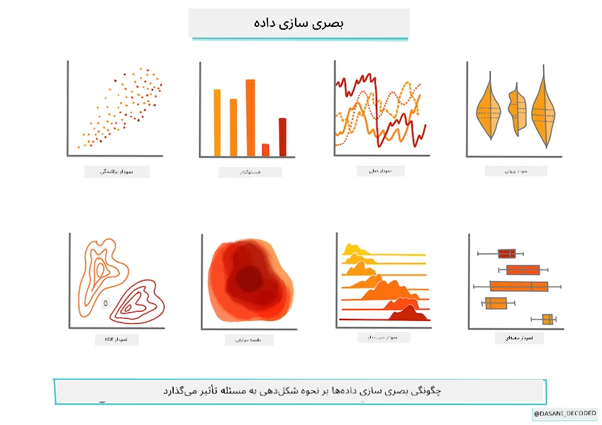
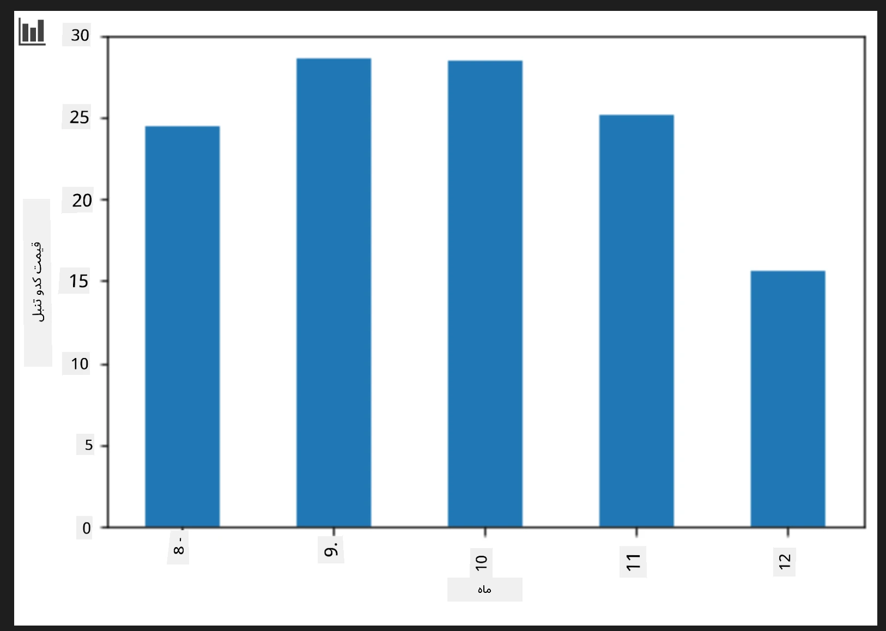
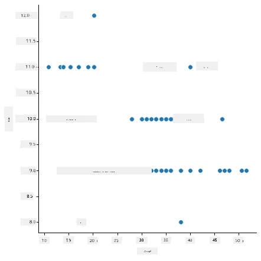
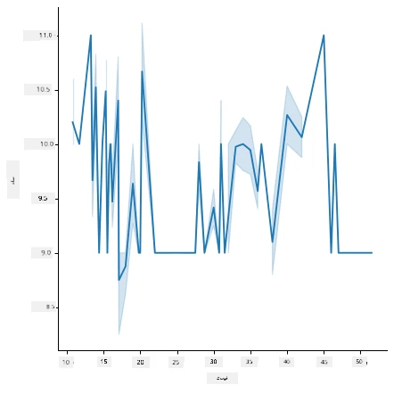
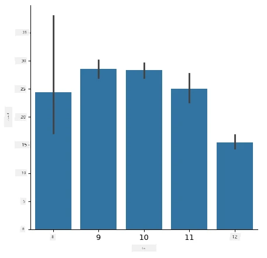
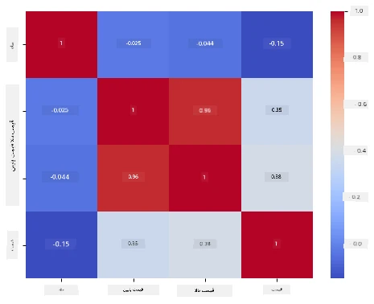

# ساخت مدل رگرسیون با استفاده از Scikit-learn: آماده‌سازی و تجسم داده‌ها



اینفوگرافیک توسط [Dasani Madipalli](https://twitter.com/dasani_decoded)

## [آزمون پیش‌درس](https://ff-quizzes.netlify.app/en/ml/)

> ### [این درس به زبان R نیز موجود است!](../../../../2-Regression/2-Data/solution/R/lesson_2.html)

## مقدمه

حال که ابزارهای لازم برای شروع ساخت مدل ماشین لرنینگ با Scikit-learn را آماده کرده‌اید، آماده‌اید که شروع به پرسیدن سوال از داده‌های خود کنید. هنگام کار با داده‌ها و اعمال راه‌حل‌های ML، بسیار مهم است که بدانید چگونه سوال درست را بپرسید تا به طور صحیح پتانسیل‌های مجموعه داده شما باز شود.

در این درس، شما یاد خواهید گرفت:

- چگونه داده‌های خود را برای ساخت مدل آماده کنید.
- چگونه از Matplotlib برای تجسم داده‌ها استفاده کنید.
- چگونه از Seaborn برای تجسم داده‌های بیانگرتر استفاده کنید.

## پرسیدن سوال صحیح از داده‌های شما

سوالی که باید پاسخ داده شود نوع الگوریتم‌های ML مورد استفاده را تعیین می‌کند. و کیفیت پاسخی که دریافت می‌کنید به شدت به ماهیت داده شما بستگی دارد.

نگاهی به [داده‌ها](https://github.com/microsoft/ML-For-Beginners/blob/main/2-Regression/data/US-pumpkins.csv) ارائه شده برای این درس بیندازید. می‌توانید این فایل .csv را در VS Code باز کنید. نگاه کوتاهی فوراً نشان می‌دهد که جاهای خالی وجود دارد و ترکیبی از داده‌های متنی و عددی است. همچنین ستونی عجیب به نام 'Package' وجود دارد که داده‌های آن ترکیبی از 'کیسه‌ها'، 'سطل‌ها' و مقادیر دیگر است. در واقع، داده‌ها کمی درهم‌برهم هستند.

[](https://youtu.be/5qGjczWTrDQ "ML برای مبتدیان - چگونه یک مجموعه داده را تحلیل و پاکسازی کنیم")

> 🎥 برای مشاهده ویدیوی کوتاه درباره آماده‌سازی داده‌ها برای این درس، روی تصویر بالا کلیک کنید.

در واقع، معمولاً مجموعه داده‌ای که کاملاً آماده استفاده برای ساخت مدل ML باشد از ابتدا ارائه نمی‌شود. در این درس، شما یاد می‌گیرید چگونه یک مجموعه داده خام را با استفاده از کتابخانه‌های استاندارد پایتون آماده کنید. همچنین تکنیک‌های مختلفی برای تجسم داده‌ها خواهید آموخت.

## مطالعه موردی: «بازار کدو تنبل»

در این پوشه، فایلی با فرمت .csv با نام [US-pumpkins.csv](https://github.com/microsoft/ML-For-Beginners/blob/main/2-Regression/data/US-pumpkins.csv) در پوشه ریشه `data` پیدا خواهید کرد که شامل 1757 خط داده درباره بازار کدو تنبل‌ها است که بر اساس شهر گروه‌بندی شده است. این داده خام استخراج شده از گزارش‌های استاندارد بازار ترمینال محصولات تخصصی ([Specialty Crops Terminal Markets Standard Reports](https://www.marketnews.usda.gov/mnp/fv-report-config-step1?type=termPrice)) منتشر شده توسط وزارت کشاورزی ایالات متحده است.

### آماده‌سازی داده‌ها

این داده‌ها در مالکیت عمومی هستند. می‌توان آن‌ها را از وب‌سایت USDA در چندین فایل جداگانه، بر اساس شهر، دانلود کرد. برای جلوگیری از فایل‌های جداگانه زیاد، ما تمام داده‌های شهرها را در یک صفحه گسترده concatenated کرده‌ایم، بنابراین ما داده‌ها را کمی _آماده_ کرده‌ایم. حالا، بیایید نگاهی دقیق‌تر به داده‌ها بیندازیم.

### داده کدو تنبل - نتیجه‌گیری اولیه

درباره این داده‌ها چه می‌بینید؟ شما قبلاً دیدید که ترکیبی از رشته‌ها، اعداد، جاهای خالی و مقادیر عجیب وجود دارد که باید مفهوم آن‌ها را فهمید.

چه سوالی می‌توانید با استفاده از تکنیک رگرسیون از این داده‌ها بپرسید؟ مثلاً "پیش‌بینی قیمت یک کدو تنبل برای فروش در یک ماه خاص". دوباره به داده‌ها نگاه کنید، تغییراتی هست که باید انجام دهید تا ساختار داده لازم برای این کار ایجاد شود.
## تمرین - تحلیل داده کدو تنبل

بیایید از [Pandas](https://pandas.pydata.org/) (نام آن مخفف تحلیل داده‌های پایتون است)، که ابزاری بسیار مفید برای شکل دادن به داده‌هاست، استفاده کنیم تا این داده کدو تنبل را تحلیل و آماده کنیم.

### ابتدا، بررسی برای تاریخ‌های غایب

ابتدا باید اقداماتی برای بررسی وجود تاریخ‌های گم‌شده انجام دهید:

1. تاریخ‌ها را به فرمت ماه تبدیل کنید (این‌ها تاریخ‌های آمریکایی هستند، بنابراین فرمت `MM/DD/YYYY` است).
2. ماه را استخراج کرده و در ستون جدیدی قرار دهید.

فایل _notebook.ipynb_ را در Visual Studio Code باز کرده و صفحه گسترده را به یک dataframe جدید Pandas وارد کنید.

1. با استفاده از تابع `head()` پنج ردیف اول را مشاهده کنید.

    ```python
    import pandas as pd
    pumpkins = pd.read_csv('../data/US-pumpkins.csv')
    pumpkins.head()
    ```

    ✅ چه تابعی را برای مشاهده پنج ردیف آخر استفاده می‌کنید؟

1. بررسی کنید که آیا داده‌ای در dataframe فعلی گم شده است یا خیر:

    ```python
    pumpkins.isnull().sum()
    ```

    داده‌ای گم شده وجود دارد، اما شاید برای کار جاری مهم نباشد.

1. برای راحت‌تر کردن کار با dataframe، فقط ستون‌های مورد نیاز را انتخاب کنید، با استفاده از تابع `loc` که از dataframe اصلی گروهی از ردیف‌ها (پارامتر اول) و ستون‌ها (پارامتر دوم) را استخراج می‌کند. عبارت `:` در اینجا به معنی "همه ردیف‌ها" است.

    ```python
    columns_to_select = ['Package', 'Low Price', 'High Price', 'Date']
    pumpkins = pumpkins.loc[:, columns_to_select]
    ```

### دوم، تعیین قیمت متوسط کدو تنبل

به این فکر کنید که چگونه می‌توان قیمت متوسط یک کدو تنبل در یک ماه مشخص را تعیین کرد. برای این کار از چه ستون‌هایی باید استفاده کنید؟ نکته: شما به 3 ستون نیاز خواهید داشت.

راه حل: میانگین ستون‌های `Low Price` و `High Price` را بگیرید تا ستون قیمت جدید پر شود، و ستون تاریخ را فقط به ماه تبدیل کنید. خوشبختانه، بر اساس بررسی فوق، داده‌هایی برای تاریخ‌ها یا قیمت‌ها گم نیست.

1. برای محاسبه متوسط، کد زیر را اضافه کنید:

    ```python
    price = (pumpkins['Low Price'] + pumpkins['High Price']) / 2

    month = pd.DatetimeIndex(pumpkins['Date']).month

    ```

   ✅ اگر می‌خواهید داده‌ها را بررسی کنید، می‌توانید با `print(month)` آن‌ها را چاپ کنید.

2. حال، داده تبدیل‌شده را در dataframe جدید Pandas کپی کنید:

    ```python
    new_pumpkins = pd.DataFrame({'Month': month, 'Package': pumpkins['Package'], 'Low Price': pumpkins['Low Price'],'High Price': pumpkins['High Price'], 'Price': price})
    ```

    چاپ dataframe شما نشان‌دهنده مجموعه داده‌ای تمیز و مرتب است که می‌توانید مدل رگرسیون جدید خود را بسازید.

### اما صبر کنید! یک چیز عجیب وجود دارد

اگر به ستون `Package` نگاه کنید، می‌بینید که کدو تنبل‌ها به شکل‌های مختلف فروخته می‌شوند. برخی به صورت '1 1/9 بوشل'، برخی به صورت '1/2 بوشل'، برخی به صورت کدو تنبل‌های جداگانه، برخی به صورت پوند و برخی در جعبه‌های بزرگ با عرض‌های متفاوت.

> کدو تنبل‌ها به نظر می‌رسد بسیار سخت به صورت یکسان بر اساس وزن دسته‌بندی شوند

با بررسی داده اصلی، جالب است که هر داده‌ای که مقدار `Unit of Sale` آن 'EACH' یا 'PER BIN' باشد، نوع `Package` آن نیز به صورت اندازه بر اینچ، بر سطل، یا 'هرکدام' است. به نظر می‌رسد کدو تنبل‌ها بسیار سخت بتوانند به صورت یکنواخت وزن‌کشی شوند، پس بیایید فقط کدو تنبل‌های دارای رشته 'bushel' در ستون `Package` خود را فیلتر کنیم.

1. فیلتر را در بالای فایل، زیر وارد کردن اولیه .csv اضافه کنید:

    ```python
    pumpkins = pumpkins[pumpkins['Package'].str.contains('bushel', case=True, regex=True)]
    ```

    اگر داده‌ها را اکنون چاپ کنید، خواهید دید که فقط حدود 415 ردیف داده که شامل کدو تنبل به صورت بوشل هستند را دریافت می‌کنید.

### اما صبر کنید! یک چیز دیگر هم هست که باید انجام دهید

آیا متوجه شده‌اید که مقدار بوشل در هر ردیف متفاوت است؟ شما باید قیمت‌ها را نرمال کنید تا قیمت‌ها بر اساس هر بوشل نمایش داده شوند، پس محاسباتی برای استانداردسازی انجام دهید.

1. این خطوط را بعد از بلاک ایجاد dataframe جدید _new_pumpkins_ اضافه کنید:

    ```python
    new_pumpkins.loc[new_pumpkins['Package'].str.contains('1 1/9'), 'Price'] = price/(1 + 1/9)

    new_pumpkins.loc[new_pumpkins['Package'].str.contains('1/2'), 'Price'] = price/(1/2)
    ```

✅ بر اساس بررسی [The Spruce Eats](https://www.thespruceeats.com/how-much-is-a-bushel-1389308)، وزن یک بوشل به نوع محصول بستگی دارد چون این یک اندازه‌گیری حجمی است. "یک بوشل گوجه‌فرنگی، مثلاً، قرار است 56 پوند وزن داشته باشد... برگ‌ها و سبزیجات فضای بیشتری اشغال می‌کنند ولی وزن کمتری دارند، بنابراین یک بوشل اسفناج فقط 20 پوند است." همه این‌ها کمی پیچیده است! بیا تبدیل بوشل به پوند را کنار بگذاریم و قیمت را بر اساس بوشل در نظر بگیریم. با این حال، این مطالعه در مورد بوشل‌های کدو تنبل نشان می‌دهد چقدر مهم است که ماهیت داده‌ها را درک کنیم!

اکنون می‌توانید قیمت‌گذاری بر اساس واحد بر اساس اندازه‌گیری بوشل آن‌ها را تحلیل کنید. اگر یک بار دیگر داده‌ها را چاپ کنید، خواهید دید که چگونه استاندارد شده است.

✅ متوجه شده‌اید کدو تنبل‌هایی که نصف بوشل فروخته می‌شوند بسیار گران‌ترند؟ می‌توانید دلیل آن را حدس بزنید؟ نکته: کدو تنبل‌های کوچک احتمالاً خیلی گران‌ترند چون تعدادشان در هر بوشل خیلی بیشتر است، به دلیل فضای بلااستفاده‌ای که یک کدو تنبل بزرگ توخالی اشغال می‌کند.

## استراتژی‌های تجسم داده‌ها

بخشی از نقش دانشمند داده این است که کیفیت و ماهیت داده‌هایی را که با آن‌ها کار می‌کند نشان دهد. برای این منظور، اغلب تجسم‌های جالب، یا نمودارها، گراف‌ها و چارت‌های مختلفی ایجاد می‌کنند که جنبه‌های متفاوت داده را نمایش می‌دهد. به این ترتیب، آن‌ها می‌توانند روابط و شکاف‌هایی که سخت قابل کشف هستند را به‌صورت بصری نشان دهند.

[](https://youtu.be/SbUkxH6IJo0 "ML برای مبتدیان - چگونه با Matplotlib داده‌ها را تجسم کنیم")

> 🎥 برای مشاهده ویدیوی کوتاه درباره تجسم داده‌ها برای این درس، روی تصویر بالا کلیک کنید.

تجسم‌ها همچنین می‌توانند در تعیین مناسب‌ترین تکنیک ماشین لرنینگ برای داده‌ها کمک کنند. مثلاً یک نمودار پراکندگی که به نظر می‌رسد یک خط را دنبال می‌کند، نشان می‌دهد که داده‌ها گزینه خوبی برای تمرین رگرسیون خطی هستند.

یکی از کتابخانه‌های تجسم داده که در نوت‌بوک‌های Jupyter خوب کار می‌کند، [Matplotlib](https://matplotlib.org/) است (که قبلاً هم در درس قبل آن را دیده‌اید).

> تجربه بیشتر با تجسم داده‌ها در [این آموزش‌ها](https://docs.microsoft.com/learn/modules/explore-analyze-data-with-python?WT.mc_id=academic-77952-leestott) کسب کنید.

## تمرین - آزمایش با Matplotlib

سعی کنید چند نمودار پایه برای نمایش dataframe جدیدی که ساخته‌اید ایجاد کنید. یک نمودار خطی ساده چه چیزی را نشان می‌دهد؟

1. Matplotlib را در بالای فایل، زیر وارد کردن Pandas، وارد کنید:

    ```python
    import matplotlib.pyplot as plt
    ```

1. کل نوت‌بوک را دوباره اجرا کنید تا تازه‌سازی شود.
1. در پایین نوت‌بوک، یک سلول اضافه کنید تا داده‌ها را به صورت نمودار جعبه‌ای (box plot) رسم کند:

    ```python
    price = new_pumpkins.Price
    month = new_pumpkins.Month
    plt.scatter(price, month)
    plt.show()
    ```

    

    آیا این نمودار مفید است؟ آیا چیزی درباره آن شما را متعجب می‌کند؟

    این نمودار چندان مفید نیست چون فقط داده‌های شما را به صورت پراکندگی نقاط در ماه نمایش می‌دهد.

### آن را مفید کنید

برای اینکه نمودارها داده‌های مفید نشان دهند، معمولاً باید داده‌ها را به نوعی گروه‌بندی کنید. بیایید امتحان کنیم نموداری بسازیم که محور y ماه‌ها را نشان دهد و داده توزیع داده‌ها را نمایش دهد.

1. یک سلول اضافه کنید تا نمودار میله‌ای گروه‌بندی شده بسازد:

    ```python
    new_pumpkins.groupby(['Month'])['Price'].mean().plot(kind='bar')
    plt.ylabel("Pumpkin Price")
    ```

    

    این تجسم داده مفیدتری است! به نظر می‌رسد بالاترین قیمت کدو تنبل در سپتامبر و اکتبر رخ می‌دهد. آیا این با انتظار شما مطابقت دارد؟ چرا یا چرا نه؟

## تمرین - آزمایش با Seaborn

Matplotlib قدرتمند است، اما ممکن است نیاز به کد زیادی برای ساخت یک نمودار صیقل‌خورده باشد. [Seaborn](https://seaborn.pydata.org/) کتابخانه‌ای است که _روی_ Matplotlib ساخته شده و برای تجسم داده‌های آماری طراحی شده است. این کتابخانه مستقیماً با dataframes پاندا کار می‌کند، استایل‌های پیش‌فرض جذابی دارد و اجازه می‌دهد نمودارهای آموزنده با کد بسیار کمتر بسازید. چون Seaborn اشیای Matplotlib را بازمی‌گرداند، شما هنوز می‌توانید هر چیزی که درباره Matplotlib می‌دانید را برای ریزه‌کاری نتایج استفاده کنید.

> اگر Seaborn را نصب ندارید، با `pip install seaborn` آن را نصب کنید.

1. Seaborn را در بالای نوت‌بوک، زیر سایر واردات، وارد کنید. به‌طور قراردادی به صورت `sns` وارد می‌شود:

    ```python
    import seaborn as sns
    ```

### نمودارهای پراکندگی برای نمایش روابط

بخش بزرگ کاوش داده‌ها قبل از ساخت مدل، جستجوی _روابط_ بین متغیرهاست. یک [نمودار پراکندگی](https://en.wikipedia.org/wiki/Scatter_plot) یکی از بهترین ابزارها برای این کار است: اگر نقاط به نظر می‌رسد یک خط را دنبال کنند، ممکن است دو متغیر همبسته باشند، که نشانه خوبی از کارکرد مدل رگرسیون خطی است.

1. نمودار پراکندگی قیمت به ماه را دوباره ایجاد کنید، این بار با استفاده از [`relplot()`](https://seaborn.pydata.org/generated/seaborn.relplot.html) (نمودار رابطه‌ای) از Seaborn که مستقیماً با ستون‌های dataframe شما کار می‌کند:

    ```python
    sns.relplot(x="Price", y="Month", data=new_pumpkins)
    ```

    

    توجه کنید چگونه نام‌ ستون‌ها و dataframe را می‌دهید و Seaborn برچسب‌های محورها را برای شما تعیین می‌کند.

2. می‌توانید با دادن `kind="line"` به یک نمودار خطی تغییر دهید. Seaborn حتی نوار سایه‌داری برای نشان دادن بازه اطمینان در اطراف خط رسم می‌کند:

    ```python
    sns.relplot(x="Price", y="Month", kind="line", data=new_pumpkins)
    ```

    

    این داده خاص نویزی است پس نمودار خطی بهترین انتخاب نیست — اما نشان می‌دهد چقدر راحت می‌توانید نوع نمودار را در Seaborn تغییر دهید.

### نمودارهای میله‌ای برای نمایش توزیع‌ها


پیش‌تر داده‌ها را به صورت دستی گروه‌بندی کردید تا نمودار میله‌ای با Matplotlib بسازید. تابع [`catplot()`](https://seaborn.pydata.org/generated/seaborn.catplot.html) در Seaborn (نمودار دسته‌ای) می‌تواند گروه‌بندی و تجمیع را برای شما انجام دهد. به‌طور پیش‌فرض `kind="bar"` میانگین هر دسته را به همراه یک خط سیاه که بازه اطمینان را نشان می‌دهد نمایش می‌دهد.

1. یک نمودار میله‌ای از میانگین قیمت در هر ماه بسازید:

    ```python
    sns.catplot(x="Month", y="Price", data=new_pumpkins, kind="bar")
    ```

    

    این تایید می‌کند آنچه با Matplotlib دیدید — قیمت‌ها در حوالی ماه‌های سپتامبر و اکتبر به اوج می‌رسد — اما Seaborn همچنین نشان می‌دهد که قیمت در هر ماه چقدر _متغیر_ است.

### نقشه‌های حرارتی برای نمایش همبستگی‌ها

نمودارهای پراکندگی دو متغیر را با هم مقایسه می‌کنند. وقتی چندین ستون عددی دارید، [نقشه حرارتی](https://en.wikipedia.org/wiki/Heat_map) به شما اجازه می‌دهد قوی‌بودن رابطه بین _هر_ جفت ستون را به صورت همزمان ببینید. این روش رایجی است برای تشخیص ویژگی‌هایی که بیشترین همبستگی را دارند قبل از انتخاب داده‌ها برای مدل (و همین نوع نمودار بعدها برای نمایش ماتریس‌های خطا در طبقه‌بندی استفاده می‌شود).

1. با Pandas یک ماتریس همبستگی بسازید، سپس با تابع [`heatmap()`](https://seaborn.pydata.org/generated/seaborn.heatmap.html) از Seaborn آن را رسم کنید. گزینه `annot=True` مقادیر همبستگی را در هر سلول نشان می‌دهد:

    ```python
    correlations = new_pumpkins[['Month', 'Low Price', 'High Price', 'Price']].corr()
    sns.heatmap(correlations, annot=True, cmap="coolwarm")
    ```

    

    مقادیری نزدیک به `1` (یا `-1`) به این معنی است که ستون‌ها به‌شدت با هم _خطی_ همبسته هستند. ببینید چطور `Low Price` و `High Price` تقریباً به طور کامل همبسته‌اند. از سوی دیگر، `Month` فقط همبستگی خطی ضعیفی با قیمت نشان می‌دهد — حتی اگر نمودار میله‌ای فوق اوج فصلی روشنی در سپتامبر و اکتبر را نمایش داده است. این یک درس مهم است: ضریب همبستگی فقط روابط _خط مستقیم_ را اندازه‌گیری می‌کند، بنابراین ممکن است الگوهای فصلی یا غیرخطی را نادیده بگیرد. ✅ چرا نگاه‌کردن هم‌زمان به نقشه حرارتی *و* نمودارهای مثل نمودار میله‌ای قبل از تصمیم‌گیری درباره ستون‌هایی که استفاده می‌کنید مفید است؟

### Matplotlib یا Seaborn؟

هر دو کتابخانه ارزش یادگیری دارند:

- **Matplotlib** کنترل دقیق روی هر عنصر یک نمودار را به شما می‌دهد و پایه‌ای است که تقریباً هر کتابخانه رسم دیگری در پایتون روی آن ساخته شده است.
- **Seaborn** توابع سطح بالاتر و پیش‌فرض‌های جذابی برای نمودارهای آماری ارائه می‌دهد، مستقیما با دیتافریم کار می‌کند، و اغلب برای تحلیل اکتشافی داده سریع‌تر است.

جریان کاری رایج این است که برای اکتشاف سریع داده‌ها به سراغ Seaborn بروید، سپس در صورت نیاز به جزئیات سفارشی به Matplotlib رجوع کنید.

---

## 🚀چالش

انواع مختلف تجسمی که Matplotlib و Seaborn ارائه می‌دهند را بررسی کنید. کدام نوع‌ها برای مسائل رگرسیون مناسب‌تر هستند؟

## [آزمون پس از درس](https://ff-quizzes.netlify.app/en/ml/)

## مرور و خودآموزی

نگاهی به روش‌های مختلف تجسم داده بیندازید. فهرستی از کتابخانه‌های مختلف موجود تهیه کنید و مشخص کنید کدام برای انواع خاصی از وظایف بهتر هستند، مثلاً تجسم دوبعدی در مقابل سه‌بعدی. چه نکته‌ای کشف می‌کنید؟

## تمرین

[کاوش تجسم](assignment.md)

---

<!-- CO-OP TRANSLATOR DISCLAIMER START -->
**سلب مسئولیت**:
این سند با استفاده از سرویس ترجمه هوش مصنوعی [Co-op Translator](https://github.com/Azure/co-op-translator) ترجمه شده است. در حالی که ما در تلاش برای دقت هستیم، لطفاً توجه داشته باشید که ترجمه‌های خودکار ممکن است شامل خطاها یا نادرستی‌هایی باشند. سند اصلی به زبان مادری خود باید به عنوان منبع معتبر در نظر گرفته شود. برای اطلاعات حیاتی، ترجمه حرفه‌ای انسانی توصیه می‌شود. ما در قبال هرگونه سوء تفاهم یا برداشت نادرست ناشی از استفاده از این ترجمه مسئولیتی نداریم.
<!-- CO-OP TRANSLATOR DISCLAIMER END -->