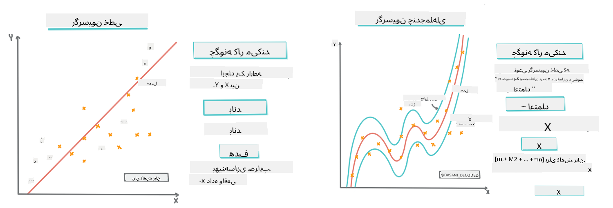
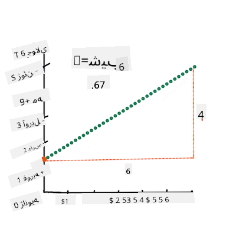
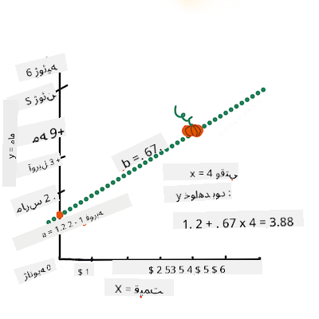

<!--
CO_OP_TRANSLATOR_METADATA:
{
  "original_hash": "2f88fbc741d792890ff2f1430fe0dae0",
  "translation_date": "2025-09-03T22:19:56+00:00",
  "source_file": "2-Regression/3-Linear/README.md",
  "language_code": "fa"
}
-->
# ساخت مدل رگرسیون با استفاده از Scikit-learn: چهار روش رگرسیون


> اینفوگرافیک توسط [Dasani Madipalli](https://twitter.com/dasani_decoded)
## [آزمون پیش از درس](https://gray-sand-07a10f403.1.azurestaticapps.net/quiz/13/)

> ### [این درس به زبان R نیز موجود است!](../../../../2-Regression/3-Linear/solution/R/lesson_3.html)
### مقدمه

تا اینجا شما با مفهوم رگرسیون آشنا شده‌اید و داده‌های نمونه‌ای از مجموعه داده‌های قیمت کدو تنبل را که در طول این درس استفاده خواهیم کرد، بررسی کرده‌اید. همچنین این داده‌ها را با استفاده از Matplotlib بصری‌سازی کرده‌اید.

اکنون آماده هستید تا به عمق بیشتری در رگرسیون برای یادگیری ماشین بپردازید. در حالی که بصری‌سازی به شما کمک می‌کند داده‌ها را درک کنید، قدرت واقعی یادگیری ماشین از _آموزش مدل‌ها_ ناشی می‌شود. مدل‌ها بر اساس داده‌های تاریخی آموزش داده می‌شوند تا وابستگی‌های داده‌ها را به صورت خودکار ثبت کنند و به شما امکان پیش‌بینی نتایج برای داده‌های جدیدی را می‌دهند که مدل قبلاً ندیده است.

در این درس، شما با دو نوع رگرسیون بیشتر آشنا خواهید شد: _رگرسیون خطی ساده_ و _رگرسیون چندجمله‌ای_، همراه با برخی از ریاضیات پایه‌ای این تکنیک‌ها. این مدل‌ها به ما امکان پیش‌بینی قیمت کدو تنبل را بر اساس داده‌های ورودی مختلف می‌دهند.

[](https://youtu.be/CRxFT8oTDMg "یادگیری ماشین برای مبتدیان - درک رگرسیون خطی")

> 🎥 روی تصویر بالا کلیک کنید تا یک ویدئوی کوتاه درباره رگرسیون خطی مشاهده کنید.

> در طول این دوره آموزشی، ما فرض می‌کنیم که دانش ریاضی شما حداقلی است و تلاش می‌کنیم آن را برای دانش‌آموزانی که از زمینه‌های دیگر می‌آیند قابل دسترس کنیم. بنابراین به یادداشت‌ها، 🧮 نکات، نمودارها و ابزارهای یادگیری دیگر برای کمک به درک توجه کنید.

### پیش‌نیاز

تا اینجا باید با ساختار داده‌های کدو تنبل که در حال بررسی آن هستیم آشنا شده باشید. این داده‌ها در فایل _notebook.ipynb_ این درس از پیش بارگذاری و پاک‌سازی شده‌اند. در این فایل، قیمت کدو تنبل به ازای هر بوشل در یک فریم داده جدید نمایش داده شده است. مطمئن شوید که می‌توانید این نوت‌بوک‌ها را در کرنل‌های Visual Studio Code اجرا کنید.

### آماده‌سازی

به یاد داشته باشید که شما این داده‌ها را بارگذاری می‌کنید تا از آن‌ها سوالاتی بپرسید.

- بهترین زمان برای خرید کدو تنبل چه زمانی است؟
- چه قیمتی را می‌توانم برای یک جعبه کدو تنبل کوچک انتظار داشته باشم؟
- آیا باید آن‌ها را در سبدهای نیم‌بوشل بخرم یا در جعبه‌های 1 1/9 بوشل؟
بیایید به بررسی این داده‌ها ادامه دهیم.

در درس قبلی، شما یک فریم داده Pandas ایجاد کردید و آن را با بخشی از مجموعه داده اصلی پر کردید، قیمت‌ها را به صورت استاندارد به ازای هر بوشل تنظیم کردید. با این حال، با انجام این کار، فقط توانستید حدود 400 نقطه داده جمع‌آوری کنید و فقط برای ماه‌های پاییز.

به داده‌هایی که در نوت‌بوک همراه این درس از پیش بارگذاری شده‌اند نگاهی بیندازید. داده‌ها از پیش بارگذاری شده‌اند و یک نمودار پراکندگی اولیه برای نمایش داده‌های ماه رسم شده است. شاید بتوانیم با پاک‌سازی بیشتر، جزئیات بیشتری درباره ماهیت داده‌ها به دست آوریم.

## یک خط رگرسیون خطی

همان‌طور که در درس 1 یاد گرفتید، هدف یک تمرین رگرسیون خطی این است که بتوانید یک خط رسم کنید تا:

- **روابط متغیرها را نشان دهید**. رابطه بین متغیرها را نشان دهید.
- **پیش‌بینی کنید**. پیش‌بینی‌های دقیقی درباره محل قرارگیری یک نقطه داده جدید نسبت به آن خط انجام دهید.

در رگرسیون **کمترین مربعات** معمول است که این نوع خط رسم شود. اصطلاح "کمترین مربعات" به این معناست که تمام نقاط داده اطراف خط رگرسیون مربع شده و سپس جمع می‌شوند. ایده‌آل این است که این مجموع نهایی تا حد ممکن کوچک باشد، زیرا ما می‌خواهیم تعداد خطاها کم باشد یا همان `کمترین مربعات`.

ما این کار را انجام می‌دهیم زیرا می‌خواهیم مدلی از یک خط داشته باشیم که کمترین فاصله تجمعی از تمام نقاط داده ما را داشته باشد. همچنین قبل از جمع کردن، مقادیر را مربع می‌کنیم زیرا به بزرگی آن‌ها اهمیت می‌دهیم نه جهت آن‌ها.

> **🧮 ریاضیات را به من نشان بده**
>
> این خط، که به آن _خط بهترین برازش_ گفته می‌شود، می‌تواند با [یک معادله](https://en.wikipedia.org/wiki/Simple_linear_regression) بیان شود:
>
> ```
> Y = a + bX
> ```
>
> `X` متغیر توضیحی است. `Y` متغیر وابسته است. شیب خط `b` است و `a` نقطه تقاطع با محور y است که به مقدار `Y` زمانی که `X = 0` اشاره دارد.
>
>
>
> ابتدا شیب `b` را محاسبه کنید. اینفوگرافیک توسط [Jen Looper](https://twitter.com/jenlooper)
>
> به عبارت دیگر، و با اشاره به سوال اصلی داده‌های کدو تنبل: "پیش‌بینی قیمت کدو تنبل به ازای هر بوشل بر اساس ماه"، `X` به قیمت اشاره دارد و `Y` به ماه فروش اشاره دارد.
>
>
>
> مقدار `Y` را محاسبه کنید. اگر حدود 4 دلار پرداخت می‌کنید، باید ماه آوریل باشد! اینفوگرافیک توسط [Jen Looper](https://twitter.com/jenlooper)
>
> ریاضیات محاسبه خط باید شیب خط را نشان دهد، که همچنین به نقطه تقاطع وابسته است، یا جایی که `Y` زمانی که `X = 0` قرار دارد.
>
> می‌توانید روش محاسبه این مقادیر را در وب‌سایت [Math is Fun](https://www.mathsisfun.com/data/least-squares-regression.html) مشاهده کنید. همچنین به [این ماشین حساب کمترین مربعات](https://www.mathsisfun.com/data/least-squares-calculator.html) مراجعه کنید تا ببینید چگونه مقادیر عددی بر خط تأثیر می‌گذارند.

## همبستگی

یک اصطلاح دیگر که باید درک کنید **ضریب همبستگی** بین متغیرهای X و Y داده شده است. با استفاده از نمودار پراکندگی، می‌توانید این ضریب را به سرعت بصری‌سازی کنید. نموداری با نقاط داده پراکنده در یک خط مرتب دارای همبستگی بالا است، اما نموداری با نقاط داده پراکنده در همه جا بین X و Y دارای همبستگی پایین است.

یک مدل رگرسیون خطی خوب مدلی است که با استفاده از روش کمترین مربعات رگرسیون و یک خط رگرسیون، ضریب همبستگی بالایی (نزدیک‌تر به 1 نسبت به 0) داشته باشد.

✅ نوت‌بوک همراه این درس را اجرا کنید و به نمودار پراکندگی ماه به قیمت نگاه کنید. آیا داده‌های مرتبط با ماه به قیمت برای فروش کدو تنبل به نظر شما همبستگی بالا یا پایینی دارند، بر اساس تفسیر بصری شما از نمودار پراکندگی؟ آیا این تغییر می‌کند اگر از اندازه‌گیری دقیق‌تر به جای `ماه` استفاده کنید، مانند *روز سال* (یعنی تعداد روزها از ابتدای سال)؟

در کد زیر، فرض می‌کنیم که داده‌ها را پاک‌سازی کرده‌ایم و یک فریم داده به نام `new_pumpkins` به دست آورده‌ایم، مشابه موارد زیر:

ID | ماه | روز سال | نوع | شهر | بسته‌بندی | قیمت پایین | قیمت بالا | قیمت
---|-------|-----------|---------|------|---------|-----------|------------|-------
70 | 9 | 267 | نوع پای | بالتیمور | جعبه‌های 1 1/9 بوشل | 15.0 | 15.0 | 13.636364
71 | 9 | 267 | نوع پای | بالتیمور | جعبه‌های 1 1/9 بوشل | 18.0 | 18.0 | 16.363636
72 | 10 | 274 | نوع پای | بالتیمور | جعبه‌های 1 1/9 بوشل | 18.0 | 18.0 | 16.363636
73 | 10 | 274 | نوع پای | بالتیمور | جعبه‌های 1 1/9 بوشل | 17.0 | 17.0 | 15.454545
74 | 10 | 281 | نوع پای | بالتیمور | جعبه‌های 1 1/9 بوشل | 15.0 | 15.0 | 13.636364

> کد پاک‌سازی داده‌ها در [`notebook.ipynb`](notebook.ipynb) موجود است. ما همان مراحل پاک‌سازی درس قبلی را انجام داده‌ایم و ستون `روز سال` را با استفاده از عبارت زیر محاسبه کرده‌ایم:

```python
day_of_year = pd.to_datetime(pumpkins['Date']).apply(lambda dt: (dt-datetime(dt.year,1,1)).days)
```

اکنون که درک بهتری از ریاضیات پشت رگرسیون خطی دارید، بیایید یک مدل رگرسیون بسازیم تا ببینیم آیا می‌توانیم پیش‌بینی کنیم کدام بسته‌بندی کدو تنبل بهترین قیمت‌ها را خواهد داشت. کسی که کدو تنبل برای یک مزرعه تعطیلاتی خریداری می‌کند ممکن است بخواهد این اطلاعات را داشته باشد تا خریدهای بسته‌های کدو تنبل برای مزرعه را بهینه کند.

## جستجوی همبستگی

[](https://youtu.be/uoRq-lW2eQo "یادگیری ماشین برای مبتدیان - جستجوی همبستگی: کلید رگرسیون خطی")

> 🎥 روی تصویر بالا کلیک کنید تا یک ویدئوی کوتاه درباره همبستگی مشاهده کنید.

از درس قبلی احتمالاً دیده‌اید که میانگین قیمت برای ماه‌های مختلف به این شکل است:


این نشان می‌دهد که باید مقداری همبستگی وجود داشته باشد، و می‌توانیم تلاش کنیم مدل رگرسیون خطی را برای پیش‌بینی رابطه بین `ماه` و `قیمت` یا بین `روز سال` و `قیمت` آموزش دهیم. اینجا نمودار پراکندگی‌ای است که رابطه دوم را نشان می‌دهد:

 

بیایید ببینیم آیا همبستگی وجود دارد با استفاده از تابع `corr`:

```python
print(new_pumpkins['Month'].corr(new_pumpkins['Price']))
print(new_pumpkins['DayOfYear'].corr(new_pumpkins['Price']))
```

به نظر می‌رسد که همبستگی بسیار کم است، -0.15 بر اساس `ماه` و -0.17 بر اساس `روز ماه`، اما ممکن است رابطه مهم دیگری وجود داشته باشد. به نظر می‌رسد که دسته‌های مختلف قیمت‌ها مربوط به انواع مختلف کدو تنبل هستند. برای تأیید این فرضیه، بیایید هر دسته کدو تنبل را با یک رنگ متفاوت رسم کنیم. با ارسال پارامتر `ax` به تابع رسم پراکندگی می‌توانیم تمام نقاط را روی یک نمودار رسم کنیم:

```python
ax=None
colors = ['red','blue','green','yellow']
for i,var in enumerate(new_pumpkins['Variety'].unique()):
    df = new_pumpkins[new_pumpkins['Variety']==var]
    ax = df.plot.scatter('DayOfYear','Price',ax=ax,c=colors[i],label=var)
```

 

تحقیقات ما نشان می‌دهد که نوع کدو تنبل تأثیر بیشتری بر قیمت کلی نسبت به تاریخ فروش دارد. می‌توانیم این را با یک نمودار میله‌ای ببینیم:

```python
new_pumpkins.groupby('Variety')['Price'].mean().plot(kind='bar')
```

 

بیایید فعلاً فقط بر یک نوع کدو تنبل، نوع 'پای'، تمرکز کنیم و ببینیم تاریخ چه تأثیری بر قیمت دارد:

```python
pie_pumpkins = new_pumpkins[new_pumpkins['Variety']=='PIE TYPE']
pie_pumpkins.plot.scatter('DayOfYear','Price') 
```
 

اگر اکنون همبستگی بین `قیمت` و `روز سال` را با استفاده از تابع `corr` محاسبه کنیم، چیزی حدود `-0.27` به دست خواهیم آورد - که نشان می‌دهد آموزش یک مدل پیش‌بینی منطقی است.

> قبل از آموزش مدل رگرسیون خطی، مهم است که مطمئن شویم داده‌های ما پاک هستند. رگرسیون خطی با مقادیر گمشده خوب کار نمی‌کند، بنابراین منطقی است که تمام سلول‌های خالی را حذف کنیم:

```python
pie_pumpkins.dropna(inplace=True)
pie_pumpkins.info()
```

یک روش دیگر این است که این مقادیر خالی را با مقادیر میانگین از ستون مربوطه پر کنیم.

## رگرسیون خطی ساده

[](https://youtu.be/e4c_UP2fSjg "یادگیری ماشین برای مبتدیان - رگرسیون خطی و چندجمله‌ای با استفاده از Scikit-learn")

> 🎥 روی تصویر بالا کلیک کنید تا یک ویدئوی کوتاه درباره رگرسیون خطی و چندجمله‌ای مشاهده کنید.

برای آموزش مدل رگرسیون خطی خود، از کتابخانه **Scikit-learn** استفاده خواهیم کرد.

```python
from sklearn.linear_model import LinearRegression
from sklearn.metrics import mean_squared_error
from sklearn.model_selection import train_test_split
```

ابتدا باید مقادیر ورودی (ویژگی‌ها) و خروجی مورد انتظار (برچسب) را به آرایه‌های numpy جداگانه تقسیم کنیم:

```python
X = pie_pumpkins['DayOfYear'].to_numpy().reshape(-1,1)
y = pie_pumpkins['Price']
```

> توجه داشته باشید که ما باید `reshape` را روی داده‌های ورودی انجام دهیم تا بسته رگرسیون خطی آن را به درستی درک کند. رگرسیون خطی یک آرایه دو‌بعدی را به عنوان ورودی انتظار دارد، که هر سطر آرایه مربوط به یک بردار از ویژگی‌های ورودی است. در مورد ما، چون فقط یک ورودی داریم - به آرایه‌ای با شکل N×1 نیاز داریم، که N اندازه مجموعه داده است.

سپس، باید داده‌ها را به مجموعه‌های آموزشی و آزمایشی تقسیم کنیم تا بتوانیم مدل خود را پس از آموزش اعتبارسنجی کنیم:

```python
X_train, X_test, y_train, y_test = train_test_split(X, y, test_size=0.2, random_state=0)
```

در نهایت، آموزش مدل رگرسیون خطی واقعی فقط دو خط کد طول می‌کشد. ما شیء `LinearRegression` را تعریف می‌کنیم و آن را با استفاده از روش `fit` به داده‌های خود تطبیق می‌دهیم:

```python
lin_reg = LinearRegression()
lin_reg.fit(X_train,y_train)
```

شیء `LinearRegression` پس از تطبیق شامل تمام ضرایب رگرسیون است، که می‌توان با استفاده از ویژگی `.coef_` به آن‌ها دسترسی داشت. در مورد ما، فقط یک ضریب وجود دارد، که باید حدود `-0.017` باشد. این به این معناست که قیمت‌ها به نظر می‌رسد کمی با گذشت زمان کاهش می‌یابند، اما نه خیلی زیاد، حدود 2 سنت در روز. همچنین می‌توانیم نقطه تقاطع رگرسیون با محور Y را با استفاده از `lin_reg.intercept_` دسترسی داشته باشیم - که در مورد ما حدود `21` خواهد بود، که نشان‌دهنده قیمت در ابتدای سال است.

برای دیدن اینکه مدل ما چقدر دقیق است، می‌توانیم قیمت‌ها را در مجموعه داده آزمایشی پیش‌بینی کنیم و سپس اندازه‌گیری کنیم که پیش‌بینی‌های ما چقدر به مقادیر مورد انتظار نزدیک هستند. این کار را می‌توان با معیار خطای میانگین مربعات (MSE) انجام داد، که میانگین تمام تفاوت‌های مربعی بین مقدار مورد انتظار و مقدار پیش‌بینی‌شده است.

```python
pred = lin_reg.predict(X_test)

mse = np.sqrt(mean_squared_error(y_test,pred))
print(f'Mean error: {mse:3.3} ({mse/np.mean(pred)*100:3.3}%)')
```
به نظر می‌رسد خطای ما در حدود ۲ نقطه است، که تقریباً برابر با ۱۷٪ می‌باشد. این خیلی خوب نیست. یکی دیگر از شاخص‌های کیفیت مدل **ضریب تعیین** است، که می‌توان آن را به این صورت محاسبه کرد:

```python
score = lin_reg.score(X_train,y_train)
print('Model determination: ', score)
```  
اگر مقدار برابر با ۰ باشد، به این معناست که مدل داده‌های ورودی را در نظر نمی‌گیرد و به عنوان *بدترین پیش‌بینی‌کننده خطی* عمل می‌کند، که صرفاً میانگین نتایج است. مقدار ۱ نشان می‌دهد که می‌توانیم تمام خروجی‌های مورد انتظار را به طور کامل پیش‌بینی کنیم. در مورد ما، ضریب تعیین حدود ۰.۰۶ است، که بسیار پایین است.

ما همچنین می‌توانیم داده‌های آزمایشی را همراه با خط رگرسیون رسم کنیم تا بهتر ببینیم که رگرسیون در مورد ما چگونه عمل می‌کند:

```python
plt.scatter(X_test,y_test)
plt.plot(X_test,pred)
```  


## رگرسیون چندجمله‌ای  

نوع دیگری از رگرسیون خطی، رگرسیون چندجمله‌ای است. گاهی اوقات رابطه خطی بین متغیرها وجود دارد - مثلاً هرچه حجم کدو تنبل بزرگ‌تر باشد، قیمت بالاتر می‌رود - اما گاهی این روابط نمی‌توانند به صورت یک صفحه یا خط مستقیم رسم شوند.

✅ [اینجا چند مثال دیگر](https://online.stat.psu.edu/stat501/lesson/9/9.8) از داده‌هایی که می‌توانند از رگرسیون چندجمله‌ای استفاده کنند آورده شده است.

یک بار دیگر به رابطه بین تاریخ و قیمت نگاه کنید. آیا این نمودار پراکندگی به نظر می‌رسد که باید لزوماً با یک خط مستقیم تحلیل شود؟ آیا قیمت‌ها نمی‌توانند نوسان داشته باشند؟ در این حالت، می‌توانید رگرسیون چندجمله‌ای را امتحان کنید.

✅ چندجمله‌ای‌ها عبارت‌های ریاضی هستند که ممکن است شامل یک یا چند متغیر و ضرایب باشند.

رگرسیون چندجمله‌ای یک خط منحنی ایجاد می‌کند تا داده‌های غیرخطی را بهتر تطبیق دهد. در مورد ما، اگر یک متغیر `DayOfYear` به توان دو را به داده‌های ورودی اضافه کنیم، باید بتوانیم داده‌های خود را با یک منحنی سهمی تطبیق دهیم، که در یک نقطه خاص در طول سال حداقل خواهد بود.

کتابخانه Scikit-learn شامل یک [API خط لوله](https://scikit-learn.org/stable/modules/generated/sklearn.pipeline.make_pipeline.html?highlight=pipeline#sklearn.pipeline.make_pipeline) مفید است که مراحل مختلف پردازش داده‌ها را با هم ترکیب می‌کند. **خط لوله** زنجیره‌ای از **تخمین‌گرها** است. در مورد ما، یک خط لوله ایجاد خواهیم کرد که ابتدا ویژگی‌های چندجمله‌ای را به مدل اضافه می‌کند و سپس رگرسیون را آموزش می‌دهد:

```python
from sklearn.preprocessing import PolynomialFeatures
from sklearn.pipeline import make_pipeline

pipeline = make_pipeline(PolynomialFeatures(2), LinearRegression())

pipeline.fit(X_train,y_train)
```  

استفاده از `PolynomialFeatures(2)` به این معناست که تمام چندجمله‌ای‌های درجه دوم از داده‌های ورودی را شامل می‌شود. در مورد ما، این فقط به معنای `DayOfYear`<sup>2</sup> خواهد بود، اما با دو متغیر ورودی X و Y، این شامل X<sup>2</sup>، XY و Y<sup>2</sup> نیز خواهد بود. اگر بخواهیم، می‌توانیم از چندجمله‌ای‌های درجه بالاتر نیز استفاده کنیم.

خط لوله‌ها را می‌توان به همان شیوه‌ای که شیء اصلی `LinearRegression` استفاده می‌شود، به کار برد، یعنی می‌توانیم خط لوله را `fit` کنیم و سپس از `predict` برای دریافت نتایج پیش‌بینی استفاده کنیم. اینجا نموداری است که داده‌های آزمایشی و منحنی تقریب را نشان می‌دهد:


با استفاده از رگرسیون چندجمله‌ای، می‌توانیم MSE کمی پایین‌تر و ضریب تعیین بالاتری داشته باشیم، اما نه به طور قابل توجهی. باید ویژگی‌های دیگر را نیز در نظر بگیریم!

> می‌توانید ببینید که حداقل قیمت‌های کدو تنبل در حوالی هالووین مشاهده می‌شود. چگونه می‌توانید این را توضیح دهید؟

🎃 تبریک می‌گوییم، شما مدلی ایجاد کردید که می‌تواند قیمت کدو تنبل‌های پای را پیش‌بینی کند. احتمالاً می‌توانید همین روش را برای همه انواع کدو تنبل تکرار کنید، اما این کار خسته‌کننده خواهد بود. حالا بیایید یاد بگیریم که چگونه نوع کدو تنبل را در مدل خود در نظر بگیریم!

## ویژگی‌های دسته‌بندی‌شده  

در دنیای ایده‌آل، می‌خواهیم بتوانیم قیمت‌ها را برای انواع مختلف کدو تنبل با استفاده از یک مدل پیش‌بینی کنیم. با این حال، ستون `Variety` کمی متفاوت از ستون‌هایی مانند `Month` است، زیرا شامل مقادیر غیرعددی است. چنین ستون‌هایی **دسته‌بندی‌شده** نامیده می‌شوند.

[](https://youtu.be/DYGliioIAE0 "یادگیری ماشین برای مبتدیان - پیش‌بینی ویژگی‌های دسته‌بندی‌شده با رگرسیون خطی")

> 🎥 روی تصویر بالا کلیک کنید تا یک ویدئوی کوتاه درباره استفاده از ویژگی‌های دسته‌بندی‌شده ببینید.

اینجا می‌توانید ببینید که چگونه قیمت متوسط به نوع کدو تنبل بستگی دارد:


برای در نظر گرفتن نوع کدو تنبل، ابتدا باید آن را به شکل عددی تبدیل کنیم، یا **کدگذاری** کنیم. چند روش برای این کار وجود دارد:

* **کدگذاری عددی ساده** یک جدول از انواع مختلف ایجاد می‌کند و سپس نام نوع را با یک شاخص در آن جدول جایگزین می‌کند. این روش برای رگرسیون خطی بهترین نیست، زیرا رگرسیون خطی مقدار عددی واقعی شاخص را می‌گیرد و آن را به نتیجه اضافه می‌کند، ضرب در یک ضریب خاص. در مورد ما، رابطه بین شماره شاخص و قیمت به وضوح غیرخطی است، حتی اگر مطمئن شویم که شاخص‌ها به ترتیب خاصی مرتب شده‌اند.
* **کدگذاری یک‌داغ** ستون `Variety` را با ۴ ستون مختلف جایگزین می‌کند، یکی برای هر نوع. هر ستون شامل `1` خواهد بود اگر ردیف مربوطه از نوع خاصی باشد، و در غیر این صورت `0`. این به این معناست که در رگرسیون خطی، چهار ضریب وجود خواهد داشت، یکی برای هر نوع کدو تنبل، که مسئول "قیمت پایه" (یا بهتر بگوییم "قیمت اضافی") برای آن نوع خاص است.

کد زیر نشان می‌دهد که چگونه می‌توان یک نوع را به صورت یک‌داغ کدگذاری کرد:

```python
pd.get_dummies(new_pumpkins['Variety'])
```  

 ID | FAIRYTALE | MINIATURE | MIXED HEIRLOOM VARIETIES | PIE TYPE  
----|-----------|-----------|--------------------------|----------  
70 | 0 | 0 | 0 | 1  
71 | 0 | 0 | 0 | 1  
... | ... | ... | ... | ...  
1738 | 0 | 1 | 0 | 0  
1739 | 0 | 1 | 0 | 0  
1740 | 0 | 1 | 0 | 0  
1741 | 0 | 1 | 0 | 0  
1742 | 0 | 1 | 0 | 0  

برای آموزش رگرسیون خطی با استفاده از نوع کدگذاری‌شده به صورت یک‌داغ به عنوان ورودی، فقط باید داده‌های `X` و `y` را به درستی مقداردهی کنیم:

```python
X = pd.get_dummies(new_pumpkins['Variety'])
y = new_pumpkins['Price']
```  

بقیه کد مشابه چیزی است که در بالا برای آموزش رگرسیون خطی استفاده کردیم. اگر آن را امتحان کنید، خواهید دید که میانگین مربعات خطا تقریباً همان است، اما ضریب تعیین بسیار بالاتر (~77٪) است. برای پیش‌بینی‌های دقیق‌تر، می‌توانیم ویژگی‌های دسته‌بندی‌شده بیشتری را در نظر بگیریم، همچنین ویژگی‌های عددی مانند `Month` یا `DayOfYear`. برای ایجاد یک آرایه بزرگ از ویژگی‌ها، می‌توانیم از `join` استفاده کنیم:

```python
X = pd.get_dummies(new_pumpkins['Variety']) \
        .join(new_pumpkins['Month']) \
        .join(pd.get_dummies(new_pumpkins['City'])) \
        .join(pd.get_dummies(new_pumpkins['Package']))
y = new_pumpkins['Price']
```  

اینجا همچنین `City` و نوع `Package` را در نظر می‌گیریم، که به ما MSE برابر با 2.84 (10٪) و ضریب تعیین 0.94 می‌دهد!

## جمع‌بندی همه چیز  

برای ایجاد بهترین مدل، می‌توانیم داده‌های ترکیبی (دسته‌بندی‌شده کدگذاری‌شده به صورت یک‌داغ + عددی) از مثال بالا را همراه با رگرسیون چندجمله‌ای استفاده کنیم. اینجا کد کامل برای راحتی شما آورده شده است:

```python
# set up training data
X = pd.get_dummies(new_pumpkins['Variety']) \
        .join(new_pumpkins['Month']) \
        .join(pd.get_dummies(new_pumpkins['City'])) \
        .join(pd.get_dummies(new_pumpkins['Package']))
y = new_pumpkins['Price']

# make train-test split
X_train, X_test, y_train, y_test = train_test_split(X, y, test_size=0.2, random_state=0)

# setup and train the pipeline
pipeline = make_pipeline(PolynomialFeatures(2), LinearRegression())
pipeline.fit(X_train,y_train)

# predict results for test data
pred = pipeline.predict(X_test)

# calculate MSE and determination
mse = np.sqrt(mean_squared_error(y_test,pred))
print(f'Mean error: {mse:3.3} ({mse/np.mean(pred)*100:3.3}%)')

score = pipeline.score(X_train,y_train)
print('Model determination: ', score)
```  

این باید بهترین ضریب تعیین تقریباً 97٪ و MSE=2.23 (~8٪ خطای پیش‌بینی) را به ما بدهد.

| مدل | MSE | ضریب تعیین |  
|-------|-----|---------------|  
| `DayOfYear` خطی | 2.77 (17.2٪) | 0.07 |  
| `DayOfYear` چندجمله‌ای | 2.73 (17.0٪) | 0.08 |  
| `Variety` خطی | 5.24 (19.7٪) | 0.77 |  
| همه ویژگی‌ها خطی | 2.84 (10.5٪) | 0.94 |  
| همه ویژگی‌ها چندجمله‌ای | 2.23 (8.25٪) | 0.97 |  

🏆 آفرین! شما چهار مدل رگرسیون را در یک درس ایجاد کردید و کیفیت مدل را به 97٪ بهبود دادید. در بخش نهایی درباره رگرسیون، یاد خواهید گرفت که چگونه از رگرسیون لجستیک برای تعیین دسته‌ها استفاده کنید.

---

## 🚀چالش  

چندین متغیر مختلف را در این دفترچه آزمایش کنید تا ببینید چگونه همبستگی با دقت مدل مطابقت دارد.

## [آزمون پس از درس](https://gray-sand-07a10f403.1.azurestaticapps.net/quiz/14/)

## مرور و مطالعه شخصی  

در این درس درباره رگرسیون خطی یاد گرفتیم. انواع مهم دیگری از رگرسیون نیز وجود دارند. درباره تکنیک‌های Stepwise، Ridge، Lasso و Elasticnet مطالعه کنید. یک دوره خوب برای یادگیری بیشتر [دوره یادگیری آماری استنفورد](https://online.stanford.edu/courses/sohs-ystatslearning-statistical-learning) است.

## تکلیف  

[یک مدل بسازید](assignment.md)  

---

**سلب مسئولیت**:  
این سند با استفاده از سرویس ترجمه هوش مصنوعی [Co-op Translator](https://github.com/Azure/co-op-translator) ترجمه شده است. در حالی که ما تلاش می‌کنیم دقت را حفظ کنیم، لطفاً توجه داشته باشید که ترجمه‌های خودکار ممکن است شامل خطاها یا نادرستی‌ها باشند. سند اصلی به زبان اصلی آن باید به عنوان منبع معتبر در نظر گرفته شود. برای اطلاعات حساس، توصیه می‌شود از ترجمه حرفه‌ای انسانی استفاده کنید. ما مسئولیتی در قبال سوء تفاهم‌ها یا تفسیرهای نادرست ناشی از استفاده از این ترجمه نداریم.