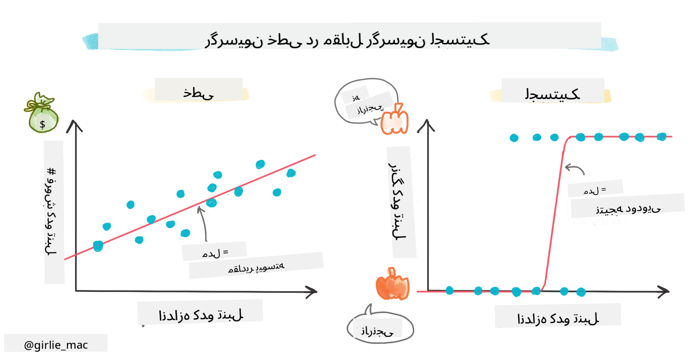
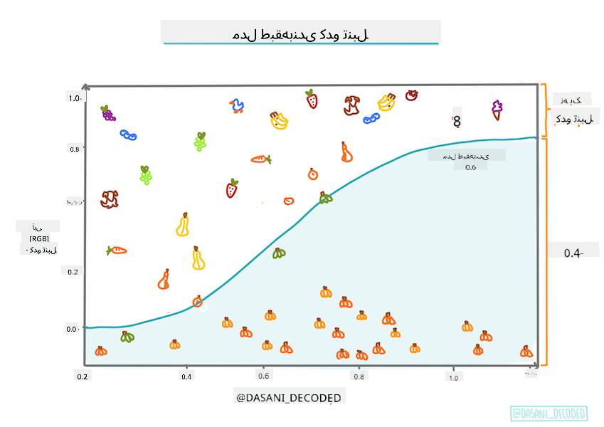
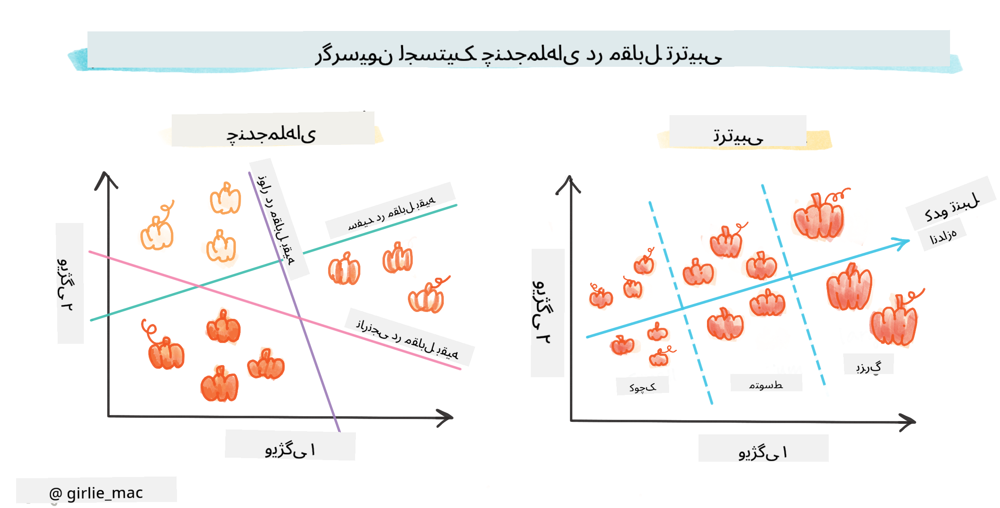
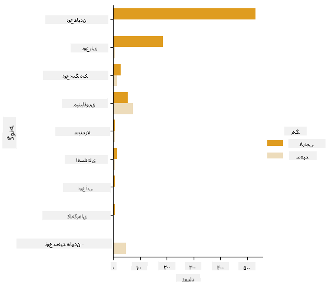
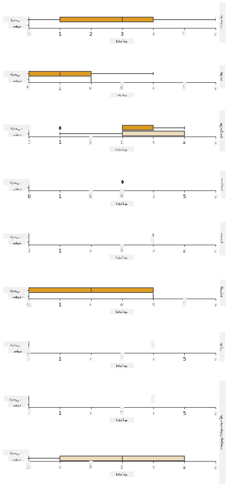
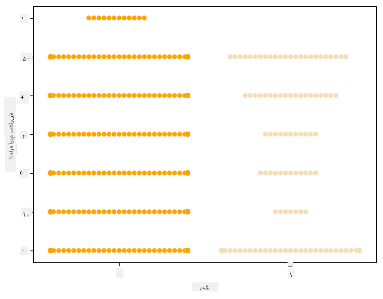
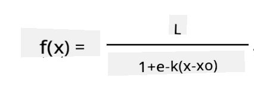
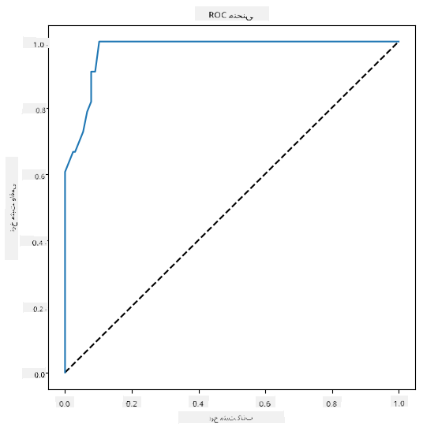

<!--
CO_OP_TRANSLATOR_METADATA:
{
  "original_hash": "72b5bae0879baddf6aafc82bb07b8776",
  "translation_date": "2025-09-03T22:29:18+00:00",
  "source_file": "2-Regression/4-Logistic/README.md",
  "language_code": "fa"
}
-->
# رگرسیون لجستیک برای پیش‌بینی دسته‌ها



## [آزمون پیش از درس](https://gray-sand-07a10f403.1.azurestaticapps.net/quiz/15/)

> ### [این درس به زبان R نیز موجود است!](../../../../2-Regression/4-Logistic/solution/R/lesson_4.html)

## مقدمه

در این درس پایانی درباره رگرسیون، یکی از تکنیک‌های پایه‌ای و کلاسیک یادگیری ماشین، به رگرسیون لجستیک خواهیم پرداخت. از این تکنیک برای کشف الگوها جهت پیش‌بینی دسته‌های دودویی استفاده می‌شود. آیا این آب‌نبات شکلاتی است یا نه؟ آیا این بیماری واگیردار است یا نه؟ آیا این مشتری این محصول را انتخاب خواهد کرد یا نه؟

در این درس یاد خواهید گرفت:

- یک کتابخانه جدید برای مصورسازی داده‌ها
- تکنیک‌های رگرسیون لجستیک

✅ درک خود را از کار با این نوع رگرسیون در این [ماژول آموزشی](https://docs.microsoft.com/learn/modules/train-evaluate-classification-models?WT.mc_id=academic-77952-leestott) عمیق‌تر کنید.

## پیش‌نیاز

با کار کردن روی داده‌های کدو تنبل، اکنون به اندازه کافی با آن آشنا هستیم تا متوجه شویم که یک دسته دودویی وجود دارد که می‌توانیم با آن کار کنیم: `Color`.

بیایید یک مدل رگرسیون لجستیک بسازیم تا پیش‌بینی کنیم که با توجه به برخی متغیرها، _رنگ یک کدو تنبل چه خواهد بود_ (نارنجی 🎃 یا سفید 👻).

> چرا در یک درس درباره رگرسیون، درباره دسته‌بندی دودویی صحبت می‌کنیم؟ فقط به دلیل راحتی زبانی، زیرا رگرسیون لجستیک [در واقع یک روش دسته‌بندی](https://scikit-learn.org/stable/modules/linear_model.html#logistic-regression) است، هرچند مبتنی بر خطی. درباره روش‌های دیگر دسته‌بندی داده‌ها در گروه درس بعدی بیاموزید.

## تعریف سوال

برای اهداف ما، این را به صورت دودویی بیان می‌کنیم: 'سفید' یا 'غیر سفید'. همچنین یک دسته 'راه‌راه' در مجموعه داده ما وجود دارد، اما تعداد نمونه‌های آن کم است، بنابراین از آن استفاده نمی‌کنیم. این دسته به هر حال پس از حذف مقادیر خالی از مجموعه داده ناپدید می‌شود.

> 🎃 نکته جالب: گاهی اوقات کدوهای سفید را کدوهای 'شبح' می‌نامیم. آن‌ها خیلی راحت برای حکاکی نیستند، بنابراین به اندازه کدوهای نارنجی محبوب نیستند، اما ظاهر جالبی دارند! بنابراین می‌توانیم سوال خود را به این صورت نیز بازفرموله کنیم: 'شبح' یا 'غیر شبح'. 👻

## درباره رگرسیون لجستیک

رگرسیون لجستیک در چندین جنبه مهم با رگرسیون خطی که قبلاً درباره آن آموختید، متفاوت است.

[](https://youtu.be/KpeCT6nEpBY "یادگیری ماشین برای مبتدیان - درک رگرسیون لجستیک برای دسته‌بندی داده‌ها")

> 🎥 روی تصویر بالا کلیک کنید تا یک ویدئوی کوتاه درباره رگرسیون لجستیک مشاهده کنید.

### دسته‌بندی دودویی

رگرسیون لجستیک ویژگی‌های مشابه رگرسیون خطی را ارائه نمی‌دهد. اولی پیش‌بینی درباره یک دسته دودویی ("سفید یا غیر سفید") ارائه می‌دهد، در حالی که دومی قادر به پیش‌بینی مقادیر پیوسته است، برای مثال با توجه به منشأ کدو تنبل و زمان برداشت، _چقدر قیمت آن افزایش خواهد یافت_.


> اینفوگرافیک توسط [Dasani Madipalli](https://twitter.com/dasani_decoded)

### دسته‌بندی‌های دیگر

انواع دیگری از رگرسیون لجستیک وجود دارد، از جمله چندجمله‌ای و ترتیبی:

- **چندجمله‌ای**، که شامل داشتن بیش از یک دسته است - "نارنجی، سفید و راه‌راه".
- **ترتیبی**، که شامل دسته‌های مرتب شده است، مفید اگر بخواهیم نتایج خود را به صورت منطقی مرتب کنیم، مانند کدوهای ما که بر اساس تعداد محدودی از اندازه‌ها مرتب شده‌اند (کوچک، متوسط، بزرگ، خیلی بزرگ).



### متغیرها لازم نیست همبستگی داشته باشند

به یاد دارید که رگرسیون خطی با متغیرهای همبسته بهتر کار می‌کرد؟ رگرسیون لجستیک برعکس است - متغیرها لازم نیست هم‌راستا باشند. این برای این داده‌ها که همبستگی‌های نسبتاً ضعیفی دارند، مناسب است.

### شما به داده‌های تمیز زیادی نیاز دارید

رگرسیون لجستیک نتایج دقیق‌تری ارائه می‌دهد اگر از داده‌های بیشتری استفاده کنید؛ مجموعه داده کوچک ما برای این کار بهینه نیست، بنابراین این نکته را در نظر داشته باشید.

[](https://youtu.be/B2X4H9vcXTs "یادگیری ماشین برای مبتدیان - تحلیل و آماده‌سازی داده‌ها برای رگرسیون لجستیک")

✅ به انواع داده‌هایی فکر کنید که برای رگرسیون لجستیک مناسب هستند.

## تمرین - مرتب‌سازی داده‌ها

ابتدا داده‌ها را کمی تمیز کنید، مقادیر خالی را حذف کنید و فقط برخی از ستون‌ها را انتخاب کنید:

1. کد زیر را اضافه کنید:

    ```python
  
    columns_to_select = ['City Name','Package','Variety', 'Origin','Item Size', 'Color']
    pumpkins = full_pumpkins.loc[:, columns_to_select]

    pumpkins.dropna(inplace=True)
    ```

    همیشه می‌توانید نگاهی به دیتافریم جدید خود بیندازید:

    ```python
    pumpkins.info
    ```

### مصورسازی - نمودار دسته‌بندی

تا اینجا شما [دفترچه شروع](./notebook.ipynb) را با داده‌های کدو تنبل بارگذاری کرده‌اید و آن را تمیز کرده‌اید تا مجموعه داده‌ای شامل چند متغیر، از جمله `Color` حفظ شود. بیایید دیتافریم را در دفترچه با استفاده از یک کتابخانه متفاوت مصورسازی کنیم: [Seaborn](https://seaborn.pydata.org/index.html)، که بر اساس Matplotlib ساخته شده است که قبلاً استفاده کردیم.

Seaborn روش‌های جالبی برای مصورسازی داده‌های شما ارائه می‌دهد. برای مثال، می‌توانید توزیع داده‌ها را برای هر `Variety` و `Color` در یک نمودار دسته‌بندی مقایسه کنید.

1. چنین نموداری را با استفاده از تابع `catplot`، داده‌های کدو تنبل `pumpkins`، و مشخص کردن یک نگاشت رنگی برای هر دسته کدو تنبل (نارنجی یا سفید) ایجاد کنید:

    ```python
    import seaborn as sns
    
    palette = {
    'ORANGE': 'orange',
    'WHITE': 'wheat',
    }

    sns.catplot(
    data=pumpkins, y="Variety", hue="Color", kind="count",
    palette=palette, 
    )
    ```

    

    با مشاهده داده‌ها، می‌توانید ببینید که داده‌های رنگ چگونه به نوع کدو تنبل مرتبط هستند.

    ✅ با توجه به این نمودار دسته‌بندی، چه اکتشافات جالبی می‌توانید تصور کنید؟

### پیش‌پردازش داده‌ها: کدگذاری ویژگی‌ها و برچسب‌ها

مجموعه داده کدو تنبل ما شامل مقادیر رشته‌ای برای تمام ستون‌های آن است. کار با داده‌های دسته‌بندی برای انسان‌ها شهودی است اما برای ماشین‌ها نه. الگوریتم‌های یادگیری ماشین با اعداد بهتر کار می‌کنند. به همین دلیل کدگذاری یک مرحله بسیار مهم در مرحله پیش‌پردازش داده‌ها است، زیرا به ما امکان می‌دهد داده‌های دسته‌بندی را به داده‌های عددی تبدیل کنیم، بدون از دست دادن اطلاعات. کدگذاری خوب منجر به ساخت یک مدل خوب می‌شود.

برای کدگذاری ویژگی‌ها دو نوع اصلی کدگذار وجود دارد:

1. کدگذار ترتیبی: برای متغیرهای ترتیبی مناسب است، که متغیرهای دسته‌بندی هستند که داده‌های آن‌ها از یک ترتیب منطقی پیروی می‌کنند، مانند ستون `Item Size` در مجموعه داده ما. این کدگذار یک نگاشت ایجاد می‌کند که هر دسته با یک عدد نشان داده می‌شود، که ترتیب دسته در ستون است.

    ```python
    from sklearn.preprocessing import OrdinalEncoder

    item_size_categories = [['sml', 'med', 'med-lge', 'lge', 'xlge', 'jbo', 'exjbo']]
    ordinal_features = ['Item Size']
    ordinal_encoder = OrdinalEncoder(categories=item_size_categories)
    ```

2. کدگذار دسته‌بندی: برای متغیرهای اسمی مناسب است، که متغیرهای دسته‌بندی هستند که داده‌های آن‌ها از یک ترتیب منطقی پیروی نمی‌کنند، مانند تمام ویژگی‌های متفاوت از `Item Size` در مجموعه داده ما. این یک کدگذاری یک‌به‌چند است، به این معنی که هر دسته با یک ستون دودویی نشان داده می‌شود: متغیر کدگذاری شده برابر با 1 است اگر کدو تنبل متعلق به آن نوع باشد و در غیر این صورت برابر با 0 است.

    ```python
    from sklearn.preprocessing import OneHotEncoder

    categorical_features = ['City Name', 'Package', 'Variety', 'Origin']
    categorical_encoder = OneHotEncoder(sparse_output=False)
    ```

سپس، `ColumnTransformer` برای ترکیب چندین کدگذار در یک مرحله و اعمال آن‌ها به ستون‌های مناسب استفاده می‌شود.

```python
    from sklearn.compose import ColumnTransformer
    
    ct = ColumnTransformer(transformers=[
        ('ord', ordinal_encoder, ordinal_features),
        ('cat', categorical_encoder, categorical_features)
        ])
    
    ct.set_output(transform='pandas')
    encoded_features = ct.fit_transform(pumpkins)
```

از طرف دیگر، برای کدگذاری برچسب، از کلاس `LabelEncoder` در scikit-learn استفاده می‌کنیم، که یک کلاس کمکی برای کمک به نرمال‌سازی برچسب‌ها است به طوری که فقط شامل مقادیر بین 0 و n_classes-1 (اینجا، 0 و 1) باشد.

```python
    from sklearn.preprocessing import LabelEncoder

    label_encoder = LabelEncoder()
    encoded_label = label_encoder.fit_transform(pumpkins['Color'])
```

پس از کدگذاری ویژگی‌ها و برچسب، می‌توانیم آن‌ها را در یک دیتافریم جدید `encoded_pumpkins` ادغام کنیم.

```python
    encoded_pumpkins = encoded_features.assign(Color=encoded_label)
```

✅ مزایای استفاده از کدگذار ترتیبی برای ستون `Item Size` چیست؟

### تحلیل روابط بین متغیرها

اکنون که داده‌های خود را پیش‌پردازش کرده‌ایم، می‌توانیم روابط بین ویژگی‌ها و برچسب را تحلیل کنیم تا ایده‌ای از اینکه مدل چقدر قادر به پیش‌بینی برچسب با توجه به ویژگی‌ها خواهد بود، به دست آوریم. بهترین راه برای انجام این نوع تحلیل، رسم داده‌ها است. دوباره از تابع `catplot` در Seaborn استفاده خواهیم کرد تا روابط بین `Item Size`، `Variety` و `Color` را در یک نمودار دسته‌بندی مصورسازی کنیم. برای بهتر رسم داده‌ها از ستون کدگذاری شده `Item Size` و ستون غیرکدگذاری شده `Variety` استفاده خواهیم کرد.

```python
    palette = {
    'ORANGE': 'orange',
    'WHITE': 'wheat',
    }
    pumpkins['Item Size'] = encoded_pumpkins['ord__Item Size']

    g = sns.catplot(
        data=pumpkins,
        x="Item Size", y="Color", row='Variety',
        kind="box", orient="h",
        sharex=False, margin_titles=True,
        height=1.8, aspect=4, palette=palette,
    )
    g.set(xlabel="Item Size", ylabel="").set(xlim=(0,6))
    g.set_titles(row_template="{row_name}")
```



### استفاده از نمودار Swarm

از آنجا که `Color` یک دسته دودویی است (سفید یا غیر سفید)، نیاز به 'یک [رویکرد تخصصی](https://seaborn.pydata.org/tutorial/categorical.html?highlight=bar) برای مصورسازی' دارد. روش‌های دیگری برای مصورسازی رابطه این دسته با سایر متغیرها وجود دارد.

می‌توانید متغیرها را کنار هم با نمودارهای Seaborn مصورسازی کنید.

1. یک نمودار 'Swarm' را امتحان کنید تا توزیع مقادیر را نشان دهید:

    ```python
    palette = {
    0: 'orange',
    1: 'wheat'
    }
    sns.swarmplot(x="Color", y="ord__Item Size", data=encoded_pumpkins, palette=palette)
    ```

    

**توجه**: کد بالا ممکن است یک هشدار ایجاد کند، زیرا Seaborn نمی‌تواند چنین مقدار زیادی از نقاط داده را در یک نمودار Swarm نمایش دهد. یک راه‌حل ممکن کاهش اندازه نشانگر با استفاده از پارامتر 'size' است. با این حال، توجه داشته باشید که این بر خوانایی نمودار تأثیر می‌گذارد.

> **🧮 ریاضیات را به من نشان بده**
>
> رگرسیون لجستیک بر مفهوم 'حداکثر احتمال' با استفاده از [توابع سیگموئید](https://wikipedia.org/wiki/Sigmoid_function) متکی است. یک 'تابع سیگموئید' در نمودار شبیه یک شکل 'S' است. این مقدار را می‌گیرد و آن را به جایی بین 0 و 1 نگاشت می‌کند. منحنی آن همچنین به عنوان 'منحنی لجستیک' شناخته می‌شود. فرمول آن به این صورت است:
>
> 
>
> که نقطه میانی سیگموئید در نقطه 0 محور x قرار دارد، L حداکثر مقدار منحنی است، و k شیب منحنی است. اگر نتیجه تابع بیشتر از 0.5 باشد، برچسب مورد نظر به کلاس '1' از انتخاب دودویی داده می‌شود. در غیر این صورت، به عنوان '0' طبقه‌بندی می‌شود.

## ساخت مدل خود

ساخت یک مدل برای یافتن این دسته‌بندی دودویی در Scikit-learn به طرز شگفت‌آوری ساده است.

[](https://youtu.be/MmZS2otPrQ8 "یادگیری ماشین برای مبتدیان - رگرسیون لجستیک برای دسته‌بندی داده‌ها")

> 🎥 روی تصویر بالا کلیک کنید تا یک ویدئوی کوتاه درباره ساخت مدل رگرسیون خطی مشاهده کنید.

1. متغیرهایی را که می‌خواهید در مدل دسته‌بندی خود استفاده کنید انتخاب کنید و مجموعه‌های آموزشی و آزمایشی را با فراخوانی `train_test_split()` تقسیم کنید:

    ```python
    from sklearn.model_selection import train_test_split
    
    X = encoded_pumpkins[encoded_pumpkins.columns.difference(['Color'])]
    y = encoded_pumpkins['Color']

    X_train, X_test, y_train, y_test = train_test_split(X, y, test_size=0.2, random_state=0)
    
    ```

2. اکنون می‌توانید مدل خود را با فراخوانی `fit()` با داده‌های آموزشی خود آموزش دهید و نتیجه آن را چاپ کنید:

    ```python
    from sklearn.metrics import f1_score, classification_report 
    from sklearn.linear_model import LogisticRegression

    model = LogisticRegression()
    model.fit(X_train, y_train)
    predictions = model.predict(X_test)

    print(classification_report(y_test, predictions))
    print('Predicted labels: ', predictions)
    print('F1-score: ', f1_score(y_test, predictions))
    ```

    به امتیاز مدل خود نگاه کنید. با توجه به اینکه فقط حدود 1000 ردیف داده دارید، بد نیست:

    ```output
                       precision    recall  f1-score   support
    
                    0       0.94      0.98      0.96       166
                    1       0.85      0.67      0.75        33
    
        accuracy                                0.92       199
        macro avg           0.89      0.82      0.85       199
        weighted avg        0.92      0.92      0.92       199
    
        Predicted labels:  [0 0 0 0 0 0 0 0 0 0 0 0 0 0 0 0 0 0 0 0 1 0 0 1 0 0 0 0 0 0 0 0 1 0 0 0 0
        0 0 0 0 0 1 0 1 0 0 1 0 0 0 0 0 1 0 1 0 1 0 1 0 0 0 0 0 0 0 0 0 0 0 0 0 0
        1 0 0 0 0 0 0 0 1 0 0 0 0 0 0 0 1 0 0 0 0 0 0 0 0 1 0 1 0 0 0 0 0 0 0 1 0
        0 0 0 0 0 0 0 0 0 0 0 0 0 0 0 0 0 0 0 0 0 1 0 0 0 0 0 0 0 0 1 0 0 0 1 1 0
        0 0 0 0 1 0 0 0 0 0 1 0 0 0 0 0 0 0 0 0 0 0 0 0 0 0 0 0 0 0 0 0 0 0 0 0 1
        0 0 0 1 0 0 0 0 0 0 0 0 1 1]
        F1-score:  0.7457627118644068
    ```

## درک بهتر از طریق ماتریس سردرگمی

در حالی که می‌توانید گزارش امتیاز [اصطلاحات](https://scikit-learn.org/stable/modules/generated/sklearn.metrics.classification_report.html?highlight=classification_report#sklearn.metrics.classification_report) را با چاپ موارد بالا دریافت کنید، ممکن است بتوانید مدل خود را با استفاده از یک [ماتریس سردرگمی](https://scikit-learn.org/stable/modules/model_evaluation.html#confusion-matrix) بهتر درک کنید.

> 🎓 یک '[ماتریس سردرگمی](https://wikipedia.org/wiki/Confusion_matrix)' (یا 'ماتریس خطا') جدولی است که مثبت‌ها و منفی‌های واقعی و کاذب مدل شما را بیان می‌کند و بنابراین دقت پیش‌بینی‌ها را ارزیابی می‌کند.

1. برای استفاده از ماتریس سردرگمی، `confusion_matrix()` را فراخوانی کنید:

    ```python
    from sklearn.metrics import confusion_matrix
    confusion_matrix(y_test, predictions)
    ```

    به ماتریس سردرگمی مدل خود نگاه کنید:

    ```output
    array([[162,   4],
           [ 11,  22]])
    ```

در Scikit-learn، ردیف‌ها (محور 0) برچسب‌های واقعی هستند و ستون‌ها (محور 1) برچسب‌های پیش‌بینی شده هستند.

|       |   0   |   1   |
| :---: | :---: | :---: |
|   0   |  TN   |  FP   |
|   1   |  FN   |  TP   |

چه اتفاقی می‌افتد؟ فرض کنید مدل ما از آن خواسته شده است که کدوها را بین دو دسته دودویی، دسته 'سفید' و دسته 'غیر سفید' طبقه‌بندی کند.

- اگر مدل شما یک کدو را به عنوان غیر سفید پیش‌بینی کند و در واقع متعلق به دسته 'غیر سفید' باشد، آن را یک منفی واقعی می‌نامیم، که با عدد بالا سمت چپ نشان داده می‌شود.
- اگر مدل شما یک کدو را به عنوان سفید پیش‌بینی کند و در واقع متعلق به دسته 'غیر سفید' باشد، آن را یک منفی کاذب می‌نامیم، که با عدد پایین سمت چپ نشان داده می‌شود.
- اگر مدل شما یک کدو را به عنوان غیر سفید پیش‌بینی کند و در واقع متعلق به دسته 'سفید' باشد، آن را یک مثبت کاذب می‌نامیم، که با عدد بالا سمت راست نشان داده می‌شود.
- اگر مدل شما یک کدو را به عنوان سفید پیش‌بینی کند و در واقع متعلق به دسته 'سفید' باشد، آن را یک مثبت واقعی می‌نامیم، که با عدد پایین سمت راست نشان داده می‌شود.

همانطور که ممکن است حدس زده باشید، ترجیح داده می‌شود تعداد مثبت‌های واقعی و منفی‌های واقعی بیشتر و تعداد مثبت‌های کاذب و منفی‌های کاذب کمتر باشد، که نشان می‌دهد مدل بهتر عمل می‌کند.
ارتباط ماتریس سردرگمی با دقت و بازیابی چگونه است؟ به یاد داشته باشید که گزارش طبقه‌بندی چاپ‌شده در بالا دقت (0.85) و بازیابی (0.67) را نشان داد.

دقت = tp / (tp + fp) = 22 / (22 + 4) = 0.8461538461538461

بازیابی = tp / (tp + fn) = 22 / (22 + 11) = 0.6666666666666666

✅ سؤال: بر اساس ماتریس سردرگمی، عملکرد مدل چگونه بود؟ پاسخ: بد نبود؛ تعداد قابل توجهی منفی‌های درست وجود دارد، اما چند منفی کاذب نیز مشاهده می‌شود.

بیایید اصطلاحاتی که قبلاً دیدیم را با کمک ماتریس سردرگمی و نگاشت TP/TN و FP/FN دوباره مرور کنیم:

🎓 دقت: TP/(TP + FP) کسری از نمونه‌های مرتبط در میان نمونه‌های بازیابی‌شده (مثلاً کدام برچسب‌ها به‌خوبی برچسب‌گذاری شده‌اند)

🎓 بازیابی: TP/(TP + FN) کسری از نمونه‌های مرتبط که بازیابی شده‌اند، چه به‌خوبی برچسب‌گذاری شده باشند یا نه

🎓 امتیاز f1: (2 * دقت * بازیابی)/(دقت + بازیابی) میانگین وزنی دقت و بازیابی، که بهترین مقدار آن 1 و بدترین مقدار آن 0 است

🎓 پشتیبانی: تعداد وقوع هر برچسب بازیابی‌شده

🎓 دقت کلی: (TP + TN)/(TP + TN + FP + FN) درصد برچسب‌هایی که برای یک نمونه به‌درستی پیش‌بینی شده‌اند.

🎓 میانگین ماکرو: محاسبه میانگین بدون وزن معیارها برای هر برچسب، بدون در نظر گرفتن عدم تعادل برچسب‌ها.

🎓 میانگین وزنی: محاسبه میانگین معیارها برای هر برچسب، با در نظر گرفتن عدم تعادل برچسب‌ها و وزن‌دهی آن‌ها بر اساس پشتیبانی (تعداد نمونه‌های درست برای هر برچسب).

✅ آیا می‌توانید فکر کنید که کدام معیار را باید دنبال کنید اگر بخواهید تعداد منفی‌های کاذب مدل را کاهش دهید؟

## نمایش منحنی ROC این مدل

[](https://youtu.be/GApO575jTA0 "ML for beginners - Analyzing Logistic Regression Performance with ROC Curves")

> 🎥 برای مشاهده یک ویدئوی کوتاه درباره منحنی‌های ROC، روی تصویر بالا کلیک کنید.

بیایید یک تصویرسازی دیگر انجام دهیم تا منحنی معروف 'ROC' را ببینیم:

```python
from sklearn.metrics import roc_curve, roc_auc_score
import matplotlib
import matplotlib.pyplot as plt
%matplotlib inline

y_scores = model.predict_proba(X_test)
fpr, tpr, thresholds = roc_curve(y_test, y_scores[:,1])

fig = plt.figure(figsize=(6, 6))
plt.plot([0, 1], [0, 1], 'k--')
plt.plot(fpr, tpr)
plt.xlabel('False Positive Rate')
plt.ylabel('True Positive Rate')
plt.title('ROC Curve')
plt.show()
```

با استفاده از Matplotlib، منحنی [Receiving Operating Characteristic](https://scikit-learn.org/stable/auto_examples/model_selection/plot_roc.html?highlight=roc) یا ROC مدل را رسم کنید. منحنی‌های ROC معمولاً برای مشاهده خروجی یک طبقه‌بند از نظر مثبت‌های درست در مقابل مثبت‌های کاذب استفاده می‌شوند. "منحنی‌های ROC معمولاً نرخ مثبت درست را روی محور Y و نرخ مثبت کاذب را روی محور X نشان می‌دهند." بنابراین، شیب منحنی و فاصله بین خط میانی و منحنی اهمیت دارد: شما منحنی‌ای می‌خواهید که سریعاً به سمت بالا و بالای خط حرکت کند. در مورد ما، ابتدا مثبت‌های کاذب وجود دارند و سپس خط به‌درستی به سمت بالا و بالای خط حرکت می‌کند:



در نهایت، از API [`roc_auc_score`](https://scikit-learn.org/stable/modules/generated/sklearn.metrics.roc_auc_score.html?highlight=roc_auc#sklearn.metrics.roc_auc_score) Scikit-learn استفاده کنید تا 'مساحت زیر منحنی' (AUC) واقعی را محاسبه کنید:

```python
auc = roc_auc_score(y_test,y_scores[:,1])
print(auc)
```
نتیجه `0.9749908725812341` است. با توجه به اینکه AUC از 0 تا 1 متغیر است، شما یک امتیاز بزرگ می‌خواهید، زیرا مدلی که 100% پیش‌بینی‌هایش درست باشد، AUC برابر با 1 خواهد داشت؛ در این مورد، مدل _خیلی خوب_ است.

در درس‌های آینده درباره طبقه‌بندی‌ها، یاد خواهید گرفت که چگونه برای بهبود امتیازات مدل خود تکرار کنید. اما فعلاً، تبریک می‌گوییم! شما این درس‌های رگرسیون را به پایان رساندید!

---
## 🚀چالش

چیزهای زیادی برای بررسی در مورد رگرسیون لجستیک وجود دارد! اما بهترین راه برای یادگیری، آزمایش کردن است. یک مجموعه داده پیدا کنید که برای این نوع تحلیل مناسب باشد و با آن یک مدل بسازید. چه چیزی یاد می‌گیرید؟ نکته: برای مجموعه داده‌های جالب [Kaggle](https://www.kaggle.com/search?q=logistic+regression+datasets) را امتحان کنید.

## [آزمون پس از درس](https://gray-sand-07a10f403.1.azurestaticapps.net/quiz/16/)

## مرور و مطالعه شخصی

چند صفحه اول [این مقاله از دانشگاه استنفورد](https://web.stanford.edu/~jurafsky/slp3/5.pdf) را درباره برخی کاربردهای عملی رگرسیون لجستیک بخوانید. درباره وظایفی فکر کنید که برای یکی از انواع وظایف رگرسیون که تا اینجا مطالعه کرده‌ایم مناسب‌تر هستند. چه چیزی بهتر عمل می‌کند؟

## تکلیف 

[تکرار این رگرسیون](assignment.md)

---

**سلب مسئولیت**:  
این سند با استفاده از سرویس ترجمه هوش مصنوعی [Co-op Translator](https://github.com/Azure/co-op-translator) ترجمه شده است. در حالی که ما تلاش می‌کنیم دقت را حفظ کنیم، لطفاً توجه داشته باشید که ترجمه‌های خودکار ممکن است شامل خطاها یا نادرستی‌ها باشند. سند اصلی به زبان اصلی آن باید به عنوان منبع معتبر در نظر گرفته شود. برای اطلاعات حساس، توصیه می‌شود از ترجمه حرفه‌ای انسانی استفاده کنید. ما مسئولیتی در قبال سوء تفاهم‌ها یا تفسیرهای نادرست ناشی از استفاده از این ترجمه نداریم.