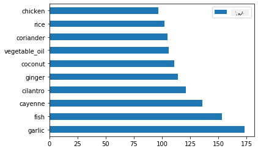
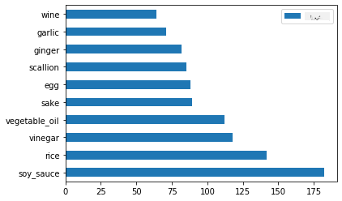
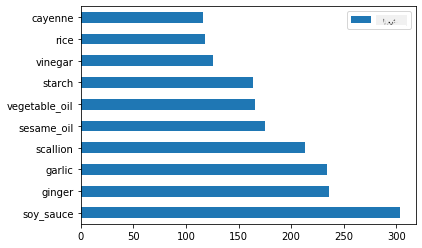
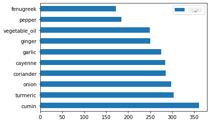
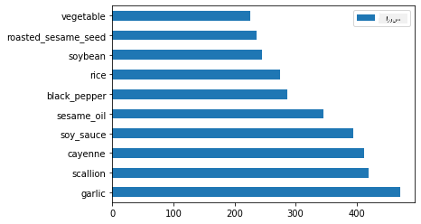

<!--
CO_OP_TRANSLATOR_METADATA:
{
  "original_hash": "76438ce4e5d48982d48f1b55c981caac",
  "translation_date": "2025-09-04T00:02:52+00:00",
  "source_file": "4-Classification/1-Introduction/README.md",
  "language_code": "fa"
}
-->
# مقدمه‌ای بر طبقه‌بندی

در این چهار درس، شما به یکی از موضوعات اساسی یادگیری ماشین کلاسیک - _طبقه‌بندی_ - خواهید پرداخت. ما با استفاده از الگوریتم‌های مختلف طبقه‌بندی و یک مجموعه داده درباره غذاهای فوق‌العاده آسیا و هند پیش خواهیم رفت. امیدوارم گرسنه باشید!


> در این درس‌ها غذاهای آسیایی را جشن بگیرید! تصویر توسط [Jen Looper](https://twitter.com/jenlooper)

طبقه‌بندی نوعی از [یادگیری نظارت‌شده](https://wikipedia.org/wiki/Supervised_learning) است که شباهت زیادی به تکنیک‌های رگرسیون دارد. اگر یادگیری ماشین به پیش‌بینی مقادیر یا نام‌ها با استفاده از مجموعه داده‌ها مربوط باشد، طبقه‌بندی معمولاً به دو گروه تقسیم می‌شود: _طبقه‌بندی دودویی_ و _طبقه‌بندی چندکلاسه_.

[](https://youtu.be/eg8DJYwdMyg "مقدمه‌ای بر طبقه‌بندی")

> 🎥 روی تصویر بالا کلیک کنید تا ویدئویی از جان گوتاگ از MIT درباره طبقه‌بندی ببینید.

به یاد داشته باشید:

- **رگرسیون خطی** به شما کمک کرد تا روابط بین متغیرها را پیش‌بینی کنید و پیش‌بینی‌های دقیقی درباره اینکه یک نقطه داده جدید در کجای خط قرار می‌گیرد انجام دهید. به عنوان مثال، شما می‌توانستید پیش‌بینی کنید _قیمت یک کدو تنبل در سپتامبر در مقابل دسامبر چقدر خواهد بود_.
- **رگرسیون لجستیک** به شما کمک کرد تا "دسته‌های دودویی" را کشف کنید: در این نقطه قیمت، _آیا این کدو تنبل نارنجی است یا غیر نارنجی_؟

طبقه‌بندی از الگوریتم‌های مختلفی برای تعیین برچسب یا کلاس یک نقطه داده استفاده می‌کند. بیایید با این داده‌های مربوط به غذاها کار کنیم تا ببینیم آیا می‌توانیم با مشاهده گروهی از مواد اولیه، منشأ غذایی آن را تعیین کنیم.

## [پیش‌آزمون درس](https://gray-sand-07a10f403.1.azurestaticapps.net/quiz/19/)

> ### [این درس به زبان R نیز موجود است!](../../../../4-Classification/1-Introduction/solution/R/lesson_10.html)

### مقدمه

طبقه‌بندی یکی از فعالیت‌های اساسی محققان یادگیری ماشین و دانشمندان داده است. از طبقه‌بندی ساده یک مقدار دودویی ("آیا این ایمیل اسپم است یا نه؟") تا طبقه‌بندی و تقسیم‌بندی پیچیده تصاویر با استفاده از بینایی کامپیوتری، همیشه مفید است که بتوان داده‌ها را به کلاس‌ها تقسیم کرد و از آن‌ها سوال پرسید.

برای بیان این فرآیند به صورت علمی‌تر، روش طبقه‌بندی شما یک مدل پیش‌بینی ایجاد می‌کند که به شما امکان می‌دهد رابطه بین متغیرهای ورودی و متغیرهای خروجی را ترسیم کنید.


> مشکلات دودویی در مقابل چندکلاسه برای الگوریتم‌های طبقه‌بندی. اینفوگرافیک توسط [Jen Looper](https://twitter.com/jenlooper)

قبل از شروع فرآیند پاک‌سازی داده‌ها، تجسم آن‌ها و آماده‌سازی آن‌ها برای وظایف یادگیری ماشین، بیایید کمی درباره روش‌های مختلفی که یادگیری ماشین می‌تواند برای طبقه‌بندی داده‌ها استفاده شود، یاد بگیریم.

طبقه‌بندی که از [آمار](https://wikipedia.org/wiki/Statistical_classification) مشتق شده است، با استفاده از ویژگی‌هایی مانند `smoker`، `weight` و `age` احتمال ابتلا به بیماری X را تعیین می‌کند. به عنوان یک تکنیک یادگیری نظارت‌شده مشابه تمرین‌های رگرسیون که قبلاً انجام داده‌اید، داده‌های شما برچسب‌گذاری شده‌اند و الگوریتم‌های یادگیری ماشین از این برچسب‌ها برای طبقه‌بندی و پیش‌بینی کلاس‌ها (یا 'ویژگی‌ها') یک مجموعه داده و اختصاص آن‌ها به یک گروه یا نتیجه استفاده می‌کنند.

✅ لحظه‌ای وقت بگذارید و یک مجموعه داده درباره غذاها را تصور کنید. یک مدل چندکلاسه چه سوالاتی می‌تواند پاسخ دهد؟ یک مدل دودویی چه سوالاتی می‌تواند پاسخ دهد؟ اگر بخواهید تعیین کنید که آیا یک غذای خاص احتمالاً از شنبلیله استفاده می‌کند یا نه، چه؟ اگر بخواهید ببینید که آیا با داشتن یک کیسه خرید پر از بادیان ستاره‌ای، کنگر فرنگی، گل‌کلم و ترب کوهی می‌توانید یک غذای معمولی هندی درست کنید، چه؟

[](https://youtu.be/GuTeDbaNoEU "سبدهای مرموز دیوانه‌وار")

> 🎥 روی تصویر بالا کلیک کنید تا ویدئویی ببینید. کل فرضیه برنامه 'Chopped' این است که سرآشپزها باید با انتخاب تصادفی مواد اولیه یک غذا درست کنند. مطمئناً یک مدل یادگیری ماشین می‌توانست کمک کند!

## سلام به 'طبقه‌بند'

سوالی که می‌خواهیم از این مجموعه داده غذایی بپرسیم در واقع یک سوال **چندکلاسه** است، زیرا چندین غذای ملی بالقوه برای کار داریم. با توجه به یک دسته مواد اولیه، این داده‌ها به کدام یک از این کلاس‌ها تعلق خواهند داشت؟

Scikit-learn چندین الگوریتم مختلف برای طبقه‌بندی داده‌ها ارائه می‌دهد، بسته به نوع مشکلی که می‌خواهید حل کنید. در دو درس بعدی، درباره چندین الگوریتم از این دست خواهید آموخت.

## تمرین - پاک‌سازی و متعادل‌سازی داده‌ها

اولین وظیفه‌ای که باید انجام دهید، قبل از شروع این پروژه، پاک‌سازی و **متعادل‌سازی** داده‌ها برای دستیابی به نتایج بهتر است. با فایل خالی _notebook.ipynb_ در ریشه این پوشه شروع کنید.

اولین چیزی که باید نصب کنید [imblearn](https://imbalanced-learn.org/stable/) است. این یک بسته Scikit-learn است که به شما امکان می‌دهد داده‌ها را بهتر متعادل کنید (در ادامه بیشتر درباره این وظیفه خواهید آموخت).

1. برای نصب `imblearn`، دستور `pip install` را اجرا کنید، به این صورت:

    ```python
    pip install imblearn
    ```

1. بسته‌هایی را که برای وارد کردن داده‌ها و تجسم آن‌ها نیاز دارید، همچنین `SMOTE` از `imblearn` را وارد کنید.

    ```python
    import pandas as pd
    import matplotlib.pyplot as plt
    import matplotlib as mpl
    import numpy as np
    from imblearn.over_sampling import SMOTE
    ```

    اکنون آماده هستید تا داده‌ها را وارد کنید.

1. وظیفه بعدی وارد کردن داده‌ها است:

    ```python
    df  = pd.read_csv('../data/cuisines.csv')
    ```

   استفاده از `read_csv()` محتوای فایل csv _cusines.csv_ را می‌خواند و آن را در متغیر `df` قرار می‌دهد.

1. شکل داده‌ها را بررسی کنید:

    ```python
    df.head()
    ```

   پنج ردیف اول به این صورت هستند:

    ```output
    |     | Unnamed: 0 | cuisine | almond | angelica | anise | anise_seed | apple | apple_brandy | apricot | armagnac | ... | whiskey | white_bread | white_wine | whole_grain_wheat_flour | wine | wood | yam | yeast | yogurt | zucchini |
    | --- | ---------- | ------- | ------ | -------- | ----- | ---------- | ----- | ------------ | ------- | -------- | --- | ------- | ----------- | ---------- | ----------------------- | ---- | ---- | --- | ----- | ------ | -------- |
    | 0   | 65         | indian  | 0      | 0        | 0     | 0          | 0     | 0            | 0       | 0        | ... | 0       | 0           | 0          | 0                       | 0    | 0    | 0   | 0     | 0      | 0        |
    | 1   | 66         | indian  | 1      | 0        | 0     | 0          | 0     | 0            | 0       | 0        | ... | 0       | 0           | 0          | 0                       | 0    | 0    | 0   | 0     | 0      | 0        |
    | 2   | 67         | indian  | 0      | 0        | 0     | 0          | 0     | 0            | 0       | 0        | ... | 0       | 0           | 0          | 0                       | 0    | 0    | 0   | 0     | 0      | 0        |
    | 3   | 68         | indian  | 0      | 0        | 0     | 0          | 0     | 0            | 0       | 0        | ... | 0       | 0           | 0          | 0                       | 0    | 0    | 0   | 0     | 0      | 0        |
    | 4   | 69         | indian  | 0      | 0        | 0     | 0          | 0     | 0            | 0       | 0        | ... | 0       | 0           | 0          | 0                       | 0    | 0    | 0   | 0     | 1      | 0        |
    ```

1. اطلاعاتی درباره این داده‌ها با فراخوانی `info()` دریافت کنید:

    ```python
    df.info()
    ```

    خروجی شما شبیه به این است:

    ```output
    <class 'pandas.core.frame.DataFrame'>
    RangeIndex: 2448 entries, 0 to 2447
    Columns: 385 entries, Unnamed: 0 to zucchini
    dtypes: int64(384), object(1)
    memory usage: 7.2+ MB
    ```

## تمرین - یادگیری درباره غذاها

اکنون کار شروع به جالب‌تر شدن می‌کند. بیایید توزیع داده‌ها را بر اساس غذا کشف کنیم.

1. داده‌ها را به صورت نمودار میله‌ای با فراخوانی `barh()` رسم کنید:

    ```python
    df.cuisine.value_counts().plot.barh()
    ```

    

    تعداد غذاها محدود است، اما توزیع داده‌ها نابرابر است. شما می‌توانید این مشکل را حل کنید! قبل از انجام این کار، کمی بیشتر کاوش کنید.

1. ببینید چقدر داده برای هر غذا موجود است و آن را چاپ کنید:

    ```python
    thai_df = df[(df.cuisine == "thai")]
    japanese_df = df[(df.cuisine == "japanese")]
    chinese_df = df[(df.cuisine == "chinese")]
    indian_df = df[(df.cuisine == "indian")]
    korean_df = df[(df.cuisine == "korean")]
    
    print(f'thai df: {thai_df.shape}')
    print(f'japanese df: {japanese_df.shape}')
    print(f'chinese df: {chinese_df.shape}')
    print(f'indian df: {indian_df.shape}')
    print(f'korean df: {korean_df.shape}')
    ```

    خروجی به این صورت است:

    ```output
    thai df: (289, 385)
    japanese df: (320, 385)
    chinese df: (442, 385)
    indian df: (598, 385)
    korean df: (799, 385)
    ```

## کشف مواد اولیه

اکنون می‌توانید عمیق‌تر به داده‌ها بپردازید و یاد بگیرید که مواد اولیه معمولی هر غذا چیست. شما باید داده‌های تکراری که باعث ایجاد سردرگمی بین غذاها می‌شود را پاک کنید، پس بیایید درباره این مشکل یاد بگیریم.

1. یک تابع `create_ingredient()` در پایتون ایجاد کنید تا یک دیتافریم مواد اولیه بسازد. این تابع با حذف یک ستون غیرمفید شروع می‌شود و مواد اولیه را بر اساس تعداد مرتب می‌کند:

    ```python
    def create_ingredient_df(df):
        ingredient_df = df.T.drop(['cuisine','Unnamed: 0']).sum(axis=1).to_frame('value')
        ingredient_df = ingredient_df[(ingredient_df.T != 0).any()]
        ingredient_df = ingredient_df.sort_values(by='value', ascending=False,
        inplace=False)
        return ingredient_df
    ```

   اکنون می‌توانید از این تابع برای دریافت ایده‌ای از ده ماده اولیه محبوب‌ترین غذاها استفاده کنید.

1. `create_ingredient()` را فراخوانی کنید و آن را با فراخوانی `barh()` رسم کنید:

    ```python
    thai_ingredient_df = create_ingredient_df(thai_df)
    thai_ingredient_df.head(10).plot.barh()
    ```

    

1. همین کار را برای داده‌های ژاپنی انجام دهید:

    ```python
    japanese_ingredient_df = create_ingredient_df(japanese_df)
    japanese_ingredient_df.head(10).plot.barh()
    ```

    

1. اکنون برای مواد اولیه چینی:

    ```python
    chinese_ingredient_df = create_ingredient_df(chinese_df)
    chinese_ingredient_df.head(10).plot.barh()
    ```

    

1. مواد اولیه هندی را رسم کنید:

    ```python
    indian_ingredient_df = create_ingredient_df(indian_df)
    indian_ingredient_df.head(10).plot.barh()
    ```

    

1. در نهایت، مواد اولیه کره‌ای را رسم کنید:

    ```python
    korean_ingredient_df = create_ingredient_df(korean_df)
    korean_ingredient_df.head(10).plot.barh()
    ```

    

1. اکنون، مواد اولیه مشترک که باعث ایجاد سردرگمی بین غذاهای مختلف می‌شوند را با فراخوانی `drop()` حذف کنید:

   همه عاشق برنج، سیر و زنجبیل هستند!

    ```python
    feature_df= df.drop(['cuisine','Unnamed: 0','rice','garlic','ginger'], axis=1)
    labels_df = df.cuisine #.unique()
    feature_df.head()
    ```

## متعادل‌سازی مجموعه داده

اکنون که داده‌ها را پاک کرده‌اید، از [SMOTE](https://imbalanced-learn.org/dev/references/generated/imblearn.over_sampling.SMOTE.html) - "تکنیک نمونه‌برداری بیش از حد اقلیت مصنوعی" - برای متعادل‌سازی آن استفاده کنید.

1. `fit_resample()` را فراخوانی کنید، این استراتژی نمونه‌های جدیدی با استفاده از درون‌یابی ایجاد می‌کند.

    ```python
    oversample = SMOTE()
    transformed_feature_df, transformed_label_df = oversample.fit_resample(feature_df, labels_df)
    ```

    با متعادل‌سازی داده‌ها، نتایج بهتری هنگام طبقه‌بندی آن‌ها خواهید داشت. به یک طبقه‌بندی دودویی فکر کنید. اگر بیشتر داده‌های شما متعلق به یک کلاس باشد، یک مدل یادگیری ماشین آن کلاس را بیشتر پیش‌بینی می‌کند، فقط به این دلیل که داده‌های بیشتری برای آن وجود دارد. متعادل‌سازی داده‌ها هرگونه عدم تعادل را حذف می‌کند.

1. اکنون می‌توانید تعداد برچسب‌ها برای هر ماده اولیه را بررسی کنید:

    ```python
    print(f'new label count: {transformed_label_df.value_counts()}')
    print(f'old label count: {df.cuisine.value_counts()}')
    ```

    خروجی شما به این صورت است:

    ```output
    new label count: korean      799
    chinese     799
    indian      799
    japanese    799
    thai        799
    Name: cuisine, dtype: int64
    old label count: korean      799
    indian      598
    chinese     442
    japanese    320
    thai        289
    Name: cuisine, dtype: int64
    ```

    داده‌ها تمیز، متعادل و بسیار خوشمزه هستند!

1. آخرین مرحله ذخیره داده‌های متعادل‌شده، شامل برچسب‌ها و ویژگی‌ها، در یک دیتافریم جدید است که می‌تواند به یک فایل صادر شود:

    ```python
    transformed_df = pd.concat([transformed_label_df,transformed_feature_df],axis=1, join='outer')
    ```

1. می‌توانید یک بار دیگر داده‌ها را با استفاده از `transformed_df.head()` و `transformed_df.info()` بررسی کنید. یک نسخه از این داده‌ها را برای استفاده در درس‌های آینده ذخیره کنید:

    ```python
    transformed_df.head()
    transformed_df.info()
    transformed_df.to_csv("../data/cleaned_cuisines.csv")
    ```

    این فایل CSV تازه اکنون در پوشه داده‌های ریشه موجود است.

---

## 🚀چالش

این برنامه درسی شامل چندین مجموعه داده جالب است. پوشه‌های `data` را بررسی کنید و ببینید آیا مجموعه داده‌هایی وجود دارند که برای طبقه‌بندی دودویی یا چندکلاسه مناسب باشند؟ چه سوالاتی می‌توانید از این مجموعه داده‌ها بپرسید؟

## [آزمون پس از درس](https://gray-sand-07a10f403.1.azurestaticapps.net/quiz/20/)

## مرور و مطالعه شخصی

API مربوط به SMOTE را بررسی کنید. این ابزار برای چه مواردی بهترین استفاده را دارد؟ چه مشکلاتی را حل می‌کند؟

## تکلیف 

[روش‌های طبقه‌بندی را بررسی کنید](assignment.md)

---

**سلب مسئولیت**:  
این سند با استفاده از سرویس ترجمه هوش مصنوعی [Co-op Translator](https://github.com/Azure/co-op-translator) ترجمه شده است. در حالی که ما برای دقت تلاش می‌کنیم، لطفاً توجه داشته باشید که ترجمه‌های خودکار ممکن است شامل خطاها یا نادقتی‌هایی باشند. سند اصلی به زبان اصلی آن باید به عنوان منبع معتبر در نظر گرفته شود. برای اطلاعات حساس، ترجمه حرفه‌ای انسانی توصیه می‌شود. ما هیچ مسئولیتی در قبال سوءتفاهم‌ها یا تفسیرهای نادرست ناشی از استفاده از این ترجمه نداریم.