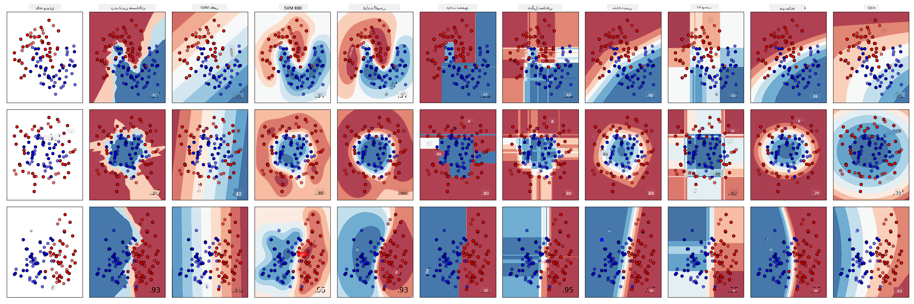
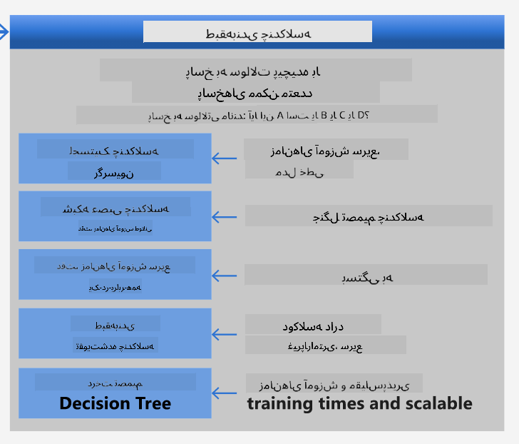
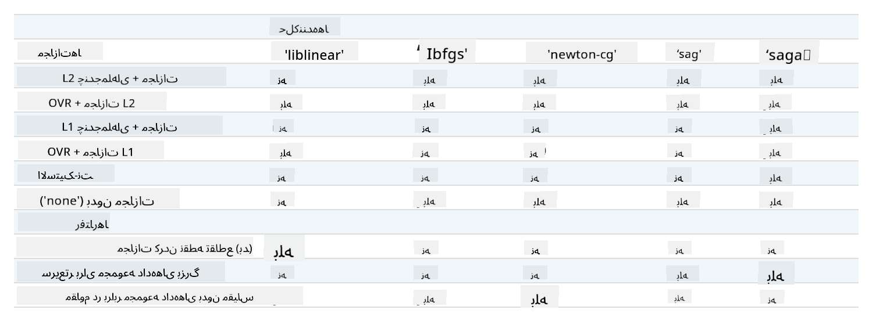

<!--
CO_OP_TRANSLATOR_METADATA:
{
  "original_hash": "9579f42e3ff5114c58379cc9e186a828",
  "translation_date": "2025-09-03T23:52:24+00:00",
  "source_file": "4-Classification/2-Classifiers-1/README.md",
  "language_code": "fa"
}
-->
# دسته‌بندی‌کننده‌های آشپزی 1

در این درس، شما از مجموعه داده‌ای که در درس قبلی ذخیره کرده‌اید استفاده خواهید کرد؛ مجموعه‌ای پر از داده‌های متوازن و پاک درباره آشپزی.

شما از این مجموعه داده با انواع دسته‌بندی‌کننده‌ها برای _پیش‌بینی یک آشپزی ملی بر اساس گروهی از مواد اولیه_ استفاده خواهید کرد. در این فرآیند، بیشتر با روش‌هایی که الگوریتم‌ها برای وظایف دسته‌بندی به کار گرفته می‌شوند آشنا خواهید شد.

## [آزمون پیش از درس](https://gray-sand-07a10f403.1.azurestaticapps.net/quiz/21/)
# آماده‌سازی

فرض کنید درس [درس 1](../1-Introduction/README.md) را کامل کرده‌اید، مطمئن شوید که فایل _cleaned_cuisines.csv_ در پوشه اصلی `/data` برای این چهار درس وجود دارد.

## تمرین - پیش‌بینی یک آشپزی ملی

1. در پوشه _notebook.ipynb_ این درس، فایل را همراه با کتابخانه Pandas وارد کنید:

    ```python
    import pandas as pd
    cuisines_df = pd.read_csv("../data/cleaned_cuisines.csv")
    cuisines_df.head()
    ```

    داده‌ها به این شکل هستند:

|     | Unnamed: 0 | cuisine | almond | angelica | anise | anise_seed | apple | apple_brandy | apricot | armagnac | ... | whiskey | white_bread | white_wine | whole_grain_wheat_flour | wine | wood | yam | yeast | yogurt | zucchini |
| --- | ---------- | ------- | ------ | -------- | ----- | ---------- | ----- | ------------ | ------- | -------- | --- | ------- | ----------- | ---------- | ----------------------- | ---- | ---- | --- | ----- | ------ | -------- |
| 0   | 0          | indian  | 0      | 0        | 0     | 0          | 0     | 0            | 0       | 0        | ... | 0       | 0           | 0          | 0                       | 0    | 0    | 0   | 0     | 0      | 0        |
| 1   | 1          | indian  | 1      | 0        | 0     | 0          | 0     | 0            | 0       | 0        | ... | 0       | 0           | 0          | 0                       | 0    | 0    | 0   | 0     | 0      | 0        |
| 2   | 2          | indian  | 0      | 0        | 0     | 0          | 0     | 0            | 0       | 0        | ... | 0       | 0           | 0          | 0                       | 0    | 0    | 0   | 0     | 0      | 0        |
| 3   | 3          | indian  | 0      | 0        | 0     | 0          | 0     | 0            | 0       | 0        | ... | 0       | 0           | 0          | 0                       | 0    | 0    | 0   | 0     | 0      | 0        |
| 4   | 4          | indian  | 0      | 0        | 0     | 0          | 0     | 0            | 0       | 0        | ... | 0       | 0           | 0          | 0                       | 0    | 0    | 0   | 0     | 1      | 0        |
  

1. حالا چند کتابخانه دیگر وارد کنید:

    ```python
    from sklearn.linear_model import LogisticRegression
    from sklearn.model_selection import train_test_split, cross_val_score
    from sklearn.metrics import accuracy_score,precision_score,confusion_matrix,classification_report, precision_recall_curve
    from sklearn.svm import SVC
    import numpy as np
    ```

1. مختصات X و y را به دو دیتافریم برای آموزش تقسیم کنید. `cuisine` می‌تواند دیتافریم برچسب‌ها باشد:

    ```python
    cuisines_label_df = cuisines_df['cuisine']
    cuisines_label_df.head()
    ```

    به این شکل خواهد بود:

    ```output
    0    indian
    1    indian
    2    indian
    3    indian
    4    indian
    Name: cuisine, dtype: object
    ```

1. ستون `Unnamed: 0` و ستون `cuisine` را با استفاده از `drop()` حذف کنید. بقیه داده‌ها را به عنوان ویژگی‌های قابل آموزش ذخیره کنید:

    ```python
    cuisines_feature_df = cuisines_df.drop(['Unnamed: 0', 'cuisine'], axis=1)
    cuisines_feature_df.head()
    ```

    ویژگی‌های شما به این شکل خواهند بود:

|      | almond | angelica | anise | anise_seed | apple | apple_brandy | apricot | armagnac | artemisia | artichoke |  ... | whiskey | white_bread | white_wine | whole_grain_wheat_flour | wine | wood |  yam | yeast | yogurt | zucchini |
| ---: | -----: | -------: | ----: | ---------: | ----: | -----------: | ------: | -------: | --------: | --------: | ---: | ------: | ----------: | ---------: | ----------------------: | ---: | ---: | ---: | ----: | -----: | -------: |
|    0 |      0 |        0 |     0 |          0 |     0 |            0 |       0 |        0 |         0 |         0 |  ... |       0 |           0 |          0 |                       0 |    0 |    0 |    0 |     0 |      0 |        0 | 0 |
|    1 |      1 |        0 |     0 |          0 |     0 |            0 |       0 |        0 |         0 |         0 |  ... |       0 |           0 |          0 |                       0 |    0 |    0 |    0 |     0 |      0 |        0 | 0 |
|    2 |      0 |        0 |     0 |          0 |     0 |            0 |       0 |        0 |         0 |         0 |  ... |       0 |           0 |          0 |                       0 |    0 |    0 |    0 |     0 |      0 |        0 | 0 |
|    3 |      0 |        0 |     0 |          0 |     0 |            0 |       0 |        0 |         0 |         0 |  ... |       0 |           0 |          0 |                       0 |    0 |    0 |    0 |     0 |      0 |        0 | 0 |
|    4 |      0 |        0 |     0 |          0 |     0 |            0 |       0 |        0 |         0 |         0 |  ... |       0 |           0 |          0 |                       0 |    0 |    0 |    0 |     0 |      1 |        0 | 0 |

حالا آماده آموزش مدل خود هستید!

## انتخاب دسته‌بندی‌کننده

حالا که داده‌های شما پاک و آماده آموزش هستند، باید تصمیم بگیرید که از کدام الگوریتم برای این کار استفاده کنید.

Scikit-learn دسته‌بندی را تحت یادگیری نظارت‌شده گروه‌بندی می‌کند و در این دسته‌بندی روش‌های زیادی برای دسته‌بندی وجود دارد. [تنوع](https://scikit-learn.org/stable/supervised_learning.html) در ابتدا ممکن است گیج‌کننده به نظر برسد. روش‌های زیر همگی شامل تکنیک‌های دسته‌بندی هستند:

- مدل‌های خطی
- ماشین‌های بردار پشتیبان
- نزول گرادیان تصادفی
- نزدیک‌ترین همسایه‌ها
- فرآیندهای گوسی
- درخت‌های تصمیم‌گیری
- روش‌های ترکیبی (دسته‌بندی‌کننده رأی‌گیری)
- الگوریتم‌های چندکلاسه و چندخروجی (دسته‌بندی چندکلاسه و چندبرچسبی، دسته‌بندی چندکلاسه-چندخروجی)

> شما همچنین می‌توانید از [شبکه‌های عصبی برای دسته‌بندی داده‌ها](https://scikit-learn.org/stable/modules/neural_networks_supervised.html#classification) استفاده کنید، اما این موضوع خارج از محدوده این درس است.

### کدام دسته‌بندی‌کننده را انتخاب کنیم؟

پس، کدام دسته‌بندی‌کننده را باید انتخاب کنید؟ اغلب، اجرای چندین دسته‌بندی‌کننده و جستجوی نتیجه خوب راهی برای آزمایش است. Scikit-learn یک [مقایسه کنار هم](https://scikit-learn.org/stable/auto_examples/classification/plot_classifier_comparison.html) روی یک مجموعه داده ایجاد شده ارائه می‌دهد که KNeighbors، SVC به دو روش، GaussianProcessClassifier، DecisionTreeClassifier، RandomForestClassifier، MLPClassifier، AdaBoostClassifier، GaussianNB و QuadraticDiscrinationAnalysis را مقایسه می‌کند و نتایج را به صورت تصویری نشان می‌دهد:


> نمودارها از مستندات Scikit-learn تولید شده‌اند

> AutoML این مشکل را به خوبی حل می‌کند و این مقایسه‌ها را در فضای ابری اجرا می‌کند و به شما اجازه می‌دهد بهترین الگوریتم را برای داده‌های خود انتخاب کنید. آن را [اینجا امتحان کنید](https://docs.microsoft.com/learn/modules/automate-model-selection-with-azure-automl/?WT.mc_id=academic-77952-leestott)

### یک رویکرد بهتر

یک روش بهتر از حدس زدن بی‌هدف، دنبال کردن ایده‌های موجود در این [برگه تقلب یادگیری ماشین](https://docs.microsoft.com/azure/machine-learning/algorithm-cheat-sheet?WT.mc_id=academic-77952-leestott) قابل دانلود است. در اینجا، متوجه می‌شویم که برای مشکل چندکلاسه ما، چند گزینه داریم:


> بخشی از برگه تقلب الگوریتم‌های مایکروسافت، گزینه‌های دسته‌بندی چندکلاسه را نشان می‌دهد

✅ این برگه تقلب را دانلود کنید، چاپ کنید و روی دیوار خود آویزان کنید!

### استدلال

بیایید ببینیم آیا می‌توانیم با توجه به محدودیت‌هایی که داریم، راه‌حل‌های مختلف را بررسی کنیم:

- **شبکه‌های عصبی سنگین هستند**. با توجه به مجموعه داده پاک اما حداقلی ما و این واقعیت که آموزش را به صورت محلی از طریق نوت‌بوک‌ها اجرا می‌کنیم، شبکه‌های عصبی برای این وظیفه سنگین هستند.
- **دسته‌بندی‌کننده دوکلاسه مناسب نیست**. ما از دسته‌بندی‌کننده دوکلاسه استفاده نمی‌کنیم، بنابراین این گزینه حذف می‌شود.
- **درخت تصمیم یا رگرسیون لجستیک ممکن است کار کند**. یک درخت تصمیم ممکن است کار کند، یا رگرسیون لجستیک برای داده‌های چندکلاسه.
- **درخت‌های تصمیم تقویت‌شده چندکلاسه مشکل دیگری را حل می‌کنند**. درخت تصمیم تقویت‌شده چندکلاسه بیشتر برای وظایف غیرپارامتری مناسب است، مانند وظایفی که برای ایجاد رتبه‌بندی طراحی شده‌اند، بنابراین برای ما مفید نیست.

### استفاده از Scikit-learn 

ما از Scikit-learn برای تحلیل داده‌های خود استفاده خواهیم کرد. با این حال، روش‌های زیادی برای استفاده از رگرسیون لجستیک در Scikit-learn وجود دارد. به [پارامترهایی که باید تنظیم شوند](https://scikit-learn.org/stable/modules/generated/sklearn.linear_model.LogisticRegression.html?highlight=logistic%20regressio#sklearn.linear_model.LogisticRegression) نگاهی بیندازید.

به طور کلی دو پارامتر مهم وجود دارد - `multi_class` و `solver` - که باید مشخص شوند، زمانی که از Scikit-learn می‌خواهیم رگرسیون لجستیک انجام دهد. مقدار `multi_class` رفتار خاصی را اعمال می‌کند. مقدار solver مشخص می‌کند که از کدام الگوریتم استفاده شود. همه solverها نمی‌توانند با همه مقادیر `multi_class` جفت شوند.

طبق مستندات، در حالت چندکلاسه، الگوریتم آموزش:

- **از طرح one-vs-rest (OvR) استفاده می‌کند**، اگر گزینه `multi_class` روی `ovr` تنظیم شده باشد.
- **از ضرر آنتروپی متقاطع استفاده می‌کند**، اگر گزینه `multi_class` روی `multinomial` تنظیم شده باشد. (در حال حاضر گزینه `multinomial` فقط توسط solverهای ‘lbfgs’, ‘sag’, ‘saga’ و ‘newton-cg’ پشتیبانی می‌شود.)

> 🎓 'طرح' در اینجا می‌تواند 'ovr' (one-vs-rest) یا 'multinomial' باشد. از آنجا که رگرسیون لجستیک واقعاً برای پشتیبانی از دسته‌بندی دودویی طراحی شده است، این طرح‌ها به آن کمک می‌کنند تا بهتر وظایف دسته‌بندی چندکلاسه را مدیریت کند. [منبع](https://machinelearningmastery.com/one-vs-rest-and-one-vs-one-for-multi-class-classification/)

> 🎓 'solver' به عنوان "الگوریتمی که در مسئله بهینه‌سازی استفاده می‌شود" تعریف شده است. [منبع](https://scikit-learn.org/stable/modules/generated/sklearn.linear_model.LogisticRegression.html?highlight=logistic%20regressio#sklearn.linear_model.LogisticRegression).

Scikit-learn این جدول را ارائه می‌دهد تا توضیح دهد که چگونه solverها چالش‌های مختلفی که توسط ساختارهای مختلف داده ارائه می‌شوند را مدیریت می‌کنند:



## تمرین - تقسیم داده‌ها

ما می‌توانیم برای اولین آزمایش آموزشی خود روی رگرسیون لجستیک تمرکز کنیم، زیرا شما اخیراً درباره آن در درس قبلی یاد گرفته‌اید.
داده‌های خود را به گروه‌های آموزشی و آزمایشی تقسیم کنید با فراخوانی `train_test_split()`:

```python
X_train, X_test, y_train, y_test = train_test_split(cuisines_feature_df, cuisines_label_df, test_size=0.3)
```

## تمرین - اعمال رگرسیون لجستیک

از آنجا که شما از حالت چندکلاسه استفاده می‌کنید، باید انتخاب کنید که از چه _طرحی_ استفاده کنید و چه _solverی_ تنظیم کنید. از LogisticRegression با تنظیم چندکلاسه و solver **liblinear** برای آموزش استفاده کنید.

1. یک رگرسیون لجستیک با تنظیم multi_class روی `ovr` و solver روی `liblinear` ایجاد کنید:

    ```python
    lr = LogisticRegression(multi_class='ovr',solver='liblinear')
    model = lr.fit(X_train, np.ravel(y_train))
    
    accuracy = model.score(X_test, y_test)
    print ("Accuracy is {}".format(accuracy))
    ```

    ✅ یک solver دیگر مانند `lbfgs` را امتحان کنید که اغلب به صورت پیش‌فرض تنظیم می‌شود.
> توجه داشته باشید که از تابع [`ravel`](https://pandas.pydata.org/pandas-docs/stable/reference/api/pandas.Series.ravel.html) در Pandas برای مسطح کردن داده‌های خود در صورت نیاز استفاده کنید.
دقت این مدل بیش از **۸۰٪** است!

۱. می‌توانید عملکرد این مدل را با آزمایش یک ردیف داده (#۵۰) مشاهده کنید:

    ```python
    print(f'ingredients: {X_test.iloc[50][X_test.iloc[50]!=0].keys()}')
    print(f'cuisine: {y_test.iloc[50]}')
    ```

    نتیجه چاپ می‌شود:

   ```output
   ingredients: Index(['cilantro', 'onion', 'pea', 'potato', 'tomato', 'vegetable_oil'], dtype='object')
   cuisine: indian
   ```

   ✅ یک شماره ردیف دیگر را امتحان کنید و نتایج را بررسی کنید.

۱. با بررسی دقیق‌تر، می‌توانید دقت این پیش‌بینی را بررسی کنید:

    ```python
    test= X_test.iloc[50].values.reshape(-1, 1).T
    proba = model.predict_proba(test)
    classes = model.classes_
    resultdf = pd.DataFrame(data=proba, columns=classes)
    
    topPrediction = resultdf.T.sort_values(by=[0], ascending = [False])
    topPrediction.head()
    ```

    نتیجه چاپ می‌شود - غذای هندی بهترین حدس مدل است، با احتمال خوب:

    |          |        0 |
    | -------: | -------: |
    |   indian | 0.715851 |
    |  chinese | 0.229475 |
    | japanese | 0.029763 |
    |   korean | 0.017277 |
    |     thai | 0.007634 |

    ✅ آیا می‌توانید توضیح دهید چرا مدل تقریباً مطمئن است که این یک غذای هندی است؟

۱. با چاپ یک گزارش طبقه‌بندی، جزئیات بیشتری به دست آورید، همان‌طور که در درس‌های رگرسیون انجام دادید:

    ```python
    y_pred = model.predict(X_test)
    print(classification_report(y_test,y_pred))
    ```

    |              | precision | recall | f1-score | support |
    | ------------ | --------- | ------ | -------- | ------- |
    | chinese      | 0.73      | 0.71   | 0.72     | 229     |
    | indian       | 0.91      | 0.93   | 0.92     | 254     |
    | japanese     | 0.70      | 0.75   | 0.72     | 220     |
    | korean       | 0.86      | 0.76   | 0.81     | 242     |
    | thai         | 0.79      | 0.85   | 0.82     | 254     |
    | accuracy     | 0.80      | 1199   |          |         |
    | macro avg    | 0.80      | 0.80   | 0.80     | 1199    |
    | weighted avg | 0.80      | 0.80   | 0.80     | 1199    |

## 🚀چالش

در این درس، از داده‌های پاک‌سازی‌شده خود برای ساخت یک مدل یادگیری ماشین استفاده کردید که می‌تواند یک غذای ملی را بر اساس مجموعه‌ای از مواد اولیه پیش‌بینی کند. زمانی را صرف کنید تا گزینه‌های مختلفی که Scikit-learn برای طبقه‌بندی داده‌ها ارائه می‌دهد بررسی کنید. عمیق‌تر به مفهوم 'solver' بپردازید تا بفهمید در پشت صحنه چه می‌گذرد.

## [آزمون پس از درس](https://gray-sand-07a10f403.1.azurestaticapps.net/quiz/22/)

## مرور و مطالعه شخصی

کمی بیشتر در مورد ریاضیات پشت رگرسیون لجستیک در [این درس](https://people.eecs.berkeley.edu/~russell/classes/cs194/f11/lectures/CS194%20Fall%202011%20Lecture%2006.pdf) مطالعه کنید.

## تکلیف

[مطالعه در مورد solvers](assignment.md)

---

**سلب مسئولیت**:  
این سند با استفاده از سرویس ترجمه هوش مصنوعی [Co-op Translator](https://github.com/Azure/co-op-translator) ترجمه شده است. در حالی که ما برای دقت تلاش می‌کنیم، لطفاً توجه داشته باشید که ترجمه‌های خودکار ممکن است شامل خطاها یا نادقتی‌ها باشند. سند اصلی به زبان اصلی آن باید به عنوان منبع معتبر در نظر گرفته شود. برای اطلاعات حساس، ترجمه حرفه‌ای انسانی توصیه می‌شود. ما هیچ مسئولیتی در قبال سوءتفاهم‌ها یا تفسیرهای نادرست ناشی از استفاده از این ترجمه نداریم.