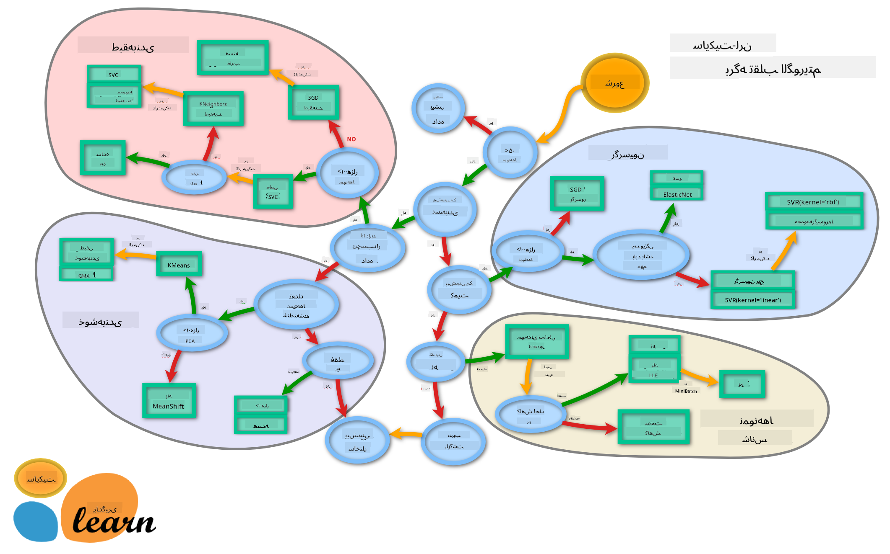

<!--
CO_OP_TRANSLATOR_METADATA:
{
  "original_hash": "808a71076f76ae8f5458862a8edd9215",
  "translation_date": "2025-09-03T23:59:06+00:00",
  "source_file": "4-Classification/3-Classifiers-2/README.md",
  "language_code": "fa"
}
-->
# دسته‌بندی غذاها ۲

در این درس دوم از دسته‌بندی، شما روش‌های بیشتری برای دسته‌بندی داده‌های عددی بررسی خواهید کرد. همچنین درباره پیامدهای انتخاب یک دسته‌بند نسبت به دیگری یاد خواهید گرفت.

## [پیش‌آزمون](https://gray-sand-07a10f403.1.azurestaticapps.net/quiz/23/)

### پیش‌نیاز

فرض می‌کنیم که درس‌های قبلی را تکمیل کرده‌اید و یک مجموعه داده تمیز در پوشه `data` به نام _cleaned_cuisines.csv_ در ریشه این پوشه ۴ درسی دارید.

### آماده‌سازی

ما فایل _notebook.ipynb_ شما را با مجموعه داده تمیز بارگذاری کرده‌ایم و آن را به دو دیتافریم X و y تقسیم کرده‌ایم، آماده برای فرآیند ساخت مدل.

## نقشه دسته‌بندی

قبلاً درباره گزینه‌های مختلفی که هنگام دسته‌بندی داده‌ها دارید با استفاده از برگه تقلب مایکروسافت یاد گرفتید. Scikit-learn یک برگه تقلب مشابه اما دقیق‌تر ارائه می‌دهد که می‌تواند به محدود کردن انتخاب دسته‌بندها (اصطلاح دیگری برای دسته‌بندها) کمک کند:


> نکته: [این نقشه را آنلاین ببینید](https://scikit-learn.org/stable/tutorial/machine_learning_map/) و مسیرها را کلیک کنید تا مستندات را بخوانید.

### برنامه

این نقشه زمانی بسیار مفید است که درک واضحی از داده‌های خود داشته باشید، زیرا می‌توانید در مسیرهای آن قدم بزنید تا به تصمیم برسید:

- ما بیش از ۵۰ نمونه داریم
- می‌خواهیم یک دسته را پیش‌بینی کنیم
- داده‌های برچسب‌دار داریم
- کمتر از ۱۰۰ هزار نمونه داریم
- ✨ می‌توانیم یک Linear SVC انتخاب کنیم
- اگر این کار نکرد، چون داده‌های عددی داریم
    - می‌توانیم ✨ KNeighbors Classifier را امتحان کنیم
      - اگر این کار نکرد، ✨ SVC و ✨ Ensemble Classifiers را امتحان کنید

این مسیر بسیار مفید است.

## تمرین - تقسیم داده‌ها

با دنبال کردن این مسیر، باید با وارد کردن برخی کتابخانه‌ها شروع کنیم.

1. کتابخانه‌های مورد نیاز را وارد کنید:

    ```python
    from sklearn.neighbors import KNeighborsClassifier
    from sklearn.linear_model import LogisticRegression
    from sklearn.svm import SVC
    from sklearn.ensemble import RandomForestClassifier, AdaBoostClassifier
    from sklearn.model_selection import train_test_split, cross_val_score
    from sklearn.metrics import accuracy_score,precision_score,confusion_matrix,classification_report, precision_recall_curve
    import numpy as np
    ```

1. داده‌های آموزشی و آزمایشی خود را تقسیم کنید:

    ```python
    X_train, X_test, y_train, y_test = train_test_split(cuisines_feature_df, cuisines_label_df, test_size=0.3)
    ```

## دسته‌بند Linear SVC

خوشه‌بندی پشتیبان-برداری (SVC) یکی از اعضای خانواده تکنیک‌های یادگیری ماشین پشتیبان-برداری است (در مورد این‌ها بیشتر در زیر بیاموزید). در این روش، می‌توانید یک 'kernel' انتخاب کنید تا تصمیم بگیرید چگونه برچسب‌ها را خوشه‌بندی کنید. پارامتر 'C' به 'تنظیم‌سازی' اشاره دارد که تأثیر پارامترها را تنظیم می‌کند. کرنل می‌تواند یکی از [چندین](https://scikit-learn.org/stable/modules/generated/sklearn.svm.SVC.html#sklearn.svm.SVC) باشد؛ در اینجا آن را به 'linear' تنظیم می‌کنیم تا از Linear SVC استفاده کنیم. مقدار پیش‌فرض احتمال 'false' است؛ در اینجا آن را به 'true' تنظیم می‌کنیم تا تخمین‌های احتمالی جمع‌آوری کنیم. حالت تصادفی را به '0' تنظیم می‌کنیم تا داده‌ها را برای دریافت احتمالات مخلوط کنیم.

### تمرین - اعمال یک Linear SVC

با ایجاد یک آرایه از دسته‌بندها شروع کنید. شما به تدریج به این آرایه اضافه خواهید کرد.

1. با یک Linear SVC شروع کنید:

    ```python
    C = 10
    # Create different classifiers.
    classifiers = {
        'Linear SVC': SVC(kernel='linear', C=C, probability=True,random_state=0)
    }
    ```

2. مدل خود را با استفاده از Linear SVC آموزش دهید و یک گزارش چاپ کنید:

    ```python
    n_classifiers = len(classifiers)
    
    for index, (name, classifier) in enumerate(classifiers.items()):
        classifier.fit(X_train, np.ravel(y_train))
    
        y_pred = classifier.predict(X_test)
        accuracy = accuracy_score(y_test, y_pred)
        print("Accuracy (train) for %s: %0.1f%% " % (name, accuracy * 100))
        print(classification_report(y_test,y_pred))
    ```

    نتیجه بسیار خوب است:

    ```output
    Accuracy (train) for Linear SVC: 78.6% 
                  precision    recall  f1-score   support
    
         chinese       0.71      0.67      0.69       242
          indian       0.88      0.86      0.87       234
        japanese       0.79      0.74      0.76       254
          korean       0.85      0.81      0.83       242
            thai       0.71      0.86      0.78       227
    
        accuracy                           0.79      1199
       macro avg       0.79      0.79      0.79      1199
    weighted avg       0.79      0.79      0.79      1199
    ```

## دسته‌بند K-Neighbors

K-Neighbors بخشی از خانواده روش‌های یادگیری ماشین "همسایه‌ها" است که می‌توانند برای یادگیری نظارت‌شده و نظارت‌نشده استفاده شوند. در این روش، تعداد نقاط از پیش تعریف‌شده ایجاد می‌شود و داده‌ها در اطراف این نقاط جمع‌آوری می‌شوند تا برچسب‌های عمومی برای داده‌ها پیش‌بینی شوند.

### تمرین - اعمال دسته‌بند K-Neighbors

دسته‌بند قبلی خوب بود و با داده‌ها خوب کار کرد، اما شاید بتوانیم دقت بهتری داشته باشیم. دسته‌بند K-Neighbors را امتحان کنید.

1. یک خط به آرایه دسته‌بند خود اضافه کنید (بعد از آیتم Linear SVC یک کاما اضافه کنید):

    ```python
    'KNN classifier': KNeighborsClassifier(C),
    ```

    نتیجه کمی بدتر است:

    ```output
    Accuracy (train) for KNN classifier: 73.8% 
                  precision    recall  f1-score   support
    
         chinese       0.64      0.67      0.66       242
          indian       0.86      0.78      0.82       234
        japanese       0.66      0.83      0.74       254
          korean       0.94      0.58      0.72       242
            thai       0.71      0.82      0.76       227
    
        accuracy                           0.74      1199
       macro avg       0.76      0.74      0.74      1199
    weighted avg       0.76      0.74      0.74      1199
    ```

    ✅ درباره [K-Neighbors](https://scikit-learn.org/stable/modules/neighbors.html#neighbors) بیاموزید

## دسته‌بند Support Vector

دسته‌بندهای پشتیبان-برداری بخشی از خانواده [ماشین‌های پشتیبان-برداری](https://wikipedia.org/wiki/Support-vector_machine) هستند که برای وظایف دسته‌بندی و رگرسیون استفاده می‌شوند. SVM‌ها "نمونه‌های آموزشی را به نقاطی در فضا نگاشت می‌کنند" تا فاصله بین دو دسته را به حداکثر برسانند. داده‌های بعدی به این فضا نگاشت می‌شوند تا دسته آن‌ها پیش‌بینی شود.

### تمرین - اعمال دسته‌بند Support Vector

بیایید با دسته‌بند Support Vector دقت کمی بهتر داشته باشیم.

1. بعد از آیتم K-Neighbors یک کاما اضافه کنید و سپس این خط را اضافه کنید:

    ```python
    'SVC': SVC(),
    ```

    نتیجه بسیار خوب است!

    ```output
    Accuracy (train) for SVC: 83.2% 
                  precision    recall  f1-score   support
    
         chinese       0.79      0.74      0.76       242
          indian       0.88      0.90      0.89       234
        japanese       0.87      0.81      0.84       254
          korean       0.91      0.82      0.86       242
            thai       0.74      0.90      0.81       227
    
        accuracy                           0.83      1199
       macro avg       0.84      0.83      0.83      1199
    weighted avg       0.84      0.83      0.83      1199
    ```

    ✅ درباره [پشتیبان-برداری‌ها](https://scikit-learn.org/stable/modules/svm.html#svm) بیاموزید

## دسته‌بندهای Ensemble

بیایید مسیر را تا انتها دنبال کنیم، حتی اگر آزمایش قبلی بسیار خوب بود. بیایید برخی از دسته‌بندهای Ensemble، به‌ویژه Random Forest و AdaBoost را امتحان کنیم:

```python
  'RFST': RandomForestClassifier(n_estimators=100),
  'ADA': AdaBoostClassifier(n_estimators=100)
```

نتیجه بسیار خوب است، به‌ویژه برای Random Forest:

```output
Accuracy (train) for RFST: 84.5% 
              precision    recall  f1-score   support

     chinese       0.80      0.77      0.78       242
      indian       0.89      0.92      0.90       234
    japanese       0.86      0.84      0.85       254
      korean       0.88      0.83      0.85       242
        thai       0.80      0.87      0.83       227

    accuracy                           0.84      1199
   macro avg       0.85      0.85      0.84      1199
weighted avg       0.85      0.84      0.84      1199

Accuracy (train) for ADA: 72.4% 
              precision    recall  f1-score   support

     chinese       0.64      0.49      0.56       242
      indian       0.91      0.83      0.87       234
    japanese       0.68      0.69      0.69       254
      korean       0.73      0.79      0.76       242
        thai       0.67      0.83      0.74       227

    accuracy                           0.72      1199
   macro avg       0.73      0.73      0.72      1199
weighted avg       0.73      0.72      0.72      1199
```

✅ درباره [دسته‌بندهای Ensemble](https://scikit-learn.org/stable/modules/ensemble.html) بیاموزید

این روش یادگیری ماشین "پیش‌بینی‌های چندین تخمین‌گر پایه را ترکیب می‌کند" تا کیفیت مدل را بهبود بخشد. در مثال ما، از درخت‌های تصادفی و AdaBoost استفاده کردیم.

- [Random Forest](https://scikit-learn.org/stable/modules/ensemble.html#forest)، یک روش میانگین‌گیری، یک 'جنگل' از 'درخت‌های تصمیم‌گیری' ایجاد می‌کند که با تصادفی‌سازی تزریق شده‌اند تا از بیش‌برازش جلوگیری شود. پارامتر n_estimators به تعداد درخت‌ها تنظیم شده است.

- [AdaBoost](https://scikit-learn.org/stable/modules/generated/sklearn.ensemble.AdaBoostClassifier.html) یک دسته‌بند را به مجموعه داده تطبیق می‌دهد و سپس نسخه‌هایی از آن دسته‌بند را به همان مجموعه داده تطبیق می‌دهد. این روش بر وزن آیتم‌های اشتباه دسته‌بندی‌شده تمرکز می‌کند و تناسب دسته‌بند بعدی را تنظیم می‌کند تا اصلاح شود.

---

## 🚀چالش

هر یک از این تکنیک‌ها تعداد زیادی پارامتر دارند که می‌توانید تنظیم کنید. درباره پارامترهای پیش‌فرض هر کدام تحقیق کنید و فکر کنید که تنظیم این پارامترها چه معنایی برای کیفیت مدل خواهد داشت.

## [پس‌آزمون](https://gray-sand-07a10f403.1.azurestaticapps.net/quiz/24/)

## مرور و مطالعه شخصی

در این درس‌ها اصطلاحات زیادی وجود دارد، بنابراین چند دقیقه وقت بگذارید تا [این فهرست](https://docs.microsoft.com/dotnet/machine-learning/resources/glossary?WT.mc_id=academic-77952-leestott) از اصطلاحات مفید را مرور کنید!

## تکلیف 

[بازی با پارامترها](assignment.md)

---

**سلب مسئولیت**:  
این سند با استفاده از سرویس ترجمه هوش مصنوعی [Co-op Translator](https://github.com/Azure/co-op-translator) ترجمه شده است. در حالی که ما برای دقت تلاش می‌کنیم، لطفاً توجه داشته باشید که ترجمه‌های خودکار ممکن است شامل خطاها یا نادقتی‌هایی باشند. سند اصلی به زبان اصلی آن باید به عنوان منبع معتبر در نظر گرفته شود. برای اطلاعات حساس، ترجمه حرفه‌ای انسانی توصیه می‌شود. ما هیچ مسئولیتی در قبال سوءتفاهم‌ها یا تفسیرهای نادرست ناشی از استفاده از این ترجمه نداریم.