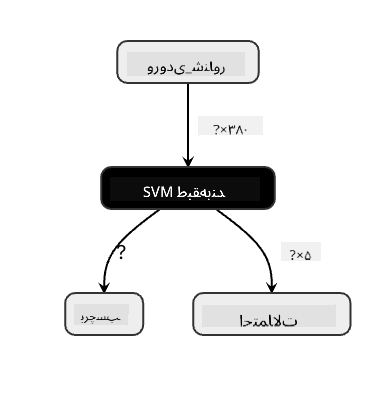
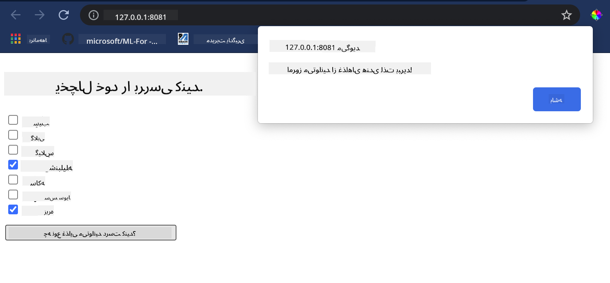

<!--
CO_OP_TRANSLATOR_METADATA:
{
  "original_hash": "ad2cf19d7490247558d20a6a59650d13",
  "translation_date": "2025-09-03T23:56:24+00:00",
  "source_file": "4-Classification/4-Applied/README.md",
  "language_code": "fa"
}
-->
# ساخت یک اپلیکیشن وب توصیه‌گر غذا

در این درس، شما یک مدل دسته‌بندی با استفاده از تکنیک‌هایی که در درس‌های قبلی یاد گرفته‌اید و با استفاده از دیتاست خوشمزه غذاها که در این سری استفاده شده است، خواهید ساخت. علاوه بر این، یک اپلیکیشن وب کوچک برای استفاده از مدل ذخیره‌شده خواهید ساخت که از محیط اجرایی وب Onnx بهره می‌برد.

یکی از کاربردهای عملی بسیار مفید یادگیری ماشین، ساخت سیستم‌های توصیه‌گر است، و امروز می‌توانید اولین قدم در این مسیر را بردارید!

🎥 برای مشاهده ویدیو روی تصویر بالا کلیک کنید: جن لوپر یک اپلیکیشن وب با استفاده از داده‌های دسته‌بندی‌شده غذاها می‌سازد.

## [پیش‌از‌درس: آزمون کوتاه](https://gray-sand-07a10f403.1.azurestaticapps.net/quiz/25/)

در این درس یاد خواهید گرفت:

- چگونه یک مدل بسازید و آن را به فرمت Onnx ذخیره کنید
- چگونه از Netron برای بررسی مدل استفاده کنید
- چگونه از مدل خود در یک اپلیکیشن وب برای استنتاج استفاده کنید

## ساخت مدل

ساخت سیستم‌های کاربردی یادگیری ماشین بخش مهمی از استفاده از این فناوری‌ها در سیستم‌های کسب‌وکار شماست. شما می‌توانید مدل‌ها را در اپلیکیشن‌های وب خود استفاده کنید (و در صورت نیاز حتی به صورت آفلاین از آنها بهره ببرید) با استفاده از Onnx.

در یک [درس قبلی](../../3-Web-App/1-Web-App/README.md)، شما یک مدل رگرسیون درباره مشاهده‌های UFO ساختید، آن را "pickle" کردید و در یک اپلیکیشن Flask استفاده کردید. در حالی که این معماری بسیار مفید است، یک اپلیکیشن کامل پایتون است و ممکن است نیازهای شما شامل استفاده از یک اپلیکیشن جاوااسکریپت باشد.

در این درس، می‌توانید یک سیستم پایه جاوااسکریپت برای استنتاج بسازید. اما ابتدا باید یک مدل آموزش دهید و آن را برای استفاده با Onnx تبدیل کنید.

## تمرین - آموزش مدل دسته‌بندی

ابتدا یک مدل دسته‌بندی با استفاده از دیتاست تمیز شده غذاها که قبلاً استفاده کردیم، آموزش دهید.

1. ابتدا کتابخانه‌های مفید را وارد کنید:

    ```python
    !pip install skl2onnx
    import pandas as pd 
    ```

    شما به '[skl2onnx](https://onnx.ai/sklearn-onnx/)' نیاز دارید تا به تبدیل مدل Scikit-learn خود به فرمت Onnx کمک کند.

1. سپس، با داده‌های خود همان‌طور که در درس‌های قبلی انجام دادید، کار کنید و یک فایل CSV را با استفاده از `read_csv()` بخوانید:

    ```python
    data = pd.read_csv('../data/cleaned_cuisines.csv')
    data.head()
    ```

1. دو ستون اول غیرضروری را حذف کنید و داده‌های باقی‌مانده را به عنوان 'X' ذخیره کنید:

    ```python
    X = data.iloc[:,2:]
    X.head()
    ```

1. برچسب‌ها را به عنوان 'y' ذخیره کنید:

    ```python
    y = data[['cuisine']]
    y.head()
    
    ```

### شروع روند آموزش

ما از کتابخانه 'SVC' استفاده خواهیم کرد که دقت خوبی دارد.

1. کتابخانه‌های مناسب را از Scikit-learn وارد کنید:

    ```python
    from sklearn.model_selection import train_test_split
    from sklearn.svm import SVC
    from sklearn.model_selection import cross_val_score
    from sklearn.metrics import accuracy_score,precision_score,confusion_matrix,classification_report
    ```

1. مجموعه‌های آموزشی و تست را جدا کنید:

    ```python
    X_train, X_test, y_train, y_test = train_test_split(X,y,test_size=0.3)
    ```

1. یک مدل دسته‌بندی SVC همان‌طور که در درس قبلی انجام دادید، بسازید:

    ```python
    model = SVC(kernel='linear', C=10, probability=True,random_state=0)
    model.fit(X_train,y_train.values.ravel())
    ```

1. اکنون مدل خود را آزمایش کنید و `predict()` را فراخوانی کنید:

    ```python
    y_pred = model.predict(X_test)
    ```

1. یک گزارش دسته‌بندی چاپ کنید تا کیفیت مدل را بررسی کنید:

    ```python
    print(classification_report(y_test,y_pred))
    ```

    همان‌طور که قبلاً دیدیم، دقت خوب است:

    ```output
                    precision    recall  f1-score   support
    
         chinese       0.72      0.69      0.70       257
          indian       0.91      0.87      0.89       243
        japanese       0.79      0.77      0.78       239
          korean       0.83      0.79      0.81       236
            thai       0.72      0.84      0.78       224
    
        accuracy                           0.79      1199
       macro avg       0.79      0.79      0.79      1199
    weighted avg       0.79      0.79      0.79      1199
    ```

### تبدیل مدل به Onnx

اطمینان حاصل کنید که تبدیل با تعداد مناسب Tensor انجام شود. این دیتاست دارای 380 ماده غذایی است، بنابراین باید این عدد را در `FloatTensorType` مشخص کنید:

1. تبدیل را با تعداد Tensor برابر با 380 انجام دهید.

    ```python
    from skl2onnx import convert_sklearn
    from skl2onnx.common.data_types import FloatTensorType
    
    initial_type = [('float_input', FloatTensorType([None, 380]))]
    options = {id(model): {'nocl': True, 'zipmap': False}}
    ```

1. فایل onx را ایجاد کنید و به عنوان **model.onnx** ذخیره کنید:

    ```python
    onx = convert_sklearn(model, initial_types=initial_type, options=options)
    with open("./model.onnx", "wb") as f:
        f.write(onx.SerializeToString())
    ```

    > توجه داشته باشید که می‌توانید [گزینه‌ها](https://onnx.ai/sklearn-onnx/parameterized.html) را در اسکریپت تبدیل خود وارد کنید. در این مورد، 'nocl' به True و 'zipmap' به False تنظیم شده است. از آنجا که این یک مدل دسته‌بندی است، شما گزینه حذف ZipMap را دارید که لیستی از دیکشنری‌ها تولید می‌کند (ضروری نیست). `nocl` به اطلاعات کلاس اشاره دارد که در مدل گنجانده شده است. اندازه مدل خود را با تنظیم `nocl` به 'True' کاهش دهید.

اجرای کل نوت‌بوک اکنون یک مدل Onnx ایجاد می‌کند و آن را در این پوشه ذخیره می‌کند.

## مشاهده مدل

مدل‌های Onnx در Visual Studio Code چندان قابل مشاهده نیستند، اما یک نرم‌افزار رایگان بسیار خوب وجود دارد که بسیاری از محققان برای مشاهده مدل استفاده می‌کنند تا اطمینان حاصل کنند که به درستی ساخته شده است. [Netron](https://github.com/lutzroeder/Netron) را دانلود کنید و فایل model.onnx خود را باز کنید. می‌توانید مدل ساده خود را مشاهده کنید که شامل 380 ورودی و دسته‌بندی‌کننده است:



Netron ابزاری مفید برای مشاهده مدل‌های شماست.

اکنون آماده هستید تا از این مدل جالب در یک اپلیکیشن وب استفاده کنید. بیایید اپلیکیشنی بسازیم که زمانی که به یخچال خود نگاه می‌کنید و سعی می‌کنید بفهمید کدام ترکیب از مواد باقی‌مانده شما می‌تواند برای پخت یک غذای خاص استفاده شود، به کار بیاید.

## ساخت اپلیکیشن وب توصیه‌گر

شما می‌توانید مدل خود را مستقیماً در یک اپلیکیشن وب استفاده کنید. این معماری همچنین به شما امکان می‌دهد آن را به صورت محلی و حتی آفلاین اجرا کنید. ابتدا یک فایل `index.html` در همان پوشه‌ای که فایل `model.onnx` خود را ذخیره کرده‌اید، ایجاد کنید.

1. در این فایل _index.html_، مارک‌آپ زیر را اضافه کنید:

    ```html
    <!DOCTYPE html>
    <html>
        <header>
            <title>Cuisine Matcher</title>
        </header>
        <body>
            ...
        </body>
    </html>
    ```

1. اکنون، درون تگ‌های `body`، کمی مارک‌آپ اضافه کنید تا لیستی از چک‌باکس‌ها که برخی مواد غذایی را نشان می‌دهند، نمایش داده شود:

    ```html
    <h1>Check your refrigerator. What can you create?</h1>
            <div id="wrapper">
                <div class="boxCont">
                    <input type="checkbox" value="4" class="checkbox">
                    <label>apple</label>
                </div>
            
                <div class="boxCont">
                    <input type="checkbox" value="247" class="checkbox">
                    <label>pear</label>
                </div>
            
                <div class="boxCont">
                    <input type="checkbox" value="77" class="checkbox">
                    <label>cherry</label>
                </div>
    
                <div class="boxCont">
                    <input type="checkbox" value="126" class="checkbox">
                    <label>fenugreek</label>
                </div>
    
                <div class="boxCont">
                    <input type="checkbox" value="302" class="checkbox">
                    <label>sake</label>
                </div>
    
                <div class="boxCont">
                    <input type="checkbox" value="327" class="checkbox">
                    <label>soy sauce</label>
                </div>
    
                <div class="boxCont">
                    <input type="checkbox" value="112" class="checkbox">
                    <label>cumin</label>
                </div>
            </div>
            <div style="padding-top:10px">
                <button onClick="startInference()">What kind of cuisine can you make?</button>
            </div> 
    ```

    توجه کنید که به هر چک‌باکس یک مقدار داده شده است. این مقدار نشان‌دهنده شاخصی است که ماده غذایی در دیتاست دارد. برای مثال، سیب در این لیست الفبایی، ستون پنجم را اشغال می‌کند، بنابراین مقدار آن '4' است زیرا شمارش از 0 شروع می‌شود. می‌توانید به [صفحه‌گسترده مواد غذایی](../../../../4-Classification/data/ingredient_indexes.csv) مراجعه کنید تا شاخص یک ماده غذایی خاص را پیدا کنید.

    ادامه کار در فایل index.html، یک بلوک اسکریپت اضافه کنید که مدل را پس از بسته شدن نهایی `</div>` فراخوانی کند.

1. ابتدا، [Onnx Runtime](https://www.onnxruntime.ai/) را وارد کنید:

    ```html
    <script src="https://cdn.jsdelivr.net/npm/onnxruntime-web@1.9.0/dist/ort.min.js"></script> 
    ```

    > Onnx Runtime برای اجرای مدل‌های Onnx در طیف گسترده‌ای از پلتفرم‌های سخت‌افزاری، شامل بهینه‌سازی‌ها و یک API برای استفاده، استفاده می‌شود.

1. پس از قرار دادن Runtime، می‌توانید آن را فراخوانی کنید:

    ```html
    <script>
        const ingredients = Array(380).fill(0);
        
        const checks = [...document.querySelectorAll('.checkbox')];
        
        checks.forEach(check => {
            check.addEventListener('change', function() {
                // toggle the state of the ingredient
                // based on the checkbox's value (1 or 0)
                ingredients[check.value] = check.checked ? 1 : 0;
            });
        });

        function testCheckboxes() {
            // validate if at least one checkbox is checked
            return checks.some(check => check.checked);
        }

        async function startInference() {

            let atLeastOneChecked = testCheckboxes()

            if (!atLeastOneChecked) {
                alert('Please select at least one ingredient.');
                return;
            }
            try {
                // create a new session and load the model.
                
                const session = await ort.InferenceSession.create('./model.onnx');

                const input = new ort.Tensor(new Float32Array(ingredients), [1, 380]);
                const feeds = { float_input: input };

                // feed inputs and run
                const results = await session.run(feeds);

                // read from results
                alert('You can enjoy ' + results.label.data[0] + ' cuisine today!')

            } catch (e) {
                console.log(`failed to inference ONNX model`);
                console.error(e);
            }
        }
               
    </script>
    ```

در این کد، چندین اتفاق رخ می‌دهد:

1. شما یک آرایه از 380 مقدار ممکن (1 یا 0) ایجاد کردید که بسته به اینکه یک چک‌باکس انتخاب شده باشد یا نه، تنظیم شده و به مدل برای استنتاج ارسال می‌شود.
2. شما یک آرایه از چک‌باکس‌ها و روشی برای تعیین اینکه آیا آنها انتخاب شده‌اند یا نه، در یک تابع `init` ایجاد کردید که هنگام شروع اپلیکیشن فراخوانی می‌شود. وقتی یک چک‌باکس انتخاب می‌شود، آرایه `ingredients` تغییر می‌کند تا ماده غذایی انتخاب‌شده را منعکس کند.
3. شما یک تابع `testCheckboxes` ایجاد کردید که بررسی می‌کند آیا هیچ چک‌باکسی انتخاب شده است یا نه.
4. شما از تابع `startInference` استفاده می‌کنید که وقتی دکمه فشار داده می‌شود، اگر هیچ چک‌باکسی انتخاب شده باشد، استنتاج را شروع می‌کند.
5. روند استنتاج شامل موارد زیر است:
   1. تنظیم یک بارگذاری غیرهمزمان مدل
   2. ایجاد یک ساختار Tensor برای ارسال به مدل
   3. ایجاد 'feeds' که ورودی `float_input` را که هنگام آموزش مدل خود ایجاد کردید، منعکس می‌کند (می‌توانید از Netron برای تأیید نام آن استفاده کنید)
   4. ارسال این 'feeds' به مدل و انتظار برای پاسخ

## آزمایش اپلیکیشن

یک جلسه ترمینال در Visual Studio Code در پوشه‌ای که فایل index.html شما قرار دارد، باز کنید. اطمینان حاصل کنید که [http-server](https://www.npmjs.com/package/http-server) به صورت جهانی نصب شده است و در خط فرمان `http-server` تایپ کنید. یک localhost باید باز شود و می‌توانید اپلیکیشن وب خود را مشاهده کنید. بررسی کنید که چه غذایی بر اساس مواد مختلف توصیه می‌شود:



تبریک می‌گوییم، شما یک اپلیکیشن وب توصیه‌گر با چند فیلد ایجاد کردید. کمی وقت بگذارید تا این سیستم را توسعه دهید!

## 🚀چالش

اپلیکیشن وب شما بسیار ساده است، بنابراین آن را با استفاده از مواد غذایی و شاخص‌های آنها از داده‌های [ingredient_indexes](../../../../4-Classification/data/ingredient_indexes.csv) توسعه دهید. چه ترکیب‌های طعمی برای ایجاد یک غذای ملی خاص کار می‌کنند؟

## [پس‌از‌درس: آزمون کوتاه](https://gray-sand-07a10f403.1.azurestaticapps.net/quiz/26/)

## مرور و مطالعه شخصی

در حالی که این درس فقط به کاربرد ایجاد یک سیستم توصیه‌گر برای مواد غذایی اشاره کرد، این حوزه از کاربردهای یادگیری ماشین بسیار غنی از مثال‌هاست. درباره نحوه ساخت این سیستم‌ها بیشتر بخوانید:

- https://www.sciencedirect.com/topics/computer-science/recommendation-engine
- https://www.technologyreview.com/2014/08/25/171547/the-ultimate-challenge-for-recommendation-engines/
- https://www.technologyreview.com/2015/03/23/168831/everything-is-a-recommendation/

## تکلیف 

[ساخت یک توصیه‌گر جدید](assignment.md)

---

**سلب مسئولیت**:  
این سند با استفاده از سرویس ترجمه هوش مصنوعی [Co-op Translator](https://github.com/Azure/co-op-translator) ترجمه شده است. در حالی که ما تلاش می‌کنیم دقت را حفظ کنیم، لطفاً توجه داشته باشید که ترجمه‌های خودکار ممکن است شامل خطاها یا نادرستی‌ها باشند. سند اصلی به زبان اصلی آن باید به عنوان منبع معتبر در نظر گرفته شود. برای اطلاعات حساس، توصیه می‌شود از ترجمه حرفه‌ای انسانی استفاده کنید. ما مسئولیتی در قبال سوء تفاهم‌ها یا تفسیرهای نادرست ناشی از استفاده از این ترجمه نداریم.