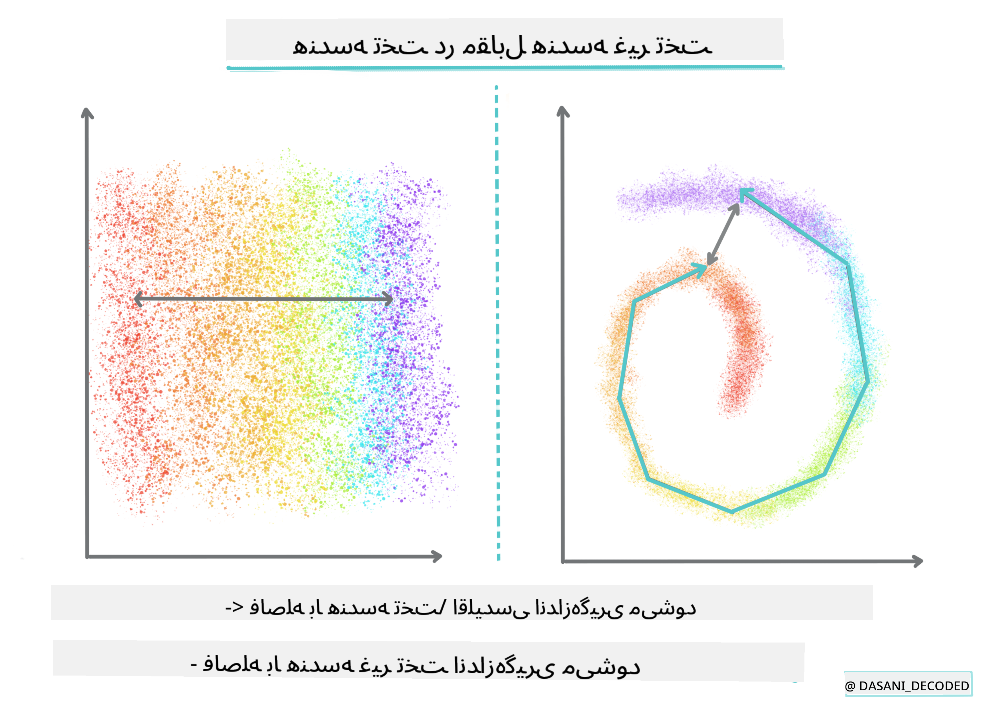
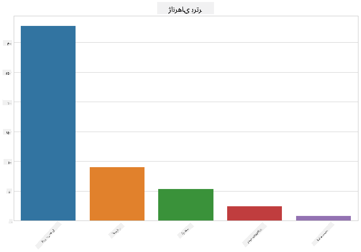
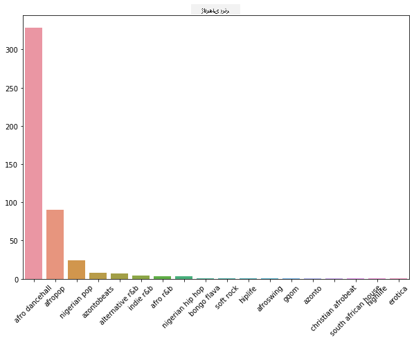
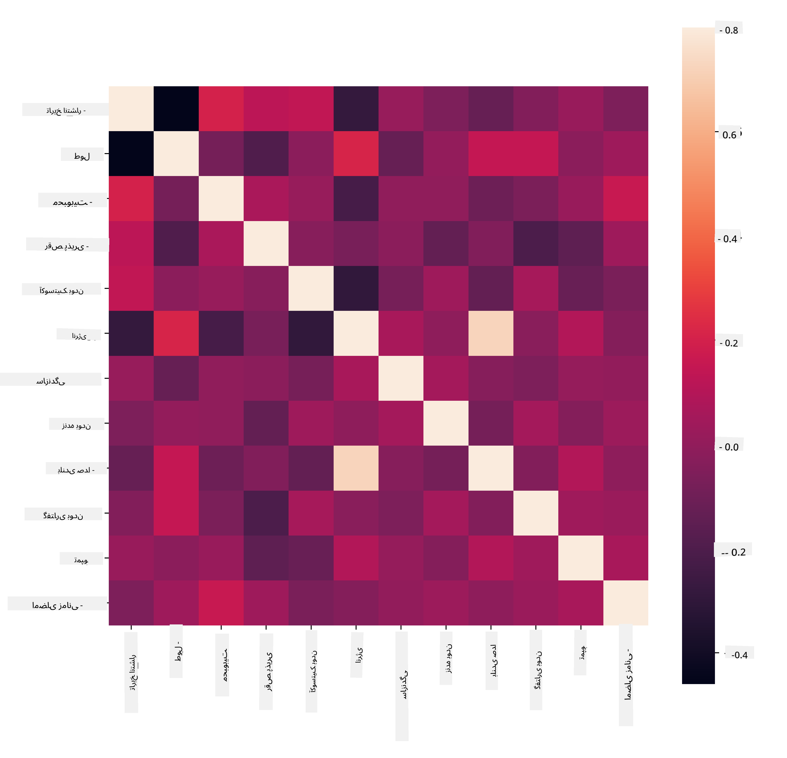
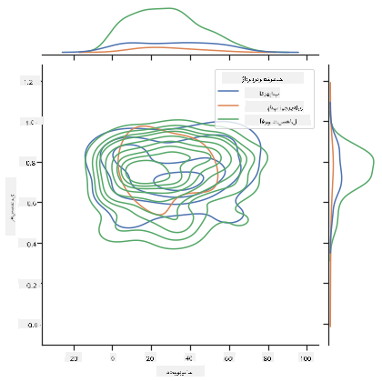
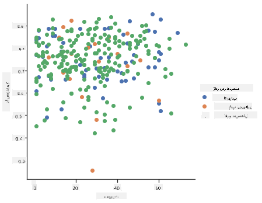

<!--
CO_OP_TRANSLATOR_METADATA:
{
  "original_hash": "0ab69b161efd7a41d325ee28b29415d7",
  "translation_date": "2025-09-03T23:05:44+00:00",
  "source_file": "5-Clustering/1-Visualize/README.md",
  "language_code": "fa"
}
-->
# مقدمه‌ای بر خوشه‌بندی

خوشه‌بندی نوعی [یادگیری بدون نظارت](https://wikipedia.org/wiki/Unsupervised_learning) است که فرض می‌کند مجموعه داده‌ها بدون برچسب هستند یا ورودی‌های آن‌ها با خروجی‌های از پیش تعریف‌شده مطابقت ندارند. این روش از الگوریتم‌های مختلفی برای مرتب‌سازی داده‌های بدون برچسب استفاده می‌کند و بر اساس الگوهایی که در داده‌ها تشخیص می‌دهد، گروه‌بندی‌هایی ارائه می‌دهد.

[](https://youtu.be/ty2advRiWJM "No One Like You by PSquare")

> 🎥 روی تصویر بالا کلیک کنید تا ویدیو را ببینید. در حالی که در حال مطالعه یادگیری ماشین با خوشه‌بندی هستید، از آهنگ‌های رقص نیجریه‌ای لذت ببرید - این آهنگ از PSquare در سال ۲۰۱۴ بسیار مورد توجه قرار گرفته است.

## [آزمون پیش از درس](https://gray-sand-07a10f403.1.azurestaticapps.net/quiz/27/)

### مقدمه

[خوشه‌بندی](https://link.springer.com/referenceworkentry/10.1007%2F978-0-387-30164-8_124) برای کشف داده‌ها بسیار مفید است. بیایید ببینیم آیا می‌تواند به کشف روندها و الگوها در نحوه مصرف موسیقی توسط مخاطبان نیجریه‌ای کمک کند.

✅ یک دقیقه وقت بگذارید و به کاربردهای خوشه‌بندی فکر کنید. در زندگی واقعی، خوشه‌بندی زمانی اتفاق می‌افتد که شما یک دسته لباس دارید و باید لباس‌های اعضای خانواده‌تان را مرتب کنید 🧦👕👖🩲. در علم داده، خوشه‌بندی زمانی اتفاق می‌افتد که سعی دارید ترجیحات کاربر را تحلیل کنید یا ویژگی‌های هر مجموعه داده بدون برچسب را تعیین کنید. خوشه‌بندی، به نوعی، به ایجاد نظم در آشفتگی کمک می‌کند، مانند مرتب کردن کشوی جوراب‌ها.

[](https://youtu.be/esmzYhuFnds "Introduction to Clustering")

> 🎥 روی تصویر بالا کلیک کنید تا ویدیو را ببینید: جان گوتاگ از MIT خوشه‌بندی را معرفی می‌کند.

در محیط حرفه‌ای، خوشه‌بندی می‌تواند برای تعیین مواردی مانند تقسیم‌بندی بازار، مشخص کردن گروه‌های سنی که چه اقلامی را خریداری می‌کنند، استفاده شود. کاربرد دیگر می‌تواند تشخیص ناهنجاری باشد، شاید برای کشف تقلب از یک مجموعه داده تراکنش‌های کارت اعتباری. یا ممکن است از خوشه‌بندی برای تعیین تومورها در مجموعه‌ای از اسکن‌های پزشکی استفاده کنید.

✅ یک دقیقه فکر کنید که چگونه ممکن است در محیط‌های بانکی، تجارت الکترونیک یا کسب‌وکار با خوشه‌بندی مواجه شده باشید.

> 🎓 جالب است بدانید که تحلیل خوشه‌ای در دهه ۱۹۳۰ در زمینه‌های انسان‌شناسی و روان‌شناسی آغاز شد. آیا می‌توانید تصور کنید که چگونه ممکن است استفاده شده باشد؟

به طور جایگزین، می‌توانید از آن برای گروه‌بندی نتایج جستجو - مانند لینک‌های خرید، تصاویر یا نظرات - استفاده کنید. خوشه‌بندی زمانی مفید است که یک مجموعه داده بزرگ دارید که می‌خواهید آن را کاهش دهید و تحلیل دقیق‌تری روی آن انجام دهید، بنابراین این تکنیک می‌تواند برای یادگیری درباره داده‌ها قبل از ساخت مدل‌های دیگر استفاده شود.

✅ هنگامی که داده‌های شما در خوشه‌ها سازماندهی شد، به آن‌ها یک شناسه خوشه اختصاص می‌دهید، و این تکنیک می‌تواند زمانی مفید باشد که بخواهید حریم خصوصی مجموعه داده را حفظ کنید؛ به جای استفاده از داده‌های قابل شناسایی، می‌توانید به یک نقطه داده با شناسه خوشه آن اشاره کنید. آیا می‌توانید دلایل دیگری را تصور کنید که چرا ممکن است ترجیح دهید از شناسه خوشه به جای عناصر دیگر خوشه برای شناسایی استفاده کنید؟

درک خود را از تکنیک‌های خوشه‌بندی در این [ماژول آموزشی](https://docs.microsoft.com/learn/modules/train-evaluate-cluster-models?WT.mc_id=academic-77952-leestott) عمیق‌تر کنید.

## شروع کار با خوشه‌بندی

[Scikit-learn مجموعه بزرگی](https://scikit-learn.org/stable/modules/clustering.html) از روش‌ها را برای انجام خوشه‌بندی ارائه می‌دهد. نوعی که انتخاب می‌کنید به مورد استفاده شما بستگی دارد. طبق مستندات، هر روش مزایای مختلفی دارد. در اینجا یک جدول ساده از روش‌های پشتیبانی‌شده توسط Scikit-learn و موارد استفاده مناسب آن‌ها آورده شده است:

| نام روش                     | مورد استفاده                                                         |
| :-------------------------- | :------------------------------------------------------------------- |
| K-Means                     | استفاده عمومی، استنتاجی                                             |
| Affinity propagation        | خوشه‌های زیاد و نامساوی، استنتاجی                                    |
| Mean-shift                  | خوشه‌های زیاد و نامساوی، استنتاجی                                    |
| Spectral clustering         | خوشه‌های کم و مساوی، انتقالی                                        |
| Ward hierarchical clustering| خوشه‌های زیاد و محدود، انتقالی                                      |
| Agglomerative clustering    | خوشه‌های زیاد و محدود، فاصله‌های غیر اقلیدسی، انتقالی               |
| DBSCAN                      | هندسه غیر مسطح، خوشه‌های نامساوی، انتقالی                          |
| OPTICS                      | هندسه غیر مسطح، خوشه‌های نامساوی با چگالی متغیر، انتقالی           |
| Gaussian mixtures           | هندسه مسطح، استنتاجی                                               |
| BIRCH                       | مجموعه داده بزرگ با نقاط پرت، استنتاجی                              |

> 🎓 نحوه ایجاد خوشه‌ها ارتباط زیادی با نحوه جمع‌آوری نقاط داده در گروه‌ها دارد. بیایید برخی از واژگان را بررسی کنیم:
>
> 🎓 ['انتقالی' در مقابل 'استنتاجی'](https://wikipedia.org/wiki/Transduction_(machine_learning))
> 
> استنتاج انتقالی از موارد آموزشی مشاهده‌شده که به موارد آزمایشی خاص نگاشت می‌شوند، مشتق می‌شود. استنتاج استنتاجی از موارد آموزشی که به قوانین عمومی نگاشت می‌شوند و سپس به موارد آزمایشی اعمال می‌شوند، مشتق می‌شود.
> 
> مثال: تصور کنید یک مجموعه داده دارید که فقط بخشی از آن برچسب‌گذاری شده است. برخی چیزها 'صفحه' هستند، برخی 'سی‌دی' و برخی خالی هستند. وظیفه شما این است که برای موارد خالی برچسب ارائه دهید. اگر رویکرد استنتاجی را انتخاب کنید، مدلی را برای جستجوی 'صفحه' و 'سی‌دی' آموزش می‌دهید و این برچسب‌ها را به داده‌های بدون برچسب اعمال می‌کنید. این رویکرد در طبقه‌بندی چیزهایی که در واقع 'کاست' هستند، مشکل خواهد داشت. یک رویکرد انتقالی، از سوی دیگر، این داده‌های ناشناخته را مؤثرتر مدیریت می‌کند زیرا تلاش می‌کند موارد مشابه را گروه‌بندی کند و سپس یک برچسب به گروه اعمال کند. در این مورد، خوشه‌ها ممکن است 'چیزهای موسیقی گرد' و 'چیزهای موسیقی مربعی' را منعکس کنند.
> 
> 🎓 ['هندسه غیر مسطح' در مقابل 'مسطح'](https://datascience.stackexchange.com/questions/52260/terminology-flat-geometry-in-the-context-of-clustering)
> 
> مشتق‌شده از اصطلاحات ریاضی، هندسه غیر مسطح در مقابل مسطح به اندازه‌گیری فاصله بین نقاط با روش‌های هندسی 'مسطح' ([اقلیدسی](https://wikipedia.org/wiki/Euclidean_geometry)) یا 'غیر مسطح' (غیر اقلیدسی) اشاره دارد.
>
>'مسطح' در این زمینه به هندسه اقلیدسی (بخش‌هایی از آن به عنوان هندسه 'صفحه' آموزش داده می‌شود) اشاره دارد، و غیر مسطح به هندسه غیر اقلیدسی اشاره دارد. هندسه چه ارتباطی با یادگیری ماشین دارد؟ خوب، به عنوان دو زمینه که ریشه در ریاضیات دارند، باید یک روش مشترک برای اندازه‌گیری فاصله بین نقاط در خوشه‌ها وجود داشته باشد، و این می‌تواند به صورت 'مسطح' یا 'غیر مسطح' انجام شود، بسته به ماهیت داده‌ها. [فاصله‌های اقلیدسی](https://wikipedia.org/wiki/Euclidean_distance) به عنوان طول یک خط مستقیم بین دو نقطه اندازه‌گیری می‌شوند. [فاصله‌های غیر اقلیدسی](https://wikipedia.org/wiki/Non-Euclidean_geometry) در طول یک منحنی اندازه‌گیری می‌شوند. اگر داده‌های شما، به صورت بصری، به نظر می‌رسد که روی یک صفحه وجود ندارد، ممکن است نیاز به استفاده از یک الگوریتم تخصصی برای مدیریت آن داشته باشید.
>

> اینفوگرافیک توسط [Dasani Madipalli](https://twitter.com/dasani_decoded)
> 
> 🎓 ['فاصله‌ها'](https://web.stanford.edu/class/cs345a/slides/12-clustering.pdf)
> 
> خوشه‌ها با ماتریس فاصله خود تعریف می‌شوند، به عنوان مثال فاصله بین نقاط. این فاصله می‌تواند به چند روش اندازه‌گیری شود. خوشه‌های اقلیدسی با میانگین مقادیر نقاط تعریف می‌شوند و دارای یک 'مرکز' یا نقطه مرکزی هستند. فاصله‌ها بنابراین با فاصله تا آن مرکز اندازه‌گیری می‌شوند. فاصله‌های غیر اقلیدسی به 'کلسترویدها' اشاره دارند، نقطه‌ای که نزدیک‌ترین به سایر نقاط است. کلسترویدها به نوبه خود می‌توانند به روش‌های مختلف تعریف شوند.
> 
> 🎓 ['محدود'](https://wikipedia.org/wiki/Constrained_clustering)
> 
> [خوشه‌بندی محدود](https://web.cs.ucdavis.edu/~davidson/Publications/ICDMTutorial.pdf) 'یادگیری نیمه‌نظارت‌شده' را به این روش بدون نظارت معرفی می‌کند. روابط بین نقاط به عنوان 'نمی‌توانند لینک شوند' یا 'باید لینک شوند' علامت‌گذاری می‌شوند، بنابراین برخی قوانین به مجموعه داده تحمیل می‌شوند.
>
>مثال: اگر یک الگوریتم به صورت آزاد روی یک دسته داده‌های بدون برچسب یا نیمه‌برچسب‌گذاری شده اجرا شود، خوشه‌هایی که تولید می‌کند ممکن است کیفیت پایینی داشته باشند. در مثال بالا، خوشه‌ها ممکن است 'چیزهای موسیقی گرد' و 'چیزهای موسیقی مربعی' و 'چیزهای مثلثی' و 'کوکی‌ها' را گروه‌بندی کنند. اگر برخی محدودیت‌ها یا قوانین برای دنبال کردن داده شود ("آیتم باید پلاستیکی باشد"، "آیتم باید بتواند موسیقی تولید کند") این می‌تواند به الگوریتم کمک کند تا انتخاب‌های بهتری انجام دهد.
> 
> 🎓 'چگالی'
> 
> داده‌هایی که 'پر سر و صدا' هستند به عنوان 'متراکم' در نظر گرفته می‌شوند. فاصله بین نقاط در هر یک از خوشه‌های آن ممکن است، در بررسی، بیشتر یا کمتر متراکم یا 'شلوغ' باشد و بنابراین این داده‌ها نیاز به تحلیل با روش خوشه‌بندی مناسب دارند. [این مقاله](https://www.kdnuggets.com/2020/02/understanding-density-based-clustering.html) تفاوت بین استفاده از خوشه‌بندی K-Means در مقابل الگوریتم‌های HDBSCAN برای کشف یک مجموعه داده پر سر و صدا با چگالی خوشه‌های نامساوی را نشان می‌دهد.

## الگوریتم‌های خوشه‌بندی

بیش از ۱۰۰ الگوریتم خوشه‌بندی وجود دارد و استفاده از آن‌ها به ماهیت داده‌های موجود بستگی دارد. بیایید برخی از مهم‌ترین آن‌ها را بررسی کنیم:

- **خوشه‌بندی سلسله‌مراتبی**. اگر یک شیء بر اساس نزدیکی به یک شیء نزدیک‌تر، به جای یک شیء دورتر، طبقه‌بندی شود، خوشه‌ها بر اساس فاصله اعضای آن‌ها به و از سایر اشیاء تشکیل می‌شوند. خوشه‌بندی تجمعی Scikit-learn سلسله‌مراتبی است.

   
   > اینفوگرافیک توسط [Dasani Madipalli](https://twitter.com/dasani_decoded)

- **خوشه‌بندی مرکزی**. این الگوریتم محبوب نیاز به انتخاب 'k' یا تعداد خوشه‌هایی که باید تشکیل شوند دارد، پس از آن الگوریتم نقطه مرکزی یک خوشه را تعیین می‌کند و داده‌ها را در اطراف آن نقطه جمع‌آوری می‌کند. [خوشه‌بندی K-means](https://wikipedia.org/wiki/K-means_clustering) نسخه محبوبی از خوشه‌بندی مرکزی است. مرکز بر اساس میانگین نزدیک‌ترین نقاط تعیین می‌شود، بنابراین نام آن به همین دلیل است. فاصله مربع از خوشه به حداقل می‌رسد.

   
   > اینفوگرافیک توسط [Dasani Madipalli](https://twitter.com/dasani_decoded)

- **خوشه‌بندی مبتنی بر توزیع**. بر اساس مدل‌سازی آماری، خوشه‌بندی مبتنی بر توزیع بر تعیین احتمال تعلق یک نقطه داده به یک خوشه تمرکز دارد و آن را به طور مناسب اختصاص می‌دهد. روش‌های مخلوط گوسی به این نوع تعلق دارند.

- **خوشه‌بندی مبتنی بر چگالی**. نقاط داده بر اساس چگالی آن‌ها یا گروه‌بندی آن‌ها در اطراف یکدیگر به خوشه‌ها اختصاص داده می‌شوند. نقاط داده دور از گروه به عنوان نقاط پرت یا نویز در نظر گرفته می‌شوند. DBSCAN، Mean-shift و OPTICS به این نوع خوشه‌بندی تعلق دارند.

- **خوشه‌بندی مبتنی بر شبکه**. برای مجموعه داده‌های چندبعدی، یک شبکه ایجاد می‌شود و داده‌ها بین سلول‌های شبکه تقسیم می‌شوند، بنابراین خوشه‌ها ایجاد می‌شوند.

## تمرین - داده‌های خود را خوشه‌بندی کنید

خوشه‌بندی به عنوان یک تکنیک با تجسم مناسب بسیار کمک می‌شود، بنابراین بیایید با تجسم داده‌های موسیقی خود شروع کنیم. این تمرین به ما کمک می‌کند تصمیم بگیریم کدام یک از روش‌های خوشه‌بندی را باید برای ماهیت این داده‌ها به طور مؤثر استفاده کنیم.

1. فایل [_notebook.ipynb_](https://github.com/microsoft/ML-For-Beginners/blob/main/5-Clustering/1-Visualize/notebook.ipynb) را در این پوشه باز کنید.

1. بسته `Seaborn` را برای تجسم خوب داده‌ها وارد کنید.

    ```python
    !pip install seaborn
    ```

1. داده‌های آهنگ را از [_nigerian-songs.csv_](https://github.com/microsoft/ML-For-Beginners/blob/main/5-Clustering/data/nigerian-songs.csv) اضافه کنید. یک dataframe با برخی داده‌ها درباره آهنگ‌ها بارگذاری کنید. آماده شوید تا این داده‌ها را با وارد کردن کتابخانه‌ها و نمایش داده‌ها بررسی کنید:

    ```python
    import matplotlib.pyplot as plt
    import pandas as pd
    
    df = pd.read_csv("../data/nigerian-songs.csv")
    df.head()
    ```

    خطوط اول داده را بررسی کنید:

    |     | نام                     | آلبوم                        | هنرمند              | ژانر اصلی هنرمند | تاریخ انتشار | طول | محبوبیت | قابلیت رقص | آکوستیک بودن | انرژی | ابزار بودن | زنده بودن | بلندی صدا | گفتاری بودن | تمپو   | امضای زمانی |
    | --- | ------------------------ | ---------------------------- | ------------------- | ---------------- | ------------ | ------ | ---------- | ------------ | ------------ | ------ | ---------------- | -------- | -------- | ----------- | ------- | -------------- |
    | 0   | Sparky                   | Mandy & The Jungle           | Cruel Santino       | alternative r&b  | 2019         | 144000 | 48         | 0.666        | 0.851        | 0.42   | 0.534            | 0.11     | -6.699   | 0.0829      | 133.015 | 5              |
    | 1   | shuga rush               | EVERYTHING YOU HEARD IS TRUE | Odunsi (The Engine) | afropop          | 2020         | 89488  | 30         | 0.71         | 0.0822       | 0.683  | 0.000169         | 0.101    | -5.64    | 0.36        | 129.993 | 3              |
| 2   | LITT!                    | LITT!                        | AYLØ                | indie r&b        | 2018         | 207758 | 40         | 0.836        | 0.272        | 0.564  | 0.000537         | 0.11     | -7.127   | 0.0424      | 130.005 | 4              |
| 3   | Confident / Feeling Cool | Enjoy Your Life              | Lady Donli          | nigerian pop     | 2019         | 175135 | 14         | 0.894        | 0.798        | 0.611  | 0.000187         | 0.0964   | -4.961   | 0.113       | 111.087 | 4              |
| 4   | wanted you               | rare.                        | Odunsi (The Engine) | afropop          | 2018         | 152049 | 25         | 0.702        | 0.116        | 0.833  | 0.91             | 0.348    | -6.044   | 0.0447      | 105.115 | 4              |

1. اطلاعاتی درباره دیتافریم دریافت کنید، با فراخوانی `info()`:

    ```python
    df.info()
    ```

   خروجی به این شکل خواهد بود:

    ```output
    <class 'pandas.core.frame.DataFrame'>
    RangeIndex: 530 entries, 0 to 529
    Data columns (total 16 columns):
     #   Column            Non-Null Count  Dtype  
    ---  ------            --------------  -----  
     0   name              530 non-null    object 
     1   album             530 non-null    object 
     2   artist            530 non-null    object 
     3   artist_top_genre  530 non-null    object 
     4   release_date      530 non-null    int64  
     5   length            530 non-null    int64  
     6   popularity        530 non-null    int64  
     7   danceability      530 non-null    float64
     8   acousticness      530 non-null    float64
     9   energy            530 non-null    float64
     10  instrumentalness  530 non-null    float64
     11  liveness          530 non-null    float64
     12  loudness          530 non-null    float64
     13  speechiness       530 non-null    float64
     14  tempo             530 non-null    float64
     15  time_signature    530 non-null    int64  
    dtypes: float64(8), int64(4), object(4)
    memory usage: 66.4+ KB
    ```

1. بررسی مجدد برای مقادیر خالی، با فراخوانی `isnull()` و اطمینان از اینکه مجموع برابر با 0 است:

    ```python
    df.isnull().sum()
    ```

    همه چیز خوب به نظر می‌رسد:

    ```output
    name                0
    album               0
    artist              0
    artist_top_genre    0
    release_date        0
    length              0
    popularity          0
    danceability        0
    acousticness        0
    energy              0
    instrumentalness    0
    liveness            0
    loudness            0
    speechiness         0
    tempo               0
    time_signature      0
    dtype: int64
    ```

1. داده‌ها را توصیف کنید:

    ```python
    df.describe()
    ```

    |       | release_date | length      | popularity | danceability | acousticness | energy   | instrumentalness | liveness | loudness  | speechiness | tempo      | time_signature |
    | ----- | ------------ | ----------- | ---------- | ------------ | ------------ | -------- | ---------------- | -------- | --------- | ----------- | ---------- | -------------- |
    | count | 530          | 530         | 530        | 530          | 530          | 530      | 530              | 530      | 530       | 530         | 530        | 530            |
    | mean  | 2015.390566  | 222298.1698 | 17.507547  | 0.741619     | 0.265412     | 0.760623 | 0.016305         | 0.147308 | -4.953011 | 0.130748    | 116.487864 | 3.986792       |
    | std   | 3.131688     | 39696.82226 | 18.992212  | 0.117522     | 0.208342     | 0.148533 | 0.090321         | 0.123588 | 2.464186  | 0.092939    | 23.518601  | 0.333701       |
    | min   | 1998         | 89488       | 0          | 0.255        | 0.000665     | 0.111    | 0                | 0.0283   | -19.362   | 0.0278      | 61.695     | 3              |
    | 25%   | 2014         | 199305      | 0          | 0.681        | 0.089525     | 0.669    | 0                | 0.07565  | -6.29875  | 0.0591      | 102.96125  | 4              |
    | 50%   | 2016         | 218509      | 13         | 0.761        | 0.2205       | 0.7845   | 0.000004         | 0.1035   | -4.5585   | 0.09795     | 112.7145   | 4              |
    | 75%   | 2017         | 242098.5    | 31         | 0.8295       | 0.403        | 0.87575  | 0.000234         | 0.164    | -3.331    | 0.177       | 125.03925  | 4              |
    | max   | 2020         | 511738      | 73         | 0.966        | 0.954        | 0.995    | 0.91             | 0.811    | 0.582     | 0.514       | 206.007    | 5              |

> 🤔 اگر ما با خوشه‌بندی کار می‌کنیم، روشی بدون نظارت که نیازی به داده‌های برچسب‌گذاری شده ندارد، چرا این داده‌ها را با برچسب‌ها نشان می‌دهیم؟ در مرحله بررسی داده‌ها، این برچسب‌ها مفید هستند، اما برای عملکرد الگوریتم‌های خوشه‌بندی ضروری نیستند. شما می‌توانید به راحتی سرستون‌ها را حذف کنید و به داده‌ها با شماره ستون‌ها اشاره کنید.

به مقادیر کلی داده‌ها نگاه کنید. توجه داشته باشید که محبوبیت می‌تواند '0' باشد، که نشان‌دهنده آهنگ‌هایی است که رتبه‌بندی ندارند. بیایید به زودی این موارد را حذف کنیم.

1. از یک نمودار میله‌ای برای یافتن محبوب‌ترین ژانرها استفاده کنید:

    ```python
    import seaborn as sns
    
    top = df['artist_top_genre'].value_counts()
    plt.figure(figsize=(10,7))
    sns.barplot(x=top[:5].index,y=top[:5].values)
    plt.xticks(rotation=45)
    plt.title('Top genres',color = 'blue')
    ```

    

✅ اگر می‌خواهید مقادیر بیشتری ببینید، مقدار `[:5]` را به عدد بزرگتری تغییر دهید یا آن را حذف کنید تا همه مقادیر را ببینید.

توجه کنید، زمانی که ژانر برتر به عنوان 'Missing' توصیف می‌شود، به این معناست که اسپاتیفای آن را دسته‌بندی نکرده است، بنابراین بیایید آن را حذف کنیم.

1. داده‌های گم‌شده را با فیلتر کردن حذف کنید

    ```python
    df = df[df['artist_top_genre'] != 'Missing']
    top = df['artist_top_genre'].value_counts()
    plt.figure(figsize=(10,7))
    sns.barplot(x=top.index,y=top.values)
    plt.xticks(rotation=45)
    plt.title('Top genres',color = 'blue')
    ```

    اکنون ژانرها را دوباره بررسی کنید:

    

1. سه ژانر برتر به طور قابل توجهی بر این مجموعه داده تسلط دارند. بیایید بر روی `afro dancehall`، `afropop` و `nigerian pop` تمرکز کنیم، همچنین مجموعه داده را فیلتر کنیم تا هر چیزی با مقدار محبوبیت 0 را حذف کنیم (به این معنا که در مجموعه داده با محبوبیت دسته‌بندی نشده و می‌توان آن را برای اهداف ما به عنوان نویز در نظر گرفت):

    ```python
    df = df[(df['artist_top_genre'] == 'afro dancehall') | (df['artist_top_genre'] == 'afropop') | (df['artist_top_genre'] == 'nigerian pop')]
    df = df[(df['popularity'] > 0)]
    top = df['artist_top_genre'].value_counts()
    plt.figure(figsize=(10,7))
    sns.barplot(x=top.index,y=top.values)
    plt.xticks(rotation=45)
    plt.title('Top genres',color = 'blue')
    ```

1. یک آزمایش سریع انجام دهید تا ببینید آیا داده‌ها به طور خاصی قوی همبستگی دارند:

    ```python
    corrmat = df.corr(numeric_only=True)
    f, ax = plt.subplots(figsize=(12, 9))
    sns.heatmap(corrmat, vmax=.8, square=True)
    ```

    

    تنها همبستگی قوی بین `energy` و `loudness` است، که خیلی تعجب‌آور نیست، زیرا موسیقی بلند معمولاً بسیار پرانرژی است. در غیر این صورت، همبستگی‌ها نسبتاً ضعیف هستند. جالب خواهد بود که ببینیم یک الگوریتم خوشه‌بندی چه چیزی می‌تواند از این داده‌ها استخراج کند.

    > 🎓 توجه داشته باشید که همبستگی به معنای علت و معلول نیست! ما اثبات همبستگی داریم اما اثبات علت و معلول نداریم. یک [وب‌سایت جالب](https://tylervigen.com/spurious-correlations) برخی تصاویر را نشان می‌دهد که این نکته را برجسته می‌کند.

آیا در این مجموعه داده همگرایی‌ای در مورد محبوبیت و قابلیت رقص آهنگ‌ها وجود دارد؟ یک FacetGrid نشان می‌دهد که دایره‌های متحدالمرکز وجود دارند که صرف نظر از ژانر، هم‌راستا هستند. آیا ممکن است سلیقه‌های نیجریه‌ای در سطح خاصی از قابلیت رقص برای این ژانر همگرا شوند؟

✅ نقاط داده مختلف (انرژی، بلندی صدا، گفتار) و ژانرهای موسیقی بیشتر یا متفاوت را امتحان کنید. چه چیزی می‌توانید کشف کنید؟ به جدول `df.describe()` نگاه کنید تا پراکندگی کلی نقاط داده را ببینید.

### تمرین - توزیع داده‌ها

آیا این سه ژانر به طور قابل توجهی در درک قابلیت رقص بر اساس محبوبیت متفاوت هستند؟

1. توزیع داده‌های سه ژانر برتر ما را برای محبوبیت و قابلیت رقص در امتداد محور x و y بررسی کنید.

    ```python
    sns.set_theme(style="ticks")
    
    g = sns.jointplot(
        data=df,
        x="popularity", y="danceability", hue="artist_top_genre",
        kind="kde",
    )
    ```

    شما می‌توانید دایره‌های متحدالمرکز را در اطراف یک نقطه همگرایی کلی کشف کنید که توزیع نقاط را نشان می‌دهد.

    > 🎓 توجه داشته باشید که این مثال از یک نمودار KDE (Kernel Density Estimate) استفاده می‌کند که داده‌ها را با استفاده از یک منحنی چگالی احتمال پیوسته نشان می‌دهد. این به ما امکان می‌دهد داده‌ها را هنگام کار با توزیع‌های متعدد تفسیر کنیم.

    به طور کلی، سه ژانر در مورد محبوبیت و قابلیت رقص به طور کلی هم‌راستا هستند. تعیین خوشه‌ها در این داده‌های به طور کلی هم‌راستا چالش‌برانگیز خواهد بود:

    

1. یک نمودار پراکندگی ایجاد کنید:

    ```python
    sns.FacetGrid(df, hue="artist_top_genre", height=5) \
       .map(plt.scatter, "popularity", "danceability") \
       .add_legend()
    ```

    نمودار پراکندگی با همان محورها الگوی مشابهی از همگرایی را نشان می‌دهد

    

به طور کلی، برای خوشه‌بندی، می‌توانید از نمودارهای پراکندگی برای نشان دادن خوشه‌های داده استفاده کنید، بنابراین تسلط بر این نوع تجسم بسیار مفید است. در درس بعدی، ما این داده‌های فیلتر شده را می‌گیریم و از خوشه‌بندی k-means برای کشف گروه‌هایی در این داده‌ها استفاده می‌کنیم که به نظر می‌رسد به روش‌های جالبی هم‌پوشانی دارند.

---

## 🚀چالش

در آماده‌سازی برای درس بعدی، نموداری درباره الگوریتم‌های مختلف خوشه‌بندی که ممکن است کشف کنید و در محیط تولید استفاده کنید، ایجاد کنید. خوشه‌بندی چه نوع مشکلاتی را سعی در حل دارد؟

## [آزمون پس از درس](https://gray-sand-07a10f403.1.azurestaticapps.net/quiz/28/)

## مرور و مطالعه شخصی

قبل از اعمال الگوریتم‌های خوشه‌بندی، همانطور که یاد گرفتیم، ایده خوبی است که ماهیت مجموعه داده خود را درک کنید. درباره این موضوع بیشتر بخوانید [اینجا](https://www.kdnuggets.com/2019/10/right-clustering-algorithm.html)

[این مقاله مفید](https://www.freecodecamp.org/news/8-clustering-algorithms-in-machine-learning-that-all-data-scientists-should-know/) شما را با روش‌های مختلفی که الگوریتم‌های خوشه‌بندی مختلف با اشکال داده‌های مختلف رفتار می‌کنند، آشنا می‌کند.

## تکلیف

[تحقیق درباره تجسم‌های دیگر برای خوشه‌بندی](assignment.md)

---

**سلب مسئولیت**:  
این سند با استفاده از سرویس ترجمه هوش مصنوعی [Co-op Translator](https://github.com/Azure/co-op-translator) ترجمه شده است. در حالی که ما تلاش می‌کنیم دقت را حفظ کنیم، لطفاً توجه داشته باشید که ترجمه‌های خودکار ممکن است شامل خطاها یا نادرستی‌ها باشند. سند اصلی به زبان اصلی آن باید به عنوان منبع معتبر در نظر گرفته شود. برای اطلاعات حساس، توصیه می‌شود از ترجمه حرفه‌ای انسانی استفاده کنید. ما مسئولیتی در قبال سوء تفاهم‌ها یا تفسیرهای نادرست ناشی از استفاده از این ترجمه نداریم.