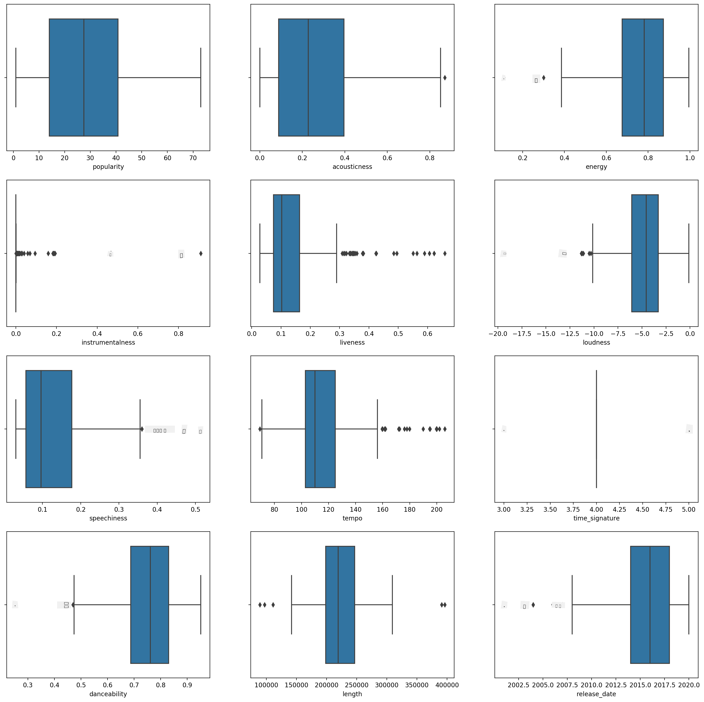
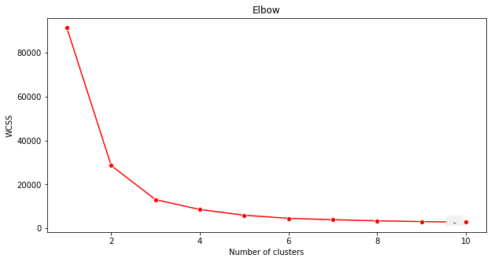

<!--
CO_OP_TRANSLATOR_METADATA:
{
  "original_hash": "085d571097d201810720df4cd379f8c2",
  "translation_date": "2025-09-03T23:11:44+00:00",
  "source_file": "5-Clustering/2-K-Means/README.md",
  "language_code": "fa"
}
-->
# خوشه‌بندی K-Means

## [پیش‌آزمون درس](https://gray-sand-07a10f403.1.azurestaticapps.net/quiz/29/)

در این درس، یاد می‌گیرید چگونه با استفاده از Scikit-learn و مجموعه داده موسیقی نیجریه‌ای که قبلاً وارد کرده‌اید، خوشه‌ها ایجاد کنید. ما اصول اولیه K-Means برای خوشه‌بندی را پوشش خواهیم داد. به یاد داشته باشید، همانطور که در درس قبلی یاد گرفتید، روش‌های مختلفی برای کار با خوشه‌ها وجود دارد و روشی که استفاده می‌کنید به داده‌های شما بستگی دارد. ما K-Means را امتحان می‌کنیم زیرا این رایج‌ترین تکنیک خوشه‌بندی است. بیایید شروع کنیم!

اصطلاحاتی که با آن‌ها آشنا خواهید شد:

- امتیاز سیلوئت
- روش آرنج
- اینرسی
- واریانس

## مقدمه

[خوشه‌بندی K-Means](https://wikipedia.org/wiki/K-means_clustering) روشی است که از حوزه پردازش سیگنال مشتق شده است. این روش برای تقسیم و دسته‌بندی گروه‌های داده به 'k' خوشه با استفاده از یک سری مشاهدات استفاده می‌شود. هر مشاهده تلاش می‌کند یک نقطه داده را به نزدیک‌ترین 'میانگین' یا نقطه مرکزی یک خوشه گروه‌بندی کند.

خوشه‌ها را می‌توان به صورت [نمودارهای ورونوی](https://wikipedia.org/wiki/Voronoi_diagram) که شامل یک نقطه (یا 'بذر') و منطقه مربوط به آن است، تجسم کرد.


> اینفوگرافیک توسط [Jen Looper](https://twitter.com/jenlooper)

فرآیند خوشه‌بندی K-Means [در سه مرحله اجرا می‌شود](https://scikit-learn.org/stable/modules/clustering.html#k-means):

1. الگوریتم تعداد k نقطه مرکزی را با نمونه‌گیری از مجموعه داده انتخاب می‌کند. سپس وارد حلقه می‌شود:
    1. هر نمونه را به نزدیک‌ترین مرکز اختصاص می‌دهد.
    2. مراکز جدیدی ایجاد می‌کند با گرفتن میانگین مقادیر تمام نمونه‌هایی که به مراکز قبلی اختصاص داده شده‌اند.
    3. سپس تفاوت بین مراکز جدید و قدیمی را محاسبه کرده و تا زمانی که مراکز تثبیت شوند، تکرار می‌کند.

یکی از معایب استفاده از K-Means این است که باید مقدار 'k'، یعنی تعداد مراکز را تعیین کنید. خوشبختانه روش 'آرنج' به تخمین یک مقدار اولیه مناسب برای 'k' کمک می‌کند. به زودی آن را امتحان خواهید کرد.

## پیش‌نیاز

در فایل [_notebook.ipynb_](https://github.com/microsoft/ML-For-Beginners/blob/main/5-Clustering/2-K-Means/notebook.ipynb) این درس کار خواهید کرد که شامل وارد کردن داده‌ها و پاکسازی اولیه‌ای است که در درس قبلی انجام دادید.

## تمرین - آماده‌سازی

ابتدا دوباره به داده‌های آهنگ‌ها نگاه کنید.

1. یک نمودار جعبه‌ای ایجاد کنید، با فراخوانی `boxplot()` برای هر ستون:

    ```python
    plt.figure(figsize=(20,20), dpi=200)
    
    plt.subplot(4,3,1)
    sns.boxplot(x = 'popularity', data = df)
    
    plt.subplot(4,3,2)
    sns.boxplot(x = 'acousticness', data = df)
    
    plt.subplot(4,3,3)
    sns.boxplot(x = 'energy', data = df)
    
    plt.subplot(4,3,4)
    sns.boxplot(x = 'instrumentalness', data = df)
    
    plt.subplot(4,3,5)
    sns.boxplot(x = 'liveness', data = df)
    
    plt.subplot(4,3,6)
    sns.boxplot(x = 'loudness', data = df)
    
    plt.subplot(4,3,7)
    sns.boxplot(x = 'speechiness', data = df)
    
    plt.subplot(4,3,8)
    sns.boxplot(x = 'tempo', data = df)
    
    plt.subplot(4,3,9)
    sns.boxplot(x = 'time_signature', data = df)
    
    plt.subplot(4,3,10)
    sns.boxplot(x = 'danceability', data = df)
    
    plt.subplot(4,3,11)
    sns.boxplot(x = 'length', data = df)
    
    plt.subplot(4,3,12)
    sns.boxplot(x = 'release_date', data = df)
    ```

    این داده‌ها کمی پر سر و صدا هستند: با مشاهده هر ستون به صورت نمودار جعبه‌ای، می‌توانید نقاط پرت را ببینید.

    

    می‌توانید مجموعه داده را مرور کرده و این نقاط پرت را حذف کنید، اما این کار داده‌ها را بسیار محدود می‌کند.

1. فعلاً ستون‌هایی را انتخاب کنید که برای تمرین خوشه‌بندی مناسب هستند. ستون‌هایی با محدوده‌های مشابه انتخاب کنید و ستون `artist_top_genre` را به داده‌های عددی تبدیل کنید:

    ```python
    from sklearn.preprocessing import LabelEncoder
    le = LabelEncoder()
    
    X = df.loc[:, ('artist_top_genre','popularity','danceability','acousticness','loudness','energy')]
    
    y = df['artist_top_genre']
    
    X['artist_top_genre'] = le.fit_transform(X['artist_top_genre'])
    
    y = le.transform(y)
    ```

1. اکنون باید تعداد خوشه‌هایی که هدف قرار می‌دهید را انتخاب کنید. می‌دانید که 3 ژانر آهنگ از مجموعه داده استخراج کرده‌ایم، پس بیایید 3 را امتحان کنیم:

    ```python
    from sklearn.cluster import KMeans
    
    nclusters = 3 
    seed = 0
    
    km = KMeans(n_clusters=nclusters, random_state=seed)
    km.fit(X)
    
    # Predict the cluster for each data point
    
    y_cluster_kmeans = km.predict(X)
    y_cluster_kmeans
    ```

    یک آرایه چاپ شده با خوشه‌های پیش‌بینی شده (0، 1، یا 2) برای هر سطر از دیتافریم مشاهده می‌کنید.

1. از این آرایه برای محاسبه 'امتیاز سیلوئت' استفاده کنید:

    ```python
    from sklearn import metrics
    score = metrics.silhouette_score(X, y_cluster_kmeans)
    score
    ```

## امتیاز سیلوئت

به دنبال امتیاز سیلوئت نزدیک به 1 باشید. این امتیاز از -1 تا 1 متغیر است و اگر امتیاز 1 باشد، خوشه متراکم و به خوبی از سایر خوشه‌ها جدا شده است. مقدار نزدیک به 0 نشان‌دهنده خوشه‌های همپوشانی با نمونه‌هایی است که بسیار نزدیک به مرز تصمیم‌گیری خوشه‌های همسایه هستند. [(منبع)](https://dzone.com/articles/kmeans-silhouette-score-explained-with-python-exam)

امتیاز ما **0.53** است، بنابراین در وسط قرار دارد. این نشان می‌دهد که داده‌های ما به‌طور خاص برای این نوع خوشه‌بندی مناسب نیست، اما بیایید ادامه دهیم.

### تمرین - ساخت مدل

1. `KMeans` را وارد کنید و فرآیند خوشه‌بندی را شروع کنید.

    ```python
    from sklearn.cluster import KMeans
    wcss = []
    
    for i in range(1, 11):
        kmeans = KMeans(n_clusters = i, init = 'k-means++', random_state = 42)
        kmeans.fit(X)
        wcss.append(kmeans.inertia_)
    
    ```

    چند بخش وجود دارد که نیاز به توضیح دارند.

    > 🎓 range: این تعداد تکرارهای فرآیند خوشه‌بندی است.

    > 🎓 random_state: "تعیین‌کننده تولید اعداد تصادفی برای مقداردهی اولیه مراکز." [منبع](https://scikit-learn.org/stable/modules/generated/sklearn.cluster.KMeans.html#sklearn.cluster.KMeans)

    > 🎓 WCSS: "مجموع مربعات درون خوشه‌ها" فاصله متوسط مربعی تمام نقاط درون یک خوشه تا مرکز خوشه را اندازه‌گیری می‌کند. [منبع](https://medium.com/@ODSC/unsupervised-learning-evaluating-clusters-bd47eed175ce)

    > 🎓 Inertia: الگوریتم‌های K-Means تلاش می‌کنند مراکز را به گونه‌ای انتخاب کنند که 'اینرسی'، "معیاری از انسجام داخلی خوشه‌ها"، به حداقل برسد. مقدار در هر تکرار به متغیر wcss اضافه می‌شود. [منبع](https://scikit-learn.org/stable/modules/clustering.html)

    > 🎓 k-means++: در [Scikit-learn](https://scikit-learn.org/stable/modules/clustering.html#k-means) می‌توانید از بهینه‌سازی 'k-means++' استفاده کنید که "مراکز را به گونه‌ای مقداردهی اولیه می‌کند که (به‌طور کلی) از یکدیگر دور باشند، که احتمالاً نتایج بهتری نسبت به مقداردهی اولیه تصادفی دارد."

### روش آرنج

قبلاً حدس زدید که چون 3 ژانر آهنگ هدف قرار داده‌اید، باید 3 خوشه انتخاب کنید. اما آیا این درست است؟

1. از روش 'آرنج' برای اطمینان استفاده کنید.

    ```python
    plt.figure(figsize=(10,5))
    sns.lineplot(x=range(1, 11), y=wcss, marker='o', color='red')
    plt.title('Elbow')
    plt.xlabel('Number of clusters')
    plt.ylabel('WCSS')
    plt.show()
    ```

    از متغیر `wcss` که در مرحله قبل ساختید استفاده کنید تا نموداری ایجاد کنید که نشان دهد 'خمیدگی' در آرنج کجاست، که تعداد بهینه خوشه‌ها را نشان می‌دهد. شاید واقعاً **3** باشد!

    

## تمرین - نمایش خوشه‌ها

1. فرآیند را دوباره امتحان کنید، این بار سه خوشه تنظیم کنید و خوشه‌ها را به صورت نمودار پراکندگی نمایش دهید:

    ```python
    from sklearn.cluster import KMeans
    kmeans = KMeans(n_clusters = 3)
    kmeans.fit(X)
    labels = kmeans.predict(X)
    plt.scatter(df['popularity'],df['danceability'],c = labels)
    plt.xlabel('popularity')
    plt.ylabel('danceability')
    plt.show()
    ```

1. دقت مدل را بررسی کنید:

    ```python
    labels = kmeans.labels_
    
    correct_labels = sum(y == labels)
    
    print("Result: %d out of %d samples were correctly labeled." % (correct_labels, y.size))
    
    print('Accuracy score: {0:0.2f}'. format(correct_labels/float(y.size)))
    ```

    دقت این مدل خیلی خوب نیست و شکل خوشه‌ها به شما نشان می‌دهد چرا.

    

    این داده‌ها بیش از حد نامتعادل هستند، ارتباط کمی دارند و بین مقادیر ستون‌ها تنوع زیادی وجود دارد که باعث می‌شود خوشه‌بندی به خوبی انجام نشود. در واقع، خوشه‌هایی که تشکیل می‌شوند احتمالاً به شدت تحت تأثیر یا توسط سه دسته ژانر که در بالا تعریف کردیم، منحرف شده‌اند. این یک فرآیند یادگیری بود!

    در مستندات Scikit-learn، می‌توانید ببینید که مدلی مانند این، با خوشه‌هایی که به خوبی مشخص نشده‌اند، مشکل 'واریانس' دارد:

    
    > اینفوگرافیک از Scikit-learn

## واریانس

واریانس به عنوان "میانگین اختلافات مربعی از میانگین" تعریف می‌شود [(منبع)](https://www.mathsisfun.com/data/standard-deviation.html). در زمینه این مسئله خوشه‌بندی، به داده‌هایی اشاره دارد که اعداد مجموعه داده ما تمایل دارند کمی بیش از حد از میانگین فاصله بگیرند.

✅ این لحظه خوبی است برای فکر کردن به تمام راه‌هایی که می‌توانید این مشکل را اصلاح کنید. داده‌ها را کمی بیشتر تغییر دهید؟ از ستون‌های مختلف استفاده کنید؟ از الگوریتم دیگری استفاده کنید؟ نکته: سعی کنید داده‌های خود را [مقیاس‌بندی کنید](https://www.mygreatlearning.com/blog/learning-data-science-with-k-means-clustering/) تا آن‌ها را نرمال کنید و ستون‌های دیگر را آزمایش کنید.

> این '[ماشین حساب واریانس](https://www.calculatorsoup.com/calculators/statistics/variance-calculator.php)' را امتحان کنید تا مفهوم را کمی بهتر درک کنید.

---

## 🚀چالش

زمانی را با این نوت‌بوک صرف کنید و پارامترها را تغییر دهید. آیا می‌توانید با پاکسازی بیشتر داده‌ها (مثلاً حذف نقاط پرت) دقت مدل را بهبود دهید؟ می‌توانید از وزن‌ها برای دادن وزن بیشتر به نمونه‌های داده خاص استفاده کنید. چه کار دیگری می‌توانید انجام دهید تا خوشه‌های بهتری ایجاد کنید؟

نکته: سعی کنید داده‌های خود را مقیاس‌بندی کنید. در نوت‌بوک کدی کامنت‌گذاری شده وجود دارد که مقیاس‌بندی استاندارد را اضافه می‌کند تا ستون‌های داده از نظر محدوده بیشتر شبیه به یکدیگر شوند. خواهید دید که در حالی که امتیاز سیلوئت کاهش می‌یابد، 'خمیدگی' در نمودار آرنج صاف‌تر می‌شود. این به این دلیل است که باقی گذاشتن داده‌ها بدون مقیاس‌بندی اجازه می‌دهد داده‌هایی با واریانس کمتر وزن بیشتری داشته باشند. در مورد این مشکل کمی بیشتر بخوانید [اینجا](https://stats.stackexchange.com/questions/21222/are-mean-normalization-and-feature-scaling-needed-for-k-means-clustering/21226#21226).

## [پس‌آزمون درس](https://gray-sand-07a10f403.1.azurestaticapps.net/quiz/30/)

## مرور و مطالعه شخصی

به یک شبیه‌ساز K-Means [مانند این](https://user.ceng.metu.edu.tr/~akifakkus/courses/ceng574/k-means/) نگاهی بیندازید. می‌توانید از این ابزار برای تجسم نقاط داده نمونه و تعیین مراکز آن‌ها استفاده کنید. می‌توانید تصادفی بودن داده‌ها، تعداد خوشه‌ها و تعداد مراکز را ویرایش کنید. آیا این به شما کمک می‌کند ایده‌ای از نحوه گروه‌بندی داده‌ها پیدا کنید؟

همچنین به [این جزوه درباره K-Means](https://stanford.edu/~cpiech/cs221/handouts/kmeans.html) از دانشگاه استنفورد نگاهی بیندازید.

## تکلیف

[روش‌های خوشه‌بندی مختلف را امتحان کنید](assignment.md)

---

**سلب مسئولیت**:  
این سند با استفاده از سرویس ترجمه هوش مصنوعی [Co-op Translator](https://github.com/Azure/co-op-translator) ترجمه شده است. در حالی که ما برای دقت تلاش می‌کنیم، لطفاً توجه داشته باشید که ترجمه‌های خودکار ممکن است شامل خطاها یا نادقتی‌ها باشند. سند اصلی به زبان اصلی آن باید به عنوان منبع معتبر در نظر گرفته شود. برای اطلاعات حساس، ترجمه حرفه‌ای انسانی توصیه می‌شود. ما هیچ مسئولیتی در قبال سوءتفاهم‌ها یا تفسیرهای نادرست ناشی از استفاده از این ترجمه نداریم.