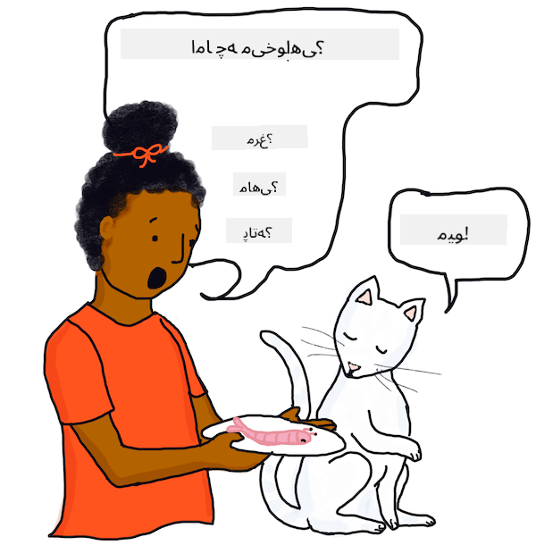

<!--
CO_OP_TRANSLATOR_METADATA:
{
  "original_hash": "89e923cf3e8bdff9662536e8bf9516e6",
  "translation_date": "2025-09-04T00:47:46+00:00",
  "source_file": "6-NLP/1-Introduction-to-NLP/README.md",
  "language_code": "fa"
}
-->
# مقدمه‌ای بر پردازش زبان طبیعی

این درس به تاریخچه‌ای کوتاه و مفاهیم مهم *پردازش زبان طبیعی*، یکی از زیرشاخه‌های *زبان‌شناسی محاسباتی* می‌پردازد.

## [آزمون پیش از درس](https://gray-sand-07a10f403.1.azurestaticapps.net/quiz/31/)

## مقدمه

پردازش زبان طبیعی، که به اختصار NLP نامیده می‌شود، یکی از شناخته‌شده‌ترین حوزه‌هایی است که یادگیری ماشین در آن به کار گرفته شده و در نرم‌افزارهای تولیدی استفاده شده است.

✅ آیا می‌توانید نرم‌افزاری که هر روز استفاده می‌کنید و احتمالاً از NLP بهره می‌برد را نام ببرید؟ به برنامه‌های پردازش متن یا اپلیکیشن‌های موبایلی که به طور مرتب استفاده می‌کنید فکر کنید.

شما درباره موارد زیر یاد خواهید گرفت:

- **ایده زبان‌ها**. چگونه زبان‌ها توسعه یافتند و چه حوزه‌های اصلی مطالعه در این زمینه بوده‌اند.
- **تعاریف و مفاهیم**. همچنین درباره تعاریف و مفاهیمی که به پردازش متن توسط کامپیوترها مربوط می‌شود، از جمله تجزیه، دستور زبان، و شناسایی اسم‌ها و فعل‌ها خواهید آموخت. در این درس برخی وظایف کدنویسی وجود دارد و چندین مفهوم مهم معرفی می‌شوند که در درس‌های بعدی یاد خواهید گرفت چگونه آن‌ها را کدنویسی کنید.

## زبان‌شناسی محاسباتی

زبان‌شناسی محاسباتی حوزه‌ای از تحقیق و توسعه است که طی دهه‌ها به مطالعه چگونگی کار کردن کامپیوترها با زبان‌ها، و حتی فهمیدن، ترجمه کردن و ارتباط برقرار کردن با آن‌ها پرداخته است. پردازش زبان طبیعی (NLP) حوزه‌ای مرتبط است که بر چگونگی پردازش زبان‌های انسانی توسط کامپیوترها تمرکز دارد.

### مثال - دیکته تلفنی

اگر تاکنون به جای تایپ کردن، به تلفن خود دیکته کرده‌اید یا از یک دستیار مجازی سوالی پرسیده‌اید، گفتار شما به شکل متن تبدیل شده و سپس پردازش یا *تجزیه* شده است. کلمات کلیدی شناسایی شده سپس به فرمتی تبدیل شده‌اند که تلفن یا دستیار بتواند آن را بفهمد و بر اساس آن عمل کند.


> درک واقعی زبان‌شناسی دشوار است! تصویر از [Jen Looper](https://twitter.com/jenlooper)

### چگونه این فناوری ممکن شده است؟

این امکان به دلیل این است که کسی یک برنامه کامپیوتری برای انجام این کار نوشته است. چند دهه پیش، برخی نویسندگان علمی-تخیلی پیش‌بینی کردند که مردم بیشتر با کامپیوترهای خود صحبت خواهند کرد و کامپیوترها همیشه دقیقاً منظور آن‌ها را خواهند فهمید. متأسفانه، مشخص شد که این مشکل سخت‌تر از آن چیزی است که بسیاری تصور می‌کردند، و در حالی که امروز این مشکل بسیار بهتر درک شده است، چالش‌های قابل توجهی در دستیابی به پردازش زبان طبیعی 'کامل' وجود دارد، به ویژه در فهمیدن معنای یک جمله. این مشکل به خصوص در فهمیدن طنز یا تشخیص احساساتی مانند طعنه در یک جمله دشوار است.

در این مرحله، ممکن است به یاد کلاس‌های مدرسه بیفتید که معلم بخش‌های دستور زبان در یک جمله را پوشش می‌داد. در برخی کشورها، دانش‌آموزان دستور زبان و زبان‌شناسی را به عنوان یک موضوع اختصاصی آموزش می‌بینند، اما در بسیاری از کشورها، این موضوعات به عنوان بخشی از یادگیری یک زبان آموزش داده می‌شوند: یا زبان اول شما در مدرسه ابتدایی (یادگیری خواندن و نوشتن) و شاید یک زبان دوم در دبیرستان. نگران نباشید اگر در تشخیص اسم‌ها از فعل‌ها یا قیدها از صفت‌ها متخصص نیستید!

اگر در تفاوت بین *حال ساده* و *حال استمراری* مشکل دارید، تنها نیستید. این موضوع برای بسیاری از افراد، حتی گویشوران بومی یک زبان، چالش‌برانگیز است. خبر خوب این است که کامپیوترها در اعمال قوانین رسمی بسیار خوب هستند، و شما یاد خواهید گرفت که کدی بنویسید که بتواند یک جمله را به خوبی یک انسان *تجزیه* کند. چالش بزرگ‌تر که بعداً بررسی خواهید کرد، فهمیدن *معنا* و *احساس* یک جمله است.

## پیش‌نیازها

برای این درس، پیش‌نیاز اصلی توانایی خواندن و فهمیدن زبان این درس است. هیچ مسئله ریاضی یا معادله‌ای برای حل وجود ندارد. در حالی که نویسنده اصلی این درس را به زبان انگلیسی نوشته است، این درس به زبان‌های دیگر نیز ترجمه شده است، بنابراین ممکن است شما ترجمه‌ای را بخوانید. در مثال‌ها، از چندین زبان مختلف استفاده شده است (برای مقایسه قوانین دستوری مختلف زبان‌ها). این زبان‌ها *ترجمه نشده‌اند*، اما متن توضیحی ترجمه شده است، بنابراین معنا باید واضح باشد.

برای وظایف کدنویسی، شما از Python استفاده خواهید کرد و مثال‌ها با Python 3.8 نوشته شده‌اند.

در این بخش، شما نیاز دارید و استفاده خواهید کرد از:

- **درک Python 3**. درک زبان برنامه‌نویسی Python 3، این درس از ورودی، حلقه‌ها، خواندن فایل، و آرایه‌ها استفاده می‌کند.
- **Visual Studio Code + افزونه**. ما از Visual Studio Code و افزونه Python آن استفاده خواهیم کرد. شما همچنین می‌توانید از یک IDE Python دلخواه خود استفاده کنید.
- **TextBlob**. [TextBlob](https://github.com/sloria/TextBlob) یک کتابخانه ساده برای پردازش متن در Python است. دستورالعمل‌های موجود در سایت TextBlob را دنبال کنید تا آن را روی سیستم خود نصب کنید (همچنین corpora را همانطور که در زیر نشان داده شده نصب کنید):

   ```bash
   pip install -U textblob
   python -m textblob.download_corpora
   ```

> 💡 نکته: شما می‌توانید Python را مستقیماً در محیط‌های VS Code اجرا کنید. برای اطلاعات بیشتر به [مستندات](https://code.visualstudio.com/docs/languages/python?WT.mc_id=academic-77952-leestott) مراجعه کنید.

## صحبت کردن با ماشین‌ها

تاریخ تلاش برای فهمیدن زبان انسانی توسط کامپیوترها به دهه‌ها قبل بازمی‌گردد، و یکی از اولین دانشمندانی که به پردازش زبان طبیعی فکر کرد *آلن تورینگ* بود.

### آزمون تورینگ

وقتی تورینگ در دهه ۱۹۵۰ درباره *هوش مصنوعی* تحقیق می‌کرد، او به این فکر کرد که آیا می‌توان آزمونی مکالمه‌ای به یک انسان و کامپیوتر (از طریق مکاتبه تایپی) داد که در آن انسان در مکالمه مطمئن نباشد که با یک انسان دیگر یا یک کامپیوتر مکالمه می‌کند.

اگر پس از مدت مشخصی از مکالمه، انسان نتواند تشخیص دهد که پاسخ‌ها از کامپیوتر هستند یا نه، آیا می‌توان گفت که کامپیوتر *فکر می‌کند*؟

### الهام - 'بازی تقلید'

ایده این آزمون از یک بازی مهمانی به نام *بازی تقلید* گرفته شده است که در آن یک بازجو در اتاقی تنها است و وظیفه دارد تشخیص دهد که کدام یک از دو نفر (در اتاق دیگر) به ترتیب مرد و زن هستند. بازجو می‌تواند یادداشت ارسال کند و باید سعی کند سوالاتی مطرح کند که پاسخ‌های نوشته شده جنسیت فرد ناشناس را آشکار کند. البته، بازیکنان در اتاق دیگر سعی می‌کنند بازجو را با پاسخ دادن به گونه‌ای که گمراه‌کننده یا گیج‌کننده باشد، فریب دهند، در حالی که ظاهر پاسخ دادن صادقانه را حفظ می‌کنند.

### توسعه الیزا

در دهه ۱۹۶۰، یک دانشمند MIT به نام *جوزف ویزنبام* [*الیزا*](https://wikipedia.org/wiki/ELIZA) را توسعه داد، یک 'روان‌درمانگر' کامپیوتری که از انسان سوال می‌پرسید و ظاهر فهمیدن پاسخ‌های آن‌ها را داشت. با این حال، در حالی که الیزا می‌توانست یک جمله را تجزیه کند و برخی ساختارهای دستوری و کلمات کلیدی را شناسایی کند تا پاسخی منطقی بدهد، نمی‌توان گفت که جمله را *فهمیده* است. اگر به الیزا جمله‌ای با فرمت "**من هستم** <u>غمگین</u>" ارائه می‌شد، ممکن بود کلمات جمله را بازآرایی کند و کلماتی اضافه کند تا پاسخ "چقدر **تو بوده‌ای** <u>غمگین</u>" را تشکیل دهد.

این ظاهر را ایجاد می‌کرد که الیزا جمله را فهمیده و سوالی پیرو آن پرسیده است، در حالی که در واقع، فقط زمان فعل را تغییر داده و کلماتی اضافه کرده بود. اگر الیزا نمی‌توانست کلمه کلیدی‌ای را شناسایی کند که پاسخی برای آن داشته باشد، به جای آن پاسخی تصادفی می‌داد که ممکن بود برای بسیاری از جملات مختلف قابل استفاده باشد. الیزا به راحتی قابل فریب بود، برای مثال اگر کاربر می‌نوشت "**تو هستی** یک <u>دوچرخه</u>" ممکن بود پاسخ دهد "چقدر **من بوده‌ام** یک <u>دوچرخه</u>؟"، به جای پاسخی منطقی‌تر.

[](https://youtu.be/RMK9AphfLco "چت با الیزا")

> 🎥 روی تصویر بالا کلیک کنید تا ویدئویی درباره برنامه اصلی ELIZA ببینید

> توجه: شما می‌توانید توضیحات اصلی [الیزا](https://cacm.acm.org/magazines/1966/1/13317-elizaa-computer-program-for-the-study-of-natural-language-communication-between-man-and-machine/abstract) که در سال ۱۹۶۶ منتشر شده است را بخوانید اگر حساب ACM دارید. در غیر این صورت، درباره الیزا در [ویکی‌پدیا](https://wikipedia.org/wiki/ELIZA) مطالعه کنید.

## تمرین - کدنویسی یک ربات مکالمه‌ای ساده

یک ربات مکالمه‌ای، مانند الیزا، برنامه‌ای است که ورودی کاربر را دریافت می‌کند و به نظر می‌رسد که به طور هوشمندانه پاسخ می‌دهد. برخلاف الیزا، ربات ما قوانین متعددی برای ایجاد ظاهر یک مکالمه هوشمندانه نخواهد داشت. در عوض، ربات ما فقط یک توانایی خواهد داشت: ادامه دادن مکالمه با پاسخ‌های تصادفی که ممکن است در تقریباً هر مکالمه سطحی کار کنند.

### برنامه

مراحل شما هنگام ساخت یک ربات مکالمه‌ای:

1. دستورالعمل‌هایی چاپ کنید که به کاربر توضیح دهند چگونه با ربات تعامل داشته باشد
2. یک حلقه شروع کنید
   1. ورودی کاربر را دریافت کنید
   2. اگر کاربر درخواست خروج داد، خارج شوید
   3. ورودی کاربر را پردازش کنید و پاسخ را تعیین کنید (در این مورد، پاسخ یک انتخاب تصادفی از لیستی از پاسخ‌های عمومی ممکن است)
   4. پاسخ را چاپ کنید
3. به مرحله ۲ بازگردید

### ساخت ربات

بیایید ربات را بسازیم. ابتدا برخی عبارات را تعریف می‌کنیم.

1. این ربات را خودتان در Python با پاسخ‌های تصادفی زیر ایجاد کنید:

    ```python
    random_responses = ["That is quite interesting, please tell me more.",
                        "I see. Do go on.",
                        "Why do you say that?",
                        "Funny weather we've been having, isn't it?",
                        "Let's change the subject.",
                        "Did you catch the game last night?"]
    ```

    اینجا یک نمونه خروجی برای راهنمایی شما آورده شده است (ورودی کاربر در خطوطی که با `>` شروع می‌شوند):

    ```output
    Hello, I am Marvin, the simple robot.
    You can end this conversation at any time by typing 'bye'
    After typing each answer, press 'enter'
    How are you today?
    > I am good thanks
    That is quite interesting, please tell me more.
    > today I went for a walk     
    Did you catch the game last night?
    > I did, but my team lost
    Funny weather we've been having, isn't it?
    > yes but I hope next week is better
    Let's change the subject.
    > ok, lets talk about music
    Why do you say that?
    > because I like music!
    Why do you say that?
    > bye
    It was nice talking to you, goodbye!
    ```

    یک راه‌حل ممکن برای این وظیفه [اینجا](https://github.com/microsoft/ML-For-Beginners/blob/main/6-NLP/1-Introduction-to-NLP/solution/bot.py) است.

    ✅ توقف کنید و فکر کنید

    1. آیا فکر می‌کنید پاسخ‌های تصادفی می‌توانند کسی را فریب دهند که فکر کند ربات واقعاً آن‌ها را فهمیده است؟
    2. ربات برای مؤثرتر بودن به چه ویژگی‌هایی نیاز دارد؟
    3. اگر یک ربات واقعاً بتواند معنای یک جمله را 'فهمیده' باشد، آیا نیاز دارد معنای جملات قبلی در یک مکالمه را نیز 'به خاطر بسپارد'؟

---

## 🚀چالش

یکی از عناصر "توقف کنید و فکر کنید" بالا را انتخاب کنید و یا سعی کنید آن را در کد پیاده‌سازی کنید یا یک راه‌حل روی کاغذ با استفاده از شبه‌کد بنویسید.

در درس بعدی، درباره تعدادی از روش‌های دیگر برای تجزیه زبان طبیعی و یادگیری ماشین خواهید آموخت.

## [آزمون پس از درس](https://gray-sand-07a10f403.1.azurestaticapps.net/quiz/32/)

## مرور و مطالعه شخصی

به منابع زیر به عنوان فرصت‌های مطالعه بیشتر نگاه کنید.

### منابع

1. Schubert, Lenhart, "Computational Linguistics", *The Stanford Encyclopedia of Philosophy* (Spring 2020 Edition), Edward N. Zalta (ed.), URL = <https://plato.stanford.edu/archives/spr2020/entries/computational-linguistics/>.
2. Princeton University "About WordNet." [WordNet](https://wordnet.princeton.edu/). Princeton University. 2010. 

## تکلیف 

[یک ربات پیدا کنید](assignment.md)

---

**سلب مسئولیت**:  
این سند با استفاده از سرویس ترجمه هوش مصنوعی [Co-op Translator](https://github.com/Azure/co-op-translator) ترجمه شده است. در حالی که ما برای دقت تلاش می‌کنیم، لطفاً توجه داشته باشید که ترجمه‌های خودکار ممکن است شامل خطاها یا نادقتی‌ها باشند. سند اصلی به زبان اصلی آن باید به عنوان منبع معتبر در نظر گرفته شود. برای اطلاعات حساس، ترجمه حرفه‌ای انسانی توصیه می‌شود. ما هیچ مسئولیتی در قبال سوءتفاهم‌ها یا تفسیرهای نادرست ناشی از استفاده از این ترجمه نداریم.