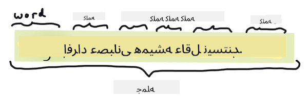
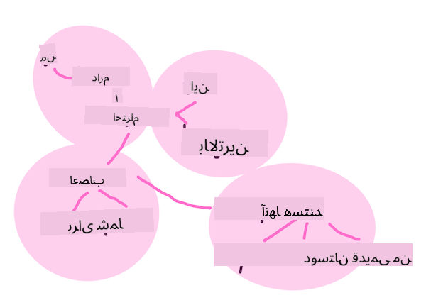
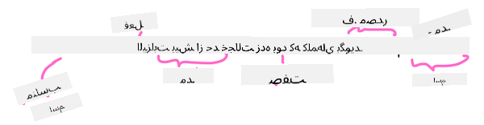

<!--
CO_OP_TRANSLATOR_METADATA:
{
  "original_hash": "6534e145d52a3890590d27be75386e5d",
  "translation_date": "2025-09-04T00:35:58+00:00",
  "source_file": "6-NLP/2-Tasks/README.md",
  "language_code": "fa"
}
-->
# وظایف و تکنیک‌های رایج پردازش زبان طبیعی

برای اکثر وظایف *پردازش زبان طبیعی*، متن مورد پردازش باید تجزیه شود، بررسی شود و نتایج ذخیره یا با قوانین و مجموعه داده‌ها مقایسه شوند. این وظایف به برنامه‌نویس اجازه می‌دهند تا _معنی_، _هدف_ یا فقط _تکرار_ اصطلاحات و کلمات در یک متن را استخراج کند.

## [آزمون پیش از درس](https://gray-sand-07a10f403.1.azurestaticapps.net/quiz/33/)

بیایید تکنیک‌های رایج مورد استفاده در پردازش متن را کشف کنیم. این تکنیک‌ها، همراه با یادگیری ماشین، به شما کمک می‌کنند تا حجم زیادی از متن را به صورت کارآمد تحلیل کنید. اما پیش از اعمال یادگیری ماشین به این وظایف، بیایید مشکلاتی که متخصصان NLP با آن مواجه می‌شوند را درک کنیم.

## وظایف رایج در NLP

راه‌های مختلفی برای تحلیل متنی که روی آن کار می‌کنید وجود دارد. وظایفی وجود دارند که می‌توانید انجام دهید و از طریق این وظایف قادر خواهید بود متن را درک کرده و نتیجه‌گیری کنید. معمولاً این وظایف را به صورت ترتیبی انجام می‌دهید.

### توکن‌سازی

احتمالاً اولین کاری که اکثر الگوریتم‌های NLP باید انجام دهند، تقسیم متن به توکن‌ها یا کلمات است. در حالی که این کار ساده به نظر می‌رسد، در نظر گرفتن نشانه‌گذاری و جداکننده‌های کلمات و جملات در زبان‌های مختلف می‌تواند آن را پیچیده کند. ممکن است نیاز باشد از روش‌های مختلفی برای تعیین مرزها استفاده کنید.


> توکن‌سازی یک جمله از **غرور و تعصب**. اینفوگرافیک توسط [Jen Looper](https://twitter.com/jenlooper)

### تعبیه‌ها

[تعبیه‌های کلمات](https://wikipedia.org/wiki/Word_embedding) روشی برای تبدیل داده‌های متنی به صورت عددی هستند. تعبیه‌ها به گونه‌ای انجام می‌شوند که کلماتی با معنای مشابه یا کلماتی که با هم استفاده می‌شوند، در کنار هم قرار گیرند.


> "من بیشترین احترام را برای اعصاب شما دارم، آنها دوستان قدیمی من هستند." - تعبیه کلمات برای یک جمله در **غرور و تعصب**. اینفوگرافیک توسط [Jen Looper](https://twitter.com/jenlooper)

✅ [این ابزار جالب](https://projector.tensorflow.org/) را امتحان کنید تا با تعبیه‌های کلمات آزمایش کنید. کلیک روی یک کلمه خوشه‌های کلمات مشابه را نشان می‌دهد: 'toy' با 'disney'، 'lego'، 'playstation' و 'console' خوشه‌بندی می‌شود.

### تجزیه و برچسب‌گذاری بخش‌های گفتار

هر کلمه‌ای که توکن‌سازی شده است می‌تواند به عنوان بخشی از گفتار برچسب‌گذاری شود - اسم، فعل یا صفت. جمله `the quick red fox jumped over the lazy brown dog` ممکن است به صورت POS برچسب‌گذاری شود: fox = اسم، jumped = فعل.



> تجزیه یک جمله از **غرور و تعصب**. اینفوگرافیک توسط [Jen Looper](https://twitter.com/jenlooper)

تجزیه به معنای شناسایی کلماتی است که در یک جمله به یکدیگر مرتبط هستند - برای مثال `the quick red fox jumped` یک توالی صفت-اسم-فعل است که از توالی `lazy brown dog` جدا است.

### فراوانی کلمات و عبارات

یک روش مفید هنگام تحلیل حجم زیادی از متن، ساخت یک دیکشنری از هر کلمه یا عبارت مورد علاقه و تعداد دفعاتی است که ظاهر می‌شود. عبارت `the quick red fox jumped over the lazy brown dog` دارای فراوانی کلمه 2 برای the است.

بیایید به یک متن نمونه نگاه کنیم که در آن فراوانی کلمات را شمارش می‌کنیم. شعر The Winners اثر Rudyard Kipling شامل این بیت است:

```output
What the moral? Who rides may read.
When the night is thick and the tracks are blind
A friend at a pinch is a friend, indeed,
But a fool to wait for the laggard behind.
Down to Gehenna or up to the Throne,
He travels the fastest who travels alone.
```

از آنجا که فراوانی عبارات می‌تواند حساس به حروف بزرگ و کوچک یا غیر حساس باشد، عبارت `a friend` دارای فراوانی 2 و `the` دارای فراوانی 6 و `travels` دارای فراوانی 2 است.

### N-grams

یک متن می‌تواند به توالی‌هایی از کلمات با طول مشخص تقسیم شود، یک کلمه (unigram)، دو کلمه (bigram)، سه کلمه (trigram) یا هر تعداد کلمه (n-gram).

برای مثال `the quick red fox jumped over the lazy brown dog` با امتیاز n-gram برابر 2، n-gram‌های زیر را تولید می‌کند:

1. the quick 
2. quick red 
3. red fox
4. fox jumped 
5. jumped over 
6. over the 
7. the lazy 
8. lazy brown 
9. brown dog

ممکن است تصور آن به صورت یک جعبه لغزنده روی جمله آسان‌تر باشد. اینجا برای n-gram‌های 3 کلمه‌ای است، n-gram در هر جمله به صورت برجسته نشان داده شده است:

1.   <u>**the quick red**</u> fox jumped over the lazy brown dog  
2.   the **<u>quick red fox</u>** jumped over the lazy brown dog  
3.   the quick **<u>red fox jumped</u>** over the lazy brown dog  
4.   the quick red **<u>fox jumped over</u>** the lazy brown dog  
5.   the quick red fox **<u>jumped over the</u>** lazy brown dog  
6.   the quick red fox jumped **<u>over the lazy</u>** brown dog  
7.   the quick red fox jumped over <u>**the lazy brown**</u> dog  
8.   the quick red fox jumped over the **<u>lazy brown dog</u>**


> مقدار N-gram برابر 3: اینفوگرافیک توسط [Jen Looper](https://twitter.com/jenlooper)

### استخراج عبارت اسمی

در اکثر جملات، یک اسم وجود دارد که موضوع یا مفعول جمله است. در زبان انگلیسی، اغلب قابل شناسایی است که قبل از آن 'a' یا 'an' یا 'the' آمده است. شناسایی موضوع یا مفعول جمله با 'استخراج عبارت اسمی' یک وظیفه رایج در NLP است که هنگام تلاش برای درک معنای جمله انجام می‌شود.

✅ در جمله "I cannot fix on the hour, or the spot, or the look or the words, which laid the foundation. It is too long ago. I was in the middle before I knew that I had begun." آیا می‌توانید عبارات اسمی را شناسایی کنید؟

در جمله `the quick red fox jumped over the lazy brown dog` دو عبارت اسمی وجود دارد: **quick red fox** و **lazy brown dog**.

### تحلیل احساسات

یک جمله یا متن می‌تواند برای احساسات تحلیل شود، یا اینکه چقدر *مثبت* یا *منفی* است. احساسات با *قطبیت* و *عینیت/ذهنیت* اندازه‌گیری می‌شوند. قطبیت از -1.0 تا 1.0 (منفی تا مثبت) و 0.0 تا 1.0 (بیشترین عینی تا بیشترین ذهنی) اندازه‌گیری می‌شود.

✅ بعداً یاد خواهید گرفت که روش‌های مختلفی برای تعیین احساسات با استفاده از یادگیری ماشین وجود دارد، اما یک روش این است که لیستی از کلمات و عبارات که توسط یک متخصص انسانی به عنوان مثبت یا منفی دسته‌بندی شده‌اند داشته باشید و آن مدل را به متن اعمال کنید تا امتیاز قطبیت را محاسبه کنید. آیا می‌توانید ببینید که این روش در برخی شرایط چگونه کار می‌کند و در برخی دیگر کمتر مؤثر است؟

### انعطاف

انعطاف به شما امکان می‌دهد یک کلمه را بگیرید و شکل مفرد یا جمع آن را به دست آورید.

### لماتیزاسیون

یک *لم* ریشه یا کلمه اصلی برای مجموعه‌ای از کلمات است، برای مثال *flew*، *flies*، *flying* دارای لم فعل *fly* هستند.

همچنین پایگاه‌های داده مفیدی برای محققان NLP وجود دارند، به ویژه:

### WordNet

[WordNet](https://wordnet.princeton.edu/) یک پایگاه داده از کلمات، مترادف‌ها، متضادها و جزئیات بسیاری دیگر برای هر کلمه در زبان‌های مختلف است. این پایگاه داده هنگام تلاش برای ساخت ترجمه‌ها، بررسی املا یا ابزارهای زبانی از هر نوع بسیار مفید است.

## کتابخانه‌های NLP

خوشبختانه، نیازی نیست که همه این تکنیک‌ها را خودتان بسازید، زیرا کتابخانه‌های عالی پایتون وجود دارند که این کار را برای توسعه‌دهندگانی که در پردازش زبان طبیعی یا یادگیری ماشین تخصص ندارند، بسیار قابل دسترس‌تر می‌کنند. درس‌های بعدی شامل مثال‌های بیشتری از این موارد هستند، اما در اینجا برخی مثال‌های مفید برای کمک به شما در وظیفه بعدی آورده شده است.

### تمرین - استفاده از کتابخانه `TextBlob`

بیایید از کتابخانه‌ای به نام TextBlob استفاده کنیم زیرا شامل API‌های مفیدی برای انجام این نوع وظایف است. TextBlob "بر شانه‌های غول‌های [NLTK](https://nltk.org) و [pattern](https://github.com/clips/pattern) ایستاده است و با هر دو به خوبی کار می‌کند." این کتابخانه مقدار قابل توجهی از یادگیری ماشین را در API خود دارد.

> توجه: یک [راهنمای شروع سریع](https://textblob.readthedocs.io/en/dev/quickstart.html#quickstart) مفید برای TextBlob موجود است که برای توسعه‌دهندگان باتجربه پایتون توصیه می‌شود.

هنگام تلاش برای شناسایی *عبارات اسمی*، TextBlob چندین گزینه از استخراج‌کننده‌ها برای یافتن عبارات اسمی ارائه می‌دهد.

1. به `ConllExtractor` نگاهی بیندازید.

    ```python
    from textblob import TextBlob
    from textblob.np_extractors import ConllExtractor
    # import and create a Conll extractor to use later 
    extractor = ConllExtractor()
    
    # later when you need a noun phrase extractor:
    user_input = input("> ")
    user_input_blob = TextBlob(user_input, np_extractor=extractor)  # note non-default extractor specified
    np = user_input_blob.noun_phrases                                    
    ```

    > اینجا چه اتفاقی می‌افتد؟ [ConllExtractor](https://textblob.readthedocs.io/en/dev/api_reference.html?highlight=Conll#textblob.en.np_extractors.ConllExtractor) یک "استخراج‌کننده عبارت اسمی است که از تجزیه تکه‌ای آموزش‌دیده با مجموعه داده آموزشی ConLL-2000 استفاده می‌کند." ConLL-2000 به کنفرانس سال 2000 در زمینه یادگیری محاسباتی زبان طبیعی اشاره دارد. هر سال این کنفرانس کارگاهی برای حل یک مشکل دشوار NLP برگزار می‌کرد و در سال 2000 موضوع آن تکه‌بندی اسم بود. یک مدل بر اساس روزنامه وال استریت آموزش داده شد، با "بخش‌های 15-18 به عنوان داده‌های آموزشی (211727 توکن) و بخش 20 به عنوان داده‌های آزمایشی (47377 توکن)". می‌توانید رویه‌های استفاده شده را [اینجا](https://www.clips.uantwerpen.be/conll2000/chunking/) و [نتایج](https://ifarm.nl/erikt/research/np-chunking.html) را مشاهده کنید.

### چالش - بهبود ربات خود با NLP

در درس قبلی یک ربات پرسش و پاسخ ساده ساختید. اکنون، ماروین را کمی همدل‌تر کنید با تحلیل ورودی شما برای احساسات و چاپ یک پاسخ متناسب با احساسات. همچنین باید یک `عبارت اسمی` شناسایی کنید و درباره آن سؤال کنید.

مراحل شما هنگام ساخت یک ربات مکالمه‌ای بهتر:

1. دستورالعمل‌هایی چاپ کنید که به کاربر نحوه تعامل با ربات را توضیح دهد  
2. حلقه را شروع کنید  
   1. ورودی کاربر را بپذیرید  
   2. اگر کاربر درخواست خروج کرد، خارج شوید  
   3. ورودی کاربر را پردازش کنید و پاسخ احساسی مناسب را تعیین کنید  
   4. اگر یک عبارت اسمی در احساسات شناسایی شد، آن را جمع کنید و درباره آن موضوع اطلاعات بیشتری بخواهید  
   5. پاسخ را چاپ کنید  
3. به مرحله 2 بازگردید  

در اینجا قطعه کدی برای تعیین احساسات با استفاده از TextBlob آورده شده است. توجه داشته باشید که فقط چهار *گرادیان* پاسخ احساسی وجود دارد (می‌توانید تعداد بیشتری اضافه کنید اگر بخواهید):

```python
if user_input_blob.polarity <= -0.5:
  response = "Oh dear, that sounds bad. "
elif user_input_blob.polarity <= 0:
  response = "Hmm, that's not great. "
elif user_input_blob.polarity <= 0.5:
  response = "Well, that sounds positive. "
elif user_input_blob.polarity <= 1:
  response = "Wow, that sounds great. "
```

در اینجا نمونه‌ای از خروجی برای راهنمایی شما آورده شده است (ورودی کاربر در خطوطی که با > شروع می‌شوند):

```output
Hello, I am Marvin, the friendly robot.
You can end this conversation at any time by typing 'bye'
After typing each answer, press 'enter'
How are you today?
> I am ok
Well, that sounds positive. Can you tell me more?
> I went for a walk and saw a lovely cat
Well, that sounds positive. Can you tell me more about lovely cats?
> cats are the best. But I also have a cool dog
Wow, that sounds great. Can you tell me more about cool dogs?
> I have an old hounddog but he is sick
Hmm, that's not great. Can you tell me more about old hounddogs?
> bye
It was nice talking to you, goodbye!
```

یک راه‌حل ممکن برای این وظیفه [اینجا](https://github.com/microsoft/ML-For-Beginners/blob/main/6-NLP/2-Tasks/solution/bot.py) موجود است.

✅ بررسی دانش

1. آیا فکر می‌کنید پاسخ‌های همدلانه می‌توانند کسی را فریب دهند که فکر کند ربات واقعاً او را درک کرده است؟  
2. آیا شناسایی عبارت اسمی ربات را "قابل باورتر" می‌کند؟  
3. چرا استخراج یک "عبارت اسمی" از یک جمله کار مفیدی است؟

---

ربات را در بررسی دانش قبلی پیاده‌سازی کنید و آن را روی یک دوست آزمایش کنید. آیا می‌تواند آنها را فریب دهد؟ آیا می‌توانید ربات خود را "قابل باورتر" کنید؟

## 🚀چالش

یکی از وظایف در بررسی دانش قبلی را انتخاب کنید و سعی کنید آن را پیاده‌سازی کنید. ربات را روی یک دوست آزمایش کنید. آیا می‌تواند آنها را فریب دهد؟ آیا می‌توانید ربات خود را "قابل باورتر" کنید؟

## [آزمون پس از درس](https://gray-sand-07a10f403.1.azurestaticapps.net/quiz/34/)

## مرور و مطالعه شخصی

در درس‌های بعدی بیشتر درباره تحلیل احساسات یاد خواهید گرفت. این تکنیک جالب را در مقالاتی مانند این‌ها در [KDNuggets](https://www.kdnuggets.com/tag/nlp) بررسی کنید.

## تکلیف

[ربات را به صحبت وادارید](assignment.md)

---

**سلب مسئولیت**:  
این سند با استفاده از سرویس ترجمه هوش مصنوعی [Co-op Translator](https://github.com/Azure/co-op-translator) ترجمه شده است. در حالی که ما برای دقت تلاش می‌کنیم، لطفاً توجه داشته باشید که ترجمه‌های خودکار ممکن است شامل خطاها یا نادرستی‌هایی باشند. سند اصلی به زبان اصلی آن باید به عنوان منبع معتبر در نظر گرفته شود. برای اطلاعات حساس، ترجمه حرفه‌ای انسانی توصیه می‌شود. ما هیچ مسئولیتی در قبال سوءتفاهم‌ها یا تفسیرهای نادرست ناشی از استفاده از این ترجمه نداریم.