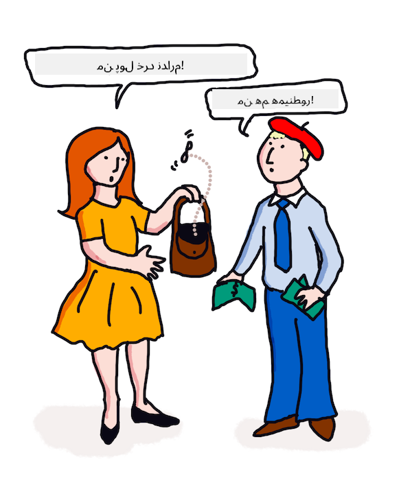

<!--
CO_OP_TRANSLATOR_METADATA:
{
  "original_hash": "6396d5d8617572cd2ac1de74fb0deb22",
  "translation_date": "2025-09-04T00:52:20+00:00",
  "source_file": "6-NLP/3-Translation-Sentiment/README.md",
  "language_code": "fa"
}
-->
# ترجمه و تحلیل احساسات با یادگیری ماشین

در درس‌های قبلی یاد گرفتید که چگونه یک ربات ساده با استفاده از `TextBlob` بسازید، کتابخانه‌ای که یادگیری ماشین را در پشت صحنه برای انجام وظایف پایه‌ای پردازش زبان طبیعی مانند استخراج عبارات اسمی به کار می‌گیرد. یکی دیگر از چالش‌های مهم در زبان‌شناسی محاسباتی، ترجمه دقیق یک جمله از یک زبان گفتاری یا نوشتاری به زبان دیگر است.

## [آزمون پیش از درس](https://gray-sand-07a10f403.1.azurestaticapps.net/quiz/35/)

ترجمه یکی از مشکلات بسیار دشوار است که با وجود هزاران زبان و قوانین گرامری بسیار متفاوت هر زبان پیچیده‌تر می‌شود. یک رویکرد این است که قوانین گرامری رسمی یک زبان، مانند انگلیسی، به یک ساختار مستقل از زبان تبدیل شود و سپس با تبدیل آن به زبان دیگر ترجمه شود. این رویکرد شامل مراحل زیر است:

1. **شناسایی**. شناسایی یا برچسب‌گذاری کلمات در زبان ورودی به عنوان اسم، فعل و غیره.
2. **ایجاد ترجمه**. تولید ترجمه مستقیم هر کلمه در قالب زبان مقصد.

### مثال جمله، از انگلیسی به ایرلندی

در زبان 'انگلیسی'، جمله _I feel happy_ شامل سه کلمه به ترتیب زیر است:

- **فاعل** (I)
- **فعل** (feel)
- **صفت** (happy)

اما در زبان 'ایرلندی'، همین جمله ساختار گرامری بسیار متفاوتی دارد - احساساتی مانند "*خوشحال*" یا "*ناراحت*" به صورت *بر روی شما* بیان می‌شوند.

عبارت انگلیسی `I feel happy` در ایرلندی به صورت `Tá athas orm` ترجمه می‌شود. یک ترجمه *لفظی* آن می‌شود `Happy is upon me`.

یک گوینده ایرلندی که به انگلیسی ترجمه می‌کند، می‌گوید `I feel happy`، نه `Happy is upon me`، زیرا او معنای جمله را درک می‌کند، حتی اگر کلمات و ساختار جمله متفاوت باشند.

ترتیب رسمی جمله در ایرلندی به این صورت است:

- **فعل** (Tá یا is)
- **صفت** (athas، یا happy)
- **فاعل** (orm، یا upon me)

## ترجمه

یک برنامه ترجمه ساده ممکن است فقط کلمات را ترجمه کند و ساختار جمله را نادیده بگیرد.

✅ اگر به عنوان یک بزرگسال زبان دوم (یا سوم یا بیشتر) یاد گرفته باشید، ممکن است ابتدا با فکر کردن به زبان مادری خود شروع کرده باشید، یک مفهوم را کلمه به کلمه در ذهن خود به زبان دوم ترجمه کرده و سپس ترجمه خود را بیان کرده باشید. این شبیه به کاری است که برنامه‌های ساده ترجمه کامپیوتری انجام می‌دهند. برای رسیدن به تسلط، عبور از این مرحله بسیار مهم است!

ترجمه ساده منجر به ترجمه‌های بد (و گاهی خنده‌دار) می‌شود: `I feel happy` به صورت لفظی به `Mise bhraitheann athas` در ایرلندی ترجمه می‌شود. این به معنای (لفظی) `me feel happy` است و یک جمله معتبر در ایرلندی نیست. حتی با وجود اینکه انگلیسی و ایرلندی زبان‌هایی هستند که در دو جزیره نزدیک به هم صحبت می‌شوند، آن‌ها زبان‌هایی بسیار متفاوت با ساختارهای گرامری مختلف هستند.

> می‌توانید برخی ویدیوها درباره سنت‌های زبانی ایرلندی مانند [این ویدیو](https://www.youtube.com/watch?v=mRIaLSdRMMs) را تماشا کنید.

### رویکردهای یادگیری ماشین

تا اینجا، درباره رویکرد قوانین رسمی در پردازش زبان طبیعی یاد گرفتید. یک رویکرد دیگر این است که معنای کلمات را نادیده بگیرید و _به جای آن از یادگیری ماشین برای شناسایی الگوها استفاده کنید_. این روش در ترجمه زمانی کار می‌کند که متن‌های زیادی (یک *corpus*) یا متن‌هایی (*corpora*) در هر دو زبان مبدا و مقصد داشته باشید.

برای مثال، رمان *غرور و تعصب*، یک رمان معروف انگلیسی نوشته جین آستن در سال 1813 را در نظر بگیرید. اگر کتاب را به زبان انگلیسی و ترجمه انسانی آن به زبان *فرانسوی* بررسی کنید، می‌توانید عباراتی را شناسایی کنید که به صورت *اصطلاحی* به زبان دیگر ترجمه شده‌اند. شما این کار را به زودی انجام خواهید داد.

برای مثال، وقتی عبارتی انگلیسی مانند `I have no money` به صورت لفظی به فرانسوی ترجمه می‌شود، ممکن است به `Je n'ai pas de monnaie` تبدیل شود. "Monnaie" یک 'هم‌آوای کاذب' فرانسوی است، زیرا 'money' و 'monnaie' مترادف نیستند. یک ترجمه بهتر که یک انسان ممکن است انجام دهد، `Je n'ai pas d'argent` است، زیرا بهتر بیان می‌کند که شما پول ندارید (نه 'خرده پول' که معنای 'monnaie' است).



> تصویر از [Jen Looper](https://twitter.com/jenlooper)

اگر یک مدل یادگیری ماشین ترجمه‌های انسانی کافی برای ساخت یک مدل داشته باشد، می‌تواند دقت ترجمه‌ها را با شناسایی الگوهای رایج در متن‌هایی که قبلاً توسط گویندگان انسانی متخصص هر دو زبان ترجمه شده‌اند، بهبود بخشد.

### تمرین - ترجمه

می‌توانید از `TextBlob` برای ترجمه جملات استفاده کنید. جمله معروف آغازین **غرور و تعصب** را امتحان کنید:

```python
from textblob import TextBlob

blob = TextBlob(
    "It is a truth universally acknowledged, that a single man in possession of a good fortune, must be in want of a wife!"
)
print(blob.translate(to="fr"))

```

`TextBlob` ترجمه بسیار خوبی ارائه می‌دهد: "C'est une vérité universellement reconnue, qu'un homme célibataire en possession d'une bonne fortune doit avoir besoin d'une femme!".

می‌توان گفت که ترجمه TextBlob در واقع بسیار دقیق‌تر از ترجمه فرانسوی کتاب در سال 1932 توسط V. Leconte و Ch. Pressoir است:

"C'est une vérité universelle qu'un célibataire pourvu d'une belle fortune doit avoir envie de se marier, et, si peu que l'on sache de son sentiment à cet egard, lorsqu'il arrive dans une nouvelle résidence, cette idée est si bien fixée dans l'esprit de ses voisins qu'ils le considèrent sur-le-champ comme la propriété légitime de l'une ou l'autre de leurs filles."

در این مورد، ترجمه‌ای که با یادگیری ماشین انجام شده است، بهتر از مترجم انسانی عمل کرده است که به طور غیرضروری کلماتی را برای 'وضوح' به متن اصلی اضافه کرده است.

> اینجا چه اتفاقی می‌افتد؟ و چرا TextBlob در ترجمه اینقدر خوب است؟ خب، در پشت صحنه، از Google Translate استفاده می‌کند، یک هوش مصنوعی پیشرفته که قادر است میلیون‌ها عبارت را تحلیل کند تا بهترین رشته‌ها را برای کار مورد نظر پیش‌بینی کند. هیچ چیز دستی در اینجا انجام نمی‌شود و برای استفاده از `blob.translate` به اتصال اینترنت نیاز دارید.

✅ جملات بیشتری را امتحان کنید. کدام بهتر است، ترجمه با یادگیری ماشین یا ترجمه انسانی؟ در چه مواردی؟

## تحلیل احساسات

یکی دیگر از حوزه‌هایی که یادگیری ماشین می‌تواند بسیار خوب عمل کند، تحلیل احساسات است. یک رویکرد غیر یادگیری ماشینی برای تحلیل احساسات این است که کلمات و عبارات 'مثبت' و 'منفی' را شناسایی کنید. سپس، با توجه به یک متن جدید، ارزش کلی کلمات مثبت، منفی و خنثی را محاسبه کنید تا احساس کلی را شناسایی کنید.

این رویکرد به راحتی فریب می‌خورد، همانطور که ممکن است در وظیفه ماروین دیده باشید - جمله `Great, that was a wonderful waste of time, I'm glad we are lost on this dark road` یک جمله با احساس منفی و طنزآمیز است، اما الگوریتم ساده کلماتی مانند 'great'، 'wonderful'، 'glad' را به عنوان مثبت و 'waste'، 'lost' و 'dark' را به عنوان منفی شناسایی می‌کند. احساس کلی تحت تأثیر این کلمات متناقض قرار می‌گیرد.

✅ یک لحظه مکث کنید و به این فکر کنید که چگونه به عنوان گویندگان انسانی طنز را منتقل می‌کنیم. لحن صدا نقش بزرگی ایفا می‌کند. سعی کنید جمله "Well, that film was awesome" را به روش‌های مختلف بیان کنید تا کشف کنید که چگونه صدای شما معنا را منتقل می‌کند.

### رویکردهای یادگیری ماشین

رویکرد یادگیری ماشین این است که به صورت دستی متن‌های مثبت و منفی - توییت‌ها، نقدهای فیلم یا هر چیزی که در آن انسان امتیاز و نظر نوشته شده‌ای داده است - جمع‌آوری کنید. سپس تکنیک‌های پردازش زبان طبیعی می‌توانند بر روی نظرات و امتیازات اعمال شوند، به طوری که الگوهایی ظاهر شوند (مثلاً نقدهای مثبت فیلم بیشتر از عبارت 'Oscar worthy' استفاده می‌کنند تا نقدهای منفی، یا نقدهای مثبت رستوران بیشتر از 'gourmet' استفاده می‌کنند تا 'disgusting').

> ⚖️ **مثال**: اگر در دفتر یک سیاستمدار کار می‌کردید و قانونی جدید در حال بحث بود، ممکن است مردم ایمیل‌هایی در حمایت یا مخالفت با قانون جدید به دفتر ارسال کنند. فرض کنید وظیفه شما خواندن ایمیل‌ها و دسته‌بندی آن‌ها به دو گروه *موافق* و *مخالف* باشد. اگر تعداد ایمیل‌ها زیاد باشد، ممکن است از خواندن همه آن‌ها خسته شوید. آیا خوب نبود اگر یک ربات می‌توانست همه آن‌ها را برای شما بخواند، آن‌ها را درک کند و بگوید هر ایمیل به کدام دسته تعلق دارد؟
> 
> یک راه برای دستیابی به این هدف استفاده از یادگیری ماشین است. شما مدل را با بخشی از ایمیل‌های *مخالف* و بخشی از ایمیل‌های *موافق* آموزش می‌دهید. مدل تمایل دارد عبارات و کلمات را با طرف مخالف یا موافق مرتبط کند، *اما هیچ‌کدام از محتوا را درک نمی‌کند*، فقط اینکه کلمات و الگوهای خاصی بیشتر در ایمیل‌های مخالف یا موافق ظاهر می‌شوند. شما می‌توانید آن را با برخی ایمیل‌هایی که برای آموزش مدل استفاده نکرده‌اید آزمایش کنید و ببینید آیا به همان نتیجه‌ای که شما می‌رسید، می‌رسد یا خیر. سپس، وقتی از دقت مدل راضی بودید، می‌توانید ایمیل‌های آینده را بدون نیاز به خواندن هر یک پردازش کنید.

✅ آیا این فرآیند شبیه فرآیندهایی است که در درس‌های قبلی استفاده کرده‌اید؟

## تمرین - جملات احساسی

احساسات با *قطبیت* از -1 تا 1 اندازه‌گیری می‌شود، به این معنی که -1 منفی‌ترین احساس و 1 مثبت‌ترین احساس است. احساسات همچنین با امتیاز 0 تا 1 برای عینیت (0) و ذهنیت (1) اندازه‌گیری می‌شود.

یک بار دیگر به *غرور و تعصب* جین آستن نگاه کنید. متن این کتاب در اینجا در [پروژه گوتنبرگ](https://www.gutenberg.org/files/1342/1342-h/1342-h.htm) موجود است. نمونه زیر یک برنامه کوتاه را نشان می‌دهد که احساسات اولین و آخرین جملات کتاب را تحلیل کرده و قطبیت احساسات و امتیاز عینیت/ذهنیت آن را نمایش می‌دهد.

شما باید از کتابخانه `TextBlob` (که در بالا توضیح داده شد) برای تعیین `sentiment` استفاده کنید (لازم نیست ماشین حساب احساسات خود را بنویسید) در وظیفه زیر.

```python
from textblob import TextBlob

quote1 = """It is a truth universally acknowledged, that a single man in possession of a good fortune, must be in want of a wife."""

quote2 = """Darcy, as well as Elizabeth, really loved them; and they were both ever sensible of the warmest gratitude towards the persons who, by bringing her into Derbyshire, had been the means of uniting them."""

sentiment1 = TextBlob(quote1).sentiment
sentiment2 = TextBlob(quote2).sentiment

print(quote1 + " has a sentiment of " + str(sentiment1))
print(quote2 + " has a sentiment of " + str(sentiment2))
```

خروجی زیر را مشاهده می‌کنید:

```output
It is a truth universally acknowledged, that a single man in possession of a good fortune, must be in want # of a wife. has a sentiment of Sentiment(polarity=0.20952380952380953, subjectivity=0.27142857142857146)

Darcy, as well as Elizabeth, really loved them; and they were
     both ever sensible of the warmest gratitude towards the persons
      who, by bringing her into Derbyshire, had been the means of
      uniting them. has a sentiment of Sentiment(polarity=0.7, subjectivity=0.8)
```

## چالش - بررسی قطبیت احساسات

وظیفه شما این است که با استفاده از قطبیت احساسات، تعیین کنید که آیا *غرور و تعصب* جملات کاملاً مثبت بیشتری نسبت به جملات کاملاً منفی دارد یا خیر. برای این وظیفه، می‌توانید فرض کنید که امتیاز قطبیت 1 یا -1 به ترتیب کاملاً مثبت یا منفی است.

**مراحل:**

1. یک [نسخه‌ای از غرور و تعصب](https://www.gutenberg.org/files/1342/1342-h/1342-h.htm) را از پروژه گوتنبرگ به صورت فایل .txt دانلود کنید. متادیتا را از ابتدای و انتهای فایل حذف کنید و فقط متن اصلی را باقی بگذارید.
2. فایل را در پایتون باز کنید و محتویات آن را به صورت رشته استخراج کنید.
3. یک TextBlob با استفاده از رشته کتاب ایجاد کنید.
4. هر جمله در کتاب را در یک حلقه تحلیل کنید.
   1. اگر قطبیت 1 یا -1 بود، جمله را در یک آرایه یا لیست از پیام‌های مثبت یا منفی ذخیره کنید.
5. در پایان، تمام جملات مثبت و منفی (به صورت جداگانه) و تعداد هر کدام را چاپ کنید.

در اینجا یک [راه‌حل نمونه](https://github.com/microsoft/ML-For-Beginners/blob/main/6-NLP/3-Translation-Sentiment/solution/notebook.ipynb) آورده شده است.

✅ بررسی دانش

1. احساسات بر اساس کلماتی که در جمله استفاده شده‌اند است، اما آیا کد *کلمات را درک می‌کند*؟
2. آیا فکر می‌کنید قطبیت احساسات دقیق است، یا به عبارت دیگر، آیا با امتیازات موافق هستید؟
   1. به طور خاص، آیا با قطبیت **کاملاً مثبت** جملات زیر موافق یا مخالف هستید؟
      * “What an excellent father you have, girls!” said she, when the door was shut.
      * “Your examination of Mr. Darcy is over, I presume,” said Miss Bingley; “and pray what is the result?” “I am perfectly convinced by it that Mr. Darcy has no defect.
      * How wonderfully these sort of things occur!
      * I have the greatest dislike in the world to that sort of thing.
      * Charlotte is an excellent manager, I dare say.
      * “This is delightful indeed!
      * I am so happy!
      * Your idea of the ponies is delightful.
   2. سه جمله بعدی با قطبیت کاملاً مثبت امتیازدهی شده‌اند، اما با خواندن دقیق، آن‌ها جملات مثبتی نیستند. چرا تحلیل احساسات فکر کرده که این جملات مثبت هستند؟
      * Happy shall I be, when his stay at Netherfield is over!” “I wish I could say anything to comfort you,” replied Elizabeth; “but it is wholly out of my power.
      * If I could but see you as happy!
      * Our distress, my dear Lizzy, is very great.
   3. آیا با قطبیت **کاملاً منفی** جملات زیر موافق یا مخالف هستید؟
      - Everybody is disgusted with his pride.
      - “I should like to know how he behaves among strangers.” “You shall hear then—but prepare yourself for something very dreadful.
      - The pause was to Elizabeth’s feelings dreadful.
      - It would be dreadful!

✅ هر علاقه‌مند به جین آستن می‌داند که او اغلب از کتاب‌هایش برای نقد جنبه‌های مضحک جامعه انگلستان در دوران ریجنسی استفاده می‌کند. الیزابت بنت، شخصیت اصلی در *غرور و تعصب*، یک ناظر اجتماعی تیزبین است (مانند نویسنده) و زبان او اغلب به شدت دارای ظرافت است. حتی آقای دارسی (علاقه‌مند عاشقانه داستان) به استفاده بازیگوشانه و طعنه‌آمیز الیزابت از زبان اشاره می‌کند: "من به اندازه کافی از آشنایی با شما لذت برده‌ام تا بدانم که شما از ابراز نظراتی که در واقع نظرات خودتان نیستند، لذت زیادی می‌برید."

---

## 🚀چالش

آیا می‌توانید ماروین را با استخراج ویژگی‌های دیگر از ورودی کاربر بهتر کنید؟

## [آزمون پس از درس](https://gray-sand-07a10f403.1.azurestaticapps.net/quiz/36/)

## مرور و مطالعه شخصی
راه‌های زیادی برای استخراج احساسات از متن وجود دارد. به کاربردهای تجاری فکر کنید که ممکن است از این تکنیک استفاده کنند. به این فکر کنید که چگونه ممکن است این روش به اشتباه بیفتد. درباره سیستم‌های پیشرفته و آماده برای سازمان‌ها که احساسات را تحلیل می‌کنند، مانند [Azure Text Analysis](https://docs.microsoft.com/azure/cognitive-services/Text-Analytics/how-tos/text-analytics-how-to-sentiment-analysis?tabs=version-3-1?WT.mc_id=academic-77952-leestott) بیشتر بخوانید. برخی از جملات کتاب «غرور و تعصب» را که در بالا آمده‌اند آزمایش کنید و ببینید آیا می‌تواند ظرافت‌های موجود در آنها را تشخیص دهد.

## تکلیف

[مجوز شاعرانه](assignment.md)

---

**سلب مسئولیت**:  
این سند با استفاده از سرویس ترجمه هوش مصنوعی [Co-op Translator](https://github.com/Azure/co-op-translator) ترجمه شده است. در حالی که ما برای دقت تلاش می‌کنیم، لطفاً توجه داشته باشید که ترجمه‌های خودکار ممکن است شامل خطاها یا نادقتی‌هایی باشند. سند اصلی به زبان اصلی آن باید به عنوان منبع معتبر در نظر گرفته شود. برای اطلاعات حساس، ترجمه حرفه‌ای انسانی توصیه می‌شود. ما هیچ مسئولیتی در قبال سوءتفاهم‌ها یا تفسیرهای نادرست ناشی از استفاده از این ترجمه نداریم.