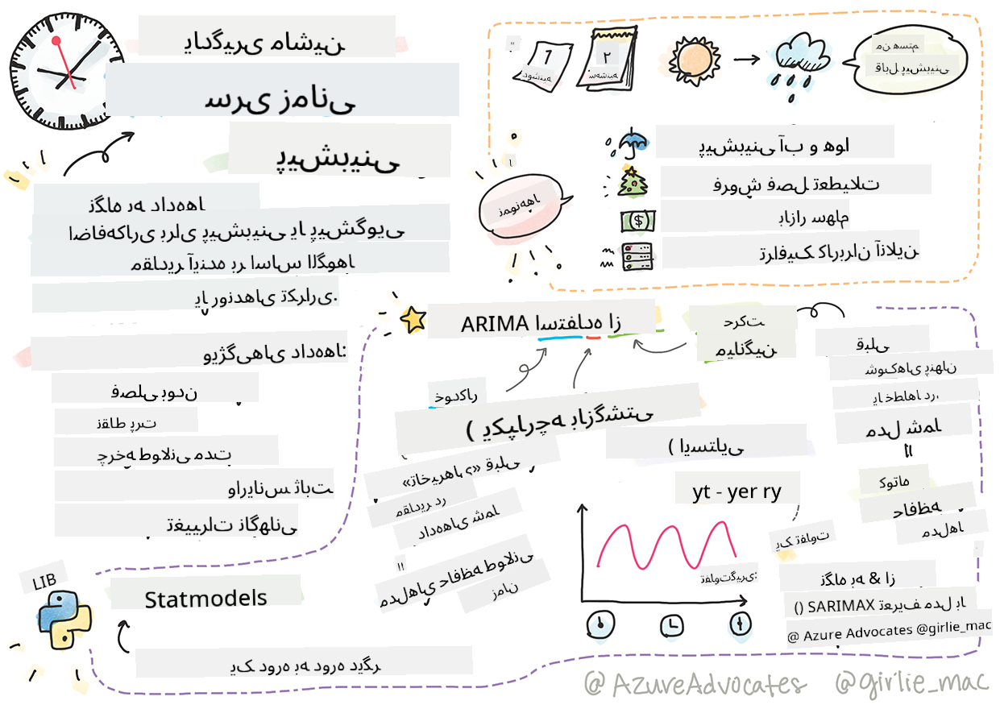
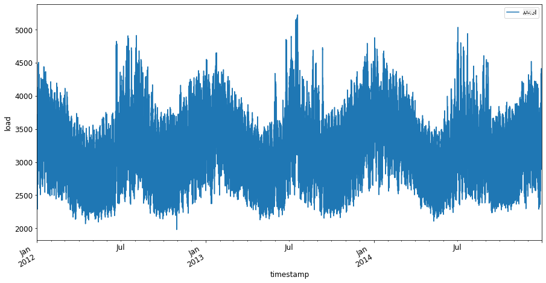
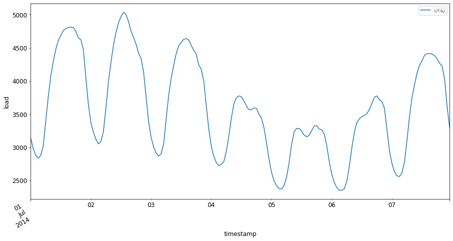

<!--
CO_OP_TRANSLATOR_METADATA:
{
  "original_hash": "3150d40f36a77857316ecaed5f31e856",
  "translation_date": "2025-09-03T22:49:29+00:00",
  "source_file": "7-TimeSeries/1-Introduction/README.md",
  "language_code": "fa"
}
-->
# مقدمه‌ای بر پیش‌بینی سری‌های زمانی



> اسکچ‌نوت توسط [Tomomi Imura](https://www.twitter.com/girlie_mac)

در این درس و درس بعدی، شما کمی درباره پیش‌بینی سری‌های زمانی یاد خواهید گرفت، بخشی جالب و ارزشمند از مهارت‌های یک دانشمند یادگیری ماشین که کمتر شناخته شده است نسبت به سایر موضوعات. پیش‌بینی سری‌های زمانی مانند یک "گوی کریستالی" است: بر اساس عملکرد گذشته یک متغیر مانند قیمت، می‌توانید ارزش بالقوه آینده آن را پیش‌بینی کنید.

[](https://youtu.be/cBojo1hsHiI "مقدمه‌ای بر پیش‌بینی سری‌های زمانی")

> 🎥 برای مشاهده ویدئویی درباره پیش‌بینی سری‌های زمانی روی تصویر بالا کلیک کنید

## [آزمون پیش از درس](https://gray-sand-07a10f403.1.azurestaticapps.net/quiz/41/)

این حوزه‌ای مفید و جالب است که ارزش واقعی برای کسب‌وکار دارد، با توجه به کاربرد مستقیم آن در مسائل قیمت‌گذاری، موجودی و زنجیره تأمین. در حالی که تکنیک‌های یادگیری عمیق شروع به استفاده برای کسب بینش‌های بیشتر جهت پیش‌بینی بهتر عملکرد آینده کرده‌اند، پیش‌بینی سری‌های زمانی همچنان حوزه‌ای است که به شدت تحت تأثیر تکنیک‌های کلاسیک یادگیری ماشین قرار دارد.

> برنامه درسی مفید سری‌های زمانی دانشگاه Penn State را می‌توانید [اینجا](https://online.stat.psu.edu/stat510/lesson/1) پیدا کنید

## مقدمه

فرض کنید شما مجموعه‌ای از پارکومترهای هوشمند را مدیریت می‌کنید که داده‌هایی درباره میزان استفاده و مدت زمان استفاده در طول زمان ارائه می‌دهند.

> اگر بتوانید بر اساس عملکرد گذشته پارکومتر، ارزش آینده آن را طبق قوانین عرضه و تقاضا پیش‌بینی کنید، چه می‌شود؟

پیش‌بینی دقیق زمان اقدام برای دستیابی به هدف شما چالشی است که می‌توان با پیش‌بینی سری‌های زمانی به آن پرداخت. ممکن است مردم خوشحال نشوند که در زمان‌های شلوغ هزینه بیشتری برای پیدا کردن جای پارک پرداخت کنند، اما این راهی مطمئن برای کسب درآمد جهت تمیز کردن خیابان‌ها خواهد بود!

بیایید برخی از انواع الگوریتم‌های سری‌های زمانی را بررسی کنیم و یک دفترچه یادداشت برای پاک‌سازی و آماده‌سازی داده‌ها شروع کنیم. داده‌هایی که تحلیل خواهید کرد از مسابقه پیش‌بینی GEFCom2014 گرفته شده است. این داده‌ها شامل ۳ سال بار الکتریکی ساعتی و مقادیر دمایی بین سال‌های ۲۰۱۲ تا ۲۰۱۴ است. با توجه به الگوهای تاریخی بار الکتریکی و دما، می‌توانید مقادیر آینده بار الکتریکی را پیش‌بینی کنید.

در این مثال، شما یاد خواهید گرفت که چگونه یک گام زمانی را پیش‌بینی کنید، فقط با استفاده از داده‌های بار تاریخی. با این حال، قبل از شروع، مفید است که بفهمید پشت صحنه چه اتفاقی می‌افتد.

## برخی تعاریف

هنگام مواجهه با اصطلاح "سری‌های زمانی"، باید استفاده آن را در چندین زمینه مختلف درک کنید.

🎓 **سری‌های زمانی**

در ریاضیات، "سری‌های زمانی مجموعه‌ای از نقاط داده است که به ترتیب زمانی فهرست شده یا رسم شده‌اند. معمولاً، سری‌های زمانی دنباله‌ای است که در نقاط متوالی و با فاصله‌های مساوی در زمان گرفته شده است." نمونه‌ای از سری‌های زمانی، مقدار بسته شدن روزانه [شاخص صنعتی داو جونز](https://wikipedia.org/wiki/Time_series) است. استفاده از نمودارهای سری‌های زمانی و مدل‌سازی آماری اغلب در پردازش سیگنال، پیش‌بینی آب‌وهوا، پیش‌بینی زلزله و سایر زمینه‌هایی که رویدادها رخ می‌دهند و نقاط داده می‌توانند در طول زمان رسم شوند، مشاهده می‌شود.

🎓 **تحلیل سری‌های زمانی**

تحلیل سری‌های زمانی، تحلیل داده‌های سری‌های زمانی ذکر شده در بالا است. داده‌های سری‌های زمانی می‌توانند اشکال مختلفی داشته باشند، از جمله "سری‌های زمانی متوقف شده" که الگوها را در تکامل سری‌های زمانی قبل و بعد از یک رویداد متوقف‌کننده تشخیص می‌دهد. نوع تحلیل مورد نیاز برای سری‌های زمانی، به ماهیت داده‌ها بستگی دارد. خود داده‌های سری‌های زمانی می‌توانند به صورت مجموعه‌ای از اعداد یا کاراکترها باشند.

تحلیلی که باید انجام شود، از روش‌های مختلفی استفاده می‌کند، از جمله حوزه فرکانس و حوزه زمان، خطی و غیرخطی، و موارد دیگر. [بیشتر بیاموزید](https://www.itl.nist.gov/div898/handbook/pmc/section4/pmc4.htm) درباره روش‌های مختلف تحلیل این نوع داده‌ها.

🎓 **پیش‌بینی سری‌های زمانی**

پیش‌بینی سری‌های زمانی استفاده از یک مدل برای پیش‌بینی مقادیر آینده بر اساس الگوهایی است که توسط داده‌های جمع‌آوری شده قبلی به عنوان گذشته رخ داده است. در حالی که امکان استفاده از مدل‌های رگرسیون برای بررسی داده‌های سری‌های زمانی وجود دارد، با شاخص‌های زمانی به عنوان متغیرهای x در یک نمودار، چنین داده‌هایی بهتر است با استفاده از انواع خاصی از مدل‌ها تحلیل شوند.

داده‌های سری‌های زمانی لیستی از مشاهدات مرتب شده است، برخلاف داده‌هایی که می‌توانند با رگرسیون خطی تحلیل شوند. رایج‌ترین مدل ARIMA است، که مخفف "میانگین متحرک یکپارچه خودبازگشتی" است.

[مدل‌های ARIMA](https://online.stat.psu.edu/stat510/lesson/1/1.1) "ارزش فعلی یک سری را به مقادیر گذشته و خطاهای پیش‌بینی گذشته مرتبط می‌کنند." این مدل‌ها برای تحلیل داده‌های حوزه زمان، که داده‌ها به ترتیب زمانی مرتب شده‌اند، مناسب‌ترین هستند.

> انواع مختلفی از مدل‌های ARIMA وجود دارد که می‌توانید درباره آن‌ها [اینجا](https://people.duke.edu/~rnau/411arim.htm) یاد بگیرید و در درس بعدی به آن‌ها پرداخته خواهد شد.

در درس بعدی، شما یک مدل ARIMA با استفاده از [سری‌های زمانی تک‌متغیره](https://itl.nist.gov/div898/handbook/pmc/section4/pmc44.htm) خواهید ساخت، که بر یک متغیر تمرکز دارد که ارزش آن در طول زمان تغییر می‌کند. نمونه‌ای از این نوع داده‌ها [این مجموعه داده](https://itl.nist.gov/div898/handbook/pmc/section4/pmc4411.htm) است که غلظت ماهانه CO2 را در رصدخانه Mauna Loa ثبت می‌کند:

|  CO2   | YearMonth | Year  | Month |
| :----: | :-------: | :---: | :---: |
| 330.62 |  1975.04  | 1975  |   1   |
| 331.40 |  1975.13  | 1975  |   2   |
| 331.87 |  1975.21  | 1975  |   3   |
| 333.18 |  1975.29  | 1975  |   4   |
| 333.92 |  1975.38  | 1975  |   5   |
| 333.43 |  1975.46  | 1975  |   6   |
| 331.85 |  1975.54  | 1975  |   7   |
| 330.01 |  1975.63  | 1975  |   8   |
| 328.51 |  1975.71  | 1975  |   9   |
| 328.41 |  1975.79  | 1975  |  10   |
| 329.25 |  1975.88  | 1975  |  11   |
| 330.97 |  1975.96  | 1975  |  12   |

✅ متغیری که در این مجموعه داده در طول زمان تغییر می‌کند را شناسایی کنید

## ویژگی‌های داده‌های سری‌های زمانی که باید در نظر گرفت

هنگام مشاهده داده‌های سری‌های زمانی، ممکن است متوجه شوید که این داده‌ها [ویژگی‌های خاصی](https://online.stat.psu.edu/stat510/lesson/1/1.1) دارند که باید برای درک بهتر الگوهای آن‌ها در نظر گرفته و کاهش دهید. اگر داده‌های سری‌های زمانی را به عنوان ارائه‌دهنده یک "سیگنال" که می‌خواهید تحلیل کنید در نظر بگیرید، این ویژگی‌ها می‌توانند به عنوان "نویز" تلقی شوند. اغلب نیاز دارید این "نویز" را با جبران برخی از این ویژگی‌ها با استفاده از تکنیک‌های آماری کاهش دهید.

در اینجا برخی مفاهیم که باید بدانید تا بتوانید با سری‌های زمانی کار کنید آورده شده است:

🎓 **روندها**

روندها به عنوان افزایش‌ها و کاهش‌های قابل اندازه‌گیری در طول زمان تعریف می‌شوند. [بیشتر بخوانید](https://machinelearningmastery.com/time-series-trends-in-python). در زمینه سری‌های زمانی، این موضوع درباره نحوه استفاده و، در صورت لزوم، حذف روندها از سری‌های زمانی است.

🎓 **[فصلی بودن](https://machinelearningmastery.com/time-series-seasonality-with-python/)**

فصلی بودن به عنوان نوسانات دوره‌ای تعریف می‌شود، مانند شلوغی‌های تعطیلات که ممکن است بر فروش تأثیر بگذارد، به عنوان مثال. [نگاهی بیندازید](https://itl.nist.gov/div898/handbook/pmc/section4/pmc443.htm) به نحوه نمایش فصلی بودن در داده‌ها با انواع مختلف نمودارها.

🎓 **نقاط پرت**

نقاط پرت از واریانس استاندارد داده‌ها فاصله زیادی دارند.

🎓 **چرخه بلندمدت**

مستقل از فصلی بودن، داده‌ها ممکن است چرخه بلندمدتی مانند رکود اقتصادی که بیش از یک سال طول می‌کشد را نمایش دهند.

🎓 **واریانس ثابت**

در طول زمان، برخی داده‌ها نوسانات ثابتی را نمایش می‌دهند، مانند مصرف انرژی در طول روز و شب.

🎓 **تغییرات ناگهانی**

داده‌ها ممکن است تغییر ناگهانی را نمایش دهند که نیاز به تحلیل بیشتری دارد. به عنوان مثال، تعطیلی ناگهانی کسب‌وکارها به دلیل COVID باعث تغییراتی در داده‌ها شد.

✅ اینجا یک [نمودار نمونه سری‌های زمانی](https://www.kaggle.com/kashnitsky/topic-9-part-1-time-series-analysis-in-python) وجود دارد که هزینه روزانه ارز درون بازی را در طول چند سال نشان می‌دهد. آیا می‌توانید هر یک از ویژگی‌های ذکر شده در بالا را در این داده‌ها شناسایی کنید؟


## تمرین - شروع با داده‌های مصرف برق

بیایید شروع کنیم به ایجاد یک مدل سری‌های زمانی برای پیش‌بینی مصرف برق آینده با توجه به مصرف گذشته.

> داده‌های این مثال از مسابقه پیش‌بینی GEFCom2014 گرفته شده است. این داده‌ها شامل ۳ سال بار الکتریکی ساعتی و مقادیر دمایی بین سال‌های ۲۰۱۲ تا ۲۰۱۴ است.
>
> Tao Hong, Pierre Pinson, Shu Fan, Hamidreza Zareipour, Alberto Troccoli و Rob J. Hyndman، "پیش‌بینی انرژی احتمالی: مسابقه جهانی پیش‌بینی انرژی ۲۰۱۴ و فراتر از آن"، مجله بین‌المللی پیش‌بینی، جلد ۳۲، شماره ۳، صفحات ۸۹۶-۹۱۳، جولای-سپتامبر، ۲۰۱۶.

1. در پوشه `working` این درس، فایل _notebook.ipynb_ را باز کنید. ابتدا کتابخانه‌هایی را اضافه کنید که به شما کمک می‌کنند داده‌ها را بارگذاری و بصری‌سازی کنید

    ```python
    import os
    import matplotlib.pyplot as plt
    from common.utils import load_data
    %matplotlib inline
    ```

    توجه داشته باشید که شما از فایل‌های موجود در پوشه `common` استفاده می‌کنید که محیط شما را تنظیم کرده و داده‌ها را دانلود می‌کنند.

2. سپس، داده‌ها را به عنوان یک دیتافریم بررسی کنید با فراخوانی `load_data()` و `head()`:

    ```python
    data_dir = './data'
    energy = load_data(data_dir)[['load']]
    energy.head()
    ```

    می‌توانید ببینید که دو ستون وجود دارد که تاریخ و بار را نشان می‌دهند:

    |                     |  load  |
    | :-----------------: | :----: |
    | 2012-01-01 00:00:00 | 2698.0 |
    | 2012-01-01 01:00:00 | 2558.0 |
    | 2012-01-01 02:00:00 | 2444.0 |
    | 2012-01-01 03:00:00 | 2402.0 |
    | 2012-01-01 04:00:00 | 2403.0 |

3. اکنون، داده‌ها را با فراخوانی `plot()` رسم کنید:

    ```python
    energy.plot(y='load', subplots=True, figsize=(15, 8), fontsize=12)
    plt.xlabel('timestamp', fontsize=12)
    plt.ylabel('load', fontsize=12)
    plt.show()
    ```

    

4. اکنون، هفته اول جولای ۲۰۱۴ را رسم کنید، با ارائه آن به عنوان ورودی به `energy` در الگوی `[از تاریخ]: [تا تاریخ]`:

    ```python
    energy['2014-07-01':'2014-07-07'].plot(y='load', subplots=True, figsize=(15, 8), fontsize=12)
    plt.xlabel('timestamp', fontsize=12)
    plt.ylabel('load', fontsize=12)
    plt.show()
    ```

    

    نموداری زیبا! به این نمودارها نگاه کنید و ببینید آیا می‌توانید هر یک از ویژگی‌های ذکر شده در بالا را تعیین کنید. با بصری‌سازی داده‌ها چه چیزی می‌توانیم نتیجه‌گیری کنیم؟

در درس بعدی، شما یک مدل ARIMA ایجاد خواهید کرد تا برخی پیش‌بینی‌ها انجام دهید.

---

## 🚀چالش

فهرستی از تمام صنایع و زمینه‌های تحقیقاتی که فکر می‌کنید از پیش‌بینی سری‌های زمانی بهره‌مند شوند تهیه کنید. آیا می‌توانید کاربردی از این تکنیک‌ها در هنرها، اقتصادسنجی، اکولوژی، خرده‌فروشی، صنعت، مالی یا جای دیگری پیدا کنید؟

## [آزمون پس از درس](https://gray-sand-07a10f403.1.azurestaticapps.net/quiz/42/)

## مرور و مطالعه شخصی

اگرچه در اینجا به آن‌ها نمی‌پردازیم، شبکه‌های عصبی گاهی برای بهبود روش‌های کلاسیک پیش‌بینی سری‌های زمانی استفاده می‌شوند. درباره آن‌ها [در این مقاله](https://medium.com/microsoftazure/neural-networks-for-forecasting-financial-and-economic-time-series-6aca370ff412) بیشتر بخوانید.

## تکلیف

[برخی سری‌های زمانی دیگر را بصری‌سازی کنید](assignment.md)

---

**سلب مسئولیت**:  
این سند با استفاده از سرویس ترجمه هوش مصنوعی [Co-op Translator](https://github.com/Azure/co-op-translator) ترجمه شده است. در حالی که ما تلاش می‌کنیم دقت را حفظ کنیم، لطفاً توجه داشته باشید که ترجمه‌های خودکار ممکن است شامل خطاها یا نادرستی‌ها باشند. سند اصلی به زبان اصلی آن باید به عنوان منبع معتبر در نظر گرفته شود. برای اطلاعات حساس، توصیه می‌شود از ترجمه حرفه‌ای انسانی استفاده کنید. ما مسئولیتی در قبال سوءتفاهم‌ها یا تفسیرهای نادرست ناشی از استفاده از این ترجمه نداریم.