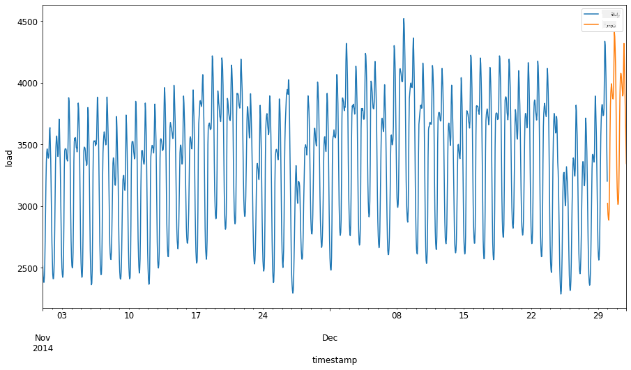
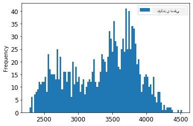
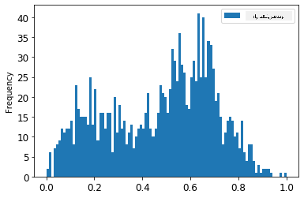
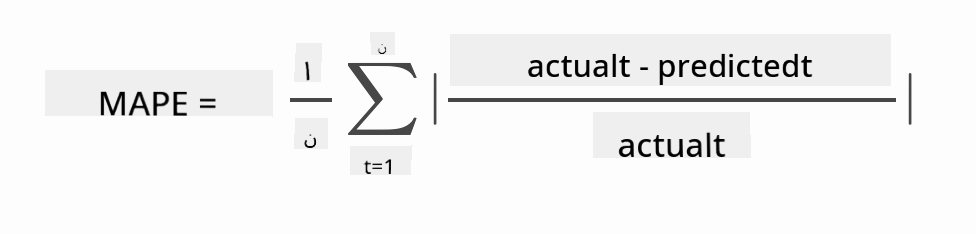

<!--
CO_OP_TRANSLATOR_METADATA:
{
  "original_hash": "2f400075e003e749fdb0d6b3b4787a99",
  "translation_date": "2025-09-03T22:44:40+00:00",
  "source_file": "7-TimeSeries/2-ARIMA/README.md",
  "language_code": "fa"
}
-->
# پیش‌بینی سری‌های زمانی با ARIMA

در درس قبلی، کمی درباره پیش‌بینی سری‌های زمانی یاد گرفتید و یک مجموعه داده را که نوسانات بار الکتریکی را در طول یک بازه زمانی نشان می‌داد، بارگذاری کردید.

[](https://youtu.be/IUSk-YDau10 "معرفی ARIMA")

> 🎥 روی تصویر بالا کلیک کنید تا ویدیو را ببینید: معرفی کوتاهی از مدل‌های ARIMA. مثال در زبان R انجام شده است، اما مفاهیم آن جهانی هستند.

## [آزمون پیش از درس](https://gray-sand-07a10f403.1.azurestaticapps.net/quiz/43/)

## مقدمه

در این درس، شما با یک روش خاص برای ساخت مدل‌ها با استفاده از [ARIMA: *A*uto*R*egressive *I*ntegrated *M*oving *A*verage](https://wikipedia.org/wiki/Autoregressive_integrated_moving_average) آشنا خواهید شد. مدل‌های ARIMA به‌ویژه برای داده‌هایی که [غیرایستا](https://wikipedia.org/wiki/Stationary_process) هستند، مناسب هستند.

## مفاهیم کلی

برای کار با ARIMA، باید با چند مفهوم آشنا شوید:

- 🎓 **ایستایی**. از دیدگاه آماری، ایستایی به داده‌هایی اشاره دارد که توزیع آن‌ها با تغییر زمان ثابت می‌ماند. داده‌های غیرایستا نوساناتی را به دلیل روندها نشان می‌دهند که باید برای تحلیل تبدیل شوند. به عنوان مثال، فصلی بودن می‌تواند نوساناتی در داده‌ها ایجاد کند که می‌توان آن را با فرآیند «تفاضل‌گیری فصلی» حذف کرد.

- 🎓 **[تفاضل‌گیری](https://wikipedia.org/wiki/Autoregressive_integrated_moving_average#Differencing)**. تفاضل‌گیری داده‌ها، از دیدگاه آماری، به فرآیند تبدیل داده‌های غیرایستا به ایستا از طریق حذف روندهای غیرثابت اشاره دارد. "تفاضل‌گیری تغییرات سطح یک سری زمانی را حذف می‌کند، روند و فصلی بودن را از بین می‌برد و در نتیجه میانگین سری زمانی را تثبیت می‌کند." [مقاله‌ای از Shixiong و همکاران](https://arxiv.org/abs/1904.07632)

## ARIMA در زمینه سری‌های زمانی

بیایید اجزای ARIMA را بررسی کنیم تا بهتر بفهمیم چگونه به ما در مدل‌سازی سری‌های زمانی و پیش‌بینی کمک می‌کند.

- **AR - برای خودرگرسیو (AutoRegressive)**. مدل‌های خودرگرسیو، همان‌طور که از نامشان پیداست، به گذشته نگاه می‌کنند تا مقادیر قبلی داده‌ها را تحلیل کرده و فرضیاتی درباره آن‌ها بسازند. این مقادیر قبلی به عنوان «وقفه‌ها» شناخته می‌شوند. به عنوان مثال، داده‌هایی که فروش ماهانه مدادها را نشان می‌دهند. مجموع فروش هر ماه به عنوان یک «متغیر در حال تکامل» در مجموعه داده در نظر گرفته می‌شود. این مدل به این صورت ساخته می‌شود که "متغیر در حال تکامل مورد نظر بر اساس مقادیر وقفه‌ای (یعنی قبلی) خودش رگرس می‌شود." [ویکی‌پدیا](https://wikipedia.org/wiki/Autoregressive_integrated_moving_average)

- **I - برای یکپارچه‌سازی (Integrated)**. برخلاف مدل‌های مشابه ARMA، حرف 'I' در ARIMA به جنبه *[یکپارچه‌سازی](https://wikipedia.org/wiki/Order_of_integration)* اشاره دارد. داده‌ها زمانی یکپارچه می‌شوند که مراحل تفاضل‌گیری اعمال شوند تا غیرایستایی حذف شود.

- **MA - برای میانگین متحرک (Moving Average)**. جنبه [میانگین متحرک](https://wikipedia.org/wiki/Moving-average_model) این مدل به متغیر خروجی اشاره دارد که با مشاهده مقادیر فعلی و گذشته وقفه‌ها تعیین می‌شود.

نتیجه نهایی: ARIMA برای ساخت مدلی استفاده می‌شود که تا حد ممکن با شکل خاص داده‌های سری زمانی مطابقت داشته باشد.

## تمرین - ساخت یک مدل ARIMA

پوشه [_/working_](https://github.com/microsoft/ML-For-Beginners/tree/main/7-TimeSeries/2-ARIMA/working) را در این درس باز کنید و فایل [_notebook.ipynb_](https://github.com/microsoft/ML-For-Beginners/blob/main/7-TimeSeries/2-ARIMA/working/notebook.ipynb) را پیدا کنید.

1. نوت‌بوک را اجرا کنید تا کتابخانه `statsmodels` پایتون بارگذاری شود؛ شما به این کتابخانه برای مدل‌های ARIMA نیاز دارید.

1. کتابخانه‌های لازم را بارگذاری کنید.

1. حالا چند کتابخانه دیگر که برای ترسیم داده‌ها مفید هستند را بارگذاری کنید:

    ```python
    import os
    import warnings
    import matplotlib.pyplot as plt
    import numpy as np
    import pandas as pd
    import datetime as dt
    import math

    from pandas.plotting import autocorrelation_plot
    from statsmodels.tsa.statespace.sarimax import SARIMAX
    from sklearn.preprocessing import MinMaxScaler
    from common.utils import load_data, mape
    from IPython.display import Image

    %matplotlib inline
    pd.options.display.float_format = '{:,.2f}'.format
    np.set_printoptions(precision=2)
    warnings.filterwarnings("ignore") # specify to ignore warning messages
    ```

1. داده‌ها را از فایل `/data/energy.csv` به یک دیتافریم Pandas بارگذاری کنید و نگاهی به آن بیندازید:

    ```python
    energy = load_data('./data')[['load']]
    energy.head(10)
    ```

1. تمام داده‌های انرژی موجود از ژانویه 2012 تا دسامبر 2014 را ترسیم کنید. نباید شگفت‌زده شوید زیرا این داده‌ها را در درس قبلی دیدیم:

    ```python
    energy.plot(y='load', subplots=True, figsize=(15, 8), fontsize=12)
    plt.xlabel('timestamp', fontsize=12)
    plt.ylabel('load', fontsize=12)
    plt.show()
    ```

    حالا بیایید یک مدل بسازیم!

### ایجاد مجموعه داده‌های آموزشی و آزمایشی

حالا که داده‌های شما بارگذاری شده‌اند، می‌توانید آن‌ها را به مجموعه‌های آموزشی و آزمایشی تقسیم کنید. شما مدل خود را روی مجموعه آموزشی آموزش خواهید داد. همان‌طور که معمول است، پس از اتمام آموزش مدل، دقت آن را با استفاده از مجموعه آزمایشی ارزیابی خواهید کرد. باید اطمینان حاصل کنید که مجموعه آزمایشی یک بازه زمانی بعدی را نسبت به مجموعه آموزشی پوشش می‌دهد تا مدل اطلاعاتی از دوره‌های زمانی آینده به دست نیاورد.

1. یک بازه زمانی دو ماهه از 1 سپتامبر تا 31 اکتبر 2014 را به مجموعه آموزشی اختصاص دهید. مجموعه آزمایشی شامل بازه زمانی دو ماهه از 1 نوامبر تا 31 دسامبر 2014 خواهد بود:

    ```python
    train_start_dt = '2014-11-01 00:00:00'
    test_start_dt = '2014-12-30 00:00:00'
    ```

    از آنجا که این داده‌ها مصرف روزانه انرژی را منعکس می‌کنند، یک الگوی فصلی قوی وجود دارد، اما مصرف بیشتر شبیه مصرف در روزهای اخیر است.

1. تفاوت‌ها را تجسم کنید:

    ```python
    energy[(energy.index < test_start_dt) & (energy.index >= train_start_dt)][['load']].rename(columns={'load':'train'}) \
        .join(energy[test_start_dt:][['load']].rename(columns={'load':'test'}), how='outer') \
        .plot(y=['train', 'test'], figsize=(15, 8), fontsize=12)
    plt.xlabel('timestamp', fontsize=12)
    plt.ylabel('load', fontsize=12)
    plt.show()
    ```

    

    بنابراین، استفاده از یک بازه زمانی نسبتاً کوچک برای آموزش داده‌ها باید کافی باشد.

    > توجه: از آنجا که تابعی که برای برازش مدل ARIMA استفاده می‌کنیم از اعتبارسنجی درون نمونه‌ای در طول برازش استفاده می‌کند، داده‌های اعتبارسنجی را حذف خواهیم کرد.

### آماده‌سازی داده‌ها برای آموزش

حالا باید داده‌ها را برای آموزش آماده کنید. این کار با فیلتر کردن و مقیاس‌بندی داده‌ها انجام می‌شود. داده‌های خود را فیلتر کنید تا فقط بازه‌های زمانی و ستون‌های مورد نیاز را شامل شود و مقیاس‌بندی کنید تا داده‌ها در بازه 0 و 1 قرار گیرند.

1. مجموعه داده اصلی را فیلتر کنید تا فقط بازه‌های زمانی ذکر شده در هر مجموعه و فقط ستون مورد نیاز 'load' به علاوه تاریخ را شامل شود:

    ```python
    train = energy.copy()[(energy.index >= train_start_dt) & (energy.index < test_start_dt)][['load']]
    test = energy.copy()[energy.index >= test_start_dt][['load']]

    print('Training data shape: ', train.shape)
    print('Test data shape: ', test.shape)
    ```

    می‌توانید شکل داده‌ها را ببینید:

    ```output
    Training data shape:  (1416, 1)
    Test data shape:  (48, 1)
    ```

1. داده‌ها را به بازه (0, 1) مقیاس‌بندی کنید.

    ```python
    scaler = MinMaxScaler()
    train['load'] = scaler.fit_transform(train)
    train.head(10)
    ```

1. داده‌های اصلی در مقابل داده‌های مقیاس‌بندی شده را تجسم کنید:

    ```python
    energy[(energy.index >= train_start_dt) & (energy.index < test_start_dt)][['load']].rename(columns={'load':'original load'}).plot.hist(bins=100, fontsize=12)
    train.rename(columns={'load':'scaled load'}).plot.hist(bins=100, fontsize=12)
    plt.show()
    ```

    

    > داده‌های اصلی

    

    > داده‌های مقیاس‌بندی شده

1. حالا که داده‌های مقیاس‌بندی شده را کالیبره کرده‌اید، می‌توانید داده‌های آزمایشی را نیز مقیاس‌بندی کنید:

    ```python
    test['load'] = scaler.transform(test)
    test.head()
    ```

### پیاده‌سازی ARIMA

زمان پیاده‌سازی ARIMA فرا رسیده است! اکنون از کتابخانه `statsmodels` که قبلاً نصب کرده‌اید استفاده خواهید کرد.

حالا باید چند مرحله را دنبال کنید:

   1. مدل را با فراخوانی `SARIMAX()` و وارد کردن پارامترهای مدل: پارامترهای p، d و q، و پارامترهای P، D و Q تعریف کنید.
   2. مدل را برای داده‌های آموزشی با فراخوانی تابع fit() آماده کنید.
   3. با فراخوانی تابع `forecast()` و مشخص کردن تعداد گام‌ها (افق پیش‌بینی)، پیش‌بینی کنید.

> 🎓 این پارامترها برای چیست؟ در یک مدل ARIMA سه پارامتر وجود دارد که برای کمک به مدل‌سازی جنبه‌های اصلی یک سری زمانی استفاده می‌شوند: فصلی بودن، روند و نویز. این پارامترها عبارتند از:

`p`: پارامتری که با جنبه خودرگرسیو مدل مرتبط است و مقادیر *گذشته* را در بر می‌گیرد.  
`d`: پارامتری که با بخش یکپارچه مدل مرتبط است و میزان *تفاضل‌گیری* (🎓 تفاضل‌گیری را به یاد دارید؟ 👆) را برای اعمال بر سری زمانی تعیین می‌کند.  
`q`: پارامتری که با بخش میانگین متحرک مدل مرتبط است.

> توجه: اگر داده‌های شما جنبه فصلی داشته باشد - که این داده‌ها دارند - از یک مدل ARIMA فصلی (SARIMA) استفاده می‌کنیم. در این صورت باید از مجموعه دیگری از پارامترها استفاده کنید: `P`، `D` و `Q` که همان ارتباطات `p`، `d` و `q` را توصیف می‌کنند، اما به اجزای فصلی مدل مربوط می‌شوند.

1. ابتدا مقدار افق پیش‌بینی مورد نظر خود را تنظیم کنید. بیایید 3 ساعت را امتحان کنیم:

    ```python
    # Specify the number of steps to forecast ahead
    HORIZON = 3
    print('Forecasting horizon:', HORIZON, 'hours')
    ```

    انتخاب بهترین مقادیر برای پارامترهای مدل ARIMA می‌تواند چالش‌برانگیز باشد زیرا تا حدی ذهنی و زمان‌بر است. ممکن است بخواهید از تابع `auto_arima()` از کتابخانه [`pyramid`](https://alkaline-ml.com/pmdarima/0.9.0/modules/generated/pyramid.arima.auto_arima.html) استفاده کنید.

1. فعلاً چند انتخاب دستی را امتحان کنید تا یک مدل خوب پیدا کنید.

    ```python
    order = (4, 1, 0)
    seasonal_order = (1, 1, 0, 24)

    model = SARIMAX(endog=train, order=order, seasonal_order=seasonal_order)
    results = model.fit()

    print(results.summary())
    ```

    یک جدول از نتایج چاپ می‌شود.

شما اولین مدل خود را ساختید! حالا باید راهی برای ارزیابی آن پیدا کنیم.

### ارزیابی مدل شما

برای ارزیابی مدل خود، می‌توانید از اعتبارسنجی به روش `walk forward` استفاده کنید. در عمل، مدل‌های سری زمانی هر بار که داده جدیدی در دسترس قرار می‌گیرد، دوباره آموزش داده می‌شوند. این کار به مدل اجازه می‌دهد تا بهترین پیش‌بینی را در هر گام زمانی انجام دهد.

با شروع از ابتدای سری زمانی و استفاده از این تکنیک، مدل را روی مجموعه داده آموزشی آموزش دهید. سپس یک پیش‌بینی برای گام زمانی بعدی انجام دهید. پیش‌بینی با مقدار شناخته‌شده ارزیابی می‌شود. سپس مجموعه آموزشی گسترش می‌یابد تا مقدار شناخته‌شده را شامل شود و این فرآیند تکرار می‌شود.

> توجه: برای آموزش کارآمدتر، باید پنجره مجموعه آموزشی را ثابت نگه دارید تا هر بار که یک مشاهده جدید به مجموعه آموزشی اضافه می‌کنید، مشاهده‌ای را از ابتدای مجموعه حذف کنید.

این فرآیند تخمین قوی‌تری از عملکرد مدل در عمل ارائه می‌دهد. با این حال، هزینه محاسباتی ایجاد مدل‌های متعدد را به همراه دارد. این موضوع در صورتی که داده‌ها کوچک باشند یا مدل ساده باشد قابل قبول است، اما در مقیاس می‌تواند مشکل‌ساز باشد.

اعتبارسنجی به روش walk-forward استاندارد طلایی ارزیابی مدل‌های سری زمانی است و برای پروژه‌های خودتان توصیه می‌شود.

1. ابتدا یک نقطه داده آزمایشی برای هر گام HORIZON ایجاد کنید.

    ```python
    test_shifted = test.copy()

    for t in range(1, HORIZON+1):
        test_shifted['load+'+str(t)] = test_shifted['load'].shift(-t, freq='H')

    test_shifted = test_shifted.dropna(how='any')
    test_shifted.head(5)
    ```

    |            |          | load | load+1 | load+2 |
    | ---------- | -------- | ---- | ------ | ------ |
    | 2014-12-30 | 00:00:00 | 0.33 | 0.29   | 0.27   |
    | 2014-12-30 | 01:00:00 | 0.29 | 0.27   | 0.27   |
    | 2014-12-30 | 02:00:00 | 0.27 | 0.27   | 0.30   |
    | 2014-12-30 | 03:00:00 | 0.27 | 0.30   | 0.41   |
    | 2014-12-30 | 04:00:00 | 0.30 | 0.41   | 0.57   |

    داده‌ها به صورت افقی بر اساس نقطه افق پیش‌بینی جابه‌جا می‌شوند.

1. با استفاده از این رویکرد پنجره لغزان در یک حلقه به اندازه طول داده‌های آزمایشی، پیش‌بینی کنید:

    ```python
    %%time
    training_window = 720 # dedicate 30 days (720 hours) for training

    train_ts = train['load']
    test_ts = test_shifted

    history = [x for x in train_ts]
    history = history[(-training_window):]

    predictions = list()

    order = (2, 1, 0)
    seasonal_order = (1, 1, 0, 24)

    for t in range(test_ts.shape[0]):
        model = SARIMAX(endog=history, order=order, seasonal_order=seasonal_order)
        model_fit = model.fit()
        yhat = model_fit.forecast(steps = HORIZON)
        predictions.append(yhat)
        obs = list(test_ts.iloc[t])
        # move the training window
        history.append(obs[0])
        history.pop(0)
        print(test_ts.index[t])
        print(t+1, ': predicted =', yhat, 'expected =', obs)
    ```

    می‌توانید فرآیند آموزش را مشاهده کنید:

    ```output
    2014-12-30 00:00:00
    1 : predicted = [0.32 0.29 0.28] expected = [0.32945389435989236, 0.2900626678603402, 0.2739480752014323]

    2014-12-30 01:00:00
    2 : predicted = [0.3  0.29 0.3 ] expected = [0.2900626678603402, 0.2739480752014323, 0.26812891674127126]

    2014-12-30 02:00:00
    3 : predicted = [0.27 0.28 0.32] expected = [0.2739480752014323, 0.26812891674127126, 0.3025962399283795]
    ```

1. پیش‌بینی‌ها را با بار واقعی مقایسه کنید:

    ```python
    eval_df = pd.DataFrame(predictions, columns=['t+'+str(t) for t in range(1, HORIZON+1)])
    eval_df['timestamp'] = test.index[0:len(test.index)-HORIZON+1]
    eval_df = pd.melt(eval_df, id_vars='timestamp', value_name='prediction', var_name='h')
    eval_df['actual'] = np.array(np.transpose(test_ts)).ravel()
    eval_df[['prediction', 'actual']] = scaler.inverse_transform(eval_df[['prediction', 'actual']])
    eval_df.head()
    ```

    خروجی
    |     |            | timestamp | h   | prediction | actual   |
    | --- | ---------- | --------- | --- | ---------- | -------- |
    | 0   | 2014-12-30 | 00:00:00  | t+1 | 3,008.74   | 3,023.00 |
    | 1   | 2014-12-30 | 01:00:00  | t+1 | 2,955.53   | 2,935.00 |
    | 2   | 2014-12-30 | 02:00:00  | t+1 | 2,900.17   | 2,899.00 |
    | 3   | 2014-12-30 | 03:00:00  | t+1 | 2,917.69   | 2,886.00 |
    | 4   | 2014-12-30 | 04:00:00  | t+1 | 2,946.99   | 2,963.00 |

    پیش‌بینی داده‌های ساعتی را در مقایسه با بار واقعی مشاهده کنید. این چقدر دقیق است؟

### بررسی دقت مدل

دقت مدل خود را با آزمایش میانگین درصد خطای مطلق (MAPE) آن در تمام پیش‌بینی‌ها بررسی کنید.
> **🧮 فرمول ریاضی را ببینید**
>
> 
>
> [MAPE](https://www.linkedin.com/pulse/what-mape-mad-msd-time-series-allameh-statistics/) برای نشان دادن دقت پیش‌بینی به عنوان یک نسبت تعریف شده توسط فرمول بالا استفاده می‌شود. تفاوت بین مقدار واقعی و پیش‌بینی‌شده بر مقدار واقعی تقسیم می‌شود.  
> "مقدار مطلق در این محاسبه برای هر نقطه پیش‌بینی‌شده در زمان جمع شده و بر تعداد نقاط برازش‌شده n تقسیم می‌شود." [ویکی‌پدیا](https://wikipedia.org/wiki/Mean_absolute_percentage_error)
1. معادله را در کد بیان کنید:

    ```python
    if(HORIZON > 1):
        eval_df['APE'] = (eval_df['prediction'] - eval_df['actual']).abs() / eval_df['actual']
        print(eval_df.groupby('h')['APE'].mean())
    ```

1. MAPE یک مرحله‌ای را محاسبه کنید:

    ```python
    print('One step forecast MAPE: ', (mape(eval_df[eval_df['h'] == 't+1']['prediction'], eval_df[eval_df['h'] == 't+1']['actual']))*100, '%')
    ```

    MAPE پیش‌بینی یک مرحله‌ای:  0.5570581332313952 %

1. MAPE پیش‌بینی چند مرحله‌ای را چاپ کنید:

    ```python
    print('Multi-step forecast MAPE: ', mape(eval_df['prediction'], eval_df['actual'])*100, '%')
    ```

    ```output
    Multi-step forecast MAPE:  1.1460048657704118 %
    ```

    یک عدد پایین و مناسب بهترین است: در نظر داشته باشید که پیش‌بینی با MAPE برابر با 10 به معنای خطای 10 درصدی است.

1. اما همان‌طور که همیشه گفته می‌شود، دیدن این نوع اندازه‌گیری دقت به صورت بصری آسان‌تر است، پس بیایید آن را رسم کنیم:

    ```python
     if(HORIZON == 1):
        ## Plotting single step forecast
        eval_df.plot(x='timestamp', y=['actual', 'prediction'], style=['r', 'b'], figsize=(15, 8))

    else:
        ## Plotting multi step forecast
        plot_df = eval_df[(eval_df.h=='t+1')][['timestamp', 'actual']]
        for t in range(1, HORIZON+1):
            plot_df['t+'+str(t)] = eval_df[(eval_df.h=='t+'+str(t))]['prediction'].values

        fig = plt.figure(figsize=(15, 8))
        ax = plt.plot(plot_df['timestamp'], plot_df['actual'], color='red', linewidth=4.0)
        ax = fig.add_subplot(111)
        for t in range(1, HORIZON+1):
            x = plot_df['timestamp'][(t-1):]
            y = plot_df['t+'+str(t)][0:len(x)]
            ax.plot(x, y, color='blue', linewidth=4*math.pow(.9,t), alpha=math.pow(0.8,t))

        ax.legend(loc='best')

    plt.xlabel('timestamp', fontsize=12)
    plt.ylabel('load', fontsize=12)
    plt.show()
    ```

    

🏆 یک نمودار بسیار زیبا که مدلی با دقت خوب را نشان می‌دهد. عالی کار کردید!

---

## 🚀چالش

روش‌های مختلف برای آزمودن دقت یک مدل سری زمانی را بررسی کنید. در این درس به MAPE اشاره شد، اما آیا روش‌های دیگری وجود دارد که بتوانید استفاده کنید؟ درباره آن‌ها تحقیق کنید و توضیح دهید. یک سند مفید را می‌توانید [اینجا](https://otexts.com/fpp2/accuracy.html) پیدا کنید.

## [آزمون پس از درس](https://gray-sand-07a10f403.1.azurestaticapps.net/quiz/44/)

## مرور و مطالعه شخصی

این درس تنها به اصول اولیه پیش‌بینی سری زمانی با ARIMA پرداخته است. زمانی را برای عمیق‌تر کردن دانش خود اختصاص دهید و به [این مخزن](https://microsoft.github.io/forecasting/) و انواع مدل‌های مختلف آن نگاهی بیندازید تا روش‌های دیگری برای ساخت مدل‌های سری زمانی یاد بگیرید.

## تکلیف

[یک مدل ARIMA جدید](assignment.md)

---

**سلب مسئولیت**:  
این سند با استفاده از سرویس ترجمه هوش مصنوعی [Co-op Translator](https://github.com/Azure/co-op-translator) ترجمه شده است. در حالی که ما تلاش می‌کنیم دقت را حفظ کنیم، لطفاً توجه داشته باشید که ترجمه‌های خودکار ممکن است شامل خطاها یا نادرستی‌ها باشند. سند اصلی به زبان اصلی آن باید به عنوان منبع معتبر در نظر گرفته شود. برای اطلاعات حساس، توصیه می‌شود از ترجمه حرفه‌ای انسانی استفاده کنید. ما مسئولیتی در قبال سوءتفاهم‌ها یا تفسیرهای نادرست ناشی از استفاده از این ترجمه نداریم.