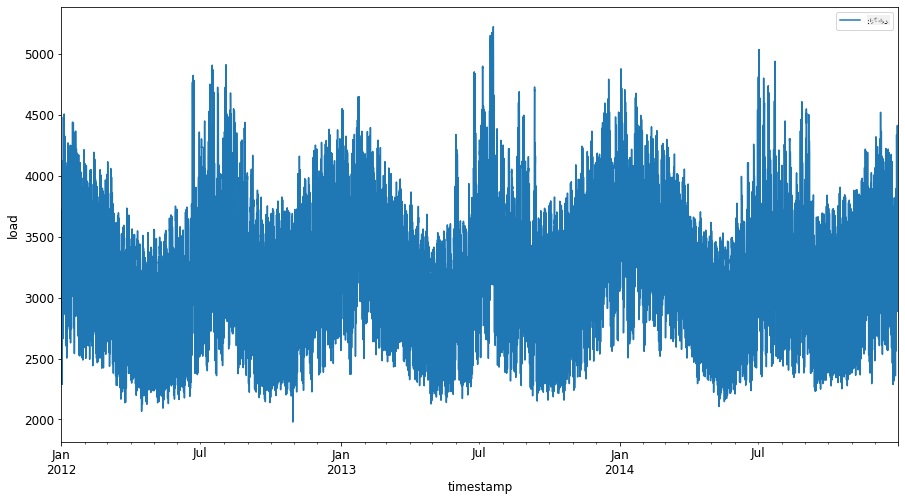
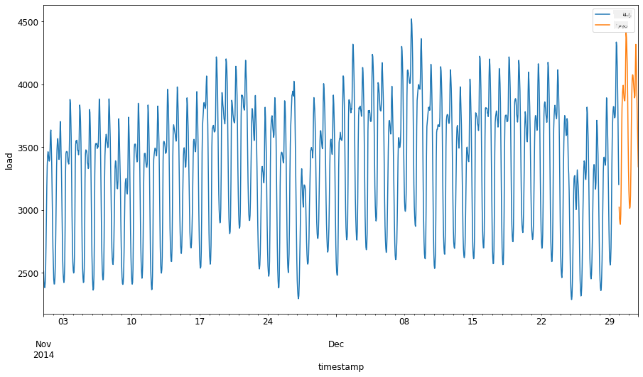
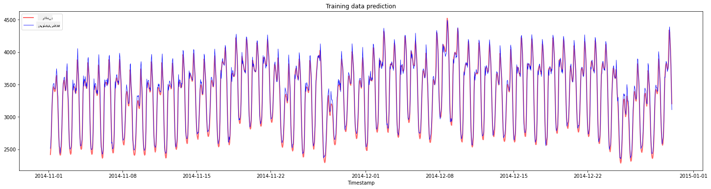
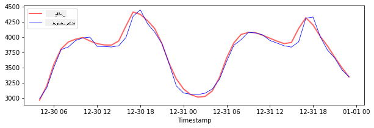
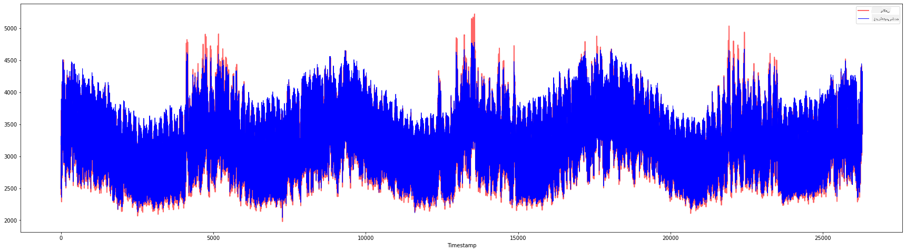

<!--
CO_OP_TRANSLATOR_METADATA:
{
  "original_hash": "f80e513b3279869e7661e3190cc83076",
  "translation_date": "2025-09-03T22:53:53+00:00",
  "source_file": "7-TimeSeries/3-SVR/README.md",
  "language_code": "fa"
}
-->
# پیش‌بینی سری‌های زمانی با استفاده از مدل Support Vector Regressor

در درس قبلی، یاد گرفتید که چگونه از مدل ARIMA برای پیش‌بینی سری‌های زمانی استفاده کنید. اکنون به مدل Support Vector Regressor می‌پردازیم که یک مدل رگرسیون برای پیش‌بینی داده‌های پیوسته است.

## [آزمون پیش از درس](https://gray-sand-07a10f403.1.azurestaticapps.net/quiz/51/) 

## مقدمه

در این درس، با روش خاصی برای ساخت مدل‌ها با [**SVM**: **ماشین بردار پشتیبان**](https://en.wikipedia.org/wiki/Support-vector_machine) برای رگرسیون، یا **SVR: Support Vector Regressor** آشنا خواهید شد.

### SVR در زمینه سری‌های زمانی [^1]

قبل از درک اهمیت SVR در پیش‌بینی سری‌های زمانی، برخی از مفاهیم مهمی که باید بدانید عبارتند از:

- **رگرسیون:** تکنیک یادگیری نظارت‌شده برای پیش‌بینی مقادیر پیوسته از مجموعه‌ای از ورودی‌ها. ایده این است که یک منحنی (یا خط) در فضای ویژگی‌ها پیدا شود که بیشترین تعداد نقاط داده را شامل شود. [اینجا کلیک کنید](https://en.wikipedia.org/wiki/Regression_analysis) برای اطلاعات بیشتر.
- **ماشین بردار پشتیبان (SVM):** نوعی مدل یادگیری ماشین نظارت‌شده که برای طبقه‌بندی، رگرسیون و تشخیص نقاط خارج از محدوده استفاده می‌شود. این مدل یک ابرصفحه در فضای ویژگی‌ها است که در مورد طبقه‌بندی به عنوان مرز عمل می‌کند و در مورد رگرسیون به عنوان خط بهترین برازش. در SVM، معمولاً از یک تابع Kernel برای تبدیل مجموعه داده به فضایی با ابعاد بالاتر استفاده می‌شود تا بتوان آن‌ها را به راحتی جدا کرد. [اینجا کلیک کنید](https://en.wikipedia.org/wiki/Support-vector_machine) برای اطلاعات بیشتر درباره SVM.
- **Support Vector Regressor (SVR):** نوعی SVM که خط بهترین برازش (که در مورد SVM یک ابرصفحه است) را پیدا می‌کند که بیشترین تعداد نقاط داده را شامل شود.

### چرا SVR؟ [^1]

در درس قبلی درباره ARIMA یاد گرفتید، که یک روش آماری خطی بسیار موفق برای پیش‌بینی داده‌های سری‌های زمانی است. با این حال، در بسیاری از موارد، داده‌های سری‌های زمانی دارای *غیرخطی بودن* هستند که نمی‌توانند توسط مدل‌های خطی نقشه‌برداری شوند. در چنین مواردی، توانایی SVM در در نظر گرفتن غیرخطی بودن داده‌ها برای وظایف رگرسیون، SVR را در پیش‌بینی سری‌های زمانی موفق می‌کند.

## تمرین - ساخت مدل SVR

مراحل اولیه آماده‌سازی داده‌ها مشابه درس قبلی درباره [ARIMA](https://github.com/microsoft/ML-For-Beginners/tree/main/7-TimeSeries/2-ARIMA) است.

پوشه [_/working_](https://github.com/microsoft/ML-For-Beginners/tree/main/7-TimeSeries/3-SVR/working) را در این درس باز کنید و فایل [_notebook.ipynb_](https://github.com/microsoft/ML-For-Beginners/blob/main/7-TimeSeries/3-SVR/working/notebook.ipynb) را پیدا کنید.[^2]

1. نوت‌بوک را اجرا کنید و کتابخانه‌های لازم را وارد کنید: [^2]

   ```python
   import sys
   sys.path.append('../../')
   ```

   ```python
   import os
   import warnings
   import matplotlib.pyplot as plt
   import numpy as np
   import pandas as pd
   import datetime as dt
   import math
   
   from sklearn.svm import SVR
   from sklearn.preprocessing import MinMaxScaler
   from common.utils import load_data, mape
   ```

2. داده‌ها را از فایل `/data/energy.csv` به یک دیتافریم Pandas بارگذاری کنید و نگاهی بیندازید: [^2]

   ```python
   energy = load_data('../../data')[['load']]
   ```

3. تمام داده‌های انرژی موجود از ژانویه 2012 تا دسامبر 2014 را رسم کنید: [^2]

   ```python
   energy.plot(y='load', subplots=True, figsize=(15, 8), fontsize=12)
   plt.xlabel('timestamp', fontsize=12)
   plt.ylabel('load', fontsize=12)
   plt.show()
   ```

   

   حالا بیایید مدل SVR خود را بسازیم.

### ایجاد مجموعه‌های آموزشی و آزمایشی

اکنون داده‌های شما بارگذاری شده است، بنابراین می‌توانید آن‌ها را به مجموعه‌های آموزشی و آزمایشی تقسیم کنید. سپس داده‌ها را تغییر شکل دهید تا مجموعه داده‌ای مبتنی بر زمان ایجاد کنید که برای SVR مورد نیاز خواهد بود. شما مدل خود را بر روی مجموعه آموزشی آموزش خواهید داد. پس از اتمام آموزش مدل، دقت آن را بر روی مجموعه آموزشی، مجموعه آزمایشی و سپس کل مجموعه داده ارزیابی خواهید کرد تا عملکرد کلی را مشاهده کنید. باید اطمینان حاصل کنید که مجموعه آزمایشی دوره زمانی بعدی را نسبت به مجموعه آموزشی پوشش می‌دهد تا مطمئن شوید که مدل اطلاعاتی از دوره‌های زمانی آینده کسب نمی‌کند [^2] (وضعیتی که به آن *Overfitting* گفته می‌شود).

1. یک دوره دو ماهه از 1 سپتامبر تا 31 اکتبر 2014 را به مجموعه آموزشی اختصاص دهید. مجموعه آزمایشی شامل دوره دو ماهه از 1 نوامبر تا 31 دسامبر 2014 خواهد بود: [^2]

   ```python
   train_start_dt = '2014-11-01 00:00:00'
   test_start_dt = '2014-12-30 00:00:00'
   ```

2. تفاوت‌ها را بصری‌سازی کنید: [^2]

   ```python
   energy[(energy.index < test_start_dt) & (energy.index >= train_start_dt)][['load']].rename(columns={'load':'train'}) \
       .join(energy[test_start_dt:][['load']].rename(columns={'load':'test'}), how='outer') \
       .plot(y=['train', 'test'], figsize=(15, 8), fontsize=12)
   plt.xlabel('timestamp', fontsize=12)
   plt.ylabel('load', fontsize=12)
   plt.show()
   ```

   

### آماده‌سازی داده‌ها برای آموزش

اکنون باید داده‌ها را برای آموزش آماده کنید، با انجام فیلتر کردن و مقیاس‌بندی داده‌ها. مجموعه داده خود را فیلتر کنید تا فقط دوره‌های زمانی و ستون‌های مورد نیاز را شامل شود، و مقیاس‌بندی کنید تا داده‌ها در بازه 0,1 قرار گیرند.

1. مجموعه داده اصلی را فیلتر کنید تا فقط دوره‌های زمانی ذکر شده برای هر مجموعه و فقط ستون مورد نیاز 'load' به علاوه تاریخ را شامل شود: [^2]

   ```python
   train = energy.copy()[(energy.index >= train_start_dt) & (energy.index < test_start_dt)][['load']]
   test = energy.copy()[energy.index >= test_start_dt][['load']]
   
   print('Training data shape: ', train.shape)
   print('Test data shape: ', test.shape)
   ```

   ```output
   Training data shape:  (1416, 1)
   Test data shape:  (48, 1)
   ```
   
2. داده‌های آموزشی را در بازه (0, 1) مقیاس‌بندی کنید: [^2]

   ```python
   scaler = MinMaxScaler()
   train['load'] = scaler.fit_transform(train)
   ```
   
4. اکنون داده‌های آزمایشی را مقیاس‌بندی کنید: [^2]

   ```python
   test['load'] = scaler.transform(test)
   ```

### ایجاد داده‌ها با گام‌های زمانی [^1]

برای SVR، داده‌های ورودی را به شکل `[batch, timesteps]` تبدیل می‌کنید. بنابراین، داده‌های موجود `train_data` و `test_data` را به گونه‌ای تغییر شکل می‌دهید که یک بعد جدید وجود داشته باشد که به گام‌های زمانی اشاره دارد.

```python
# Converting to numpy arrays
train_data = train.values
test_data = test.values
```

برای این مثال، ما `timesteps = 5` را در نظر می‌گیریم. بنابراین، ورودی‌های مدل داده‌های 4 گام زمانی اول هستند، و خروجی داده‌های گام زمانی پنجم خواهد بود.

```python
timesteps=5
```

تبدیل داده‌های آموزشی به تنسور دو‌بعدی با استفاده از لیست‌های تو در تو:

```python
train_data_timesteps=np.array([[j for j in train_data[i:i+timesteps]] for i in range(0,len(train_data)-timesteps+1)])[:,:,0]
train_data_timesteps.shape
```

```output
(1412, 5)
```

تبدیل داده‌های آزمایشی به تنسور دو‌بعدی:

```python
test_data_timesteps=np.array([[j for j in test_data[i:i+timesteps]] for i in range(0,len(test_data)-timesteps+1)])[:,:,0]
test_data_timesteps.shape
```

```output
(44, 5)
```

انتخاب ورودی‌ها و خروجی‌ها از داده‌های آموزشی و آزمایشی:

```python
x_train, y_train = train_data_timesteps[:,:timesteps-1],train_data_timesteps[:,[timesteps-1]]
x_test, y_test = test_data_timesteps[:,:timesteps-1],test_data_timesteps[:,[timesteps-1]]

print(x_train.shape, y_train.shape)
print(x_test.shape, y_test.shape)
```

```output
(1412, 4) (1412, 1)
(44, 4) (44, 1)
```

### پیاده‌سازی SVR [^1]

اکنون زمان پیاده‌سازی SVR است. برای مطالعه بیشتر درباره این پیاده‌سازی، می‌توانید به [این مستندات](https://scikit-learn.org/stable/modules/generated/sklearn.svm.SVR.html) مراجعه کنید. برای پیاده‌سازی ما، مراحل زیر را دنبال می‌کنیم:

  1. مدل را با فراخوانی `SVR()` و ارسال هایپرپارامترهای مدل تعریف کنید: kernel، gamma، c و epsilon
  2. مدل را برای داده‌های آموزشی با فراخوانی تابع `fit()` آماده کنید
  3. پیش‌بینی‌ها را با فراخوانی تابع `predict()` انجام دهید

اکنون یک مدل SVR ایجاد می‌کنیم. در اینجا از [هسته RBF](https://scikit-learn.org/stable/modules/svm.html#parameters-of-the-rbf-kernel) استفاده می‌کنیم و هایپرپارامترهای gamma، C و epsilon را به ترتیب 0.5، 10 و 0.05 تنظیم می‌کنیم.

```python
model = SVR(kernel='rbf',gamma=0.5, C=10, epsilon = 0.05)
```

#### آموزش مدل بر روی داده‌های آموزشی [^1]

```python
model.fit(x_train, y_train[:,0])
```

```output
SVR(C=10, cache_size=200, coef0=0.0, degree=3, epsilon=0.05, gamma=0.5,
    kernel='rbf', max_iter=-1, shrinking=True, tol=0.001, verbose=False)
```

#### انجام پیش‌بینی‌های مدل [^1]

```python
y_train_pred = model.predict(x_train).reshape(-1,1)
y_test_pred = model.predict(x_test).reshape(-1,1)

print(y_train_pred.shape, y_test_pred.shape)
```

```output
(1412, 1) (44, 1)
```

شما مدل SVR خود را ساخته‌اید! اکنون باید آن را ارزیابی کنیم.

### ارزیابی مدل [^1]

برای ارزیابی، ابتدا داده‌ها را به مقیاس اصلی خود بازمی‌گردانیم. سپس، برای بررسی عملکرد، نمودار سری‌های زمانی اصلی و پیش‌بینی‌شده را رسم می‌کنیم و همچنین نتیجه MAPE را چاپ می‌کنیم.

مقیاس‌بندی خروجی پیش‌بینی‌شده و اصلی:

```python
# Scaling the predictions
y_train_pred = scaler.inverse_transform(y_train_pred)
y_test_pred = scaler.inverse_transform(y_test_pred)

print(len(y_train_pred), len(y_test_pred))
```

```python
# Scaling the original values
y_train = scaler.inverse_transform(y_train)
y_test = scaler.inverse_transform(y_test)

print(len(y_train), len(y_test))
```

#### بررسی عملکرد مدل بر روی داده‌های آموزشی و آزمایشی [^1]

ما زمان‌بندی‌ها را از مجموعه داده استخراج می‌کنیم تا در محور x نمودار خود نشان دهیم. توجه داشته باشید که ما از اولین ```timesteps-1``` مقادیر به عنوان ورودی برای اولین خروجی استفاده می‌کنیم، بنابراین زمان‌بندی‌ها برای خروجی پس از آن شروع می‌شوند.

```python
train_timestamps = energy[(energy.index < test_start_dt) & (energy.index >= train_start_dt)].index[timesteps-1:]
test_timestamps = energy[test_start_dt:].index[timesteps-1:]

print(len(train_timestamps), len(test_timestamps))
```

```output
1412 44
```

رسم پیش‌بینی‌ها برای داده‌های آموزشی:

```python
plt.figure(figsize=(25,6))
plt.plot(train_timestamps, y_train, color = 'red', linewidth=2.0, alpha = 0.6)
plt.plot(train_timestamps, y_train_pred, color = 'blue', linewidth=0.8)
plt.legend(['Actual','Predicted'])
plt.xlabel('Timestamp')
plt.title("Training data prediction")
plt.show()
```



چاپ MAPE برای داده‌های آموزشی

```python
print('MAPE for training data: ', mape(y_train_pred, y_train)*100, '%')
```

```output
MAPE for training data: 1.7195710200875551 %
```

رسم پیش‌بینی‌ها برای داده‌های آزمایشی

```python
plt.figure(figsize=(10,3))
plt.plot(test_timestamps, y_test, color = 'red', linewidth=2.0, alpha = 0.6)
plt.plot(test_timestamps, y_test_pred, color = 'blue', linewidth=0.8)
plt.legend(['Actual','Predicted'])
plt.xlabel('Timestamp')
plt.show()
```



چاپ MAPE برای داده‌های آزمایشی

```python
print('MAPE for testing data: ', mape(y_test_pred, y_test)*100, '%')
```

```output
MAPE for testing data:  1.2623790187854018 %
```

🏆 شما نتیجه بسیار خوبی بر روی مجموعه داده آزمایشی دارید!

### بررسی عملکرد مدل بر روی کل مجموعه داده [^1]

```python
# Extracting load values as numpy array
data = energy.copy().values

# Scaling
data = scaler.transform(data)

# Transforming to 2D tensor as per model input requirement
data_timesteps=np.array([[j for j in data[i:i+timesteps]] for i in range(0,len(data)-timesteps+1)])[:,:,0]
print("Tensor shape: ", data_timesteps.shape)

# Selecting inputs and outputs from data
X, Y = data_timesteps[:,:timesteps-1],data_timesteps[:,[timesteps-1]]
print("X shape: ", X.shape,"\nY shape: ", Y.shape)
```

```output
Tensor shape:  (26300, 5)
X shape:  (26300, 4) 
Y shape:  (26300, 1)
```

```python
# Make model predictions
Y_pred = model.predict(X).reshape(-1,1)

# Inverse scale and reshape
Y_pred = scaler.inverse_transform(Y_pred)
Y = scaler.inverse_transform(Y)
```

```python
plt.figure(figsize=(30,8))
plt.plot(Y, color = 'red', linewidth=2.0, alpha = 0.6)
plt.plot(Y_pred, color = 'blue', linewidth=0.8)
plt.legend(['Actual','Predicted'])
plt.xlabel('Timestamp')
plt.show()
```



```python
print('MAPE: ', mape(Y_pred, Y)*100, '%')
```

```output
MAPE:  2.0572089029888656 %
```

🏆 نمودارهای بسیار خوبی، نشان‌دهنده مدلی با دقت بالا. آفرین!

---

## 🚀چالش

- سعی کنید هایپرپارامترها (gamma، C، epsilon) را هنگام ایجاد مدل تغییر دهید و بر روی داده‌ها ارزیابی کنید تا ببینید کدام مجموعه هایپرپارامترها بهترین نتایج را بر روی داده‌های آزمایشی می‌دهند. برای اطلاعات بیشتر درباره این هایپرپارامترها، می‌توانید به [این مستندات](https://scikit-learn.org/stable/modules/svm.html#parameters-of-the-rbf-kernel) مراجعه کنید.
- سعی کنید از توابع هسته مختلف برای مدل استفاده کنید و عملکرد آن‌ها را بر روی مجموعه داده تحلیل کنید. یک مستند مفید را می‌توانید [اینجا](https://scikit-learn.org/stable/modules/svm.html#kernel-functions) پیدا کنید.
- سعی کنید از مقادیر مختلف برای `timesteps` استفاده کنید تا مدل بتواند برای پیش‌بینی به عقب نگاه کند.

## [آزمون پس از درس](https://gray-sand-07a10f403.1.azurestaticapps.net/quiz/52/)

## مرور و مطالعه شخصی

این درس برای معرفی کاربرد SVR در پیش‌بینی سری‌های زمانی بود. برای مطالعه بیشتر درباره SVR، می‌توانید به [این بلاگ](https://www.analyticsvidhya.com/blog/2020/03/support-vector-regression-tutorial-for-machine-learning/) مراجعه کنید. این [مستندات در scikit-learn](https://scikit-learn.org/stable/modules/svm.html) توضیحات جامع‌تری درباره SVM‌ها به طور کلی، [SVRها](https://scikit-learn.org/stable/modules/svm.html#regression) و همچنین جزئیات دیگر پیاده‌سازی مانند [توابع هسته](https://scikit-learn.org/stable/modules/svm.html#kernel-functions) که می‌توانند استفاده شوند و پارامترهای آن‌ها ارائه می‌دهد.

## تکلیف

[یک مدل SVR جدید](assignment.md)

## اعتبارها

[^1]: متن، کد و خروجی در این بخش توسط [@AnirbanMukherjeeXD](https://github.com/AnirbanMukherjeeXD) ارائه شده است.
[^2]: متن، کد و خروجی در این بخش از [ARIMA](https://github.com/microsoft/ML-For-Beginners/tree/main/7-TimeSeries/2-ARIMA) گرفته شده است.

---

**سلب مسئولیت**:  
این سند با استفاده از سرویس ترجمه هوش مصنوعی [Co-op Translator](https://github.com/Azure/co-op-translator) ترجمه شده است. در حالی که ما برای دقت تلاش می‌کنیم، لطفاً توجه داشته باشید که ترجمه‌های خودکار ممکن است شامل خطاها یا نادرستی‌هایی باشند. سند اصلی به زبان اصلی آن باید به عنوان منبع معتبر در نظر گرفته شود. برای اطلاعات حساس، ترجمه حرفه‌ای انسانی توصیه می‌شود. ما هیچ مسئولیتی در قبال سوءتفاهم‌ها یا تفسیرهای نادرست ناشی از استفاده از این ترجمه نداریم.