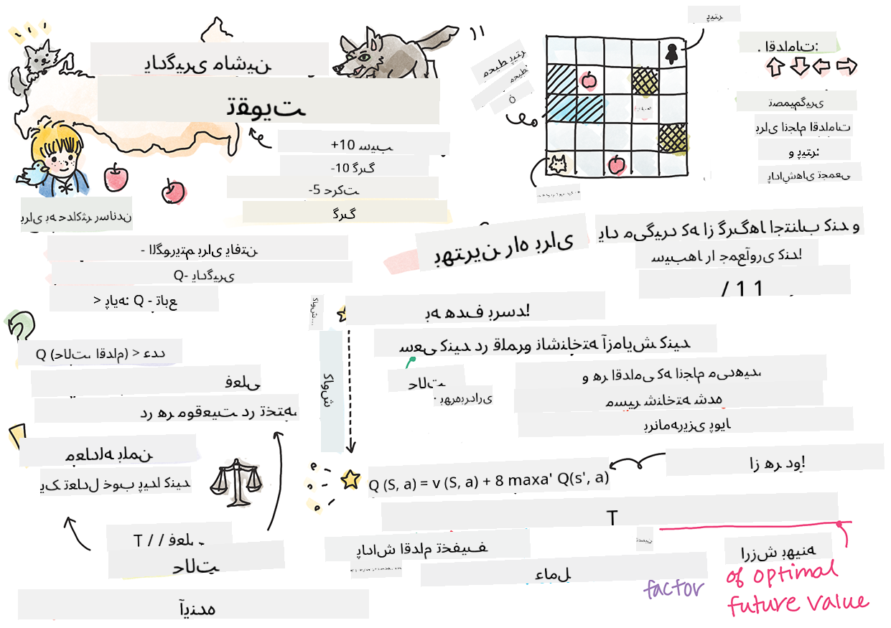

<!--
CO_OP_TRANSLATOR_METADATA:
{
  "original_hash": "0ffe994d1cc881bdeb49226a064116e5",
  "translation_date": "2025-09-04T00:20:56+00:00",
  "source_file": "8-Reinforcement/1-QLearning/README.md",
  "language_code": "fa"
}
-->
# مقدمه‌ای بر یادگیری تقویتی و Q-Learning


> اسکچ‌نوت توسط [Tomomi Imura](https://www.twitter.com/girlie_mac)

یادگیری تقویتی شامل سه مفهوم مهم است: عامل، حالت‌ها، و مجموعه‌ای از اقدامات برای هر حالت. با انجام یک اقدام در یک حالت مشخص، عامل یک پاداش دریافت می‌کند. دوباره بازی کامپیوتری سوپر ماریو را تصور کنید. شما ماریو هستید، در یک مرحله بازی، کنار لبه یک پرتگاه ایستاده‌اید. بالای شما یک سکه قرار دارد. شما که ماریو هستید، در یک مرحله بازی، در یک موقعیت خاص ... این حالت شماست. حرکت یک قدم به سمت راست (یک اقدام) شما را به پایین پرتگاه می‌برد و این به شما امتیاز عددی پایینی می‌دهد. اما فشار دادن دکمه پرش به شما اجازه می‌دهد امتیاز کسب کنید و زنده بمانید. این یک نتیجه مثبت است و باید به شما امتیاز عددی مثبت بدهد.

با استفاده از یادگیری تقویتی و یک شبیه‌ساز (بازی)، می‌توانید یاد بگیرید چگونه بازی کنید تا پاداش را به حداکثر برسانید، که شامل زنده ماندن و کسب بیشترین امتیاز ممکن است.

[](https://www.youtube.com/watch?v=lDq_en8RNOo)

> 🎥 روی تصویر بالا کلیک کنید تا صحبت‌های دیمیتری درباره یادگیری تقویتی را بشنوید

## [پیش‌آزمون درس](https://gray-sand-07a10f403.1.azurestaticapps.net/quiz/45/)

## پیش‌نیازها و تنظیمات

در این درس، ما با کدی در پایتون آزمایش خواهیم کرد. شما باید بتوانید کد Jupyter Notebook این درس را روی کامپیوتر خود یا در فضای ابری اجرا کنید.

می‌توانید [دفترچه درس](https://github.com/microsoft/ML-For-Beginners/blob/main/8-Reinforcement/1-QLearning/notebook.ipynb) را باز کنید و این درس را مرور کنید تا آن را بسازید.

> **توجه:** اگر این کد را از فضای ابری باز می‌کنید، همچنین باید فایل [`rlboard.py`](https://github.com/microsoft/ML-For-Beginners/blob/main/8-Reinforcement/1-QLearning/rlboard.py) را دریافت کنید، که در کد دفترچه استفاده می‌شود. آن را به همان دایرکتوری که دفترچه در آن قرار دارد اضافه کنید.

## مقدمه

در این درس، ما دنیای **[پیتر و گرگ](https://en.wikipedia.org/wiki/Peter_and_the_Wolf)** را بررسی خواهیم کرد، که از یک داستان موسیقیایی افسانه‌ای توسط آهنگساز روسی، [سرگئی پروکفیف](https://en.wikipedia.org/wiki/Sergei_Prokofiev) الهام گرفته شده است. ما از **یادگیری تقویتی** استفاده خواهیم کرد تا به پیتر اجازه دهیم محیط خود را کشف کند، سیب‌های خوشمزه جمع‌آوری کند و از ملاقات با گرگ اجتناب کند.

**یادگیری تقویتی** (RL) یک تکنیک یادگیری است که به ما اجازه می‌دهد رفتار بهینه یک **عامل** را در یک **محیط** با اجرای آزمایش‌های متعدد یاد بگیریم. یک عامل در این محیط باید یک **هدف** داشته باشد، که توسط یک **تابع پاداش** تعریف می‌شود.

## محیط

برای سادگی، بیایید دنیای پیتر را به یک تخته مربعی با اندازه `عرض` x `ارتفاع` در نظر بگیریم، مانند این:


هر سلول در این تخته می‌تواند یکی از موارد زیر باشد:

* **زمین**، که پیتر و موجودات دیگر می‌توانند روی آن راه بروند.
* **آب**، که به وضوح نمی‌توانید روی آن راه بروید.
* یک **درخت** یا **چمن**، جایی که می‌توانید استراحت کنید.
* یک **سیب**، که چیزی است که پیتر خوشحال می‌شود پیدا کند تا خودش را تغذیه کند.
* یک **گرگ**، که خطرناک است و باید از آن اجتناب کرد.

یک ماژول جداگانه پایتون، [`rlboard.py`](https://github.com/microsoft/ML-For-Beginners/blob/main/8-Reinforcement/1-QLearning/rlboard.py)، وجود دارد که شامل کدی برای کار با این محیط است. از آنجا که این کد برای درک مفاهیم ما مهم نیست، ما ماژول را وارد می‌کنیم و از آن برای ایجاد تخته نمونه استفاده می‌کنیم (بلوک کد 1):

```python
from rlboard import *

width, height = 8,8
m = Board(width,height)
m.randomize(seed=13)
m.plot()
```

این کد باید تصویری از محیط مشابه تصویر بالا چاپ کند.

## اقدامات و سیاست

در مثال ما، هدف پیتر این است که بتواند یک سیب پیدا کند، در حالی که از گرگ و موانع دیگر اجتناب می‌کند. برای انجام این کار، او اساساً می‌تواند در اطراف قدم بزند تا یک سیب پیدا کند.

بنابراین، در هر موقعیت، او می‌تواند یکی از اقدامات زیر را انتخاب کند: بالا، پایین، چپ و راست.

ما این اقدامات را به صورت یک دیکشنری تعریف می‌کنیم و آنها را به جفت‌های تغییرات مختصات مربوطه نگاشت می‌کنیم. برای مثال، حرکت به راست (`R`) به جفت `(1,0)` مربوط می‌شود. (بلوک کد 2):

```python
actions = { "U" : (0,-1), "D" : (0,1), "L" : (-1,0), "R" : (1,0) }
action_idx = { a : i for i,a in enumerate(actions.keys()) }
```

به طور خلاصه، استراتژی و هدف این سناریو به شرح زیر است:

- **استراتژی** عامل ما (پیتر) توسط چیزی به نام **سیاست** تعریف می‌شود. سیاست یک تابع است که اقدام را در هر حالت مشخص بازمی‌گرداند. در مورد ما، حالت مسئله توسط تخته، شامل موقعیت فعلی بازیکن، نشان داده می‌شود.

- **هدف** یادگیری تقویتی این است که در نهایت یک سیاست خوب یاد بگیریم که به ما اجازه دهد مسئله را به طور کارآمد حل کنیم. با این حال، به عنوان یک خط پایه، بیایید ساده‌ترین سیاست به نام **قدم زدن تصادفی** را در نظر بگیریم.

## قدم زدن تصادفی

ابتدا مسئله خود را با اجرای یک استراتژی قدم زدن تصادفی حل کنیم. با قدم زدن تصادفی، ما به طور تصادفی اقدام بعدی را از اقدامات مجاز انتخاب می‌کنیم، تا زمانی که به سیب برسیم (بلوک کد 3).

1. قدم زدن تصادفی را با کد زیر اجرا کنید:

    ```python
    def random_policy(m):
        return random.choice(list(actions))
    
    def walk(m,policy,start_position=None):
        n = 0 # number of steps
        # set initial position
        if start_position:
            m.human = start_position 
        else:
            m.random_start()
        while True:
            if m.at() == Board.Cell.apple:
                return n # success!
            if m.at() in [Board.Cell.wolf, Board.Cell.water]:
                return -1 # eaten by wolf or drowned
            while True:
                a = actions[policy(m)]
                new_pos = m.move_pos(m.human,a)
                if m.is_valid(new_pos) and m.at(new_pos)!=Board.Cell.water:
                    m.move(a) # do the actual move
                    break
            n+=1
    
    walk(m,random_policy)
    ```

    فراخوانی `walk` باید طول مسیر مربوطه را بازگرداند، که می‌تواند از یک اجرا به اجرای دیگر متفاوت باشد.

1. آزمایش قدم زدن را چندین بار اجرا کنید (مثلاً 100 بار)، و آمار حاصل را چاپ کنید (بلوک کد 4):

    ```python
    def print_statistics(policy):
        s,w,n = 0,0,0
        for _ in range(100):
            z = walk(m,policy)
            if z<0:
                w+=1
            else:
                s += z
                n += 1
        print(f"Average path length = {s/n}, eaten by wolf: {w} times")
    
    print_statistics(random_policy)
    ```

    توجه داشته باشید که میانگین طول مسیر حدود 30-40 قدم است، که نسبتاً زیاد است، با توجه به اینکه میانگین فاصله تا نزدیک‌ترین سیب حدود 5-6 قدم است.

    همچنین می‌توانید ببینید حرکت پیتر در طول قدم زدن تصادفی چگونه به نظر می‌رسد:

    

## تابع پاداش

برای هوشمندتر کردن سیاست خود، باید بفهمیم کدام حرکت‌ها "بهتر" از دیگران هستند. برای انجام این کار، باید هدف خود را تعریف کنیم.

هدف می‌تواند به صورت یک **تابع پاداش** تعریف شود، که برای هر حالت یک مقدار امتیاز بازمی‌گرداند. هرچه عدد بالاتر باشد، تابع پاداش بهتر است. (بلوک کد 5)

```python
move_reward = -0.1
goal_reward = 10
end_reward = -10

def reward(m,pos=None):
    pos = pos or m.human
    if not m.is_valid(pos):
        return end_reward
    x = m.at(pos)
    if x==Board.Cell.water or x == Board.Cell.wolf:
        return end_reward
    if x==Board.Cell.apple:
        return goal_reward
    return move_reward
```

یک نکته جالب درباره توابع پاداش این است که در بیشتر موارد، *ما فقط در پایان بازی یک پاداش قابل توجه دریافت می‌کنیم*. این بدان معناست که الگوریتم ما باید به نوعی "قدم‌های خوب" را که منجر به یک پاداش مثبت در پایان می‌شوند به خاطر بسپارد و اهمیت آنها را افزایش دهد. به همین ترتیب، تمام حرکت‌هایی که منجر به نتایج بد می‌شوند باید دلسرد شوند.

## Q-Learning

الگوریتمی که در اینجا مورد بحث قرار می‌دهیم **Q-Learning** نام دارد. در این الگوریتم، سیاست توسط یک تابع (یا یک ساختار داده) به نام **جدول Q** تعریف می‌شود. این جدول "خوبی" هر یک از اقدامات در یک حالت مشخص را ثبت می‌کند.

این جدول Q نامیده می‌شود زیرا اغلب راحت است که آن را به صورت یک جدول یا آرایه چندبعدی نمایش دهیم. از آنجا که تخته ما ابعاد `عرض` x `ارتفاع` دارد، می‌توانیم جدول Q را با استفاده از یک آرایه numpy با شکل `عرض` x `ارتفاع` x `طول(actions)` نمایش دهیم: (بلوک کد 6)

```python
Q = np.ones((width,height,len(actions)),dtype=np.float)*1.0/len(actions)
```

توجه داشته باشید که ما تمام مقادیر جدول Q را با یک مقدار برابر مقداردهی اولیه می‌کنیم، در مورد ما - 0.25. این مربوط به سیاست "قدم زدن تصادفی" است، زیرا تمام حرکت‌ها در هر حالت به طور مساوی خوب هستند. ما می‌توانیم جدول Q را به تابع `plot` منتقل کنیم تا جدول را روی تخته تجسم کنیم: `m.plot(Q)`.


در مرکز هر سلول یک "فلش" وجود دارد که جهت ترجیحی حرکت را نشان می‌دهد. از آنجا که همه جهت‌ها برابر هستند، یک نقطه نمایش داده می‌شود.

اکنون باید شبیه‌سازی را اجرا کنیم، محیط خود را کشف کنیم، و توزیع بهتری از مقادیر جدول Q را یاد بگیریم، که به ما اجازه می‌دهد مسیر رسیدن به سیب را بسیار سریع‌تر پیدا کنیم.

## جوهره Q-Learning: معادله بلمن

هنگامی که شروع به حرکت می‌کنیم، هر اقدام یک پاداش مربوطه خواهد داشت، یعنی ما می‌توانیم به طور نظری اقدام بعدی را بر اساس بالاترین پاداش فوری انتخاب کنیم. با این حال، در بیشتر حالت‌ها، حرکت به هدف ما برای رسیدن به سیب نمی‌رسد، و بنابراین نمی‌توانیم فوراً تصمیم بگیریم کدام جهت بهتر است.

> به یاد داشته باشید که نتیجه فوری مهم نیست، بلکه نتیجه نهایی که در پایان شبیه‌سازی به دست خواهیم آورد اهمیت دارد.

برای در نظر گرفتن این پاداش تأخیری، باید از اصول **[برنامه‌ریزی پویا](https://en.wikipedia.org/wiki/Dynamic_programming)** استفاده کنیم، که به ما اجازه می‌دهد به صورت بازگشتی درباره مسئله خود فکر کنیم.

فرض کنید اکنون در حالت *s* هستیم، و می‌خواهیم به حالت بعدی *s'* حرکت کنیم. با انجام این کار، پاداش فوری *r(s,a)* را دریافت خواهیم کرد، که توسط تابع پاداش تعریف شده است، به علاوه مقداری پاداش آینده. اگر فرض کنیم که جدول Q ما به درستی "جذابیت" هر اقدام را منعکس می‌کند، در حالت *s'* اقدام *a* را انتخاب خواهیم کرد که به مقدار حداکثر *Q(s',a')* مربوط می‌شود. بنابراین، بهترین پاداش آینده ممکن که می‌توانیم در حالت *s* دریافت کنیم به صورت `max`

## بررسی سیاست

از آنجا که جدول Q "جذابیت" هر عمل را در هر حالت فهرست می‌کند، استفاده از آن برای تعریف ناوبری کارآمد در دنیای ما بسیار آسان است. در ساده‌ترین حالت، می‌توانیم عملی را انتخاب کنیم که با بالاترین مقدار جدول Q مطابقت دارد: (کد بلاک 9)

```python
def qpolicy_strict(m):
        x,y = m.human
        v = probs(Q[x,y])
        a = list(actions)[np.argmax(v)]
        return a

walk(m,qpolicy_strict)
```

> اگر کد بالا را چندین بار امتحان کنید، ممکن است متوجه شوید که گاهی اوقات "گیر می‌کند" و باید دکمه STOP را در نوت‌بوک فشار دهید تا آن را متوقف کنید. این اتفاق به این دلیل رخ می‌دهد که ممکن است شرایطی وجود داشته باشد که دو حالت از نظر مقدار Q بهینه به یکدیگر "اشاره" کنند، که در این صورت عامل بین این حالت‌ها به طور نامحدود حرکت می‌کند.

## 🚀چالش

> **وظیفه 1:** تابع `walk` را تغییر دهید تا طول مسیر را به تعداد مشخصی از مراحل (مثلاً 100) محدود کند و مشاهده کنید که کد بالا گاهی اوقات این مقدار را برمی‌گرداند.

> **وظیفه 2:** تابع `walk` را تغییر دهید تا به مکان‌هایی که قبلاً در آن‌ها بوده است بازنگردد. این کار از حلقه زدن `walk` جلوگیری می‌کند، اما عامل همچنان ممکن است در مکانی "گیر" کند که نتواند از آن فرار کند.

## ناوبری

سیاست ناوبری بهتر، همان سیاستی است که در طول آموزش استفاده کردیم، که ترکیبی از بهره‌برداری و اکتشاف است. در این سیاست، هر عمل را با احتمال مشخصی انتخاب می‌کنیم که متناسب با مقادیر موجود در جدول Q باشد. این استراتژی ممکن است همچنان باعث شود عامل به موقعیتی که قبلاً بررسی کرده بازگردد، اما همان‌طور که از کد زیر می‌بینید، منجر به مسیر متوسط بسیار کوتاه‌تری به مکان مورد نظر می‌شود (به یاد داشته باشید که `print_statistics` شبیه‌سازی را 100 بار اجرا می‌کند): (کد بلاک 10)

```python
def qpolicy(m):
        x,y = m.human
        v = probs(Q[x,y])
        a = random.choices(list(actions),weights=v)[0]
        return a

print_statistics(qpolicy)
```

پس از اجرای این کد، باید طول مسیر متوسط بسیار کوتاه‌تری نسبت به قبل دریافت کنید، در محدوده 3-6.

## بررسی فرآیند یادگیری

همان‌طور که اشاره کردیم، فرآیند یادگیری تعادلی بین اکتشاف و بهره‌برداری از دانش کسب‌شده درباره ساختار فضای مسئله است. مشاهده کردیم که نتایج یادگیری (توانایی کمک به عامل برای یافتن مسیر کوتاه به هدف) بهبود یافته است، اما همچنین جالب است که ببینیم طول مسیر متوسط در طول فرآیند یادگیری چگونه رفتار می‌کند:

## خلاصه یادگیری‌ها:

- **افزایش طول مسیر متوسط**. آنچه در اینجا مشاهده می‌کنیم این است که در ابتدا طول مسیر متوسط افزایش می‌یابد. این احتمالاً به این دلیل است که وقتی هیچ اطلاعاتی درباره محیط نداریم، احتمالاً در حالت‌های بد، آب یا گرگ گیر می‌کنیم. با یادگیری بیشتر و استفاده از این دانش، می‌توانیم محیط را بیشتر بررسی کنیم، اما هنوز نمی‌دانیم سیب‌ها کجا هستند.

- **کاهش طول مسیر با یادگیری بیشتر**. وقتی به اندازه کافی یاد می‌گیریم، رسیدن به هدف برای عامل آسان‌تر می‌شود و طول مسیر شروع به کاهش می‌کند. با این حال، همچنان به اکتشاف باز هستیم، بنابراین اغلب از مسیر بهینه منحرف می‌شویم و گزینه‌های جدیدی را بررسی می‌کنیم که باعث طولانی‌تر شدن مسیر از حد مطلوب می‌شود.

- **افزایش ناگهانی طول مسیر**. آنچه در این نمودار نیز مشاهده می‌کنیم این است که در برخی مواقع طول مسیر به طور ناگهانی افزایش یافته است. این نشان‌دهنده ماهیت تصادفی فرآیند است و اینکه ممکن است در برخی مواقع ضرایب جدول Q را با مقادیر جدید خراب کنیم. این باید به طور ایده‌آل با کاهش نرخ یادگیری به حداقل برسد (برای مثال، در پایان آموزش، فقط مقادیر جدول Q را با مقدار کمی تنظیم کنیم).

به طور کلی، مهم است که به یاد داشته باشیم موفقیت و کیفیت فرآیند یادگیری به طور قابل توجهی به پارامترهایی مانند نرخ یادگیری، کاهش نرخ یادگیری و عامل تخفیف بستگی دارد. این‌ها اغلب **ابرپارامترها** نامیده می‌شوند تا از **پارامترها** که در طول آموزش بهینه‌سازی می‌شوند (برای مثال، ضرایب جدول Q) متمایز شوند. فرآیند یافتن بهترین مقادیر ابرپارامترها **بهینه‌سازی ابرپارامترها** نامیده می‌شود و شایسته یک موضوع جداگانه است.

## [آزمون پس از درس](https://gray-sand-07a10f403.1.azurestaticapps.net/quiz/46/)

## تکلیف 
[دنیای واقعی‌تر](assignment.md)

---

**سلب مسئولیت**:  
این سند با استفاده از سرویس ترجمه هوش مصنوعی [Co-op Translator](https://github.com/Azure/co-op-translator) ترجمه شده است. در حالی که ما تلاش می‌کنیم دقت را حفظ کنیم، لطفاً توجه داشته باشید که ترجمه‌های خودکار ممکن است شامل خطاها یا نادرستی‌ها باشند. سند اصلی به زبان اصلی آن باید به عنوان منبع معتبر در نظر گرفته شود. برای اطلاعات حساس، توصیه می‌شود از ترجمه حرفه‌ای انسانی استفاده کنید. ما مسئولیتی در قبال سوءتفاهم‌ها یا تفسیرهای نادرست ناشی از استفاده از این ترجمه نداریم.