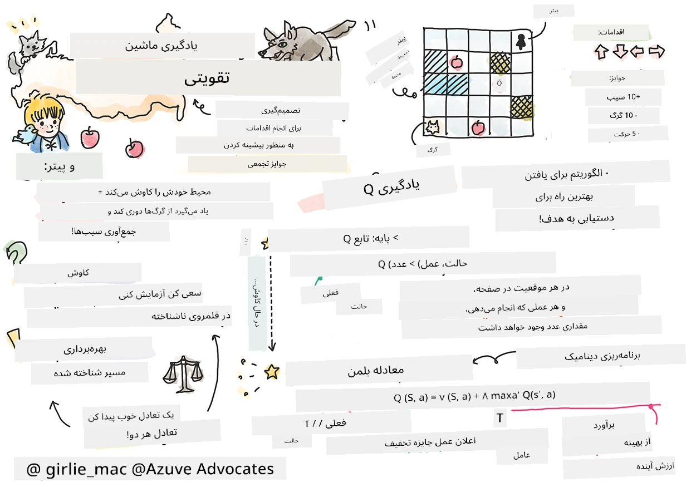
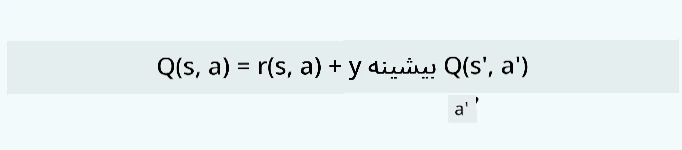
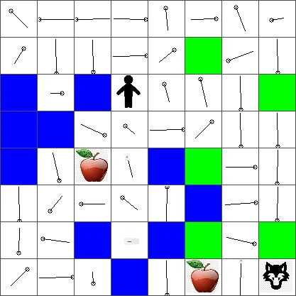

# معرفی یادگیری تقویتی و Q-یادگیری


> اسکچ‌نوت توسط [تامومی ایمورا](https://www.twitter.com/girlie_mac)

یادگیری تقویتی شامل سه مفهوم مهم است: عامل، چند حالت و مجموعه‌ای از اقدامات برای هر حالت. با اجرای یک اقدام در حالت مشخص، به عامل پاداش داده می‌شود. دوباره بازی کامپیوتری سوپر ماریو را تصور کنید. شما ماریو هستید، در یک سطح بازی، کنار لبه پرتگاه ایستاده‌اید. بالای شما یک سکه است. شما به‌عنوان ماریو، در یک سطح بازی، در موقعیت خاص ... این حالت شماست. رفتن یک قدم به سمت راست (یک اقدام) شما را از لبه پرتگاه می‌اندازد و این نمره عددی کمی به شما خواهد داد. اما فشردن دکمه پرش به شما امکان می‌دهد یک امتیاز کسب کنید و زنده بمانید. این یک نتیجه مثبت است و باید به شما نمره عددی مثبت بدهد.

با استفاده از یادگیری تقویتی و شبیه‌ساز (بازی)، می‌توانید یاد بگیرید چگونه بازی کنید تا پاداش را که زنده ماندن و کسب بیشترین امتیاز است، به حداکثر برسانید.

[](https://www.youtube.com/watch?v=lDq_en8RNOo)

> 🎥 برای شنیدن توضیحات دیمیتری درباره یادگیری تقویتی، روی تصویر بالا کلیک کنید

## [آزمون قبل از درس](https://ff-quizzes.netlify.app/en/ml/)

## پیش‌نیازها و راه‌اندازی

در این درس، با برخی کدهای پایتون آزمایش خواهیم کرد. شما باید بتوانید کد دفترچه یادداشت Jupyter این درس را روی کامپیوتر خود یا در جایی در ابر اجرا کنید.

می‌توانید دفترچه درس [این درس](https://github.com/microsoft/ML-For-Beginners/blob/main/8-Reinforcement/1-QLearning/notebook.ipynb) را باز کنید و این درس را دنبال کنید تا بسازید.

> **توجه:** اگر این کد را از ابر باز می‌کنید، باید فایل [`rlboard.py`](https://github.com/microsoft/ML-For-Beginners/blob/main/8-Reinforcement/1-QLearning/rlboard.py) که در کد دفترچه استفاده شده را نیز دریافت کنید. آن را به همان پوشه دفترچه اضافه کنید.

## مقدمه

در این درس، دنیای **[پیتر و گرگ](https://en.wikipedia.org/wiki/Peter_and_the_Wolf)** را کاوش خواهیم کرد، که از قصه‌ای موسیقایی توسط یک آهنگساز روسی، [سرگئی پروکفیف](https://en.wikipedia.org/wiki/Sergei_Prokofiev) الهام گرفته شده است. ما از **یادگیری تقویتی** استفاده خواهیم کرد تا پیتر محیط خود را کاوش کند، سیب‌های خوشمزه جمع کند و از دیدار با گرگ اجتناب کند.

یادگیری تقویتی (RL) تکنیکی است که به ما اجازه می‌دهد رفتار بهینه یک **عامل** را در یک **محیط** با انجام آزمایش‌های متعدد یاد بگیریم. عامل در این محیط باید یک **هدف** داشته باشد که توسط یک **تابع پاداش** تعریف می‌شود.

## محیط

برای سادگی، اجازه دهید دنیای پیتر را یک صفحه مربع به اندازه `width` در `height` در نظر بگیریم، مانند این:


هر خانه در این صفحه می‌تواند یکی از موارد زیر باشد:

* **زمین**، که پیتر و دیگر موجودات می‌توانند روی آن راه بروند.
* **آب**، که البته نمی‌توانید روی آن راه بروید.
* یک **درخت** یا **چمن**، مکانی برای استراحت.
* یک **سیب**، که نمایانگر چیزی است که پیتر خوشحال می‌شود آن را پیدا کند و خودش را تغذیه کند.
* یک **گرگ**، که خطرناک است و باید از آن اجتناب شود.

یک ماژول پایتون جداگانه، [`rlboard.py`](https://github.com/microsoft/ML-For-Beginners/blob/main/8-Reinforcement/1-QLearning/rlboard.py)، شامل کد کار با این محیط است. چون این کد برای درک مفاهیم ما مهم نیست، ما ماژول را وارد می‌کنیم و از آن برای ساختن نمونه صفحه استفاده می‌کنیم (بلوک کد 1):

```python
from rlboard import *

width, height = 8,8
m = Board(width,height)
m.randomize(seed=13)
m.plot()
```

این کد باید تصویری از محیط مشابه تصویر بالا چاپ کند.

## اقدامات و سیاست

در مثال ما، هدف پیتر یافتن سیب است، در حالی که از گرگ و سایر موانع اجتناب می‌کند. برای انجام این کار، او اساساً می‌تواند راه برود تا سیب را پیدا کند.

بنابراین، در هر موقعیتی، می‌تواند یکی از اقدامات زیر را انتخاب کند: بالا، پایین، چپ و راست.

ما این اقدامات را به صورت یک دیکشنری تعریف می‌کنیم و آن‌ها را به جفت‌های تغییر مختصات متناظر نگاشت می‌کنیم. برای مثال، حرکت به راست (`R`) متناظر با جفت `(1,0)` خواهد بود. (بلوک کد 2):

```python
actions = { "U" : (0,-1), "D" : (0,1), "L" : (-1,0), "R" : (1,0) }
action_idx = { a : i for i,a in enumerate(actions.keys()) }
```

به طور خلاصه، استراتژی و هدف این سناریو به شرح زیر است:

- **استراتژی**، عامل ما (پیتر) توسط چیزی به نام **سیاست** تعریف می‌شود. سیاست تابعی است که در هر حالت، اقدام را برمی‌گرداند. در مورد ما، حالت مسئله توسط صفحه همراه با موقعیت فعلی بازیکن نمایش داده می‌شود.

- **هدف**، یادگیری تقویتی در نهایت یادگیری یک سیاست خوب است که به ما اجازه دهد مسئله را به شکل موثری حل کنیم. اما به عنوان پایه، ساده‌ترین سیاست به نام **گام تصادفی** را در نظر بگیریم.

## گام تصادفی

ابتدا مشکل خود را با پیاده‌سازی استراتژی گام تصادفی حل کنیم. در گام تصادفی، ما اقدام بعدی را به طور تصادفی از میان اقدامات مجاز انتخاب می‌کنیم تا زمانی که به سیب برسیم (بلوک کد 3).

1. گام تصادفی را با کد زیر پیاده‌سازی کنید:

    ```python
    def random_policy(m):
        return random.choice(list(actions))
    
    def walk(m,policy,start_position=None):
        n = 0 # تعداد گام‌ها
        # تعیین موقعیت اولیه
        if start_position:
            m.human = start_position 
        else:
            m.random_start()
        while True:
            if m.at() == Board.Cell.apple:
                return n # موفقیت!
            if m.at() in [Board.Cell.wolf, Board.Cell.water]:
                return -1 # خورده شده توسط گرگ یا غرق شده
            while True:
                a = actions[policy(m)]
                new_pos = m.move_pos(m.human,a)
                if m.is_valid(new_pos) and m.at(new_pos)!=Board.Cell.water:
                    m.move(a) # انجام حرکت واقعی
                    break
            n+=1
    
    walk(m,random_policy)
    ```

    فراخوانی `walk` باید طول مسیر مربوطه را که می‌تواند از یک اجرا به اجرای دیگر متفاوت باشد، برگرداند.

1. آزمایش راه رفتن را بارها (مثلاً 100 بار) اجرا کنید و آمار به دست آمده را چاپ کنید (بلوک کد 4):

    ```python
    def print_statistics(policy):
        s,w,n = 0,0,0
        for _ in range(100):
            z = walk(m,policy)
            if z<0:
                w+=1
            else:
                s += z
                n += 1
        print(f"Average path length = {s/n}, eaten by wolf: {w} times")
    
    print_statistics(random_policy)
    ```

    توجه داشته باشید که طول متوسط مسیر حدود ۳۰ تا ۴۰ قدم است که نسبتاً زیاد است، با توجه به اینکه فاصله متوسط تا نزدیک‌ترین سیب حدود ۵ تا ۶ قدم است.

    همچنین می‌توانید ببینید حرکت پیتر در طی گام تصادفی چگونه است:

    

## تابع پاداش

برای هوشمندتر کردن سیاست ما، باید بفهمیم کدام حرکات «بهتر» از بقیه هستند. برای این کار، باید هدف خود را تعریف کنیم.

هدف را می‌توان به صورت یک **تابع پاداش** تعریف کرد که برای هر حالت مقداری امتیاز برمی‌گرداند. هرچه عدد بالاتر باشد، تابع پاداش بهتر است. (بلوک کد 5)

```python
move_reward = -0.1
goal_reward = 10
end_reward = -10

def reward(m,pos=None):
    pos = pos or m.human
    if not m.is_valid(pos):
        return end_reward
    x = m.at(pos)
    if x==Board.Cell.water or x == Board.Cell.wolf:
        return end_reward
    if x==Board.Cell.apple:
        return goal_reward
    return move_reward
```

نکته جالب درباره توابع پاداش این است که در اکثر موارد، *ما تنها در پایان بازی یک پاداش قابل توجه دریافت می‌کنیم*. این به این معناست که الگوریتم ما باید به نحوی قدم‌های «خوب» که به پاداش مثبت در پایان منجر می‌شوند را به خاطر بسپارد و اهمیت آن‌ها را افزایش دهد. به همین ترتیب، همه حرکاتی که به نتایج بد منتهی می‌شوند باید تشویق نشوند.

## Q-یادگیری

الگوریتمی که در اینجا بحث می‌کنیم، **Q-یادگیری** نام دارد. در این الگوریتم، سیاست توسط تابعی (یا یک ساختار داده) به نام **جدول Q** تعریف می‌شود. این جدول «خوبی» هر اقدام را در حالت داده شده ثبت می‌کند.

این جدول به نام جدول Q نامیده می‌شود زیرا معمولاً نمایش آن به صورت یک جدول یا آرایه چندبعدی راحت است. از آنجا که صفحه ما ابعاد `width` در `height` دارد، می‌توانیم جدول Q را با استفاده از آرایه numpy به شکل `width` در `height` در `len(actions)` نمایش دهیم: (بلوک کد 6)

```python
Q = np.ones((width,height,len(actions)),dtype=np.float)*1.0/len(actions)
```

توجه کنید که تمام مقادیر جدول Q را با یک مقدار مساوی، در مورد ما ۰.۲۵، مقداردهی اولیه می‌کنیم. این متناظر با سیاست «گام تصادفی» است، زیرا همه حرکات در هر حالت به یک اندازه خوب هستند. ما می‌توانیم جدول Q را به تابع `plot` بدهیم تا جدول را روی صفحه ترسیم کنیم: `m.plot(Q)`.


در مرکز هر خانه یک «فلش» وجود دارد که جهت اولویت حرکت را نشان می‌دهد. از آنجایی که همه جهت‌ها برابر هستند، یک نقطه نمایش داده می‌شود.

اکنون باید شبیه‌سازی را اجرا کنیم، محیط خود را کاوش کنیم و توزیع بهتری از مقادیر جدول Q بیاموزیم که به ما اجازه دهد مسیر به سمت سیب را سریع‌تر پیدا کنیم.

## ماهیت Q-یادگیری: معادله بلمن

وقتی شروع به حرکت می‌کنیم، هر عمل پاداش مربوط به خود را دارد، یعنی ما به طور نظری می‌توانیم اقدام بعدی را بر اساس بالاترین پاداش فوری انتخاب کنیم. اما در اکثر حالت‌ها، حرکت به هدف رسیدن به سیب نمی‌انجامد، بنابراین نمی‌توانیم فوراً تصمیم بگیریم کدام جهت بهتر است.

> به یاد داشته باشید که نتیجه فوری مهم نیست، بلکه نتیجه نهایی مهم است که در پایان شبیه‌سازی به دست می‌آوریم.

برای لحاظ کردن این پاداش با تأخیر، باید اصول **[برنامه‌ریزی پویا](https://en.wikipedia.org/wiki/Dynamic_programming)** را به کار ببریم، که به ما اجازه می‌دهد مسئله خود را به شکل بازگشتی بررسی کنیم.

فرض کنید اکنون در حالت *s* هستیم و می‌خواهیم به حالت بعدی *s'* حرکت کنیم. با انجام این کار، پاداش فوری *r(s,a)* که توسط تابع پاداش تعریف شده را دریافت می‌کنیم، به علاوه مقداری پاداش آینده. اگر فرض کنیم جدول Q ما به‌درستی «جذابیت» هر عمل را منعکس کند، آنگاه در حالت *s'* عمل *a* را انتخاب خواهیم کرد که متناظر با بیشینه مقدار *Q(s',a')* است. بنابراین بهترین پاداش آینده ممکن در حالت *s* به صورت `max`<sub>a'</sub>*Q(s',a')* تعریف می‌شود (بیشینه‌گیری در اینجا روی همه اقدامات ممکن *a'* در حالت *s'* انجام می‌شود).

این معادله، **فرمول بلمن** برای محاسبه مقدار جدول Q در حالت *s* با اقدام *a* است:



در اینجا γ همان **ضریب تخفیف** است که تعیین می‌کند چقدر باید پاداش کنونی را به پاداش آینده ترجیح دهیم و بالعکس.

## الگوریتم یادگیری

با توجه به معادله فوق، می‌توان الآن شبه‌کدی برای الگوریتم یادگیری خود نوشت:

* مقداردهی اولیه جدول Q با اعداد مساوی برای همه حالات و اقدامات
* تنظیم نرخ یادگیری α ← ۱
* تکرار شبیه‌سازی به دفعات زیاد
   1. شروع در موقعیت تصادفی
   1. تکرار
        1. انتخاب یک اقدام *a* در حالت *s*
        ۲. اجرای اقدام با حرکت به حالت جدید *s'*
        ۳. اگر شرط پایان بازی برقرار شد یا مجموع پاداش خیلی کم بود - شبیه‌سازی را متوقف کن  
        ۴. محاسبه پاداش *r* در حالت جدید
        ۵. به‌روزرسانی تابع Q بر اساس معادله بلمن: *Q(s,a)* ← *(1-α)Q(s,a)+α(r+γ max<sub>a'</sub>Q(s',a'))*
        ۶. *s* ← *s'*
        ۷. به‌روزرسانی مجموع پاداش و کاهش α.

## بهره‌برداری و کاوش

در الگوریتم بالا، ما مشخص نکردیم دقیقا در مرحله ۲.۱ چگونه باید اقدام انتخاب شود. اگر اقدام را به صورت تصادفی انتخاب کنیم، به طور تصادفی محیط را **کاوش** می‌کنیم و احتمالاً زیاد خواهیم مرد و به مناطق غیرمعمول خواهیم رفت. رویکرد جایگزین این است که **از مقادیر جدول Q که قبلاً می‌دانیم استفاده کنیم** و بهترین اقدام (با بالاترین مقدار جدول Q) را در حالت *s* انتخاب کنیم. البته این مانع از کاوش سایر حالات می‌شود و احتمال دارد راه حل بهینه را پیدا نکنیم.

بنابراین بهترین رویکرد حفظ تعادل بین کاوش و بهره‌برداری است. این کار با انتخاب اقدام در حالت *s* با احتمالات متناسب با مقادیر جدول Q امکان‌پذیر است. ابتدا که مقادیر جدول Q همه برابرند، این انتخاب مانند انتخاب تصادفی است، اما با یادگیری بیشتر درباره محیط، احتمالاً مسیر بهینه دنبال می‌شود در حالی که گاهی به عامل اجازه داده می‌شود مسیر ناکاوش شده را انتخاب کند.

## پیاده‌سازی پایتون

اکنون آماده‌ایم الگوریتم یادگیری را پیاده‌سازی کنیم. قبل از این، نیاز به تابعی داریم که اعداد دلخواه در جدول Q را به برداری از احتمالات متناظر با اقدامات تبدیل کند.

1. تابع `probs()` را ایجاد کنید:

    ```python
    def probs(v,eps=1e-4):
        v = v-v.min()+eps
        v = v/v.sum()
        return v
    ```

    چند `eps` به بردار اصلی اضافه می‌کنیم تا از تقسیم بر صفر در حالت اولیه جلوگیری شود، زمانی که همه مؤلفه‌های بردار برابرند.

الگوریتم یادگیری را در ۵۰۰۰ آزمایش، که به آن **اپوک** نیز می‌گویند، اجرا کنید: (بلوک کد 8)
```python
    for epoch in range(5000):
    
        # انتخاب نقطه اولیه
        m.random_start()
        
        # شروع به حرکت
        n=0
        cum_reward = 0
        while True:
            x,y = m.human
            v = probs(Q[x,y])
            a = random.choices(list(actions),weights=v)[0]
            dpos = actions[a]
            m.move(dpos,check_correctness=False) # ما به بازیکن اجازه می‌دهیم خارج از صفحه حرکت کند، که باعث پایان اپیزود می‌شود
            r = reward(m)
            cum_reward += r
            if r==end_reward or cum_reward < -1000:
                lpath.append(n)
                break
            alpha = np.exp(-n / 10e5)
            gamma = 0.5
            ai = action_idx[a]
            Q[x,y,ai] = (1 - alpha) * Q[x,y,ai] + alpha * (r + gamma * Q[x+dpos[0], y+dpos[1]].max())
            n+=1
```

پس از اجرای این الگوریتم، جدول Q باید با مقادیری به‌روزرسانی شده باشد که جذابیت اقدامات مختلف را در هر گام تعریف می‌کنند. می‌توانیم جدول Q را با رسم برداری در هر خانه که به سمت جهت مطلوب حرکت اشاره می‌کند، دیداری کنیم. برای سادگی به جای سر پیکان، یک دایره کوچک رسم می‌کنیم.



## بررسی سیاست

از آنجا که جدول Q «جذابیت» هر اقدام در هر حالت را لیست می‌کند، استفاده از آن برای تعریف مسیریابی موثر در دنیای ما بسیار آسان است. در ساده‌ترین حالت، می‌توانیم اقدامی را انتخاب کنیم که بیشترین مقدار جدول Q را داشته باشد: (بلوک کد 9)

```python
def qpolicy_strict(m):
        x,y = m.human
        v = probs(Q[x,y])
        a = list(actions)[np.argmax(v)]
        return a

walk(m,qpolicy_strict)
```


> اگر کد بالا را چندین بار اجرا کنید، ممکن است متوجه شوید که گاهی اوقات "گیر می‌کند" و لازم است دکمه STOP در دفترچه یادداشت را برای قطع اجرا فشار دهید. این اتفاق می‌افتد چون ممکن است شرایطی پیش بیاید که دو حالت از نظر مقدار بهینه Q-Value به یکدیگر "اشاره" کنند، در این حالت عامل به طور نامحدود بین آن دو حالت حرکت می‌کند.

## 🚀چالش

> **وظیفه ۱:** تابع `walk` را طوری تغییر دهید که طول مسیر حداکثر به تعداد معینی از گام‌ها (مثلاً ۱۰۰) محدود شود و ببینید کد بالا گاهی اوقات این مقدار را بازمی‌گرداند.

> **وظیفه ۲:** تابع `walk` را طوری تغییر دهید که به مکان‌هایی که قبلاً رفته باز نگردد. این کار از حلقه‌زدن `walk` جلوگیری می‌کند، اما با این حال ممکن است عامل در موقعیتی گرفتار شود که امکان فرار از آن را ندارد.

## ناوبری

سیاست ناوبری بهتر، همان سیاستی است که در طول آموزش استفاده کردیم، که اکتشاف و بهره‌برداری را ترکیب می‌کند. در این سیاست، هر عمل با احتمال مشخصی انتخاب می‌شود که متناسب با مقادیر در جدول Q است. این استراتژی ممکن است همچنان باعث شود عامل به موقعیتی که قبلاً کاوش کرده برگردد، اما همان‌طور که از کد زیر می‌بینید، منجر به متوسط مسیر بسیار کوتاه‌تری به مکان مطلوب می‌شود (به یاد داشته باشید که `print_statistics` شبیه‌سازی را ۱۰۰ بار اجرا می‌کند): (کد بلوک ۱۰)

```python
def qpolicy(m):
        x,y = m.human
        v = probs(Q[x,y])
        a = random.choices(list(actions),weights=v)[0]
        return a

print_statistics(qpolicy)
```

پس از اجرای این کد، باید طول متوسط مسیر بسیار کوتاه‌تری نسبت به قبل، در محدوده ۳-۶ به دست آورید.

## بررسی روند یادگیری

همانطور که اشاره کردیم، روند یادگیری تعادلی است بین اکتشاف و بهره‌برداری از دانش به‌دست آمده درباره ساختار فضای مسئله. دیدیم که نتایج یادگیری (توانایی کمک به عامل برای پیدا کردن مسیر کوتاه به هدف) بهبود یافته است، اما مشاهده رفتار طول متوسط مسیر در طی فرآیند یادگیری نیز جالب است:


نتایج یادگیری را می‌توان به شکل زیر خلاصه کرد:

- **طول متوسط مسیر افزایش می‌یابد**. آنچه اینجا می‌بینیم این است که ابتدا، طول متوسط مسیر افزایش می‌یابد. این احتمالاً به این دلیل است که وقتی هیچ اطلاعاتی درباره محیط نداریم، احتمال گرفتار شدن در حالت‌های نامطلوب مانند آب یا گرگ زیاد است. وقتی بیشتر یاد می‌گیریم و شروع به استفاده از این دانش می‌کنیم، می‌توانیم مدت زمان بیشتری محیط را کاوش کنیم، اما هنوز به خوبی نمی‌دانیم سیب‌ها دقیقاً کجا هستند.

- **طول مسیر با یادگیری کمتر می‌شود**. وقتی به اندازه کافی یاد می‌گیریم، رسیدن به هدف برای عامل آسان‌تر می‌شود و طول مسیر شروع به کاهش می‌کند. با این حال، هنوز هم آماده اکتشاف هستیم، پس اغلب از بهترین مسیر منحرف شده و گزینه‌های جدیدی را کاوش می‌کنیم که مسیر را از حالت بهینه طولانی‌تر می‌کند.

- **طول به طور ناگهانی افزایش می‌یابد**. همچنین در این نمودار مشاهده می‌کنیم که در نقطه‌ای طول مسیر به طور ناگهانی افزایش یافته است. این نشان‌دهنده طبیعت استوکستیک فرآیند است و اینکه ممکن است در برخی مواقع ضرایب جدول Q را با مقادیر جدید بازنویسی کرده و "خراب" کنیم. این موضوع به طور ایده‌آل باید با کاهش نرخ یادگیری به حداقل برسد (مثلاً در پایان آموزش، تنها مقادیر جدول Q را با مقدار کمی تنظیم کنیم).

به طور کلی، مهم است که به خاطر بسپاریم موفقیت و کیفیت فرآیند یادگیری به طور قابل توجهی به پارامترهایی مانند نرخ یادگیری، کاهش نرخ یادگیری و ضریب تخفیف بستگی دارد. این پارامترها اغلب به عنوان **ابرپارامترها** شناخته می‌شوند، تا آنها را از **پارامترها** که در طول آموزش بهینه می‌شوند (مثلاً ضرایب جدول Q) متمایز کنند. فرایند یافتن بهترین مقادیر برای ابرپارامترها، **بهینه‌سازی ابرپارامتر** نامیده می‌شود و موضوع جداگانه‌ای است.

## [آزمون پس از آموزش](https://ff-quizzes.netlify.app/en/ml/)

## تمرین
[دنیایی واقع‌گرایانه‌تر](assignment.md)

---

<!-- CO-OP TRANSLATOR DISCLAIMER START -->
**سلب مسئولیت**:
این سند با استفاده از سرویس ترجمه هوش مصنوعی [Co-op Translator](https://github.com/Azure/co-op-translator) ترجمه شده است. در حالی که ما در تلاش برای دقت هستیم، لطفاً توجه داشته باشید که ترجمه‌های خودکار ممکن است شامل خطاها یا نادرستی‌هایی باشند. سند اصلی به زبان مادری خود باید به عنوان منبع معتبر در نظر گرفته شود. برای اطلاعات حیاتی، ترجمه حرفه‌ای انسانی توصیه می‌شود. ما در قبال هرگونه سوء تفاهم یا برداشت نادرست ناشی از استفاده از این ترجمه مسئولیتی نداریم.
<!-- CO-OP TRANSLATOR DISCLAIMER END -->