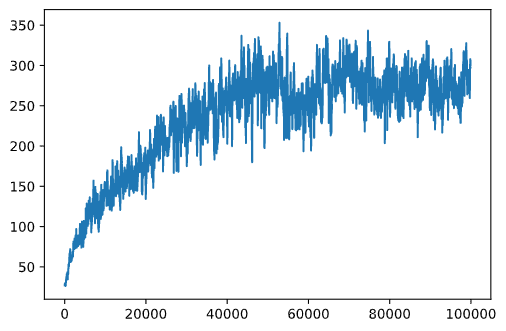

<!--
CO_OP_TRANSLATOR_METADATA:
{
  "original_hash": "9660fbd80845c59c15715cb418cd6e23",
  "translation_date": "2025-09-04T00:28:31+00:00",
  "source_file": "8-Reinforcement/2-Gym/README.md",
  "language_code": "fa"
}
-->
# اسکیت با CartPole

مسئله‌ای که در درس قبلی حل کردیم ممکن است شبیه به یک مسئله ساده و غیرکاربردی به نظر برسد. اما اینطور نیست، زیرا بسیاری از مسائل دنیای واقعی نیز چنین سناریویی دارند - از جمله بازی شطرنج یا Go. این مسائل مشابه هستند، زیرا ما نیز یک صفحه با قوانین مشخص و یک **وضعیت گسسته** داریم.

## [آزمون پیش از درس](https://gray-sand-07a10f403.1.azurestaticapps.net/quiz/47/)

## مقدمه

در این درس، ما همان اصول یادگیری Q را به مسئله‌ای با **وضعیت پیوسته** اعمال خواهیم کرد، یعنی وضعیتی که با یک یا چند عدد حقیقی مشخص می‌شود. ما با مسئله زیر سروکار خواهیم داشت:

> **مسئله**: اگر پیتر بخواهد از دست گرگ فرار کند، باید بتواند سریع‌تر حرکت کند. ما خواهیم دید که چگونه پیتر می‌تواند اسکیت کردن را یاد بگیرد، به خصوص حفظ تعادل، با استفاده از یادگیری Q.


> پیتر و دوستانش خلاقیت به خرج می‌دهند تا از دست گرگ فرار کنند! تصویر از [جن لوپر](https://twitter.com/jenlooper)

ما از نسخه ساده‌شده‌ای از حفظ تعادل که به عنوان مسئله **CartPole** شناخته می‌شود استفاده خواهیم کرد. در دنیای CartPole، ما یک اسلایدر افقی داریم که می‌تواند به چپ یا راست حرکت کند و هدف این است که یک میله عمودی را روی اسلایدر متعادل نگه داریم.

## پیش‌نیازها

در این درس، ما از کتابخانه‌ای به نام **OpenAI Gym** برای شبیه‌سازی **محیط‌های مختلف** استفاده خواهیم کرد. شما می‌توانید کد این درس را به صورت محلی (مثلاً از Visual Studio Code) اجرا کنید، که در این صورت شبیه‌سازی در یک پنجره جدید باز می‌شود. هنگام اجرای کد به صورت آنلاین، ممکن است نیاز به انجام تغییراتی در کد داشته باشید، همانطور که [اینجا](https://towardsdatascience.com/rendering-openai-gym-envs-on-binder-and-google-colab-536f99391cc7) توضیح داده شده است.

## OpenAI Gym

در درس قبلی، قوانین بازی و وضعیت توسط کلاس `Board` که خودمان تعریف کرده بودیم مشخص می‌شد. در اینجا ما از یک **محیط شبیه‌سازی خاص** استفاده خواهیم کرد که فیزیک پشت میله متعادل را شبیه‌سازی می‌کند. یکی از محبوب‌ترین محیط‌های شبیه‌سازی برای آموزش الگوریتم‌های یادگیری تقویتی، [Gym](https://gym.openai.com/) است که توسط [OpenAI](https://openai.com/) نگهداری می‌شود. با استفاده از این Gym می‌توانیم **محیط‌های مختلفی** از شبیه‌سازی CartPole تا بازی‌های آتاری ایجاد کنیم.

> **توجه**: می‌توانید سایر محیط‌های موجود در OpenAI Gym را [اینجا](https://gym.openai.com/envs/#classic_control) مشاهده کنید.

ابتدا، Gym را نصب کرده و کتابخانه‌های مورد نیاز را وارد می‌کنیم (کد بلاک 1):

```python
import sys
!{sys.executable} -m pip install gym 

import gym
import matplotlib.pyplot as plt
import numpy as np
import random
```

## تمرین - مقداردهی اولیه به محیط CartPole

برای کار با مسئله تعادل CartPole، باید محیط مربوطه را مقداردهی اولیه کنیم. هر محیط با موارد زیر مرتبط است:

- **فضای مشاهده** که ساختار اطلاعاتی را که از محیط دریافت می‌کنیم تعریف می‌کند. برای مسئله CartPole، ما موقعیت میله، سرعت و برخی مقادیر دیگر را دریافت می‌کنیم.

- **فضای عمل** که اقدامات ممکن را تعریف می‌کند. در مورد ما، فضای عمل گسسته است و شامل دو عمل - **چپ** و **راست** می‌شود. (کد بلاک 2)

1. برای مقداردهی اولیه، کد زیر را تایپ کنید:

    ```python
    env = gym.make("CartPole-v1")
    print(env.action_space)
    print(env.observation_space)
    print(env.action_space.sample())
    ```

برای مشاهده نحوه کار محیط، بیایید یک شبیه‌سازی کوتاه برای 100 مرحله اجرا کنیم. در هر مرحله، یکی از اقدامات را برای انجام دادن ارائه می‌دهیم - در این شبیه‌سازی، ما فقط به صورت تصادفی یک اقدام از `action_space` انتخاب می‌کنیم.

1. کد زیر را اجرا کنید و ببینید چه نتیجه‌ای می‌دهد.

    ✅ به یاد داشته باشید که ترجیحاً این کد را روی نصب محلی پایتون اجرا کنید! (کد بلاک 3)

    ```python
    env.reset()
    
    for i in range(100):
       env.render()
       env.step(env.action_space.sample())
    env.close()
    ```

    شما باید چیزی مشابه این تصویر ببینید:

    

1. در طول شبیه‌سازی، ما نیاز داریم که مشاهداتی دریافت کنیم تا تصمیم بگیریم چگونه عمل کنیم. در واقع، تابع `step` مشاهدات فعلی، یک تابع پاداش و یک پرچم `done` را برمی‌گرداند که نشان می‌دهد آیا ادامه شبیه‌سازی منطقی است یا خیر: (کد بلاک 4)

    ```python
    env.reset()
    
    done = False
    while not done:
       env.render()
       obs, rew, done, info = env.step(env.action_space.sample())
       print(f"{obs} -> {rew}")
    env.close()
    ```

    شما باید چیزی شبیه به این را در خروجی نوت‌بوک ببینید:

    ```text
    [ 0.03403272 -0.24301182  0.02669811  0.2895829 ] -> 1.0
    [ 0.02917248 -0.04828055  0.03248977  0.00543839] -> 1.0
    [ 0.02820687  0.14636075  0.03259854 -0.27681916] -> 1.0
    [ 0.03113408  0.34100283  0.02706215 -0.55904489] -> 1.0
    [ 0.03795414  0.53573468  0.01588125 -0.84308041] -> 1.0
    ...
    [ 0.17299878  0.15868546 -0.20754175 -0.55975453] -> 1.0
    [ 0.17617249  0.35602306 -0.21873684 -0.90998894] -> 1.0
    ```

    بردار مشاهده‌ای که در هر مرحله از شبیه‌سازی بازگردانده می‌شود شامل مقادیر زیر است:
    - موقعیت چرخ دستی
    - سرعت چرخ دستی
    - زاویه میله
    - نرخ چرخش میله

1. حداقل و حداکثر مقدار این اعداد را دریافت کنید: (کد بلاک 5)

    ```python
    print(env.observation_space.low)
    print(env.observation_space.high)
    ```

    همچنین ممکن است متوجه شوید که مقدار پاداش در هر مرحله شبیه‌سازی همیشه 1 است. این به این دلیل است که هدف ما زنده ماندن برای مدت زمان طولانی‌تر است، یعنی نگه داشتن میله در موقعیت عمودی معقول برای طولانی‌ترین مدت ممکن.

    ✅ در واقع، شبیه‌سازی CartPole حل‌شده در نظر گرفته می‌شود اگر بتوانیم میانگین پاداش 195 را در 100 آزمایش متوالی به دست آوریم.

## گسسته‌سازی وضعیت

در یادگیری Q، ما نیاز داریم که یک جدول Q بسازیم که مشخص کند در هر وضعیت چه کاری انجام دهیم. برای انجام این کار، وضعیت باید **گسسته** باشد، به عبارت دقیق‌تر، باید شامل تعداد محدودی از مقادیر گسسته باشد. بنابراین، ما باید به نوعی مشاهدات خود را **گسسته‌سازی** کنیم و آنها را به مجموعه‌ای محدود از وضعیت‌ها نگاشت کنیم.

روش‌های مختلفی برای انجام این کار وجود دارد:

- **تقسیم به بازه‌ها**. اگر بازه یک مقدار خاص را بدانیم، می‌توانیم این بازه را به تعدادی **بازه کوچک‌تر** تقسیم کنیم و سپس مقدار را با شماره بازه‌ای که به آن تعلق دارد جایگزین کنیم. این کار را می‌توان با استفاده از متد [`digitize`](https://numpy.org/doc/stable/reference/generated/numpy.digitize.html) در numpy انجام داد. در این حالت، ما دقیقاً اندازه وضعیت را می‌دانیم، زیرا به تعداد بازه‌هایی که برای گسسته‌سازی انتخاب می‌کنیم بستگی دارد.

✅ ما می‌توانیم از درون‌یابی خطی برای آوردن مقادیر به یک بازه محدود (مثلاً از -20 تا 20) استفاده کنیم و سپس اعداد را با گرد کردن به اعداد صحیح تبدیل کنیم. این روش کنترل کمتری بر اندازه وضعیت به ما می‌دهد، به خصوص اگر بازه‌های دقیق مقادیر ورودی را ندانیم. برای مثال، در مورد ما، 2 مورد از 4 مقدار ورودی هیچ حد بالا/پایینی ندارند که ممکن است منجر به تعداد نامحدودی از وضعیت‌ها شود.

در مثال ما، از روش دوم استفاده خواهیم کرد. همانطور که بعداً متوجه خواهید شد، با وجود عدم تعریف حد بالا/پایین، این مقادیر به ندرت مقادیر خارج از بازه‌های محدود خاصی می‌گیرند، بنابراین آن وضعیت‌هایی با مقادیر افراطی بسیار نادر خواهند بود.

1. در اینجا تابعی است که مشاهدات مدل ما را می‌گیرد و یک تاپل از 4 مقدار صحیح تولید می‌کند: (کد بلاک 6)

    ```python
    def discretize(x):
        return tuple((x/np.array([0.25, 0.25, 0.01, 0.1])).astype(np.int))
    ```

1. بیایید روش دیگری برای گسسته‌سازی با استفاده از بازه‌ها را نیز بررسی کنیم: (کد بلاک 7)

    ```python
    def create_bins(i,num):
        return np.arange(num+1)*(i[1]-i[0])/num+i[0]
    
    print("Sample bins for interval (-5,5) with 10 bins\n",create_bins((-5,5),10))
    
    ints = [(-5,5),(-2,2),(-0.5,0.5),(-2,2)] # intervals of values for each parameter
    nbins = [20,20,10,10] # number of bins for each parameter
    bins = [create_bins(ints[i],nbins[i]) for i in range(4)]
    
    def discretize_bins(x):
        return tuple(np.digitize(x[i],bins[i]) for i in range(4))
    ```

1. حالا یک شبیه‌سازی کوتاه اجرا کنیم و این مقادیر گسسته محیط را مشاهده کنیم. می‌توانید هر دو `discretize` و `discretize_bins` را امتحان کنید و ببینید آیا تفاوتی وجود دارد.

    ✅ `discretize_bins` شماره بازه را که از 0 شروع می‌شود بازمی‌گرداند. بنابراین برای مقادیر متغیر ورودی در اطراف 0، عددی از وسط بازه (10) بازمی‌گرداند. در `discretize`، ما به بازه مقادیر خروجی اهمیت ندادیم و اجازه دادیم که منفی باشند، بنابراین مقادیر وضعیت جابجا نشده‌اند و 0 معادل 0 است. (کد بلاک 8)

    ```python
    env.reset()
    
    done = False
    while not done:
       #env.render()
       obs, rew, done, info = env.step(env.action_space.sample())
       #print(discretize_bins(obs))
       print(discretize(obs))
    env.close()
    ```

    ✅ خطی که با `env.render` شروع می‌شود را لغو کامنت کنید اگر می‌خواهید ببینید محیط چگونه اجرا می‌شود. در غیر این صورت می‌توانید آن را در پس‌زمینه اجرا کنید که سریع‌تر است. ما از این اجرای "نامرئی" در طول فرآیند یادگیری Q استفاده خواهیم کرد.

## ساختار جدول Q

در درس قبلی، وضعیت یک جفت عدد ساده از 0 تا 8 بود و بنابراین نمایش جدول Q با یک آرایه numpy با شکل 8x8x2 راحت بود. اگر از گسسته‌سازی با بازه‌ها استفاده کنیم، اندازه بردار وضعیت ما نیز مشخص است، بنابراین می‌توانیم از همان روش استفاده کنیم و وضعیت را با یک آرایه با شکل 20x20x10x10x2 نمایش دهیم (در اینجا 2 بعد فضای عمل است و ابعاد اول مربوط به تعداد بازه‌هایی است که برای هر یک از پارامترهای فضای مشاهده انتخاب کرده‌ایم).

با این حال، گاهی اوقات ابعاد دقیق فضای مشاهده مشخص نیست. در مورد تابع `discretize`، ما ممکن است هرگز مطمئن نباشیم که وضعیت ما در محدوده‌های خاصی باقی می‌ماند، زیرا برخی از مقادیر اصلی محدود نیستند. بنابراین، ما از رویکرد کمی متفاوت استفاده خواهیم کرد و جدول Q را با یک دیکشنری نمایش می‌دهیم.

1. از جفت *(state, action)* به عنوان کلید دیکشنری استفاده کنید و مقدار مربوط به مقدار ورودی جدول Q باشد. (کد بلاک 9)

    ```python
    Q = {}
    actions = (0,1)
    
    def qvalues(state):
        return [Q.get((state,a),0) for a in actions]
    ```

    در اینجا ما همچنین تابع `qvalues()` را تعریف می‌کنیم که لیستی از مقادیر جدول Q را برای یک وضعیت مشخص که مربوط به تمام اقدامات ممکن است بازمی‌گرداند. اگر ورودی در جدول Q موجود نباشد، مقدار پیش‌فرض 0 را بازمی‌گردانیم.

## بیایید یادگیری Q را شروع کنیم

حالا آماده‌ایم که به پیتر یاد بدهیم چگونه تعادل را حفظ کند!

1. ابتدا، برخی از ابرپارامترها را تنظیم کنیم: (کد بلاک 10)

    ```python
    # hyperparameters
    alpha = 0.3
    gamma = 0.9
    epsilon = 0.90
    ```

    در اینجا، `alpha` **نرخ یادگیری** است که مشخص می‌کند تا چه حد باید مقادیر فعلی جدول Q را در هر مرحله تنظیم کنیم. در درس قبلی با مقدار 1 شروع کردیم و سپس `alpha` را در طول آموزش به مقادیر پایین‌تر کاهش دادیم. در این مثال، برای سادگی آن را ثابت نگه می‌داریم و شما می‌توانید بعداً با تنظیم مقادیر `alpha` آزمایش کنید.

    `gamma` **ضریب تخفیف** است که نشان می‌دهد تا چه حد باید پاداش آینده را نسبت به پاداش فعلی اولویت دهیم.

    `epsilon` **عامل اکتشاف/بهره‌برداری** است که تعیین می‌کند آیا باید اکتشاف را به بهره‌برداری ترجیح دهیم یا برعکس. در الگوریتم ما، در درصد `epsilon` موارد، اقدام بعدی را بر اساس مقادیر جدول Q انتخاب می‌کنیم و در تعداد باقی‌مانده موارد، یک اقدام تصادفی اجرا می‌کنیم. این به ما امکان می‌دهد مناطقی از فضای جستجو را که قبلاً ندیده‌ایم کشف کنیم.

    ✅ از نظر تعادل - انتخاب اقدام تصادفی (اکتشاف) مانند یک ضربه تصادفی در جهت اشتباه عمل می‌کند و میله باید یاد بگیرد که چگونه تعادل را از این "اشتباهات" بازیابی کند.

### بهبود الگوریتم

ما همچنین می‌توانیم دو بهبود در الگوریتم خود از درس قبلی ایجاد کنیم:

- **محاسبه میانگین پاداش تجمعی**، در طول تعدادی شبیه‌سازی. ما پیشرفت را هر 5000 تکرار چاپ خواهیم کرد و پاداش تجمعی خود را در آن بازه زمانی میانگین می‌گیریم. این بدان معناست که اگر بیش از 195 امتیاز کسب کنیم - می‌توانیم مسئله را حل‌شده در نظر بگیریم، حتی با کیفیتی بالاتر از حد مورد نیاز.

- **محاسبه حداکثر نتیجه تجمعی میانگین**، `Qmax`، و جدول Q مربوط به آن نتیجه را ذخیره خواهیم کرد. وقتی آموزش را اجرا می‌کنید، متوجه خواهید شد که گاهی اوقات نتیجه تجمعی میانگین شروع به کاهش می‌کند و ما می‌خواهیم مقادیر جدول Q را که مربوط به بهترین مدل مشاهده‌شده در طول آموزش است حفظ کنیم.

1. تمام پاداش‌های تجمعی را در هر شبیه‌سازی در بردار `rewards` برای رسم نمودار بعدی جمع‌آوری کنید. (کد بلاک 11)

    ```python
    def probs(v,eps=1e-4):
        v = v-v.min()+eps
        v = v/v.sum()
        return v
    
    Qmax = 0
    cum_rewards = []
    rewards = []
    for epoch in range(100000):
        obs = env.reset()
        done = False
        cum_reward=0
        # == do the simulation ==
        while not done:
            s = discretize(obs)
            if random.random()<epsilon:
                # exploitation - chose the action according to Q-Table probabilities
                v = probs(np.array(qvalues(s)))
                a = random.choices(actions,weights=v)[0]
            else:
                # exploration - randomly chose the action
                a = np.random.randint(env.action_space.n)
    
            obs, rew, done, info = env.step(a)
            cum_reward+=rew
            ns = discretize(obs)
            Q[(s,a)] = (1 - alpha) * Q.get((s,a),0) + alpha * (rew + gamma * max(qvalues(ns)))
        cum_rewards.append(cum_reward)
        rewards.append(cum_reward)
        # == Periodically print results and calculate average reward ==
        if epoch%5000==0:
            print(f"{epoch}: {np.average(cum_rewards)}, alpha={alpha}, epsilon={epsilon}")
            if np.average(cum_rewards) > Qmax:
                Qmax = np.average(cum_rewards)
                Qbest = Q
            cum_rewards=[]
    ```

آنچه ممکن است از این نتایج متوجه شوید:

- **نزدیک به هدف ما**. ما بسیار نزدیک به دستیابی به هدف کسب 195 پاداش تجمعی در بیش از 100 اجرای متوالی شبیه‌سازی هستیم، یا ممکن است واقعاً به آن دست یافته باشیم! حتی اگر اعداد کمتری کسب کنیم، هنوز نمی‌دانیم، زیرا ما میانگین را در طول 5000 اجرا می‌گیریم و فقط 100 اجرا در معیار رسمی مورد نیاز است.

- **پاداش شروع به کاهش می‌کند**. گاهی اوقات پاداش شروع به کاهش می‌کند، که به این معنی است که ممکن است مقادیر یادگرفته‌شده در جدول Q را با مقادیری که وضعیت را بدتر می‌کنند "خراب" کنیم.

این مشاهده با رسم پیشرفت آموزش واضح‌تر می‌شود.

## رسم پیشرفت آموزش

در طول آموزش، ما مقدار پاداش تجمعی را در هر یک از تکرارها در بردار `rewards` جمع‌آوری کرده‌ایم. اینجا نحوه نمایش آن در برابر شماره تکرار آمده است:

```python
plt.plot(rewards)
```


از این نمودار، نمی‌توان چیزی گفت، زیرا به دلیل ماهیت فرآیند آموزش تصادفی، طول جلسات آموزش بسیار متفاوت است. برای درک بهتر این نمودار، می‌توانیم **میانگین متحرک** را در طول یک سری آزمایش‌ها، مثلاً 100، محاسبه کنیم. این کار را می‌توان به راحتی با استفاده از `np.convolve` انجام داد: (کد بلاک 12)

```python
def running_average(x,window):
    return np.convolve(x,np.ones(window)/window,mode='valid')

plt.plot(running_average(rewards,100))
```



## تغییر ابرپارامترها

برای پایدارتر کردن یادگیری، منطقی است که برخی از ابرپارامترهای خود را در طول آموزش تنظیم کنیم. به طور خاص:

- **برای نرخ یادگیری**، `alpha`، می‌توانیم با مقادیر نزدیک به 1 شروع کنیم و سپس این پارامتر را کاهش دهیم. با گذشت زمان، ما مقادیر احتمالی خوبی در جدول Q خواهیم داشت و بنابراین باید آنها را به آرامی تنظیم کنیم و نه اینکه کاملاً با مقادیر جدید بازنویسی کنیم.

- **افزایش epsilon**. ممکن است بخواهیم `epsilon` را به آرامی افزایش دهیم تا کمتر اکتشاف کنیم و بیشتر بهره‌برداری کنیم. احتمالاً منطقی است که با مقدار پایین‌تر `epsilon` شروع کنیم و به تدریج به نزدیک 1 برسیم.
> **وظیفه ۱**: با مقادیر هایپرپارامترها بازی کنید و ببینید آیا می‌توانید پاداش تجمعی بیشتری کسب کنید. آیا به بالای ۱۹۵ می‌رسید؟
> **وظیفه ۲**: برای حل رسمی مسئله، باید میانگین پاداش ۱۹۵ را در طول ۱۰۰ اجرای متوالی به دست آورید. این مقدار را در طول آموزش اندازه‌گیری کنید و مطمئن شوید که مسئله را به طور رسمی حل کرده‌اید!

## مشاهده نتیجه در عمل

جالب است که ببینیم مدل آموزش‌دیده چگونه رفتار می‌کند. بیایید شبیه‌سازی را اجرا کنیم و همان استراتژی انتخاب عمل را که در طول آموزش استفاده کردیم دنبال کنیم، یعنی نمونه‌گیری بر اساس توزیع احتمالی در Q-Table: (بلاک کد ۱۳)

```python
obs = env.reset()
done = False
while not done:
   s = discretize(obs)
   env.render()
   v = probs(np.array(qvalues(s)))
   a = random.choices(actions,weights=v)[0]
   obs,_,done,_ = env.step(a)
env.close()
```

شما باید چیزی شبیه به این ببینید:


---

## 🚀چالش

> **وظیفه ۳**: در اینجا، ما از نسخه نهایی Q-Table استفاده کردیم که ممکن است بهترین نسخه نباشد. به یاد داشته باشید که ما بهترین Q-Table را در متغیر `Qbest` ذخیره کرده‌ایم! همین مثال را با بهترین Q-Table امتحان کنید، با کپی کردن `Qbest` به `Q` و ببینید آیا تفاوتی مشاهده می‌کنید.

> **وظیفه ۴**: در اینجا ما بهترین عمل را در هر مرحله انتخاب نمی‌کردیم، بلکه بر اساس توزیع احتمالی مربوطه نمونه‌گیری می‌کردیم. آیا منطقی‌تر است که همیشه بهترین عمل را با بالاترین مقدار Q-Table انتخاب کنیم؟ این کار را می‌توان با استفاده از تابع `np.argmax` انجام داد تا شماره عمل مربوط به بالاترین مقدار Q-Table را پیدا کنید. این استراتژی را پیاده‌سازی کنید و ببینید آیا تعادل بهبود می‌یابد.

## [آزمون پس از درس](https://gray-sand-07a10f403.1.azurestaticapps.net/quiz/48/)

## تکلیف
[آموزش یک ماشین کوهستانی](assignment.md)

## نتیجه‌گیری

ما اکنون یاد گرفته‌ایم که چگونه عوامل را آموزش دهیم تا فقط با ارائه یک تابع پاداش که حالت مطلوب بازی را تعریف می‌کند و با دادن فرصت به آن‌ها برای جستجوی هوشمندانه فضای جستجو، به نتایج خوبی دست یابند. ما الگوریتم Q-Learning را با موفقیت در موارد محیط‌های گسسته و پیوسته، اما با اعمال گسسته، به کار برده‌ایم.

مهم است که همچنین شرایطی را مطالعه کنیم که در آن حالت عمل نیز پیوسته باشد و فضای مشاهده بسیار پیچیده‌تر باشد، مانند تصویر صفحه بازی آتاری. در این مسائل، اغلب نیاز داریم از تکنیک‌های قدرتمندتر یادگیری ماشین، مانند شبکه‌های عصبی، استفاده کنیم تا به نتایج خوبی برسیم. این موضوعات پیشرفته‌تر، موضوع دوره پیشرفته‌تر هوش مصنوعی ما خواهد بود.

---

**سلب مسئولیت**:  
این سند با استفاده از سرویس ترجمه هوش مصنوعی [Co-op Translator](https://github.com/Azure/co-op-translator) ترجمه شده است. در حالی که ما تلاش می‌کنیم دقت را حفظ کنیم، لطفاً توجه داشته باشید که ترجمه‌های خودکار ممکن است شامل خطاها یا نادرستی‌ها باشند. سند اصلی به زبان اصلی آن باید به عنوان منبع معتبر در نظر گرفته شود. برای اطلاعات حساس، توصیه می‌شود از ترجمه حرفه‌ای انسانی استفاده کنید. ما مسئولیتی در قبال سوء تفاهم‌ها یا تفسیرهای نادرست ناشی از استفاده از این ترجمه نداریم.