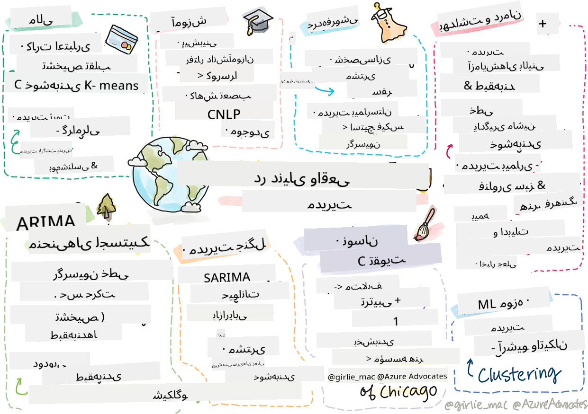

<!--
CO_OP_TRANSLATOR_METADATA:
{
  "original_hash": "20f18ff565638be615df4174858e4a7f",
  "translation_date": "2025-09-03T23:17:50+00:00",
  "source_file": "9-Real-World/1-Applications/README.md",
  "language_code": "fa"
}
-->
# پس‌نوشت: یادگیری ماشین در دنیای واقعی

> اسکیچ‌نوت از [تومومی ایمورا](https://www.twitter.com/girlie_mac)

در این دوره آموزشی، شما روش‌های مختلفی برای آماده‌سازی داده‌ها برای آموزش و ایجاد مدل‌های یادگیری ماشین یاد گرفتید. شما مجموعه‌ای از مدل‌های کلاسیک رگرسیون، خوشه‌بندی، طبقه‌بندی، پردازش زبان طبیعی و سری‌های زمانی را ساختید. تبریک می‌گویم! حالا ممکن است از خود بپرسید که هدف از این همه چیست... این مدل‌ها در دنیای واقعی چه کاربردهایی دارند؟

در حالی که توجه زیادی در صنعت به هوش مصنوعی (AI) معطوف شده است که معمولاً از یادگیری عمیق استفاده می‌کند، مدل‌های کلاسیک یادگیری ماشین همچنان کاربردهای ارزشمندی دارند. حتی ممکن است شما همین حالا از برخی از این کاربردها استفاده کنید! در این درس، بررسی خواهید کرد که چگونه هشت صنعت و حوزه موضوعی مختلف از این نوع مدل‌ها برای بهبود عملکرد، قابلیت اطمینان، هوشمندی و ارزشمندی برنامه‌های خود برای کاربران استفاده می‌کنند.

## [آزمون پیش از درس](https://gray-sand-07a10f403.1.azurestaticapps.net/quiz/49/)

## 💰 امور مالی

بخش مالی فرصت‌های زیادی برای یادگیری ماشین ارائه می‌دهد. بسیاری از مسائل در این حوزه به خوبی با استفاده از یادگیری ماشین مدل‌سازی و حل می‌شوند.

### تشخیص تقلب در کارت اعتباری

ما قبلاً در دوره درباره [خوشه‌بندی k-means](../../5-Clustering/2-K-Means/README.md) یاد گرفتیم، اما چگونه می‌توان از آن برای حل مسائل مربوط به تقلب در کارت اعتباری استفاده کرد؟

خوشه‌بندی k-means در تکنیکی به نام **تشخیص نقاط پرت** برای شناسایی تقلب در کارت اعتباری مفید است. نقاط پرت یا انحرافات در مشاهدات یک مجموعه داده می‌توانند به ما بگویند که آیا یک کارت اعتباری به صورت عادی استفاده می‌شود یا اتفاق غیرمعمولی در حال رخ دادن است. همان‌طور که در مقاله زیر نشان داده شده است، می‌توانید داده‌های کارت اعتباری را با استفاده از الگوریتم خوشه‌بندی k-means مرتب کنید و هر تراکنش را بر اساس میزان پرت بودن آن به یک خوشه اختصاص دهید. سپس می‌توانید خوشه‌های پرریسک‌تر را برای شناسایی تراکنش‌های تقلبی یا قانونی ارزیابی کنید.
[منبع](https://citeseerx.ist.psu.edu/viewdoc/download?doi=10.1.1.680.1195&rep=rep1&type=pdf)

### مدیریت ثروت

در مدیریت ثروت، یک فرد یا شرکت سرمایه‌گذاری‌ها را به نمایندگی از مشتریان خود مدیریت می‌کند. وظیفه آن‌ها حفظ و رشد ثروت در بلندمدت است، بنابراین انتخاب سرمایه‌گذاری‌هایی که عملکرد خوبی دارند ضروری است.

یکی از روش‌های ارزیابی عملکرد یک سرمایه‌گذاری خاص استفاده از رگرسیون آماری است. [رگرسیون خطی](../../2-Regression/1-Tools/README.md) ابزاری ارزشمند برای درک عملکرد یک صندوق نسبت به یک معیار است. همچنین می‌توانیم استنباط کنیم که آیا نتایج رگرسیون از نظر آماری معنادار هستند یا خیر و این نتایج چقدر بر سرمایه‌گذاری‌های مشتری تأثیر می‌گذارند. حتی می‌توانید تحلیل خود را با استفاده از رگرسیون چندگانه گسترش دهید، جایی که عوامل ریسک اضافی نیز در نظر گرفته می‌شوند. برای مثالی از نحوه عملکرد این روش برای یک صندوق خاص، مقاله زیر را درباره ارزیابی عملکرد صندوق با استفاده از رگرسیون بررسی کنید.
[منبع](http://www.brightwoodventures.com/evaluating-fund-performance-using-regression/)

## 🎓 آموزش

بخش آموزش نیز حوزه‌ای بسیار جالب است که می‌توان یادگیری ماشین را در آن به کار برد. مسائل جالبی برای حل وجود دارند، مانند شناسایی تقلب در آزمون‌ها یا مقالات و مدیریت سوگیری، چه عمدی و چه غیرعمدی، در فرآیند تصحیح.

### پیش‌بینی رفتار دانش‌آموزان

[Coursera](https://coursera.com)، یک ارائه‌دهنده دوره‌های آنلاین باز، یک وبلاگ فنی عالی دارد که در آن درباره بسیاری از تصمیمات مهندسی بحث می‌کنند. در این مطالعه موردی، آن‌ها یک خط رگرسیون را ترسیم کردند تا هرگونه همبستگی بین امتیاز پایین NPS (شاخص ترویج‌کننده خالص) و حفظ یا ترک دوره را بررسی کنند.
[منبع](https://medium.com/coursera-engineering/controlled-regression-quantifying-the-impact-of-course-quality-on-learner-retention-31f956bd592a)

### کاهش سوگیری

[Grammarly](https://grammarly.com)، یک دستیار نوشتاری که خطاهای املایی و گرامری را بررسی می‌کند، از سیستم‌های پیشرفته [پردازش زبان طبیعی](../../6-NLP/README.md) در محصولات خود استفاده می‌کند. آن‌ها یک مطالعه موردی جالب در وبلاگ فنی خود منتشر کردند که در آن درباره نحوه مقابله با سوگیری جنسیتی در یادگیری ماشین صحبت کردند، موضوعی که در [درس مقدماتی عدالت](../../1-Introduction/3-fairness/README.md) ما یاد گرفتید.
[منبع](https://www.grammarly.com/blog/engineering/mitigating-gender-bias-in-autocorrect/)

## 👜 خرده‌فروشی

بخش خرده‌فروشی قطعاً می‌تواند از یادگیری ماشین بهره‌مند شود، از ایجاد یک سفر مشتری بهتر گرفته تا مدیریت بهینه موجودی.

### شخصی‌سازی سفر مشتری

در Wayfair، شرکتی که کالاهای خانگی مانند مبلمان می‌فروشد، کمک به مشتریان برای یافتن محصولات مناسب برای سلیقه و نیازهایشان بسیار مهم است. در این مقاله، مهندسان شرکت توضیح می‌دهند که چگونه از یادگیری ماشین و پردازش زبان طبیعی برای "نمایش نتایج مناسب برای مشتریان" استفاده می‌کنند. به طور خاص، موتور هدف‌گذاری پرسش آن‌ها برای استفاده از استخراج موجودیت، آموزش طبقه‌بندی‌کننده، استخراج دارایی و نظر، و برچسب‌گذاری احساسات در بررسی‌های مشتری ساخته شده است. این یک مورد استفاده کلاسیک از نحوه عملکرد پردازش زبان طبیعی در خرده‌فروشی آنلاین است.
[منبع](https://www.aboutwayfair.com/tech-innovation/how-we-use-machine-learning-and-natural-language-processing-to-empower-search)

### مدیریت موجودی

شرکت‌های نوآور و چابکی مانند [StitchFix](https://stitchfix.com)، یک سرویس جعبه‌ای که لباس به مصرف‌کنندگان ارسال می‌کند، به شدت به یادگیری ماشین برای توصیه‌ها و مدیریت موجودی متکی هستند. تیم‌های استایلینگ آن‌ها با تیم‌های بازرگانی همکاری می‌کنند. در واقع: "یکی از دانشمندان داده ما با یک الگوریتم ژنتیکی کار کرد و آن را برای پیش‌بینی موفقیت یک لباس که هنوز وجود ندارد، به کار برد. ما این ابزار را به تیم بازرگانی ارائه دادیم و اکنون آن‌ها می‌توانند از آن به عنوان یک ابزار استفاده کنند."
[منبع](https://www.zdnet.com/article/how-stitch-fix-uses-machine-learning-to-master-the-science-of-styling/)

## 🏥 مراقبت‌های بهداشتی

بخش مراقبت‌های بهداشتی می‌تواند از یادگیری ماشین برای بهینه‌سازی وظایف تحقیقاتی و همچنین مسائل لجستیکی مانند بازپذیری بیماران یا جلوگیری از گسترش بیماری‌ها استفاده کند.

### مدیریت آزمایش‌های بالینی

سمیت در آزمایش‌های بالینی یک نگرانی عمده برای تولیدکنندگان دارو است. چه میزان سمیت قابل تحمل است؟ در این مطالعه، تحلیل روش‌های مختلف آزمایش بالینی منجر به توسعه یک رویکرد جدید برای پیش‌بینی احتمال نتایج آزمایش‌های بالینی شد. به طور خاص، آن‌ها توانستند از جنگل تصادفی برای تولید یک [طبقه‌بندی‌کننده](../../4-Classification/README.md) استفاده کنند که قادر به تمایز بین گروه‌های دارویی است.
[منبع](https://www.sciencedirect.com/science/article/pii/S2451945616302914)

### مدیریت بازپذیری بیمارستان

مراقبت بیمارستانی هزینه‌بر است، به ویژه زمانی که بیماران باید دوباره بستری شوند. این مقاله درباره شرکتی بحث می‌کند که از یادگیری ماشین برای پیش‌بینی احتمال بازپذیری با استفاده از الگوریتم‌های [خوشه‌بندی](../../5-Clustering/README.md) استفاده می‌کند. این خوشه‌ها به تحلیل‌گران کمک می‌کنند تا "گروه‌هایی از بازپذیری‌ها را کشف کنند که ممکن است علت مشترکی داشته باشند."
[منبع](https://healthmanagement.org/c/healthmanagement/issuearticle/hospital-readmissions-and-machine-learning)

### مدیریت بیماری

همه‌گیری اخیر توجه زیادی را به روش‌هایی که یادگیری ماشین می‌تواند در جلوگیری از گسترش بیماری کمک کند، جلب کرده است. در این مقاله، استفاده از ARIMA، منحنی‌های لجستیک، رگرسیون خطی و SARIMA را خواهید شناخت. "این کار تلاشی است برای محاسبه نرخ گسترش این ویروس و پیش‌بینی مرگ‌ها، بهبودی‌ها و موارد تأیید شده، به طوری که بتوانیم بهتر آماده شویم و زنده بمانیم."
[منبع](https://www.ncbi.nlm.nih.gov/pmc/articles/PMC7979218/)

## 🌲 بوم‌شناسی و فناوری سبز

طبیعت و بوم‌شناسی شامل بسیاری از سیستم‌های حساس است که تعامل بین حیوانات و طبیعت را در کانون توجه قرار می‌دهد. مهم است که بتوان این سیستم‌ها را به دقت اندازه‌گیری کرد و در صورت وقوع اتفاقی مانند آتش‌سوزی جنگل یا کاهش جمعیت حیوانات، به درستی عمل کرد.

### مدیریت جنگل

شما در درس‌های قبلی درباره [یادگیری تقویتی](../../8-Reinforcement/README.md) یاد گرفتید. این روش می‌تواند هنگام تلاش برای پیش‌بینی الگوها در طبیعت بسیار مفید باشد. به طور خاص، می‌توان از آن برای ردیابی مشکلات بوم‌شناختی مانند آتش‌سوزی جنگل‌ها و گسترش گونه‌های مهاجم استفاده کرد. در کانادا، گروهی از محققان از یادگیری تقویتی برای ساخت مدل‌های پویایی آتش‌سوزی جنگل از تصاویر ماهواره‌ای استفاده کردند. با استفاده از یک "فرآیند گسترش فضایی (SSP)" نوآورانه، آن‌ها آتش‌سوزی جنگل را به عنوان "عامل در هر سلول در چشم‌انداز" تصور کردند. "مجموعه اقداماتی که آتش می‌تواند از یک مکان در هر لحظه انجام دهد شامل گسترش به شمال، جنوب، شرق، غرب یا عدم گسترش است."

این رویکرد تنظیمات معمول RL را معکوس می‌کند زیرا پویایی فرآیند تصمیم‌گیری مارکوف (MDP) مربوطه یک تابع شناخته‌شده برای گسترش فوری آتش‌سوزی است. درباره الگوریتم‌های کلاسیکی که این گروه استفاده کرده‌اند در لینک زیر بیشتر بخوانید.
[منبع](https://www.frontiersin.org/articles/10.3389/fict.2018.00006/full)

### حسگرهای حرکتی حیوانات

در حالی که یادگیری عمیق انقلابی در ردیابی بصری حرکات حیوانات ایجاد کرده است (می‌توانید [ردیاب خرس قطبی خود را بسازید](https://docs.microsoft.com/learn/modules/build-ml-model-with-azure-stream-analytics/?WT.mc_id=academic-77952-leestott) اینجا)، یادگیری ماشین کلاسیک همچنان در این کار جایگاه خود را دارد.

حسگرها برای ردیابی حرکات حیوانات مزرعه و اینترنت اشیا از این نوع پردازش بصری استفاده می‌کنند، اما تکنیک‌های یادگیری ماشین پایه برای پیش‌پردازش داده‌ها مفید هستند. برای مثال، در این مقاله، وضعیت‌های گوسفندان با استفاده از الگوریتم‌های مختلف طبقه‌بندی‌کننده نظارت و تحلیل شدند. ممکن است منحنی ROC را در صفحه ۳۳۵ بشناسید.
[منبع](https://druckhaus-hofmann.de/gallery/31-wj-feb-2020.pdf)

### ⚡️ مدیریت انرژی

در درس‌های ما درباره [پیش‌بینی سری‌های زمانی](../../7-TimeSeries/README.md)، مفهوم پارکومترهای هوشمند برای تولید درآمد برای یک شهر بر اساس درک عرضه و تقاضا مطرح شد. این مقاله به طور مفصل توضیح می‌دهد که چگونه خوشه‌بندی، رگرسیون و پیش‌بینی سری‌های زمانی با هم ترکیب شدند تا مصرف انرژی آینده در ایرلند را بر اساس اندازه‌گیری‌های هوشمند پیش‌بینی کنند.
[منبع](https://www-cdn.knime.com/sites/default/files/inline-images/knime_bigdata_energy_timeseries_whitepaper.pdf)

## 💼 بیمه

بخش بیمه یکی دیگر از بخش‌هایی است که از یادگیری ماشین برای ساخت و بهینه‌سازی مدل‌های مالی و اکچوئری استفاده می‌کند.

### مدیریت نوسانات

MetLife، یک ارائه‌دهنده بیمه عمر، به طور شفاف درباره نحوه تحلیل و کاهش نوسانات در مدل‌های مالی خود صحبت می‌کند. در این مقاله، تجسم‌های طبقه‌بندی باینری و ترتیبی را مشاهده خواهید کرد. همچنین تجسم‌های پیش‌بینی را کشف خواهید کرد.
[منبع](https://investments.metlife.com/content/dam/metlifecom/us/investments/insights/research-topics/macro-strategy/pdf/MetLifeInvestmentManagement_MachineLearnedRanking_070920.pdf)

## 🎨 هنر، فرهنگ و ادبیات

در هنر، به عنوان مثال در روزنامه‌نگاری، مسائل جالب زیادی وجود دارند. شناسایی اخبار جعلی یک مشکل بزرگ است زیرا ثابت شده است که می‌تواند بر نظر مردم تأثیر بگذارد و حتی دموکراسی‌ها را سرنگون کند. موزه‌ها نیز می‌توانند از یادگیری ماشین در همه چیز از یافتن ارتباط بین آثار تا برنامه‌ریزی منابع بهره‌مند شوند.

### شناسایی اخبار جعلی

شناسایی اخبار جعلی در رسانه‌های امروزی به یک بازی موش و گربه تبدیل شده است. در این مقاله، محققان پیشنهاد می‌کنند سیستمی که ترکیبی از چندین تکنیک یادگیری ماشین است آزمایش شود و بهترین مدل به کار گرفته شود: "این سیستم بر اساس پردازش زبان طبیعی برای استخراج ویژگی‌ها از داده‌ها ساخته شده و سپس این ویژگی‌ها برای آموزش طبقه‌بندی‌کننده‌های یادگیری ماشین مانند Naive Bayes، ماشین بردار پشتیبان (SVM)، جنگل تصادفی (RF)، گرادیان نزولی تصادفی (SGD) و رگرسیون لجستیک (LR) استفاده می‌شوند."
[منبع](https://www.irjet.net/archives/V7/i6/IRJET-V7I6688.pdf)

این مقاله نشان می‌دهد که چگونه ترکیب حوزه‌های مختلف یادگیری ماشین می‌تواند نتایج جالبی تولید کند که به جلوگیری از انتشار اخبار جعلی و ایجاد آسیب واقعی کمک کند؛ در این مورد، انگیزه انتشار شایعات درباره درمان‌های COVID بود که خشونت جمعی را برانگیخت.

### یادگیری ماشین در موزه‌ها

موزه‌ها در آستانه یک انقلاب هوش مصنوعی قرار دارند که در آن فهرست‌بندی و دیجیتالی کردن مجموعه‌ها و یافتن ارتباط بین آثار با پیشرفت فناوری آسان‌تر می‌شود. پروژه‌هایی مانند [In Codice Ratio](https://www.sciencedirect.com/science/article/abs/pii/S0306457321001035#:~:text=1.,studies%20over%20large%20historical%20sources.) به باز کردن رمز و راز مجموعه‌های غیرقابل دسترس مانند آرشیو واتیکان کمک می‌کنند. اما، جنبه تجاری موزه‌ها نیز از مدل‌های یادگیری ماشین بهره می‌برد.

برای مثال، مؤسسه هنر شیکاگو مدل‌هایی برای پیش‌بینی علاقه‌مندی مخاطبان و زمان بازدید آن‌ها از نمایشگاه‌ها ساخت. هدف ایجاد تجربیات بازدیدکننده شخصی‌سازی‌شده و بهینه در هر بار بازدید کاربر از موزه است. "در سال مالی ۲۰۱۷، مدل پیش‌بینی حضور و پذیرش را با دقت ۱ درصد پیش‌بینی کرد، می‌گوید اندرو سیم‌نیک، معاون ارشد مؤسسه هنر."
[منبع](https://www.chicagobusiness.com/article/20180518/ISSUE01/180519840/art-institute-of-chicago-uses-data-to-make-exhibit-choices)

## 🏷 بازاریابی

### بخش‌بندی مشتریان

موثرترین استراتژی‌های بازاریابی مشتریان را بر اساس گروه‌بندی‌های مختلف به روش‌های متفاوت هدف قرار می‌دهند. در این مقاله، استفاده از الگوریتم‌های خوشه‌بندی برای پشتیبانی از بازاریابی متمایز مورد بحث قرار گرفته است. بازاریابی متمایز به شرکت‌ها کمک می‌کند تا شناخت برند را بهبود بخشند، مشتریان بیشتری را جذب کنند و درآمد بیشتری کسب کنند.
[منبع](https://ai.inqline.com/machine-learning-for-marketing-customer-segmentation/)

## 🚀 چالش
بخش دیگری را شناسایی کنید که از برخی تکنیک‌هایی که در این دوره آموزشی یاد گرفتید بهره‌مند می‌شود و بررسی کنید که چگونه از یادگیری ماشین استفاده می‌کند.

## [آزمون پس از درس](https://gray-sand-07a10f403.1.azurestaticapps.net/quiz/50/)

## مرور و مطالعه شخصی

تیم علم داده Wayfair چندین ویدئوی جالب درباره نحوه استفاده از یادگیری ماشین در شرکت خود دارد. ارزش دارد که [نگاهی بیندازید](https://www.youtube.com/channel/UCe2PjkQXqOuwkW1gw6Ameuw/videos)!

## تکلیف

[یک شکار گنج یادگیری ماشین](assignment.md)

---

**سلب مسئولیت**:  
این سند با استفاده از سرویس ترجمه هوش مصنوعی [Co-op Translator](https://github.com/Azure/co-op-translator) ترجمه شده است. در حالی که ما برای دقت تلاش می‌کنیم، لطفاً توجه داشته باشید که ترجمه‌های خودکار ممکن است شامل خطاها یا نادرستی‌هایی باشند. سند اصلی به زبان اصلی آن باید به عنوان منبع معتبر در نظر گرفته شود. برای اطلاعات حساس، ترجمه حرفه‌ای انسانی توصیه می‌شود. ما هیچ مسئولیتی در قبال سوءتفاهم‌ها یا تفسیرهای نادرست ناشی از استفاده از این ترجمه نداریم.