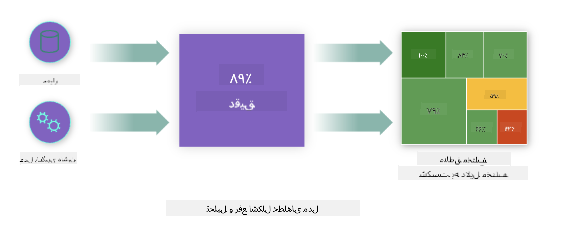
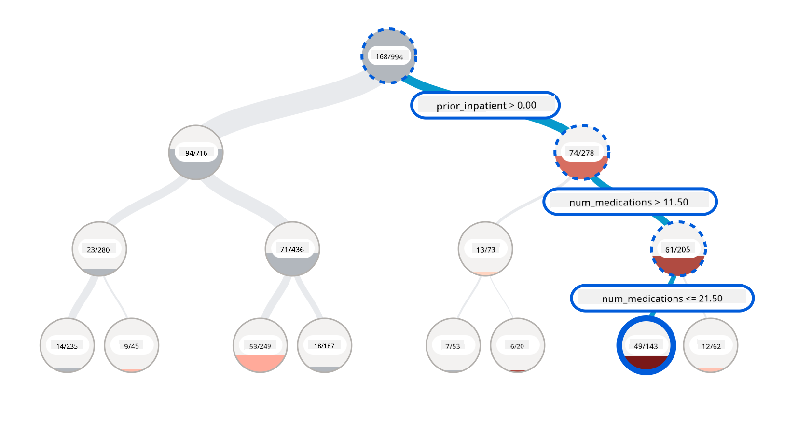
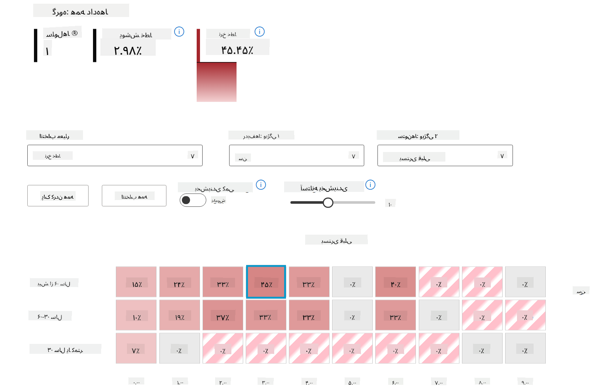
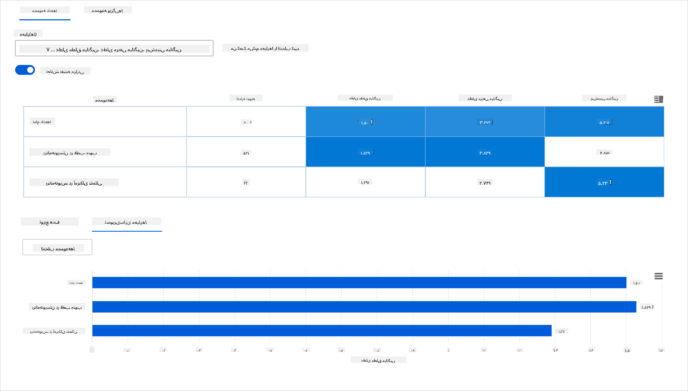
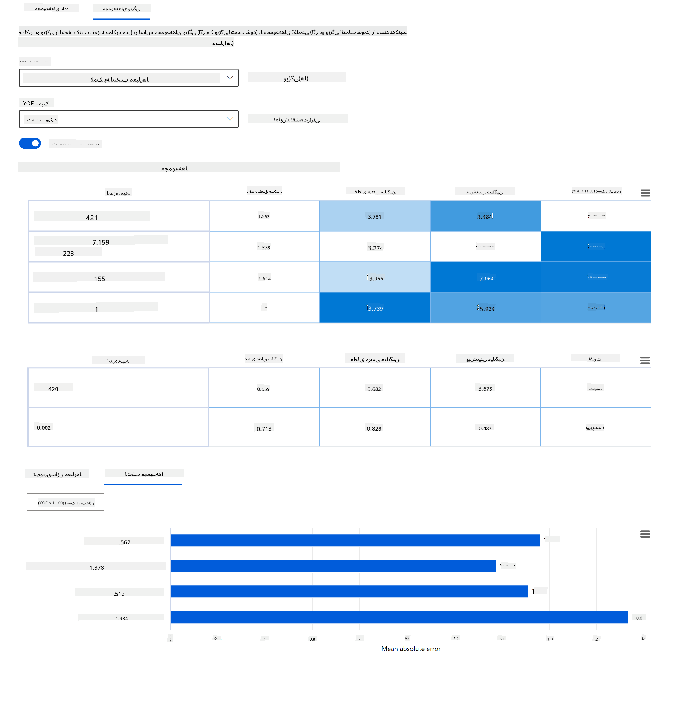
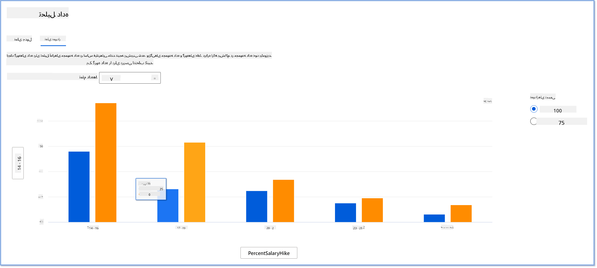
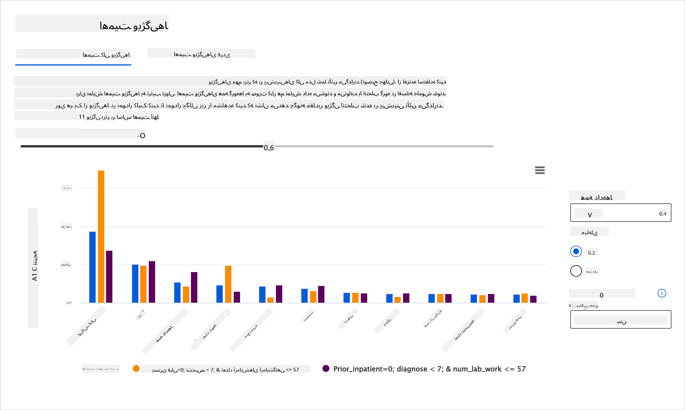
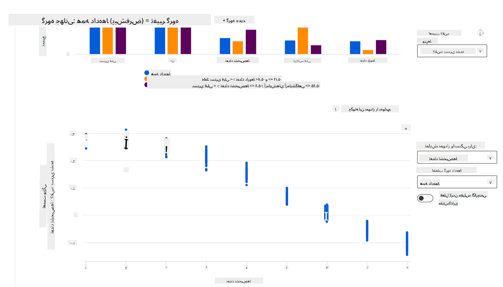

<!--
CO_OP_TRANSLATOR_METADATA:
{
  "original_hash": "ba0f6e1019351351c8ee4c92867b6a0b",
  "translation_date": "2025-09-03T23:23:23+00:00",
  "source_file": "9-Real-World/2-Debugging-ML-Models/README.md",
  "language_code": "fa"
}
-->
# پس‌نوشت: اشکال‌زدایی مدل در یادگیری ماشین با استفاده از اجزای داشبورد هوش مصنوعی مسئولانه

## [پیش‌زمینه آزمون](https://gray-sand-07a10f403.1.azurestaticapps.net/quiz/5/)

## مقدمه

یادگیری ماشین بر زندگی روزمره ما تأثیر می‌گذارد. هوش مصنوعی در حال ورود به برخی از مهم‌ترین سیستم‌هایی است که بر ما به عنوان افراد و جامعه تأثیر می‌گذارند، از جمله مراقبت‌های بهداشتی، امور مالی، آموزش و اشتغال. به عنوان مثال، سیستم‌ها و مدل‌ها در وظایف تصمیم‌گیری روزانه مانند تشخیص‌های پزشکی یا شناسایی تقلب دخیل هستند. در نتیجه، پیشرفت‌های هوش مصنوعی همراه با پذیرش سریع آن با انتظارات اجتماعی در حال تحول و مقررات رو به رشد مواجه شده‌اند. ما دائماً شاهد مناطقی هستیم که سیستم‌های هوش مصنوعی همچنان از انتظارات فاصله دارند؛ چالش‌های جدیدی را آشکار می‌کنند؛ و دولت‌ها شروع به تنظیم راه‌حل‌های هوش مصنوعی کرده‌اند. بنابراین، مهم است که این مدل‌ها تحلیل شوند تا نتایج منصفانه، قابل اعتماد، فراگیر، شفاف و پاسخگو برای همه ارائه دهند.

در این برنامه آموزشی، ما ابزارهای عملی را بررسی خواهیم کرد که می‌توانند برای ارزیابی اینکه آیا یک مدل دارای مسائل هوش مصنوعی مسئولانه است یا خیر، استفاده شوند. تکنیک‌های سنتی اشکال‌زدایی یادگیری ماشین معمولاً بر اساس محاسبات کمی مانند دقت تجمعی یا میانگین خطای از دست رفته هستند. تصور کنید چه اتفاقی می‌افتد وقتی داده‌هایی که برای ساخت این مدل‌ها استفاده می‌کنید فاقد برخی جمعیت‌شناسی‌ها مانند نژاد، جنسیت، دیدگاه سیاسی، مذهب یا نمایندگی نامتناسب این جمعیت‌شناسی‌ها باشد. یا زمانی که خروجی مدل به گونه‌ای تفسیر شود که به نفع برخی جمعیت‌ها باشد؟ این می‌تواند منجر به نمایندگی بیش از حد یا کم از این گروه‌های ویژگی حساس شود و در نتیجه مسائل مربوط به انصاف، فراگیری یا قابلیت اطمینان از مدل ایجاد شود. عامل دیگر این است که مدل‌های یادگیری ماشین به عنوان جعبه‌های سیاه در نظر گرفته می‌شوند، که درک و توضیح اینکه چه چیزی باعث پیش‌بینی مدل می‌شود را دشوار می‌کند. همه این‌ها چالش‌هایی هستند که دانشمندان داده و توسعه‌دهندگان هوش مصنوعی با آن‌ها مواجه می‌شوند وقتی ابزارهای کافی برای اشکال‌زدایی و ارزیابی انصاف یا قابلیت اعتماد مدل ندارند.

در این درس، شما یاد خواهید گرفت که چگونه مدل‌های خود را با استفاده از موارد زیر اشکال‌زدایی کنید:

- **تحلیل خطا**: شناسایی مناطقی در توزیع داده‌های شما که مدل نرخ خطای بالایی دارد.
- **نمای کلی مدل**: انجام تحلیل مقایسه‌ای در میان گروه‌های مختلف داده برای کشف تفاوت‌ها در معیارهای عملکرد مدل شما.
- **تحلیل داده‌ها**: بررسی مناطقی که ممکن است نمایندگی بیش از حد یا کم داده‌های شما وجود داشته باشد که می‌تواند مدل شما را به نفع یک جمعیت داده نسبت به دیگری منحرف کند.
- **اهمیت ویژگی‌ها**: درک اینکه کدام ویژگی‌ها پیش‌بینی‌های مدل شما را در سطح جهانی یا محلی هدایت می‌کنند.

## پیش‌نیاز

به عنوان پیش‌نیاز، لطفاً بررسی کنید [ابزارهای هوش مصنوعی مسئولانه برای توسعه‌دهندگان](https://www.microsoft.com/ai/ai-lab-responsible-ai-dashboard)

> 

## تحلیل خطا

معیارهای عملکرد سنتی مدل که برای اندازه‌گیری دقت استفاده می‌شوند، عمدتاً محاسباتی بر اساس پیش‌بینی‌های درست و نادرست هستند. به عنوان مثال، تعیین اینکه یک مدل ۸۹٪ از زمان دقیق است با خطای از دست رفته ۰.۰۰۱ می‌تواند عملکرد خوبی در نظر گرفته شود. خطاها اغلب به طور یکنواخت در مجموعه داده‌های زیرین شما توزیع نمی‌شوند. ممکن است امتیاز دقت مدل ۸۹٪ دریافت کنید اما کشف کنید که مناطق مختلفی از داده‌های شما وجود دارد که مدل در ۴۲٪ از زمان شکست می‌خورد. پیامد این الگوهای شکست با گروه‌های خاص داده می‌تواند منجر به مسائل مربوط به انصاف یا قابلیت اعتماد شود. ضروری است مناطقی را که مدل عملکرد خوبی دارد یا ندارد، درک کنید. مناطقی از داده‌ها که تعداد زیادی نادرستی در مدل شما وجود دارد ممکن است به یک جمعیت داده مهم تبدیل شوند.

مولفه تحلیل خطا در داشبورد RAI نشان می‌دهد که چگونه شکست مدل در میان گروه‌های مختلف با یک تصویر درختی توزیع شده است. این ابزار برای شناسایی ویژگی‌ها یا مناطقی که نرخ خطای بالایی در مجموعه داده شما دارند مفید است. با مشاهده اینکه بیشتر نادرستی‌های مدل از کجا می‌آیند، می‌توانید شروع به بررسی علت اصلی کنید. همچنین می‌توانید گروه‌های داده‌ای ایجاد کنید تا تحلیل انجام دهید. این گروه‌های داده‌ای در فرآیند اشکال‌زدایی کمک می‌کنند تا مشخص شود چرا عملکرد مدل در یک گروه خوب است اما در گروه دیگر اشتباه است.

شاخص‌های بصری در نقشه درختی به یافتن سریع‌تر مناطق مشکل کمک می‌کنند. به عنوان مثال، هرچه سایه قرمز تیره‌تر یک گره درختی باشد، نرخ خطا بالاتر است.

نقشه حرارتی یکی دیگر از قابلیت‌های تصویری است که کاربران می‌توانند از آن برای بررسی نرخ خطا با استفاده از یک یا دو ویژگی برای یافتن عوامل مؤثر بر خطاهای مدل در کل مجموعه داده یا گروه‌ها استفاده کنند.

از تحلیل خطا استفاده کنید وقتی که نیاز دارید:

* درک عمیقی از نحوه توزیع شکست‌های مدل در یک مجموعه داده و در میان چندین ابعاد ورودی و ویژگی کسب کنید.
* معیارهای عملکرد تجمعی را تجزیه کنید تا گروه‌های اشتباه را به طور خودکار کشف کنید و مراحل کاهش هدفمند خود را اطلاع دهید.

## نمای کلی مدل

ارزیابی عملکرد یک مدل یادگیری ماشین نیازمند درک جامع از رفتار آن است. این امر با بررسی بیش از یک معیار مانند نرخ خطا، دقت، یادآوری، دقت یا MAE (میانگین خطای مطلق) برای یافتن تفاوت‌ها در میان معیارهای عملکرد قابل دستیابی است. یک معیار عملکرد ممکن است عالی به نظر برسد، اما نادرستی‌ها می‌توانند در معیار دیگری آشکار شوند. علاوه بر این، مقایسه معیارها برای تفاوت‌ها در کل مجموعه داده یا گروه‌ها به روشن شدن مناطقی که مدل عملکرد خوبی دارد یا ندارد کمک می‌کند. این امر به ویژه در مشاهده عملکرد مدل در میان ویژگی‌های حساس در مقابل ویژگی‌های غیرحساس (مانند نژاد بیمار، جنسیت یا سن) برای کشف احتمالی نابرابری مدل مهم است. به عنوان مثال، کشف اینکه مدل در گروهی که ویژگی‌های حساس دارد بیشتر اشتباه می‌کند می‌تواند نابرابری احتمالی مدل را آشکار کند.

مولفه نمای کلی مدل در داشبورد RAI نه تنها در تحلیل معیارهای عملکرد نمایندگی داده در یک گروه کمک می‌کند، بلکه به کاربران امکان مقایسه رفتار مدل در میان گروه‌های مختلف را می‌دهد.

قابلیت تحلیل مبتنی بر ویژگی این مولفه به کاربران امکان می‌دهد گروه‌های داده‌ای را در یک ویژگی خاص محدود کنند تا ناهنجاری‌ها را در سطح جزئی شناسایی کنند. به عنوان مثال، داشبورد دارای هوش داخلی برای تولید خودکار گروه‌ها برای ویژگی انتخاب‌شده توسط کاربر (مانند *"زمان در بیمارستان < ۳"* یا *"زمان در بیمارستان >= ۷"*) است. این امر به کاربر امکان می‌دهد یک ویژگی خاص را از یک گروه داده بزرگ‌تر جدا کند تا ببیند آیا این ویژگی یک عامل کلیدی در نتایج اشتباه مدل است.

مولفه نمای کلی مدل از دو کلاس معیارهای تفاوت پشتیبانی می‌کند:

**تفاوت در عملکرد مدل**: این مجموعه معیارها تفاوت (اختلاف) در مقادیر معیار عملکرد انتخاب‌شده در میان زیرگروه‌های داده را محاسبه می‌کنند. در اینجا چند مثال آورده شده است:

* تفاوت در نرخ دقت
* تفاوت در نرخ خطا
* تفاوت در دقت
* تفاوت در یادآوری
* تفاوت در میانگین خطای مطلق (MAE)

**تفاوت در نرخ انتخاب**: این معیار شامل تفاوت در نرخ انتخاب (پیش‌بینی مطلوب) در میان زیرگروه‌ها است. مثالی از این تفاوت در نرخ تأیید وام است. نرخ انتخاب به معنای کسری از نقاط داده در هر کلاس است که به عنوان ۱ طبقه‌بندی شده‌اند (در طبقه‌بندی دودویی) یا توزیع مقادیر پیش‌بینی (در رگرسیون).

## تحلیل داده‌ها

> "اگر داده‌ها را به اندازه کافی شکنجه کنید، به هر چیزی اعتراف خواهند کرد" - رونالد کوز

این جمله ممکن است افراطی به نظر برسد، اما واقعیت این است که داده‌ها می‌توانند دستکاری شوند تا هر نتیجه‌ای را پشتیبانی کنند. چنین دستکاری گاهی اوقات به طور غیرعمدی اتفاق می‌افتد. به عنوان انسان، همه ما تعصب داریم و اغلب دشوار است که آگاهانه بدانیم چه زمانی در داده‌ها تعصب وارد می‌کنیم. تضمین انصاف در هوش مصنوعی و یادگیری ماشین همچنان یک چالش پیچیده است.

داده‌ها یک نقطه کور بزرگ برای معیارهای عملکرد سنتی مدل هستند. ممکن است امتیازات دقت بالایی داشته باشید، اما این همیشه تعصب داده‌های زیرین که ممکن است در مجموعه داده شما باشد را منعکس نمی‌کند. به عنوان مثال، اگر مجموعه داده‌ای از کارکنان دارای ۲۷٪ زنان در موقعیت‌های اجرایی در یک شرکت و ۷۳٪ مردان در همان سطح باشد، یک مدل تبلیغاتی شغلی هوش مصنوعی که بر اساس این داده‌ها آموزش دیده است ممکن است عمدتاً مخاطبان مرد را برای موقعیت‌های شغلی سطح بالا هدف قرار دهد. داشتن این عدم تعادل در داده‌ها پیش‌بینی مدل را به نفع یک جنسیت منحرف کرد. این نشان‌دهنده یک مسئله انصاف است که در آن تعصب جنسیتی در مدل هوش مصنوعی وجود دارد.

مولفه تحلیل داده‌ها در داشبورد RAI به شناسایی مناطقی که در آن‌ها نمایندگی بیش از حد و کم در مجموعه داده وجود دارد کمک می‌کند. این ابزار به کاربران کمک می‌کند علت اصلی خطاها و مسائل انصاف ناشی از عدم تعادل داده‌ها یا عدم نمایندگی یک گروه داده خاص را تشخیص دهند. این ابزار به کاربران امکان می‌دهد مجموعه داده‌ها را بر اساس نتایج پیش‌بینی‌شده و واقعی، گروه‌های خطا و ویژگی‌های خاص تجسم کنند. گاهی اوقات کشف یک گروه داده کم‌نمایندگی می‌تواند نشان دهد که مدل به خوبی یاد نمی‌گیرد، بنابراین نادرستی‌های بالا وجود دارد. داشتن مدلی که تعصب داده دارد نه تنها یک مسئله انصاف است بلکه نشان می‌دهد که مدل فراگیر یا قابل اعتماد نیست.

از تحلیل داده‌ها استفاده کنید وقتی که نیاز دارید:

* آمار مجموعه داده خود را با انتخاب فیلترهای مختلف برای تقسیم داده‌های خود به ابعاد مختلف (که به عنوان گروه‌ها نیز شناخته می‌شوند) بررسی کنید.
* توزیع مجموعه داده خود را در میان گروه‌ها و ویژگی‌های مختلف درک کنید.
* تعیین کنید که آیا یافته‌های شما مربوط به انصاف، تحلیل خطا و علیت (مشتق‌شده از سایر مولفه‌های داشبورد) نتیجه توزیع مجموعه داده شما است یا خیر.
* تصمیم بگیرید که در کدام مناطق داده بیشتری جمع‌آوری کنید تا خطاهایی که از مسائل نمایندگی، نویز برچسب، نویز ویژگی، تعصب برچسب و عوامل مشابه ناشی می‌شوند را کاهش دهید.

## تفسیر مدل

مدل‌های یادگیری ماشین تمایل دارند جعبه‌های سیاه باشند. درک اینکه کدام ویژگی‌های کلیدی داده‌ها پیش‌بینی مدل را هدایت می‌کنند می‌تواند چالش‌برانگیز باشد. مهم است که شفافیت ارائه شود که چرا یک مدل یک پیش‌بینی خاص انجام می‌دهد. به عنوان مثال، اگر یک سیستم هوش مصنوعی پیش‌بینی کند که یک بیمار دیابتی در معرض خطر بازگشت به بیمارستان در کمتر از ۳۰ روز است، باید بتواند داده‌های پشتیبانی‌کننده‌ای که منجر به پیش‌بینی آن شده است را ارائه دهد. داشتن شاخص‌های داده پشتیبانی‌کننده شفافیت را به ارمغان می‌آورد تا به پزشکان یا بیمارستان‌ها کمک کند تصمیمات آگاهانه بگیرند. علاوه بر این، توانایی توضیح اینکه چرا یک مدل برای یک بیمار خاص پیش‌بینی کرده است، مسئولیت‌پذیری با مقررات بهداشتی را امکان‌پذیر می‌کند. وقتی از مدل‌های یادگیری ماشین به روش‌هایی استفاده می‌کنید که بر زندگی افراد تأثیر می‌گذارد، ضروری است که درک کنید و توضیح دهید چه چیزی رفتار مدل را تحت تأثیر قرار می‌دهد. قابلیت توضیح و تفسیر مدل به پاسخ دادن به سوالات در سناریوهایی مانند موارد زیر کمک می‌کند:

* اشکال‌زدایی مدل: چرا مدل من این اشتباه را انجام داد؟ چگونه می‌توانم مدل خود را بهبود دهم؟
* همکاری انسان-هوش مصنوعی: چگونه می‌توانم تصمیمات مدل را درک کنم و به آن‌ها اعتماد کنم؟
* رعایت مقررات: آیا مدل من الزامات قانونی را برآورده می‌کند؟

مولفه اهمیت ویژگی‌ها در داشبورد RAI به شما کمک می‌کند تا اشکال‌زدایی کنید و درک جامعی از نحوه پیش‌بینی مدل داشته باشید. این ابزار همچنین برای حرفه‌ای‌های یادگیری ماشین و تصمیم‌گیرندگان مفید است تا توضیح دهند و شواهدی از ویژگی‌هایی که رفتار مدل را تحت تأثیر قرار می‌دهند برای رعایت مقررات ارائه دهند. سپس کاربران می‌توانند توضیحات جهانی و محلی را بررسی کنند تا تأیید کنند کدام ویژگی‌ها پیش‌بینی مدل را هدایت می‌کنند. توضیحات جهانی لیست ویژگی‌های برتر را که بر پیش‌بینی کلی مدل تأثیر گذاشته‌اند، نمایش می‌دهند. توضیحات محلی نشان می‌دهند که کدام ویژگی‌ها منجر به پیش‌بینی مدل برای یک مورد خاص شده‌اند. توانایی ارزیابی توضیحات محلی نیز در اشکال‌زدایی یا ممیزی یک مورد خاص برای درک بهتر و تفسیر اینکه چرا مدل یک پیش‌بینی دقیق یا نادرست انجام داده است، مفید است.

* توضیحات جهانی: به عنوان مثال، چه ویژگی‌هایی بر رفتار کلی مدل بازگشت بیمار دیابتی به بیمارستان تأثیر می‌گذارند؟
* توضیحات محلی: به عنوان مثال، چرا یک بیمار دیابتی بالای ۶۰ سال با بستری‌های قبلی پیش‌بینی شده است که در کمتر از ۳۰ روز به بیمارستان بازگردد یا بازنگردد؟

در فرآیند اشکال‌زدایی عملکرد مدل در میان گروه‌های مختلف، اهمیت ویژگی‌ها نشان می‌دهد که یک ویژگی در میان گروه‌ها چه سطحی از تأثیر دارد. این ابزار به آشکار کردن ناهنجاری‌ها هنگام مقایسه سطح تأثیر ویژگی در هدایت پیش‌بینی‌های اشتباه مدل کمک می‌کند. مولفه اهمیت ویژگی‌ها می‌تواند نشان دهد که کدام مقادیر در یک ویژگی به طور مثبت یا منفی بر نتیجه مدل تأثیر گذاشته‌اند. به عنوان مثال، اگر یک مدل یک پیش‌بینی نادرست انجام داده باشد، این مولفه به شما امکان می‌دهد تا جزئیات را بررسی کنید و مشخص کنید کدام ویژگی‌ها یا مقادیر ویژگی‌ها پیش‌بینی را هدایت کرده‌اند. این سطح از جزئیات نه تنها در اشکال‌زدایی کمک می‌کند بلکه شفافیت و مسئولیت‌پذیری را در موقعیت‌های ممیزی فراهم می‌کند. در نهایت، این مولفه می‌تواند به شناسایی مسائل انصاف کمک کند. برای مثال، اگر یک ویژگی حساس مانند قومیت یا جنسیت به شدت در هدایت پیش‌بینی مدل تأثیرگذار باشد، این می‌تواند نشانه‌ای از تعصب نژادی یا جنسیتی در مدل باشد.

از تفسیر مدل استفاده کنید وقتی که نیاز دارید:

* تعیین کنید که پیش‌بینی‌های سیستم هوش مصنوعی شما چقدر قابل اعتماد هستند با درک اینکه کدام ویژگی‌ها برای پیش‌بینی‌ها مهم‌ترین هستند.
* به اشکال‌زدایی مدل خود نزدیک شوید با درک آن ابتدا و شناسایی اینکه آیا مدل از ویژگی‌های سالم استفاده می‌کند یا صرفاً همبستگی‌های نادرست.
* منابع احتمالی نابرابری را کشف کنید با درک اینکه آیا مدل پیش‌بینی‌ها را بر اساس ویژگی‌های حساس یا ویژگی‌هایی که به شدت با آن‌ها مرتبط هستند، انجام می‌دهد.
* اعتماد کاربران به تصمیمات مدل خود را با تولید توضیحات محلی برای نشان دادن نتایج آن‌ها ایجاد کنید.
* یک ممیزی مقرراتی از یک سیستم هوش مصنوعی را تکمیل کنید تا مدل‌ها را تأیید کنید و تأثیر تصمیمات مدل بر انسان‌ها را نظارت کنید.

## نتیجه‌گیری

تمام مولفه‌های داشبورد RAI ابزارهای عملی هستند که به شما کمک می‌کنند مدل‌های یادگیری ماشین بسازید که کمتر مضر و قابل اعتمادتر برای جامعه باشند. این ابزارها به پیشگیری از تهدیدات به حقوق بشر، تبعیض یا حذف گروه‌های خاص از فرصت‌های زندگی، و خطر آسیب جسمی یا روانی کمک می‌کنند. همچنین به ایجاد اعتماد در تصمیمات مدل شما کمک می‌کنند با تولید توضیحات محلی برای نشان دادن نتایج آن‌ها. برخی از آسیب‌های احتمالی را
- **نمایش بیش از حد یا کمتر از حد**. ایده این است که یک گروه خاص در یک حرفه خاص دیده نمی‌شود و هر خدمت یا عملکردی که به ترویج این وضعیت ادامه دهد، به آسیب رساندن کمک می‌کند.

### داشبورد RAI در Azure

[داشبورد RAI در Azure](https://learn.microsoft.com/en-us/azure/machine-learning/concept-responsible-ai-dashboard?WT.mc_id=aiml-90525-ruyakubu) بر اساس ابزارهای متن‌باز توسعه‌یافته توسط مؤسسات و سازمان‌های برجسته علمی، از جمله مایکروسافت، ساخته شده است. این ابزارها برای دانشمندان داده و توسعه‌دهندگان هوش مصنوعی بسیار مفید هستند تا رفتار مدل را بهتر درک کنند، مشکلات نامطلوب را شناسایی کرده و کاهش دهند.

- برای یادگیری نحوه استفاده از اجزای مختلف، به [مستندات داشبورد RAI](https://learn.microsoft.com/en-us/azure/machine-learning/how-to-responsible-ai-dashboard?WT.mc_id=aiml-90525-ruyakubu) مراجعه کنید.

- برخی از [دفترچه‌های نمونه داشبورد RAI](https://github.com/Azure/RAI-vNext-Preview/tree/main/examples/notebooks) را بررسی کنید تا سناریوهای مسئولانه‌تر هوش مصنوعی را در Azure Machine Learning دیباگ کنید.

---
## 🚀 چالش

برای جلوگیری از ورود تعصبات آماری یا داده‌ای از ابتدا، باید:

- تنوع در پیشینه‌ها و دیدگاه‌ها در میان افرادی که روی سیستم‌ها کار می‌کنند داشته باشیم
- در مجموعه داده‌هایی سرمایه‌گذاری کنیم که تنوع جامعه ما را منعکس کنند
- روش‌های بهتری برای شناسایی و اصلاح تعصب زمانی که رخ می‌دهد توسعه دهیم

به سناریوهای واقعی فکر کنید که در آن‌ها ناعادلانه بودن در ساخت و استفاده از مدل‌ها مشهود است. چه موارد دیگری باید در نظر گرفته شود؟

## [آزمون پس از درس](https://gray-sand-07a10f403.1.azurestaticapps.net/quiz/6/)
## مرور و مطالعه شخصی

در این درس، برخی از ابزارهای عملی برای ادغام هوش مصنوعی مسئولانه در یادگیری ماشین را آموختید.

این کارگاه را تماشا کنید تا عمیق‌تر به موضوعات بپردازید:

- داشبورد هوش مصنوعی مسئولانه: یک مرکز جامع برای عملیاتی کردن RAI در عمل توسط بسیمرا نوشی و مهرنوش سامکی

> 🎥 روی تصویر بالا کلیک کنید برای ویدیو: داشبورد هوش مصنوعی مسئولانه: یک مرکز جامع برای عملیاتی کردن RAI در عمل توسط بسیمرا نوشی و مهرنوش سامکی

برای یادگیری بیشتر درباره هوش مصنوعی مسئولانه و نحوه ساخت مدل‌های قابل اعتمادتر، به منابع زیر مراجعه کنید:

- ابزارهای داشبورد RAI مایکروسافت برای دیباگ مدل‌های یادگیری ماشین: [منابع ابزارهای هوش مصنوعی مسئولانه](https://aka.ms/rai-dashboard)

- ابزارهای هوش مصنوعی مسئولانه را بررسی کنید: [گیت‌هاب](https://github.com/microsoft/responsible-ai-toolbox)

- مرکز منابع RAI مایکروسافت: [منابع هوش مصنوعی مسئولانه – مایکروسافت AI](https://www.microsoft.com/ai/responsible-ai-resources?activetab=pivot1%3aprimaryr4)

- گروه تحقیقاتی FATE مایکروسافت: [FATE: عدالت، پاسخگویی، شفافیت و اخلاق در هوش مصنوعی - تحقیقات مایکروسافت](https://www.microsoft.com/research/theme/fate/)

## تکلیف

[داشبورد RAI را بررسی کنید](assignment.md)

---

**سلب مسئولیت**:  
این سند با استفاده از سرویس ترجمه هوش مصنوعی [Co-op Translator](https://github.com/Azure/co-op-translator) ترجمه شده است. در حالی که ما تلاش می‌کنیم دقت را حفظ کنیم، لطفاً توجه داشته باشید که ترجمه‌های خودکار ممکن است شامل خطاها یا نادرستی‌ها باشند. سند اصلی به زبان اصلی آن باید به عنوان منبع معتبر در نظر گرفته شود. برای اطلاعات حساس، توصیه می‌شود از ترجمه حرفه‌ای انسانی استفاده کنید. ما مسئولیتی در قبال سوءتفاهم‌ها یا تفسیرهای نادرست ناشی از استفاده از این ترجمه نداریم.