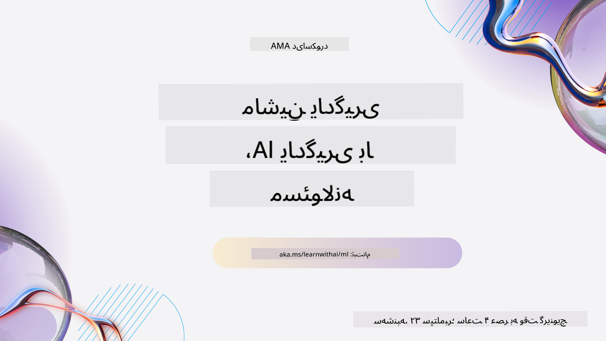
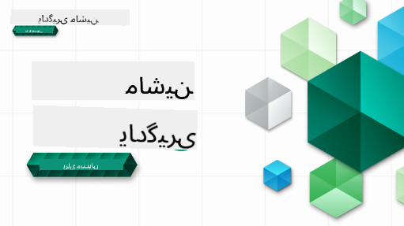

<!--
CO_OP_TRANSLATOR_METADATA:
{
  "original_hash": "7a13afb3674838f557d61f8d67e4d5f8",
  "translation_date": "2025-10-24T08:53:56+00:00",
  "source_file": "README.md",
  "language_code": "fa"
}
-->
  
  
  
  
  

  
  
  

### 🌐 پشتیبانی چندزبانه  

#### پشتیبانی شده از طریق GitHub Action (خودکار و همیشه به‌روز)  

<!-- جدول زبان‌های مترجم CO-OP شروع -->
[عربی](../ar/README.md) | [بنگالی](../bn/README.md) | [بلغاری](../bg/README.md) | [برمه‌ای (میانمار)](../my/README.md) | [چینی (ساده‌شده)](../zh/README.md) | [چینی (سنتی، هنگ‌کنگ)](../hk/README.md) | [چینی (سنتی، ماکائو)](../mo/README.md) | [چینی (سنتی، تایوان)](../tw/README.md) | [کرواتی](../hr/README.md) | [چکی](../cs/README.md) | [دانمارکی](../da/README.md) | [هلندی](../nl/README.md) | [استونیایی](../et/README.md) | [فنلاندی](../fi/README.md) | [فرانسوی](../fr/README.md) | [آلمانی](../de/README.md) | [یونانی](../el/README.md) | [عبری](../he/README.md) | [هندی](../hi/README.md) | [مجاری](../hu/README.md) | [اندونزیایی](../id/README.md) | [ایتالیایی](../it/README.md) | [ژاپنی](../ja/README.md) | [کره‌ای](../ko/README.md) | [لیتوانیایی](../lt/README.md) | [مالایی](../ms/README.md) | [مراتی](../mr/README.md) | [نپالی](../ne/README.md) | [نروژی](../no/README.md) | [فارسی](./README.md) | [لهستانی](../pl/README.md) | [پرتغالی (برزیل)](../br/README.md) | [پرتغالی (پرتغال)](../pt/README.md) | [پنجابی (گورموکی)](../pa/README.md) | [رومانیایی](../ro/README.md) | [روسی](../ru/README.md) | [صربی (سیریلیک)](../sr/README.md) | [اسلواکی](../sk/README.md) | [اسلوونیایی](../sl/README.md) | [اسپانیایی](../es/README.md) | [سواحیلی](../sw/README.md) | [سوئدی](../sv/README.md) | [تاگالوگ (فیلیپینی)](../tl/README.md) | [تامیلی](../ta/README.md) | [تایلندی](../th/README.md) | [ترکی](../tr/README.md) | [اوکراینی](../uk/README.md) | [اردو](../ur/README.md) | [ویتنامی](../vi/README.md)  
<!-- جدول زبان‌های مترجم CO-OP پایان -->

#### به جامعه ما بپیوندید  

  

ما یک سری یادگیری با هوش مصنوعی در Discord داریم، بیشتر بدانید و از تاریخ ۱۸ تا ۳۰ سپتامبر ۲۰۲۵ به ما بپیوندید در [سری یادگیری با هوش مصنوعی](https://aka.ms/learnwithai/discord). شما نکات و ترفندهای استفاده از GitHub Copilot برای علم داده را یاد خواهید گرفت.  

  

# یادگیری ماشین برای مبتدیان - یک برنامه درسی  

> 🌍 به دور دنیا سفر کنید و یادگیری ماشین را از طریق فرهنگ‌های جهانی کشف کنید 🌍  

مدافعان ابری در مایکروسافت خوشحال هستند که یک برنامه درسی ۱۲ هفته‌ای و ۲۶ درس درباره **یادگیری ماشین** ارائه دهند. در این برنامه درسی، شما درباره چیزی که گاهی اوقات **یادگیری ماشین کلاسیک** نامیده می‌شود، یاد خواهید گرفت، که عمدتاً از کتابخانه Scikit-learn استفاده می‌کند و از یادگیری عمیق که در برنامه درسی [هوش مصنوعی برای مبتدیان](https://aka.ms/ai4beginners) پوشش داده شده است، اجتناب می‌کند. این درس‌ها را با برنامه درسی ['علم داده برای مبتدیان'](https://aka.ms/ds4beginners) ما ترکیب کنید!  

با ما به دور دنیا سفر کنید و این تکنیک‌های کلاسیک را بر روی داده‌های مناطق مختلف جهان اعمال کنید. هر درس شامل آزمون‌های قبل و بعد از درس، دستورالعمل‌های نوشتاری برای تکمیل درس، یک راه‌حل، یک تکلیف و موارد دیگر است. روش آموزشی مبتنی بر پروژه ما به شما امکان می‌دهد در حین ساختن یاد بگیرید، که یک روش اثبات‌شده برای تثبیت مهارت‌های جدید است.  

**✍️ تشکر فراوان از نویسندگان ما** جن لوپر، استفن هاول، فرانچسکا لازری، تومومی ایمورا، کاسی برویو، دیمیتری سوشنیکوف، کریس نورینگ، انیربان موکرجی، اورنلا آلتونیان، روث یاکوبو و ایمی بوید  

**🎨 همچنین از تصویرگران ما تشکر می‌کنیم** تومومی ایمورا، داسانی مدیپالی و جن لوپر  

**🙏 تشکر ویژه 🙏 از نویسندگان، بازبینان و مشارکت‌کنندگان محتوای سفیران دانشجویی مایکروسافت**، به‌ویژه ریشیت داگلی، محمد ساکیب خان اینان، روهان راج، الکساندرو پتروسکو، آبیشک جایسوال، ناورین تاباسوم، ایوان سامویلا و اسنیگدا آگاروال  

**🤩 سپاس ویژه از سفیران دانشجویی مایکروسافت اریک وانجاو، جاسلین سوندی و ویدوشی گوپتا برای درس‌های R ما!**  

# شروع کار  

این مراحل را دنبال کنید:  
1. **انشعاب مخزن**: روی دکمه "Fork" در گوشه بالا-راست این صفحه کلیک کنید.  
2. **کلون کردن مخزن**:   `git clone https://github.com/microsoft/ML-For-Beginners.git`  

> [تمام منابع اضافی برای این دوره را در مجموعه Microsoft Learn ما پیدا کنید](https://learn.microsoft.com/en-us/collections/qrqzamz1nn2wx3?WT.mc_id=academic-77952-bethanycheum)  

> 🔧 **نیاز به کمک دارید؟** راهنمای [رفع مشکلات](TROUBLESHOOTING.md) ما را برای حل مشکلات رایج در نصب، راه‌اندازی و اجرای درس‌ها بررسی کنید.  

**[دانشجویان](https://aka.ms/student-page)**، برای استفاده از این برنامه درسی، کل مخزن را به حساب GitHub خود انشعاب دهید و تمرین‌ها را به‌تنهایی یا با گروهی کامل کنید:  

- با یک آزمون پیش از درس شروع کنید.  
- درس را بخوانید و فعالیت‌ها را کامل کنید، در هر بررسی دانش توقف کنید و تأمل کنید.  
- سعی کنید پروژه‌ها را با درک درس‌ها ایجاد کنید، نه با اجرای کد راه‌حل؛ با این حال، آن کد در پوشه‌های `/solution` در هر درس مبتنی بر پروژه موجود است.  
- آزمون پس از درس را انجام دهید.  
- چالش را کامل کنید.  
- تکلیف را کامل کنید.  
- پس از تکمیل یک گروه درس، به [تابلوی بحث](https://github.com/microsoft/ML-For-Beginners/discussions) مراجعه کنید و با پر کردن معیار مناسب PAT، "بلند فکر کنید". یک 'PAT' ابزار ارزیابی پیشرفت است که یک معیار است که شما برای پیشرفت یادگیری خود پر می‌کنید. شما همچنین می‌توانید به PAT‌های دیگر واکنش نشان دهید تا با هم یاد بگیریم.  

> برای مطالعه بیشتر، توصیه می‌کنیم این ماژول‌ها و مسیرهای یادگیری [Microsoft Learn](https://docs.microsoft.com/en-us/users/jenlooper-2911/collections/k7o7tg1gp306q4?WT.mc_id=academic-77952-leestott) را دنبال کنید.  

**معلمان**، ما [برخی پیشنهادات](for-teachers.md) در مورد نحوه استفاده از این برنامه درسی را ارائه داده‌ایم.  

---

## راهنمای ویدئویی  

برخی از درس‌ها به صورت ویدئوهای کوتاه در دسترس هستند. می‌توانید همه این‌ها را درون درس‌ها یا در [لیست پخش یادگیری ماشین برای مبتدیان در کانال YouTube توسعه‌دهنده مایکروسافت](https://aka.ms/ml-beginners-videos) پیدا کنید، با کلیک بر روی تصویر زیر.  

  

---

## تیم را ملاقات کنید  

  

**Gif توسط** [Mohit Jaisal](https://linkedin.com/in/mohitjaisal)  

> 🎥 روی تصویر بالا کلیک کنید تا ویدئویی درباره پروژه و افرادی که آن را ایجاد کرده‌اند ببینید!  

---

## روش آموزشی  

ما دو اصل آموزشی را هنگام ساخت این برنامه درسی انتخاب کرده‌ایم: اطمینان از اینکه این برنامه درسی **پروژه‌محور** و **شامل آزمون‌های مکرر** است. علاوه بر این، این برنامه درسی دارای یک **موضوع مشترک** است که به آن انسجام می‌بخشد.  

با اطمینان از اینکه محتوا با پروژه‌ها هماهنگ است، فرآیند برای دانش‌آموزان جذاب‌تر می‌شود و حفظ مفاهیم افزایش می‌یابد. علاوه بر این، یک آزمون کم‌ریسک قبل از کلاس، قصد دانش‌آموز را به سمت یادگیری یک موضوع تنظیم می‌کند، در حالی که یک آزمون دوم بعد از کلاس، حفظ بیشتر را تضمین می‌کند. این برنامه درسی به گونه‌ای طراحی شده است که انعطاف‌پذیر و سرگرم‌کننده باشد و می‌توان آن را به طور کامل یا جزئی انجام داد. پروژه‌ها کوچک شروع می‌شوند و تا پایان چرخه ۱۲ هفته‌ای به طور فزاینده‌ای پیچیده می‌شوند. این برنامه درسی همچنین شامل یک پس‌نوشت درباره کاربردهای واقعی یادگیری ماشین است که می‌تواند به عنوان اعتبار اضافی یا به عنوان پایه‌ای برای بحث استفاده شود.  

> دستورالعمل‌های [کد رفتار](CODE_OF_CONDUCT.md)، [مشارکت](CONTRIBUTING.md)، [ترجمه](TRANSLATIONS.md)، و [رفع مشکلات](TROUBLESHOOTING.md) ما را پیدا کنید. ما از بازخورد سازنده شما استقبال می‌کنیم!  

## هر درس شامل  

- اسکچ‌نوت اختیاری  
- ویدئوی تکمیلی اختیاری  
- راهنمای ویدئویی (فقط برخی درس‌ها)  
- [آزمون گرم کردن پیش از درس](https://ff-quizzes.netlify.app/en/ml/)  
- درس نوشتاری  
- برای درس‌های مبتنی بر پروژه، راهنماهای گام‌به‌گام درباره نحوه ساخت پروژه  
- بررسی دانش  
- یک چالش  
- مطالعه تکمیلی  
- تکلیف  
- [آزمون پس از درس](https://ff-quizzes.netlify.app/en/ml/)  

> **یادداشتی درباره زبان‌ها**: این درس‌ها عمدتاً به زبان پایتون نوشته شده‌اند، اما بسیاری از آن‌ها به زبان R نیز در دسترس هستند. برای تکمیل یک درس R، به پوشه `/solution` بروید و به دنبال درس‌های R بگردید. آن‌ها شامل یک پسوند .rmd هستند که نشان‌دهنده یک فایل **R Markdown** است که می‌توان آن را به سادگی به عنوان ترکیبی از `تکه‌های کد` (از R یا زبان‌های دیگر) و یک `سرصفحه YAML` (که نحوه قالب‌بندی خروجی‌ها مانند PDF را راهنمایی می‌کند) در یک `سند Markdown` تعریف کرد. به این ترتیب، به عنوان یک چارچوب نویسندگی نمونه برای علم داده عمل می‌کند زیرا به شما امکان می‌دهد کد خود، خروجی آن و افکار خود را با نوشتن آن‌ها در Markdown ترکیب کنید. علاوه بر این، اسناد R Markdown می‌توانند به فرمت‌های خروجی مانند PDF، HTML یا Word تبدیل شوند.  

> **یادداشتی درباره آزمون‌ها**: تمام آزمون‌ها در [پوشه برنامه آزمون](../../quiz-app) قرار دارند، برای مجموع ۵۲ آزمون هر کدام شامل سه سؤال. آن‌ها از داخل درس‌ها لینک شده‌اند اما برنامه آزمون می‌تواند به صورت محلی اجرا شود؛ دستورالعمل‌های موجود در پوشه `quiz-app` را برای میزبانی محلی یا استقرار در Azure دنبال کنید.  

| شماره درس |                             موضوع                              |                   گروه‌بندی درس‌ها                   | اهداف یادگیری                                                                                                             |                                                              درس مرتبط                                                               |                        نویسنده                        |
| :-----------: | :------------------------------------------------------------: | :-------------------------------------------------: | ------------------------------------------------------------------------------------------------------------------------------- | :--------------------------------------------------------------------------------------------------------------------------------------: | :--------------------------------------------------: |
|      01       |                مقدمه‌ای بر یادگیری ماشین                |      [مقدمه](1-Introduction/README.md)       | مفاهیم پایه‌ای یادگیری ماشین را بیاموزید                                                                                |                                             [درس](1-Introduction/1-intro-to-ML/README.md)                                             |                       محمد                       |
|      02       |                تاریخچه یادگیری ماشین                 |      [مقدمه](1-Introduction/README.md)       | تاریخچه این حوزه را بیاموزید                                                                                         |                                            [درس](1-Introduction/2-history-of-ML/README.md)                                            |                     جن و ایمی                      |
|      03       |                 انصاف و یادگیری ماشین                  |      [مقدمه](1-Introduction/README.md)       | مسائل فلسفی مهم پیرامون انصاف که دانشجویان باید هنگام ساخت و استفاده از مدل‌های یادگیری ماشین در نظر بگیرند چیست؟ |                                              [درس](1-Introduction/3-fairness/README.md)                                               |                        تومومی                        |
|      04       |                تکنیک‌های یادگیری ماشین                 |      [مقدمه](1-Introduction/README.md)       | محققان یادگیری ماشین از چه تکنیک‌هایی برای ساخت مدل‌های یادگیری ماشین استفاده می‌کنند؟                                                                       |                                          [درس](1-Introduction/4-techniques-of-ML/README.md)                                           |                    کریس و جن                     |
|      05       |                   مقدمه‌ای بر رگرسیون                   |        [رگرسیون](2-Regression/README.md)         | با پایتون و Scikit-learn برای مدل‌های رگرسیون شروع کنید                                                                  |         [پایتون](2-Regression/1-Tools/README.md) • [R](../../2-Regression/1-Tools/solution/R/lesson_1.html)         |      جن • اریک وانجا       |
|      06       |                قیمت کدو تنبل در آمریکای شمالی 🎃                |        [رگرسیون](2-Regression/README.md)         | داده‌ها را برای یادگیری ماشین بصری‌سازی و پاکسازی کنید                                                                                  |          [پایتون](2-Regression/2-Data/README.md) • [R](../../2-Regression/2-Data/solution/R/lesson_2.html)          |      جن • اریک وانجا       |
|      07       |                قیمت کدو تنبل در آمریکای شمالی 🎃                |        [رگرسیون](2-Regression/README.md)         | مدل‌های رگرسیون خطی و چندجمله‌ای بسازید                                                                                   |        [پایتون](2-Regression/3-Linear/README.md) • [R](../../2-Regression/3-Linear/solution/R/lesson_3.html)        |      جن و دیمیتری • اریک وانجا       |
|      08       |                قیمت کدو تنبل در آمریکای شمالی 🎃                |        [رگرسیون](2-Regression/README.md)         | یک مدل رگرسیون لجستیک بسازید                                                                                               |     [پایتون](2-Regression/4-Logistic/README.md) • [R](../../2-Regression/4-Logistic/solution/R/lesson_4.html)      |      جن • اریک وانجا       |
|      09       |                          یک اپلیکیشن وب 🔌                          |           [اپلیکیشن وب](3-Web-App/README.md)            | یک اپلیکیشن وب بسازید تا از مدل آموزش‌دیده خود استفاده کنید                                                                                       |                                                 [پایتون](3-Web-App/1-Web-App/README.md)                                                  |                         جن                          |
|      10       |                 مقدمه‌ای بر دسته‌بندی                 |    [دسته‌بندی](4-Classification/README.md)     | داده‌های خود را پاکسازی، آماده‌سازی و بصری‌سازی کنید؛ مقدمه‌ای بر دسته‌بندی                                                            | [پایتون](4-Classification/1-Introduction/README.md) • [R](../../4-Classification/1-Introduction/solution/R/lesson_10.html)  | جن و کاسی • اریک وانجا |
|      11       |             غذاهای خوشمزه آسیایی و هندی 🍜             |    [دسته‌بندی](4-Classification/README.md)     | مقدمه‌ای بر دسته‌بندها                                                                                                     | [پایتون](4-Classification/2-Classifiers-1/README.md) • [R](../../4-Classification/2-Classifiers-1/solution/R/lesson_11.html) | جن و کاسی • اریک وانجا |
|      12       |             غذاهای خوشمزه آسیایی و هندی 🍜             |    [دسته‌بندی](4-Classification/README.md)     | دسته‌بندهای بیشتر                                                                                                                | [پایتون](4-Classification/3-Classifiers-2/README.md) • [R](../../4-Classification/3-Classifiers-2/solution/R/lesson_12.html) | جن و کاسی • اریک وانجا |
|      13       |             غذاهای خوشمزه آسیایی و هندی 🍜             |    [دسته‌بندی](4-Classification/README.md)     | یک اپلیکیشن وب توصیه‌گر با استفاده از مدل خود بسازید                                                                                    |                                              [پایتون](4-Classification/4-Applied/README.md)                                              |                         جن                          |
|      14       |                   مقدمه‌ای بر خوشه‌بندی                   |        [خوشه‌بندی](5-Clustering/README.md)         | داده‌های خود را پاکسازی، آماده‌سازی و بصری‌سازی کنید؛ مقدمه‌ای بر خوشه‌بندی                                                                |         [پایتون](5-Clustering/1-Visualize/README.md) • [R](../../5-Clustering/1-Visualize/solution/R/lesson_14.html)         |      جن • اریک وانجا       |
|      15       |              بررسی سلیقه موسیقی نیجریه‌ای 🎧              |        [خوشه‌بندی](5-Clustering/README.md)         | روش خوشه‌بندی K-Means را بررسی کنید                                                                                           |           [پایتون](5-Clustering/2-K-Means/README.md) • [R](../../5-Clustering/2-K-Means/solution/R/lesson_15.html)           |      جن • اریک وانجا       |
|      16       |        مقدمه‌ای بر پردازش زبان طبیعی ☕️         |   [پردازش زبان طبیعی](6-NLP/README.md)    | اصول اولیه پردازش زبان طبیعی را با ساخت یک ربات ساده بیاموزید                                                                             |                                             [پایتون](6-NLP/1-Introduction-to-NLP/README.md)                                              |                       استیون                        |
|      17       |                      وظایف رایج پردازش زبان طبیعی ☕️                      |   [پردازش زبان طبیعی](6-NLP/README.md)    | دانش خود را در زمینه پردازش زبان طبیعی با درک وظایف رایج در برخورد با ساختارهای زبانی عمیق‌تر کنید                          |                                                    [پایتون](6-NLP/2-Tasks/README.md)                                                     |                       استیون                        |
|      18       |             ترجمه و تحلیل احساسات ♥️              |   [پردازش زبان طبیعی](6-NLP/README.md)    | ترجمه و تحلیل احساسات با آثار جین آستن                                                                             |                                            [پایتون](6-NLP/3-Translation-Sentiment/README.md)                                             |                       استیون                        |
|      19       |                  هتل‌های عاشقانه اروپا ♥️                  |   [پردازش زبان طبیعی](6-NLP/README.md)    | تحلیل احساسات با بررسی نظرات هتل‌ها 1                                                                                         |                                               [پایتون](6-NLP/4-Hotel-Reviews-1/README.md)                                                |                       استیون                        |
|      20       |                  هتل‌های عاشقانه اروپا ♥️                  |   [پردازش زبان طبیعی](6-NLP/README.md)    | تحلیل احساسات با بررسی نظرات هتل‌ها 2                                                                                         |                                               [پایتون](6-NLP/5-Hotel-Reviews-2/README.md)                                                |                       استیون                        |
|      21       |            مقدمه‌ای بر پیش‌بینی سری‌های زمانی             |        [سری‌های زمانی](7-TimeSeries/README.md)        | مقدمه‌ای بر پیش‌بینی سری‌های زمانی                                                                                         |                                             [پایتون](7-TimeSeries/1-Introduction/README.md)                                              |                      فرانچسکا                       |
|      22       | ⚡️ مصرف برق جهانی ⚡️ - پیش‌بینی سری‌های زمانی با ARIMA |        [سری‌های زمانی](7-TimeSeries/README.md)        | پیش‌بینی سری‌های زمانی با ARIMA                                                                                              |                                                 [پایتون](7-TimeSeries/2-ARIMA/README.md)                                                 |                      فرانچسکا                       |
|      23       |  ⚡️ مصرف برق جهانی ⚡️ - پیش‌بینی سری‌های زمانی با SVR  |        [سری‌های زمانی](7-TimeSeries/README.md)        | پیش‌بینی سری‌های زمانی با رگرسیون بردار پشتیبان                                                                           |                                                  [پایتون](7-TimeSeries/3-SVR/README.md)                                                  |                       انیربان                        |
|      24       |             مقدمه‌ای بر یادگیری تقویتی             | [یادگیری تقویتی](8-Reinforcement/README.md) | مقدمه‌ای بر یادگیری تقویتی با Q-Learning                                                                          |                                             [پایتون](8-Reinforcement/1-QLearning/README.md)                                              |                        دیمیتری                        |
|      25       |                 به پیتر کمک کنید تا از گرگ فرار کند! 🐺                  | [یادگیری تقویتی](8-Reinforcement/README.md) | یادگیری تقویتی با Gym                                                                                                      |                                                [پایتون](8-Reinforcement/2-Gym/README.md)                                                 |                        دیمیتری                        |
|  پس‌نوشت   |            سناریوها و کاربردهای واقعی یادگیری ماشین            |      [یادگیری ماشین در دنیای واقعی](9-Real-World/README.md)       | کاربردهای جالب و آموزنده یادگیری ماشین کلاسیک                                                               |                                             [درس](9-Real-World/1-Applications/README.md)                                              |                         تیم                         |
|  پس‌نوشت   |            اشکال‌زدایی مدل در یادگیری ماشین با داشبورد RAI          |      [یادگیری ماشین در دنیای واقعی](9-Real-World/README.md)       | اشکال‌زدایی مدل در یادگیری ماشین با استفاده از اجزای داشبورد هوش مصنوعی مسئول                                                              |                                             [درس](9-Real-World/2-Debugging-ML-Models/README.md)                                              |                         روث یاکوبو                       |

> [تمام منابع اضافی این دوره را در مجموعه Microsoft Learn ما پیدا کنید](https://learn.microsoft.com/en-us/collections/qrqzamz1nn2wx3?WT.mc_id=academic-77952-bethanycheum)

## دسترسی آفلاین

شما می‌توانید این مستندات را به صورت آفلاین با استفاده از [Docsify](https://docsify.js.org/#/) اجرا کنید. این مخزن را فورک کنید، [Docsify را نصب کنید](https://docsify.js.org/#/quickstart) روی دستگاه محلی خود، و سپس در پوشه اصلی این مخزن، دستور `docsify serve` را تایپ کنید. وب‌سایت روی پورت 3000 در localhost شما اجرا خواهد شد: `localhost:3000`.

## فایل‌های PDF

یک فایل PDF از برنامه درسی با لینک‌ها را [اینجا](https://microsoft.github.io/ML-For-Beginners/pdf/readme.pdf) پیدا کنید.

## 🎒 دوره‌های دیگر 

تیم ما دوره‌های دیگری تولید می‌کند! بررسی کنید:

### Azure / Edge / MCP / Agents

---

### سری هوش مصنوعی تولیدی

[-9333EA?style=for-the-badge&labelColor=E5E7EB&color=9333EA)](https://github.com/microsoft/Generative-AI-for-beginners-dotnet?WT.mc_id=academic-105485-koreyst)
[-C084FC?style=for-the-badge&labelColor=E5E7EB&color=C084FC)](https://github.com/microsoft/generative-ai-for-beginners-java?WT.mc_id=academic-105485-koreyst)
[-E879F9?style=for-the-badge&labelColor=E5E7EB&color=E879F9)](https://github.com/microsoft/generative-ai-with-javascript?WT.mc_id=academic-105485-koreyst)

---

### یادگیری اصلی
  
  
  
  
  
  
  

---

### مجموعه Copilot  
  
  
  
<!-- پایان دوره‌های دیگر مترجم CO-OP -->

## دریافت کمک  

اگر در ساخت برنامه‌های هوش مصنوعی دچار مشکل شدید یا سوالی دارید، به اینجا بپیوندید:  

  

اگر بازخوردی درباره محصول دارید یا در هنگام ساخت با خطا مواجه شدید، به اینجا مراجعه کنید:  

  

---

**سلب مسئولیت**:  
این سند با استفاده از سرویس ترجمه هوش مصنوعی [Co-op Translator](https://github.com/Azure/co-op-translator) ترجمه شده است. در حالی که ما تلاش می‌کنیم دقت را حفظ کنیم، لطفاً توجه داشته باشید که ترجمه‌های خودکار ممکن است شامل خطاها یا نادرستی‌ها باشند. سند اصلی به زبان اصلی آن باید به عنوان منبع معتبر در نظر گرفته شود. برای اطلاعات حیاتی، ترجمه حرفه‌ای انسانی توصیه می‌شود. ما مسئولیتی در قبال سوء تفاهم‌ها یا تفسیرهای نادرست ناشی از استفاده از این ترجمه نداریم.