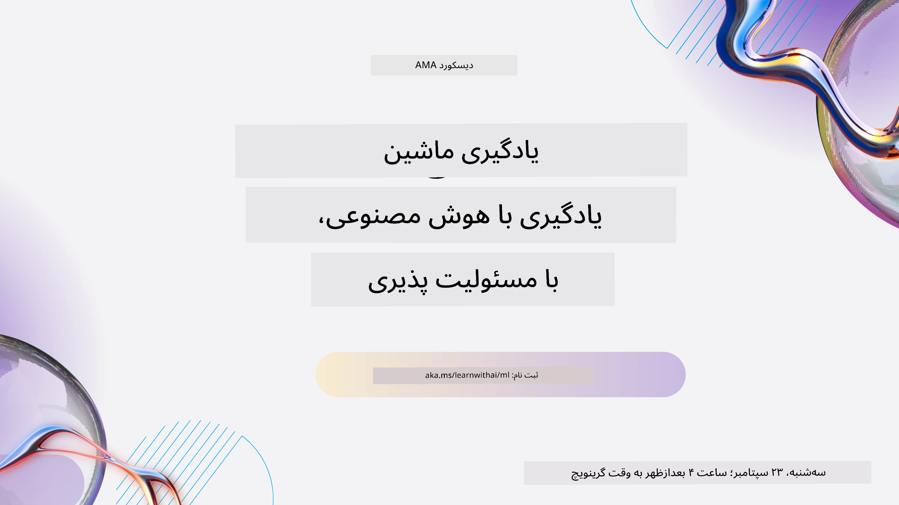
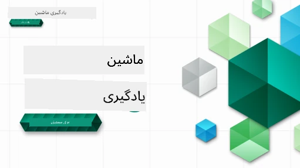

[](https://github.com/microsoft/ML-For-Beginners/blob/master/LICENSE)
[](https://GitHub.com/microsoft/ML-For-Beginners/graphs/contributors/)
[](https://GitHub.com/microsoft/ML-For-Beginners/issues/)
[](https://GitHub.com/microsoft/ML-For-Beginners/pulls/)
[](http://makeapullrequest.com)

[](https://GitHub.com/microsoft/ML-For-Beginners/watchers/)
[](https://GitHub.com/microsoft/ML-For-Beginners/network/)
[](https://GitHub.com/microsoft/ML-For-Beginners/stargazers/)

### 🌐 پشتیبانی چندزبانه

#### پشتیبانی از طریق عملیات گیت‌هاب (خودکار و همیشه به‌روز)

<!-- CO-OP TRANSLATOR LANGUAGES TABLE START -->
[عربی](../ar/README.md) | [بنگالی](../bn/README.md) | [بلغاری](../bg/README.md) | [برمه‌ای (میانمار)](../my/README.md) | [چینی (ساده‌شده)](../zh-CN/README.md) | [چینی (سنتی، هنگ کنگ)](../zh-HK/README.md) | [چینی (سنتی، ماکائو)](../zh-MO/README.md) | [چینی (سنتی، تایوان)](../zh-TW/README.md) | [کرواتی](../hr/README.md) | [چکی](../cs/README.md) | [دانمارکی](../da/README.md) | [هلندی](../nl/README.md) | [استونیایی](../et/README.md) | [فنلاندی](../fi/README.md) | [فرانسوی](../fr/README.md) | [آلمانی](../de/README.md) | [یونانی](../el/README.md) | [عبری](../he/README.md) | [هندی](../hi/README.md) | [مجارستانی](../hu/README.md) | [اندونزیایی](../id/README.md) | [ایتالیایی](../it/README.md) | [ژاپنی](../ja/README.md) | [کانادا](../kn/README.md) | [خمر](../km/README.md) | [کره‌ای](../ko/README.md) | [لیتوانیایی](../lt/README.md) | [مالایی](../ms/README.md) | [مالایالام](../ml/README.md) | [مراتی](../mr/README.md) | [نپالی](../ne/README.md) | [پیدجین نیجریه‌ای](../pcm/README.md) | [نروژی](../no/README.md) | [فارسی (پارسی)](./README.md) | [لهستانی](../pl/README.md) | [پرتغالی (برزیل)](../pt-BR/README.md) | [پرتغالی (پرتغال)](../pt-PT/README.md) | [پنجابی (گورمخی)](../pa/README.md) | [رومانیایی](../ro/README.md) | [روسی](../ru/README.md) | [صربی (سیریلیک)](../sr/README.md) | [اسلواکی](../sk/README.md) | [اسلوونیایی](../sl/README.md) | [اسپانیایی](../es/README.md) | [سواحلی](../sw/README.md) | [سوئدی](../sv/README.md) | [تاگالوگ (فیلیپینی)](../tl/README.md) | [تامیلی](../ta/README.md) | [تلوگو](../te/README.md) | [تایلندی](../th/README.md) | [ترکی](../tr/README.md) | [اوکراینی](../uk/README.md) | [اردو](../ur/README.md) | [ویتنامی](../vi/README.md)

> **ترجیح می‌دهید به‌صورت محلی کلون کنید؟**
>
> این مخزن شامل بیش از ۵۰ ترجمه زبان است که اندازه دانلود را به‌طور قابل توجهی افزایش می‌دهد. برای کلون کردن بدون ترجمه‌ها، از روش sparse checkout استفاده کنید:
>
> **بش / مک‌اواس / لینوکس:**
> ```bash
> git clone --filter=blob:none --sparse https://github.com/microsoft/ML-For-Beginners.git
> cd ML-For-Beginners
> git sparse-checkout set --no-cone '/*' '!translations' '!translated_images'
> ```
>
> **CMD (ویندوز):**
> ```cmd
> git clone --filter=blob:none --sparse https://github.com/microsoft/ML-For-Beginners.git
> cd ML-For-Beginners
> git sparse-checkout set --no-cone "/*" "!translations" "!translated_images"
> ```
>
> این به شما تمام چیزهای مورد نیاز برای تکمیل دوره با دانلود بسیار سریع‌تر را می‌دهد.
<!-- CO-OP TRANSLATOR LANGUAGES TABLE END -->

#### به جامعه ما بپیوندید

[](https://discord.gg/nTYy5BXMWG)

ما سری آموزشی Discord با موضوع یادگیری با هوش مصنوعی را برگزار می‌کنیم؛ برای اطلاعات بیشتر و پیوستن به ما در [سری یادگیری با هوش مصنوعی](https://aka.ms/learnwithai/discord) در بازه زمانی ۱۸ تا ۳۰ سپتامبر ۲۰۲۵، مراجعه کنید. نکات و ترفندهای استفاده از GitHub Copilot برای علم داده را دریافت خواهید کرد.



# یادگیری ماشین برای مبتدیان - یک دوره آموزشی

> 🌍 در سراسر جهان سفر کنیم در حالی که یادگیری ماشین را از طریق فرهنگ‌های جهانی کاوش می‌کنیم 🌍

مدافعان فضای ابری در مایکروسافت خوشحال‌اند دوره‌ای ۱۲ هفته‌ای و ۲۶ درس درباره **یادگیری ماشین** ارائه دهند. در این دوره، درباره چیزی که گاهی یادگیری ماشین کلاسیک خوانده می‌شود، به‌خصوص استفاده از کتابخانه Scikit-learn، یاد خواهید گرفت و از یادگیری عمیق که در [دوره هوش مصنوعی برای مبتدیان](https://aka.ms/ai4beginners) پوشش داده شده، اجتناب می‌شود. این درس‌ها را با دوره ['علم داده برای مبتدیان'](https://aka.ms/ds4beginners) نیز همراه کنید!

با ما در این سفر جهانی همراه باشید تا این تکنیک‌های کلاسیک را بر داده‌های مناطق مختلف جهان اعمال کنیم. هر درس شامل آزمون‌های قبل و بعد درس، دستورالعمل‌های نوشتاری برای تکمیل درس، راه‌حل، تکلیف و غیره است. روش آموزش مبتنی بر پروژه ما به شما این امکان را می‌دهد که در حین ساختن، یاد بگیرید؛ روشی اثبات شده برای درگیر شدن مهارت‌های جدید.

**✍️ قدردانی ویژه از نویسندگان ما** جن لوپر، استیفن هاول، فرانسسکا لازری، تومومی ایمورا، کاسی برویو، دیمیتری سوشنیکوف، کریس نورینگ، آنیربان موخرجی، اورنلا آلتونیان، روث یاکوبو و امی بوید

**🎨 قدردانی از تصویرسازان ما** تومومی ایمورا، داسانی مادپالی، و جن لوپر

**🙏 تشکر ویژه 🙏 از نویسندگان، بازبین‌ها و مشارکت‌کنندگان محتوای سفیران دانشجویی مایکروسافت**، به ویژه ریشیت دگلی، محمد ساکیب خان اینان، روهان راج، الکساندرو پتروسکو، آبیشک جایسوال، ناورین طبسم، ایوان سامویلا، و اسنیگده آگاروال

**🤩 سپاسگذاری اضافی از سفیران دانشجویی مایکروسافت اریک وانژاو، جاسلین سوندی، و ویدوشی گوپتا برای درس‌های R ما!**

# شروع به کار

این مراحل را دنبال کنید:
 1. **انشعاب مخزن**: روی دکمه «فورک» در گوشه بالا سمت راست این صفحه کلیک کنید.
 2. **کلون کردن مخزن**:   `git clone https://github.com/microsoft/ML-For-Beginners.git`

> 💡 **نکته شروع سریع:** می‌خواهید بدون راه‌اندازی محلی پایتون در مرورگر شروع کنید؟ از [GitHub Codespaces](https://github.com/features/codespaces) برای ایجاد محیط توسعه ابری برای فورک خود استفاده کنید. منوی سبز **Code** را باز کنید، **Codespaces** را انتخاب کرده و یک کدسپیس بسازید؛ بسته‌های مورد نیاز هر درس را در صورت لزوم داخل آن نصب کنید.

> [تمام منابع اضافی این دوره را در مجموعه Microsoft Learn ما پیدا کنید](https://learn.microsoft.com/en-us/collections/qrqzamz1nn2wx3?WT.mc_id=academic-77952-bethanycheum)

> 🔧 **نیاز به کمک دارید؟** راهنمای [عیب‌یابی](TROUBLESHOOTING.md) ما را برای حل مشکلات متداول نصب، راه‌اندازی و اجرای درس‌ها بررسی کنید.


**[دانشجویان](https://aka.ms/student-page)**، برای استفاده از این دوره، کل مخزن را به حساب گیت‌هاب خود فورک کرده و تمرین‌ها را به تنهایی یا در گروه کامل کنید:

- با آزمون پیش‌درس شروع کنید.
- درس را بخوانید و فعالیت‌ها را انجام دهید، در هر چک‌پوینت دانش توقف کرده و تأمل کنید.
- سعی کنید پروژه‌ها را با درک درس‌ها ایجاد کنید تا فقط اجرای کد راه‌حل؛ البته کد راه‌حل در پوشه‌های `/solution` هر درس پروژه‌محور موجود است.
- آزمون پایان‌درس را انجام دهید.
- چالش را کامل کنید.
- تکلیف را انجام دهید.
- پس از اتمام یک گروه درسی، به [تابلو بحث](https://github.com/microsoft/ML-For-Beginners/discussions) مراجعه کنید و با پر کردن معیار PAT مربوطه «با صدای بلند یاد بگیرید». PAT یک ابزار ارزیابی پیشرفت است که با پر کردن آن، یادگیری خود را پیش می‌برید. همچنین می‌توانید به PATهای دیگر واکنش دهید تا با هم یاد بگیریم.

> برای مطالعه بیشتر، توصیه می‌کنیم این ماژول‌ها و مسیرهای یادگیری [Microsoft Learn](https://docs.microsoft.com/en-us/users/jenlooper-2911/collections/k7o7tg1gp306q4?WT.mc_id=academic-77952-leestott) را دنبال کنید.

**معلمان**، ما [برخی پیشنهادات](for-teachers.md) در مورد نحوه استفاده از این دوره ارائه داده‌ایم.

---

## فیلم‌های راهنمای درس

برخی از درس‌ها به صورت ویدیوهای کوتاه موجود هستند. می‌توانید همه آنها را درون درس‌ها بیابید یا در [فهرست پخش ML for Beginners در کانال YouTube توسعه‌دهندگان مایکروسافت](https://aka.ms/ml-beginners-videos) با کلیک روی تصویر زیر مشاهده کنید.

[](https://aka.ms/ml-beginners-videos)

---

## تیم ما را بشناسید

[](https://youtu.be/Tj1XWrDSYJU)

**گیف توسط** [Mohit Jaisal](https://linkedin.com/in/mohitjaisal)

> 🎥 برای دیدن ویدیو درباره پروژه و افراد سازنده آن، روی تصویر بالا کلیک کنید!

---

## روش‌شناسی آموزشی

در طراحی این دوره دو اصل آموزشی را انتخاب کرده‌ایم: تضمین اینکه دست‌به‌کار و **مبتنی بر پروژه** باشد و شامل **آزمون‌های متداول** باشد. علاوه بر این، این دوره دارای یک **موضوع مشترک** است تا انسجام ایجاد کند.

با اطمینان از تطابق محتوا با پروژه‌ها، فرآیند برای دانش‌آموزان جذاب‌تر شده و حفظ مفاهیم افزایش می‌یابد. همچنین، یک آزمون کم‌ریسک پیش از کلاس، نیت دانش‌آموز برای یادگیری موضوع را تنظیم می‌کند، و آزمون دوم پس از کلاس حفظ بیشتر را تضمین می‌کند. این دوره طوری طراحی شده که انعطاف‌پذیر و سرگرم‌کننده باشد و می‌توان کل آن یا بخش‌هایی از آن را استفاده کرد. پروژه‌ها از کوچک شروع شده و به تدریج در پایان ۱۲ هفته پیچیده‌تر می‌شوند. این دوره همچنین یک ضمیمه درباره کاربردهای واقعی یادگیری ماشین دارد که می‌توان به عنوان اعتبار اضافی یا پایه‌ای برای بحث استفاده کرد.

> در اینجا [دستورالعمل رفتار](CODE_OF_CONDUCT.md)، [چگونه مشارکت کنیم](CONTRIBUTING.md)، [ترجمه‌ها](..) و [راهنمای عیب‌یابی](TROUBLESHOOTING.md) را بیابید. بازخورد سازنده شما را می‌پذیریم!

## هر درس شامل

- یادداشت تصویری اختیاری
- ویدیوی مکمل اختیاری
- ویدیو راهنما (فقط بعضی درس‌ها)
- [آزمون گرم‌کردن پیش‌درس](https://ff-quizzes.netlify.app/en/ml/)
- درس نوشتاری
- برای درس‌های مبتنی بر پروژه، راهنمای گام به گام ساخت پروژه
- چک‌پوینت‌های دانش
- یک چالش
- مطالعه تکمیلی
- تکلیف
- [آزمون پس از درس](https://ff-quizzes.netlify.app/en/ml/)

> **یادداشتی درباره زبان‌ها**: این درس‌ها عمدتاً به زبان پایتون نوشته شده‌اند، اما بسیاری نیز به زبان R موجودند. برای تکمیل یک درس R، به پوشه `/solution` رفته و درس‌های R را جستجو کنید. آنها پسوند .rmd دارند که نمایانگر فایلی از نوع **R Markdown** است، که می‌توان آن را به‌سادگی به‌عنوان تعبیه بلوک‌های کد (از R یا زبان‌های دیگر) و یک هدر YAML (که راهنمایی می‌کند چگونه خروجی‌ها مانند PDF قالب‌بندی شوند) در یک سند Markdown تعریف کرد. بنابراین، یک چارچوب نمونه برای تولید محتوا در علم داده است چون به شما اجازه می‌دهد کد خود، خروجی آن و افکارتان را با نوشتن در Markdown ترکیب کنید. علاوه بر این، اسناد R Markdown می‌توانند به فرمت‌های خروجی مانند PDF، HTML یا Word رندر شوند.

> **یادداشتی درباره آزمون‌ها**: همه آزمون‌ها در [پوشه برنامه آزمون](../../quiz-app) موجودند، مجموعاً ۵۲ آزمون سه سوالی. آن‌ها از داخل درس‌ها لینک شده‌اند اما برنامه آزمون می‌تواند به‌صورت محلی اجرا شود؛ دستورالعمل‌های میزبانی محلی یا استقرار روی Azure را در پوشه `quiz-app` دنبال کنید.

| شماره درس |                             موضوع                              |                   گروه درس                   | اهداف یادگیری                                                                                                             |                                                              درس مرتبط                                                               |                        نویسنده                        |
| :-----------: | :------------------------------------------------------------: | :-------------------------------------------------: | ------------------------------------------------------------------------------------------------------------------------------- | :--------------------------------------------------------------------------------------------------------------------------------------: | :--------------------------------------------------: |
|      01       |                مقدمه‌ای بر یادگیری ماشین                |      [Introduction](1-Introduction/README.md)       | مفاهیم پایه‌ای پشت یادگیری ماشین را بیاموزید                                                                                |                                             [Lesson](1-Introduction/1-intro-to-ML/README.md)                                             |                       محمد                       |
|      02       |                تاریخچه یادگیری ماشین                 |      [Introduction](1-Introduction/README.md)       | تاریخچه این حوزه را بیاموزید                                                                                         |                                            [Lesson](1-Introduction/2-history-of-ML/README.md)                                            |                     جن و اِمی                      |
|      03       |                 عدالت و یادگیری ماشین                  |      [Introduction](1-Introduction/README.md)       | مسائل فلسفی مهم مربوط به عدالت که دانش‌آموزان باید هنگام ساخت و اجرای مدل‌های یادگیری ماشین در نظر بگیرند چیست؟ |                                              [Lesson](1-Introduction/3-fairness/README.md)                                               |                        تومومی                        |
|      04       |                تکنیک‌های یادگیری ماشین                 |      [Introduction](1-Introduction/README.md)       | پژوهشگران یادگیری ماشین چه تکنیک‌هایی برای ساخت مدل‌های یادگیری ماشین استفاده می‌کنند؟                                                                       |                                          [Lesson](1-Introduction/4-techniques-of-ML/README.md)                                           |                    کریس و جن                     |
|      05       |                   مقدمه‌ای بر رگرسیون                   |        [Regression](2-Regression/README.md)         | شروع کار با پایتون و اسکی‌کت-لرن برای مدل‌های رگرسیونی                                                                  |         [Python](2-Regression/1-Tools/README.md) • [R](../../2-Regression/1-Tools/solution/R/lesson_1.html)         |      جن • اریک ونجو       |
|      06       |                قیمت‌های کدو تنبل در آمریکای شمالی 🎃                |        [Regression](2-Regression/README.md)         | داده‌ها را برای آماده‌سازی جهت یادگیری ماشین بصری‌سازی و پاک‌سازی کنید                                                                                  |          [Python](2-Regression/2-Data/README.md) • [R](../../2-Regression/2-Data/solution/R/lesson_2.html)          |      جن • اریک ونجو       |
|      07       |                قیمت‌های کدو تنبل در آمریکای شمالی 🎃                |        [Regression](2-Regression/README.md)         | مدل‌های رگرسیون خطی و چندجمله‌ای بسازید                                                                                   |        [Python](2-Regression/3-Linear/README.md) • [R](../../2-Regression/3-Linear/solution/R/lesson_3.html)        |      جن و دیمیتری • اریک ونجو       |
|      08       |                قیمت‌های کدو تنبل در آمریکای شمالی 🎃                |        [Regression](2-Regression/README.md)         | یک مدل رگرسیون لجستیک بسازید                                                                                               |     [Python](2-Regression/4-Logistic/README.md) • [R](../../2-Regression/4-Logistic/solution/R/lesson_4.html)      |      جن • اریک ونجو       |
|      09       |                          یک اپ وب 🔌                          |           [Web App](3-Web-App/README.md)            | یک اپ وب بسازید تا از مدل آموزش‌دیده خود استفاده کنید                                                                                       |                                                 [Python](3-Web-App/1-Web-App/README.md)                                                  |                         جن                          |
|      10       |                 مقدمه‌ای بر دسته‌بندی                 |    [Classification](4-Classification/README.md)     | داده‌های خود را پاک کنید، آماده کنید و بصری‌سازی کنید؛ مقدمه‌ای بر دسته‌بندی                                                            | [Python](4-Classification/1-Introduction/README.md) • [R](../../4-Classification/1-Introduction/solution/R/lesson_10.html)  | جن و کَسی • اریک ونجو |
|      11       |             غذاهای خوشمزه آسیایی و هندی 🍜             |    [Classification](4-Classification/README.md)     | مقدمه‌ای بر دسته‌بندها                                                                                                     | [Python](4-Classification/2-Classifiers-1/README.md) • [R](../../4-Classification/2-Classifiers-1/solution/R/lesson_11.html) | جن و کَسی • اریک ونجو |
|      12       |             غذاهای خوشمزه آسیایی و هندی 🍜             |    [Classification](4-Classification/README.md)     | دسته‌بندهای بیشتر                                                                                                                | [Python](4-Classification/3-Classifiers-2/README.md) • [R](../../4-Classification/3-Classifiers-2/solution/R/lesson_12.html) | جن و کَسی • اریک ونجو |
|      13       |             غذاهای خوشمزه آسیایی و هندی 🍜             |    [Classification](4-Classification/README.md)     | ساخت یک اپ وب پیشنهاددهنده با استفاده از مدل خود                                                                                    |                                              [Python](4-Classification/4-Applied/README.md)                                              |                         جن                          |
|      14       |                   مقدمه‌ای بر خوشه‌بندی                   |        [Clustering](5-Clustering/README.md)         | داده‌های خود را پاک کنید، آماده کنید و بصری‌سازی کنید؛ مقدمه‌ای بر خوشه‌بندی                                                                |         [Python](5-Clustering/1-Visualize/README.md) • [R](../../5-Clustering/1-Visualize/solution/R/lesson_14.html)         |      جن • اریک ونجو       |
|      15       |              کاوش سلیقه‌های موسیقی نیجریه‌ای 🎧              |        [Clustering](5-Clustering/README.md)         | روش خوشه‌بندی K-Means را کاوش کنید                                                                                           |           [Python](5-Clustering/2-K-Means/README.md) • [R](../../5-Clustering/2-K-Means/solution/R/lesson_15.html)           |      جن • اریک ونجو       |
|      16       |        مقدمه‌ای بر پردازش زبان طبیعی ☕️         |   [Natural language processing](6-NLP/README.md)    | اصول اولیه NLP را با ساخت یک ربات ساده بیاموزید                                                                             |                                             [Python](6-NLP/1-Introduction-to-NLP/README.md)                                              |                       استفان                        |
|      17       |                      وظایف رایج NLP ☕️                      |   [Natural language processing](6-NLP/README.md)    | دانش NLP خود را با درک وظایف رایج مورد نیاز در برخورد با ساختارهای زبانی عمیق‌تر کنید                          |                                                    [Python](6-NLP/2-Tasks/README.md)                                                     |                       استفان                        |
|      18       |             ترجمه و تحلیل احساسات ♥️              |   [Natural language processing](6-NLP/README.md)    | ترجمه و تحلیل احساسات با جین آستن                                                                             |                                            [Python](6-NLP/3-Translation-Sentiment/README.md)                                             |                       استفان                        |
|      19       |                  هتل‌های رمانتیک اروپا ♥️                  |   [Natural language processing](6-NLP/README.md)    | تحلیل احساسات با بررسی نظرات هتل 1                                                                                         |                                               [Python](6-NLP/4-Hotel-Reviews-1/README.md)                                                |                       استفان                        |
|      20       |                  هتل‌های رمانتیک اروپا ♥️                  |   [Natural language processing](6-NLP/README.md)    | تحلیل احساسات با بررسی نظرات هتل 2                                                                                         |                                               [Python](6-NLP/5-Hotel-Reviews-2/README.md)                                                |                       استفان                        |
|      21       |            مقدمه‌ای بر پیش‌بینی سری‌های زمانی             |        [Time series](7-TimeSeries/README.md)        | مقدمه‌ای بر پیش‌بینی سری‌های زمانی                                                                                         |                                             [Python](7-TimeSeries/1-Introduction/README.md)                                              |                      فرانچسکا                       |
|      22       | ⚡️ مصرف برق جهانی ⚡️ - پیش‌بینی سری‌های زمانی با ARIMA |        [Time series](7-TimeSeries/README.md)        | پیش‌بینی سری‌های زمانی با ARIMA                                                                                              |                                                 [Python](7-TimeSeries/2-ARIMA/README.md)                                                 |                      فرانچسکا                       |
|      23       |  ⚡️ مصرف برق جهانی ⚡️ - پیش‌بینی سری‌های زمانی با SVR  |        [Time series](7-TimeSeries/README.md)        | پیش‌بینی سری‌های زمانی با رگرسیون بردار پشتیبان                                                                           |                                                  [Python](7-TimeSeries/3-SVR/README.md)                                                  |                       آنیربان                        |
|      24       |             مقدمه‌ای بر یادگیری تقویتی             | [Reinforcement learning](8-Reinforcement/README.md) | مقدمه‌ای بر یادگیری تقویتی با Q-Learning                                                                          |                                             [Python](8-Reinforcement/1-QLearning/README.md)                                              |                        دیمیتری                        |
|      25       |                 کمک به پیتر برای اجتناب از گرگ! 🐺                  | [Reinforcement learning](8-Reinforcement/README.md) | یادگیری تقویتی با Gym                                                                                                      |                                                [Python](8-Reinforcement/2-Gym/README.md)                                                 |                        دیمیتری                        |
|  پس‌نویس   |            سناریوها و کاربردهای یادگیری ماشین در دنیای واقعی            |      [ML in the Wild](9-Real-World/README.md)       | کاربردهای جالب و آموزنده یادگیری ماشین کلاسیک در دنیای واقعی                                                               |                                             [Lesson](9-Real-World/1-Applications/README.md)                                              |                         تیم                         |
|  پس‌نویس   |            رفع اشکال مدل در یادگیری ماشین با داشبورد RAI            |      [ML in the Wild](9-Real-World/README.md)       | رفع اشکال مدل در یادگیری ماشین با استفاده از اجزای داشبورد هوش مصنوعی مسئول                                                              |                                             [Lesson](9-Real-World/2-Debugging-ML-Models/README.md)                                              |                     روث یاکوبو                      |

> [تمام منابع اضافی برای این دوره را در مجموعه یادگیری مایکروسافت ما بیابید](https://learn.microsoft.com/en-us/collections/qrqzamz1nn2wx3?WT.mc_id=academic-77952-bethanycheum)

## دسترسی آفلاین

می‌توانید این مستندات را به صورت آفلاین با استفاده از [Docsify](https://docsify.js.org/#/) اجرا کنید. این مخزن را فورک کنید، [Docsify را نصب کنید](https://docsify.js.org/#/quickstart) روی دستگاه محلی خود، و سپس در پوشه ریشه این مخزن، دستور `docsify serve` را تایپ کنید. وب‌سایت روی پورت ۳۰۰۰ روی localhost شما سرو خواهد شد: `localhost:3000`.

## PDFها

فایل pdf برنامه آموزشی با لینک‌ها را [اینجا](https://microsoft.github.io/ML-For-Beginners/pdf/readme.pdf) بیابید.


## 🎒 دوره‌های دیگر 

تیم ما دوره‌های دیگری نیز تولید می‌کند! بررسی کنید:

<!-- CO-OP TRANSLATOR OTHER COURSES START -->
### LangChain
[](https://aka.ms/langchain4j-for-beginners)
[](https://aka.ms/langchainjs-for-beginners?WT.mc_id=m365-94501-dwahlin)
[](https://github.com/microsoft/langchain-for-beginners?WT.mc_id=m365-94501-dwahlin)
---

### Azure / Edge / MCP / Agents
[](https://github.com/microsoft/AZD-for-beginners?WT.mc_id=academic-105485-koreyst)
[](https://github.com/microsoft/edgeai-for-beginners?WT.mc_id=academic-105485-koreyst)
[](https://github.com/microsoft/mcp-for-beginners?WT.mc_id=academic-105485-koreyst)
[](https://github.com/microsoft/ai-agents-for-beginners?WT.mc_id=academic-105485-koreyst)

---
 
### مجموعه هوش مصنوعی تولیدی
[](https://github.com/microsoft/generative-ai-for-beginners?WT.mc_id=academic-105485-koreyst)
[-9333EA?style=for-the-badge&labelColor=E5E7EB&color=9333EA)](https://github.com/microsoft/Generative-AI-for-beginners-dotnet?WT.mc_id=academic-105485-koreyst)
[-C084FC?style=for-the-badge&labelColor=E5E7EB&color=C084FC)](https://github.com/microsoft/generative-ai-for-beginners-java?WT.mc_id=academic-105485-koreyst)
[-E879F9?style=for-the-badge&labelColor=E5E7EB&color=E879F9)](https://github.com/microsoft/generative-ai-with-javascript?WT.mc_id=academic-105485-koreyst)

---
 
### آموزش‌های پایه
[](https://aka.ms/ml-beginners?WT.mc_id=academic-105485-koreyst)
[](https://aka.ms/datascience-beginners?WT.mc_id=academic-105485-koreyst)
[](https://aka.ms/ai-beginners?WT.mc_id=academic-105485-koreyst)
[](https://github.com/microsoft/Security-101?WT.mc_id=academic-96948-sayoung)
[](https://aka.ms/webdev-beginners?WT.mc_id=academic-105485-koreyst)
[](https://aka.ms/iot-beginners?WT.mc_id=academic-105485-koreyst)
[](https://github.com/microsoft/xr-development-for-beginners?WT.mc_id=academic-105485-koreyst)

---
 
### مجموعه Copilot
[](https://aka.ms/GitHubCopilotAI?WT.mc_id=academic-105485-koreyst)
[](https://github.com/microsoft/mastering-github-copilot-for-dotnet-csharp-developers?WT.mc_id=academic-105485-koreyst)
[](https://github.com/microsoft/CopilotAdventures?WT.mc_id=academic-105485-koreyst)
<!-- CO-OP TRANSLATOR OTHER COURSES END -->

## دریافت کمک

اگر هنگام یادگیری یادگیری ماشین یا ساخت برنامه‌های هوش مصنوعی دچار مشکل یا سوال شدید نگران نباشید — کمک موجود است.

شما می‌توانید در بحث‌ها با سایر یادگیرندگان و توسعه‌دهندگان شرکت کنید، سوالات بپرسید و ایده‌های خود را با جامعه به اشتراک بگذارید.

- به جامعه بپیوندید تا سوال بپرسید و همراه با دیگران یاد بگیرید
- مفاهیم یادگیری ماشین و ایده‌های پروژه را بحث کنید
- از توسعه‌دهندگان باتجربه راهنمایی بگیرید

یک جامعه حمایتگر راه بسیار خوبی برای رشد مهارت‌هایتان و حل سریع‌تر مشکلات است.

[Microsoft Foundry Discord Community](https://discord.gg/nTYy5BXMWG)

اگر با اشکال، خطا یا پیشنهاداتی برای بهبود برخورد کردید، می‌توانید یک **Issue** در این مخزن باز کنید تا مشکل را گزارش دهید.

برای بازخورد محصول یا جستجوی پست‌های قبلی جامعه، به انجمن توسعه‌دهندگان مراجعه کنید:

[](https://aka.ms/foundry/forum)

## نکات بیشتر برای یادگیری

- پس از هر درس دفترچه‌ها را مرور کنید تا بهتر درک کنید.
- الگوریتم‌ها را خودتان تمرین پیاده‌سازی کنید.
- داده‌های واقعی را با مفاهیم آموخته شده کاوش کنید.

---

<!-- CO-OP TRANSLATOR DISCLAIMER START -->
**سلب مسئولیت**:
این سند با استفاده از سرویس ترجمه هوش مصنوعی [Co-op Translator](https://github.com/Azure/co-op-translator) ترجمه شده است. در حالی که ما در تلاش برای دقت هستیم، لطفاً توجه داشته باشید که ترجمه‌های خودکار ممکن است شامل خطاها یا نادرستی‌هایی باشند. سند اصلی به زبان مادری خود باید به عنوان منبع معتبر در نظر گرفته شود. برای اطلاعات حیاتی، ترجمه حرفه‌ای انسانی توصیه می‌شود. ما در قبال هرگونه سوء تفاهم یا برداشت نادرست ناشی از استفاده از این ترجمه مسئولیتی نداریم.
<!-- CO-OP TRANSLATOR DISCLAIMER END -->