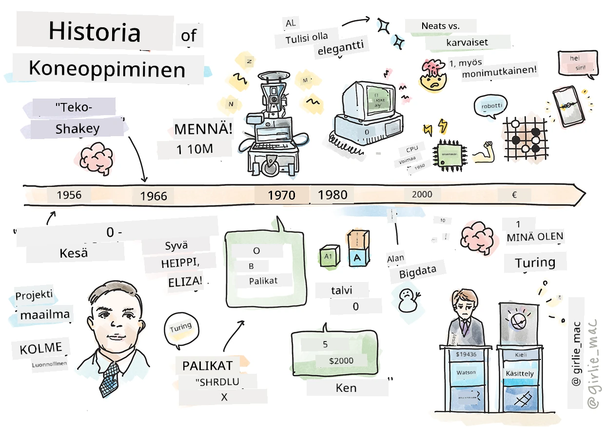
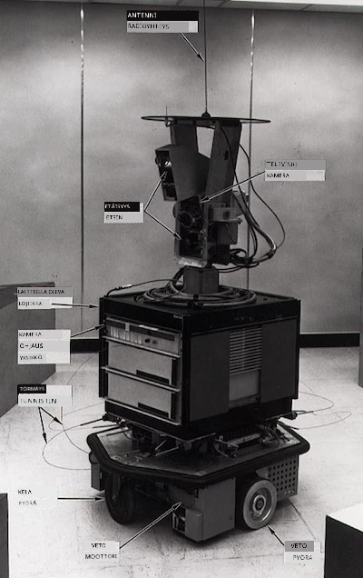
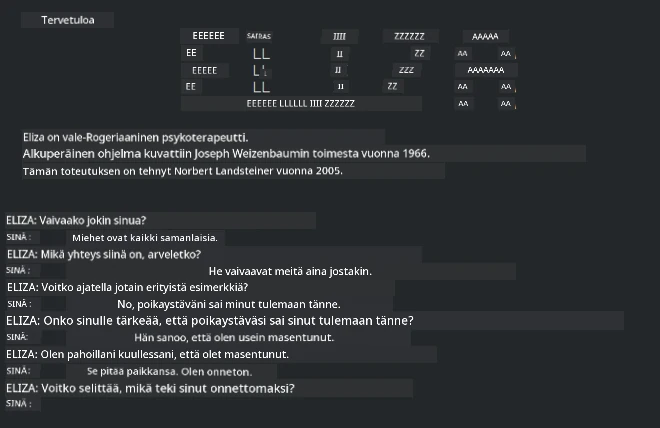

# Koneoppimisen historia

> Sketchnote tekijältä [Tomomi Imura](https://www.twitter.com/girlie_mac)

## [Esiluentokoe](https://ff-quizzes.netlify.app/en/ml/)

---

> 🎥 Klikkaa yllä olevaa kuvaa nähdäksesi lyhyen videon, joka käy tämän oppitunnin läpi.

Tässä oppitunnissa käymme läpi koneoppimisen ja tekoälyn historian merkittäviä virstanpylväitä.

Tekoälyn (AI) historian ala on kietoutunut koneoppimisen historian kanssa, sillä koneoppimisen perustana olevat algoritmit ja laskennalliset edistysaskeleet ovat vaikuttaneet tekoälyn kehitykseen. On hyödyllistä muistaa, että vaikka nämä alat alkoivat eriytyä tutkimuskohteina 1950-luvulla, tärkeitä [algoritmisia, tilastollisia, matemaattisia, laskennallisia ja teknisiä löytöjä](https://wikipedia.org/wiki/Timeline_of_machine_learning) tehtiin jo tätä ennen ja ne lomittuivat tähän aikaan. Itse asiassa ihmiset ovat miettineet näitä kysymyksiä jo [satojen vuosien ajan](https://wikipedia.org/wiki/History_of_artificial_intelligence): tämä artikkeli käsittelee 'ajattelevan koneen' idean historiallisia älyllisiä taustoja.

---
## Merkittävät löydöt

- 1763, 1812 [Bayesin teoreema](https://wikipedia.org/wiki/Bayes%27_theorem) ja sen edeltäjät. Tämä teoreema ja sen sovellukset muodostavat päättelyn perustan, kuvaillen tapahtuman todennäköisyyttä aiemman tiedon pohjalta.
- 1805 [Vähimmän neliösumman teoria](https://wikipedia.org/wiki/Least_squares) ranskalaisen matemaatikon Adrien-Marie Legendren kehittämä. Tätä teoriaa, josta opit Regression yksikössä, käytetään datan sovittamisessa.
- 1913 [Markovin ketjut](https://wikipedia.org/wiki/Markov_chain), nimetty venäläisen matemaatikon Andrey Markovin mukaan, kuvaa mahdollisten tapahtumien sarjaa edellisen tilan perusteella.
- 1957 [Perceptroni](https://wikipedia.org/wiki/Perceptron) on amerikkalaisen psykologin Frank Rosenblattin keksimä lineaarinen luokitin, joka on syväoppimisen edistysten perusta.

---

- 1967 [Lähin naapuri](https://wikipedia.org/wiki/Nearest_neighbor) on algoritmi, joka alun perin suunniteltiin reittien kartoittamiseen. Koneoppimiskontekstissa sitä käytetään mallien tunnistukseen.
- 1970 [Takaisinkytkentä](https://wikipedia.org/wiki/Backpropagation) käytetään [eteenpäin suuntautuvien neuroverkkojen](https://wikipedia.org/wiki/Feedforward_neural_network) kouluttamiseen.
- 1982 [Toistuvat neuroverkot](https://wikipedia.org/wiki/Recurrent_neural_network) ovat tekoälyn neuroverkkoja, jotka perustuvat etenpäin suuntautuviin neuroverkkoihin ja muodostavat aikaperusteisia graafeja.

✅ Tutustu hetki. Mitkä muut päivämäärät erottuvat koneoppimisen ja tekoälyn historiassa ratkaisevina?

---
## 1950: Ajattelevat koneet

Alan Turing, todella merkittävä henkilö, joka valittiin [yleisön toimesta vuonna 2019](https://wikipedia.org/wiki/Icons:_The_Greatest_Person_of_the_20th_Century) 1900-luvun merkittävimmäksi tiedemieheksi, on saanut tunnustusta 'ajattelevan koneen' käsitteen perustan luomisesta. Hän käsitteli epäilijöitä ja omaa tarvettaan empiiriseen todistukseen osittain luomalla [Turingin testin](https://www.bbc.com/news/technology-18475646), johon tutustut NLP-opinnoissamme.

---
## 1956: Dartmouthin kesätutkimusprojekti

"Dartmouthin kesätutkimusprojekti tekoälystä oli merkittävä tapahtuma tekoälyn alan kehityksessä", ja siellä syntyi termi 'tekoäly' ([lähde](https://250.dartmouth.edu/highlights/artificial-intelligence-ai-coined-dartmouth)).

> Oppimisen jokainen osa-alue tai mikään muu älykkyyden piirre voidaan periaatteessa kuvata niin tarkasti, että kone voidaan saada simuloimaan sitä.

---

Kärkitutkija, matematiikan professori John McCarthy, toivoi "etenemistä olettamuksen perusteella, että oppimisen jokainen osa-alue tai älykkyyden piirre voidaan periaatteessa määritellä niin tarkasti, että kone voidaan saada simuloimaan sitä." Osallistujina oli myös alan toinen tähti, Marvin Minsky.

Työpajaa pidetään alkuunpanijana ja kannustajana useille keskusteluille, mukaan lukien "symbolisten menetelmien nousu, rajattuihin alueisiin keskittyneet järjestelmät (varhaiset asiantuntijajärjestelmät) sekä deduktiiviset ja induktiiviset järjestelmät." ([lähde](https://wikipedia.org/wiki/Dartmouth_workshop)).

---
## 1956 - 1974: "Kultaiset vuodet"

1950-luvulta 1970-luvun puoliväliin optimismi oli korkealla tekniikan kyvylle ratkaista monia ongelmia. Vuonna 1967 Marvin Minsky lausui luottavaisesti, että "Sukupolven sisällä ... 'tekoälyn' luomisen ongelma on olennaisesti ratkaistu." (Minsky, Marvin (1967), Computation: Finite and Infinite Machines, Englewood Cliffs, N.J.: Prentice-Hall)

Luonnollisen kielen käsittelyn tutkimus kukoisti, haku jalostui ja tehostui, ja luotiin käsite 'mikromaailmoista', joissa yksinkertaisia tehtäviä suoritettiin tavallisilla kieliohjeilla.

---

Tutkimus sai runsaasti rahoitusta valtion toimijoilta, laskennassa ja algoritmeissa edistyttiin, ja rakennettiin älykkäiden koneiden prototyyppejä. Joitakin näistä koneista ovat:

* [Shakey-robotti](https://wikipedia.org/wiki/Shakey_the_robot), joka kykeni liikkumaan ja päättämään tehtävien tekemisestä 'älykkäästi'.

    
    > Shakey vuonna 1972

---

* Eliza, varhainen 'chatbot', osasi keskustella ihmisten kanssa ja toimia primitiivisenä 'terapeuttina'. Opit lisää Elizasta NLP-opinnoissa.

    
    > Versio Elizasta, chatbotista

---

* "Blocks world" oli esimerkki mikromaailmasta, jossa palikoita voitiin pinota ja lajitella, ja koneiden päätöksenteon opettamista voitiin kokeilla. Edistysaskeleet, jotka liittyivät kirjastoihin kuten [SHRDLU](https://wikipedia.org/wiki/SHRDLU), auttoivat kielenkäsittelyn kehitystä.

    

    > 🎥 Klikkaa yllä olevaa kuvaa nähdäksesi videon: Blocks world ja SHRDLU

---
## 1974 - 1980: "Tekoälyn talvi"

1970-luvun puoliväliin mennessä kävi ilmi, että 'älykkäiden koneiden' tekemisen monimutkaisuutta oli vähätelty ja sen lupaus käytettävissä olevan laskentatehon perusteella liioiteltu. Rahoitus kuivui ja alan luottamus heikkeni. Luottamusta heikensivät mm. seuraavat tekijät:
---
- **Rajoitteet**. Laskentateho oli liian rajallinen.
- **Yhdistelmällinen räjähdys**. Parametrien määrä, jotka piti kouluttaa, kasvoi eksponentiaalisesti sitä mukaa kun tietokoneilta vaadittiin enemmän, ilman vastaavaa laskentatehon kehitystä.
- **Datapula**. Datapula hankaloitti algoritmien testausta, kehitystä ja hienosäätöä.
- **Kysytäänkö oikeita kysymyksiä?**. Itseä kysymyksiä alettiin kyseenalaistaa. Tutkijat kohtasivat kritiikkiä lähestymistavoistaan:
  - Turingin testejä kyseenalaistettiin mm. 'kiinalaishuone-teorian' avulla, joka väitti, että "digitaalisen tietokoneen ohjelmointi saattaa saada sen vaikuttamaan ymmärtävän kieltä, mutta se ei voi tuottaa aitoa ymmärrystä." ([lähde](https://plato.stanford.edu/entries/chinese-room/))
  - Tekoälyjen, kuten 'terapeutti' ELIZAn, yhteiskuntaan tuomisen etiikkaa asetettiin kyseenalaiseksi.

---

Samaan aikaan syntyi erilaisia tekoälyn ajatussuuntauksia. Muodostui kahtiajako ["huolimattoman" ja "siistin tekoälyn"](https://wikipedia.org/wiki/Neats_and_scruffies) käytäntöjen välillä. _Huolimattomat_ laboratoriot muokkasivat ohjelmia useita tunteja saadakseen halutut tulokset. _Siistit_ laboratoriot "keskittyivät logiikkaan ja muodolliseen ongelmanratkaisuun". ELIZA ja SHRDLU olivat tunnettuja _huolimattomia_ järjestelmiä. 1980-luvulla, kun koneoppimisjärjestelmiä alettiin vaatia toistettavaksi, _siisti_ lähestymistapa nousi etualalle, koska sen tulokset ovat helpommin selitettävissä.

---
## 1980-luku Asiantuntijajärjestelmät

Alan kasvaessa sen hyöty liiketoiminnalle kävi selväksi, ja 1980-luvulla asiantuntijajärjestelmät yleistyivät. "Asiantuntijajärjestelmät olivat yksi ensimmäisistä todella menestyksekkäistä tekoälysovelluksista." ([lähde](https://wikipedia.org/wiki/Expert_system)).

Tämän tyyppinen järjestelmä on itse asiassa _hybridi_, joka koostuu osittain säännönohjaimesta liiketoiminnan vaatimuksia määrittelemässä ja päättelymoottorista, joka hyödyntää sääntöjärjestelmää johdellakseen uusia faktoja.

Tänä aikana neuroverkkoihin kiinnitettiin myös yhä enemmän huomiota.

---
## 1987 - 1993: Tekoälyn 'jäähtymisaika'

Asiantuntijajärjestelmien laitteiston yleistyminen johti valitettavasti niiden liialliseen erikoistumiseen. Henkilökohtaisten tietokoneiden nousu kilpaili näiden suurten, erikoistuneiden, keskitettyjen järjestelmien kanssa. Tietotekniikan demokratisoituminen oli alkanut ja se lopulta avasi tien nykyaikaiselle big datan räjähdykselle.

---
## 1993 - 2011

Tänä aikakautena koneoppiminen ja tekoäly pääsivät ratkaisemaan joitain aiempina vuosina syntyneitä ongelmia datan ja laskentatehon puutteen vuoksi. Datan määrä alkoi kasvaa nopeasti ja tuli laajemmin saataville, hyvässä ja pahassa, erityisesti älypuhelimen tulon myötä noin vuonna 2007. Laskentateho laajeni eksponentiaalisesti ja algoritmit kehittyivät sen mukana. Ala alkoi kypsyä, ja menneet vapaamieliset ajat muuttuivat oikeaksi tieteenalaksi.

---
## Nykyhetki

Nykyään koneoppiminen ja tekoäly koskettavat lähes kaikkia elämämme osa-alueita. Tämä aikakausi vaatii huolellista ymmärrystä näiden algoritmien riskeistä ja mahdollisista vaikutuksista ihmisten elämään. Kuten Microsoftin Brad Smith on todennut, "Tietotekniikka nostaa esiin kysymyksiä, jotka koskettavat perustavanlaatuisia ihmisoikeuksien suojia, kuten yksityisyyttä ja sananvapautta. Nämä kysymykset lisäävät vastuun määrää teknologiayrityksille, jotka luovat näitä tuotteita. Meidän näkemyksemme mukaan ne myös vaativat harkittua valtion sääntelyä ja hyväksyttävien käyttötapojen normien kehittämistä." ([lähde](https://www.technologyreview.com/2019/12/18/102365/the-future-of-ais-impact-on-society/)).

---

Tulevaisuus näyttää, mitä se tuo tullessaan, mutta on tärkeää ymmärtää nämä tietokonejärjestelmät sekä niiden ajama ohjelmisto ja algoritmit. Toivomme, että tämä opintokokonaisuus auttaa sinua saamaan paremman ymmärryksen, jotta voit itse päättää.

> 🎥 Klikkaa yllä olevaa kuvaa nähdäksesi videon: Yann LeCun käsittelee syväoppimisen historiaa tässä luennossa

---
## 🚀Haaste

Syvenny johonkin näistä historiallisista hetkistä ja opi lisää niitä kehittäneistä ihmisistä. Henkilöt ovat kiehtovia, eivätkä tieteelliset löydöt koskaan synny kulttuurisessa tyhjiössä. Mitä löydät?

## [Jälkiluentokoe](https://ff-quizzes.netlify.app/en/ml/)

---
## Kertaus ja itsenäinen opiskelu

Tässä on katsottavaa ja kuunneltavaa:

[Tämä podcaste, jossa Amy Boyd keskustelee tekoälyn kehityksestä](http://runasradio.com/Shows/Show/739)

---

## Tehtävä

[Luo aikajana](assignment.md)

---

<!-- CO-OP TRANSLATOR DISCLAIMER START -->
**Vastuuvapauslauseke**:
Tämä asiakirja on käännetty käyttämällä tekoälypohjaista käännöspalvelua [Co-op Translator](https://github.com/Azure/co-op-translator). Vaikka pyrimme tarkkuuteen, otathan huomioon, että automaattiset käännökset saattavat sisältää virheitä tai epätarkkuuksia. Alkuperäinen asiakirja sen alkuperäiskielellä on virallinen lähde. Tärkeissä asioissa suositellaan ammattimaista ihmiskäännöstä. Emme ole vastuussa tämän käännöksen käytöstä aiheutuvista väärinymmärryksistä tai tulkinnoista.
<!-- CO-OP TRANSLATOR DISCLAIMER END -->