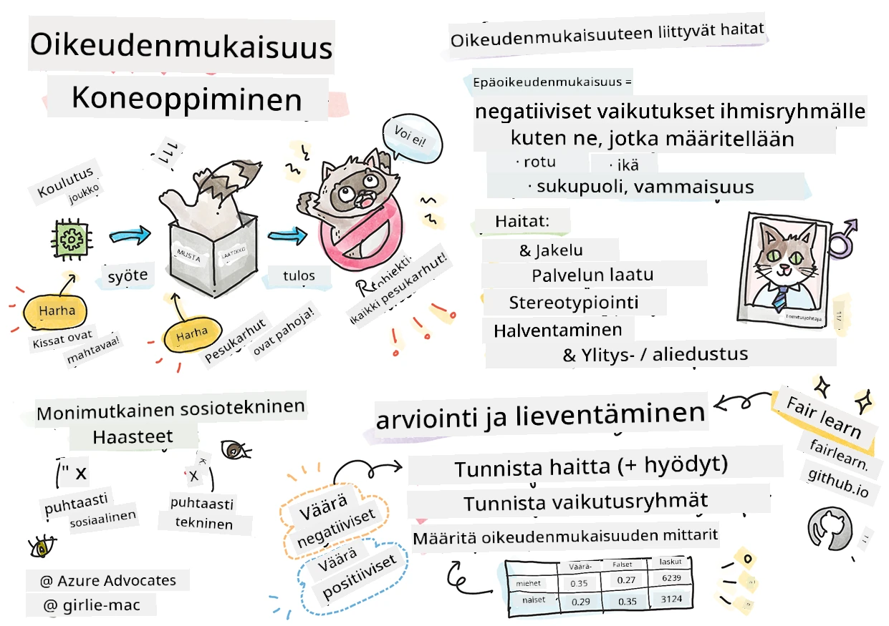
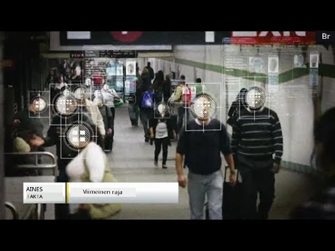

# Koneoppimissovellusten rakentaminen vastuullisella tekoälyllä
 

> Sketchnote tekijältä [Tomomi Imura](https://www.twitter.com/girlie_mac)

## [Ennakkokysely](https://ff-quizzes.netlify.app/en/ml/)
 
## Johdanto

Tässä opetussuunnitelmassa alat tutkia, miten koneoppiminen voi vaikuttaa ja vaikuttaa jo arkeemme. Järjestelmät ja mallit ovat jo nyt mukana päivittäisissä päätöksentekotehtävissä, kuten terveydenhuollon diagnooseissa, lainojen hyväksynnöissä tai petosten havaitsemisessa. Tästä syystä on tärkeää, että nämä mallit toimivat hyvin ja tuottavat luotettavia tuloksia. Kuten mikä tahansa ohjelmistosovellus, tekoälyjärjestelmät voivat epäonnistua odotuksissa tai tuottaa ei-toivottuja tuloksia. Siksi on olennaista ymmärtää ja pystyä selittämään tekoälymallin käyttäytyminen.

Kuvittele, mitä voi tapahtua, kun mallin rakentamisessa käytetyissä tiedoissa puuttuu tiettyjä väestöryhmiä, kuten rotu, sukupuoli, poliittinen näkemys, uskonto, tai aineisto edustaa tällaisia ryhmiä epäsuhteisesti. Entä kun mallin tuotos tulkitaan suosivan jotakin väestöryhmää? Mikä on tämän sovelluksen seuraus? Lisäksi, mitä tapahtuu, kun malli tuottaa kielteisen lopputuloksen ja vahingoittaa ihmisiä? Kuka on vastuussa tekoälyjärjestelmän käyttäytymisestä? Näitä kysymyksiä käsitellään tässä opetussuunnitelmassa.

Tässä oppitunnissa opit:

- Tietoisuuden lisääminen oikeudenmukaisuuden merkityksestä koneoppimisessa ja oikeudenmukaisuuteen liittyvistä vahingoista.
- Tutustuminen poikkeuksiin ja epätavallisiin tilanteisiin laadunvarmistuksen ja turvallisuuden takaamiseksi.
- Ymmärrys tarpeesta voimaannuttaa kaikki suunnittelemalla osallistavia järjestelmiä.
- Tutkia kuinka tärkeää on suojella tiedon ja ihmisten yksityisyyttä ja turvallisuutta.
- Näyttää lasilaatikkomenetelmän merkitys tekoälymallien käyttäytymisen selittämisessä.
- Huomioida, kuinka vastuullisuus on välttämätöntä luottamuksen rakentamiseksi tekoälyjärjestelmiin.

## Esitiedot

Esitietona ota "Vastuullisen tekoälyn periaatteet" -oppimispolku ja katso alla oleva video aiheesta:

Lue lisää Vastuullisesta tekoälystä seuraamalla tätä [Oppimispolkua](https://docs.microsoft.com/learn/modules/responsible-ai-principles/?WT.mc_id=academic-77952-leestott)

> 🎥 Klikkaa yllä olevaa kuvaa nähdäksesi videon: Microsoftin lähestymistapa vastuulliseen tekoälyyn

## Oikeudenmukaisuus

Tekoälyjärjestelmien tulisi kohdella kaikkia oikeudenmukaisesti ja välttää vaikuttamasta samanlaisiin ihmisryhmiin eri tavoin. Esimerkiksi kun tekoälyjärjestelmät antavat ohjeita lääketieteellisestä hoidosta, lainahakemuksista tai työllistymisestä, niiden tulisi antaa samanlaiset suositukset kaikille, joilla on samankaltaiset oireet, taloudellinen tilanne tai ammatilliset pätevyydet. Me ihmisinä kannamme mukanamme perittyjä ennakkoluuloja, jotka vaikuttavat päätöksiimme ja tekoihimme. Nämä ennakkoluulot voivat näkyä myös data-aineistoissa, joita käytämme tekoälyjärjestelmien kouluttamiseen. Tällainen manipulaatio voi joskus tapahtua tahattomasti. On usein vaikeaa tiedostaa, milloin tuomme vinoumaa dataan.

**”Epäoikeudenmukaisuus”** sisältää negatiiviset vaikutukset tai ”vahingot” tietylle ihmisryhmälle, kuten rotu, sukupuoli, ikä tai vammaisuus. Merkittävät oikeudenmukaisuuteen liittyvät haitat voidaan luokitella seuraavasti:

- **Jakautuminen**, jos esimerkiksi sukupuolta tai etnistä ryhmää suositaan toisen yli.
- **Palvelun laatu**. Jos data on koulutettu vain yhteen tiettyyn tilanteeseen, mutta todellisuus on paljon monimutkaisempi, tuloksena on huonosti toimiva palvelu. Esimerkiksi käsisaippua-annostelija, joka ei tunnistanut tummaihoisia ihmisiä. [Lähde](https://gizmodo.com/why-cant-this-soap-dispenser-identify-dark-skin-1797931773)
- **Halventaminen**. Epäreilu kriittisyys ja leimaaminen jotakin tai jotakuta kohtaan. Esimerkiksi kuvantunnistusteknologia väärin luokitteli tummaihoisia ihmisiä gorilloiksi.
- **Liiallinen tai puutteellinen edustavuus**. Ajatus siitä, että tietty ryhmä ei ole näkyvä tietyssä ammatissa, ja kaikki palvelut tai toiminnot, jotka ylläpitävät tätä, vahingoittavat.
- **Stereotypioiden luominen**. Tietyn ryhmän yhdistäminen ennalta annettuihin ominaisuuksiin. Esimerkiksi englannin ja turkin kielen käännösjärjestelmässä voi esiintyä epätarkkuuksia, koska sanoilla on sukupuoleen liittyviä stereotypioita.

> käännös turkiksi

> käännös takaisin englanniksi

Kun suunnittelemme ja testaamme tekoälyjärjestelmiä, meidän tulee varmistaa, että tekoäly on oikeudenmukaista eikä ohjelmoitu tekemään vinoutuneita tai syrjiviä päätöksiä, joista ihmisiltäkin on kiellettyä. Vastuullisuuden takaaminen tekoälyssä ja koneoppimisessa on edelleen monimutkainen yhteiskunnallinen haaste.

### Luotettavuus ja turvallisuus

Luottamuksen rakentamiseksi tekoälyjärjestelmien tulee olla luotettavia, turvallisia ja johdonmukaisia normaaleissa ja odottamattomissa tilanteissa. On tärkeää tietää, miten tekoäly toimii erilaisissa tilanteissa, erityisesti poikkeustapauksissa. Kun rakennetaan tekoälyratkaisuja, on keskeistä keskittyä siihen, miten järjestelmä käsittelee laajaa kirjoa tilanteita, joita se kohtaisi. Esimerkiksi itseajavan auton tulee asettaa ihmisten turvallisuus etusijalle. Siksi auton tekoälyn täytyy ottaa huomioon kaikki mahdolliset tilanteet, kuten yö, ukkosmyrskyt, lumimyrskyt, lapset juoksemassa kadun poikki, lemmikit, tienrakennustyöt jne. Kuinka hyvin tekoäly pystyy luotettavasti ja turvallisesti käsittelemään monenlaista tilannetta heijastaa,data scientistin tai tekoälyn kehittäjän ennakointikykyä suunnittelun ja testauksen aikana.

> [🎥 Klikkaa tästä videoon: ](https://www.microsoft.com/videoplayer/embed/RE4vvIl)

### Osallisuus

Tekoälyjärjestelmät tulee suunnitella siten, että ne aktivoivat ja voimaannuttavat kaikkia. Tekoälytieteilijät ja kehittäjät tunnistavat ja poistavat järjestelmän potentiaaliset esteet, jotka voivat tahattomasti syrjiä ihmisiä. Esimerkiksi maailmassa on miljardi ihmistä, joilla on vamma. Tekoälyn kehittyessä he voivat helpommin saada pääsyn monenlaiseen tietoon ja mahdollisuuksiin arjessaan. Esteiden poistaminen luo mahdollisuuksia innovoida ja kehittää tekoälytuotteita, jotka tarjoavat parempia käyttökokemuksia ja hyödyttävät kaikkia.

> [🎥 Klikkaa tästä videoon: osallisuus tekoälyssä](https://www.microsoft.com/videoplayer/embed/RE4vl9v)

### Turvallisuus ja yksityisyys

Tekoälyjärjestelmien tulee olla turvallisia ja kunnioittaa ihmisten yksityisyyttä. Ihmiset luottavat vähemmän järjestelmiin, jotka asettavat heidän yksityisyytensä, tietonsa tai henkensä vaaraan. Koneoppimismallien kouluttamisessa luotamme dataan parhaiden tulosten tuottamiseksi. Tässä yhteydessä datan alkuperä ja eheys tulee ottaa huomioon. Esimerkiksi, onko data käyttäjän lähettämää vai julkisesti saatavilla? Työskennellessä datan kanssa on keskeistä kehittää tekoälyjärjestelmiä, jotka voivat suojella luottamuksellisia tietoja ja kestää hyökkäyksiä. Kun tekoälyn käyttö kasvaa, yksityisyyden suojaaminen ja tärkeiden henkilö- ja liiketietojen turvaaminen tulee yhä tärkeämmäksi ja monimutkaisemmaksi. Yksityisyys- ja tietoturva-asioihin on kiinnitettävä erityistä huomiota tekoälyn kohdalla, koska tieto on välttämätöntä, jotta tekoäly pystyy tekemään tarkkoja ja tietoon perustuvia ennusteita ja päätöksiä ihmisistä.

> [🎥 Klikkaa tästä videoon: turvallisuus tekoälyssä](https://www.microsoft.com/videoplayer/embed/RE4voJF)

- Toimialana olemme tehneet merkittäviä edistysaskelia yksityisyyden ja turvallisuuden saralla, mihin osaltaan ovat vaikuttaneet voimakkaasti säädökset kuten GDPR (Yleinen tietosuoja-asetus).
- Kuitenkin tekoälyjärjestelmien kohdalla meidän tulee hyväksyä jännite tarpeen välillä saada enemmän henkilökohtaista dataa tehdä järjestelmistä henkilökohtaisempia ja tehokkaampia – ja yksityisyyden välillä.
- Samoin kuin internetin ja yhdistettyjen tietokoneiden synnyn aikaan, myös tekoälyyn liittyvien tietoturvaongelmien määrä on kasvanut huomattavasti.
- Samalla tekoälyä on käytetty turvallisuuden parantamiseen. Esimerkiksi useimmat nykyaikaiset virustorjuntaohjelmat käyttävät tekoälyä heuristiikkana.
- Meidän tulee varmistaa, että datatieteelliset prosessimme ovat yhteensopivia viimeisimpien yksityisyys- ja turvallisuuskäytäntöjen kanssa.

### Läpinäkyvyys
Tekoälyjärjestelmien tulee olla ymmärrettäviä. Olennainen osa läpinäkyvyyttä on tekoälyjärjestelmien ja niiden osien käyttäytymisen selittäminen. Tekoälyjärjestelmien ymmärtämisen parantaminen edellyttää, että sidosryhmät ymmärtävät, miten ja miksi ne toimivat, jotta he voivat tunnistaa mahdolliset suorituskykyongelmat, turvallisuus- ja yksityisyysongelmat, vinoumat, syrjivät käytännöt tai ei-toivotut lopputulokset. Uskomme myös, että tekoälyjärjestelmiä käyttävien tulee olla rehellisiä ja avoimia siitä, milloin, miksi ja miten he ottavat ne käyttöön. Samoin järjestelmien rajoituksista, joita he käyttävät. Esimerkiksi, jos pankki käyttää tekoälyjärjestelmää tukemaan kuluttajalainapäätöksiä, on tärkeää tarkastella tuloksia ja ymmärtää, mikä data vaikuttaa järjestelmän suosituksiin. Hallitukset alkavat säädellä tekoälyä eri aloilla, joten datatieteilijöiden ja organisaatioiden täytyy pystyä selittämään, täyttääkö tekoälyjärjestelmä säädösvaatimukset, etenkin kun lopputulos on epätoivottu.

> [🎥 Klikkaa tästä videoon: läpinäkyvyys tekoälyssä](https://www.microsoft.com/videoplayer/embed/RE4voJF)

- Koska tekoälyjärjestelmät ovat niin monimutkaisia, on vaikea ymmärtää, miten ne toimivat, ja tulkita tuloksia.
- Tämä ymmärryksen puute vaikuttaa siihen, miten järjestelmiä hallinnoidaan, otetaan käyttöön ja dokumentoidaan.
- Tämä ymmärryksen puute vaikuttaa vielä merkittävimmin päätöksiin, joita tehdään järjestelmien tuottamien tulosten perusteella.

### Vastuullisuus
 
Ihmisten, jotka suunnittelevat ja ottavat käyttöön tekoälyjärjestelmiä, on oltava vastuussa niiden toiminnasta. Vastuullisuuden tarve korostuu erityisesti arkaluontoisten teknologioiden, kuten kasvojentunnistuksen, kohdalla. Viime aikoina on lisääntynyt kysyntä kasvojentunnistusteknologialle, erityisesti lainvalvontajärjestöjen keskuudessa, jotka näkevät sen potentiaalin esimerkiksi kadonneiden lasten löytämisessä. Kuitenkin näitä teknologioita voisi mahdollisesti käyttää hallitus asettamaan kansalaistensa perusoikeuksia vaaraan, esimerkiksi sallimalla jatkuvan valvonnan tiettyjä henkilöitä kohtaan. Näin ollen datatieteilijöiden ja organisaatioiden on oltava vastuussa siitä, miten heidän tekoälyjärjestelmänsä vaikuttaa yksilöihin tai yhteiskuntaan.

> 🎥 Klikkaa yllä olevaa kuvaa videoon: Varotoimet massavalvontaa vastaan kasvojentunnistuksen avulla

Lopulta yksi suurimmista sukupolveamme koskevista kysymyksistä, kun olemme ensimmäinen tekoälyn yhteiskuntaan tuova sukupolvi, on miten varmistamme, että tietokoneet pysyvät vastuullisina ihmisille ja että tietokoneita suunnittelevat ihmiset pysyvät vastuullisina kaikille muille.

## Vaikutusten arviointi

Ennen koneoppimismallin kouluttamista on tärkeää tehdä vaikutusten arviointi ymmärtääkseen tekoälyjärjestelmän tarkoituksen; millainen sen suunniteltu käyttötarkoitus on; missä sitä käytetään ja keiden kanssa järjestelmä toimii. Nämä tiedot auttavat arvioijia tai testaajia ottamaan huomioon tekijät, kun he tunnistavat mahdollisia riskejä ja odotettuja seurauksia.

Alla on painopistealueita vaikutusten arvioinnissa:

* **Haitalliset vaikutukset yksilöihin**. On tärkeää olla tietoinen rajoituksista tai vaatimuksista, tuettomista käyttötarkoituksista tai tunnetuista rajoituksista, jotka häiritsevät järjestelmän suorituskykyä, jotta vältetään haitalliset vaikutukset yksilöihin.
* **Datan vaatimukset**. Ymmärtämällä, miten ja missä järjestelmä käyttää dataa, arvioijat voivat tutkia mahdollisia datavaatimuksia (esim. GDPR- tai HIPAA-säädökset). Lisäksi on tarkasteltava, onko datan lähde tai määrä riittävä koulutukseen.
* **Vaikutusten yhteenveto**. Kerää lista mahdollisista haittavaikutuksista, joita järjestelmän käyttö voisi aiheuttaa. Koneoppimiselinkaaren aikana arvioi, onko tunnistetut ongelmat lievennetty tai korjattu.
* **Sovellettavat tavoitteet** kullekin kuudesta perusperiaatteesta. Arvioi, täyttyvätkö periaatteiden tavoitteet ja onko puutteita.

## Virheiden korjaus vastuullisella tekoälyllä

Samoin kuin ohjelmistosovelluksen virheenkorjaus, myös tekoälyjärjestelmän virheenkorjaus on välttämätön prosessi järjestelmän ongelmien tunnistamiseksi ja ratkaisemiseksi. On monia tekijöitä, jotka voivat vaikuttaa siihen, että malli ei toimi odotetusti tai vastuullisesti. Useimmat perinteiset mallin suorituskykymittarit ovat mallin suorituskyvyn numeerisia yhteenlaskuja, mutta ne eivät riitä analysoimaan, miten malli rikkoo vastuullisen tekoälyn periaatteita. Lisäksi koneoppimismalli on musta laatikko, mikä tekee vaikeaksi ymmärtää, mikä ohjaa sen tuloksia tai selittää virheitä. Myöhemmin tässä kurssissa opimme käyttämään vastuullisen tekoälyn hallintapaneelia auttamaan tekoälyjärjestelmien virheenkorjauksessa. Hallintapaneeli tarjoaa kokonaisvaltaisen työkalun datatieteilijöille ja tekoälyn kehittäjille seuraaviin tehtäviin:

* **Virheanalyysi**. Mallin virheiden jakautumisen tunnistaminen, mikä voi vaikuttaa järjestelmän oikeudenmukaisuuteen tai luotettavuuteen.
* **Mallin yleiskatsaus**. Mallin suorituskyvyn erojen tunnistaminen eri datajoukoissa.
* **Datan analyysi**. Datan jakautumisen ymmärtäminen ja mahdollisten vinoumien tunnistaminen, jotka voivat johtaa oikeudenmukaisuuden, osallisuuden ja luotettavuuden ongelmiin.
* **Mallin tulkittavuus**. Ymmärtää, mikä vaikuttaa tai ohjaa mallin ennusteita. Tämä auttaa selittämään mallin käyttäytymistä, mikä on tärkeää läpinäkyvyyden ja vastuullisuuden kannalta.

## 🚀 Haaste
 
Estääksemme vahinkojen syntymisen, meidän tulisi:

- varmistaa, että järjestelmien parissa työskentelee monipuolisesti eri taustoista ja näkökulmista tulevia ihmisiä
- investoida aineistoihin, jotka heijastavat yhteiskuntamme monimuotoisuutta
- kehittää parempia menetelmiä koneoppimisen elinkaaren aikana vastuullisen tekoälyn tunnistamiseen ja korjaamiseen

Mieti tosielämän tilanteita, joissa mallin epäluotettavuus tulee ilmi mallin rakentamisessa ja käytössä. Mitä muuta meidän pitäisi ottaa huomioon?

## [Jälkikysely](https://ff-quizzes.netlify.app/en/ml/)

## Kertaus & Itsenäinen opiskelu
 

Tässä oppitunnissa olet oppinut joitakin koneoppimisen oikeudenmukaisuuden ja epäoikeudenmukaisuuden käsitteiden perusteita.  
 
Katso tämä työpaja saadaksesi syvällisempää tietoa aiheista: 

- Kohti vastuullista tekoälyä: Periaatteiden vieminen käytäntöön, esittäjinä Besmira Nushi, Mehrnoosh Sameki ja Amit Sharma

> 🎥 Klikkaa yllä olevaa kuvaa videoon: RAI Toolbox: Avoimen lähdekoodin kehys vastuullisen tekoälyn rakentamiseen, esittäjinä Besmira Nushi, Mehrnoosh Sameki ja Amit Sharma

Tutustu myös: 

- Microsoftin RAI-resurssikeskus: [Responsible AI Resources – Microsoft AI](https://www.microsoft.com/ai/responsible-ai-resources?activetab=pivot1%3aprimaryr4) 

- Microsoftin FATE-tutkimusryhmä: [FATE: Fairness, Accountability, Transparency, and Ethics in AI - Microsoft Research](https://www.microsoft.com/research/theme/fate/) 

RAI Toolbox: 

- [Responsible AI Toolboxin GitHub-repositorio](https://github.com/microsoft/responsible-ai-toolbox)

Lue Azure Machine Learningin työkaluista, jotka varmistavat oikeudenmukaisuuden:

- [Azure Machine Learning](https://docs.microsoft.com/azure/machine-learning/concept-fairness-ml?WT.mc_id=academic-77952-leestott) 

## Tehtävä

[Tutustu RAI Toolboxiin](assignment.md)

---

<!-- CO-OP TRANSLATOR DISCLAIMER START -->
**Vastuuvapauslauseke**:
Tämä asiakirja on käännetty käyttämällä tekoälypohjaista käännöspalvelua [Co-op Translator](https://github.com/Azure/co-op-translator). Vaikka pyrimme tarkkuuteen, otathan huomioon, että automaattiset käännökset saattavat sisältää virheitä tai epätarkkuuksia. Alkuperäinen asiakirja sen alkuperäiskielellä on virallinen lähde. Tärkeissä asioissa suositellaan ammattimaista ihmiskäännöstä. Emme ole vastuussa tämän käännöksen käytöstä aiheutuvista väärinymmärryksistä tai tulkinnoista.
<!-- CO-OP TRANSLATOR DISCLAIMER END -->