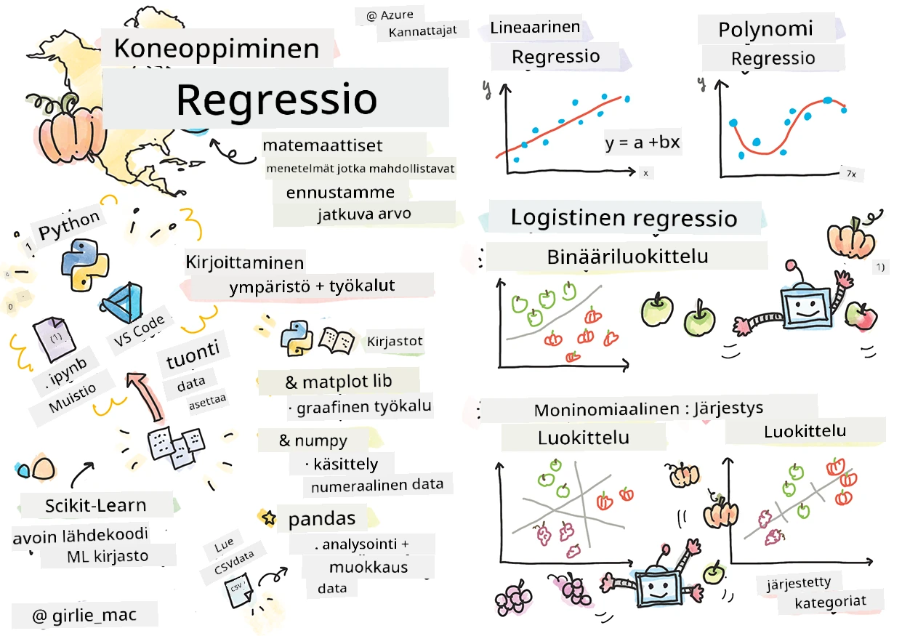
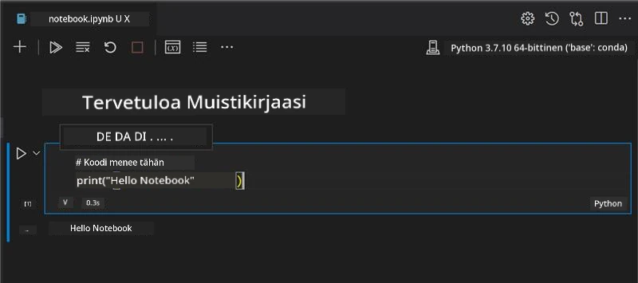
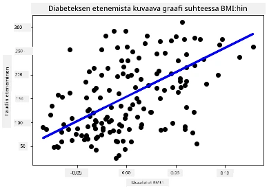

# Aloita Pythonin ja Scikit-learnin kanssa regressiomallien tekeminen



> Sketchnote tekijältä [Tomomi Imura](https://www.twitter.com/girlie_mac)

## [Alkuverkkokysely](https://ff-quizzes.netlify.app/en/ml/)

> ### [Tämä opetus on saatavilla myös R:llä!](../../../../2-Regression/1-Tools/solution/R/lesson_1.html)

## Johdanto

Näissä neljässä oppitunnissa opit rakentamaan regressiomalleja. Keskustelemme pian, mihin niitä tarvitaan. Mutta ennen kuin aloitat, varmista, että sinulla on oikeat työkalut käytettävissä prosessin aloittamiseksi!

Tässä oppitunnissa opit:

- Konfiguroimaan tietokoneesi paikallisia koneoppimistehtäviä varten.
- Työskentelemään Jupyter Notebookien kanssa.
- Käyttämään Scikit-learnia, mukaan lukien asennuksen.
- Tutustumaan lineaariseen regressioon käytännön harjoituksen avulla.

## Asennukset ja asetukset

[](https://youtu.be/-DfeD2k2Kj0 "Aloittelijoille ML - Valmistele työkalut koneoppimismallien rakentamista varten")

> 🎥 Klikkaa yllä olevaa kuvaa lyhyen videon katsomiseksi, jossa käydään läpi tietokoneen konfigurointi ML:ää varten.

1. **Asenna Python**. Varmista, että [Python](https://www.python.org/downloads/) on asennettu tietokoneellesi. Käytät Pythonia monissa datatieteen ja koneoppimisen tehtävissä. Useimmissa tietokonejärjestelmissä on valmiiksi asennettuna Python. On myös hyödyllisiä [Python-koodauspaketteja](https://code.visualstudio.com/learn/educators/installers?WT.mc_id=academic-77952-leestott), jotka helpottavat asennusta joillekin käyttäjille.

   Joissakin Pythonin käyttötapauksissa tarvitaan yksi ohjelmistoversio, kun taas toiset vaativat toisen version. Tästä syystä on hyödyllistä työskennellä [virtuaaliympäristössä](https://docs.python.org/3/library/venv.html).

2. **Asenna Visual Studio Code**. Varmista, että sinulla on Visual Studio Code asennettuna tietokoneellesi. Noudata näitä ohjeita [Visual Studio Coden asentamiseksi](https://code.visualstudio.com/) perusasennusta varten. Aiot käyttää Pythonia Visual Studio Codessa tässä kurssissa, joten saatat haluta kerrata, miten [konfiguroidaan Visual Studio Code](https://docs.microsoft.com/learn/modules/python-install-vscode?WT.mc_id=academic-77952-leestott) Python-kehitystä varten.

   > Tutustu Pythonin käyttöön työskentelemällä tämän kokoelman [Learn-moduulien](https://docs.microsoft.com/users/jenlooper-2911/collections/mp1pagggd5qrq7?WT.mc_id=academic-77952-leestott) parissa
   >
   > [](https://youtu.be/yyQM70vi7V8 "Pythonin asennus Visual Studio Codeen")
   >
   > 🎥 Klikkaa yllä olevaa kuvaa näyttääksesi videon Pythonin käytöstä VS Codessa.

3. **Asenna Scikit-learn** seuraamalla [näitä ohjeita](https://scikit-learn.org/stable/install.html). Koska sinun täytyy käyttää Python 3:sta, on suositeltavaa käyttää virtuaaliympäristöä. Huomaa, että jos asennat tätä kirjastoa M1-Macille, sivulla on erikoisohjeita.

1. **Asenna Jupyter Notebook**. Sinun tulee [asenna Jupyter-paketti](https://pypi.org/project/jupyter/).

## ML:n kirjoitusympäristö

Aiot käyttää **notebookeja** Python-koodin kehittämiseen ja koneoppimismallien luomiseen. Tällainen tiedosto on yleinen työkalu datatieteilijöille, ja ne tunnistaa tiedostopäätteestä `.ipynb`.

Notebookit ovat interaktiivinen ympäristö, joka sallii kehittäjän sekä koodata että lisätä muistiinpanoja ja kirjoittaa dokumentaatiota koodin ympärille, mikä on hyödyllistä kokeellisissa tai tutkimuspainotteisissa projekteissa.

[](https://youtu.be/7E-jC8FLA2E "Aloittelijoille ML - Jupyter Notebookien asennus regressiomallien rakentamisen aloittamiseksi")

> 🎥 Klikkaa yllä olevaa kuvaa lyhyen videon katsomiseksi, jossa käydään läpi tämä harjoitus.

### Harjoitus - työskentely notebookin kanssa

Tässä kansiossa löydät tiedoston _notebook.ipynb_.

1. Avaa _notebook.ipynb_ Visual Studio Codessa.

   Jupyter-palvelin käynnistyy, jossa Python 3+ on aloittaen. Löydät notebookin alueita, joita voi `ajaa`, eli koodilohkoja. Voit ajaa koodilohkon valitsemalla painikkeen, joka näyttää toistopainikkeelta.

1. Valitse `md`-ikoni ja lisää vähän markdown-koodia sekä seuraava teksti **# Tervetuloa notebookiisi**.

   Lisää seuraavaksi hieman Python-koodia.

1. Kirjoita koodilohkoon **print('hello notebook')**.
1. Valitse nuoli koodin ajamiseksi.

   Näet tulosteen:

    ```output
    hello notebook
    ```



Voit sijoittaa koodin väliin kommentteja dokumentoidaksesi notebookia itse.

✅ Mieti hetki, kuinka erilainen web-kehittäjän työympäristö on verrattuna datatieteilijän ympäristöön.

## Scikit-learn käyttöön

Nyt kun Python on asennettu paikalliseen ympäristöösi ja tunnet olosi mukavaksi Jupyter Notebookien kanssa, tutustutaan yhtä hyvin Scikit-learniin (lausutaan `sci` kuten `science`). Scikit-learn tarjoaa [laajan API:n](https://scikit-learn.org/stable/modules/classes.html#api-ref) auttamaan ML-tehtävissä.

Heidän [verkkosivustonsa mukaan](https://scikit-learn.org/stable/getting_started.html) "Scikit-learn on avoimen lähdekoodin koneoppimiskirjasto, joka tukee valvottua ja valvomattomia oppimista. Se tarjoaa myös työkaluja mallin sovittamiseen, datan esikäsittelyyn, mallin valintaan ja arviointiin sekä monia muita apuvälineitä."

Tässä kurssissa käytät Scikit-learnia ja muita työkaluja koneoppimismallien rakentamiseen niin sanottujen perinteisten koneoppimistehtävien suorittamiseen. Olemme tietoisesti välttäneet neuroverkkoja ja syväoppimista, jotka käsitellään paremmin tulevassa 'AI for Beginners' -oppiaineistossamme.

Scikit-learn tekee mallien rakentamisen ja arvioinnin helpoksi. Se keskittyy pääsääntöisesti numeerisen datan käyttöön ja sisältää valmiita datasettejä opetustarkoituksiin. Siinä on myös valmiita malleja opiskelijoiden kokeiltavaksi. Tutkitaan ensin, miten ladataan valmiiksi pakattua dataa ja käytetään sisäänrakennettua estimaattoria ensimmäisen Scikit-learn -mallin kanssa perusdatan avulla.

## Harjoitus - ensimmäinen Scikit-learn -notebookisi

> Tämä opetus on inspiroitunut Scikit-learnin verkkosivun [lineaarisen regression esimerkistä](https://scikit-learn.org/stable/auto_examples/linear_model/plot_ols.html#sphx-glr-auto-examples-linear-model-plot-ols-py).


[](https://youtu.be/2xkXL5EUpS0 "Aloittelijoille ML - Ensimmäinen projektisi lineaarisessa regressiossa Pythonilla")

> 🎥 Klikkaa yllä olevaa kuvaa lyhyen videon katsomiseksi, jossa käydään läpi tämä harjoitus.

Tyhjennä kaikki solut _notebook.ipynb_ -tiedostosta painamalla 'roskakorin' kuvaketta.

Tässä osassa työskentelet pienen diabetesaiheisen datasetin kanssa, joka on osa Scikit-learnia opetustarkoituksiin. Kuvittele, että haluaisit testata hoitokeinoa diabeetikoilla. Koneoppimismallit voivat auttaa määrittämään, mitkä potilaat reagoisivat hoitoon paremmin eri muuttujayhdistelmien perusteella. Jo hyvin peruskäyttöinen regressiomalli, kun se visualisoidaan, voi näyttää tietoja muuttujista, jotka auttaisivat teoreettisten kliinisten kokeiden järjestämistä.

✅ Regressiomenetelmiä on monia, ja valinta riippuu etsimästäsi vastauksesta. Jos haluat ennustaa tietyn ikäisen henkilön mahdollisen pituuden, käytät lineaarista regressiota, koska tarvitset **numeerisen arvon**. Jos taas haluat selvittää, pitäisikö erään ruokalajin luokitella vegaaniseksi, etsit **kategorian määrittämistä** ja käyttäisit logistista regressiota. Opit logistisesta regressiosta myöhemmin. Mieti hieman kysymyksiä, joita voit dataan esittää, ja mitkä menetelmät olisivat sopivimpia.

Aloitetaan tehtävästä.

### Kirjastojen tuonti

Tätä tehtävää varten tuotamme joitakin kirjastoja:

- **matplotlib**. Se on hyödyllinen [graafinen työkalu](https://matplotlib.org/), jota käytämme viivakaavion luomiseen.
- **numpy**. [numpy](https://numpy.org/doc/stable/user/whatisnumpy.html) on hyödyllinen kirjasto numeerisen datan käsittelyyn Pythonissa.
- **sklearn**. Tämä on [Scikit-learn](https://scikit-learn.org/stable/user_guide.html) -kirjasto.

Tuo joitakin kirjastoja tehtävien tueksi.

1. Lisää tuontikoodit kirjoittamalla seuraava koodi:

   ```python
   import matplotlib.pyplot as plt
   import numpy as np
   from sklearn import datasets, linear_model, model_selection
   ```

   Yllä tuot `matplotlib`in, `numpyn` ja `datasets`, `linear_model` sekä `model_selection` tuodaan `sklearn`ista. `model_selection` on tarkoitettu datan jakamiseen harjoitus- ja testisarjoihin.

### Diabetes-datasetti

Sisäänrakennettu [diabetes-datasetti](https://scikit-learn.org/stable/datasets/toy_dataset.html#diabetes-dataset) sisältää 442 näytettä diabetesta koskevaa dataa, 10 piirre-muuttujaa, joista osa on:

- age: ikä vuosissa
- bmi: painoindeksi
- bp: keskimääräinen verenpaine
- s1 tc: T-solut (eräs valkosolutyyppi)

✅ Tämä datasetti sisältää 'sukupuoli' -käsitteen piirre-muuttujana, mikä on tärkeä diabetestutkimuksissa. Monet lääketieteelliset datasetit sisältävät tällaisen binaariluokittelun. Mieti hetki, miten tällaiset luokitukset voivat sulkea pois osia väestöstä hoidoista.

Ladataan nyt X- ja y-data.

> 🎓 Muista, että tämä on valvottua oppimista, ja tarvitsemme nimettyä 'y' kohdetta.

Lisää uuteen koodisoluun diabetes-datasetin latauskutsu `load_diabetes()`. Parametri `return_X_y=True` tarkoittaa, että `X` on datamatriisi ja `y` on regressiokohde.

1. Lisää print-komennot näyttämään datamatriisin muoto ja sen ensimmäinen alkio:

    ```python
    X, y = datasets.load_diabetes(return_X_y=True)
    print(X.shape)
    print(X[0])
    ```

    Saat vastauksena tuplen. Teet siten, että tuple:n kaksi ensimmäistä arvoa annetaan muuttujille `X` ja `y`. Lue lisää [tupleista](https://wikipedia.org/wiki/Tuple).

    Näet, että data sisältää 442 kohdetta, joissa kussakin on 10 alkiota taulukkona:

    ```text
    (442, 10)
    [ 0.03807591  0.05068012  0.06169621  0.02187235 -0.0442235  -0.03482076
    -0.04340085 -0.00259226  0.01990842 -0.01764613]
    ```

    ✅ Mieti hetki datan ja regressiokohteen välistä suhdetta. Lineaarinen regressio ennustaa suhteita piirteiden X ja kohde-muuttujan y välillä. Löydätkö [kohteen](https://scikit-learn.org/stable/datasets/toy_dataset.html#diabetes-dataset) diabetes-datakokonaisuudesta dokumentaatiosta? Mitä datasetti esittää kyseisen kohteen perusteella?

2. Valitse seuraavaksi osa tästä datasetistä plottia varten valitsemalla datan 3. sarake. Voit tehdä sen käyttämällä `:`-operaattoria kaikkien rivien valitsemiseen ja sitten 3. sarakkeen valitsemiseen indeksillä (2). Voit myös muotoilla datan uudelleen 2-ulotteiseksi taulukoksi - joka vaaditaan plottia varten - käyttäen `reshape(n_rivit, n_sarakkeet)`. Jos jompikumpi parametristä on -1, vastaava ulottuvuus lasketaan automaattisesti.

   ```python
   X = X[:, 2]
   X = X.reshape((-1,1))
   ```

   ✅ Tulosta milloin tahansa data tarkistaaksesi sen muodon.

3. Nyt kun sinulla on data valmiina plottiin, voit kokeilla, voisiko kone auttaa määrittämään loogisen rajan lukujen välille tässä datasetissä. Tätä varten sinun täytyy jakaa sekä data (X) että kohde (y) testiin ja harjoitusjoukkoon. Scikit-learn tarjoaa yksinkertaisen tavan tehdä tämä, avulla voit jakaa testidatan tietystä kohdasta.

   ```python
   X_train, X_test, y_train, y_test = model_selection.train_test_split(X, y, test_size=0.33)
   ```

4. Nyt olet valmis kouluttamaan mallisi! Lataa lineaarinen regressiomalli ja kouluta se X- ja y-harjoitusjoukoillasi käyttämällä `model.fit()`-funktiota:

    ```python
    model = linear_model.LinearRegression()
    model.fit(X_train, y_train)
    ```

    ✅ `model.fit()`-funktion näet monissa ML-kirjastoissa, kuten TensorFlowssa

5. Tee sitten ennuste testidatalle funktiolla `predict()`. Tätä käytetään piirtämään viiva dataryhmien väliin.

    ```python
    y_pred = model.predict(X_test)
    ```

6. On aika näyttää data plottina. Matplotlib on erittäin hyödyllinen tähän tehtävään. Luo hajontakuvio kaikista X- ja y-testidatasta ja käytä ennustetta piirtääksesi viiva mahdollisimman sopivaan kohtaan mallin dataryhmien välille.

    ```python
    plt.scatter(X_test, y_test,  color='black')
    plt.plot(X_test, y_pred, color='blue', linewidth=3)
    plt.xlabel('Scaled BMIs')
    plt.ylabel('Disease Progression')
    plt.title('A Graph Plot Showing Diabetes Progression Against BMI')
    plt.show()
    ```

   


   ✅ Mieti hetki, mitä tässä tapahtuu. Suora viiva kulkee monien pienten datapisteiden läpi, mutta mitä se tarkalleen tekee? Näetkö, miten tämän viivan pitäisi pystyä ennustamaan, mihin uusi, näkymätön datapiste sopisi suhteen kuvaajan y-akseliin? Yritä muotoilla käytännön hyöty tämän mallin käytöstä.

Onnittelut, rakensit ensimmäisen lineaarisen regressiomallisi, teit sillä ennusteen ja näytit sen kuvaajassa!

---
## 🚀Haaste

Kuvioi toinen muuttuja tästä aineistosta. Vihje: muokkaa tätä riviä: `X = X[:,2]`. Kun otetaan huomioon tämän aineiston tavoite, mitä voit havaita diabeteksen etenemisestä sairautena?
## [Luentotestin jälkeinen visailu](https://ff-quizzes.netlify.app/en/ml/)

## Kertaus & Itseopiskelu

Tässä tutoriaalissa työskentelit yksinkertaisen lineaarisen regressiomallin kanssa, etkä univariaatin tai moninkertaisen lineaarisen regressiomallin kanssa. Lue hieman näiden menetelmien eroista tai tutustu [tähän videoon](https://www.coursera.org/lecture/quantifying-relationships-regression-models/linear-vs-nonlinear-categorical-variables-ai2Ef)

Lue lisää regressiokäsitteestä ja pohdi, millaisia kysymyksiä tällä tekniikalla voidaan vastata. Käy tämä [tutoriaali](https://docs.microsoft.com/learn/modules/train-evaluate-regression-models?WT.mc_id=academic-77952-leestott) syventääksesi ymmärrystäsi.

## Tehtävä

[Eri aineisto](assignment.md)

---

<!-- CO-OP TRANSLATOR DISCLAIMER START -->
**Vastuuvapauslauseke**:
Tämä asiakirja on käännetty käyttämällä tekoälypohjaista käännöspalvelua [Co-op Translator](https://github.com/Azure/co-op-translator). Vaikka pyrimme tarkkuuteen, otathan huomioon, että automaattiset käännökset saattavat sisältää virheitä tai epätarkkuuksia. Alkuperäinen asiakirja sen alkuperäiskielellä on virallinen lähde. Tärkeissä asioissa suositellaan ammattimaista ihmiskäännöstä. Emme ole vastuussa tämän käännöksen käytöstä aiheutuvista väärinymmärryksistä tai tulkinnoista.
<!-- CO-OP TRANSLATOR DISCLAIMER END -->