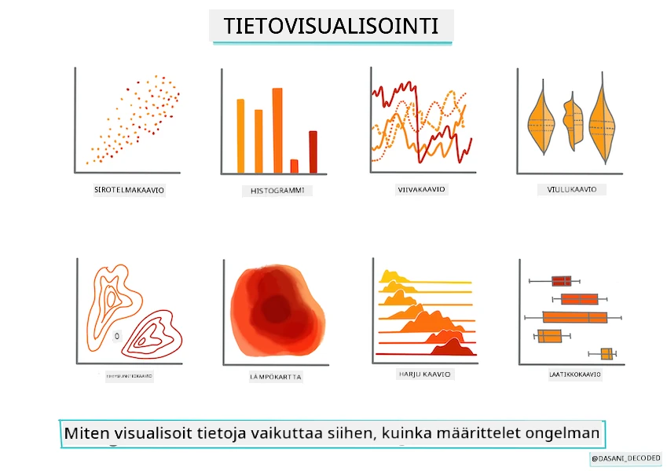
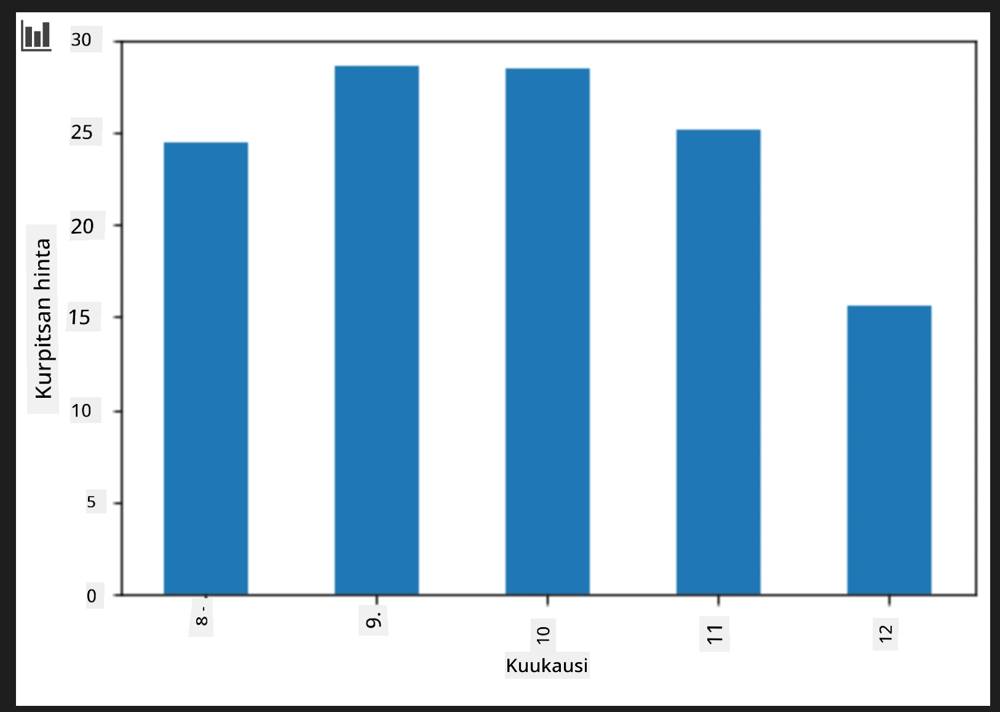
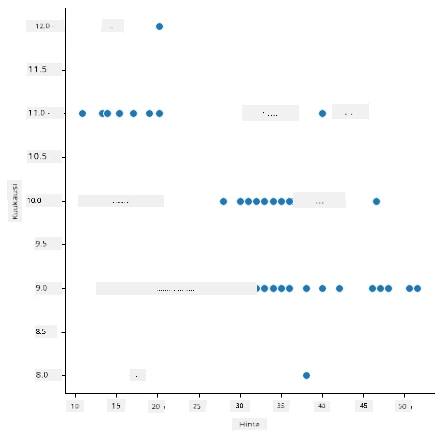
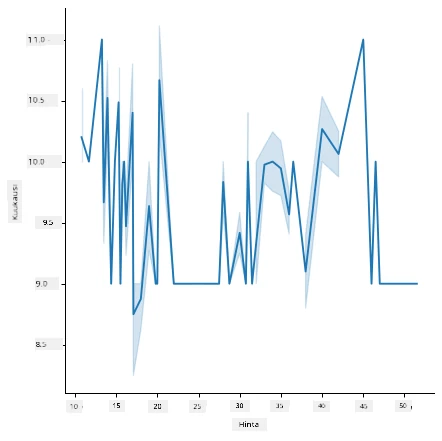
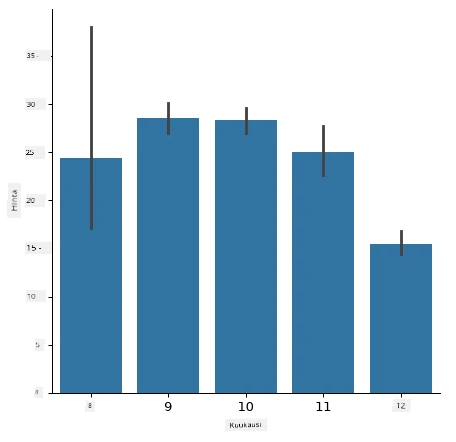
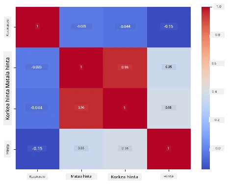

# Rakennetaan regressiomalli Scikit-learnilla: valmistele ja visualisoi data



Infografiikan teki [Dasani Madipalli](https://twitter.com/dasani_decoded)

## [Esiluentokoe](https://ff-quizzes.netlify.app/en/ml/)

> ### [Tämä oppitunti on saatavilla R-kielisenä!](../../../../2-Regression/2-Data/solution/R/lesson_2.html)

## Johdanto

Nyt kun sinulla on käytössäsi työkalut koneoppimismallien rakentamisen aloittamiseen Scikit-learnilla, voit alkaa esittää kysymyksiä datallesi. Työskennellessäsi datan kanssa ja soveltaessasi ML-ratkaisuja on erittäin tärkeää ymmärtää, miten esitetään oikea kysymys, jotta voit tehokkaasti hyödyntää datasi potentiaalin.

Tässä oppitunnissa opit:

- Kuinka valmistella data mallin rakentamista varten.
- Kuinka käyttää Matplotlibia datan visualisointiin.
- Kuinka käyttää Seabornia ilmeikkäämpään datan visualisointiin.

## Oikeiden kysymysten esittäminen datallesi

Tarvittava vastaus määrittää, mitä tyyppiä ML-algoritmeja käytät. Ja vastauksen laatu riippuu voimakkaasti datasi luonteesta.

Tutustu tähän oppituntiin liittyvään [dataan](https://github.com/microsoft/ML-For-Beginners/blob/main/2-Regression/data/US-pumpkins.csv). Voit avata tämän .csv-tiedoston VS Codessa. Pikainen silmäys paljastaa heti, että siinä on tyhjiä kenttiä ja sekoitus merkkijono- ja numeerista dataa. Siellä on myös outo sarake nimeltä 'Package', jossa data on sekoitus 'säkeistä', 'laatikoista' ja muista arvoista. Data on itse asiassa aika sekavaa.

[](https://youtu.be/5qGjczWTrDQ "ML aloittelijoille - Kuinka analysoida ja puhdistaa datasetti")

> 🎥 Klikkaa yllä olevaa kuvaa katsoaksesi lyhyen videon datan valmistelusta tähän oppituntiin.

Itse asiassa ei ole kovin tavallista saada täysin käyttövalmis datasetti suoraan koneoppimismallin rakentamiseen. Tässä oppitunnissa opit, miten raakadata valmistellaan käyttäen Pythonin vakiokirjastoja. Opit myös erilaisia tekniikoita datan visualisointiin.

## Tapaustutkimus: 'kurpitsamarkkinat'

Tässä kansiossa löydät juurihakemistosta `data`-kansion sisältä .csv-tiedoston nimeltä [US-pumpkins.csv](https://github.com/microsoft/ML-For-Beginners/blob/main/2-Regression/data/US-pumpkins.csv), joka sisältää 1757 riviä tietoa kurpitsamarkkinoista kaupungeittain ryhmiteltynä. Tämä on raakadataa, joka on poimittu Yhdysvaltain maa- ja metsätalousministeriön jakamista [Specialty Crops Terminal Markets Standard Reports](https://www.marketnews.usda.gov/mnp/fv-report-config-step1?type=termPrice) -raporteista.

### Datan valmistelu

Tämä data on julkisessa käytössä. Sen voi ladata useina erillisinä tiedostoina kaupungeittain USDA:n verkkosivuilta. Välttyäksemme liian monilta erillisiltä tiedostoilta, olemme yhdistäneet kaikki kaupunkien data yhdeksi taulukoksi, eli olemme jo hieman _valmistelleet_ dataa. Tutustutaan seuraavaksi tarkemmin dataan.

### Kurpitsadata - varhaiset havainnot

Mitä huomaat tästä datasta? Näit jo, että siinä on sekoitus merkkijonoja, numeroita, tyhjiä kenttiä ja outoja arvoja, jotka täytyy saada järkeviksi.

Mitä kysymystä voisit esittää tästä datasta käyttäen regressiomenetelmää? Entä "ennusta kurpitsan myyntihinta tietylle kuukaudelle"? Katso dataa uudelleen: tehtävän luomiseksi datarakenteeseen täytyy tehdä joitakin muutoksia.
## Harjoitus - analysoi kurpitsadataa

Käytetään [Pandas](https://pandas.pydata.org/), (nimi tulee sanoista `Python Data Analysis`), työkalua, joka on erittäin hyödyllinen datan muokkaamiseen analysointia ja valmistelua varten.

### Ensiksi, tarkista puuttuvat päivämäärät

Täytyy ensin tarkistaa puuttuuko päivämääriä:

1. Muunna päivämäärät kuukauden muotoon (näissä on käytössä Yhdysvaltojen päivämäärämuoto, eli `KK/PP/VVVV` eli MM/DD/YYYY).
2. Erota kuukausi uudeksi sarakkeeksi.

Avaa _notebook.ipynb_ tiedosto Visual Studio Codessa ja tuo taulukko uuteen Pandas-dataframeen.

1. Käytä `head()`-funktiota katsomaan ensimmäiset viisi riviä.

    ```python
    import pandas as pd
    pumpkins = pd.read_csv('../data/US-pumpkins.csv')
    pumpkins.head()
    ```

    ✅ Mitä funktiota käyttäisit nähdäksesi viimeiset viisi riviä?

1. Tarkista onko nykyisessä dataframeissa puuttuvaa dataa:

    ```python
    pumpkins.isnull().sum()
    ```

    Puuttuvaa dataa on, mutta ehkä se ei haittaa tässä tehtävässä.

1. Helpottaaksesi dataframein käsittelyä, valitse vain tarvittavat sarakkeet käyttäen `loc`-funktiota, joka hakee alkuperäisestä datasta rivejä (ensimmäinen parametri) ja sarakkeita (toinen parametri). Alla oleva ilmaisu `:` tarkoittaa "kaikki rivit".

    ```python
    columns_to_select = ['Package', 'Low Price', 'High Price', 'Date']
    pumpkins = pumpkins.loc[:, columns_to_select]
    ```

### Toiseksi, määritä keskimääräinen kurpitsan hinta

Mieti, miten lasket kurpitsan keskimääräisen hinnan tietyssä kuukaudessa. Mitä sarakkeita tarvitset tähän? Vihje: tarvitset 3 saraketta.

Ratkaisu: ota keskiarvo `Low Price`- ja `High Price` -sarakkeista uuden Price-sarakkeen täyttämiseksi ja muuta Date-sarake näyttämään vain kuukausi. Onneksi yllä tehdyn tarkistuksen mukaan päivämäärissä tai hinnoissa ei ole puuttuvaa dataa.

1. Laske keskiarvo lisäämällä seuraava koodi:

    ```python
    price = (pumpkins['Low Price'] + pumpkins['High Price']) / 2

    month = pd.DatetimeIndex(pumpkins['Date']).month

    ```

   ✅ Voit halutessasi tulostaa dataa tarkistaaksesi sen `print(month)`-käskyllä.

2. Kopioi nyt muunnettu data uuteen Pandas-dataframeen:

    ```python
    new_pumpkins = pd.DataFrame({'Month': month, 'Package': pumpkins['Package'], 'Low Price': pumpkins['Low Price'],'High Price': pumpkins['High Price'], 'Price': price})
    ```

    Dataframen tulostaminen näyttää sinulle siistin ja järjestetyn datasetin, jolle voit rakentaa uuden regressiomallisi.

### Mutta hetkinen! Tässä on jotain outoa

Katsoessasi `Package`-saraketta, kurpitsoja myydään monissa eri muodoissa. Joitakin myydään '1 1/9 bushelin' mittayksiköissä, joitakin '1/2 bushelin', joitakin yksittäisinä kurpitsoina, joitakin painon mukaan ja joitakin isoissa laatikoissa, joiden leveydet vaihtelevat.

> Kurpitsojen punnitseminen on ilmeisesti erittäin vaikeaa tasaisesti

Alkuperäisen datan pohjalta huomataan, että kaikki, joiden `Unit of Sale` on 'EACH' tai 'PER BIN', sisältävät myös `Package`-tyyppiä kuten per tuuma, per laatikko tai 'each'. Kurpitsojen tasa-arvoinen punnitseminen näyttää olevan vaikeaa, joten rajataan dataa valitsemalla ainoastaan ne kurpitsat, joiden `Package`-sarakkeessa on merkkijono 'bushel'.

1. Lisää suodatin tiedoston alkuun .csv-tiedoston tuonnin jälkeen:

    ```python
    pumpkins = pumpkins[pumpkins['Package'].str.contains('bushel', case=True, regex=True)]
    ```

    Jos tulostat datan nyt, näet, että saat vain noin 415 riviä, jotka sisältävät bushel-muotoisia kurpitsoja.

### Mutta hetkinen! Vielä yksi asia tehtävänä

Huomasitko, että bushel-määrä vaihtelee rivikohtaisesti? Sinun täytyy normalisoida hinta näyttämään hinta per bushel, joten tee laskelmia standardoimiseksi.

1. Lisää seuraavat rivit uuden pumpkin-dataframen luomisen jälkeen:

    ```python
    new_pumpkins.loc[new_pumpkins['Package'].str.contains('1 1/9'), 'Price'] = price/(1 + 1/9)

    new_pumpkins.loc[new_pumpkins['Package'].str.contains('1/2'), 'Price'] = price/(1/2)
    ```

✅ [The Spruce Eatsin](https://www.thespruceeats.com/how-much-is-a-bushel-1389308) mukaan bushelin paino riippuu tuotteen tyypistä, koska se on tilavuusmittaus. "Tomaatin bushelin painoksi oletetaan esimerkiksi 56 paunaa... Lehtivihannekset vievät enemmän tilaa mutta ovat kevyempiä, joten pinaatin bushel painaa vain 20 paunaa." Tämä on siis melko monimutkaista! Ei vaivauduta nyt muuttamaan bushelin painoa paunoiksi vaan hinnoitellaan bushelin mukaan. Tämä tutkimus kurpitsabusheleista osoittaa kuinka tärkeää on ymmärtää datasi luonne!

Nyt voit analysoida yksikköhinnan bushel-mittauksen mukaan. Jos tulostat datan vielä kerran, näet miten se on standardoitu.

✅ Huomasitko, että puoli-bushelin mukaan myydyt kurpitsat ovat hyvin kalliita? Osaatko arvata miksi? Vihje: pienet kurpitsat ovat paljon kalliimpia kuin isot, luultavasti siksi, että bushelissa on paljon enemmän pieniä, kun taas yksi iso ontto piirakkakurpitsa vie paljon tilaa ja vähentää määrää.

## Visualisointistrategiat

Työskennellessään data-analyytikot esittävät usein työskentelemänsä datan laadun ja luonteen visuaalisesti. He luovat mielenkiintoisia visualisointeja, kuten diagrammeja, käyriä ja kaavioita, jotka näyttävät datan eri puolia. Näin he voivat visuaalisesti osoittaa yhteyksiä ja aukkoja, jotka muuten olisivat vaikeasti havaittavissa.

[](https://youtu.be/SbUkxH6IJo0 "ML aloittelijoille - Kuinka visualisoida dataa Matplotlibillä")

> 🎥 Klikkaa yllä olevaa kuvaa katsoaksesi lyhyen videon tämän oppitunnin datan visualisoinnista.

Visualisoinnit auttavat myös valitsemaan datalle sopivimman koneoppimistekniikan. Esimerkiksi hajontakuvio, joka näyttää noudattavan viivaa, osoittaa datan soveltuvan hyvin lineaariseen regressioon.

Yksi Jupyter-muistikirjoissa hyvin toimiva visualisointikirjasto on [Matplotlib](https://matplotlib.org/) (jonka näit myös edellisessä oppitunnissa).

> Saat lisää kokemusta datan visualisoinnista [näissä tutoriaaleissa](https://docs.microsoft.com/learn/modules/explore-analyze-data-with-python?WT.mc_id=academic-77952-leestott).

## Harjoitus - kokeile Matplotlibia

Yritä luoda joitakin perustason kuvaajia näyttääksesi juuri luodun dataframen. Mitä yksinkertainen viivakuvaaja näyttäisi?

1. Tuo Matplotlib tiedoston alkuun, Pandas-tuonnin alapuolelle:

    ```python
    import matplotlib.pyplot as plt
    ```

1. Suorita koko muistikirja uudelleen päivittääksesi.
1. Lisää muistikirjan loppuun solu, joka piirtää datan laatikkokaaviona:

    ```python
    price = new_pumpkins.Price
    month = new_pumpkins.Month
    plt.scatter(price, month)
    plt.show()
    ```

    

    Onko tämä hyödyllinen kuvaaja? Yllättääkö jokin siinä?

    Se ei ole kovin hyödyllinen, koska se ainoastaan näyttää puntospridauksen datassasi tietylle kuukaudelle.

### Tee siitä hyödyllinen

Jotta kaaviot näyttäisivät hyödyllistä dataa, täytyy yleensä ryhmitellä dataa jotenkin. Yritetään luoda kaavio, jossa y-akselilla ovat kuukaudet ja data osoittaa jakauman.

1. Lisää solu ryhmitellyn pylväskaavion luomiseksi:

    ```python
    new_pumpkins.groupby(['Month'])['Price'].mean().plot(kind='bar')
    plt.ylabel("Pumpkin Price")
    ```

    

    Tämä on paljon hyödyllisempi datan visualisointi! Se näyttää osoittavan, että kurpitsan korkein hinta on syys- ja lokakuussa. Täsmääkö tämä odotuksiisi? Miksi tai miksi ei?

## Harjoitus - kokeile Seabornia

Matplotlib on tehokas, mutta voi vaatia paljon koodia siistin kaavion luomiseen. [Seaborn](https://seaborn.pydata.org/) on Matplotlibin päälle rakennettu kirjasto, joka on suunniteltu tilastolliseen datan visualisointiin. Se toimii suoraan Pandas-dataframien kanssa, käyttää houkuttelevia oletustyylejä ja antaa sinun luoda informatiivisia kaavioita paljon vähemmällä koodilla. Koska Seaborn palauttaa Matplotlib-objekteja, voit edelleen käyttää kaikkea mitä tiedät Matplotlibista hienosäätämiseen.

> Jos sinulla ei vielä ole Seaborn asennettuna, asenna se komennolla `pip install seaborn`.

1. Tuo Seaborn muistikirjan alkuun muiden tuontien alle. Yleisesti se tuodaan nimellä `sns`:

    ```python
    import seaborn as sns
    ```

### Hajontakuvioiden käyttö suhteiden näyttämiseen

Iso osa datan tutkimista ennen mallin rakentamista on etsiä _suhteita_ muuttujien välillä. [Hajontakuvio](https://en.wikipedia.org/wiki/Scatter_plot) on yksi parhaista työkaluista tähän: jos pisteet näyttävät noudattavan viivaa, kaksi muuttujaa saattavat korreloida, mikä on hyvä merkki lineaarisen regressiomallin toimivuudesta.

1. Luo uudelleen aiemmin tehty hinta-kuukausi hajontakuvio, mutta käytä tällä kertaa Seabornin [`relplot()`](https://seaborn.pydata.org/generated/seaborn.relplot.html) (relaatiokuvio) -funktiota, joka toimii suoraan dataframen sarakkeiden kanssa:

    ```python
    sns.relplot(x="Price", y="Month", data=new_pumpkins)
    ```

    

    Huomaa, miten annat _sarakkeiden nimet_ ja dataframe-objektin, ja Seaborn hoitaa akselien nimet puolestasi.

2. Voit vaihtaa viivakuvaajaan asettamalla `kind="line"`. Seaborn piirtää myös varjostetun alueen, joka näyttää luottamusvälin viivan ympärillä:

    ```python
    sns.relplot(x="Price", y="Month", kind="line", data=new_pumpkins)
    ```

    

    Tämä data on melko kohinaista, joten viivakuvaaja ei ole kaikkein selkein valinta – mutta se havainnollistaa kuinka helposti kaaviotyyppiä voi muuttaa Seabornissa.

### Pylväskaaviot jakaumien näyttämiseen


Aiemmin ryhmittelit tiedot käsin luodaksesi pylväskaavion Matplotlibillä. Seabornin [`catplot()`](https://seaborn.pydata.org/generated/seaborn.catplot.html) (kategoriallinen kaavio) voi tehdä ryhmittelyn ja aggregaation puolestasi. Oletuksena `kind="bar"` näyttää kunkin kategorian keskiarvon mustalla viivalla, joka ilmaisee luottamusvälin.

1. Luo pylväskaavio kuukausittaisesta keskimääräisestä hinnasta:

    ```python
    sns.catplot(x="Month", y="Price", data=new_pumpkins, kind="bar")
    ```

    

    Tämä vahvistaa, mitä näit Matplotlibillä — hinnat huippuavat syys- ja lokakuussa — mutta Seaborn visualisoi myös, kuinka paljon hinta _vaihtelee_ jokaisen kuukauden sisällä.

### Lämmityskartat korrelaatioiden näyttämiseen

Hajontakuvioissa verrataan kahta muuttujaa kerrallaan. Kun sinulla on useita numeerisia sarakkeita, [lämmityskartta](https://en.wikipedia.org/wiki/Heat_map) antaa sinun nähdä kaikkien sarakeparien välisten suhteiden vahvuuden kerralla. Tämä on yleinen tapa havaita, mitkä piirteet ovat vahvasti korreloituneita ennen kuin valitaan, mitä syötetään malliin (ja saman tyyppistä kaaviota käytetään myöhemmin luokittelussa sekavuusmatriiseihin).

1. Rakenna korrelaatiomatriisi Pandasilla ja piirrä se sitten Seabornin [`heatmap()`](https://seaborn.pydata.org/generated/seaborn.heatmap.html) avulla. `annot=True` -valinta tulostaa korrelaatioarvot jokaisessa solussa:

    ```python
    correlations = new_pumpkins[['Month', 'Low Price', 'High Price', 'Price']].corr()
    sns.heatmap(correlations, annot=True, cmap="coolwarm")
    ```

    

    Arvot, jotka ovat lähellä `1` (tai `-1`), tarkoittavat, että sarakkeet ovat vahvasti _lineaarisesti_ korreloituneita. Huomaa, miten `Low Price` ja `High Price` ovat lähes täydellisesti korreloituneita. `Month` puolestaan näyttää vain heikon lineaarisen korrelaation hinnan kanssa — vaikka yllä oleva pylväskaavio paljasti selkeän sesonkihuipun syys- ja lokakuussa. Tämä on tärkeä oppitunti: korrelaatiokerroin mittaa vain _suoraviivaisia_ suhteita, joten se voi jättää huomiotta sesonkiluonteiset tai muutoin epälineaariset kuviot. ✅ Miksi on hyödyllistä katsoa sekä lämmityskarttaa että kaavioita, kuten pylväskaaviota, ennen kuin päättää, mitä sarakkeita käyttää?

### Matplotlib vai Seaborn?

Molemmat kirjastot kannattaa tuntea:

- **Matplotlib** antaa sinulle yksityiskohtaisen hallinnan kaavion jokaisesta elementistä ja on pohja, jonka päälle lähes kaikki muut Pythonin visualisointikirjastot rakentavat.
- **Seaborn** tarjoaa korkeamman tason funktioita ja houkuttelevat oletusasetukset tilastollisiin kaavioihin, toimii suoraan datafreimien kanssa ja on usein nopeampi tutkimustarkoituksiin.

Yleinen työnkulku on aloittaa Seabornilla datan nopeaan tutkimiseen ja siirtyä sitten Matplotlibiin, kun halutaan räätälöidä yksityiskohtia.

---

## 🚀Haaste

Tutki erilaisia Matplotlibin ja Seabornin tarjoamia visualisointityyppejä. Mitkä tyypit sopivat parhaiten regressio-ongelmiin?

## [Luennon jälkeinen tietovisa](https://ff-quizzes.netlify.app/en/ml/)

## Kertaus ja itsenäinen opiskelu

Tutustu moniin tapoihin visualisoida dataa. Tee lista eri saatavilla olevista kirjastoista ja merkitse, mitkä sopivat parhaiten tiettyihin tehtävätyyppeihin, esimerkiksi 2D-visualisointiin vs. 3D-visualisointiin. Mitä havaitset?

## Tehtävä

[Visualisoinnin tutkiminen](assignment.md)

---

<!-- CO-OP TRANSLATOR DISCLAIMER START -->
**Vastuuvapauslauseke**:
Tämä asiakirja on käännetty käyttämällä tekoälypohjaista käännöspalvelua [Co-op Translator](https://github.com/Azure/co-op-translator). Vaikka pyrimme tarkkuuteen, otathan huomioon, että automaattiset käännökset saattavat sisältää virheitä tai epätarkkuuksia. Alkuperäinen asiakirja sen alkuperäiskielellä on virallinen lähde. Tärkeissä asioissa suositellaan ammattimaista ihmiskäännöstä. Emme ole vastuussa tämän käännöksen käytöstä aiheutuvista väärinymmärryksistä tai tulkinnoista.
<!-- CO-OP TRANSLATOR DISCLAIMER END -->