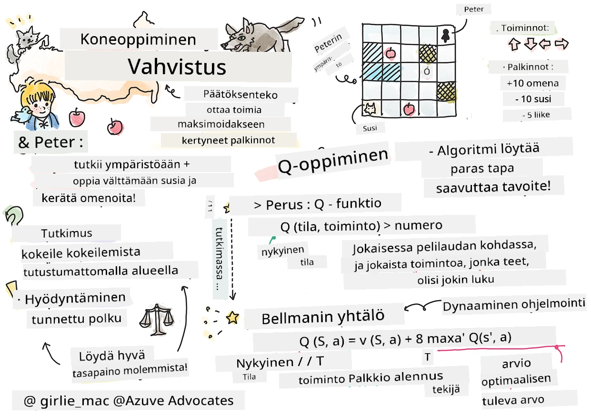

# Johdatus vahvistusoppimiseen ja Q-oppimiseen


> Sketchnote tekijältä [Tomomi Imura](https://www.twitter.com/girlie_mac)

Vahvistusoppiminen sisältää kolme tärkeää käsitettä: agentin, joitain tiloja ja joukossa toimintoja kullekin tilalle. Suorittamalla toiminnon tietyssä tilassa agentti saa palkinnon. Kuvittele jälleen tietokonepeli Super Mario. Sinä olet Mario, olet pelitasolla ja seisot kallion reunalla. Ylläsi on kolikko. Sinä Mario, pelitasolla tiettyssä paikassa ... se on tilasi. Siirtyminen yhden askeleen oikealle (toiminto) vie sinut reunalta alas ja saat alhaisen numeerisen pisteen. Hyppynapin painaminen puolestaan antaa pisteen ja pysyt elossa. Se on positiivinen lopputulos ja siitä pitäisi antaa positiivinen numeerinen piste.

Käyttämällä vahvistusoppimista ja simulaattoria (peliä) voit oppia pelaamaan peliä siten, että maksimoi palkinnon, eli pysyy elossa ja kerää mahdollisimman monta pistettä.

[](https://www.youtube.com/watch?v=lDq_en8RNOo)

> 🎥 Klikkaa yllä olevaa kuvaa kuullaksesi Dmitryn keskustelun vahvistusoppimisesta

## [Ennakkokoe](https://ff-quizzes.netlify.app/en/ml/)

## Esivaatimukset ja asennus

Tässä oppitunnissa kokeilemme koodia Pythonilla. Sinun tulisi pystyä suorittamaan Jupyter Notebook -koodi tästä oppitunnista joko omalla tietokoneella tai jossain pilvessä.

Voit avata [oppitunnin notebookin](https://github.com/microsoft/ML-For-Beginners/blob/main/8-Reinforcement/1-QLearning/notebook.ipynb) ja käydä tämän oppitunnin läpi.

> **Huom:** Jos avaat tämän koodin pilvestä, sinun tulee myös hakea [`rlboard.py`](https://github.com/microsoft/ML-For-Beginners/blob/main/8-Reinforcement/1-QLearning/rlboard.py) -tiedosto, jota käytetään notebookin koodissa. Lisää se samaan hakemistoon notebookin kanssa.

## Johdanto

Tässä oppitunnissa tutustumme **[Petteriin ja suden tarinaan](https://en.wikipedia.org/wiki/Peter_and_the_Wolf)**, joka on saanut inspiraationsa venäläisen säveltäjän [Sergei Prokofjevin](https://en.wikipedia.org/wiki/Sergei_Prokofiev) musiikillisesta satuun, käytämme **vahvistusoppimista** antaa Petterin tutkia ympäristöään, kerätä herkullisia omenoita ja välttää suden kohtaamista.

**Vahvistusoppiminen** (RL) on oppimismenetelmä, joka mahdollistaa meille agentin optimaalisen käyttäytymisen oppimisen jossain **ympäristössä** suorittamalla monia kokeita. Agentilla tässä ympäristössä on jokin **tavoite**, joka määritellään **palkintofunktion** avulla.

## Ympäristö

Yksinkertaisuuden vuoksi pidetään Petterin maailma neliömäisenä laudana, jonka koko on `width` x `height`, kuten alla:


Jokainen laudan solu voi olla:

* **maa**, jolla Petteri ja muut olennot voivat kävellä.
* **vesi**, jolla et tietenkään voi kävellä.
* **puu** tai **ruoho**, paikka jossa voi levätä.
* **omena**, joka edustaa jotain jota Petteri ilolla haluaa löytää ruoan hankkimiseksi.
* **susi**, joka on vaarallinen ja jota tulisi välttää.

On olemassa erillinen Python-moduuli, [`rlboard.py`](https://github.com/microsoft/ML-For-Beginners/blob/main/8-Reinforcement/1-QLearning/rlboard.py), joka sisältää koodin työskentelyyn tämän ympäristön kanssa. Koska tämä koodi ei ole tärkeää käsitteidemme ymmärtämiselle, tuomme vain moduulin ja käytämme sitä luodaksemme esimerkkilaudan (koodilohko 1):

```python
from rlboard import *

width, height = 8,8
m = Board(width,height)
m.randomize(seed=13)
m.plot()
```

Tämän koodin pitäisi tulostaa kuvan kaltainen esitys ympäristöstä.

## Toiminnot ja politiikka

Esimerkissämme Petterin tavoitteena olisi löytää omena ja välttää susi sekä muut esteet. Tätä varten hän voi kävellä ympäriinsä, kunnes löytää omenan.

Siksi missä tahansa sijainnissa hän voi valita seuraavista toiminnoista: ylös, alas, vasemmalle ja oikealle.

Määrittelemme nämä toiminnot sanakirjaksi ja yhdistämme ne vastaaviin koordinaattimuutoksiin. Esimerkiksi oikealle siirtyminen (`R`) vastaa paria `(1,0)`. (koodilohko 2):

```python
actions = { "U" : (0,-1), "D" : (0,1), "L" : (-1,0), "R" : (1,0) }
action_idx = { a : i for i,a in enumerate(actions.keys()) }
```

Yhteenvetona, tämän skenaarion strategia ja tavoite ovat seuraavat:

- **Strategia**, agenttimme (Petterin) strategia määritellään niin kutsutulla **politiikalla**. Politiikka on funktio, joka palauttaa toiminnon missä tahansa tilassa. Tässä tapauksessa ongelman tila määritellään laudan avulla, sisältäen pelaajan nykyisen sijainnin.

- **Tavoite**, vahvistusoppimisen tavoite on oppia lopulta hyvä politiikka, joka mahdollistaa ongelman tehokkaan ratkaisemisen. Lähtötasona pidämme yksinkertaisinta politiikkaa, nimeltään **satunnaiskävely**.

## Satunnaiskävely

Ratkaistaan ensin ongelmamme toteuttamalla satunnaiskävelystrategia. Satunnaiskävelyssä valitsemme seuraavan toiminnon satunnaisesti sallituista toiminnoista, kunnes saavutamme omenan (koodilohko 3).

1. Toteuta satunnaiskävely alla olevalla koodilla:

    ```python
    def random_policy(m):
        return random.choice(list(actions))
    
    def walk(m,policy,start_position=None):
        n = 0 # askelten määrä
        # aseta alkuasento
        if start_position:
            m.human = start_position 
        else:
            m.random_start()
        while True:
            if m.at() == Board.Cell.apple:
                return n # onnistui!
            if m.at() in [Board.Cell.wolf, Board.Cell.water]:
                return -1 # suden syömänä tai hukkui
            while True:
                a = actions[policy(m)]
                new_pos = m.move_pos(m.human,a)
                if m.is_valid(new_pos) and m.at(new_pos)!=Board.Cell.water:
                    m.move(a) # suorita varsinainen siirto
                    break
            n+=1
    
    walk(m,random_policy)
    ```

    Kutsun `walk` tulisi palauttaa polun pituus, joka voi vaihdella suorituskertojen välillä.

1. Suorita kävelykokeilu useita kertoja (esim. 100), ja tulosta tuloksena saadut tilastot (koodilohko 4):

    ```python
    def print_statistics(policy):
        s,w,n = 0,0,0
        for _ in range(100):
            z = walk(m,policy)
            if z<0:
                w+=1
            else:
                s += z
                n += 1
        print(f"Average path length = {s/n}, eaten by wolf: {w} times")
    
    print_statistics(random_policy)
    ```

    Huomaa, että polun keskipituus on noin 30-40 askelta, mikä on melko paljon, kun otetaan huomioon, että lähimmän omenan keskimatka on noin 5-6 askelta.

    Voit myös nähdä, miltä Petterin liike näyttää satunnaiskävelyn aikana:

    

## Palkintofunktio

Tehdäksemme politiikasta älykkäämmän, meidän täytyy ymmärtää, mitkä liikkeet ovat "parempia" kuin toiset. Tätä varten meidän on määriteltävä tavoitteemme.

Tavoite voidaan määritellä **palkintofunktion** muodossa, joka palauttaa jonkin pistemäärän kullekin tilalle. Mitä suurempi luku, sitä parempi palkinto. (koodilohko 5)

```python
move_reward = -0.1
goal_reward = 10
end_reward = -10

def reward(m,pos=None):
    pos = pos or m.human
    if not m.is_valid(pos):
        return end_reward
    x = m.at(pos)
    if x==Board.Cell.water or x == Board.Cell.wolf:
        return end_reward
    if x==Board.Cell.apple:
        return goal_reward
    return move_reward
```

Mielenkiintoinen seikka palkintofunktioissa on, että useimmiten *saanemme merkittävän palkinnon vasta pelin lopussa*. Tämä tarkoittaa, että algoritmin pitäisi jotenkin muistaa "hyvät" askeleet, jotka johtivat positiiviseen palkintoon lopussa, ja lisätä niiden merkitystä. Vastaavasti kaikki liikkeet, jotka johtavat huonoihin tuloksiin, pitäisi estää.

## Q-oppiminen

Algoritmi, josta keskustelemme tässä, on nimeltään **Q-oppiminen**. Tässä algoritmissa politiikka määritellään funktiona (tai tietorakenteena), jota kutsutaan **Q-taulukoksi**. Se tallentaa kunkin toiminnon "hyvyyden" annetussa tilassa.

Sitä kutsutaan Q-taulukoksi, koska usein on kätevää esittää se taulukkona tai monidimensionaalisena taulukona. Koska laudallamme on mitat `width` x `height`, voimme esittää Q-taulukon numpy-taulukkona, jonka koko on `width` x `height` x `len(actions)`: (koodilohko 6)

```python
Q = np.ones((width,height,len(actions)),dtype=np.float)*1.0/len(actions)
```

Huomaa, että alustamme Q-taulukon kaikki arvot samalla arvolla, tässä tapauksessa - 0.25. Tämä vastaa "satunnaiskävely" politiikkaa, koska kaikki siirrot jokaisessa tilassa ovat yhtä hyviä. Voimme välittää Q-taulukon `plot`-funktiolle taulukkokuvan piirtämistä varten laudalla: `m.plot(Q)`.


Jokaisen solun keskellä on "nuoli", joka osoittaa suositellun liikkumissuunan. Koska kaikki suunnat ovat yhtä hyviä, näytetään piste.

Nyt meidän täytyy ajaa simulaatio, tutkia ympäristöämme ja oppia parempi Q-taulukon arvojen jakauma, joka mahdollistaa omenan löytämisen paljon nopeammin.

## Q-oppimisen ydin: Bellmanin yhtälö

Kun alamme liikkua, jokaisella toiminnolla on vastaava palkkio, eli voimme teoreettisesti valita seuraavan toiminnon sen perusteella, mikä palkinto on suurin heti. Useimmissa tiloissa tämä liikku ei kuitenkaan vie meitä tavoittelemaamme omenaa kohti, joten emme voi heti päättää, kumpi suunta on parempi.

> Muistathan, että tärkeää ei ole välitön tulos, vaan lopullinen tulos, jonka saamme simulaation lopussa.

Ottaaksemme huomioon viivästyneen palkkion, meidän täytyy käyttää **[dynaamista ohjelmointia](https://en.wikipedia.org/wiki/Dynamic_programming)**, joka sallii meidän ajatella ongelmaa rekursiivisesti.

Kuvitellaan, että olemme tilassa *s* ja haluamme siirtyä tilaan *s'*. Tekemällä näin saamme välittömän palkkion *r(s,a)*, joka määritellään palkintofunktiolla, sekä jonkin tulevan palkkion. Jos oletamme, että Q-taulukko heijastaa oikein jokaisen toiminnon "vetovoimaa", valitsemme tilassa *s'* toiminnon *a*, joka vastaa suurinta arvoa *Q(s',a')*. Näin paras mahdollinen tuleva palkkio tilassa *s* määritellään `max`<sub>a'</sub>*Q(s',a')* (maksimi lasketaan kaikkien mahdollisten toimintojen *a'* yli tilassa *s'*).

Tämä antaa **Bellmanin kaavan** Q-taulukon arvon laskemiseksi tilassa *s*, toiminnon *a* perusteella:


Tässä γ on niin kutsuttu **diskonttokerroin**, joka määrittää, kuinka paljon nykyistä palkkiota kannattaa arvostaa suhteessa tulevaan palkkioon ja päinvastoin.

## Oppimisalgoritmi

Edellisen yhtälön perusteella voimme kirjoittaa pseudokoodin oppimisalgoritmillemme:

* Alusta Q-taulukko Q tasaisilla arvoilla kaikille tiloille ja toiminnoille
* Aseta oppimisnopeus α ← 1
* Toista simulaatio monta kertaa
   1. Aloita satunnaisesta sijainnista
   1. Toista
        1. Valitse toiminto *a* tilassa *s*
        2. Suorita toiminto siirtymällä tilaan *s'*
        3. Jos peli päättyy tai kokonaipalkinto on liian pieni - lopeta simulaatio  
        4. Laske palkinto *r* uudessa tilassa
        5. Päivitä Q-funktio Bellmanin yhtälön mukaan: *Q(s,a)* ← *(1-α)Q(s,a)+α(r+γ max<sub>a'</sub>Q(s',a'))*
        6. *s* ← *s'*
        7. Päivitä kokonaipalkinto ja vähennä α.

## Hyödyntäminen vs. tutkiminen

Edellä mainitussa algoritmissa emme täsmentäneet, kuinka toiminto valitaan kohdassa 2.1. Jos valitsemme toiminnon satunnaisesti, **tutkimme** satunnaisesti ympäristöä ja todennäköisesti kuolemme usein sekä tutkimme alueita, joihin emme normaalisti menisi. Vaihtoehtoinen lähestymistapa olisi **hyödyntää** jo tiedettyjä Q-taulukon arvoja ja valita paras toiminto (korkeamman Q-arvon omaava) tilassa *s*. Tämä estää kuitenkin muiden tilojen tutkimisen, ja on todennäköistä, ettemme löydä optimaalista ratkaisua.

Siten paras lähestymistapa on löytää tasapaino tutkimisen ja hyödyntämisen välillä. Tämä onnistuu valitsemalla toiminto tilassa *s* todennäköisyyksillä, jotka ovat verrannollisia Q-taulukon arvoihin. Alussa, kun Q-taulukon arvot ovat kaikki samat, valinta vastaa satunnaista valintaa, mutta oppimisen myötä seuraamme todennäköisemmin optimaalisinta reittiä ja samalla sallimme agentin valita välillä myös tutkimattoman reitin.

## Pythonin toteutus

Olemme nyt valmiita toteuttamaan oppimisalgoritmin. Ennen sitä tarvitsemme funktion, joka muuttaa mielivaltaiset luvut Q-taulukossa vektoriksi todennäköisyyksiä vastaaville toiminnoille.

1. Luo funktio `probs()`:

    ```python
    def probs(v,eps=1e-4):
        v = v-v.min()+eps
        v = v/v.sum()
        return v
    ```

    Lisäämme pienen `eps`-arvon alkuperäiseen vektoriin välttääksemme jakamisen nollalla tapauksessa, jossa kaikki vektorin komponentit ovat identtisiä.

Suorita oppimisalgoritmi 5000 kokeen eli **epookin** ajan: (koodilohko 8)
```python
    for epoch in range(5000):
    
        # Valitse alkuperäinen piste
        m.random_start()
        
        # Aloita matkustaminen
        n=0
        cum_reward = 0
        while True:
            x,y = m.human
            v = probs(Q[x,y])
            a = random.choices(list(actions),weights=v)[0]
            dpos = actions[a]
            m.move(dpos,check_correctness=False) # sallimme pelaajan liikkua laudan ulkopuolella, mikä päättää episodin
            r = reward(m)
            cum_reward += r
            if r==end_reward or cum_reward < -1000:
                lpath.append(n)
                break
            alpha = np.exp(-n / 10e5)
            gamma = 0.5
            ai = action_idx[a]
            Q[x,y,ai] = (1 - alpha) * Q[x,y,ai] + alpha * (r + gamma * Q[x+dpos[0], y+dpos[1]].max())
            n+=1
```

Algoritmin suorittamisen jälkeen Q-taulukon arvot on päivitetty siten, että ne määrittävät eri toimintojen vetovoiman kussakin vaiheessa. Voimme yrittää visualisoida Q-taulukon piirtämällä vektorin jokaisen solun yläpuolelle, joka osoittaa halutun liikkumissuunan. Yksinkertaisuuden vuoksi piirrämme pienen ympyrän nuolen päässä.


## Politiikan tarkistus

Koska Q-taulukko listaa kunkin toiminnon vetovoiman kussakin tilassa, sen käyttäminen tehokkaaseen navigointiin maailmassamme on helppoa. Yksinkertaisimmassa tapauksessa valitsemme toiminnon, jonka Q-taulukon arvo on korkein: (koodilohko 9)

```python
def qpolicy_strict(m):
        x,y = m.human
        v = probs(Q[x,y])
        a = list(actions)[np.argmax(v)]
        return a

walk(m,qpolicy_strict)
```


> Jos kokeilet yllä olevaa koodia useita kertoja, saatat huomata, että se joskus "jämähtää", ja sinun täytyy painaa STOP-painiketta muistikirjassa keskeyttääksesi sen. Tämä tapahtuu, koska voi olla tilanteita, joissa kaksi tilaa "osoittavat" toisiaan optimaalisen Q-arvon suhteen, jolloin agentti päätyy liikkumaan näiden tilojen välillä loputtomasti.

## 🚀Haaste

> **Tehtävä 1:** Muokkaa `walk`-funktiota rajoittamaan polun maksimipituutta tiettyyn askelten määrään (esim. 100), ja katso miten yllä oleva koodi palauttaa tämän arvon silloin tällöin.

> **Tehtävä 2:** Muokkaa `walk`-funktiota niin, että se ei palaa paikkoihin, joissa se on jo aiemmin käynyt. Tämä estää `walk`-funktion silmukoitumisen, mutta agentti saattaa silti jäädä "ansaan" paikkaan, josta se ei pysty pakenemaan.

## Navigointi

Parempi navigointipolitiikka olisi sellainen, jota käytimme harjoittelun aikana, jossa yhdistetään hyväksikäyttö ja tutkiminen. Tässä politiikassa valitsemme jokaisen toiminnon tietyllä todennäköisyydellä, joka on verrannollinen arvoihin Q-taulukossa. Tämä strategia voi silti johtaa siihen, että agentti palaa takaisin aiemmin tutkittuun sijaintiin, mutta kuten alla olevasta koodista näet, se johtaa hyvin lyhyeen keskimääräiseen polkuun haluttuun paikkaan (muista, että `print_statistics` suorittaa simulaation 100 kertaa): (koodilohko 10)

```python
def qpolicy(m):
        x,y = m.human
        v = probs(Q[x,y])
        a = random.choices(list(actions),weights=v)[0]
        return a

print_statistics(qpolicy)
```

Tämän koodin suorittamisen jälkeen keskimääräisen polun pituuden tulisi olla huomattavasti pienempi kuin ennen, noin 3-6 välillä.

## Oppimisprosessin tutkiminen

Kuten mainitsimme, oppimisprosessi on tasapaino uuden tiedon etsimisen ja opitun tiedon hyödyntämisen välillä ongelmatilan rakenteesta. Olemme nähneet, että oppimisen tulokset (kyky auttaa agenttia löytämään lyhyt polku tavoitteeseen) ovat parantuneet, mutta on myös mielenkiintoista tarkastella, miten keskimääräinen polun pituus käyttäytyy oppimisprosessin aikana:


Oppimista voidaan tiivistää seuraavasti:

- **Keskimääräinen polun pituus kasvaa**. Tässä näemme, että aluksi keskimääräinen polun pituus kasvaa. Tämä johtuu todennäköisesti siitä, että kun emme tiedä ympäristöstä mitään, saatamme jäädä loukkuun huonoihin tiloihin, kuten veteen tai susiin. Kun opimme enemmän ja alamme käyttää tätä tietoa, voimme tutkia ympäristöä pidempään, mutta emme silti vielä tiedä, missä omenat ovat kovin hyvin.

- **Polun pituus lyhenee oppimisen myötä**. Kun opimme tarpeeksi, agentin on helpompi saavuttaa tavoite, ja polun pituus alkaa vähentyä. Olemme kuitenkin yhä avoimia tutkimiselle, joten poikkeamme usein parhaalta polulta ja tutkimme uusia vaihtoehtoja, jolloin polku on pidempi kuin optimaalinen.

- **Pituus kasvaa äkillisesti**. Myös havaitsemme tässä käyrässä, että jossain vaiheessa pituus kasvoi äkillisesti. Tämä kertoo prosessin stokastisesta luonteesta ja siitä, että voimme jossain vaiheessa "pilata" Q-taulukon kertoimet ylikirjoittamalla niitä uusilla arvoilla. Tämä tulisi olla minimoitu pienentämällä oppimisnopeutta (esimerkiksi harjoittelun lopussa säädämme Q-taulukon arvoja vain pienellä määrällä).

Kokonaisuudessaan on tärkeää muistaa, että oppimisprosessin onnistuminen ja laatu riippuvat merkittävästi parametreista, kuten oppimisnopeudesta, oppimisnopeuden hiipumisesta ja palkkioden diskonttaustekijästä. Näitä kutsutaan usein **hyperparametreiksi**, jotta ne eroavat **parametreista**, joita optimoimme harjoittelun aikana (esimerkiksi Q-taulukon kertoimet). Parhaiden hyperparametriarvojen etsimistä kutsutaan **hyperparametrien optimoinniksi**, ja se ansaitsee oman aiheensa.

## [Luentojälkeinen visailu](https://ff-quizzes.netlify.app/en/ml/)

## Tehtävä 
[Todellisempi maailma](assignment.md)

---

<!-- CO-OP TRANSLATOR DISCLAIMER START -->
**Vastuuvapauslauseke**:
Tämä asiakirja on käännetty käyttämällä tekoälypohjaista käännöspalvelua [Co-op Translator](https://github.com/Azure/co-op-translator). Vaikka pyrimme tarkkuuteen, otathan huomioon, että automaattiset käännökset saattavat sisältää virheitä tai epätarkkuuksia. Alkuperäinen asiakirja sen alkuperäiskielellä on virallinen lähde. Tärkeissä asioissa suositellaan ammattimaista ihmiskäännöstä. Emme ole vastuussa tämän käännöksen käytöstä aiheutuvista väärinymmärryksistä tai tulkinnoista.
<!-- CO-OP TRANSLATOR DISCLAIMER END -->