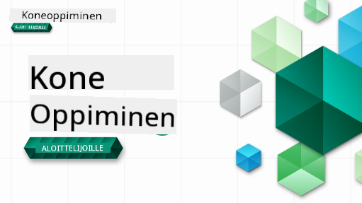

<!--
CO_OP_TRANSLATOR_METADATA:
{
  "original_hash": "a54f98da7bbee99ddc62a9e490eef7dc",
  "translation_date": "2025-09-29T22:05:47+00:00",
  "source_file": "README.md",
  "language_code": "fi"
}
-->

### 🌐 Monikielinen tuki

#### Tuettu GitHub Actionin kautta (automaattinen ja aina ajan tasalla)

[Ranska](../fr/README.md) | [Espanja](../es/README.md) | [Saksa](../de/README.md) | [Venäjä](../ru/README.md) | [Arabia](../ar/README.md) | [Persia (Farsi)](../fa/README.md) | [Urdu](../ur/README.md) | [Kiina (yksinkertaistettu)](../zh/README.md) | [Kiina (perinteinen, Macao)](../mo/README.md) | [Kiina (perinteinen, Hongkong)](../hk/README.md) | [Kiina (perinteinen, Taiwan)](../tw/README.md) | [Japani](../ja/README.md) | [Korea](../ko/README.md) | [Hindi](../hi/README.md) | [Bengali](../bn/README.md) | [Marathi](../mr/README.md) | [Nepali](../ne/README.md) | [Punjabi (Gurmukhi)](../pa/README.md) | [Portugali (Portugali)](../pt/README.md) | [Portugali (Brasilia)](../br/README.md) | [Italia](../it/README.md) | [Puola](../pl/README.md) | [Turkki](../tr/README.md) | [Kreikka](../el/README.md) | [Thai](../th/README.md) | [Ruotsi](../sv/README.md) | [Tanska](../da/README.md) | [Norja](../no/README.md) | [Suomi](./README.md) | [Hollanti](../nl/README.md) | [Heprea](../he/README.md) | [Vietnam](../vi/README.md) | [Indonesia](../id/README.md) | [Malaiji](../ms/README.md) | [Tagalog (Filipino)](../tl/README.md) | [Swahili](../sw/README.md) | [Unkari](../hu/README.md) | [Tšekki](../cs/README.md) | [Slovakki](../sk/README.md) | [Romania](../ro/README.md) | [Bulgaria](../bg/README.md) | [Serbia (kyrillinen)](../sr/README.md) | [Kroatia](../hr/README.md) | [Slovenia](../sl/README.md) | [Ukraina](../uk/README.md) | [Burma (Myanmar)](../my/README.md)

#### Liity yhteisöömme

Meillä on käynnissä Discordissa AI-oppimissarja, jossa voit oppia lisää ja liittyä mukaan [Learn with AI Series](https://aka.ms/learnwithai/discord) -tapahtumaan 18.–30. syyskuuta 2025. Saat vinkkejä ja neuvoja GitHub Copilotin käytöstä data-analytiikassa.

# Koneoppiminen aloittelijoille - Opetussuunnitelma

> 🌍 Matkusta ympäri maailmaa tutustuessasi koneoppimiseen eri kulttuurien kautta 🌍

Microsoftin Cloud Advocates -tiimi tarjoaa 12 viikon ja 26 oppitunnin opetussuunnitelman, joka keskittyy **koneoppimiseen**. Tässä opetussuunnitelmassa opit niin sanottua **klassista koneoppimista**, pääasiassa Scikit-learn-kirjastoa käyttäen ja välttäen syväoppimista, joka käsitellään [AI for Beginners -opetussuunnitelmassa](https://aka.ms/ai4beginners). Yhdistä nämä oppitunnit myös ['Data Science for Beginners' -opetussuunnitelmaan](https://aka.ms/ds4beginners)!

Matkusta kanssamme ympäri maailmaa soveltaessamme näitä klassisia tekniikoita eri alueiden dataan. Jokainen oppitunti sisältää ennakko- ja jälkitestit, kirjalliset ohjeet oppitunnin suorittamiseen, ratkaisun, tehtävän ja paljon muuta. Projektipohjainen oppimismetodimme auttaa sinua oppimaan rakentamisen kautta, mikä on todistetusti tehokas tapa omaksua uusia taitoja.

**✍️ Suuret kiitokset kirjoittajillemme** Jen Looper, Stephen Howell, Francesca Lazzeri, Tomomi Imura, Cassie Breviu, Dmitry Soshnikov, Chris Noring, Anirban Mukherjee, Ornella Altunyan, Ruth Yakubu ja Amy Boyd

**🎨 Kiitokset myös kuvittajillemme** Tomomi Imura, Dasani Madipalli ja Jen Looper

**🙏 Erityiskiitokset 🙏 Microsoft Student Ambassador -kirjoittajillemme, arvioijillemme ja sisällöntuottajillemme**, erityisesti Rishit Dagli, Muhammad Sakib Khan Inan, Rohan Raj, Alexandru Petrescu, Abhishek Jaiswal, Nawrin Tabassum, Ioan Samuila ja Snigdha Agarwal

**🤩 Erityiskiitokset Microsoft Student Ambassadors Eric Wanjau, Jasleen Sondhi ja Vidushi Gupta R-oppitunneistamme!**

# Aloittaminen

Noudata näitä ohjeita:
1. **Haarauta repositorio**: Klikkaa "Fork"-painiketta tämän sivun oikeassa yläkulmassa.
2. **Kloonaa repositorio**:   `git clone https://github.com/microsoft/ML-For-Beginners.git`

> [löydä kaikki lisäresurssit tähän kurssiin Microsoft Learn -kokoelmastamme](https://learn.microsoft.com/en-us/collections/qrqzamz1nn2wx3?WT.mc_id=academic-77952-bethanycheum)

**[Opiskelijat](https://aka.ms/student-page)**, haaroittakaa koko repositorio omaan GitHub-tiliinne ja suorittakaa harjoitukset itsenäisesti tai ryhmässä:

- Aloita ennakkotestillä.
- Lue oppitunti ja suorita aktiviteetit, pysähtyen ja pohtien jokaisen tietotarkistuksen kohdalla.
- Yritä luoda projektit ymmärtämällä oppitunnit sen sijaan, että suorittaisit ratkaisukoodin; kuitenkin kyseinen koodi on saatavilla `/solution`-kansioissa jokaisessa projektipohjaisessa oppitunnissa.
- Tee jälkitesti.
- Suorita haaste.
- Suorita tehtävä.
- Kun olet suorittanut oppituntiryhmän, käy [Keskustelupalstalla](https://github.com/microsoft/ML-For-Beginners/discussions) ja "opettele ääneen" täyttämällä sopiva PAT-arviointityökalu. 'PAT' on edistymisen arviointityökalu, joka on rubriikki, jonka täytät oppimisesi edistämiseksi. Voit myös reagoida muiden PAT-arviointeihin, jotta voimme oppia yhdessä.

> Jatko-opiskelua varten suosittelemme seuraamaan näitä [Microsoft Learn](https://docs.microsoft.com/en-us/users/jenlooper-2911/collections/k7o7tg1gp306q4?WT.mc_id=academic-77952-leestott) moduuleja ja oppimispolkuja.

**Opettajat**, olemme [sisällyttäneet joitakin ehdotuksia](for-teachers.md) tämän opetussuunnitelman käyttöön.

---

## Video-opastukset

Osa oppitunneista on saatavilla lyhyinä videoina. Löydät kaikki nämä oppituntien sisällöstä tai [ML for Beginners -soittolistalta Microsoft Developer YouTube -kanavalla](https://aka.ms/ml-beginners-videos) klikkaamalla alla olevaa kuvaa.

---

## Tutustu tiimiin

**Gifin tekijä** [Mohit Jaisal](https://linkedin.com/in/mohitjaisal)

> 🎥 Klikkaa yllä olevaa kuvaa nähdäksesi videon projektista ja sen tekijöistä!

---

## Pedagogiikka

Olemme valinneet kaksi pedagogista periaatetta tämän opetussuunnitelman rakentamiseen: varmistamme, että se on käytännönläheinen **projektipohjainen** ja että se sisältää **usein toistuvia testejä**. Lisäksi opetussuunnitelmalla on yhteinen **teema**, joka antaa sille yhtenäisyyttä.

Varmistamalla, että sisältö liittyy projekteihin, prosessi on opiskelijoille kiinnostavampi ja käsitteiden omaksuminen paranee. Lisäksi matalan kynnyksen testi ennen oppituntia ohjaa opiskelijan huomion oppimisen aiheeseen, kun taas toinen testi oppitunnin jälkeen varmistaa paremman omaksumisen. Tämä opetussuunnitelma on suunniteltu joustavaksi ja hauskaksi, ja sen voi suorittaa kokonaan tai osittain. Projektit alkavat pienistä ja muuttuvat yhä monimutkaisemmiksi 12 viikon jakson loppuun mennessä. Opetussuunnitelma sisältää myös jälkikirjoituksen koneoppimisen käytännön sovelluksista, joita voidaan käyttää lisäpisteinä tai keskustelun pohjana.

> Löydä [käytössäännöt](CODE_OF_CONDUCT.md), [osallistumisohjeet](CONTRIBUTING.md) ja [käännösohjeet](TRANSLATIONS.md). Otamme mielellämme vastaan rakentavaa palautettasi!

## Jokainen oppitunti sisältää

- valinnainen luonnoskuva
- valinnainen lisävideo
- video-opastus (vain joissakin oppitunneissa)
- [ennakkotesti](https://ff-quizzes.netlify.app/en/ml/)
- kirjallinen oppitunti
- projektipohjaisissa oppitunneissa vaiheittaiset ohjeet projektin rakentamiseen
- tietotarkistukset
- haaste
- lisälukemista
- tehtävä
- [jälkitesti](https://ff-quizzes.netlify.app/en/ml/)

> **Huomio kielistä**: Oppitunnit on pääasiassa kirjoitettu Pythonilla, mutta monet ovat saatavilla myös R-kielellä. R-oppitunnin suorittamiseksi siirry `/solution`-kansioon ja etsi R-oppitunnit. Niissä on .rmd-pääte, joka edustaa **R Markdown** -tiedostoa, joka voidaan yksinkertaisesti määritellä sisältävän `koodilohkoja` (R- tai muilla kielillä) ja `YAML-otsikon` (joka ohjaa ulostulon muotoilua, kuten PDF) `Markdown-dokumentissa`. Näin ollen se toimii esimerkillisenä kirjoituskehyksenä data-analytiikalle, koska sen avulla voit yhdistää koodisi, sen tulokset ja ajatuksesi kirjoittamalla ne Markdowniin. Lisäksi R Markdown -dokumentit voidaan muuntaa ulostulomuotoihin, kuten PDF, HTML tai Word.

> **Huomio testeistä**: Kaikki testit löytyvät [Quiz App -kansiosta](../../quiz-app), yhteensä 52 testiä, joissa on kolme kysymystä kussakin. Ne on linkitetty oppitunneista, mutta testisovelluksen voi ajaa paikallisesti; seuraa ohjeita `quiz-app`-kansiossa paikalliseen isännöintiin tai Azureen julkaisuun.

| Oppitunnin numero |                             Aihe                              |                   Oppituntiryhmä                   | Oppimistavoitteet                                                                                                             |                                                              Linkitetty oppitunti                                                               |                        Kirjoittaja                        |
| :-----------: | :------------------------------------------------------------: | :-------------------------------------------------: | ------------------------------------------------------------------------------------------------------------------------------- | :--------------------------------------------------------------------------------------------------------------------------------------: | :--------------------------------------------------: |
|      01       |                Johdatus koneoppimiseen                |      [Johdanto](1-Introduction/README.md)       | Opi koneoppimisen peruskäsitteet                                                                                |                                             [Oppitunti](1-Introduction/1-intro-to-ML/README.md)                                             |                       Muhammad                       |
|      02       |                Koneoppimisen historia                 |      [Johdanto](1-Introduction/README.md)       | Opi tämän alan historia                                                                                         |                                            [Oppitunti](1-Introduction/2-history-of-ML/README.md)                                            |                     Jen ja Amy                      |
|      03       |                 Reiluus ja koneoppiminen                      |      [Johdanto](1-Introduction/README.md)           | Mitkä ovat tärkeät filosofiset kysymykset reiluudesta, joita opiskelijoiden tulisi pohtia rakentaessaan ja soveltaessaan ML-malleja? |                                              [Oppitunti](1-Introduction/3-fairness/README.md)                                               |                        Tomomi                        |
|      04       |                Koneoppimisen tekniikat                        |      [Johdanto](1-Introduction/README.md)           | Mitä tekniikoita ML-tutkijat käyttävät rakentaakseen ML-malleja?                                                                 |                                          [Oppitunti](1-Introduction/4-techniques-of-ML/README.md)                                           |                    Chris ja Jen                     |
|      05       |                   Johdatus regressioon                        |        [Regressio](2-Regression/README.md)          | Aloita Pythonilla ja Scikit-learnilla regressiomallien rakentamisessa                                                           |         [Python](2-Regression/1-Tools/README.md) • [R](../../2-Regression/1-Tools/solution/R/lesson_1.html)         |      Jen • Eric Wanjau       |
|      06       |                Pohjois-Amerikan kurpitsahinnat 🎃             |        [Regressio](2-Regression/README.md)          | Visualisoi ja puhdista data ML-valmistelua varten                                                                               |          [Python](2-Regression/2-Data/README.md) • [R](../../2-Regression/2-Data/solution/R/lesson_2.html)          |      Jen • Eric Wanjau       |
|      07       |                Pohjois-Amerikan kurpitsahinnat 🎃             |        [Regressio](2-Regression/README.md)          | Rakenna lineaarisia ja polynomisia regressiomalleja                                                                             |        [Python](2-Regression/3-Linear/README.md) • [R](../../2-Regression/3-Linear/solution/R/lesson_3.html)        |      Jen ja Dmitry • Eric Wanjau       |
|      08       |                Pohjois-Amerikan kurpitsahinnat 🎃             |        [Regressio](2-Regression/README.md)          | Rakenna logistinen regressiomalli                                                                                              |     [Python](2-Regression/4-Logistic/README.md) • [R](../../2-Regression/4-Logistic/solution/R/lesson_4.html)      |      Jen • Eric Wanjau       |
|      09       |                          Verkkosovellus 🔌                    |           [Verkkosovellus](3-Web-App/README.md)     | Rakenna verkkosovellus käyttämään koulutettua malliasi                                                                         |                                                 [Python](3-Web-App/1-Web-App/README.md)                                                  |                         Jen                          |
|      10       |                 Johdatus luokitteluun                         |    [Luokittelu](4-Classification/README.md)         | Puhdista, valmistele ja visualisoi dataasi; johdatus luokitteluun                                                              | [Python](4-Classification/1-Introduction/README.md) • [R](../../4-Classification/1-Introduction/solution/R/lesson_10.html)  | Jen ja Cassie • Eric Wanjau |
|      11       |             Herkulliset aasialaiset ja intialaiset ruoat 🍜   |    [Luokittelu](4-Classification/README.md)         | Johdatus luokittelijoihin                                                                                                      | [Python](4-Classification/2-Classifiers-1/README.md) • [R](../../4-Classification/2-Classifiers-1/solution/R/lesson_11.html) | Jen ja Cassie • Eric Wanjau |
|      12       |             Herkulliset aasialaiset ja intialaiset ruoat 🍜   |    [Luokittelu](4-Classification/README.md)         | Lisää luokittelijoita                                                                                                          | [Python](4-Classification/3-Classifiers-2/README.md) • [R](../../4-Classification/3-Classifiers-2/solution/R/lesson_12.html) | Jen ja Cassie • Eric Wanjau |
|      13       |             Herkulliset aasialaiset ja intialaiset ruoat 🍜   |    [Luokittelu](4-Classification/README.md)         | Rakenna suosittelusovellus mallisi avulla                                                                                     |                                              [Python](4-Classification/4-Applied/README.md)                                              |                         Jen                          |
|      14       |                   Johdatus klusterointiin                     |        [Klusterointi](5-Clustering/README.md)       | Puhdista, valmistele ja visualisoi dataasi; johdatus klusterointiin                                                            |         [Python](5-Clustering/1-Visualize/README.md) • [R](../../5-Clustering/1-Visualize/solution/R/lesson_14.html)         |      Jen • Eric Wanjau       |
|      15       |              Nigerian musiikkimakujen tutkiminen 🎧           |        [Klusterointi](5-Clustering/README.md)       | Tutustu K-Means-klusterointimenetelmään                                                                                        |           [Python](5-Clustering/2-K-Means/README.md) • [R](../../5-Clustering/2-K-Means/solution/R/lesson_15.html)           |      Jen • Eric Wanjau       |
|      16       |        Johdatus luonnollisen kielen käsittelyyn ☕️           |   [Luonnollisen kielen käsittely](6-NLP/README.md)  | Opi NLP:n perusteet rakentamalla yksinkertainen botti                                                                         |                                             [Python](6-NLP/1-Introduction-to-NLP/README.md)                                              |                       Stephen                        |
|      17       |                      Yleisiä NLP-tehtäviä ☕️                 |   [Luonnollisen kielen käsittely](6-NLP/README.md)  | Syvennä NLP-tietämystäsi ymmärtämällä yleisiä tehtäviä, jotka liittyvät kielen rakenteisiin                                    |                                                    [Python](6-NLP/2-Tasks/README.md)                                                     |                       Stephen                        |
|      18       |             Käännös ja sentimenttianalyysi ♥️                |   [Luonnollisen kielen käsittely](6-NLP/README.md)  | Käännös ja sentimenttianalyysi Jane Austenin teosten avulla                                                                   |                                            [Python](6-NLP/3-Translation-Sentiment/README.md)                                             |                       Stephen                        |
|      19       |                  Romanttiset hotellit Euroopassa ♥️          |   [Luonnollisen kielen käsittely](6-NLP/README.md)  | Sentimenttianalyysi hotelliarvosteluista, osa 1                                                                               |                                               [Python](6-NLP/4-Hotel-Reviews-1/README.md)                                                |                       Stephen                        |
|      20       |                  Romanttiset hotellit Euroopassa ♥️          |   [Luonnollisen kielen käsittely](6-NLP/README.md)  | Sentimenttianalyysi hotelliarvosteluista, osa 2                                                                               |                                               [Python](6-NLP/5-Hotel-Reviews-2/README.md)                                                |                       Stephen                        |
|      21       |            Johdatus aikasarjojen ennustamiseen               |        [Aikasarjat](7-TimeSeries/README.md)         | Johdatus aikasarjojen ennustamiseen                                                                                           |                                             [Python](7-TimeSeries/1-Introduction/README.md)                                              |                      Francesca                       |
|      22       | ⚡️ Maailman energiankulutus ⚡️ - aikasarjojen ennustaminen ARIMA-menetelmällä |        [Aikasarjat](7-TimeSeries/README.md)         | Aikasarjojen ennustaminen ARIMA-menetelmällä                                                                                  |                                                 [Python](7-TimeSeries/2-ARIMA/README.md)                                                 |                      Francesca                       |
|      23       | ⚡️ Maailman energiankulutus ⚡️ - aikasarjojen ennustaminen SVR-menetelmällä |        [Aikasarjat](7-TimeSeries/README.md)         | Aikasarjojen ennustaminen tukivektoriregressiolla                                                                             |                                                  [Python](7-TimeSeries/3-SVR/README.md)                                                  |                       Anirban                        |
|      24       |             Johdatus vahvistusoppimiseen                     | [Vahvistusoppiminen](8-Reinforcement/README.md)     | Johdatus vahvistusoppimiseen Q-Learning-menetelmällä                                                                          |                                             [Python](8-Reinforcement/1-QLearning/README.md)                                              |                        Dmitry                        |
|      25       |                 Auta Peteriä välttämään susi! 🐺              | [Vahvistusoppiminen](8-Reinforcement/README.md)     | Vahvistusoppiminen Gym-menetelmällä                                                                                           |                                                [Python](8-Reinforcement/2-Gym/README.md)                                                 |                        Dmitry                        |
|  Jälkikirjoitus |            Todelliset ML-skenaariot ja sovellukset          |      [ML tosielämässä](9-Real-World/README.md)      | Mielenkiintoisia ja paljastavia klassisen ML:n tosielämän sovelluksia                                                         |                                             [Oppitunti](9-Real-World/1-Applications/README.md)                                              |                         Tiimi                         |
|  Jälkikirjoitus |            Mallin virheenkorjaus ML:ssä RAI-ohjauspaneelin avulla |      [ML tosielämässä](9-Real-World/README.md)      | Mallin virheenkorjaus koneoppimisessa vastuullisen tekoälyn ohjauspaneelikomponenttien avulla                                  |                                             [Oppitunti](9-Real-World/2-Debugging-ML-Models/README.md)                                              |                         Ruth Yakubu                       |

> [löydä kaikki lisäresurssit tähän kurssiin Microsoft Learn -kokoelmastamme](https://learn.microsoft.com/en-us/collections/qrqzamz1nn2wx3?WT.mc_id=academic-77952-bethanycheum)

## Offline-käyttö

Voit käyttää tätä dokumentaatiota offline-tilassa käyttämällä [Docsifyä](https://docsify.js.org/#/). Haaroita tämä repo, [asenna Docsify](https://docsify.js.org/#/quickstart) paikalliselle koneellesi ja kirjoita tämän repon juurikansiossa `docsify serve`. Verkkosivusto palvelee portissa 3000 paikallisessa verkossasi: `localhost:3000`.

## PDF:t

Löydä kurssin PDF-linkkeineen [täältä](https://microsoft.github.io/ML-For-Beginners/pdf/readme.pdf).

## 🎒 Muut kurssit 

Tiimimme tuottaa muita kursseja! Tutustu:

- [Edge AI aloittelijoille](https://aka.ms/edgeai-for-beginners)
- [AI-agentit aloittelijoille](https://aka.ms/ai-agents-beginners)
- [Generatiivinen AI aloittelijoille](https://aka.ms/genai-beginners)
- [Generatiivinen AI aloittelijoille .NET](https://github.com/microsoft/Generative-AI-for-beginners-dotnet)
- [Generatiivinen AI JavaScriptillä](https://github.com/microsoft/generative-ai-with-javascript)
- [Generatiivinen AI Javalla](https://github.com/microsoft/Generative-AI-for-beginners-java)
- [AI aloittelijoille](https://aka.ms/ai-beginners)
- [Data Science aloittelijoille](https://aka.ms/datascience-beginners)
- [ML aloittelijoille](https://aka.ms/ml-beginners)
- [Kyberturvallisuus aloittelijoille](https://github.com/microsoft/Security-101) 
- [Web-kehitys aloittelijoille](https://aka.ms/webdev-beginners)
- [IoT aloittelijoille](https://aka.ms/iot-beginners)
- [XR-kehitys aloittelijoille](https://github.com/microsoft/xr-development-for-beginners)
- [GitHub Copilotin hallinta pariohjelmointiin](https://github.com/microsoft/Mastering-GitHub-Copilot-for-Paired-Programming)
- [GitHub Copilotin hallinta C#/.NET-kehittäjille](https://github.com/microsoft/mastering-github-copilot-for-dotnet-csharp-developers)
- [Valitse oma Copilot-seikkailusi](https://github.com/microsoft/CopilotAdventures)

---

**Vastuuvapauslauseke**:  
Tämä asiakirja on käännetty käyttämällä tekoälypohjaista käännöspalvelua [Co-op Translator](https://github.com/Azure/co-op-translator). Vaikka pyrimme tarkkuuteen, huomioithan, että automaattiset käännökset voivat sisältää virheitä tai epätarkkuuksia. Alkuperäistä asiakirjaa sen alkuperäisellä kielellä tulisi pitää ensisijaisena lähteenä. Kriittisen tiedon osalta suositellaan ammattimaista ihmiskäännöstä. Emme ole vastuussa väärinkäsityksistä tai virhetulkinnoista, jotka johtuvat tämän käännöksen käytöstä.