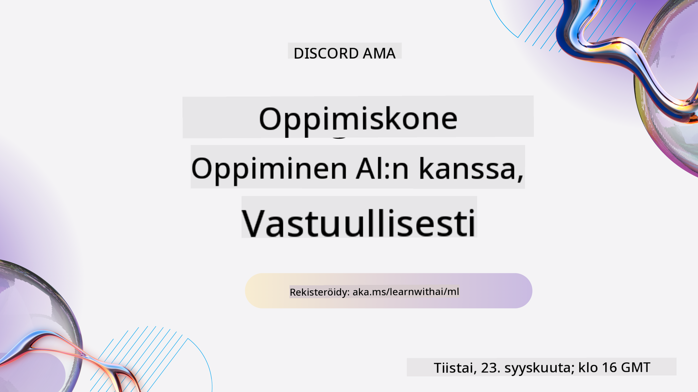

<!--
CO_OP_TRANSLATOR_METADATA:
{
  "original_hash": "ec8385130a8239ad9d827175126a0722",
  "translation_date": "2026-01-01T12:17:29+00:00",
  "source_file": "README.md",
  "language_code": "fi"
}
-->

Meillä on Discordissa käynnissä Learn with AI -sarja; opi lisää ja liity mukaan osoitteessa [Learn with AI Series](https://aka.ms/learnwithai/discord) ajalla 18.–30. syyskuuta 2025. Saat vinkkejä ja niksejä GitHub Copilotin käytöstä data-analytiikassa.

# Koneoppiminen aloittelijoille - Opetussuunnitelma

> 🌍 Matkusta ympäri maailmaa, kun tutkimme koneoppimista eri maailman kulttuurien näkökulmasta 🌍

Microsoftin Cloud Advocates -tiimi iloitsee tarjotessaan 12 viikon, 26 oppitunnin opetussuunnitelmaa, joka käsittelee **koneoppimista**. Tässä opetussuunnitelmassa opit niin kutsuttua **klassista koneoppimista**, käyttäen ensisijaisesti Scikit-learn-kirjastoa ja välttäen syväoppimista, josta kerrotaan meidän [AI for Beginners' curriculum](https://aka.ms/ai4beginners) -materiaalissa. Yhdistä nämä oppitunnit myös meidän ['Data Science for Beginners' curriculum](https://aka.ms/ds4beginners) -materiaalin kanssa!

Matkusta kanssamme ympäri maailmaa, kun sovellamme näitä klassisia menetelmiä eri alueiden dataan. Jokainen oppitunti sisältää ennakko- ja jälkitestejä, kirjalliset ohjeet oppitunnin suorittamiseen, ratkaisun, tehtävän ja muuta. Projektipohjainen opetustapamme antaa sinun oppia samalla kun rakennat—tämä on todettu tehokkaaksi tavaksi omaksua uusia taitoja.

**✍️ Suuret kiitokset kirjoittajillemme** Jen Looper, Stephen Howell, Francesca Lazzeri, Tomomi Imura, Cassie Breviu, Dmitry Soshnikov, Chris Noring, Anirban Mukherjee, Ornella Altunyan, Ruth Yakubu ja Amy Boyd

**🎨 Kiitos myös kuvittajillemme** Tomomi Imura, Dasani Madipalli ja Jen Looper

**🙏 Erityiskiitos 🙏 Microsoft Student Ambassador -kirjoittajillemme, tarkastajillemme ja sisällön avustajille**, erityisesti Rishit Dagli, Muhammad Sakib Khan Inan, Rohan Raj, Alexandru Petrescu, Abhishek Jaiswal, Nawrin Tabassum, Ioan Samuila ja Snigdha Agarwal

**🤩 Lisäkiitos Microsoft Student Ambassadors Eric Wanjau, Jasleen Sondhi ja Vidushi Gupta R-oppitunneistamme!**

# Aloittaminen

Seuraa näitä vaiheita:
1. **Forkkaa repositorio**: Klikkaa tämän sivun oikeassa yläkulmassa olevaa "Fork"-painiketta.
2. **Kloonaa repositorio**:   `git clone https://github.com/microsoft/ML-For-Beginners.git`

> [löydät kaikki lisäresurssit tälle kurssille Microsoft Learn -kokoelmastamme](https://learn.microsoft.com/en-us/collections/qrqzamz1nn2wx3?WT.mc_id=academic-77952-bethanycheum)

> 🔧 **Tarvitsetko apua?** Tarkista [Vianetsintäoppaamme](TROUBLESHOOTING.md) yleisiin asennus-, käyttö- ja oppituntiongelmiin liittyvät ratkaisut.

**[Opiskelijat](https://aka.ms/student-page)**, käyttääksenne tätä opetussuunnitelmaa, forkkaa koko repo omaan GitHub-tiliisi ja tee harjoitukset itseksesi tai ryhmässä:

- Aloita esiluennon kyselyllä.
- Lue luento ja suorita aktiviteetit; pysähdy ja pohdi jokaista tietotarkistusta.
- Yritä luoda projektit ymmärtämällä oppitunnin sisältö sen sijaan, että vain suoritat ratkaisukoodin; koodit ovat kuitenkin saatavilla kunkin projektilähtöisen oppitunnin /solution-kansiossa.
- Tee jälkiluennon kysely.
- Suorita haaste.
- Tee tehtävä.
- Kun olet suorittanut oppituntiryhmän, vieraile [Keskustelualueella](https://github.com/microsoft/ML-For-Beginners/discussions) ja "opiskele ääneen" täyttämällä asianmukainen PAT-arviointirubriikki. PAT on Progress Assessment Tool, jonka avulla arvioit edistymistäsi. Voit myös reagoida muiden PAT:eihin, jotta voimme oppia yhdessä.

> Jatko-opiskeluun suosittelemme seuraavia [Microsoft Learn](https://docs.microsoft.com/en-us/users/jenlooper-2911/collections/k7o7tg1gp306q4?WT.mc_id=academic-77952-leestott) -moduuleja ja -oppimispolkuja.

**Opettajille**, olemme sisällyttäneet [joitakin ehdotuksia](for-teachers.md) tämän opetussuunnitelman käyttöön.

---

## Videoesittelyt

Joistakin oppitunneista on saatavilla lyhyitä videoita. Löydät kaikki nämä suoraan oppitunneista tai [ML for Beginners -soittolistalta Microsoft Developer YouTube -kanavalla](https://aka.ms/ml-beginners-videos) klikkaamalla alla olevaa kuvaa.

---

## Tapaa tiimi

**Gif tekijä** [Mohit Jaisal](https://linkedin.com/in/mohitjaisal)

> 🎥 Napsauta yllä olevaa kuvaa nähdäksesi videon projektista ja ihmisistä, jotka loivat sen!

---

## Pedagogiikka

Olemme valinneet kaksi pedagogista periaatetta rakentaessamme tätä opetussuunnitelmaa: varmistaa, että se on käytännönläheinen ja **projektipohjainen**, sekä että se sisältää **usein toistuvat tiedon tarkistukset**. Lisäksi opetussuunnitelmalla on yhteinen **teema**, joka sitoo kokonaisuuden yhteen.

Kun sisältö linkitetään projekteihin, prosessi on opiskelijoille kiinnostavampi ja käsitteiden omaksuminen paranee. Lisäksi matalan panoksen esikoe ennen luentoa suuntaa opiskelijan huomion oppimiseen, ja toinen koe luennon jälkeen varmistaa paremman muistamisen. Tämä opetussuunnitelma on suunniteltu joustavaksi ja hauskaksi, ja se voidaan suorittaa kokonaisuutena tai osissa. Projektit alkavat pienestä ja muuttuvat yhä monimutkaisemmiksi 12 viikon jakson loppua kohti. Opetussuunnitelmaan sisältyy myös loppusanat koneoppimisen käytännön sovelluksista, joita voi käyttää lisäpisteinä tai keskustelun pohjana.

> Löydät [käyttäytymissääntömme](CODE_OF_CONDUCT.md), [Contributing](CONTRIBUTING.md), [Translation](TRANSLATIONS.md) ja [Vianetsintäohjeet](TROUBLESHOOTING.md). Otamme mielellämme vastaan rakentavaa palautettasi!

## Jokainen oppitunti sisältää

- valinnainen sketchnote
- valinnainen lisävideo
- videoesittely (vain joissakin oppitunneissa)
- [luennon esilämmittelykysely](https://ff-quizzes.netlify.app/en/ml/)
- kirjallinen oppitunti
- projektipohjaisissa oppitunneissa vaiheittaiset ohjeet projektin rakentamiseen
- tietotarkistukset
- haaste
- lisälukemisto
- tehtävä
- [luennon jälkeinen kysely](https://ff-quizzes.netlify.app/en/ml/)

> **Huomautus kielistä**: Nämä oppitunnit on pääasiassa kirjoitettu Pythonilla, mutta monet ovat myös saatavilla R:llä. R-oppitunnin suorittamiseksi siirry /solution-kansioon ja etsi R-oppitunteja. Niissä on .rmd-pääte, joka edustaa **R Markdown** -tiedostoa, joka voidaan yksinkertaisimmillaan määritellä upotukseksi `code chunks` (R:ää tai muita kieliä) ja `YAML header` (joka ohjaa tulosteiden, esimerkiksi PDF:n, muotoilua) sisälle `Markdown document` -tiedostoon. Tämän ansiosta se toimii erinomaisena kirjoitusalustana data-analytiikalle, koska voit yhdistää koodisi, sen tulosteen ja ajatuksesi kirjoittamalla ne Markdownissa. Lisäksi R Markdown -dokumentit voidaan renderöidä ulostulomuotoihin, kuten PDF, HTML tai Word.

> **Huomautus kyselyistä**: Kaikki kyselyt löytyvät [Quiz App -kansiosta](../../quiz-app), yhteensä 52 kyselyä, joissa kussakin on kolme kysymystä. Ne linkitetään oppitunneista, mutta kyselysovelluksen voi ajaa myös paikallisesti; seuraa ohjeita `quiz-app`-kansiossa isännöidäksesi tai julkaistaksesi sovelluksen Azureen.

[Arabic](../ar/README.md) | [Bengali](../bn/README.md) | [Bulgarian](../bg/README.md) | [Burmese (Myanmar)](../my/README.md) | [Chinese (Simplified)](../zh/README.md) | [Chinese (Traditional, Hong Kong)](../hk/README.md) | [Chinese (Traditional, Macau)](../mo/README.md) | [Chinese (Traditional, Taiwan)](../tw/README.md) | [Croatian](../hr/README.md) | [Czech](../cs/README.md) | [Danish](../da/README.md) | [Dutch](../nl/README.md) | [Estonian](../et/README.md) | [Finnish](./README.md) | [French](../fr/README.md) | [German](../de/README.md) | [Greek](../el/README.md) | [Hebrew](../he/README.md) | [Hindi](../hi/README.md) | [Hungarian](../hu/README.md) | [Indonesian](../id/README.md) | [Italian](../it/README.md) | [Japanese](../ja/README.md) | [Kannada](../kn/README.md) | [Korean](../ko/README.md) | [Lithuanian](../lt/README.md) | [Malay](../ms/README.md) | [Malayalam](../ml/README.md) | [Marathi](../mr/README.md) | [Nepali](../ne/README.md) | [Nigerian Pidgin](../pcm/README.md) | [Norwegian](../no/README.md) | [Persian (Farsi)](../fa/README.md) | [Polish](../pl/README.md) | [Portuguese (Brazil)](../br/README.md) | [Portuguese (Portugal)](../pt/README.md) | [Punjabi (Gurmukhi)](../pa/README.md) | [Romanian](../ro/README.md) | [Russian](../ru/README.md) | [Serbian (Cyrillic)](../sr/README.md) | [Slovak](../sk/README.md) | [Slovenian](../sl/README.md) | [Spanish](../es/README.md) | [Swahili](../sw/README.md) | [Swedish](../sv/README.md) | [Tagalog (Filipino)](../tl/README.md) | [Tamil](../ta/README.md) | [Telugu](../te/README.md) | [Thai](../th/README.md) | [Turkish](../tr/README.md) | [Ukrainian](../uk/README.md) | [Urdu](../ur/README.md) | [Vietnamese](../vi/README.md)

| Oppitunnin numero |                           Aihe                             |                  Oppituntiryhmä                  | Oppimistavoitteet                                                                                                             |                                                             Linkitetty oppitunti                                                              |                        Tekijä                        |
| :-----------: | :------------------------------------------------------------: | :-------------------------------------------------: | ------------------------------------------------------------------------------------------------------------------------------- | :--------------------------------------------------------------------------------------------------------------------------------------: | :--------------------------------------------------: |
|      01       |                Johdatus koneoppimiseen                |      [Johdanto](1-Introduction/README.md)       | Tutustu koneoppimisen peruskäsitteisiin                                                                                |                                             [Oppitunti](1-Introduction/1-intro-to-ML/README.md)                                             |                       Muhammad                       |
|      02       |                Koneoppimisen historia                 |      [Johdanto](1-Introduction/README.md)       | Tutustu tämän alan historiaan                                                                                         |                                            [Oppitunti](1-Introduction/2-history-of-ML/README.md)                                            |                     Jen ja Amy                      |
|      03       |                 Oikeudenmukaisuus ja koneoppiminen                  |      [Johdanto](1-Introduction/README.md)       | Mitkä ovat oikeudenmukaisuuteen liittyvät tärkeät filosofiset kysymykset, jotka opiskelijoiden tulisi huomioida rakentaessaan ja soveltaessaan koneoppimismalleja? |                                              [Oppitunti](1-Introduction/3-fairness/README.md)                                               |                        Tomomi                        |
|      04       |                Koneoppimisen menetelmät                 |      [Johdanto](1-Introduction/README.md)       | Mitä menetelmiä koneoppimustutkijat käyttävät mallien rakentamiseen?                                                                       |                                          [Oppitunti](1-Introduction/4-techniques-of-ML/README.md)                                           |                    Chris ja Jen                     |
|      05       |                   Johdatus regressioon                   |        [Regressio](2-Regression/README.md)         | Aloita Pythonin ja Scikit-learnin käytöllä regressiomalleihin                                                                  |         [Python](2-Regression/1-Tools/README.md) • [R](../../2-Regression/1-Tools/solution/R/lesson_1.html)         |      Jen • Eric Wanjau       |
|      06       |                Pohjoisamerikkalaiset kurpitsahinnat 🎃                |        [Regressio](2-Regression/README.md)         | Visualisoi ja siivoa dataa koneoppimista varten                                                                                  |          [Python](2-Regression/2-Data/README.md) • [R](../../2-Regression/2-Data/solution/R/lesson_2.html)          |      Jen • Eric Wanjau       |
|      07       |                Pohjoisamerikkalaiset kurpitsahinnat 🎃                |        [Regressio](2-Regression/README.md)         | Rakenna lineaarisia ja polynomisia regressiomalleja                                                                                   |        [Python](2-Regression/3-Linear/README.md) • [R](../../2-Regression/3-Linear/solution/R/lesson_3.html)        |      Jen ja Dmitry • Eric Wanjau       |
|      08       |                Pohjoisamerikkalaiset kurpitsahinnat 🎃                |        [Regressio](2-Regression/README.md)         | Rakenna logistinen regressiomalli                                                                                               |     [Python](2-Regression/4-Logistic/README.md) • [R](../../2-Regression/4-Logistic/solution/R/lesson_4.html)      |      Jen • Eric Wanjau       |
|      09       |                          Verkkosovellus 🔌                          |           [Verkkosovellus](3-Web-App/README.md)            | Rakenna verkkosovellus koulutetun mallisi käyttämiseksi                                                                                       |                                                 [Python](3-Web-App/1-Web-App/README.md)                                                  |                         Jen                          |
|      10       |                 Johdatus luokitteluun                 |    [Luokittelu](4-Classification/README.md)     | Siivoa, valmistele ja visualisoi datasi; johdanto luokitteluun                                                            | [Python](4-Classification/1-Introduction/README.md) • [R](../../4-Classification/1-Introduction/solution/R/lesson_10.html)  | Jen ja Cassie • Eric Wanjau |
|      11       |             Herkulliset aasialaiset ja intialaiset keittiöt 🍜             |    [Luokittelu](4-Classification/README.md)     | Johdatus luokittelijoihin                                                                                                     | [Python](4-Classification/2-Classifiers-1/README.md) • [R](../../4-Classification/2-Classifiers-1/solution/R/lesson_11.html) | Jen ja Cassie • Eric Wanjau |
|      12       |             Herkulliset aasialaiset ja intialaiset keittiöt 🍜             |    [Luokittelu](4-Classification/README.md)     | Lisää luokittelijoita                                                                                                                | [Python](4-Classification/3-Classifiers-2/README.md) • [R](../../4-Classification/3-Classifiers-2/solution/R/lesson_12.html) | Jen ja Cassie • Eric Wanjau |
|      13       |             Herkulliset aasialaiset ja intialaiset keittiöt 🍜             |    [Luokittelu](4-Classification/README.md)     | Rakenna suosituksia antava verkkosovellus malliasi käyttäen                                                                                    |                                              [Python](4-Classification/4-Applied/README.md)                                              |                         Jen                          |
|      14       |                   Johdatus klusterointiin                   |        [Clustering](5-Clustering/README.md)         | Siivoa, valmistele ja visualisoi datasi; johdanto klusterointiin                                                                |         [Python](5-Clustering/1-Visualize/README.md) • [R](../../5-Clustering/1-Visualize/solution/R/lesson_14.html)         |      Jen • Eric Wanjau       |
|      15       |              Nigerialaisten musiikkimakujen tutkiminen 🎧              |        [Clustering](5-Clustering/README.md)         | Tutki K-Means-klusterointimenetelmää                                                                                           |           [Python](5-Clustering/2-K-Means/README.md) • [R](../../5-Clustering/2-K-Means/solution/R/lesson_15.html)           |      Jen • Eric Wanjau       |
|      16       |        Johdatus luonnollisen kielen käsittelyyn ☕️         |   [Luonnollisen kielen käsittely](6-NLP/README.md)    | Opi NLP:n perusteet rakentamalla yksinkertainen botti                                                                             |                                             [Python](6-NLP/1-Introduction-to-NLP/README.md)                                              |                       Stephen                        |
|      17       |                      Yleiset NLP-tehtävät ☕️                      |   [Luonnollisen kielen käsittely](6-NLP/README.md)    | Syvennä NLP-osaamistasi ymmärtämällä kielirakenteiden käsittelyssä tarvittavat yleiset tehtävät                          |                                                    [Python](6-NLP/2-Tasks/README.md)                                                     |                       Stephen                        |
|      18       |             Kääntäminen ja sentimenttianalyysi ♥️              |   [Luonnollisen kielen käsittely](6-NLP/README.md)    | Kääntämistä ja sentimenttianalyysiä Jane Austenin tekstien avulla                                                                             |                                            [Python](6-NLP/3-Translation-Sentiment/README.md)                                             |                       Stephen                        |
|      19       |                  Euroopan romanttiset hotellit ♥️                  |   [Luonnollisen kielen käsittely](6-NLP/README.md)    | Sentimenttianalyysi hotelliarvosteluilla 1                                                                                         |                                               [Python](6-NLP/4-Hotel-Reviews-1/README.md)                                                |                       Stephen                        |
|      20       |                  Euroopan romanttiset hotellit ♥️                  |   [Luonnollisen kielen käsittely](6-NLP/README.md)    | Sentimenttianalyysi hotelliarvosteluilla 2                                                                                         |                                               [Python](6-NLP/5-Hotel-Reviews-2/README.md)                                                |                       Stephen                        |
|      21       |            Johdatus aikasarjaennusteisiin             |        [Aikasarjat](7-TimeSeries/README.md)        | Johdatus aikasarjaennusteisiin                                                                                         |                                             [Python](7-TimeSeries/1-Introduction/README.md)                                              |                      Francesca                       |
|      22       | ⚡️ Maailman sähkönkulutus ⚡️ - aikasarjaennusteet ARIMA-menetelmällä |        [Aikasarjat](7-TimeSeries/README.md)        | Aikasarjaennusteet ARIMA-menetelmällä                                                                                              |                                                 [Python](7-TimeSeries/2-ARIMA/README.md)                                                 |                      Francesca                       |
|      23       |  ⚡️ Maailman sähkönkulutus ⚡️ - aikasarjaennusteet SVR:llä  |        [Aikasarjat](7-TimeSeries/README.md)        | Aikasarjaennusteet tukivektoriregressorilla                                                                           |                                                  [Python](7-TimeSeries/3-SVR/README.md)                                                  |                       Anirban                        |
|      24       |             Johdatus vahvistusoppimiseen             | [Vahvistusoppiminen](8-Reinforcement/README.md) | Johdatus vahvistusoppimiseen Q-oppimisen avulla                                                                          |                                             [Python](8-Reinforcement/1-QLearning/README.md)                                              |                        Dmitry                        |
|      25       |                 Auta Peteriä välttämään sutta! 🐺                  | [Vahvistusoppiminen](8-Reinforcement/README.md) | Vahvistusoppiminen Gym-ympäristössä                                                                                                      |                                                [Python](8-Reinforcement/2-Gym/README.md)                                                 |                        Dmitry                        |
|  Jälkikirjoitus   |            Todellisen maailman koneoppimisskenaariot ja -sovellukset            |      [ML käytännössä](9-Real-World/README.md)       | Mielenkiintoisia ja valaisevia todellisen maailman sovelluksia klassiselle koneoppimiselle                                                               |                                             [Oppitunti](9-Real-World/1-Applications/README.md)                                              |                         Tiimi                         |
|  Jälkikirjoitus   |            Mallien virheenkorjaus koneoppimisessa Responsible AI -hallintapaneelilla          |      [ML käytännössä](9-Real-World/README.md)       | Mallien virheenkorjaus koneoppimisessa Responsible AI -hallintapaneelin komponenteilla                                                              |                                             [Oppitunti](9-Real-World/2-Debugging-ML-Models/README.md)                                              |                         Ruth Yakubu                       |

> [Löydät kaikki tämän kurssin lisäresurssit Microsoft Learn -kokoelmastamme](https://learn.microsoft.com/en-us/collections/qrqzamz1nn2wx3?WT.mc_id=academic-77952-bethanycheum)

## Offline-käyttö

Voit suorittaa tämän dokumentaation offline-tilassa käyttämällä [Docsify](https://docsify.js.org/#/). Tee haarukka tästä reposta, asenna [Docsify](https://docsify.js.org/#/quickstart) paikalliselle koneellesi, ja sitten tämän repohakemiston juuressa kirjoita `docsify serve`. Sivusto tarjotaan portissa 3000 paikallisessa isäntäkoneessasi: `localhost:3000`.

## PDF-tiedostot

Löydät opetussuunnitelman pdf-version linkkeineen [täältä](https://microsoft.github.io/ML-For-Beginners/pdf/readme.pdf).

## 🎒 Muut kurssit 

Tiimimme tuottaa myös muita kursseja! Tutustu:

<!-- CO-OP TRANSLATOR OTHER COURSES START -->
### LangChain

---

### Azure / Edge / MCP / Agentit

---
 
### Generatiivinen AI -sarja

[-9333EA?style=for-the-badge&labelColor=E5E7EB&color=9333EA)](https://github.com/microsoft/Generative-AI-for-beginners-dotnet?WT.mc_id=academic-105485-koreyst)
[-C084FC?style=for-the-badge&labelColor=E5E7EB&color=C084FC)](https://github.com/microsoft/generative-ai-for-beginners-java?WT.mc_id=academic-105485-koreyst)
[-E879F9?style=for-the-badge&labelColor=E5E7EB&color=E879F9)](https://github.com/microsoft/generative-ai-with-javascript?WT.mc_id=academic-105485-koreyst)

---
 
### Keskeiset oppimateriaalit

---
 
### Copilot-sarja

<!-- CO-OP TRANSLATOR OTHER COURSES END -->

## Apua

Jos jumitut tai sinulla on kysyttävää tekoälysovellusten rakentamisesta, liity muiden oppijoiden ja kokeneiden kehittäjien keskusteluihin MCP:ssä. Se on kannustava yhteisö, jossa kysymyksiä saa esittää ja tietoa jaetaan vapaasti.

Jos sinulla on tuotepalaute tai kohtaat virheitä rakentamisen aikana, vieraile:

---

<!-- CO-OP TRANSLATOR DISCLAIMER START -->
Vastuuvapauslauseke:
Tämä asiakirja on käännetty tekoälypohjaisella käännöspalvelulla Co-op Translator (https://github.com/Azure/co-op-translator). Vaikka pyrimme täsmällisyyteen, automatisoiduissa käännöksissä voi esiintyä virheitä tai epätarkkuuksia. Alkuperäistä asiakirjaa sen alkuperäisellä kielellä tulee pitää määräävänä lähteenä. Tärkeiden tietojen osalta suositellaan ammattimaista ihmiskäännöstä. Emme ole vastuussa tämän käännöksen käytöstä aiheutuvista väärinymmärryksistä tai virheellisistä tulkinnoista.
<!-- CO-OP TRANSLATOR DISCLAIMER END -->