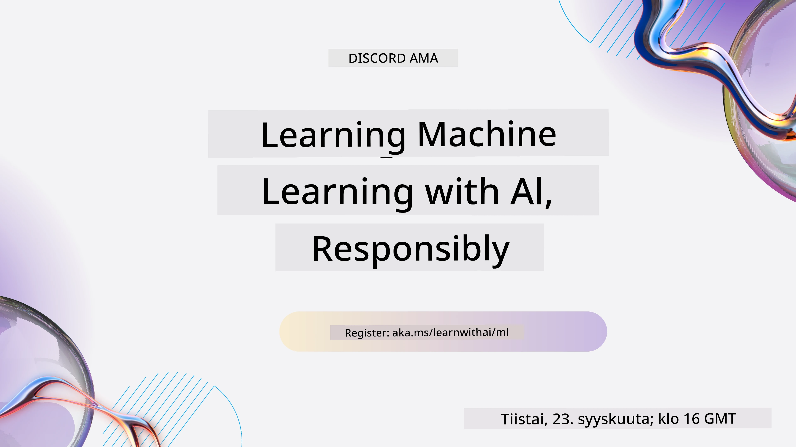
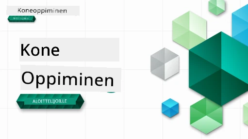

[](https://github.com/microsoft/ML-For-Beginners/blob/master/LICENSE)
[](https://GitHub.com/microsoft/ML-For-Beginners/graphs/contributors/)
[](https://GitHub.com/microsoft/ML-For-Beginners/issues/)
[](https://GitHub.com/microsoft/ML-For-Beginners/pulls/)
[](http://makeapullrequest.com)

[](https://GitHub.com/microsoft/ML-For-Beginners/watchers/)
[](https://GitHub.com/microsoft/ML-For-Beginners/network/)
[](https://GitHub.com/microsoft/ML-For-Beginners/stargazers/)

### 🌐 Monikielinen tuki

#### Tuettuna GitHub Actionin kautta (automaattinen ja aina ajan tasalla)

<!-- CO-OP TRANSLATOR LANGUAGES TABLE START -->
[Arabia](../ar/README.md) | [Bengali](../bn/README.md) | [Bulgaria](../bg/README.md) | [Burmese (Myanmar)](../my/README.md) | [Kiina (yksinkertaistettu)](../zh-CN/README.md) | [Kiina (perinteinen, Hong Kong)](../zh-HK/README.md) | [Kiina (perinteinen, Macao)](../zh-MO/README.md) | [Kiina (perinteinen, Taiwan)](../zh-TW/README.md) | [Kroatia](../hr/README.md) | [Tsekki](../cs/README.md) | [Tanska](../da/README.md) | [Hollanti](../nl/README.md) | [Viro](../et/README.md) | [Suomi](./README.md) | [Ranska](../fr/README.md) | [Saksa](../de/README.md) | [Kreikka](../el/README.md) | [Heprea](../he/README.md) | [Hindi](../hi/README.md) | [Unkari](../hu/README.md) | [Indonesia](../id/README.md) | [Italia](../it/README.md) | [Japani](../ja/README.md) | [Kannada](../kn/README.md) | [Khmer](../km/README.md) | [Korea](../ko/README.md) | [Liettua](../lt/README.md) | [Malaiji](../ms/README.md) | [Malaijalam](../ml/README.md) | [Marathi](../mr/README.md) | [Nepali](../ne/README.md) | [Nigerian Pidgin](../pcm/README.md) | [Norja](../no/README.md) | [Persia (Farsi)](../fa/README.md) | [Puola](../pl/README.md) | [Portugali (Brasilia)](../pt-BR/README.md) | [Portugali (Portugali)](../pt-PT/README.md) | [Punjab (Gurmukhi)](../pa/README.md) | [Romania](../ro/README.md) | [Venäjä](../ru/README.md) | [Serbia (kyrillinen)](../sr/README.md) | [Slovakki](../sk/README.md) | [Slovenia](../sl/README.md) | [Espanja](../es/README.md) | [Swahili](../sw/README.md) | [Ruotsi](../sv/README.md) | [Tagalog (Filipino)](../tl/README.md) | [Tamili](../ta/README.md) | [Telugu](../te/README.md) | [Thai](../th/README.md) | [Turkki](../tr/README.md) | [Ukraina](../uk/README.md) | [Urdu](../ur/README.md) | [Vietnam](../vi/README.md)

> **Haluatko mieluummin kloonata paikallisesti?**
>
> Tämä arkisto sisältää yli 50 kieliversiota, mikä lisää latauskoon merkittävästi. Jos haluat kloonata ilman käännöksiä, käytä sparse checkout -toimintoa:
>
> **Bash / macOS / Linux:**
> ```bash
> git clone --filter=blob:none --sparse https://github.com/microsoft/ML-For-Beginners.git
> cd ML-For-Beginners
> git sparse-checkout set --no-cone '/*' '!translations' '!translated_images'
> ```
>
> **CMD (Windows):**
> ```cmd
> git clone --filter=blob:none --sparse https://github.com/microsoft/ML-For-Beginners.git
> cd ML-For-Beginners
> git sparse-checkout set --no-cone "/*" "!translations" "!translated_images"
> ```
>
> Tämä antaa sinulle kaiken tarvittavan kurssin suorittamiseen huomattavasti nopeammalla latauksella.
<!-- CO-OP TRANSLATOR LANGUAGES TABLE END -->

#### Liity yhteisöömme

[](https://discord.gg/nTYy5BXMWG)

Meillä on käynnissä Discordissa sarja "Learn with AI", lue lisää ja liity mukaan osoitteessa [Learn with AI Series](https://aka.ms/learnwithai/discord) ajalla 18.-30. syyskuuta 2025. Saat vinkkejä ja niksejä GitHub Copilotin käytöstä Data Scienticessä.



# Koneoppiminen aloittelijoille - Opintokokonaisuus

> 🌍 Matkusta ympäri maailmaa tutkiessamme koneoppimista maailman kulttuurien kautta 🌍

Microsoftin Cloud Advocates tarjoaa 12 viikon, 26 oppitunnin opintokokonaisuuden, joka käsittelee **koneoppimista**. Tässä opintokokonaisuudessa opit niin kutsutusta **klassillisesta koneoppimisesta**, pääasiassa Scikit-learn -kirjastoa käyttäen ja syväoppimista välttäen, josta kerrotaan [AI for Beginners -opintokokonaisuudessa](https://aka.ms/ai4beginners). Yhdistä nämä oppitunnit myös ['Data Science for Beginners' -opintokokonaisuuteemme](https://aka.ms/ds4beginners).

Matkusta kanssamme ympäri maailmaa soveltaen klassisia tekniikoita eri alueiden aineistoihin. Jokaisessa oppitunnissa on ennen ja jälkeen oppitunnin kyselyt, kirjalliset ohjeet oppitunnin suorittamiseksi, ratkaisu, tehtävä ja muuta. Projektipohjainen opetusmetodi antaa mahdollisuuden oppia tekemällä, mikä on todistettu tapa uusien taitojen omaksumiseen.

**✍️ Suuret kiitokset kirjoittajillemme** Jen Looper, Stephen Howell, Francesca Lazzeri, Tomomi Imura, Cassie Breviu, Dmitry Soshnikov, Chris Noring, Anirban Mukherjee, Ornella Altunyan, Ruth Yakubu ja Amy Boyd

**🎨 Kiitokset myös kuvittajillemme** Tomomi Imura, Dasani Madipalli ja Jen Looper

**🙏 Erityiskiitos 🙏 Microsoft Student Ambassador -kirjoittajille, tarkastajille ja sisällön tekijöille**, erityisesti Rishit Dagli, Muhammad Sakib Khan Inan, Rohan Raj, Alexandru Petrescu, Abhishek Jaiswal, Nawrin Tabassum, Ioan Samuila ja Snigdha Agarwal

**🤩 Erityiskiitos Microsoft Student Ambassadors Eric Wanjau, Jasleen Sondhi ja Vidushi Gupta opastamme R-oppitunneille!**

# Aloittaminen

Noudata näitä ohjeita:
1. **Forkkaa arkisto**: Klikkaa oikean yläkulman "Fork"-painiketta.
2. **Kloonaa arkisto**: `git clone https://github.com/microsoft/ML-For-Beginners.git`

> 💡 **Nopea aloitusvinkki:** Haluatko aloittaa selaimessa ilman Pythonin asentamista paikallisesti? Käytä [GitHub Codespaces](https://github.com/features/codespaces) -palvelua luodaksesi pilvipohjaisen kehitysympäristön omalle forkillesi. Avaa vihreä **Code**-valikko, valitse **Codespaces** ja luo kooditila; asenna kukin oppitunti vaatimat riippuvuudet tarpeen mukaan.

> [löydä kaikki tämän kurssin lisämateriaalit Microsoft Learnin kokoelmastamme](https://learn.microsoft.com/en-us/collections/qrqzamz1nn2wx3?WT.mc_id=academic-77952-bethanycheum)

> 🔧 **Tarvitsetko apua?** Katso [Vianmääritysohjeet](TROUBLESHOOTING.md) tavallisten ongelmien ratkaisuksi installaatiossa, asennuksessa ja oppituntien suorittamisessa.


**[Opiskelijat](https://aka.ms/student-page)** käyttääkseen tätä opintokokonaisuutta, forkkaa koko arkisto omaan GitHub-tiliisi ja suorita harjoitukset itseksesi tai ryhmässä:

- Aloita esiluennon kyselyllä.
- Lue luento ja suorita tehtävät, pysähdy ja pohdi jokaisen osaamisen tarkistuksen kohdalla.
- Yritä luoda projektit ymmärtämällä oppitunnit sen sijaan, että suoritat valmiin ratkaisukoodin; ratkaisukoodi on kuitenkin saatavilla jokaisen projektilähtöisen oppitunnin `/solution`-kansiossa.
- Osallistu jälkiluennon kyselyyn.
- Suorita haaste.
- Suorita tehtävä.
- Suorittettuasi oppituntiryhmän, käy [Keskustelualueella](https://github.com/microsoft/ML-For-Beginners/discussions) ja "oppi ääneen" täyttämällä sopiva PAT-arviointilomake. 'PAT' on edistymisarviointityökalu, joka on lomake, jonka täytät edistääksesi oppimistasi. Voit myös kommentoida muiden PAT-lomakkeita, jolloin voimme oppia yhdessä.

> Syventävään opiskeluun suosittelemme seuraavia [Microsoft Learn](https://docs.microsoft.com/en-us/users/jenlooper-2911/collections/k7o7tg1gp306q4?WT.mc_id=academic-77952-leestott) -moduleita ja oppimispolkuja.

**Opettajille**, olemme [sisältäneet joitakin ehdotuksia](for-teachers.md) tämän opintokokonaisuuden käytöstä.

---

## Videoiden läpikäynti

Osa oppitunneista on saatavilla lyhyinä videoina. Löydät ne upotettuina oppitunteihin tai [ML for Beginners -soittolistalta Microsoft Developer YouTube -kanavalla](https://aka.ms/ml-beginners-videos) klikkaamalla alla olevaa kuvaa.

[](https://aka.ms/ml-beginners-videos)

---

## Tapaa tiimi

[](https://youtu.be/Tj1XWrDSYJU)

**Gif tekijä** [Mohit Jaisal](https://linkedin.com/in/mohitjaisal)

> 🎥 Klikkaa yllä olevaa kuvaa katsellaksesi videon projektista ja sen tekijöistä!

---

## Pedagogiikka

Olemme valinneet kaksi pedagogista periaatetta tämän opintokokonaisuuden rakentamiseen: sen tulee olla käytännönläheinen **projektipohjainen** ja sisältää **säännöllisiä kyselyjä**. Lisäksi opintokokonaisuudessa on yhteinen **teema** liittämään kokonaisuus yhteen.

Varmistamalla, että sisältö vastaa projekteja, prosessi on opiskelijoille mielekkäämpi ja käsitteiden omaksuminen tehostuu. Lisäksi matalan panoksen kysely ennen luentoa suuntaa opiskelijan huomion oppimiseen, kun jälkiluennon kysely vahvistaa opitut asiat. Tämä opintokokonaisuus on suunniteltu joustavaksi ja hauskaksi ja se voidaan suorittaa kokonaan tai osissa. Projektit alkavat pieninä ja kasvavat monimutkaisemmiksi 12 viikon syklin lopussa. Tämä opintokokonaisuus sisältää myös jälkisanat koneoppimisen käytännön sovelluksista, joita voi käyttää lisäpisteinä tai keskustelun pohjana.

> Löydät [käyttäytymissäännöt](CODE_OF_CONDUCT.md), [osallistumisohjeet](CONTRIBUTING.md), [käännökset](..) ja [vianmäärityksen](TROUBLESHOOTING.md) ohjeet. Otamme mielellämme vastaan rakentavaa palautetta!

## Jokainen oppitunti sisältää

- valinnaisen luonnosmuistiinpanon
- valinnaisen lisävideon
- videoiden läpikäynnin (vain joissain oppitunneissa)
- [esiluennon alkulämmittelykyselyn](https://ff-quizzes.netlify.app/en/ml/)
- kirjallisen oppitunnin
- projektipohjaisissa oppitunneissa vaiheittaiset ohjeet projektin rakentamiseen
- tietämystarkistukset
- haasteen
- lisälukemista
- tehtävän
- [jälkiluennon kyselyn](https://ff-quizzes.netlify.app/en/ml/)

> **Huomio kielistä**: Nämä oppitunnit on pääasiassa kirjoitettu Pythonilla, mutta moni on saatavilla myös R-kielellä. Suorittaaksesi R-oppitunnin, mene `/solution`-kansioon ja etsi sieltä R-oppitunnit. Niissä on .rmd-pääte, joka kuvaa **R Markdown** -tiedostoa, joka on yksinkertaisesti määriteltynä `koodilohkojen` (R:n tai muiden kielten) ja `YAML-otsikon` (joka ohjaa tulosteen muotoilua kuten PDF) yhdistelmä Markdown-dokumentissa. Se toimii erinomaisena kirjoitusalustana data science -tehtäviin, koska se mahdollistaa koodisi, sen tulosteet ja ajatuksesi kirjoittamisen Markdown-muodossa. Lisäksi R Markdown -dokumentit voidaan tuottaa PDF-, HTML- tai Word-muotoisina.

> **Huomio kyselyistä**: Kaikki kyselyt löytyvät [Quiz App -kansiosta](../../quiz-app), yhteensä 52 kyselyä kolmella kysymyksellä kukin. Ne on linkitetty oppitunneissa, mutta kyselyappia voi ajaa myös paikallisesti; noudata `quiz-app`-kansion ohjeita paikalliseen isännöintiin tai julkaisuun Azureen.

| Oppitunnin numero |                             Aihe                              |                   Oppituntiryhmä                   | Oppimistavoitteet                                                                                                             |                                                              Linkitetty oppitunti                                                               |                        Kirjoittaja                        |
| :-----------: | :------------------------------------------------------------: | :-------------------------------------------------: | ------------------------------------------------------------------------------------------------------------------------------- | :--------------------------------------------------------------------------------------------------------------------------------------: | :--------------------------------------------------: |
|      01       |                Johdatus koneoppimiseen                |      [Introduction](1-Introduction/README.md)       | Opettele koneoppimisen peruskäsitteet                                                                                |                                             [Lesson](1-Introduction/1-intro-to-ML/README.md)                                             |                       Muhammad                       |
|      02       |                Koneoppimisen historia                 |      [Introduction](1-Introduction/README.md)       | Opi tämän alan taustalla oleva historia                                                                                         |                                            [Lesson](1-Introduction/2-history-of-ML/README.md)                                            |                     Jen and Amy                      |
|      03       |                 Oikeudenmukaisuus ja koneoppiminen                  |      [Introduction](1-Introduction/README.md)       | Mitkä ovat tärkeät filosofiset kysymykset oikeudenmukaisuudesta, jotka opiskelijoiden tulisi ottaa huomioon rakentaessaan ja soveltaessaan ML-malleja? |                                              [Lesson](1-Introduction/3-fairness/README.md)                                               |                        Tomomi                        |
|      04       |                Koneoppimisen tekniikat                 |      [Introduction](1-Introduction/README.md)       | Mitä tekniikoita ML-tutkijat käyttävät rakentaakseen ML-malleja?                                                                       |                                          [Lesson](1-Introduction/4-techniques-of-ML/README.md)                                           |                    Chris and Jen                     |
|      05       |                   Johdatus regressioon                   |        [Regression](2-Regression/README.md)         | Aloita Pythonin ja Scikit-learnin käytöllä regressiomalleihin                                                                  |         [Python](2-Regression/1-Tools/README.md) • [R](../../2-Regression/1-Tools/solution/R/lesson_1.html)         |      Jen • Eric Wanjau       |
|      06       |                Pohjois-Amerikan kurpitsahinnat 🎃                |        [Regression](2-Regression/README.md)         | Visualisoi ja siivoa data ML-valmistelua varten                                                                                  |          [Python](2-Regression/2-Data/README.md) • [R](../../2-Regression/2-Data/solution/R/lesson_2.html)          |      Jen • Eric Wanjau       |
|      07       |                Pohjois-Amerikan kurpitsahinnat 🎃                |        [Regression](2-Regression/README.md)         | Rakenna lineaarisia ja polynomisia regressiomalleja                                                                                   |        [Python](2-Regression/3-Linear/README.md) • [R](../../2-Regression/3-Linear/solution/R/lesson_3.html)        |      Jen ja Dmitry • Eric Wanjau       |
|      08       |                Pohjois-Amerikan kurpitsahinnat 🎃                |        [Regression](2-Regression/README.md)         | Rakenna logistisen regression malli                                                                                               |     [Python](2-Regression/4-Logistic/README.md) • [R](../../2-Regression/4-Logistic/solution/R/lesson_4.html)      |      Jen • Eric Wanjau       |
|      09       |                          Web-sovellus 🔌                          |           [Web App](3-Web-App/README.md)            | Rakenna web-sovellus käyttämään koulutettua malliasi                                                                                       |                                                 [Python](3-Web-App/1-Web-App/README.md)                                                  |                         Jen                          |
|      10       |                 Johdatus luokitteluun                 |    [Classification](4-Classification/README.md)     | Siivoa, valmistele ja visualisoi dataasi; johdatus luokitteluun                                                            | [Python](4-Classification/1-Introduction/README.md) • [R](../../4-Classification/1-Introduction/solution/R/lesson_10.html)  | Jen ja Cassie • Eric Wanjau |
|      11       |             Herkulliset aasialaiset ja intialaiset ruoat 🍜             |    [Classification](4-Classification/README.md)     | Johdatus luokittelijoihin                                                                                                     | [Python](4-Classification/2-Classifiers-1/README.md) • [R](../../4-Classification/2-Classifiers-1/solution/R/lesson_11.html) | Jen ja Cassie • Eric Wanjau |
|      12       |             Herkulliset aasialaiset ja intialaiset ruoat 🍜             |    [Classification](4-Classification/README.md)     | Lisää luokittelijoita                                                                                                                | [Python](4-Classification/3-Classifiers-2/README.md) • [R](../../4-Classification/3-Classifiers-2/solution/R/lesson_12.html) | Jen ja Cassie • Eric Wanjau |
|      13       |             Herkulliset aasialaiset ja intialaiset ruoat 🍜             |    [Classification](4-Classification/README.md)     | Rakenna suosittelija web-sovellus mallisi avulla                                                                                    |                                              [Python](4-Classification/4-Applied/README.md)                                              |                         Jen                          |
|      14       |                   Johdatus klusterointiin                   |        [Clustering](5-Clustering/README.md)         | Siivoa, valmistele ja visualisoi dataasi; johdatus klusterointiin                                                                |         [Python](5-Clustering/1-Visualize/README.md) • [R](../../5-Clustering/1-Visualize/solution/R/lesson_14.html)         |      Jen • Eric Wanjau       |
|      15       |              Tutki nigerialaista musiikkimakua 🎧              |        [Clustering](5-Clustering/README.md)         | Tutki K-Means klusterointimenetelmää                                                                                           |           [Python](5-Clustering/2-K-Means/README.md) • [R](../../5-Clustering/2-K-Means/solution/R/lesson_15.html)           |      Jen • Eric Wanjau       |
|      16       |        Johdatus luonnollisen kielen käsittelyyn ☕️         |   [Natural language processing](6-NLP/README.md)    | Opi NLP:n perusteet rakentamalla yksinkertainen botti                                                                             |                                             [Python](6-NLP/1-Introduction-to-NLP/README.md)                                              |                       Stephen                        |
|      17       |                      Yleiset NLP-tehtävät ☕️                      |   [Natural language processing](6-NLP/README.md)    | Syvennä NLP-tietämystäsi ymmärtämällä yleiset tehtävät, joita tarvitaan kielellisten rakenteiden käsittelyssä                          |                                                    [Python](6-NLP/2-Tasks/README.md)                                                     |                       Stephen                        |
|      18       |             Käännös ja tunnesisällön analyysi ♥️              |   [Natural language processing](6-NLP/README.md)    | Käännös ja tunteiden analyysi Jane Austenin avulla                                                                             |                                            [Python](6-NLP/3-Translation-Sentiment/README.md)                                             |                       Stephen                        |
|      19       |                  Euroopan romanttiset hotellit ♥️                  |   [Natural language processing](6-NLP/README.md)    | Tunnesisällön analyysi hotelliarvosteluilla 1                                                                                         |                                               [Python](6-NLP/4-Hotel-Reviews-1/README.md)                                                |                       Stephen                        |
|      20       |                  Euroopan romanttiset hotellit ♥️                  |   [Natural language processing](6-NLP/README.md)    | Tunnesisällön analyysi hotelliarvosteluilla 2                                                                                         |                                               [Python](6-NLP/5-Hotel-Reviews-2/README.md)                                                |                       Stephen                        |
|      21       |            Johdatus aikasarjaennusteisiin             |        [Time series](7-TimeSeries/README.md)        | Johdatus aikasarjaennusteisiin                                                                                         |                                             [Python](7-TimeSeries/1-Introduction/README.md)                                              |                      Francesca                       |
|      22       | ⚡️ Maailman sähkönkulutus ⚡️ - aikasarjaennuste ARIMAlla |        [Time series](7-TimeSeries/README.md)        | Aikasarjaennuste ARIMAlla                                                                                              |                                                 [Python](7-TimeSeries/2-ARIMA/README.md)                                                 |                      Francesca                       |
|      23       |  ⚡️ Maailman sähkönkulutus ⚡️ - aikasarjaennuste SVR:llä  |        [Time series](7-TimeSeries/README.md)        | Aikasarjaennuste Support Vector Regressorin avulla                                                                           |                                                  [Python](7-TimeSeries/3-SVR/README.md)                                                  |                       Anirban                        |
|      24       |             Johdatus vahvistusoppimiseen             | [Reinforcement learning](8-Reinforcement/README.md) | Johdatus vahvistusoppimiseen Q-Learningin avulla                                                                          |                                             [Python](8-Reinforcement/1-QLearning/README.md)                                              |                        Dmitry                        |
|      25       |                 Auta Peteriä välttämään susi! 🐺                  | [Reinforcement learning](8-Reinforcement/README.md) | Vahvistusoppimisen Gym                                                                                                      |                                                [Python](8-Reinforcement/2-Gym/README.md)                                                 |                        Dmitry                        |
|  Jälkikirjoitus   |            Todelliset ML-skenaariot ja sovellukset            |      [ML in the Wild](9-Real-World/README.md)       | Mielenkiintoisia ja valaisevia todellisen maailman sovelluksia klassisesta ML:stä                                                               |                                             [Lesson](9-Real-World/1-Applications/README.md)                                              |                         Tiimi                         |
|  Jälkikirjoitus   |            Mallin virheenkorjaus ML:ssä RAI-hallintapaneelin avulla            |      [ML in the Wild](9-Real-World/README.md)       | Mallin virheenkorjaus koneoppimisessa käyttäen Responsible AI -hallintapaneelin komponentteja                                                              |                                             [Lesson](9-Real-World/2-Debugging-ML-Models/README.md)                                              |                     Ruth Yakubu                      |

> [löydä kaikki lisäresurssit tälle kurssille Microsoft Learn -kokoelmastamme](https://learn.microsoft.com/en-us/collections/qrqzamz1nn2wx3?WT.mc_id=academic-77952-bethanycheum)

## Offline-käyttö

Voit käyttää tätä dokumentaatiota offline-tilassa käyttämällä [Docsifya](https://docsify.js.org/#/). Tehdä fork tämän repositorion, [asennat Docsifyn](https://docsify.js.org/#/quickstart) paikalliselle koneellesi ja kirjoita sitten tämän repositorion juurikansiossa `docsify serve`. Sivusto on käytettävissä portissa 3000 paikallisella koneellasi: `localhost:3000`.

## PDF:t

Löydät opetussuunnitelman PDF-version linkkeineen [täältä](https://microsoft.github.io/ML-For-Beginners/pdf/readme.pdf).


## 🎒 Muut kurssit 

Tiimimme tuottaa myös muita kursseja! Tutustu:

<!-- CO-OP TRANSLATOR OTHER COURSES START -->
### LangChain
[](https://aka.ms/langchain4j-for-beginners)
[](https://aka.ms/langchainjs-for-beginners?WT.mc_id=m365-94501-dwahlin)
[](https://github.com/microsoft/langchain-for-beginners?WT.mc_id=m365-94501-dwahlin)
---

### Azure / Edge / MCP / Agentit
[](https://github.com/microsoft/AZD-for-beginners?WT.mc_id=academic-105485-koreyst)
[](https://github.com/microsoft/edgeai-for-beginners?WT.mc_id=academic-105485-koreyst)
[](https://github.com/microsoft/mcp-for-beginners?WT.mc_id=academic-105485-koreyst)
[](https://github.com/microsoft/ai-agents-for-beginners?WT.mc_id=academic-105485-koreyst)

---
 
### Generatiivisen tekoälyn sarja
[](https://github.com/microsoft/generative-ai-for-beginners?WT.mc_id=academic-105485-koreyst)
[-9333EA?style=for-the-badge&labelColor=E5E7EB&color=9333EA)](https://github.com/microsoft/Generative-AI-for-beginners-dotnet?WT.mc_id=academic-105485-koreyst)
[-C084FC?style=for-the-badge&labelColor=E5E7EB&color=C084FC)](https://github.com/microsoft/generative-ai-for-beginners-java?WT.mc_id=academic-105485-koreyst)
[-E879F9?style=for-the-badge&labelColor=E5E7EB&color=E879F9)](https://github.com/microsoft/generative-ai-with-javascript?WT.mc_id=academic-105485-koreyst)

---
 
### Ydinkoulutus
[](https://aka.ms/ml-beginners?WT.mc_id=academic-105485-koreyst)
[](https://aka.ms/datascience-beginners?WT.mc_id=academic-105485-koreyst)
[](https://aka.ms/ai-beginners?WT.mc_id=academic-105485-koreyst)
[](https://github.com/microsoft/Security-101?WT.mc_id=academic-96948-sayoung)
[](https://aka.ms/webdev-beginners?WT.mc_id=academic-105485-koreyst)
[](https://aka.ms/iot-beginners?WT.mc_id=academic-105485-koreyst)
[](https://github.com/microsoft/xr-development-for-beginners?WT.mc_id=academic-105485-koreyst)

---
 
### Copilot-sarja
[](https://aka.ms/GitHubCopilotAI?WT.mc_id=academic-105485-koreyst)
[](https://github.com/microsoft/mastering-github-copilot-for-dotnet-csharp-developers?WT.mc_id=academic-105485-koreyst)
[](https://github.com/microsoft/CopilotAdventures?WT.mc_id=academic-105485-koreyst)
<!-- CO-OP TRANSLATOR OTHER COURSES END -->

## Apua saamaan

Jos jäät jumiin tai sinulla on kysyttävää koneoppimisen opiskelussa tai tekoälysovellusten rakentamisessa, älä huoli — apua on saatavilla.

Voit liittyä keskusteluihin muiden oppijoiden ja kehittäjien kanssa, esittää kysymyksiä ja jakaa ideoitasi yhteisön kanssa.

- Liity yhteisöön esittääksesi kysymyksiä ja oppiaksesi muiden kanssa
- Keskustele koneoppimisen käsitteistä ja projektin ideoista
- Saat ohjausta kokeneilta kehittäjiltä

Tukevan yhteisön tarjoama tuki on loistava tapa kehittää taitojasi ja ratkaista ongelmia nopeammin.

[Microsoft Foundry Discord Community](https://discord.gg/nTYy5BXMWG)

Jos kohtaat bugeja, virheitä tai sinulla on parannusehdotuksia, voit myös avata **Issue**-kohdan tässä repossa ongelman raportoimiseksi.

Tuotepalautetta varten tai etsiäksesi olemassa olevia yhteisöpostauksia, käy Kehittäjäfoorumilla:

[](https://aka.ms/foundry/forum)

## Lisäopiskeluvinkkejä

- Käy läpi muistiinpanot jokaisen oppitunnin jälkeen paremman ymmärtämisen saavuttamiseksi.
- Harjoittele algoritmien toteuttamista itse.
- Tutki todellisia datasettejä oppimiisi käsitteisiin perustuen.

---

<!-- CO-OP TRANSLATOR DISCLAIMER START -->
**Vastuuvapauslauseke**:
Tämä asiakirja on käännetty käyttämällä tekoälypohjaista käännöspalvelua [Co-op Translator](https://github.com/Azure/co-op-translator). Vaikka pyrimme tarkkuuteen, otathan huomioon, että automaattiset käännökset saattavat sisältää virheitä tai epätarkkuuksia. Alkuperäinen asiakirja sen alkuperäiskielellä on virallinen lähde. Tärkeissä asioissa suositellaan ammattimaista ihmiskäännöstä. Emme ole vastuussa tämän käännöksen käytöstä aiheutuvista väärinymmärryksistä tai tulkinnoista.
<!-- CO-OP TRANSLATOR DISCLAIMER END -->