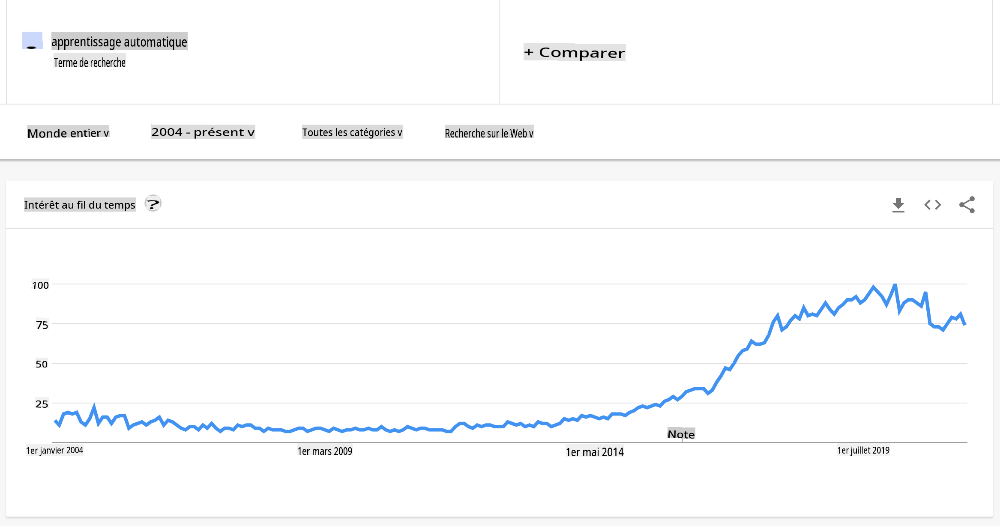
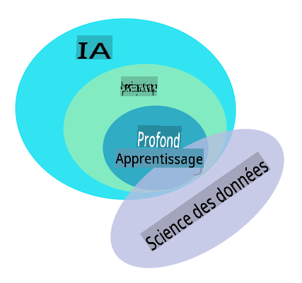

# Introduction à l'apprentissage automatique

## [Quiz avant le cours](https://gray-sand-07a10f403.1.azurestaticapps.net/quiz/1/)

---

> 🎥 Cliquez sur l'image ci-dessus pour une courte vidéo présentant cette leçon.

Bienvenue dans ce cours sur l'apprentissage automatique classique pour les débutants ! Que vous soyez complètement nouveau dans ce domaine ou un praticien expérimenté de l'apprentissage automatique cherchant à réviser un sujet, nous sommes ravis de vous avoir parmi nous ! Nous voulons créer un point de départ amical pour vos études en apprentissage automatique et serions heureux d'évaluer, de répondre et d'incorporer vos [retours](https://github.com/microsoft/ML-For-Beginners/discussions).

---
## Commencer avec l'apprentissage automatique

Avant de commencer ce programme, vous devez configurer votre ordinateur et être prêt à exécuter des notebooks localement.

- **Configurez votre machine avec ces vidéos**. Utilisez les liens suivants pour apprendre [comment installer Python](https://youtu.be/CXZYvNRIAKM) sur votre système et [configurer un éditeur de texte](https://youtu.be/EU8eayHWoZg) pour le développement.
- **Apprenez Python**. Il est également recommandé d'avoir une compréhension de base de [Python](https://docs.microsoft.com/learn/paths/python-language/?WT.mc_id=academic-77952-leestott), un langage de programmation utile pour les data scientists que nous utilisons dans ce cours.
- **Apprenez Node.js et JavaScript**. Nous utilisons également JavaScript à plusieurs reprises dans ce cours lors de la création d'applications web, donc vous devrez avoir [node](https://nodejs.org) et [npm](https://www.npmjs.com/) installés, ainsi que [Visual Studio Code](https://code.visualstudio.com/) disponible pour le développement en Python et JavaScript.
- **Créez un compte GitHub**. Puisque vous nous avez trouvés ici sur [GitHub](https://github.com), vous avez peut-être déjà un compte, mais sinon, créez-en un et ensuite forkez ce programme pour l'utiliser par vous-même. (N'hésitez pas à nous donner une étoile aussi 😊)
- **Explorez Scikit-learn**. Familiarisez-vous avec [Scikit-learn](https://scikit-learn.org/stable/user_guide.html), un ensemble de bibliothèques d'apprentissage automatique que nous mentionnons dans ces leçons.

---
## Qu'est-ce que l'apprentissage automatique ?

Le terme 'apprentissage automatique' est l'un des termes les plus populaires et fréquemment utilisés aujourd'hui. Il y a une possibilité non négligeable que vous ayez entendu ce terme au moins une fois si vous avez une certaine familiarité avec la technologie, peu importe le domaine dans lequel vous travaillez. Cependant, les mécanismes de l'apprentissage automatique demeurent un mystère pour la plupart des gens. Pour un débutant en apprentissage automatique, le sujet peut parfois sembler écrasant. Par conséquent, il est important de comprendre ce qu'est réellement l'apprentissage automatique et d'apprendre à ce sujet étape par étape, à travers des exemples pratiques.

---
## La courbe de l'engouement

> Google Trends montre la récente 'courbe de l'engouement' du terme 'apprentissage automatique'

---
## Un univers mystérieux

Nous vivons dans un univers rempli de mystères fascinants. De grands scientifiques tels que Stephen Hawking, Albert Einstein et bien d'autres ont consacré leur vie à la recherche d'informations significatives qui dévoilent les mystères du monde qui nous entoure. C'est la condition humaine d'apprendre : un enfant humain apprend de nouvelles choses et découvre la structure de son monde année après année en grandissant.

---
## Le cerveau de l'enfant

Le cerveau d'un enfant et ses sens perçoivent les faits de leur environnement et apprennent progressivement les schémas cachés de la vie qui aident l'enfant à élaborer des règles logiques pour identifier les modèles appris. Le processus d'apprentissage du cerveau humain fait des humains la créature vivante la plus sophistiquée de ce monde. Apprendre continuellement en découvrant des schémas cachés et en innovant sur ces schémas nous permet de nous améliorer de plus en plus tout au long de notre vie. Cette capacité d'apprentissage et cette capacité d'évolution sont liées à un concept appelé [plasticité cérébrale](https://www.simplypsychology.org/brain-plasticity.html). Superficiellement, nous pouvons établir certaines similitudes motivantes entre le processus d'apprentissage du cerveau humain et les concepts d'apprentissage automatique.

---
## Le cerveau humain

Le [cerveau humain](https://www.livescience.com/29365-human-brain.html) perçoit des choses du monde réel, traite les informations perçues, prend des décisions rationnelles et effectue certaines actions en fonction des circonstances. C'est ce que nous appelons un comportement intelligent. Lorsque nous programmons une imitation du processus de comportement intelligent dans une machine, on l'appelle intelligence artificielle (IA).

---
## Quelques terminologies

Bien que les termes puissent prêter à confusion, l'apprentissage automatique (AA) est un sous-ensemble important de l'intelligence artificielle. **L'AA concerne l'utilisation d'algorithmes spécialisés pour découvrir des informations significatives et trouver des schémas cachés à partir de données perçues pour corroborer le processus de prise de décision rationnelle**.

---
## IA, AA, apprentissage profond

> Un diagramme montrant les relations entre IA, AA, apprentissage profond et science des données. Infographie par [Jen Looper](https://twitter.com/jenlooper) inspirée par [ce graphique](https://softwareengineering.stackexchange.com/questions/366996/distinction-between-ai-ml-neural-networks-deep-learning-and-data-mining)

---
## Concepts à couvrir

Dans ce programme, nous allons couvrir uniquement les concepts fondamentaux de l'apprentissage automatique que tout débutant doit connaître. Nous abordons ce que nous appelons 'l'apprentissage automatique classique' principalement en utilisant Scikit-learn, une excellente bibliothèque que de nombreux étudiants utilisent pour apprendre les bases. Pour comprendre des concepts plus larges d'intelligence artificielle ou d'apprentissage profond, une solide connaissance fondamentale de l'apprentissage automatique est indispensable, et nous souhaitons donc l'offrir ici.

---
## Dans ce cours, vous apprendrez :

- les concepts fondamentaux de l'apprentissage automatique
- l'histoire de l'AA
- l'AA et l'équité
- les techniques d'AA par régression
- les techniques d'AA par classification
- les techniques d'AA par clustering
- les techniques d'AA en traitement du langage naturel
- les techniques d'AA pour les prévisions de séries temporelles
- l'apprentissage par renforcement
- les applications concrètes de l'AA

---
## Ce que nous ne couvrirons pas

- apprentissage profond
- réseaux de neurones
- IA

Pour améliorer l'expérience d'apprentissage, nous éviterons les complexités des réseaux de neurones, de l'apprentissage profond - la construction de modèles à plusieurs couches utilisant des réseaux de neurones - et de l'IA, que nous aborderons dans un autre programme. Nous proposerons également un programme de science des données à venir pour nous concentrer sur cet aspect de ce domaine plus vaste.

---
## Pourquoi étudier l'apprentissage automatique ?

L'apprentissage automatique, d'un point de vue systémique, est défini comme la création de systèmes automatisés capables d'apprendre des schémas cachés à partir de données pour aider à prendre des décisions intelligentes.

Cette motivation est vaguement inspirée par la manière dont le cerveau humain apprend certaines choses en fonction des données qu'il perçoit du monde extérieur.

✅ Réfléchissez un instant à pourquoi une entreprise voudrait essayer d'utiliser des stratégies d'apprentissage automatique plutôt que de créer un moteur basé sur des règles codées en dur.

---
## Applications de l'apprentissage automatique

Les applications de l'apprentissage automatique sont désormais presque partout, et sont aussi omniprésentes que les données qui circulent dans nos sociétés, générées par nos smartphones, appareils connectés et autres systèmes. Compte tenu de l'immense potentiel des algorithmes d'apprentissage automatique à la pointe de la technologie, les chercheurs ont exploré leur capacité à résoudre des problèmes réels multidimensionnels et multidisciplinaires avec d'excellents résultats.

---
## Exemples d'AA appliqué

**Vous pouvez utiliser l'apprentissage automatique de nombreuses manières** :

- Pour prédire la probabilité de maladie à partir de l'historique médical ou des rapports d'un patient.
- Pour tirer parti des données météorologiques afin de prédire des événements météorologiques.
- Pour comprendre le sentiment d'un texte.
- Pour détecter les fausses nouvelles afin d'arrêter la propagation de la propagande.

La finance, l'économie, les sciences de la terre, l'exploration spatiale, l'ingénierie biomédicale, la science cognitive et même des domaines des sciences humaines ont adapté l'apprentissage automatique pour résoudre les problèmes lourds en traitement de données de leur domaine.

---
## Conclusion

L'apprentissage automatique automatise le processus de découverte de schémas en trouvant des idées significatives à partir de données réelles ou générées. Il a prouvé sa grande valeur dans les applications commerciales, de santé et financières, entre autres.

Dans un avenir proche, comprendre les bases de l'apprentissage automatique sera indispensable pour les personnes de tous les domaines en raison de son adoption généralisée.

---
# 🚀 Défi

Esquissez, sur papier ou en utilisant une application en ligne comme [Excalidraw](https://excalidraw.com/), votre compréhension des différences entre IA, AA, apprentissage profond et science des données. Ajoutez quelques idées de problèmes que chacune de ces techniques est bonne à résoudre.

# [Quiz après le cours](https://gray-sand-07a10f403.1.azurestaticapps.net/quiz/2/)

---
# Revue & Auto-étude

Pour en savoir plus sur la façon dont vous pouvez travailler avec des algorithmes d'AA dans le cloud, suivez ce [Parcours d'apprentissage](https://docs.microsoft.com/learn/paths/create-no-code-predictive-models-azure-machine-learning/?WT.mc_id=academic-77952-leestott).

Suivez un [Parcours d'apprentissage](https://docs.microsoft.com/learn/modules/introduction-to-machine-learning/?WT.mc_id=academic-77952-leestott) sur les bases de l'AA.

---
# Devoir

[Commencez et exécutez](assignment.md)

**Avertissement** :  
Ce document a été traduit à l'aide de services de traduction automatique basés sur l'IA. Bien que nous nous efforçons d'assurer l'exactitude, veuillez noter que les traductions automatisées peuvent contenir des erreurs ou des inexactitudes. Le document original dans sa langue native doit être considéré comme la source autorisée. Pour des informations critiques, une traduction professionnelle par un humain est recommandée. Nous ne sommes pas responsables des malentendus ou des interprétations erronées résultant de l'utilisation de cette traduction.