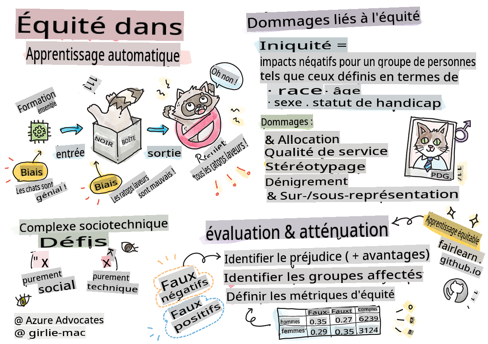

<!--
CO_OP_TRANSLATOR_METADATA:
{
  "original_hash": "8f819813b2ca08ec7b9f60a2c9336045",
  "translation_date": "2025-09-03T23:26:34+00:00",
  "source_file": "1-Introduction/3-fairness/README.md",
  "language_code": "fr"
}
-->
# Construire des solutions de Machine Learning avec une IA responsable

> Sketchnote par [Tomomi Imura](https://www.twitter.com/girlie_mac)

## [Quiz avant le cours](https://gray-sand-07a10f403.1.azurestaticapps.net/quiz/5/)

## Introduction

Dans ce programme, vous commencerez à découvrir comment le machine learning peut influencer et influence déjà notre vie quotidienne. Aujourd'hui, des systèmes et des modèles participent à des tâches de prise de décision quotidienne, comme les diagnostics médicaux, les approbations de prêts ou la détection de fraudes. Il est donc essentiel que ces modèles fonctionnent correctement pour fournir des résultats fiables. Comme pour toute application logicielle, les systèmes d'IA peuvent ne pas répondre aux attentes ou produire des résultats indésirables. C'est pourquoi il est crucial de comprendre et d'expliquer le comportement d'un modèle d'IA.

Imaginez ce qui peut se produire lorsque les données utilisées pour construire ces modèles manquent de certaines représentations démographiques, comme la race, le genre, les opinions politiques ou la religion, ou lorsqu'elles représentent ces groupes de manière disproportionnée. Que se passe-t-il lorsque les résultats du modèle favorisent certains groupes démographiques ? Quelles sont les conséquences pour l'application ? De plus, que se passe-t-il lorsque le modèle produit un résultat négatif et nuit aux personnes ? Qui est responsable du comportement des systèmes d'IA ? Ce sont quelques-unes des questions que nous explorerons dans ce programme.

Dans cette leçon, vous allez :

- Prendre conscience de l'importance de l'équité dans le machine learning et des préjudices liés à l'équité.
- Vous familiariser avec la pratique d'exploration des cas particuliers et des scénarios inhabituels pour garantir la fiabilité et la sécurité.
- Comprendre la nécessité de concevoir des systèmes inclusifs pour autonomiser tout le monde.
- Explorer l'importance de protéger la vie privée et la sécurité des données et des personnes.
- Découvrir l'importance d'une approche transparente pour expliquer le comportement des modèles d'IA.
- Être attentif au rôle essentiel de la responsabilité pour instaurer la confiance dans les systèmes d'IA.

## Prérequis

En guise de prérequis, veuillez suivre le parcours d'apprentissage "Principes de l'IA responsable" et regarder la vidéo ci-dessous sur le sujet :

En savoir plus sur l'IA responsable en suivant ce [parcours d'apprentissage](https://docs.microsoft.com/learn/modules/responsible-ai-principles/?WT.mc_id=academic-77952-leestott)

> 🎥 Cliquez sur l'image ci-dessus pour une vidéo : Approche de Microsoft sur l'IA responsable

## Équité

Les systèmes d'IA doivent traiter tout le monde de manière équitable et éviter d'affecter différemment des groupes similaires de personnes. Par exemple, lorsque les systèmes d'IA fournissent des recommandations sur les traitements médicaux, les demandes de prêt ou l'emploi, ils doivent faire les mêmes recommandations à tous ceux qui présentent des symptômes, des circonstances financières ou des qualifications professionnelles similaires. Chacun de nous, en tant qu'humain, porte des biais hérités qui influencent nos décisions et nos actions. Ces biais peuvent se refléter dans les données que nous utilisons pour entraîner les systèmes d'IA. Ces manipulations peuvent parfois se produire involontairement. Il est souvent difficile de savoir consciemment quand vous introduisez un biais dans les données.

**L'« inéquité »** englobe les impacts négatifs, ou « préjudices », pour un groupe de personnes, comme ceux définis en termes de race, de genre, d'âge ou de handicap. Les principaux préjudices liés à l'équité peuvent être classés comme suit :

- **Allocation**, si un genre ou une ethnie, par exemple, est favorisé par rapport à un autre.
- **Qualité du service**. Si vous entraînez les données pour un scénario spécifique mais que la réalité est beaucoup plus complexe, cela conduit à un service de mauvaise qualité. Par exemple, un distributeur de savon qui semble incapable de détecter les personnes à la peau foncée. [Référence](https://gizmodo.com/why-cant-this-soap-dispenser-identify-dark-skin-1797931773)
- **Dénigrement**. Critiquer ou étiqueter injustement quelque chose ou quelqu'un. Par exemple, une technologie de reconnaissance d'images a tristement mal identifié des images de personnes à la peau foncée comme des gorilles.
- **Sur- ou sous-représentation**. L'idée qu'un certain groupe n'est pas représenté dans une certaine profession, et tout service ou fonction qui continue de promouvoir cela contribue au préjudice.
- **Stéréotypage**. Associer un groupe donné à des attributs préassignés. Par exemple, un système de traduction entre l'anglais et le turc peut présenter des inexactitudes dues à des mots associés à des stéréotypes de genre.

> traduction en turc

> traduction en anglais

Lors de la conception et des tests des systèmes d'IA, nous devons nous assurer que l'IA est équitable et qu'elle n'est pas programmée pour prendre des décisions biaisées ou discriminatoires, que les êtres humains sont également interdits de prendre. Garantir l'équité dans l'IA et le machine learning reste un défi sociotechnique complexe.

### Fiabilité et sécurité

Pour instaurer la confiance, les systèmes d'IA doivent être fiables, sûrs et cohérents dans des conditions normales et inattendues. Il est important de savoir comment les systèmes d'IA se comporteront dans une variété de situations, en particulier lorsqu'il s'agit de cas particuliers. Lors de la création de solutions d'IA, il est nécessaire de se concentrer fortement sur la manière de gérer une grande variété de circonstances que les solutions d'IA pourraient rencontrer. Par exemple, une voiture autonome doit donner la priorité à la sécurité des personnes. En conséquence, l'IA qui alimente la voiture doit prendre en compte tous les scénarios possibles que la voiture pourrait rencontrer, comme la nuit, les orages ou les tempêtes de neige, les enfants traversant la rue, les animaux domestiques, les travaux routiers, etc. La capacité d'un système d'IA à gérer de manière fiable et sûre une large gamme de conditions reflète le niveau d'anticipation que le data scientist ou le développeur d'IA a pris en compte lors de la conception ou des tests du système.

> [🎥 Cliquez ici pour une vidéo : ](https://www.microsoft.com/videoplayer/embed/RE4vvIl)

### Inclusion

Les systèmes d'IA doivent être conçus pour engager et autonomiser tout le monde. Lors de la conception et de la mise en œuvre des systèmes d'IA, les data scientists et les développeurs d'IA identifient et abordent les obstacles potentiels dans le système qui pourraient exclure involontairement des personnes. Par exemple, il y a 1 milliard de personnes handicapées dans le monde. Avec les avancées de l'IA, elles peuvent accéder à une large gamme d'informations et d'opportunités plus facilement dans leur vie quotidienne. En abordant ces obstacles, cela crée des opportunités d'innover et de développer des produits d'IA avec de meilleures expériences qui profitent à tout le monde.

> [🎥 Cliquez ici pour une vidéo : inclusion dans l'IA](https://www.microsoft.com/videoplayer/embed/RE4vl9v)

### Sécurité et confidentialité

Les systèmes d'IA doivent être sûrs et respecter la vie privée des personnes. Les gens ont moins confiance dans les systèmes qui mettent leur vie privée, leurs informations ou leur vie en danger. Lors de l'entraînement des modèles de machine learning, nous nous appuyons sur les données pour produire les meilleurs résultats. Ce faisant, l'origine des données et leur intégrité doivent être prises en compte. Par exemple, les données ont-elles été soumises par les utilisateurs ou sont-elles disponibles publiquement ? Ensuite, lors du travail avec les données, il est crucial de développer des systèmes d'IA capables de protéger les informations confidentielles et de résister aux attaques. À mesure que l'IA devient plus répandue, protéger la vie privée et sécuriser les informations personnelles et professionnelles importantes devient de plus en plus critique et complexe. Les problèmes de confidentialité et de sécurité des données nécessitent une attention particulière pour l'IA, car l'accès aux données est essentiel pour que les systèmes d'IA fassent des prédictions et des décisions précises et éclairées sur les personnes.

> [🎥 Cliquez ici pour une vidéo : sécurité dans l'IA](https://www.microsoft.com/videoplayer/embed/RE4voJF)

- En tant qu'industrie, nous avons réalisé des avancées significatives en matière de confidentialité et de sécurité, largement alimentées par des réglementations comme le RGPD (Règlement Général sur la Protection des Données).
- Cependant, avec les systèmes d'IA, nous devons reconnaître la tension entre le besoin de données personnelles pour rendre les systèmes plus efficaces et la protection de la vie privée.
- Tout comme avec la naissance des ordinateurs connectés à Internet, nous observons également une augmentation significative du nombre de problèmes de sécurité liés à l'IA.
- En même temps, nous avons vu l'IA être utilisée pour améliorer la sécurité. Par exemple, la plupart des scanners antivirus modernes sont aujourd'hui alimentés par des heuristiques d'IA.
- Nous devons nous assurer que nos processus de data science s'harmonisent avec les dernières pratiques en matière de confidentialité et de sécurité.

### Transparence

Les systèmes d'IA doivent être compréhensibles. Une partie essentielle de la transparence consiste à expliquer le comportement des systèmes d'IA et de leurs composants. Améliorer la compréhension des systèmes d'IA nécessite que les parties prenantes comprennent comment et pourquoi ils fonctionnent afin qu'elles puissent identifier les problèmes de performance potentiels, les préoccupations en matière de sécurité et de confidentialité, les biais, les pratiques d'exclusion ou les résultats involontaires. Nous croyons également que ceux qui utilisent les systèmes d'IA doivent être honnêtes et transparents sur le moment, la raison et la manière dont ils choisissent de les déployer, ainsi que sur les limites des systèmes qu'ils utilisent. Par exemple, si une banque utilise un système d'IA pour soutenir ses décisions de prêt aux consommateurs, il est important d'examiner les résultats et de comprendre quelles données influencent les recommandations du système. Les gouvernements commencent à réglementer l'IA dans divers secteurs, donc les data scientists et les organisations doivent expliquer si un système d'IA répond aux exigences réglementaires, en particulier lorsqu'il y a un résultat indésirable.

> [🎥 Cliquez ici pour une vidéo : transparence dans l'IA](https://www.microsoft.com/videoplayer/embed/RE4voJF)

- Parce que les systèmes d'IA sont si complexes, il est difficile de comprendre leur fonctionnement et d'interpréter les résultats.
- Ce manque de compréhension affecte la manière dont ces systèmes sont gérés, opérationnalisés et documentés.
- Ce manque de compréhension affecte surtout les décisions prises en utilisant les résultats produits par ces systèmes.

### Responsabilité

Les personnes qui conçoivent et déploient des systèmes d'IA doivent être responsables de leur fonctionnement. La nécessité de responsabilité est particulièrement cruciale avec les technologies sensibles comme la reconnaissance faciale. Récemment, la demande pour la technologie de reconnaissance faciale a augmenté, notamment de la part des organisations de maintien de l'ordre qui voient le potentiel de cette technologie dans des utilisations comme la recherche d'enfants disparus. Cependant, ces technologies pourraient potentiellement être utilisées par un gouvernement pour mettre en danger les libertés fondamentales de ses citoyens, par exemple en permettant une surveillance continue de certains individus. Ainsi, les data scientists et les organisations doivent être responsables de l'impact de leur système d'IA sur les individus ou la société.

> 🎥 Cliquez sur l'image ci-dessus pour une vidéo : Avertissements sur la surveillance de masse via la reconnaissance faciale

En fin de compte, l'une des plus grandes questions pour notre génération, en tant que première génération à introduire l'IA dans la société, est de savoir comment garantir que les ordinateurs resteront responsables envers les personnes et comment garantir que les personnes qui conçoivent les ordinateurs restent responsables envers tout le monde.

## Évaluation de l'impact

Avant d'entraîner un modèle de machine learning, il est important de réaliser une évaluation de l'impact pour comprendre l'objectif du système d'IA, son utilisation prévue, son lieu de déploiement et les personnes qui interagiront avec le système. Ces éléments sont utiles pour les examinateurs ou les testeurs qui évaluent le système afin de savoir quels facteurs prendre en compte lors de l'identification des risques potentiels et des conséquences attendues.

Les domaines suivants sont à examiner lors de l'évaluation de l'impact :

* **Impact négatif sur les individus**. Être conscient de toute restriction ou exigence, utilisation non prise en charge ou toute limitation connue entravant les performances du système est essentiel pour garantir que le système n'est pas utilisé de manière à nuire aux individus.
* **Exigences en matière de données**. Comprendre comment et où le système utilisera les données permet aux examinateurs d'explorer les exigences en matière de données dont vous devez tenir compte (par exemple, les réglementations RGPD ou HIPAA). En outre, examinez si la source ou la quantité de données est suffisante pour l'entraînement.
* **Résumé de l'impact**. Rassemblez une liste des préjudices potentiels qui pourraient découler de l'utilisation du système. Tout au long du cycle de vie du ML, vérifiez si les problèmes identifiés sont atténués ou résolus.
* **Objectifs applicables** pour chacun des six principes fondamentaux. Évaluez si les objectifs de chaque principe sont atteints et s'il existe des lacunes.

## Débogage avec une IA responsable

Tout comme le débogage d'une application logicielle, le débogage d'un système d'IA est un processus nécessaire pour identifier et résoudre les problèmes du système. De nombreux facteurs peuvent affecter les performances d'un modèle qui ne répond pas aux attentes ou aux principes de responsabilité. La plupart des métriques traditionnelles de performance des modèles sont des agrégats quantitatifs des performances d'un modèle, ce qui n'est pas suffisant pour analyser comment un modèle viole les principes de l'IA responsable. De plus, un modèle de machine learning est une boîte noire qui rend difficile la compréhension de ce qui motive ses résultats ou l'explication de ses erreurs. Plus tard dans ce cours, nous apprendrons à utiliser le tableau de bord de l'IA responsable pour aider à déboguer les systèmes d'IA. Ce tableau de bord fournit un outil holistique pour les data scientists et les développeurs d'IA afin de réaliser :

* **Analyse des erreurs**. Identifier la répartition des erreurs du modèle qui peut affecter l'équité ou la fiabilité du système.
* **Vue d'ensemble du modèle**. Découvrir où il y a des disparités dans les performances du modèle à travers les cohortes de données.
* **Analyse des données**. Comprendre la répartition des données et identifier tout biais potentiel dans les données pouvant entraîner des problèmes d'équité, d'inclusion et de fiabilité.
* **Interprétabilité du modèle**. Comprendre ce qui affecte ou influence les prédictions du modèle. Cela aide à expliquer le comportement du modèle, ce qui est important pour la transparence et la responsabilité.

## 🚀 Défi

Pour éviter que des préjudices ne soient introduits dès le départ, nous devrions :

- avoir une diversité de parcours et de perspectives parmi les personnes travaillant sur les systèmes
- investir dans des ensembles de données qui reflètent la diversité de notre société
- développer de meilleures méthodes tout au long du cycle de vie du machine learning pour détecter et corriger les problèmes liés à l'IA responsable lorsqu'ils surviennent

Réfléchissez à des scénarios réels où le manque de fiabilité d'un modèle est évident dans sa construction et son utilisation. Que devrions-nous également prendre en compte ?

## [Quiz après le cours](https://gray-sand-07a10f403.1.azurestaticapps.net/quiz/6/)
## Révision et étude personnelle
Dans cette leçon, vous avez appris les bases des concepts d'équité et d'injustice en apprentissage automatique.  

Regardez cet atelier pour approfondir les sujets : 

- À la recherche d'une IA responsable : Mettre les principes en pratique par Besmira Nushi, Mehrnoosh Sameki et Amit Sharma

> 🎥 Cliquez sur l'image ci-dessus pour une vidéo : RAI Toolbox : Un cadre open-source pour construire une IA responsable par Besmira Nushi, Mehrnoosh Sameki et Amit Sharma

Lisez également : 

- Centre de ressources RAI de Microsoft : [Responsible AI Resources – Microsoft AI](https://www.microsoft.com/ai/responsible-ai-resources?activetab=pivot1%3aprimaryr4) 

- Groupe de recherche FATE de Microsoft : [FATE : Fairness, Accountability, Transparency, and Ethics in AI - Microsoft Research](https://www.microsoft.com/research/theme/fate/) 

RAI Toolbox : 

- [Dépôt GitHub de Responsible AI Toolbox](https://github.com/microsoft/responsible-ai-toolbox)

Découvrez les outils d'Azure Machine Learning pour garantir l'équité :

- [Azure Machine Learning](https://docs.microsoft.com/azure/machine-learning/concept-fairness-ml?WT.mc_id=academic-77952-leestott) 

## Devoir

[Explorez RAI Toolbox](assignment.md)

---

**Avertissement** :  
Ce document a été traduit à l'aide du service de traduction automatique [Co-op Translator](https://github.com/Azure/co-op-translator). Bien que nous nous efforcions d'assurer l'exactitude, veuillez noter que les traductions automatisées peuvent contenir des erreurs ou des inexactitudes. Le document original dans sa langue d'origine doit être considéré comme la source faisant autorité. Pour des informations critiques, il est recommandé de recourir à une traduction professionnelle réalisée par un humain. Nous déclinons toute responsabilité en cas de malentendus ou d'interprétations erronées résultant de l'utilisation de cette traduction.