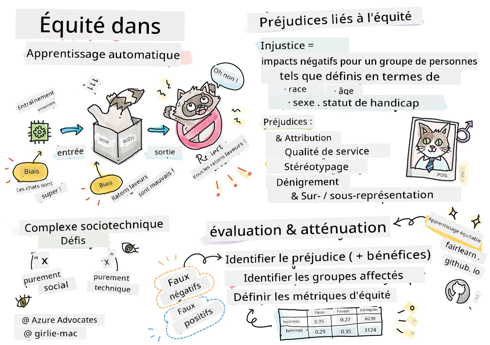

# Construire des solutions d’apprentissage automatique avec une IA responsable
 

> Sketchnote par [Tomomi Imura](https://www.twitter.com/girlie_mac)

## [Quiz avant la leçon](https://ff-quizzes.netlify.app/en/ml/)
 
## Introduction

Dans ce programme, vous commencerez à découvrir comment l’apprentissage automatique peut et impacte nos vies quotidiennes. Même à l’heure actuelle, des systèmes et modèles interviennent dans les tâches décisionnelles quotidiennes, telles que les diagnostics médicaux, les approbations de prêts ou la détection de fraudes. Il est donc important que ces modèles fonctionnent bien pour fournir des résultats dignes de confiance. Comme toute application logicielle, les systèmes d’IA peuvent ne pas répondre aux attentes ou produire un résultat indésirable. C’est pourquoi il est essentiel de pouvoir comprendre et expliquer le comportement d’un modèle d’IA.

Imaginez ce qui peut arriver lorsque les données utilisées pour construire ces modèles manquent certains groupes démographiques, tels que la race, le genre, les opinions politiques, la religion, ou représentent de façon disproportionnée ces groupes démographiques. Que se passe-t-il lorsque le résultat du modèle est interprété comme favorisant un groupe démographique ? Quelle est la conséquence pour l’application ? De plus, que se passe-t-il lorsque le modèle produit un résultat défavorable et nuit aux personnes ? Qui est responsable du comportement des systèmes d’IA ? Ce sont quelques-unes des questions que nous explorerons dans ce programme.

Dans cette leçon, vous allez :

- Prendre conscience de l’importance de l’équité dans l’apprentissage automatique et des préjudices liés à l’équité.
- Vous familiariser avec la pratique d’explorer les valeurs aberrantes et les scénarios inhabituels pour assurer la fiabilité et la sécurité.
- Comprendre la nécessité d’autonomiser tout le monde en concevant des systèmes inclusifs.
- Explorer combien il est vital de protéger la vie privée et la sécurité des données et des personnes.
- Voir l’importance d’adopter une approche « boîte transparente » pour expliquer le comportement des modèles d’IA.
- Être conscient de l’importance de la responsabilité pour construire la confiance dans les systèmes d’IA.

## Prérequis

En préalable, veuillez suivre le parcours d’apprentissage « Principes de l’IA responsable » et visionner la vidéo ci-dessous sur le sujet :

En savoir plus sur l’IA responsable en suivant ce [Parcours d’apprentissage](https://docs.microsoft.com/learn/modules/responsible-ai-principles/?WT.mc_id=academic-77952-leestott)

> 🎥 Cliquez sur l’image ci-dessus pour une vidéo : Approche de Microsoft pour une IA responsable

## Équité

Les systèmes d’IA doivent traiter tout le monde équitablement et éviter d’affecter différemment des groupes de personnes similaires. Par exemple, lorsque les systèmes d’IA fournissent des recommandations sur un traitement médical, des demandes de prêt ou un emploi, ils doivent faire les mêmes recommandations à tous ceux qui présentent des symptômes similaires, des circonstances financières semblables ou des qualifications professionnelles équivalentes. Chacun de nous porte des biais hérités qui influencent nos décisions et actions. Ces biais peuvent être présents dans les données utilisées pour entraîner les systèmes d’IA. Cette manipulation peut parfois se produire involontairement. Il est souvent difficile de savoir consciemment quand on introduit un biais dans les données.

**« Injustice »** englobe les impacts négatifs, ou « préjudices », subis par un groupe de personnes, par exemple définis en fonction de la race, du genre, de l’âge ou du statut de handicap. Les principaux préjudices liés à l’équité peuvent être classés comme suit :

- **Répartition**, si un genre ou une origine ethnique, par exemple, est favorisé par rapport à un autre.
- **Qualité du service**. Si vous entraînez les données pour un scénario précis mais que la réalité est beaucoup plus complexe, cela conduit à un service de mauvaise qualité. Par exemple, un distributeur de savon qui ne semble pas capable de détecter les personnes à la peau foncée. [Référence](https://gizmodo.com/why-cant-this-soap-dispenser-identify-dark-skin-1797931773)
- **Dénigrement**. Critiquer et étiqueter injustement quelque chose ou quelqu’un. Par exemple, une technologie d’étiquetage d’images a tristement célèbrement mal étiqueté des images de personnes à la peau foncée comme des gorilles.
- **Sur- ou sous-représentation**. L’idée est qu’un certain groupe n’est pas visible dans une certaine profession, et tout service ou fonction qui continue à promouvoir cela contribue à causer un préjudice.
- **Stéréotypage**. Associer un groupe donné à des attributs préassignés. Par exemple, un système de traduction linguistique entre l’anglais et le turc peut avoir des inexactitudes dues à des mots associés à des stéréotypes de genre.

> traduction vers le turc

> traduction retour en anglais

Lors de la conception et des tests des systèmes d’IA, nous devons nous assurer que l’IA est équitable et ne soit pas programmée pour prendre des décisions biaisées ou discriminatoires, ce que les êtres humains sont également interdits de faire. Garantir l’équité dans l’IA et l’apprentissage automatique reste un défi sociotechnique complexe.

### Fiabilité et sécurité

Pour instaurer la confiance, les systèmes d’IA doivent être fiables, sûrs et cohérents dans des conditions normales et inattendues. Il est important de savoir comment les systèmes d’IA se comporteront dans différentes situations, en particulier lorsqu’il s’agit d’éléments atypiques. Lors de la création de solutions d’IA, il faut accorder une attention substantielle à la manière de gérer une grande variété de circonstances que la solution d’IA pourrait rencontrer. Par exemple, une voiture autonome doit faire de la sécurité des personnes une priorité absolue. Par conséquent, l’IA qui alimente la voiture doit considérer tous les scénarios possibles que la voiture pourrait rencontrer, comme la nuit, les orages, les tempêtes de neige, les enfants traversant la rue, les animaux domestiques, les travaux routiers, etc. La capacité d’un système d’IA à gérer une grande diversité de conditions avec fiabilité et sécurité reflète le niveau d’anticipation du data scientist ou du développeur d’IA lors de la conception ou des tests du système.

> [🎥 Cliquez ici pour une vidéo : ](https://www.microsoft.com/videoplayer/embed/RE4vvIl)

### Inclusion

Les systèmes d’IA doivent être conçus pour engager et autonomiser tout le monde. Lors de la conception et de la mise en œuvre des systèmes d’IA, les data scientists et développeurs identifient et traitent les obstacles potentiels dans le système qui pourraient exclure involontairement des personnes. Par exemple, il y a 1 milliard de personnes en situation de handicap dans le monde. Avec l’avancement de l’IA, elles peuvent accéder plus facilement à une grande variété d’informations et d’opportunités dans leur vie quotidienne. En levant ces obstacles, cela crée des opportunités d’innover et de développer des produits d’IA avec de meilleures expériences qui bénéficient à tous.

> [🎥 Cliquez ici pour une vidéo : inclusion dans l’IA](https://www.microsoft.com/videoplayer/embed/RE4vl9v)

### Sécurité et vie privée

Les systèmes d’IA doivent être sûrs et respecter la vie privée des personnes. Les gens ont moins confiance dans les systèmes qui mettent leur vie privée, leurs informations ou leur vie en danger. Lors de l’entraînement de modèles d’apprentissage automatique, nous nous appuyons sur des données pour produire les meilleurs résultats. Ce faisant, l’origine des données et leur intégrité doivent être prises en compte. Par exemple, les données ont-elles été fournies par l’utilisateur ou sont-elles disponibles publiquement ? Ensuite, lors du travail avec les données, il est crucial de développer des systèmes d’IA capables de protéger les informations confidentielles et de résister aux attaques. À mesure que l’IA devient plus courante, protéger la vie privée et sécuriser les informations personnelles et professionnelles importantes devient de plus en plus critique et complexe. Les problèmes de vie privée et de sécurité des données requièrent une attention particulière en IA car l’accès aux données est essentiel pour que les systèmes d’IA fassent des prédictions et des décisions précises et éclairées sur les personnes.

> [🎥 Cliquez ici pour une vidéo : sécurité dans l’IA](https://www.microsoft.com/videoplayer/embed/RE4voJF)

- En tant qu’industrie, nous avons réalisé des avancées significatives en matière de vie privée et de sécurité, largement stimulées par des réglementations comme le RGPD (Règlement général sur la protection des données).
- Pourtant, avec les systèmes d’IA, nous devons reconnaître la tension entre le besoin de plus de données personnelles pour rendre les systèmes plus personnels et efficaces – et la vie privée.
- Comme avec la naissance des ordinateurs connectés à Internet, nous observons aussi une forte augmentation du nombre de problèmes de sécurité liés à l’IA.
- En même temps, nous avons vu l’IA utilisée pour améliorer la sécurité. Par exemple, la plupart des scanners antivirus modernes sont aujourd’hui alimentés par des heuristiques d’IA.
- Nous devons veiller à ce que nos processus de science des données s’harmonisent avec les dernières pratiques en matière de vie privée et de sécurité.

### Transparence
Les systèmes d’IA doivent être compréhensibles. Une partie cruciale de la transparence est d’expliquer le comportement des systèmes d’IA et de leurs composants. Améliorer la compréhension des systèmes d’IA exige que les parties prenantes comprennent comment et pourquoi ils fonctionnent afin de pouvoir identifier les problèmes potentiels de performance, les préoccupations en matière de sécurité et de vie privée, les biais, les pratiques exclusionnaires ou les résultats inattendus. Nous pensons également que ceux qui utilisent les systèmes d’IA devraient être honnêtes et transparents sur le moment, la raison et la manière dont ils choisissent de les déployer, ainsi que sur les limites des systèmes qu’ils utilisent. Par exemple, si une banque utilise un système d’IA pour soutenir ses décisions de prêt à la consommation, il est important d’examiner les résultats et de comprendre quelles données influencent les recommandations du système. Les gouvernements commencent à réglementer l’IA dans tous les secteurs, donc les data scientists et les organisations doivent expliquer si un système d’IA respecte les exigences réglementaires, notamment en cas de résultat indésirable.

> [🎥 Cliquez ici pour une vidéo : transparence dans l’IA](https://www.microsoft.com/videoplayer/embed/RE4voJF)

- Parce que les systèmes d’IA sont si complexes, il est difficile de comprendre leur fonctionnement et d’interpréter les résultats.
- Cette incompréhension impacte la manière dont ces systèmes sont gérés, opérationnalisés et documentés.
- Cette incompréhension affecte surtout les décisions prises à partir des résultats produits par ces systèmes.

### Responsabilité
 
Les personnes qui conçoivent et déploient les systèmes d’IA doivent être responsables de leur fonctionnement. Le besoin de responsabilité est particulièrement crucial avec des technologies d’usage sensible comme la reconnaissance faciale. Récemment, il y a eu une demande croissante pour la reconnaissance faciale, notamment de la part des forces de l’ordre qui voient le potentiel de la technologie pour des usages tels que la recherche d’enfants disparus. Cependant, ces technologies pourraient potentiellement être utilisées par un gouvernement pour mettre en danger les libertés fondamentales de ses citoyens en permettant, par exemple, la surveillance continue de certains individus. Ainsi, les data scientists et les organisations doivent être responsables de l’impact de leurs systèmes d’IA sur les individus ou la société.

> 🎥 Cliquez sur l’image ci-dessus pour une vidéo : Avertissements sur la surveillance de masse via la reconnaissance faciale

En fin de compte, l'une des plus grandes questions pour notre génération, en tant que première génération à introduire l’IA dans la société, est de savoir comment garantir que les ordinateurs resteront responsables envers les personnes et comment garantir que les personnes qui conçoivent les ordinateurs restent responsables envers tout le monde.

## Évaluation d’impact

Avant d’entraîner un modèle d’apprentissage automatique, il est important de réaliser une évaluation d’impact pour comprendre le but du système d’IA ; son usage prévu ; où il sera déployé ; et qui interagira avec le système. Cela aide les évaluateurs ou testeurs à savoir quels facteurs prendre en compte pour identifier les risques potentiels et les conséquences attendues.

Les domaines d’intérêt lors de l’évaluation d’impact sont :

* **Impact négatif sur les individus**. Être conscient de toute restriction ou exigence, utilisation non supportée ou toute limite connue entravant la performance du système est vital pour s’assurer que le système ne soit pas utilisé d’une manière susceptible de nuire aux individus.
* **Exigences en matière de données**. Comprendre comment et où le système utilisera les données permet aux évaluateurs d’explorer toutes les exigences en matière de données à respecter (par exemple, RGPD ou HIPAA). En outre, vérifier si la source ou la quantité de données est suffisante pour l’entraînement.
* **Résumé de l’impact**. Recueillir une liste des préjudices potentiels qui pourraient découler de l’utilisation du système. Tout au long du cycle de vie de l’IA, vérifier si les problèmes identifiés sont atténués ou traités.
* **Objectifs applicables** pour chacun des six principes fondamentaux. Évaluer si les objectifs de chaque principe sont atteints et s’il existe des lacunes.

## Débogage avec une IA responsable

Comme pour le débogage d’une application logicielle, déboguer un système d’IA est un processus nécessaire pour identifier et résoudre les problèmes du système. De nombreux facteurs peuvent affecter la performance d’un modèle qui ne répond pas aux attentes ou n’est pas responsable. La plupart des métriques classiques de performance des modèles sont des agrégats quantitatifs de la performance d’un modèle, ce qui n’est pas suffisant pour analyser comment un modèle viole les principes d’IA responsable. Par ailleurs, un modèle d’apprentissage automatique est une boîte noire qui rend difficile la compréhension des facteurs influençant son résultat ou l’explication d’une erreur. Plus tard dans ce cours, nous apprendrons à utiliser le tableau de bord Responsible AI pour aider à déboguer les systèmes d’IA. Le tableau de bord offre un outil holistique pour les data scientists et développeurs d’IA afin d’effectuer :

* **Analyse des erreurs**. Identifier la distribution des erreurs du modèle qui peuvent affecter l’équité ou la fiabilité du système.
* **Vue d’ensemble du modèle**. Découvrir où il existe des disparités dans la performance du modèle selon les cohortes de données.
* **Analyse des données**. Comprendre la répartition des données et identifier tout biais potentiel dans les données susceptible de causer des problèmes d’équité, d’inclusion et de fiabilité.
* **Interprétabilité du modèle**. Comprendre ce qui influence ou impacte les prédictions du modèle. Cela aide à expliquer le comportement du modèle, ce qui est important pour la transparence et la responsabilité.

## 🚀 Défi
 
Pour prévenir l’apparition de préjudices dès le départ, nous devrions :

- avoir une diversité de parcours et de perspectives parmi les personnes travaillant sur les systèmes
- investir dans des jeux de données reflétant la diversité de notre société
- développer de meilleures méthodes tout au long du cycle de vie de l’apprentissage automatique pour détecter et corriger les cas d’IA responsable lorsque cela se produit

Pensez à des scénarios réels où le manque de fiabilité d’un modèle est évident lors de la construction et de l’utilisation du modèle. Que devrions-nous d’autre prendre en compte ?

## [Quiz après la leçon](https://ff-quizzes.netlify.app/en/ml/)

## Revue & auto-étude
 

Dans cette leçon, vous avez appris quelques notions de base sur les concepts d’équité et d’inéquité en apprentissage automatique.  
 
Regardez cet atelier pour approfondir les sujets : 

- À la poursuite d’une IA responsable : Mettre les principes en pratique par Besmira Nushi, Mehrnoosh Sameki et Amit Sharma

> 🎥 Cliquez sur l’image ci-dessus pour une vidéo : RAI Toolbox : Un cadre open-source pour construire une IA responsable par Besmira Nushi, Mehrnoosh Sameki et Amit Sharma

Lisez aussi : 

- Centre de ressources IA responsable de Microsoft : [Responsible AI Resources – Microsoft AI](https://www.microsoft.com/ai/responsible-ai-resources?activetab=pivot1%3aprimaryr4) 

- Groupe de recherche FATE de Microsoft : [FATE: Fairness, Accountability, Transparency, and Ethics in AI - Microsoft Research](https://www.microsoft.com/research/theme/fate/) 

Boîte à outils RAI : 

- [Dépôt GitHub de la Responsible AI Toolbox](https://github.com/microsoft/responsible-ai-toolbox)

Lisez sur les outils d’Azure Machine Learning pour garantir l’équité :

- [Azure Machine Learning](https://docs.microsoft.com/azure/machine-learning/concept-fairness-ml?WT.mc_id=academic-77952-leestott) 

## Exercice

[Explorez la Responsible AI Toolbox](assignment.md)

---

<!-- CO-OP TRANSLATOR DISCLAIMER START -->
**Avertissement** :
Ce document a été traduit à l'aide du service de traduction automatique [Co-op Translator](https://github.com/Azure/co-op-translator). Bien que nous nous efforçions d'assurer l'exactitude, veuillez noter que les traductions automatisées peuvent contenir des erreurs ou des inexactitudes. Le document original dans sa langue native doit être considéré comme la source faisant autorité. Pour les informations critiques, il est recommandé de recourir à une traduction professionnelle réalisée par un humain. Nous ne saurions être tenus responsables des malentendus ou erreurs d'interprétation découlant de l'utilisation de cette traduction.
<!-- CO-OP TRANSLATOR DISCLAIMER END -->