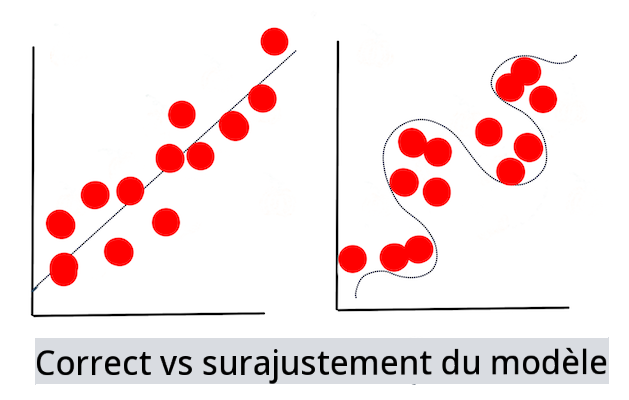

<!--
CO_OP_TRANSLATOR_METADATA:
{
  "original_hash": "dc4575225da159f2b06706e103ddba2a",
  "translation_date": "2025-09-03T23:31:42+00:00",
  "source_file": "1-Introduction/4-techniques-of-ML/README.md",
  "language_code": "fr"
}
-->
# Techniques d'apprentissage automatique

Le processus de création, d'utilisation et de maintenance des modèles d'apprentissage automatique ainsi que des données qu'ils utilisent est très différent de nombreux autres flux de travail de développement. Dans cette leçon, nous allons démystifier ce processus et présenter les principales techniques que vous devez connaître. Vous allez :

- Comprendre les processus qui sous-tendent l'apprentissage automatique à un niveau général.
- Explorer des concepts de base tels que les "modèles", les "prédictions" et les "données d'entraînement".

## [Quiz pré-lecture](https://gray-sand-07a10f403.1.azurestaticapps.net/quiz/7/)

> 🎥 Cliquez sur l'image ci-dessus pour une courte vidéo expliquant cette leçon.

## Introduction

À un niveau général, l'art de créer des processus d'apprentissage automatique (ML) comprend plusieurs étapes :

1. **Définir la question**. La plupart des processus ML commencent par poser une question qui ne peut pas être résolue par un simple programme conditionnel ou un moteur basé sur des règles. Ces questions tournent souvent autour de prédictions basées sur un ensemble de données.
2. **Collecter et préparer les données**. Pour répondre à votre question, vous avez besoin de données. La qualité et, parfois, la quantité de vos données détermineront dans quelle mesure vous pouvez répondre à votre question initiale. La visualisation des données est un aspect important de cette phase. Cette phase inclut également la division des données en groupes d'entraînement et de test pour construire un modèle.
3. **Choisir une méthode d'entraînement**. Selon votre question et la nature de vos données, vous devez choisir comment entraîner un modèle pour qu'il reflète au mieux vos données et fasse des prédictions précises. Cette partie du processus ML nécessite une expertise spécifique et, souvent, beaucoup d'expérimentation.
4. **Entraîner le modèle**. À l'aide de vos données d'entraînement, vous utiliserez divers algorithmes pour entraîner un modèle à reconnaître des motifs dans les données. Le modèle peut s'appuyer sur des poids internes ajustables pour privilégier certaines parties des données afin de construire un meilleur modèle.
5. **Évaluer le modèle**. Vous utilisez des données jamais vues auparavant (vos données de test) issues de votre ensemble collecté pour évaluer les performances du modèle.
6. **Ajuster les paramètres**. En fonction des performances de votre modèle, vous pouvez recommencer le processus en utilisant différents paramètres ou variables qui contrôlent le comportement des algorithmes utilisés pour entraîner le modèle.
7. **Prédire**. Utilisez de nouvelles entrées pour tester la précision de votre modèle.

## Quelle question poser

Les ordinateurs sont particulièrement doués pour découvrir des motifs cachés dans les données. Cette capacité est très utile pour les chercheurs qui se posent des questions sur un domaine donné et qui ne peuvent pas être facilement résolues par un moteur basé sur des règles conditionnelles. Dans une tâche actuarielle, par exemple, un data scientist pourrait construire des règles artisanales sur la mortalité des fumeurs par rapport aux non-fumeurs.

Cependant, lorsque de nombreuses autres variables entrent en jeu, un modèle ML pourrait s'avérer plus efficace pour prédire les taux de mortalité futurs en se basant sur des antécédents médicaux. Un exemple plus joyeux pourrait être de faire des prévisions météorologiques pour le mois d'avril dans un lieu donné en se basant sur des données telles que la latitude, la longitude, le changement climatique, la proximité de l'océan, les motifs du courant-jet, et plus encore.

✅ Ce [diaporama](https://www2.cisl.ucar.edu/sites/default/files/2021-10/0900%20June%2024%20Haupt_0.pdf) sur les modèles météorologiques offre une perspective historique sur l'utilisation du ML dans l'analyse météorologique.

## Tâches préalables à la construction

Avant de commencer à construire votre modèle, plusieurs tâches doivent être accomplies. Pour tester votre question et formuler une hypothèse basée sur les prédictions d'un modèle, vous devez identifier et configurer plusieurs éléments.

### Données

Pour répondre à votre question avec certitude, vous avez besoin d'une quantité suffisante de données du bon type. À ce stade, deux choses sont nécessaires :

- **Collecter des données**. En gardant à l'esprit la leçon précédente sur l'équité dans l'analyse des données, collectez vos données avec soin. Soyez conscient des sources de ces données, des biais inhérents qu'elles pourraient contenir, et documentez leur origine.
- **Préparer les données**. Il existe plusieurs étapes dans le processus de préparation des données. Vous pourriez avoir besoin de regrouper les données et de les normaliser si elles proviennent de sources diverses. Vous pouvez améliorer la qualité et la quantité des données par divers moyens, comme convertir des chaînes de caractères en nombres (comme nous le faisons dans [Clustering](../../5-Clustering/1-Visualize/README.md)). Vous pourriez également générer de nouvelles données à partir des données originales (comme nous le faisons dans [Classification](../../4-Classification/1-Introduction/README.md)). Vous pouvez nettoyer et éditer les données (comme nous le ferons avant la leçon sur [l'application web](../../3-Web-App/README.md)). Enfin, vous pourriez également avoir besoin de les randomiser et de les mélanger, selon vos techniques d'entraînement.

✅ Après avoir collecté et traité vos données, prenez un moment pour vérifier si leur structure vous permettra de répondre à votre question. Il se peut que les données ne soient pas adaptées à votre tâche, comme nous le découvrons dans nos leçons sur le [Clustering](../../5-Clustering/1-Visualize/README.md) !

### Caractéristiques et cible

Une [caractéristique](https://www.datasciencecentral.com/profiles/blogs/an-introduction-to-variable-and-feature-selection) est une propriété mesurable de vos données. Dans de nombreux ensembles de données, elle est exprimée comme un en-tête de colonne tel que 'date', 'taille' ou 'couleur'. Votre variable caractéristique, généralement représentée par `X` dans le code, représente la variable d'entrée utilisée pour entraîner le modèle.

Une cible est ce que vous essayez de prédire. La cible, généralement représentée par `y` dans le code, correspond à la réponse à la question que vous posez à vos données : en décembre, quelle **couleur** de citrouilles sera la moins chère ? À San Francisco, quels quartiers auront les meilleurs **prix** immobiliers ? Parfois, la cible est également appelée attribut d'étiquette.

### Sélectionner votre variable caractéristique

🎓 **Sélection et extraction de caractéristiques** Comment savoir quelle variable choisir lors de la construction d'un modèle ? Vous passerez probablement par un processus de sélection ou d'extraction de caractéristiques pour choisir les bonnes variables pour un modèle performant. Cependant, ces deux processus sont différents : "L'extraction de caractéristiques crée de nouvelles caractéristiques à partir de fonctions des caractéristiques originales, tandis que la sélection de caractéristiques renvoie un sous-ensemble des caractéristiques." ([source](https://wikipedia.org/wiki/Feature_selection))

### Visualiser vos données

Un aspect important de la boîte à outils du data scientist est la capacité de visualiser les données à l'aide de plusieurs bibliothèques excellentes comme Seaborn ou MatPlotLib. Représenter vos données visuellement peut vous permettre de découvrir des corrélations cachées que vous pouvez exploiter. Vos visualisations peuvent également vous aider à détecter des biais ou des données déséquilibrées (comme nous le découvrons dans [Classification](../../4-Classification/2-Classifiers-1/README.md)).

### Diviser votre ensemble de données

Avant l'entraînement, vous devez diviser votre ensemble de données en deux ou plusieurs parties de tailles inégales qui représentent toujours bien les données.

- **Entraînement**. Cette partie de l'ensemble de données est utilisée pour entraîner votre modèle. Elle constitue la majorité de l'ensemble de données original.
- **Test**. Un ensemble de test est un groupe indépendant de données, souvent issu des données originales, que vous utilisez pour confirmer les performances du modèle construit.
- **Validation**. Un ensemble de validation est un plus petit groupe indépendant d'exemples que vous utilisez pour ajuster les hyperparamètres ou l'architecture du modèle afin de l'améliorer. Selon la taille de vos données et la question posée, vous pourriez ne pas avoir besoin de construire ce troisième ensemble (comme nous le notons dans [Prévisions de séries temporelles](../../7-TimeSeries/1-Introduction/README.md)).

## Construire un modèle

À l'aide de vos données d'entraînement, votre objectif est de construire un modèle, ou une représentation statistique de vos données, en utilisant divers algorithmes pour l'**entraîner**. Entraîner un modèle l'expose aux données et lui permet de faire des hypothèses sur les motifs perçus qu'il découvre, valide et accepte ou rejette.

### Décider d'une méthode d'entraînement

Selon votre question et la nature de vos données, vous choisirez une méthode pour les entraîner. En parcourant la [documentation de Scikit-learn](https://scikit-learn.org/stable/user_guide.html) - que nous utilisons dans ce cours - vous pouvez explorer de nombreuses façons d'entraîner un modèle. Selon votre expérience, vous devrez peut-être essayer plusieurs méthodes différentes pour construire le meilleur modèle. Vous passerez probablement par un processus où les data scientists évaluent les performances d'un modèle en lui fournissant des données non vues, en vérifiant la précision, les biais et d'autres problèmes de qualité, et en sélectionnant la méthode d'entraînement la plus appropriée pour la tâche.

### Entraîner un modèle

Avec vos données d'entraînement, vous êtes prêt à les 'ajuster' pour créer un modèle. Vous remarquerez que dans de nombreuses bibliothèques ML, vous trouverez le code 'model.fit' - c'est à ce moment que vous envoyez votre variable caractéristique sous forme de tableau de valeurs (généralement 'X') et une variable cible (généralement 'y').

### Évaluer le modèle

Une fois le processus d'entraînement terminé (il peut nécessiter de nombreuses itérations, ou 'époques', pour entraîner un grand modèle), vous pourrez évaluer la qualité du modèle en utilisant des données de test pour mesurer ses performances. Ces données sont un sous-ensemble des données originales que le modèle n'a pas encore analysées. Vous pouvez imprimer un tableau de métriques sur la qualité de votre modèle.

🎓 **Ajustement du modèle**

Dans le contexte de l'apprentissage automatique, l'ajustement du modèle fait référence à la précision de la fonction sous-jacente du modèle lorsqu'il tente d'analyser des données qu'il ne connaît pas.

🎓 **Sous-ajustement** et **sur-ajustement** sont des problèmes courants qui dégradent la qualité du modèle, car celui-ci s'ajuste soit pas assez bien, soit trop bien. Cela entraîne des prédictions soit trop alignées, soit trop peu alignées avec les données d'entraînement. Un modèle sur-ajusté prédit trop bien les données d'entraînement car il a appris les détails et le bruit des données de manière excessive. Un modèle sous-ajusté n'est pas précis car il ne peut ni analyser correctement ses données d'entraînement ni les données qu'il n'a pas encore 'vues'.

> Infographie par [Jen Looper](https://twitter.com/jenlooper)

## Ajustement des paramètres

Une fois votre entraînement initial terminé, observez la qualité du modèle et envisagez de l'améliorer en ajustant ses 'hyperparamètres'. Lisez-en davantage sur le processus [dans la documentation](https://docs.microsoft.com/en-us/azure/machine-learning/how-to-tune-hyperparameters?WT.mc_id=academic-77952-leestott).

## Prédiction

C'est le moment où vous pouvez utiliser des données complètement nouvelles pour tester la précision de votre modèle. Dans un cadre ML 'appliqué', où vous construisez des actifs web pour utiliser le modèle en production, ce processus pourrait impliquer de recueillir des entrées utilisateur (par exemple, un clic sur un bouton) pour définir une variable et l'envoyer au modèle pour inférence ou évaluation.

Dans ces leçons, vous découvrirez comment utiliser ces étapes pour préparer, construire, tester, évaluer et prédire - toutes les démarches d'un data scientist et plus encore, à mesure que vous progressez dans votre parcours pour devenir un ingénieur ML 'full stack'.

---

## 🚀Défi

Dessinez un organigramme reflétant les étapes d'un praticien ML. Où vous situez-vous actuellement dans le processus ? Où prévoyez-vous rencontrer des difficultés ? Qu'est-ce qui vous semble facile ?

## [Quiz post-lecture](https://gray-sand-07a10f403.1.azurestaticapps.net/quiz/8/)

## Révision et auto-apprentissage

Recherchez en ligne des interviews de data scientists qui discutent de leur travail quotidien. En voici [une](https://www.youtube.com/watch?v=Z3IjgbbCEfs).

## Devoir

[Interviewez un data scientist](assignment.md)

---

**Avertissement** :  
Ce document a été traduit à l'aide du service de traduction automatique [Co-op Translator](https://github.com/Azure/co-op-translator). Bien que nous nous efforcions d'assurer l'exactitude, veuillez noter que les traductions automatisées peuvent contenir des erreurs ou des inexactitudes. Le document original dans sa langue d'origine doit être considéré comme la source faisant autorité. Pour des informations critiques, il est recommandé de recourir à une traduction professionnelle réalisée par un humain. Nous déclinons toute responsabilité en cas de malentendus ou d'interprétations erronées résultant de l'utilisation de cette traduction.