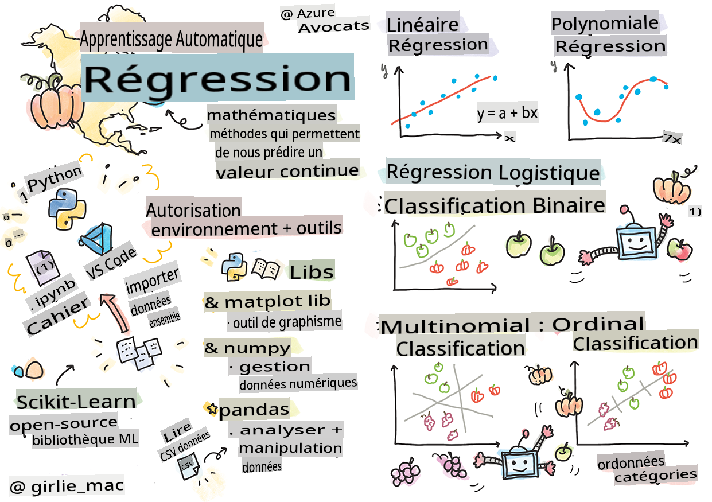
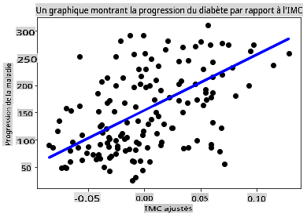

<!--
CO_OP_TRANSLATOR_METADATA:
{
  "original_hash": "6b1cb0e46d4c5b747eff6e3607642760",
  "translation_date": "2025-09-03T22:31:55+00:00",
  "source_file": "2-Regression/1-Tools/README.md",
  "language_code": "fr"
}
-->
# Commencez avec Python et Scikit-learn pour les modèles de régression



> Sketchnote par [Tomomi Imura](https://www.twitter.com/girlie_mac)

## [Quiz avant le cours](https://gray-sand-07a10f403.1.azurestaticapps.net/quiz/9/)

> ### [Cette leçon est disponible en R !](../../../../2-Regression/1-Tools/solution/R/lesson_1.html)

## Introduction

Dans ces quatre leçons, vous allez découvrir comment construire des modèles de régression. Nous discuterons bientôt de leur utilité. Mais avant de commencer, assurez-vous d'avoir les bons outils en place pour démarrer le processus !

Dans cette leçon, vous apprendrez à :

- Configurer votre ordinateur pour des tâches locales d'apprentissage automatique.
- Travailler avec les notebooks Jupyter.
- Utiliser Scikit-learn, y compris son installation.
- Explorer la régression linéaire avec un exercice pratique.

## Installations et configurations

[](https://youtu.be/-DfeD2k2Kj0 "ML pour débutants - Configurez vos outils pour créer des modèles d'apprentissage automatique")

> 🎥 Cliquez sur l'image ci-dessus pour une courte vidéo expliquant comment configurer votre ordinateur pour l'apprentissage automatique.

1. **Installez Python**. Assurez-vous que [Python](https://www.python.org/downloads/) est installé sur votre ordinateur. Vous utiliserez Python pour de nombreuses tâches de science des données et d'apprentissage automatique. La plupart des systèmes informatiques incluent déjà une installation de Python. Il existe également des [packs de codage Python](https://code.visualstudio.com/learn/educators/installers?WT.mc_id=academic-77952-leestott) utiles pour faciliter la configuration pour certains utilisateurs.

   Certaines utilisations de Python nécessitent une version spécifique du logiciel, tandis que d'autres en nécessitent une différente. Pour cette raison, il est utile de travailler dans un [environnement virtuel](https://docs.python.org/3/library/venv.html).

2. **Installez Visual Studio Code**. Assurez-vous que Visual Studio Code est installé sur votre ordinateur. Suivez ces instructions pour [installer Visual Studio Code](https://code.visualstudio.com/) pour une installation de base. Vous allez utiliser Python dans Visual Studio Code dans ce cours, donc il pourrait être utile de revoir comment [configurer Visual Studio Code](https://docs.microsoft.com/learn/modules/python-install-vscode?WT.mc_id=academic-77952-leestott) pour le développement Python.

   > Familiarisez-vous avec Python en parcourant cette collection de [modules d'apprentissage](https://docs.microsoft.com/users/jenlooper-2911/collections/mp1pagggd5qrq7?WT.mc_id=academic-77952-leestott)
   >
   > [](https://youtu.be/yyQM70vi7V8 "Configurez Python avec Visual Studio Code")
   >
   > 🎥 Cliquez sur l'image ci-dessus pour une vidéo : utiliser Python dans VS Code.

3. **Installez Scikit-learn**, en suivant [ces instructions](https://scikit-learn.org/stable/install.html). Étant donné que vous devez utiliser Python 3, il est recommandé d'utiliser un environnement virtuel. Notez que si vous installez cette bibliothèque sur un Mac M1, il existe des instructions spéciales sur la page liée ci-dessus.

4. **Installez Jupyter Notebook**. Vous devrez [installer le package Jupyter](https://pypi.org/project/jupyter/).

## Votre environnement de création ML

Vous allez utiliser des **notebooks** pour développer votre code Python et créer des modèles d'apprentissage automatique. Ce type de fichier est un outil courant pour les data scientists, et ils peuvent être identifiés par leur suffixe ou extension `.ipynb`.

Les notebooks sont un environnement interactif qui permet au développeur de coder, d'ajouter des notes et de rédiger de la documentation autour du code, ce qui est très utile pour des projets expérimentaux ou orientés recherche.

[](https://youtu.be/7E-jC8FLA2E "ML pour débutants - Configurez Jupyter Notebooks pour commencer à créer des modèles de régression")

> 🎥 Cliquez sur l'image ci-dessus pour une courte vidéo expliquant cet exercice.

### Exercice - travailler avec un notebook

Dans ce dossier, vous trouverez le fichier _notebook.ipynb_.

1. Ouvrez _notebook.ipynb_ dans Visual Studio Code.

   Un serveur Jupyter démarrera avec Python 3+. Vous trouverez des zones du notebook qui peuvent être `exécutées`, des morceaux de code. Vous pouvez exécuter un bloc de code en sélectionnant l'icône qui ressemble à un bouton de lecture.

2. Sélectionnez l'icône `md` et ajoutez un peu de markdown, ainsi que le texte suivant **# Bienvenue dans votre notebook**.

   Ensuite, ajoutez du code Python.

3. Tapez **print('hello notebook')** dans le bloc de code.
4. Sélectionnez la flèche pour exécuter le code.

   Vous devriez voir l'instruction imprimée :

    ```output
    hello notebook
    ```


Vous pouvez intercaler votre code avec des commentaires pour auto-documenter le notebook.

✅ Réfléchissez un instant à la différence entre l'environnement de travail d'un développeur web et celui d'un data scientist.

## Prise en main avec Scikit-learn

Maintenant que Python est configuré dans votre environnement local et que vous êtes à l'aise avec les notebooks Jupyter, familiarisons-nous avec Scikit-learn (prononcez-le `sci` comme dans `science`). Scikit-learn fournit une [API étendue](https://scikit-learn.org/stable/modules/classes.html#api-ref) pour vous aider à effectuer des tâches d'apprentissage automatique.

Selon leur [site web](https://scikit-learn.org/stable/getting_started.html), "Scikit-learn est une bibliothèque open source d'apprentissage automatique qui prend en charge l'apprentissage supervisé et non supervisé. Elle fournit également divers outils pour l'ajustement de modèles, le prétraitement des données, la sélection et l'évaluation de modèles, ainsi que de nombreuses autres utilités."

Dans ce cours, vous utiliserez Scikit-learn et d'autres outils pour construire des modèles d'apprentissage automatique afin d'effectuer ce que nous appelons des tâches d'apprentissage automatique "traditionnel". Nous avons délibérément évité les réseaux neuronaux et l'apprentissage profond, car ils sont mieux couverts dans notre prochain programme "IA pour débutants".

Scikit-learn simplifie la création de modèles et leur évaluation pour une utilisation. Il se concentre principalement sur l'utilisation de données numériques et contient plusieurs ensembles de données prêts à l'emploi pour servir d'outils d'apprentissage. Il inclut également des modèles préconstruits que les étudiants peuvent essayer. Explorons le processus de chargement de données préemballées et d'utilisation d'un estimateur pour créer un premier modèle ML avec Scikit-learn à l'aide de données de base.

## Exercice - votre premier notebook Scikit-learn

> Ce tutoriel a été inspiré par l'[exemple de régression linéaire](https://scikit-learn.org/stable/auto_examples/linear_model/plot_ols.html#sphx-glr-auto-examples-linear-model-plot-ols-py) sur le site web de Scikit-learn.

[](https://youtu.be/2xkXL5EUpS0 "ML pour débutants - Votre premier projet de régression linéaire en Python")

> 🎥 Cliquez sur l'image ci-dessus pour une courte vidéo expliquant cet exercice.

Dans le fichier _notebook.ipynb_ associé à cette leçon, videz toutes les cellules en appuyant sur l'icône de la "poubelle".

Dans cette section, vous allez travailler avec un petit ensemble de données sur le diabète intégré à Scikit-learn à des fins d'apprentissage. Imaginez que vous vouliez tester un traitement pour des patients diabétiques. Les modèles d'apprentissage automatique pourraient vous aider à déterminer quels patients répondraient mieux au traitement, en fonction de combinaisons de variables. Même un modèle de régression très basique, lorsqu'il est visualisé, pourrait fournir des informations sur les variables qui vous aideraient à organiser vos essais cliniques théoriques.

✅ Il existe de nombreux types de méthodes de régression, et le choix dépend de la réponse que vous recherchez. Si vous voulez prédire la taille probable d'une personne en fonction de son âge, vous utiliseriez la régression linéaire, car vous cherchez une **valeur numérique**. Si vous souhaitez déterminer si un type de cuisine doit être considéré comme végétalien ou non, vous cherchez une **catégorie** et utiliseriez la régression logistique. Vous en apprendrez davantage sur la régression logistique plus tard. Réfléchissez un peu à des questions que vous pourriez poser aux données, et à la méthode la plus appropriée.

Commençons cette tâche.

### Importer des bibliothèques

Pour cette tâche, nous allons importer quelques bibliothèques :

- **matplotlib**. C'est un [outil de graphisme](https://matplotlib.org/) utile que nous utiliserons pour créer un graphique linéaire.
- **numpy**. [numpy](https://numpy.org/doc/stable/user/whatisnumpy.html) est une bibliothèque utile pour manipuler des données numériques en Python.
- **sklearn**. C'est la bibliothèque [Scikit-learn](https://scikit-learn.org/stable/user_guide.html).

Importez quelques bibliothèques pour vous aider dans vos tâches.

1. Ajoutez les imports en tapant le code suivant :

   ```python
   import matplotlib.pyplot as plt
   import numpy as np
   from sklearn import datasets, linear_model, model_selection
   ```

   Ci-dessus, vous importez `matplotlib`, `numpy` et vous importez `datasets`, `linear_model` et `model_selection` de `sklearn`. `model_selection` est utilisé pour diviser les données en ensembles d'entraînement et de test.

### L'ensemble de données sur le diabète

L'[ensemble de données sur le diabète](https://scikit-learn.org/stable/datasets/toy_dataset.html#diabetes-dataset) intégré comprend 442 échantillons de données sur le diabète, avec 10 variables de caractéristiques, dont certaines incluent :

- age : âge en années
- bmi : indice de masse corporelle
- bp : pression artérielle moyenne
- s1 tc : cellules T (un type de globules blancs)

✅ Cet ensemble de données inclut le concept de "sexe" comme variable de caractéristique importante pour la recherche sur le diabète. De nombreux ensembles de données médicaux incluent ce type de classification binaire. Réfléchissez un peu à la manière dont de telles catégorisations pourraient exclure certaines parties de la population des traitements.

Chargez maintenant les données X et y.

> 🎓 Rappelez-vous, il s'agit d'apprentissage supervisé, et nous avons besoin d'une cible nommée 'y'.

Dans une nouvelle cellule de code, chargez l'ensemble de données sur le diabète en appelant `load_diabetes()`. L'entrée `return_X_y=True` indique que `X` sera une matrice de données, et `y` sera la cible de régression.

1. Ajoutez des commandes print pour afficher la forme de la matrice de données et son premier élément :

    ```python
    X, y = datasets.load_diabetes(return_X_y=True)
    print(X.shape)
    print(X[0])
    ```

    Ce que vous obtenez en réponse est un tuple. Ce que vous faites est d'attribuer les deux premières valeurs du tuple à `X` et `y` respectivement. Apprenez-en davantage [sur les tuples](https://wikipedia.org/wiki/Tuple).

    Vous pouvez voir que ces données contiennent 442 éléments organisés en tableaux de 10 éléments :

    ```text
    (442, 10)
    [ 0.03807591  0.05068012  0.06169621  0.02187235 -0.0442235  -0.03482076
    -0.04340085 -0.00259226  0.01990842 -0.01764613]
    ```

    ✅ Réfléchissez un peu à la relation entre les données et la cible de régression. La régression linéaire prédit les relations entre la caractéristique X et la variable cible y. Pouvez-vous trouver la [cible](https://scikit-learn.org/stable/datasets/toy_dataset.html#diabetes-dataset) pour l'ensemble de données sur le diabète dans la documentation ? Que démontre cet ensemble de données, étant donné la cible ?

2. Ensuite, sélectionnez une partie de cet ensemble de données à tracer en sélectionnant la 3ème colonne de l'ensemble de données. Vous pouvez le faire en utilisant l'opérateur `:` pour sélectionner toutes les lignes, puis en sélectionnant la 3ème colonne à l'aide de l'index (2). Vous pouvez également remodeler les données pour qu'elles soient un tableau 2D - comme requis pour le tracé - en utilisant `reshape(n_rows, n_columns)`. Si l'un des paramètres est -1, la dimension correspondante est calculée automatiquement.

   ```python
   X = X[:, 2]
   X = X.reshape((-1,1))
   ```

   ✅ À tout moment, imprimez les données pour vérifier leur forme.

3. Maintenant que vous avez des données prêtes à être tracées, vous pouvez voir si une machine peut aider à déterminer une séparation logique entre les nombres dans cet ensemble de données. Pour ce faire, vous devez diviser à la fois les données (X) et la cible (y) en ensembles de test et d'entraînement. Scikit-learn propose une méthode simple pour cela ; vous pouvez diviser vos données de test à un point donné.

   ```python
   X_train, X_test, y_train, y_test = model_selection.train_test_split(X, y, test_size=0.33)
   ```

4. Vous êtes maintenant prêt à entraîner votre modèle ! Chargez le modèle de régression linéaire et entraînez-le avec vos ensembles d'entraînement X et y en utilisant `model.fit()` :

    ```python
    model = linear_model.LinearRegression()
    model.fit(X_train, y_train)
    ```

    ✅ `model.fit()` est une fonction que vous verrez dans de nombreuses bibliothèques ML comme TensorFlow.

5. Ensuite, créez une prédiction en utilisant les données de test, avec la fonction `predict()`. Cela sera utilisé pour tracer la ligne entre les groupes de données.

    ```python
    y_pred = model.predict(X_test)
    ```

6. Il est maintenant temps de montrer les données dans un graphique. Matplotlib est un outil très utile pour cette tâche. Créez un nuage de points de toutes les données de test X et y, et utilisez la prédiction pour tracer une ligne à l'endroit le plus approprié, entre les regroupements de données du modèle.

    ```python
    plt.scatter(X_test, y_test,  color='black')
    plt.plot(X_test, y_pred, color='blue', linewidth=3)
    plt.xlabel('Scaled BMIs')
    plt.ylabel('Disease Progression')
    plt.title('A Graph Plot Showing Diabetes Progression Against BMI')
    plt.show()
    ```

   
✅ Réfléchissez un peu à ce qui se passe ici. Une ligne droite traverse de nombreux petits points de données, mais que fait-elle exactement ? Pouvez-vous voir comment cette ligne pourrait vous permettre de prédire où un nouveau point de données, encore inconnu, devrait se situer par rapport à l'axe y du graphique ? Essayez de mettre en mots l'utilité pratique de ce modèle.

Félicitations, vous avez construit votre premier modèle de régression linéaire, créé une prédiction avec celui-ci, et l'avez affichée dans un graphique !

---
## 🚀Défi

Tracez une autre variable de ce jeu de données. Indice : modifiez cette ligne : `X = X[:,2]`. Étant donné la cible de ce jeu de données, que pouvez-vous découvrir sur la progression du diabète en tant que maladie ?
## [Quiz après la leçon](https://gray-sand-07a10f403.1.azurestaticapps.net/quiz/10/)

## Révision & Étude personnelle

Dans ce tutoriel, vous avez travaillé avec une régression linéaire simple, plutôt qu'une régression univariée ou multiple. Lisez un peu sur les différences entre ces méthodes, ou regardez [cette vidéo](https://www.coursera.org/lecture/quantifying-relationships-regression-models/linear-vs-nonlinear-categorical-variables-ai2Ef).

Lisez davantage sur le concept de régression et réfléchissez aux types de questions qui peuvent être résolues grâce à cette technique. Suivez [ce tutoriel](https://docs.microsoft.com/learn/modules/train-evaluate-regression-models?WT.mc_id=academic-77952-leestott) pour approfondir votre compréhension.

## Devoir

[Un autre jeu de données](assignment.md)

---

**Avertissement** :  
Ce document a été traduit à l'aide du service de traduction automatique [Co-op Translator](https://github.com/Azure/co-op-translator). Bien que nous nous efforcions d'assurer l'exactitude, veuillez noter que les traductions automatisées peuvent contenir des erreurs ou des inexactitudes. Le document original dans sa langue d'origine doit être considéré comme la source faisant autorité. Pour des informations critiques, il est recommandé de recourir à une traduction professionnelle réalisée par un humain. Nous déclinons toute responsabilité en cas de malentendus ou d'interprétations erronées résultant de l'utilisation de cette traduction.