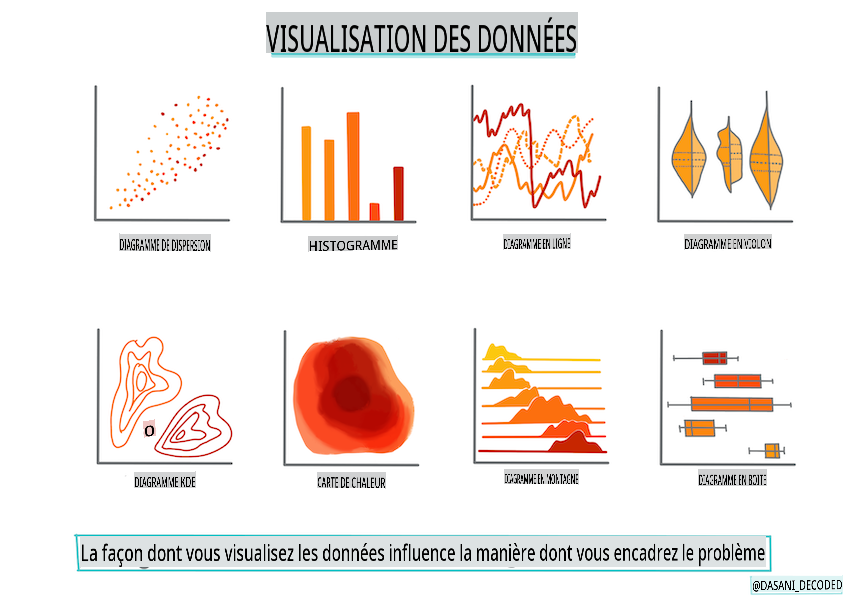

# Construire un modèle de régression avec Scikit-learn : préparer et visualiser les données



Infographie par [Dasani Madipalli](https://twitter.com/dasani_decoded)

## [Quiz pré-cours](https://gray-sand-07a10f403.1.azurestaticapps.net/quiz/11/)

> ### [Cette leçon est disponible en R !](../../../../2-Regression/2-Data/solution/R/lesson_2.html)

## Introduction

Maintenant que vous êtes équipé des outils nécessaires pour commencer à aborder la construction de modèles d'apprentissage automatique avec Scikit-learn, vous êtes prêt à commencer à poser des questions sur vos données. En travaillant avec des données et en appliquant des solutions ML, il est très important de comprendre comment poser la bonne question pour exploiter pleinement le potentiel de votre ensemble de données.

Dans cette leçon, vous apprendrez :

- Comment préparer vos données pour la construction de modèles.
- Comment utiliser Matplotlib pour la visualisation des données.

## Poser la bonne question à vos données

La question à laquelle vous devez répondre déterminera quel type d'algorithmes ML vous allez utiliser. Et la qualité de la réponse que vous obtiendrez dépendra fortement de la nature de vos données.

Jetez un œil aux [données](https://github.com/microsoft/ML-For-Beginners/blob/main/2-Regression/data/US-pumpkins.csv) fournies pour cette leçon. Vous pouvez ouvrir ce fichier .csv dans VS Code. Une rapide inspection montre immédiatement qu'il y a des blancs et un mélange de chaînes et de données numériques. Il y a aussi une colonne étrange appelée 'Package' où les données sont un mélange entre 'sacs', 'bacs' et d'autres valeurs. Les données, en fait, sont un peu en désordre.

[](https://youtu.be/5qGjczWTrDQ "ML pour les débutants - Comment analyser et nettoyer un ensemble de données")

> 🎥 Cliquez sur l'image ci-dessus pour une courte vidéo montrant comment préparer les données pour cette leçon.

En fait, il n'est pas très courant de recevoir un ensemble de données complètement prêt à être utilisé pour créer un modèle ML. Dans cette leçon, vous apprendrez comment préparer un ensemble de données brut en utilisant des bibliothèques Python standard. Vous apprendrez également diverses techniques pour visualiser les données.

## Étude de cas : 'le marché de la citrouille'

Dans ce dossier, vous trouverez un fichier .csv dans le dossier racine `data` appelé [US-pumpkins.csv](https://github.com/microsoft/ML-For-Beginners/blob/main/2-Regression/data/US-pumpkins.csv) qui comprend 1757 lignes de données sur le marché des citrouilles, triées par ville. Il s'agit de données brutes extraites des [Rapports standards des marchés des cultures spécialisées](https://www.marketnews.usda.gov/mnp/fv-report-config-step1?type=termPrice) distribués par le Département de l'Agriculture des États-Unis.

### Préparation des données

Ces données sont dans le domaine public. Elles peuvent être téléchargées dans de nombreux fichiers séparés, par ville, depuis le site web de l'USDA. Pour éviter trop de fichiers séparés, nous avons concaténé toutes les données des villes en une seule feuille de calcul, ainsi nous avons déjà _préparé_ un peu les données. Ensuite, examinons de plus près les données.

### Les données sur les citrouilles - premières conclusions

Que remarquez-vous à propos de ces données ? Vous avez déjà vu qu'il y a un mélange de chaînes, de nombres, de blancs et de valeurs étranges que vous devez comprendre.

Quelle question pouvez-vous poser à ces données, en utilisant une technique de régression ? Que diriez-vous de "Prédire le prix d'une citrouille à vendre durant un mois donné". En regardant à nouveau les données, il y a quelques modifications que vous devez apporter pour créer la structure de données nécessaire à la tâche.

## Exercice - analyser les données sur les citrouilles

Utilisons [Pandas](https://pandas.pydata.org/), (le nom signifie `Python Data Analysis`) un outil très utile pour façonner les données, pour analyser et préparer ces données sur les citrouilles.

### D'abord, vérifiez les dates manquantes

Vous devrez d'abord prendre des mesures pour vérifier les dates manquantes :

1. Convertir les dates au format mois (ce sont des dates américaines, donc le format est `MM/DD/YYYY`).
2. Extraire le mois dans une nouvelle colonne.

Ouvrez le fichier _notebook.ipynb_ dans Visual Studio Code et importez la feuille de calcul dans un nouveau dataframe Pandas.

1. Utilisez la fonction `head()` pour afficher les cinq premières lignes.

    ```python
    import pandas as pd
    pumpkins = pd.read_csv('../data/US-pumpkins.csv')
    pumpkins.head()
    ```

    ✅ Quelle fonction utiliseriez-vous pour afficher les cinq dernières lignes ?

1. Vérifiez s'il y a des données manquantes dans le dataframe actuel :

    ```python
    pumpkins.isnull().sum()
    ```

    Il y a des données manquantes, mais peut-être que cela n'aura pas d'importance pour la tâche à accomplir.

1. Pour faciliter le travail avec votre dataframe, sélectionnez uniquement les colonnes dont vous avez besoin, en utilisant `loc` function which extracts from the original dataframe a group of rows (passed as first parameter) and columns (passed as second parameter). The expression `:` dans le cas ci-dessous signifie "toutes les lignes".

    ```python
    columns_to_select = ['Package', 'Low Price', 'High Price', 'Date']
    pumpkins = pumpkins.loc[:, columns_to_select]
    ```

### Ensuite, déterminez le prix moyen de la citrouille

Réfléchissez à la façon de déterminer le prix moyen d'une citrouille dans un mois donné. Quelles colonnes choisiriez-vous pour cette tâche ? Indice : vous aurez besoin de 3 colonnes.

Solution : prenez la moyenne des colonnes `Low Price` and `High Price` pour remplir la nouvelle colonne Price, et convertissez la colonne Date pour n'afficher que le mois. Heureusement, selon la vérification ci-dessus, il n'y a pas de données manquantes pour les dates ou les prix.

1. Pour calculer la moyenne, ajoutez le code suivant :

    ```python
    price = (pumpkins['Low Price'] + pumpkins['High Price']) / 2

    month = pd.DatetimeIndex(pumpkins['Date']).month

    ```

   ✅ N'hésitez pas à imprimer toutes les données que vous aimeriez vérifier en utilisant `print(month)`.

2. Maintenant, copiez vos données converties dans un nouveau dataframe Pandas :

    ```python
    new_pumpkins = pd.DataFrame({'Month': month, 'Package': pumpkins['Package'], 'Low Price': pumpkins['Low Price'],'High Price': pumpkins['High Price'], 'Price': price})
    ```

    L'impression de votre dataframe vous montrera un ensemble de données propre et bien rangé sur lequel vous pouvez construire votre nouveau modèle de régression.

### Mais attendez ! Il y a quelque chose d'étrange ici

Si vous regardez la colonne `Package` column, pumpkins are sold in many different configurations. Some are sold in '1 1/9 bushel' measures, and some in '1/2 bushel' measures, some per pumpkin, some per pound, and some in big boxes with varying widths.

> Pumpkins seem very hard to weigh consistently

Digging into the original data, it's interesting that anything with `Unit of Sale` equalling 'EACH' or 'PER BIN' also have the `Package` type per inch, per bin, or 'each'. Pumpkins seem to be very hard to weigh consistently, so let's filter them by selecting only pumpkins with the string 'bushel' in their `Package`.

1. Ajoutez un filtre en haut du fichier, sous l'importation initiale du .csv :

    ```python
    pumpkins = pumpkins[pumpkins['Package'].str.contains('bushel', case=True, regex=True)]
    ```

    Si vous imprimez les données maintenant, vous pouvez voir que vous ne recevez que les 415 lignes de données contenant des citrouilles par le boisseau.

### Mais attendez ! Il y a encore une chose à faire

Avez-vous remarqué que la quantité par boisseau varie par ligne ? Vous devez normaliser les prix afin de montrer le prix par boisseau, donc faites quelques calculs pour le standardiser.

1. Ajoutez ces lignes après le bloc créant le nouveau dataframe new_pumpkins :

    ```python
    new_pumpkins.loc[new_pumpkins['Package'].str.contains('1 1/9'), 'Price'] = price/(1 + 1/9)

    new_pumpkins.loc[new_pumpkins['Package'].str.contains('1/2'), 'Price'] = price/(1/2)
    ```

✅ Selon [The Spruce Eats](https://www.thespruceeats.com/how-much-is-a-bushel-1389308), le poids d'un boisseau dépend du type de produit, car c'est une mesure de volume. "Un boisseau de tomates, par exemple, est censé peser 56 livres... Les feuilles et les légumes prennent plus de place avec moins de poids, donc un boisseau d'épinards ne pèse que 20 livres." C'est assez compliqué ! Ne nous embêtons pas à faire une conversion boisseau-livre, et plutôt à établir les prix par boisseau. Toute cette étude des boisseaux de citrouilles montre cependant à quel point il est très important de comprendre la nature de vos données !

Maintenant, vous pouvez analyser le prix par unité en fonction de leur mesure par boisseau. Si vous imprimez à nouveau les données, vous pouvez voir comment elles sont normalisées.

✅ Avez-vous remarqué que les citrouilles vendues par demi-boisseau sont très chères ? Pouvez-vous deviner pourquoi ? Indice : les petites citrouilles sont beaucoup plus chères que les grosses, probablement parce qu'il y en a beaucoup plus par boisseau, compte tenu de l'espace inutilisé pris par une grosse citrouille creuse.

## Stratégies de visualisation

Une partie du rôle du data scientist est de démontrer la qualité et la nature des données avec lesquelles ils travaillent. Pour ce faire, ils créent souvent des visualisations intéressantes, ou des graphiques, des diagrammes et des tableaux, montrant différents aspects des données. De cette manière, ils peuvent montrer visuellement des relations et des lacunes qui seraient autrement difficiles à découvrir.

[](https://youtu.be/SbUkxH6IJo0 "ML pour les débutants - Comment visualiser des données avec Matplotlib")

> 🎥 Cliquez sur l'image ci-dessus pour une courte vidéo montrant comment visualiser les données pour cette leçon.

Les visualisations peuvent également aider à déterminer la technique d'apprentissage automatique la plus appropriée pour les données. Un nuage de points qui semble suivre une ligne, par exemple, indique que les données sont un bon candidat pour un exercice de régression linéaire.

Une bibliothèque de visualisation de données qui fonctionne bien dans les notebooks Jupyter est [Matplotlib](https://matplotlib.org/) (que vous avez également vue dans la leçon précédente).

> Obtenez plus d'expérience avec la visualisation des données dans [ces tutoriels](https://docs.microsoft.com/learn/modules/explore-analyze-data-with-python?WT.mc_id=academic-77952-leestott).

## Exercice - expérimenter avec Matplotlib

Essayez de créer quelques graphiques de base pour afficher le nouveau dataframe que vous venez de créer. Que montrerait un graphique linéaire de base ?

1. Importez Matplotlib en haut du fichier, sous l'importation de Pandas :

    ```python
    import matplotlib.pyplot as plt
    ```

1. Relancez l'ensemble du notebook pour le rafraîchir.
1. En bas du notebook, ajoutez une cellule pour tracer les données sous forme de boîte :

    ```python
    price = new_pumpkins.Price
    month = new_pumpkins.Month
    plt.scatter(price, month)
    plt.show()
    ```

    

    Ce graphique est-il utile ? Y a-t-il quelque chose qui vous surprend ?

    Ce n'est pas particulièrement utile car tout ce qu'il fait est d'afficher vos données sous forme de dispersion de points dans un mois donné.

### Rendez-le utile

Pour que les graphiques affichent des données utiles, vous devez généralement regrouper les données d'une manière ou d'une autre. Essayons de créer un graphique où l'axe y montre les mois et les données démontrent la distribution des données.

1. Ajoutez une cellule pour créer un graphique à barres groupées :

    ```python
    new_pumpkins.groupby(['Month'])['Price'].mean().plot(kind='bar')
    plt.ylabel("Pumpkin Price")
    ```

    

    C'est une visualisation de données plus utile ! Il semble indiquer que le prix le plus élevé des citrouilles se produit en septembre et octobre. Cela correspond-il à vos attentes ? Pourquoi ou pourquoi pas ?

---

## 🚀Défi

Explorez les différents types de visualisation que Matplotlib propose. Quels types sont les plus appropriés pour les problèmes de régression ?

## [Quiz post-cours](https://gray-sand-07a10f403.1.azurestaticapps.net/quiz/12/)

## Revue et auto-apprentissage

Examinez les nombreuses façons de visualiser les données. Faites une liste des différentes bibliothèques disponibles et notez lesquelles sont les meilleures pour certains types de tâches, par exemple les visualisations 2D contre les visualisations 3D. Qu'est-ce que vous découvrez ?

## Devoir

[Explorer la visualisation](assignment.md)

**Avertissement** :  
Ce document a été traduit à l'aide de services de traduction automatique basés sur l'IA. Bien que nous nous efforçons d'assurer l'exactitude, veuillez noter que les traductions automatiques peuvent contenir des erreurs ou des inexactitudes. Le document original dans sa langue native doit être considéré comme la source faisant autorité. Pour des informations critiques, une traduction humaine professionnelle est recommandée. Nous ne sommes pas responsables des malentendus ou des interprétations erronées résultant de l'utilisation de cette traduction.