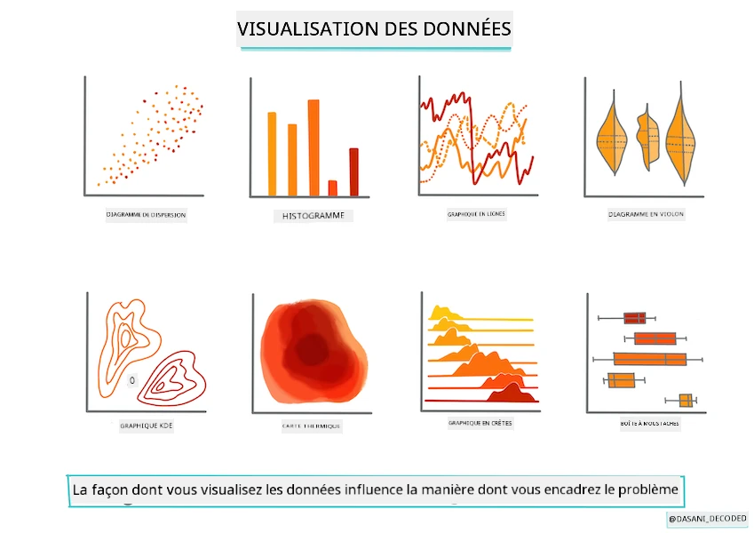
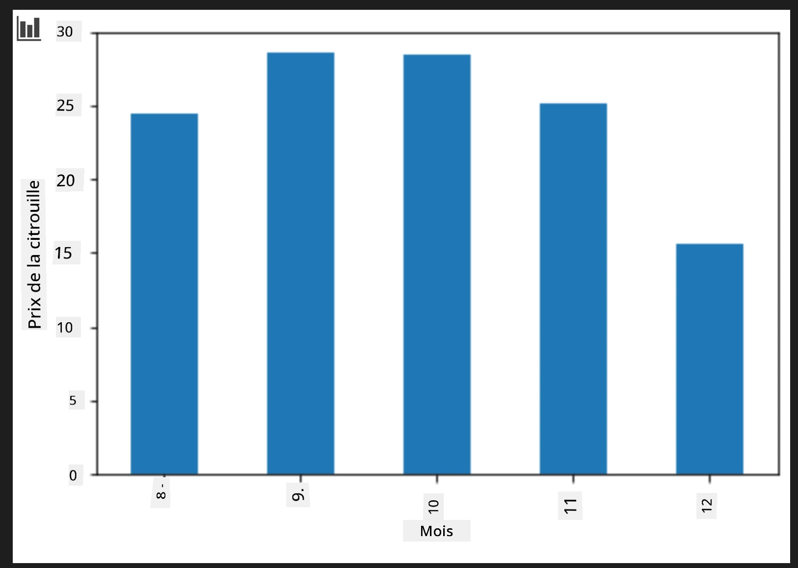
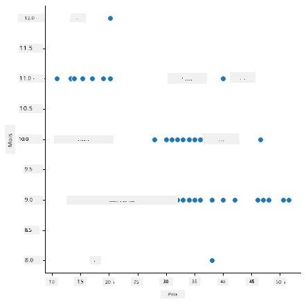
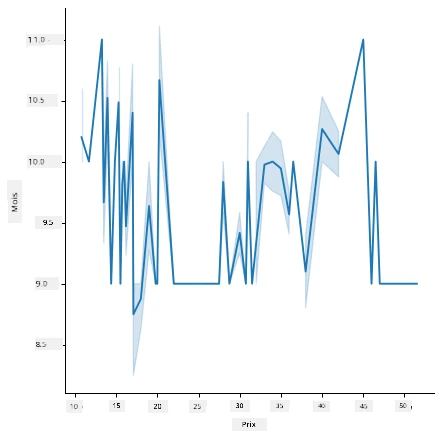
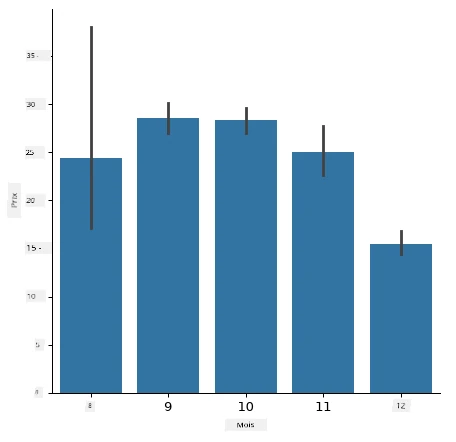
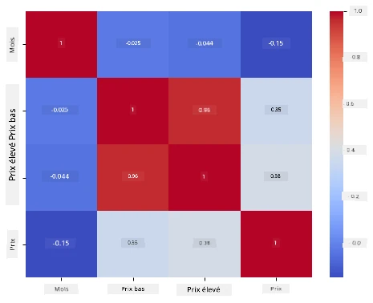

# Construire un modèle de régression avec Scikit-learn : préparer et visualiser les données



Infographie par [Dasani Madipalli](https://twitter.com/dasani_decoded)

## [Quiz avant la leçon](https://ff-quizzes.netlify.app/en/ml/)

> ### [Cette leçon est disponible en R !](../../../../2-Regression/2-Data/solution/R/lesson_2.html)

## Introduction

Maintenant que vous avez configuré les outils dont vous avez besoin pour commencer à construire des modèles d'apprentissage automatique avec Scikit-learn, vous êtes prêt à commencer à poser des questions sur vos données. Lorsqu'on travaille avec des données et qu'on applique des solutions ML, il est très important de savoir poser la bonne question pour bien exploiter le potentiel de votre jeu de données.

Dans cette leçon, vous apprendrez :

- Comment préparer vos données pour la construction de modèle.
- Comment utiliser Matplotlib pour la visualisation de données.
- Comment utiliser Seaborn pour une visualisation des données plus expressive.

## Poser la bonne question à vos données

La question à laquelle vous avez besoin de répondre déterminera le type d'algorithmes ML que vous utiliserez. Et la qualité de la réponse dépendra fortement de la nature de vos données.

Jetez un œil aux [données](https://github.com/microsoft/ML-For-Beginners/blob/main/2-Regression/data/US-pumpkins.csv) fournies pour cette leçon. Vous pouvez ouvrir ce fichier .csv dans VS Code. Un coup d'œil rapide montre immédiatement qu'il y a des blancs et un mélange de chaînes et de données numériques. Il y a aussi une colonne étrange appelée 'Package' où les données sont un mélange entre 'sacs', 'bacs' et d'autres valeurs. Les données, en fait, sont un peu désordonnées.

[](https://youtu.be/5qGjczWTrDQ "ML pour débutants - Comment analyser et nettoyer un jeu de données")

> 🎥 Cliquez sur l'image ci-dessus pour une courte vidéo expliquant la préparation des données pour cette leçon.

En fait, il est rare qu'on vous donne un jeu de données prêt à l'emploi pour créer un modèle ML directement. Dans cette leçon, vous apprendrez comment préparer un jeu de données brut en utilisant des bibliothèques Python standards. Vous apprendrez également différentes techniques pour visualiser les données.

## Étude de cas : 'le marché de la citrouille'

Dans ce dossier, vous trouverez un fichier .csv dans le dossier racine `data` appelé [US-pumpkins.csv](https://github.com/microsoft/ML-For-Beginners/blob/main/2-Regression/data/US-pumpkins.csv) qui comprend 1757 lignes de données sur le marché des citrouilles, triées par ville. Il s’agit de données brutes extraites des [Specialty Crops Terminal Markets Standard Reports](https://www.marketnews.usda.gov/mnp/fv-report-config-step1?type=termPrice) distribués par le Département de l'Agriculture des États-Unis.

### Préparation des données

Ces données sont dans le domaine public. Elles peuvent être téléchargées dans de nombreux fichiers séparés, par ville, sur le site web de l'USDA. Pour éviter trop de fichiers distincts, nous avons concaténé toutes les données des villes en une seule feuille de calcul, ainsi nous avons déjà un peu _préparé_ les données. Ensuite, examinons de plus près les données.

### Les données de la citrouille - premières conclusions

Que remarquez-vous à propos de ces données ? Vous avez déjà vu qu'il y a un mélange de chaînes, de nombres, de blancs et de valeurs étranges dont vous devez comprendre la signification.

Quelle question pouvez-vous poser à ces données, en utilisant une technique de régression ? Que diriez-vous de "Prédire le prix d'une citrouille à la vente durant un mois donné". En regardant de nouveau les données, il y a quelques modifications à apporter pour créer la structure de données nécessaire à cette tâche.
## Exercice - analyser les données de la citrouille

Utilisons [Pandas](https://pandas.pydata.org/) (le nom signifie `Python Data Analysis`), un outil très utile pour structurer les données, afin d'analyser et de préparer ces données de citrouille.

### D'abord, vérifier les dates manquantes

Vous devez d'abord prendre des mesures pour vérifier les dates manquantes :

1. Convertir les dates au format mois (ce sont des dates américaines, donc le format est `MM/DD/YYYY`).
2. Extraire le mois dans une nouvelle colonne.

Ouvrez le fichier _notebook.ipynb_ dans Visual Studio Code et importez la feuille de calcul dans un nouveau dataframe Pandas.

1. Utilisez la fonction `head()` pour voir les cinq premières lignes.

    ```python
    import pandas as pd
    pumpkins = pd.read_csv('../data/US-pumpkins.csv')
    pumpkins.head()
    ```

    ✅ Quelle fonction utiliseriez-vous pour voir les cinq dernières lignes ?

1. Vérifiez s'il y a des données manquantes dans le dataframe actuel :

    ```python
    pumpkins.isnull().sum()
    ```

    Il y a des données manquantes, mais peut-être que cela ne posera pas de problème pour la tâche.

1. Pour rendre votre dataframe plus facile à manipuler, sélectionnez uniquement les colonnes nécessaires, en utilisant la fonction `loc` qui extrait du dataframe original un groupe de lignes (passées en premier paramètre) et de colonnes (passées en second paramètre). L'expression `:` signifie "toutes les lignes" dans ce cas.

    ```python
    columns_to_select = ['Package', 'Low Price', 'High Price', 'Date']
    pumpkins = pumpkins.loc[:, columns_to_select]
    ```

### Secondement, déterminer le prix moyen de la citrouille

Réfléchissez à la manière de déterminer le prix moyen d'une citrouille pour un mois donné. Quelles colonnes choisiriez-vous pour cette tâche ? Indice : vous aurez besoin de 3 colonnes.

Solution : prenez la moyenne des colonnes `Low Price` et `High Price` pour remplir la nouvelle colonne Prix, et convertissez la colonne Date pour n'afficher que le mois. Heureusement, selon la vérification ci-dessus, il n'y a pas de données manquantes pour les dates ou les prix.

1. Pour calculer la moyenne, ajoutez le code suivant :

    ```python
    price = (pumpkins['Low Price'] + pumpkins['High Price']) / 2

    month = pd.DatetimeIndex(pumpkins['Date']).month

    ```

   ✅ N'hésitez pas à afficher les données avec `print(month)` pour vérifier.

2. Maintenant, copiez vos données converties dans un nouveau dataframe Pandas :

    ```python
    new_pumpkins = pd.DataFrame({'Month': month, 'Package': pumpkins['Package'], 'Low Price': pumpkins['Low Price'],'High Price': pumpkins['High Price'], 'Price': price})
    ```

    Afficher votre dataframe vous montrera un jeu de données propre et rangé sur lequel vous pouvez construire votre nouveau modèle de régression.

### Mais attendez ! Il y a quelque chose d'étrange ici

Si vous regardez la colonne `Package`, les citrouilles sont vendues sous différentes configurations. Certaines sont vendues en mesures '1 1/9 boisseau', d'autres en '1/2 boisseau', certaines à l'unité, d'autres à la livre, et certaines dans de grosses boîtes de largeur variable.

> Les citrouilles semblent très difficiles à peser de manière uniforme

En creusant les données initiales, il est intéressant de noter que tout ce qui a `Unit of Sale` égale à 'EACH' ou 'PER BIN' possède aussi un type `Package` par pouce, par bac, ou 'chacun'. Les citrouilles semblent très difficiles à peser de façon cohérente, donc filtrons-les en sélectionnant uniquement celles avec la chaîne 'bushel' dans leur colonne `Package`.

1. Ajoutez un filtre en haut du fichier, sous l'import initial du fichier .csv :

    ```python
    pumpkins = pumpkins[pumpkins['Package'].str.contains('bushel', case=True, regex=True)]
    ```

    Si vous affichez les données maintenant, vous verrez que vous ne récupérez que les 415 lignes environ contenant des citrouilles vendues au boisseau.

### Mais attendez ! Il y a encore une chose à faire

Avez-vous remarqué que la quantité par boisseau varie selon la ligne ? Vous devez normaliser les prix afin d'afficher le prix par boisseau, donc faites quelques calculs pour l'uniformiser.

1. Ajoutez ces lignes après le bloc de création du dataframe new_pumpkins :

    ```python
    new_pumpkins.loc[new_pumpkins['Package'].str.contains('1 1/9'), 'Price'] = price/(1 + 1/9)

    new_pumpkins.loc[new_pumpkins['Package'].str.contains('1/2'), 'Price'] = price/(1/2)
    ```

✅ Selon [The Spruce Eats](https://www.thespruceeats.com/how-much-is-a-bushel-1389308), le poids d'un boisseau dépend du type de produit, car c'est une mesure de volume. « Un boisseau de tomates, par exemple, est censé peser 56 livres... Les feuilles et les verdure occupent plus d'espace avec moins de poids, donc un boisseau d'épinards ne fait que 20 livres. » C'est assez compliqué ! Ne nous embêtons pas avec la conversion boisseau-livre, mais tarifons plutôt à l'unité de boisseau. Toute cette étude des boisseaux de citrouilles montre cependant combien il est important de comprendre la nature de vos données !

Vous pouvez maintenant analyser les prix par unité selon leur mesure en boisseaux. Si vous affichez les données une nouvelle fois, vous verrez comment elles sont standardisées.

✅ Avez-vous remarqué que les citrouilles vendues par demi-boisseau sont très chères ? Pouvez-vous deviner pourquoi ? Indice : les petites citrouilles sont bien plus chères que les grosses, probablement parce qu'il y en a beaucoup plus par boisseau, compte tenu de l'espace inutilisé pris par une grosse citrouille creuse pour tarte.

## Stratégies de visualisation

Une partie du rôle du data scientist est de démontrer la qualité et la nature des données avec lesquelles il travaille. Pour ce faire, ils créent souvent des visualisations intéressantes, ou des graphiques, diagrammes et tableaux, montrant différents aspects des données. De cette façon, ils peuvent montrer visuellement des relations et des lacunes difficiles à découvrir autrement.

[](https://youtu.be/SbUkxH6IJo0 "ML pour débutants - Comment visualiser les données avec Matplotlib")

> 🎥 Cliquez sur l'image ci-dessus pour une courte vidéo expliquant la visualisation des données de cette leçon.

Les visualisations peuvent aussi aider à déterminer la technique d'apprentissage machine la plus appropriée aux données. Un graphique de dispersion qui semble suivre une ligne, par exemple, indique que les données sont de bons candidats pour un exercice de régression linéaire.

Une bibliothèque de visualisation de données qui fonctionne bien dans les notebooks Jupyter est [Matplotlib](https://matplotlib.org/) (que vous avez également vue dans la leçon précédente).

> Obtenez plus d'expérience avec la visualisation des données dans [ces tutoriels](https://docs.microsoft.com/learn/modules/explore-analyze-data-with-python?WT.mc_id=academic-77952-leestott).

## Exercice - expérimentez avec Matplotlib

Essayez de créer des graphiques de base pour afficher le nouveau dataframe que vous venez de créer. Que montrerait un graphique linéaire de base ?

1. Importez Matplotlib en haut du fichier, sous l'import de Pandas :

    ```python
    import matplotlib.pyplot as plt
    ```

1. Relancez l'intégralité du notebook pour le rafraîchir.
1. En bas du notebook, ajoutez une cellule pour tracer les données sous forme de boîte :

    ```python
    price = new_pumpkins.Price
    month = new_pumpkins.Month
    plt.scatter(price, month)
    plt.show()
    ```

    

    Est-ce un graphique utile ? Y a-t-il quelque chose qui vous surprend ?

    Ce n’est pas particulièrement utile car tout ce qu’il fait est d’afficher vos données étalées en une série de points pour un mois donné.

### Rendez-le utile

Pour que les graphiques affichent des données utiles, vous devez généralement grouper les données d'une manière ou d'une autre. Essayons de créer un graphique où l’axe y montre les mois et les données illustrent la distribution.

1. Ajoutez une cellule pour créer un histogramme groupé :

    ```python
    new_pumpkins.groupby(['Month'])['Price'].mean().plot(kind='bar')
    plt.ylabel("Pumpkin Price")
    ```

    

    C’est une visualisation de données bien plus utile ! Elle semble indiquer que le prix le plus élevé pour les citrouilles a lieu en septembre et en octobre. Est-ce conforme à vos attentes ? Pourquoi ou pourquoi pas ?

## Exercice - expérimentez avec Seaborn

Matplotlib est puissant, mais il peut nécessiter beaucoup de code pour produire un graphique soigné. [Seaborn](https://seaborn.pydata.org/) est une bibliothèque construite _au-dessus de_ Matplotlib qui est conçue pour la visualisation statistique des données. Elle fonctionne directement avec les dataframes Pandas, applique des styles attractifs par défaut, et vous permet de créer des graphiques informatifs avec beaucoup moins de code. Parce que Seaborn retourne des objets Matplotlib, vous pouvez toujours utiliser tout ce que vous savez déjà sur Matplotlib pour affiner le résultat.

> Si vous n’avez pas encore Seaborn installé, installez-le avec `pip install seaborn`.

1. Importez Seaborn en haut du notebook, sous les autres imports. Par convention, il est importé sous le nom `sns` :

    ```python
    import seaborn as sns
    ```

### Graphiques de dispersion pour montrer les relations

Une grande partie de l’exploration des données avant de construire un modèle consiste à rechercher des _relations_ entre les variables. Un [nuage de points](https://en.wikipedia.org/wiki/Scatter_plot) est l’un des meilleurs outils pour cela : si les points semblent suivre une ligne, il se peut que les deux variables soient corrélées, ce qui est un bon signe qu’un modèle de régression linéaire pourrait fonctionner.

1. Reproduisez le graphique de dispersion prix-mois vu plus tôt, cette fois en utilisant [`relplot()`](https://seaborn.pydata.org/generated/seaborn.relplot.html) de Seaborn (graphique relationnel), qui travaille directement avec les colonnes de votre dataframe :

    ```python
    sns.relplot(x="Price", y="Month", data=new_pumpkins)
    ```

    

    Remarquez comment vous passez les _noms des colonnes_ et le dataframe, et Seaborn s'occupe des étiquettes des axes pour vous.

2. Vous pouvez passer à un graphique linéaire en passant `kind="line"`. Seaborn trace même une bande ombrée montrant l'intervalle de confiance autour de la ligne :

    ```python
    sns.relplot(x="Price", y="Month", kind="line", data=new_pumpkins)
    ```

    

    Ces données sont assez bruyantes, donc un graphique linéaire n'est pas le choix le plus clair ici — mais cela montre à quel point il est facile de changer le type de graphique dans Seaborn.

### Histogrammes pour montrer les distributions


Plus tôt, vous avez regroupé les données manuellement pour créer un graphique à barres avec Matplotlib. Le [`catplot()`](https://seaborn.pydata.org/generated/seaborn.catplot.html) de Seaborn (graphique catégoriel) peut effectuer le regroupement et l'agrégation pour vous. Par défaut, `kind="bar"` affiche la moyenne de chaque catégorie avec une ligne noire indiquant l'intervalle de confiance.

1. Créez un graphique à barres du prix moyen par mois :

    ```python
    sns.catplot(x="Month", y="Price", data=new_pumpkins, kind="bar")
    ```

    

    Cela confirme ce que vous avez vu avec Matplotlib — les prix culminent autour de septembre et octobre — mais Seaborn visualise aussi à quel point le prix _varie_ au sein de chaque mois.

### Cartes thermiques pour montrer les corrélations

Les graphiques de dispersion comparent deux variables à la fois. Lorsque vous avez plusieurs colonnes numériques, une [carte thermique](https://en.wikipedia.org/wiki/Heat_map) vous permet de voir la force de la relation entre _toutes_ les paires de colonnes en même temps. C'est un moyen courant pour repérer quelles caractéristiques sont les plus corrélées avant de choisir ce que vous allez utiliser dans un modèle (et ce même type de graphique est plus tard utilisé pour afficher les matrices de confusion en classification).

1. Construisez une matrice de corrélation avec Pandas, puis tracez-la avec le [`heatmap()`](https://seaborn.pydata.org/generated/seaborn.heatmap.html) de Seaborn. L'option `annot=True` affiche les valeurs de corrélation sur chaque cellule :

    ```python
    correlations = new_pumpkins[['Month', 'Low Price', 'High Price', 'Price']].corr()
    sns.heatmap(correlations, annot=True, cmap="coolwarm")
    ```

    

    Les valeurs proches de `1` (ou `-1`) signifient que les colonnes sont fortement corrélées _linéairement_. Remarquez comment `Low Price` et `High Price` sont presque parfaitement corrélées. `Month`, en revanche, ne montre qu'une faible corrélation linéaire avec le prix — même si le graphique à barres ci-dessus a révélé un pic saisonnier clair en septembre et octobre. C'est une leçon importante : le coefficient de corrélation ne mesure que les relations _linéaires droites_, il peut donc manquer des motifs saisonniers ou non linéaires. ✅ Pourquoi est-il utile de regarder à la fois une carte thermique *et* des graphiques comme le graphique à barres avant de décider quelles colonnes utiliser ?

### Matplotlib ou Seaborn ?

Les deux bibliothèques valent la peine d’être connues :

- **Matplotlib** vous donne un contrôle précis sur chaque élément d'un graphique et est la base sur laquelle presque toutes les autres bibliothèques Python de visualisation sont construites.
- **Seaborn** offre des fonctions de plus haut niveau et des valeurs par défaut attrayantes pour les graphiques statistiques, travaille directement avec des dataframes et est souvent plus rapide pour l’analyse exploratoire des données.

Un flux de travail courant est d'utiliser Seaborn pour explorer rapidement vos données, puis de passer à Matplotlib lorsque vous avez besoin de personnaliser les détails.

---

## 🚀Défi

Explorez les différents types de visualisation que Matplotlib et Seaborn offrent. Quels types sont les plus adaptés aux problèmes de régression ?

## [Quiz post-conférence](https://ff-quizzes.netlify.app/en/ml/)

## Revue & Auto-apprentissage

Jetez un œil aux nombreuses façons de visualiser les données. Faites une liste des différentes bibliothèques disponibles et notez quelles sont les mieux adaptées à certains types de tâches, par exemple visualisations 2D vs. visualisations 3D. Que découvrez-vous ?

## Devoir

[Exploration de la visualisation](assignment.md)

---

<!-- CO-OP TRANSLATOR DISCLAIMER START -->
**Avertissement** :
Ce document a été traduit à l'aide du service de traduction automatique [Co-op Translator](https://github.com/Azure/co-op-translator). Bien que nous nous efforçions d'assurer l'exactitude, veuillez noter que les traductions automatisées peuvent contenir des erreurs ou des inexactitudes. Le document original dans sa langue native doit être considéré comme la source faisant autorité. Pour les informations critiques, il est recommandé de recourir à une traduction professionnelle réalisée par un humain. Nous ne saurions être tenus responsables des malentendus ou erreurs d'interprétation découlant de l'utilisation de cette traduction.
<!-- CO-OP TRANSLATOR DISCLAIMER END -->