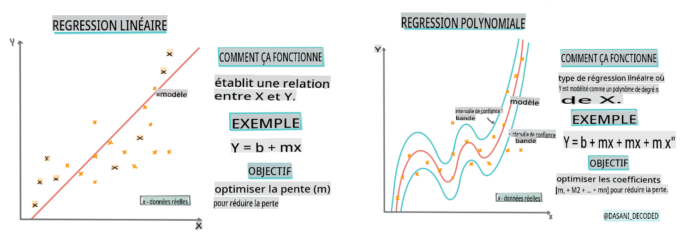
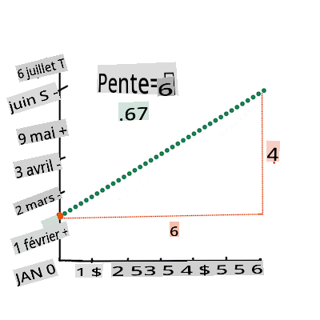
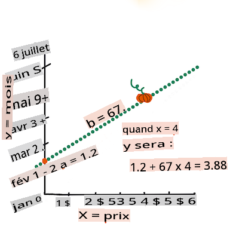

<!--
CO_OP_TRANSLATOR_METADATA:
{
  "original_hash": "2f88fbc741d792890ff2f1430fe0dae0",
  "translation_date": "2025-09-03T22:16:07+00:00",
  "source_file": "2-Regression/3-Linear/README.md",
  "language_code": "fr"
}
-->
# Construire un modèle de régression avec Scikit-learn : quatre approches de régression


> Infographie par [Dasani Madipalli](https://twitter.com/dasani_decoded)
## [Quiz pré-lecture](https://gray-sand-07a10f403.1.azurestaticapps.net/quiz/13/)

> ### [Cette leçon est disponible en R !](../../../../2-Regression/3-Linear/solution/R/lesson_3.html)
### Introduction 

Jusqu'à présent, vous avez exploré ce qu'est la régression à l'aide d'un exemple de données issues du jeu de données sur les prix des citrouilles que nous utiliserons tout au long de cette leçon. Vous l'avez également visualisée à l'aide de Matplotlib.

Vous êtes maintenant prêt à plonger plus profondément dans la régression pour l'apprentissage automatique. Bien que la visualisation permette de comprendre les données, la véritable puissance de l'apprentissage automatique réside dans l’_entraînement des modèles_. Les modèles sont entraînés sur des données historiques pour capturer automatiquement les dépendances entre les données, et ils permettent de prédire des résultats pour de nouvelles données que le modèle n'a jamais vues auparavant.

Dans cette leçon, vous en apprendrez davantage sur deux types de régression : la _régression linéaire de base_ et la _régression polynomiale_, ainsi que sur certaines notions mathématiques sous-jacentes à ces techniques. Ces modèles nous permettront de prédire les prix des citrouilles en fonction de différentes données d'entrée.

[](https://youtu.be/CRxFT8oTDMg "ML pour débutants - Comprendre la régression linéaire")

> 🎥 Cliquez sur l'image ci-dessus pour une courte vidéo d'introduction à la régression linéaire.

> Tout au long de ce programme, nous supposons une connaissance minimale des mathématiques et cherchons à les rendre accessibles aux étudiants venant d'autres domaines. Soyez attentif aux notes, 🧮 encadrés, diagrammes et autres outils d'apprentissage pour faciliter la compréhension.

### Prérequis

Vous devriez maintenant être familier avec la structure des données sur les citrouilles que nous examinons. Vous pouvez les trouver préchargées et pré-nettoyées dans le fichier _notebook.ipynb_ de cette leçon. Dans ce fichier, le prix des citrouilles est affiché par boisseau dans un nouveau DataFrame. Assurez-vous de pouvoir exécuter ces notebooks dans des kernels dans Visual Studio Code.

### Préparation

Pour rappel, vous chargez ces données afin de poser des questions à leur sujet.

- Quel est le meilleur moment pour acheter des citrouilles ?
- Quel prix puis-je attendre pour une caisse de citrouilles miniatures ?
- Devrais-je les acheter en paniers d'un demi-boisseau ou en cartons de 1 1/9 boisseau ?
Continuons à explorer ces données.

Dans la leçon précédente, vous avez créé un DataFrame Pandas et l'avez rempli avec une partie du jeu de données original, en standardisant les prix par boisseau. Cependant, en faisant cela, vous n'avez pu rassembler qu'environ 400 points de données, uniquement pour les mois d'automne.

Examinez les données préchargées dans le notebook accompagnant cette leçon. Les données sont préchargées et un nuage de points initial est tracé pour montrer les données mensuelles. Peut-être pouvons-nous obtenir un peu plus de détails sur la nature des données en les nettoyant davantage.

## Une ligne de régression linéaire

Comme vous l'avez appris dans la leçon 1, l'objectif d'un exercice de régression linéaire est de tracer une ligne pour :

- **Montrer les relations entre les variables**. Montrer la relation entre les variables.
- **Faire des prédictions**. Faire des prédictions précises sur la position d'un nouveau point de données par rapport à cette ligne.

Il est typique d'utiliser la **régression des moindres carrés** pour tracer ce type de ligne. Le terme "moindres carrés" signifie que tous les points de données entourant la ligne de régression sont élevés au carré, puis additionnés. Idéalement, cette somme finale est aussi petite que possible, car nous voulons un faible nombre d'erreurs, ou "moindres carrés".

Nous faisons cela car nous voulons modéliser une ligne ayant la plus faible distance cumulative par rapport à tous nos points de données. Nous élevons également les termes au carré avant de les additionner, car nous nous intéressons à leur magnitude plutôt qu'à leur direction.

> **🧮 Montrez-moi les maths** 
> 
> Cette ligne, appelée _ligne de meilleure adéquation_, peut être exprimée par [une équation](https://fr.wikipedia.org/wiki/R%C3%A9gression_lin%C3%A9aire_simple) : 
> 
> ```
> Y = a + bX
> ```
>
> `X` est la "variable explicative". `Y` est la "variable dépendante". La pente de la ligne est `b` et `a` est l'ordonnée à l'origine, qui fait référence à la valeur de `Y` lorsque `X = 0`. 
>
>
>
> Tout d'abord, calculez la pente `b`. Infographie par [Jen Looper](https://twitter.com/jenlooper)
>
> En d'autres termes, et en se référant à la question initiale sur les données des citrouilles : "prédire le prix d'une citrouille par boisseau selon le mois", `X` ferait référence au prix et `Y` au mois de vente. 
>
>
>
> Calculez la valeur de Y. Si vous payez environ 4 $, cela doit être en avril ! Infographie par [Jen Looper](https://twitter.com/jenlooper)
>
> Les calculs de cette ligne doivent démontrer la pente de la ligne, qui dépend également de l'ordonnée à l'origine, ou de la position de `Y` lorsque `X = 0`.
>
> Vous pouvez observer la méthode de calcul de ces valeurs sur le site [Math is Fun](https://www.mathsisfun.com/data/least-squares-regression.html). Consultez également [ce calculateur des moindres carrés](https://www.mathsisfun.com/data/least-squares-calculator.html) pour voir comment les valeurs influencent la ligne.

## Corrélation

Un autre terme à comprendre est le **coefficient de corrélation** entre les variables X et Y données. À l'aide d'un nuage de points, vous pouvez rapidement visualiser ce coefficient. Un graphique avec des points de données alignés de manière nette présente une forte corrélation, tandis qu'un graphique avec des points dispersés partout entre X et Y présente une faible corrélation.

Un bon modèle de régression linéaire sera celui qui a un coefficient de corrélation élevé (proche de 1 plutôt que de 0) en utilisant la méthode des moindres carrés avec une ligne de régression.

✅ Exécutez le notebook accompagnant cette leçon et examinez le nuage de points associant le mois au prix. Les données associant le mois au prix des ventes de citrouilles semblent-elles avoir une corrélation élevée ou faible, selon votre interprétation visuelle du nuage de points ? Cela change-t-il si vous utilisez une mesure plus fine comme le *jour de l'année* (c'est-à-dire le nombre de jours depuis le début de l'année) ?

Dans le code ci-dessous, nous supposerons que nous avons nettoyé les données et obtenu un DataFrame appelé `new_pumpkins`, similaire à ce qui suit :

ID | Mois | JourDeLAnnee | Variété | Ville | Emballage | Prix Bas | Prix Haut | Prix
---|------|--------------|---------|-------|-----------|----------|-----------|------
70 | 9 | 267 | TYPE TARTE | BALTIMORE | cartons de 1 1/9 boisseau | 15.0 | 15.0 | 13.636364
71 | 9 | 267 | TYPE TARTE | BALTIMORE | cartons de 1 1/9 boisseau | 18.0 | 18.0 | 16.363636
72 | 10 | 274 | TYPE TARTE | BALTIMORE | cartons de 1 1/9 boisseau | 18.0 | 18.0 | 16.363636
73 | 10 | 274 | TYPE TARTE | BALTIMORE | cartons de 1 1/9 boisseau | 17.0 | 17.0 | 15.454545
74 | 10 | 281 | TYPE TARTE | BALTIMORE | cartons de 1 1/9 boisseau | 15.0 | 15.0 | 13.636364

> Le code pour nettoyer les données est disponible dans [`notebook.ipynb`](notebook.ipynb). Nous avons effectué les mêmes étapes de nettoyage que dans la leçon précédente et avons calculé la colonne `JourDeLAnnee` à l'aide de l'expression suivante : 

```python
day_of_year = pd.to_datetime(pumpkins['Date']).apply(lambda dt: (dt-datetime(dt.year,1,1)).days)
```

Maintenant que vous comprenez les mathématiques derrière la régression linéaire, créons un modèle de régression pour voir si nous pouvons prédire quel emballage de citrouilles aura les meilleurs prix. Une personne achetant des citrouilles pour un champ de citrouilles pour les fêtes pourrait vouloir cette information pour optimiser ses achats.

## Recherche de corrélation

[](https://youtu.be/uoRq-lW2eQo "ML pour débutants - Recherche de corrélation : la clé de la régression linéaire")

> 🎥 Cliquez sur l'image ci-dessus pour une courte vidéo sur la corrélation.

Dans la leçon précédente, vous avez probablement vu que le prix moyen pour différents mois ressemble à ceci :


Cela suggère qu'il devrait y avoir une certaine corrélation, et nous pouvons essayer d'entraîner un modèle de régression linéaire pour prédire la relation entre `Mois` et `Prix`, ou entre `JourDeLAnnee` et `Prix`. Voici le nuage de points montrant cette dernière relation :

 

Voyons s'il existe une corrélation à l'aide de la fonction `corr` :

```python
print(new_pumpkins['Month'].corr(new_pumpkins['Price']))
print(new_pumpkins['DayOfYear'].corr(new_pumpkins['Price']))
```

Il semble que la corrélation soit assez faible, -0,15 pour `Mois` et -0,17 pour `JourDeLAnnee`, mais il pourrait y avoir une autre relation importante. Il semble qu'il existe différents groupes de prix correspondant à différentes variétés de citrouilles. Pour confirmer cette hypothèse, traçons chaque catégorie de citrouilles avec une couleur différente. En passant un paramètre `ax` à la fonction de tracé `scatter`, nous pouvons tracer tous les points sur le même graphique :

```python
ax=None
colors = ['red','blue','green','yellow']
for i,var in enumerate(new_pumpkins['Variety'].unique()):
    df = new_pumpkins[new_pumpkins['Variety']==var]
    ax = df.plot.scatter('DayOfYear','Price',ax=ax,c=colors[i],label=var)
```

 

Notre enquête suggère que la variété a plus d'effet sur le prix global que la date de vente réelle. Nous pouvons le voir avec un graphique en barres :

```python
new_pumpkins.groupby('Variety')['Price'].mean().plot(kind='bar')
```

 

Concentrons-nous pour le moment uniquement sur une variété de citrouilles, le "type tarte", et voyons quel effet la date a sur le prix :

```python
pie_pumpkins = new_pumpkins[new_pumpkins['Variety']=='PIE TYPE']
pie_pumpkins.plot.scatter('DayOfYear','Price') 
```
 

Si nous calculons maintenant la corrélation entre `Prix` et `JourDeLAnnee` à l'aide de la fonction `corr`, nous obtiendrons quelque chose comme `-0,27` - ce qui signifie qu'entraîner un modèle prédictif a du sens.

> Avant d'entraîner un modèle de régression linéaire, il est important de s'assurer que nos données sont propres. La régression linéaire ne fonctionne pas bien avec des valeurs manquantes, il est donc logique de se débarrasser de toutes les cellules vides :

```python
pie_pumpkins.dropna(inplace=True)
pie_pumpkins.info()
```

Une autre approche consisterait à remplir ces valeurs vides avec les valeurs moyennes de la colonne correspondante.

## Régression linéaire simple

[](https://youtu.be/e4c_UP2fSjg "ML pour débutants - Régression linéaire et polynomiale avec Scikit-learn")

> 🎥 Cliquez sur l'image ci-dessus pour une courte vidéo sur la régression linéaire et polynomiale.

Pour entraîner notre modèle de régression linéaire, nous utiliserons la bibliothèque **Scikit-learn**.

```python
from sklearn.linear_model import LinearRegression
from sklearn.metrics import mean_squared_error
from sklearn.model_selection import train_test_split
```

Nous commençons par séparer les valeurs d'entrée (caractéristiques) et la sortie attendue (étiquette) en tableaux numpy distincts :

```python
X = pie_pumpkins['DayOfYear'].to_numpy().reshape(-1,1)
y = pie_pumpkins['Price']
```

> Notez que nous avons dû effectuer un `reshape` sur les données d'entrée pour que le package de régression linéaire les comprenne correctement. La régression linéaire attend un tableau 2D en entrée, où chaque ligne du tableau correspond à un vecteur de caractéristiques d'entrée. Dans notre cas, comme nous n'avons qu'une seule entrée, nous avons besoin d'un tableau de forme N×1, où N est la taille du jeu de données.

Ensuite, nous devons diviser les données en ensembles d'entraînement et de test, afin de pouvoir valider notre modèle après l'entraînement :

```python
X_train, X_test, y_train, y_test = train_test_split(X, y, test_size=0.2, random_state=0)
```

Enfin, entraîner le modèle de régression linéaire réel ne prend que deux lignes de code. Nous définissons l'objet `LinearRegression` et l'ajustons à nos données à l'aide de la méthode `fit` :

```python
lin_reg = LinearRegression()
lin_reg.fit(X_train,y_train)
```

L'objet `LinearRegression` après l'ajustement contient tous les coefficients de la régression, accessibles via la propriété `.coef_`. Dans notre cas, il n'y a qu'un seul coefficient, qui devrait être d'environ `-0,017`. Cela signifie que les prix semblent légèrement baisser avec le temps, mais pas beaucoup, environ 2 centimes par jour. Nous pouvons également accéder au point d'intersection de la régression avec l'axe Y à l'aide de `lin_reg.intercept_` - il sera d'environ `21` dans notre cas, indiquant le prix au début de l'année.

Pour voir à quel point notre modèle est précis, nous pouvons prédire les prix sur un ensemble de test, puis mesurer à quel point nos prédictions sont proches des valeurs attendues. Cela peut être fait à l'aide de la métrique de l'erreur quadratique moyenne (MSE), qui est la moyenne de toutes les différences au carré entre les valeurs attendues et prédites.

```python
pred = lin_reg.predict(X_test)

mse = np.sqrt(mean_squared_error(y_test,pred))
print(f'Mean error: {mse:3.3} ({mse/np.mean(pred)*100:3.3}%)')
```
Notre erreur semble se situer autour de 2 points, soit environ 17 %. Pas très bon. Un autre indicateur de la qualité du modèle est le **coefficient de détermination**, que l'on peut obtenir comme suit :

```python
score = lin_reg.score(X_train,y_train)
print('Model determination: ', score)
```
Si la valeur est 0, cela signifie que le modèle ne prend pas en compte les données d'entrée et agit comme le *pire prédicteur linéaire*, qui est simplement une moyenne des résultats. Une valeur de 1 signifie que nous pouvons prédire parfaitement tous les résultats attendus. Dans notre cas, le coefficient est d'environ 0,06, ce qui est assez faible.

Nous pouvons également tracer les données de test avec la ligne de régression pour mieux comprendre comment la régression fonctionne dans notre cas :

```python
plt.scatter(X_test,y_test)
plt.plot(X_test,pred)
```


## Régression polynomiale

Un autre type de régression linéaire est la régression polynomiale. Bien qu'il existe parfois une relation linéaire entre les variables - plus le volume de la citrouille est grand, plus le prix est élevé - ces relations ne peuvent parfois pas être représentées par un plan ou une ligne droite.

✅ Voici [quelques exemples supplémentaires](https://online.stat.psu.edu/stat501/lesson/9/9.8) de données qui pourraient utiliser la régression polynomiale.

Regardez à nouveau la relation entre la date et le prix. Ce nuage de points semble-t-il devoir nécessairement être analysé par une ligne droite ? Les prix ne peuvent-ils pas fluctuer ? Dans ce cas, vous pouvez essayer la régression polynomiale.

✅ Les polynômes sont des expressions mathématiques qui peuvent contenir une ou plusieurs variables et coefficients.

La régression polynomiale crée une courbe pour mieux ajuster les données non linéaires. Dans notre cas, si nous incluons une variable `DayOfYear` au carré dans les données d'entrée, nous devrions pouvoir ajuster nos données avec une courbe parabolique, qui aura un minimum à un certain moment de l'année.

Scikit-learn inclut une API [pipeline](https://scikit-learn.org/stable/modules/generated/sklearn.pipeline.make_pipeline.html?highlight=pipeline#sklearn.pipeline.make_pipeline) utile pour combiner différentes étapes de traitement des données. Un **pipeline** est une chaîne d'**estimateurs**. Dans notre cas, nous allons créer un pipeline qui ajoute d'abord des caractéristiques polynomiales à notre modèle, puis entraîne la régression :

```python
from sklearn.preprocessing import PolynomialFeatures
from sklearn.pipeline import make_pipeline

pipeline = make_pipeline(PolynomialFeatures(2), LinearRegression())

pipeline.fit(X_train,y_train)
```

Utiliser `PolynomialFeatures(2)` signifie que nous inclurons tous les polynômes de degré 2 des données d'entrée. Dans notre cas, cela signifie simplement `DayOfYear`<sup>2</sup>, mais avec deux variables d'entrée X et Y, cela ajoutera X<sup>2</sup>, XY et Y<sup>2</sup>. Nous pouvons également utiliser des polynômes de degré supérieur si nous le souhaitons.

Les pipelines peuvent être utilisés de la même manière que l'objet `LinearRegression` original, c'est-à-dire que nous pouvons `fit` le pipeline, puis utiliser `predict` pour obtenir les résultats de prédiction. Voici le graphique montrant les données de test et la courbe d'approximation :


Avec la régression polynomiale, nous pouvons obtenir un MSE légèrement inférieur et un coefficient de détermination plus élevé, mais pas de manière significative. Nous devons prendre en compte d'autres caractéristiques !

> Vous pouvez voir que les prix minimaux des citrouilles sont observés autour d'Halloween. Comment expliquez-vous cela ?

🎃 Félicitations, vous venez de créer un modèle qui peut aider à prédire le prix des citrouilles pour tartes. Vous pouvez probablement répéter la même procédure pour tous les types de citrouilles, mais cela serait fastidieux. Apprenons maintenant à prendre en compte la variété des citrouilles dans notre modèle !

## Caractéristiques catégorielles

Dans un monde idéal, nous voulons pouvoir prédire les prix pour différentes variétés de citrouilles en utilisant le même modèle. Cependant, la colonne `Variety` est quelque peu différente des colonnes comme `Month`, car elle contient des valeurs non numériques. Ces colonnes sont appelées **catégorielles**.

[](https://youtu.be/DYGliioIAE0 "ML pour débutants - Prédictions avec caractéristiques catégorielles et régression linéaire")

> 🎥 Cliquez sur l'image ci-dessus pour une courte vidéo sur l'utilisation des caractéristiques catégorielles.

Voici comment le prix moyen dépend de la variété :


Pour prendre en compte la variété, nous devons d'abord la convertir en forme numérique, ou **encoder**. Il existe plusieurs façons de le faire :

* Un simple **encodage numérique** construira un tableau des différentes variétés, puis remplacera le nom de la variété par un indice dans ce tableau. Ce n'est pas la meilleure idée pour la régression linéaire, car la régression linéaire prend la valeur numérique réelle de l'indice et l'ajoute au résultat, en la multipliant par un coefficient. Dans notre cas, la relation entre le numéro d'indice et le prix est clairement non linéaire, même si nous nous assurons que les indices sont ordonnés d'une manière spécifique.
* **L'encodage one-hot** remplacera la colonne `Variety` par 4 colonnes différentes, une pour chaque variété. Chaque colonne contiendra `1` si la ligne correspondante est d'une variété donnée, et `0` sinon. Cela signifie qu'il y aura quatre coefficients dans la régression linéaire, un pour chaque variété de citrouille, responsable du "prix de départ" (ou plutôt "prix supplémentaire") pour cette variété particulière.

Le code ci-dessous montre comment nous pouvons encoder une variété en one-hot :

```python
pd.get_dummies(new_pumpkins['Variety'])
```

 ID | FAIRYTALE | MINIATURE | MIXED HEIRLOOM VARIETIES | PIE TYPE
----|-----------|-----------|--------------------------|----------
70 | 0 | 0 | 0 | 1
71 | 0 | 0 | 0 | 1
... | ... | ... | ... | ...
1738 | 0 | 1 | 0 | 0
1739 | 0 | 1 | 0 | 0
1740 | 0 | 1 | 0 | 0
1741 | 0 | 1 | 0 | 0
1742 | 0 | 1 | 0 | 0

Pour entraîner une régression linéaire en utilisant la variété encodée en one-hot comme entrée, nous devons simplement initialiser correctement les données `X` et `y` :

```python
X = pd.get_dummies(new_pumpkins['Variety'])
y = new_pumpkins['Price']
```

Le reste du code est identique à celui que nous avons utilisé ci-dessus pour entraîner la régression linéaire. Si vous essayez, vous verrez que l'erreur quadratique moyenne est à peu près la même, mais nous obtenons un coefficient de détermination beaucoup plus élevé (~77 %). Pour obtenir des prédictions encore plus précises, nous pouvons prendre en compte davantage de caractéristiques catégorielles, ainsi que des caractéristiques numériques, comme `Month` ou `DayOfYear`. Pour obtenir un grand tableau de caractéristiques, nous pouvons utiliser `join` :

```python
X = pd.get_dummies(new_pumpkins['Variety']) \
        .join(new_pumpkins['Month']) \
        .join(pd.get_dummies(new_pumpkins['City'])) \
        .join(pd.get_dummies(new_pumpkins['Package']))
y = new_pumpkins['Price']
```

Ici, nous prenons également en compte `City` et le type de `Package`, ce qui nous donne un MSE de 2,84 (10 %) et un coefficient de détermination de 0,94 !

## Tout rassembler

Pour créer le meilleur modèle, nous pouvons utiliser les données combinées (catégorielles encodées en one-hot + numériques) de l'exemple ci-dessus avec la régression polynomiale. Voici le code complet pour votre commodité :

```python
# set up training data
X = pd.get_dummies(new_pumpkins['Variety']) \
        .join(new_pumpkins['Month']) \
        .join(pd.get_dummies(new_pumpkins['City'])) \
        .join(pd.get_dummies(new_pumpkins['Package']))
y = new_pumpkins['Price']

# make train-test split
X_train, X_test, y_train, y_test = train_test_split(X, y, test_size=0.2, random_state=0)

# setup and train the pipeline
pipeline = make_pipeline(PolynomialFeatures(2), LinearRegression())
pipeline.fit(X_train,y_train)

# predict results for test data
pred = pipeline.predict(X_test)

# calculate MSE and determination
mse = np.sqrt(mean_squared_error(y_test,pred))
print(f'Mean error: {mse:3.3} ({mse/np.mean(pred)*100:3.3}%)')

score = pipeline.score(X_train,y_train)
print('Model determination: ', score)
```

Cela devrait nous donner le meilleur coefficient de détermination, presque 97 %, et un MSE=2,23 (~8 % d'erreur de prédiction).

| Modèle | MSE | Détermination |
|--------|-----|---------------|
| `DayOfYear` Linéaire | 2,77 (17,2 %) | 0,07 |
| `DayOfYear` Polynomial | 2,73 (17,0 %) | 0,08 |
| `Variety` Linéaire | 5,24 (19,7 %) | 0,77 |
| Toutes les caractéristiques Linéaire | 2,84 (10,5 %) | 0,94 |
| Toutes les caractéristiques Polynomial | 2,23 (8,25 %) | 0,97 |

🏆 Bien joué ! Vous avez créé quatre modèles de régression en une seule leçon et amélioré la qualité du modèle à 97 %. Dans la section finale sur la régression, vous apprendrez la régression logistique pour déterminer des catégories.

---
## 🚀Défi

Testez plusieurs variables différentes dans ce notebook pour voir comment la corrélation correspond à la précision du modèle.

## [Quiz post-lecture](https://gray-sand-07a10f403.1.azurestaticapps.net/quiz/14/)

## Révision et auto-apprentissage

Dans cette leçon, nous avons appris la régression linéaire. Il existe d'autres types importants de régression. Lisez sur les techniques Stepwise, Ridge, Lasso et Elasticnet. Un bon cours pour approfondir est le [cours de Stanford sur l'apprentissage statistique](https://online.stanford.edu/courses/sohs-ystatslearning-statistical-learning).

## Devoir 

[Construisez un modèle](assignment.md)

---

**Avertissement** :  
Ce document a été traduit à l'aide du service de traduction automatique [Co-op Translator](https://github.com/Azure/co-op-translator). Bien que nous nous efforcions d'assurer l'exactitude, veuillez noter que les traductions automatisées peuvent contenir des erreurs ou des inexactitudes. Le document original dans sa langue d'origine doit être considéré comme la source faisant autorité. Pour des informations critiques, il est recommandé de recourir à une traduction professionnelle réalisée par un humain. Nous déclinons toute responsabilité en cas de malentendus ou d'interprétations erronées résultant de l'utilisation de cette traduction.