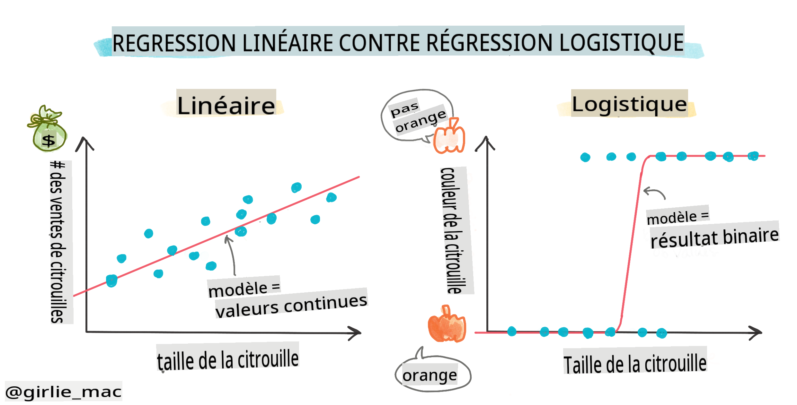
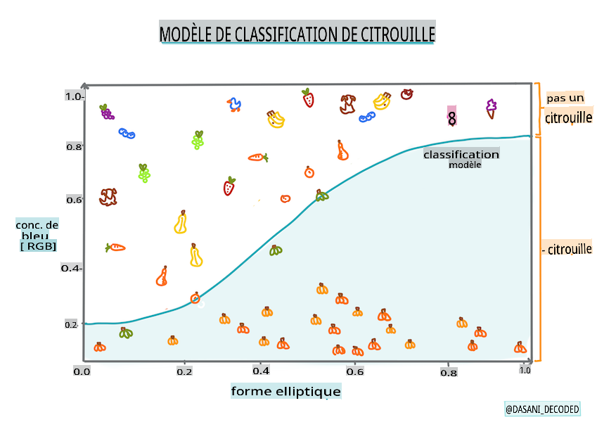
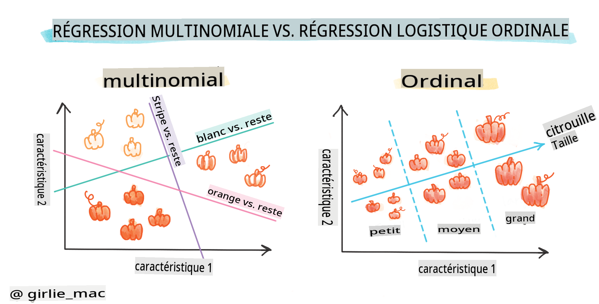
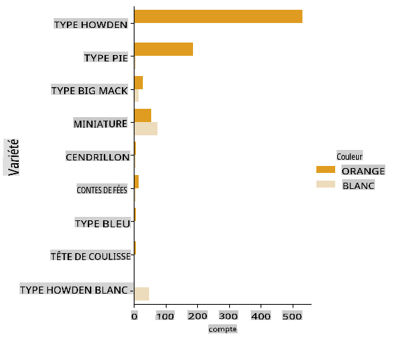
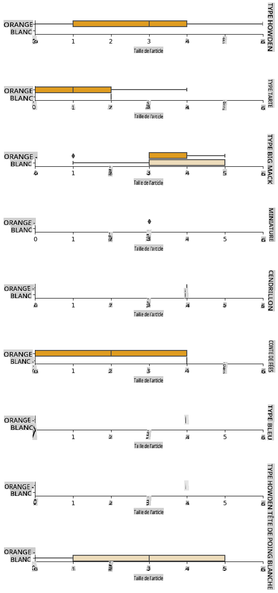
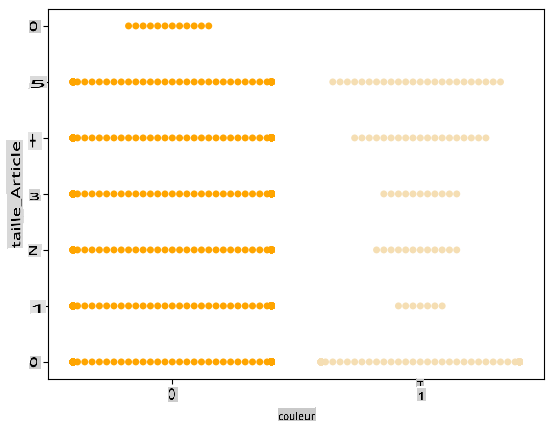
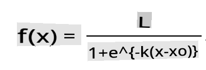

# Régression logistique pour prédire des catégories



## [Quiz avant le cours](https://gray-sand-07a10f403.1.azurestaticapps.net/quiz/15/)

> ### [Cette leçon est disponible en R !](../../../../2-Regression/4-Logistic/solution/R/lesson_4.html)

## Introduction

Dans cette dernière leçon sur la régression, l'une des techniques ML _classiques_ de base, nous allons examiner la régression logistique. Vous utiliseriez cette technique pour découvrir des motifs afin de prédire des catégories binaires. Ce bonbon est-il en chocolat ou non ? Cette maladie est-elle contagieuse ou non ? Ce client choisira-t-il ce produit ou non ?

Dans cette leçon, vous apprendrez :

- Une nouvelle bibliothèque pour la visualisation des données
- Des techniques pour la régression logistique

✅ Approfondissez votre compréhension de ce type de régression dans ce [module d'apprentissage](https://docs.microsoft.com/learn/modules/train-evaluate-classification-models?WT.mc_id=academic-77952-leestott)

## Prérequis

Ayant travaillé avec les données sur les citrouilles, nous sommes maintenant suffisamment familiarisés avec celles-ci pour réaliser qu'il y a une catégorie binaire avec laquelle nous pouvons travailler : `Color`.

Construisons un modèle de régression logistique pour prédire, étant donné certaines variables, _de quelle couleur une citrouille donnée est susceptible d'être_ (orange 🎃 ou blanche 👻).

> Pourquoi parlons-nous de classification binaire dans un groupe de leçons sur la régression ? Seulement pour des raisons linguistiques, car la régression logistique est [réellement une méthode de classification](https://scikit-learn.org/stable/modules/linear_model.html#logistic-regression), bien qu'elle soit basée sur une approche linéaire. Découvrez d'autres façons de classer les données dans le prochain groupe de leçons.

## Définir la question

Pour nos besoins, nous allons l'exprimer sous forme binaire : 'Blanc' ou 'Pas Blanc'. Il y a aussi une catégorie 'rayée' dans notre ensemble de données, mais il y a peu d'instances, donc nous ne l'utiliserons pas. De toute façon, elle disparaît une fois que nous avons supprimé les valeurs nulles de l'ensemble de données.

> 🎃 Fait amusant, nous appelons parfois les citrouilles blanches des citrouilles 'fantômes'. Elles ne sont pas très faciles à sculpter, donc elles ne sont pas aussi populaires que les oranges, mais elles sont vraiment belles ! Nous pourrions donc également reformuler notre question comme suit : 'Fantôme' ou 'Pas Fantôme'. 👻

## À propos de la régression logistique

La régression logistique diffère de la régression linéaire, que vous avez étudiée précédemment, de plusieurs manières importantes.

[](https://youtu.be/KpeCT6nEpBY "ML pour débutants - Comprendre la régression logistique pour la classification en apprentissage automatique")

> 🎥 Cliquez sur l'image ci-dessus pour une courte vidéo d'introduction à la régression logistique.

### Classification binaire

La régression logistique n'offre pas les mêmes fonctionnalités que la régression linéaire. La première fournit une prédiction sur une catégorie binaire ("blanc ou pas blanc"), tandis que la seconde est capable de prédire des valeurs continues, par exemple, étant donné l'origine d'une citrouille et le moment de la récolte, _quel sera l'augmentation de son prix_.


> Infographie par [Dasani Madipalli](https://twitter.com/dasani_decoded)

### Autres classifications

Il existe d'autres types de régression logistique, y compris multinomiale et ordinale :

- **Multinomiale**, qui implique d'avoir plus d'une catégorie - "Orange, Blanc et Rayé".
- **Ordinale**, qui implique des catégories ordonnées, utile si nous voulons ordonner nos résultats logiquement, comme nos citrouilles qui sont classées par un nombre fini de tailles (mini, sm, med, lg, xl, xxl).



### Les variables N'ONT PAS besoin de corréler

Rappelez-vous comment la régression linéaire fonctionnait mieux avec des variables plus corrélées ? La régression logistique est l'opposée - les variables n'ont pas besoin de s'aligner. Cela fonctionne pour ces données qui présentent des corrélations relativement faibles.

### Vous avez besoin de beaucoup de données propres

La régression logistique donnera des résultats plus précis si vous utilisez plus de données ; notre petit ensemble de données n'est pas optimal pour cette tâche, alors gardez cela à l'esprit.

[](https://youtu.be/B2X4H9vcXTs "ML pour débutants - Analyse et préparation des données pour la régression logistique")

> 🎥 Cliquez sur l'image ci-dessus pour une courte vidéo d'introduction à la préparation des données pour la régression linéaire

✅ Pensez aux types de données qui se prêteraient bien à la régression logistique.

## Exercice - nettoyer les données

Tout d'abord, nettoyez un peu les données, en supprimant les valeurs nulles et en sélectionnant seulement certaines colonnes :

1. Ajoutez le code suivant :

    ```python
  
    columns_to_select = ['City Name','Package','Variety', 'Origin','Item Size', 'Color']
    pumpkins = full_pumpkins.loc[:, columns_to_select]

    pumpkins.dropna(inplace=True)
    ```

    Vous pouvez toujours jeter un œil à votre nouveau dataframe :

    ```python
    pumpkins.info
    ```

### Visualisation - graphique catégorique

À ce stade, vous avez à nouveau chargé le [carnet de démarrage](../../../../2-Regression/4-Logistic/notebook.ipynb) avec les données sur les citrouilles et l'avez nettoyé afin de préserver un ensemble de données contenant quelques variables, y compris `Color`. Visualisons le dataframe dans le carnet en utilisant une autre bibliothèque : [Seaborn](https://seaborn.pydata.org/index.html), qui est construite sur Matplotlib que nous avons utilisée précédemment.

Seaborn propose des moyens intéressants de visualiser vos données. Par exemple, vous pouvez comparer les distributions des données pour chaque `Variety` et `Color` dans un graphique catégorique.

1. Créez un tel graphique en utilisant le `catplot` function, using our pumpkin data `pumpkins`, et en spécifiant un mappage des couleurs pour chaque catégorie de citrouille (orange ou blanche) :

    ```python
    import seaborn as sns
    
    palette = {
    'ORANGE': 'orange',
    'WHITE': 'wheat',
    }

    sns.catplot(
    data=pumpkins, y="Variety", hue="Color", kind="count",
    palette=palette, 
    )
    ```

    

    En observant les données, vous pouvez voir comment les données de couleur se rapportent à la variété.

    ✅ Étant donné ce graphique catégorique, quelles explorations intéressantes pouvez-vous envisager ?

### Prétraitement des données : encodage des caractéristiques et des étiquettes
Notre ensemble de données sur les citrouilles contient des valeurs de chaîne pour toutes ses colonnes. Travailler avec des données catégorielles est intuitif pour les humains mais pas pour les machines. Les algorithmes d'apprentissage automatique fonctionnent bien avec des chiffres. C'est pourquoi l'encodage est une étape très importante dans la phase de prétraitement des données, car il nous permet de transformer les données catégorielles en données numériques, sans perdre d'informations. Un bon encodage conduit à la construction d'un bon modèle.

Pour l'encodage des caractéristiques, il existe deux principaux types d'encodeurs :

1. Encodeur ordinal : il convient bien aux variables ordinales, qui sont des variables catégorielles dont les données suivent un ordre logique, comme la colonne `Item Size` dans notre ensemble de données. Il crée un mappage tel que chaque catégorie est représentée par un nombre, qui est l'ordre de la catégorie dans la colonne.

    ```python
    from sklearn.preprocessing import OrdinalEncoder

    item_size_categories = [['sml', 'med', 'med-lge', 'lge', 'xlge', 'jbo', 'exjbo']]
    ordinal_features = ['Item Size']
    ordinal_encoder = OrdinalEncoder(categories=item_size_categories)
    ```

2. Encodeur catégorique : il convient bien aux variables nominales, qui sont des variables catégorielles dont les données ne suivent pas un ordre logique, comme toutes les caractéristiques différentes de `Item Size` dans notre ensemble de données. C'est un encodage one-hot, ce qui signifie que chaque catégorie est représentée par une colonne binaire : la variable encodée est égale à 1 si la citrouille appartient à cette variété et 0 sinon.

    ```python
    from sklearn.preprocessing import OneHotEncoder

    categorical_features = ['City Name', 'Package', 'Variety', 'Origin']
    categorical_encoder = OneHotEncoder(sparse_output=False)
    ```
Ensuite, `ColumnTransformer` est utilisé pour combiner plusieurs encodeurs en une seule étape et les appliquer aux colonnes appropriées.

```python
    from sklearn.compose import ColumnTransformer
    
    ct = ColumnTransformer(transformers=[
        ('ord', ordinal_encoder, ordinal_features),
        ('cat', categorical_encoder, categorical_features)
        ])
    
    ct.set_output(transform='pandas')
    encoded_features = ct.fit_transform(pumpkins)
```
D'autre part, pour encoder l'étiquette, nous utilisons la classe `LabelEncoder` de scikit-learn, qui est une classe utilitaire pour aider à normaliser les étiquettes afin qu'elles ne contiennent que des valeurs comprises entre 0 et n_classes-1 (ici, 0 et 1).

```python
    from sklearn.preprocessing import LabelEncoder

    label_encoder = LabelEncoder()
    encoded_label = label_encoder.fit_transform(pumpkins['Color'])
```
Une fois que nous avons encodé les caractéristiques et l'étiquette, nous pouvons les fusionner dans un nouveau dataframe `encoded_pumpkins`.

```python
    encoded_pumpkins = encoded_features.assign(Color=encoded_label)
```
✅ Quels sont les avantages d'utiliser un encodeur ordinal pour le `Item Size` column?

### Analyse relationships between variables

Now that we have pre-processed our data, we can analyse the relationships between the features and the label to grasp an idea of how well the model will be able to predict the label given the features.
The best way to perform this kind of analysis is plotting the data. We'll be using again the Seaborn `catplot` function, to visualize the relationships between `Item Size`,  `Variety` et `Color` dans un graphique catégorique. Pour mieux tracer les données, nous utiliserons la colonne encodée `Item Size` column and the unencoded `Variety`.

```python
    palette = {
    'ORANGE': 'orange',
    'WHITE': 'wheat',
    }
    pumpkins['Item Size'] = encoded_pumpkins['ord__Item Size']

    g = sns.catplot(
        data=pumpkins,
        x="Item Size", y="Color", row='Variety',
        kind="box", orient="h",
        sharex=False, margin_titles=True,
        height=1.8, aspect=4, palette=palette,
    )
    g.set(xlabel="Item Size", ylabel="").set(xlim=(0,6))
    g.set_titles(row_template="{row_name}")
```


### Utiliser un graphique en essaim

Puisque la couleur est une catégorie binaire (Blanc ou Pas Blanc), elle nécessite 'une [approche spécialisée](https://seaborn.pydata.org/tutorial/categorical.html?highlight=bar) pour la visualisation'. Il existe d'autres façons de visualiser la relation de cette catégorie avec d'autres variables.

Vous pouvez visualiser les variables côte à côte avec les graphiques Seaborn.

1. Essayez un graphique 'en essaim' pour montrer la distribution des valeurs :

    ```python
    palette = {
    0: 'orange',
    1: 'wheat'
    }
    sns.swarmplot(x="Color", y="ord__Item Size", data=encoded_pumpkins, palette=palette)
    ```

    

**Attention** : le code ci-dessus pourrait générer un avertissement, car seaborn échoue à représenter une telle quantité de points de données dans un graphique en essaim. Une solution possible consiste à diminuer la taille du marqueur, en utilisant le paramètre 'size'. Cependant, soyez conscient que cela affecte la lisibilité du graphique.

> **🧮 Montrez-moi les mathématiques**
>
> La régression logistique repose sur le concept de 'vraisemblance maximale' utilisant des [fonctions sigmoïdes](https://wikipedia.org/wiki/Sigmoid_function). Une 'Fonction Sigmoïde' sur un graphique ressemble à une forme en 'S'. Elle prend une valeur et la mappe quelque part entre 0 et 1. Sa courbe est également appelée 'courbe logistique'. Sa formule ressemble à ceci :
>
> 
>
> où le point médian de la sigmoïde se trouve au point 0 des x, L est la valeur maximale de la courbe, et k est la pente de la courbe. Si le résultat de la fonction est supérieur à 0,5, l'étiquette en question sera classée comme '1' de la choix binaire. Sinon, elle sera classée comme '0'.

## Construisez votre modèle

Construire un modèle pour trouver ces classifications binaires est étonnamment simple dans Scikit-learn.

[](https://youtu.be/MmZS2otPrQ8 "ML pour débutants - Régression logistique pour la classification des données")

> 🎥 Cliquez sur l'image ci-dessus pour une courte vidéo d'introduction à la construction d'un modèle de régression linéaire

1. Sélectionnez les variables que vous souhaitez utiliser dans votre modèle de classification et divisez les ensembles d'entraînement et de test en appelant `train_test_split()` :

    ```python
    from sklearn.model_selection import train_test_split
    
    X = encoded_pumpkins[encoded_pumpkins.columns.difference(['Color'])]
    y = encoded_pumpkins['Color']

    X_train, X_test, y_train, y_test = train_test_split(X, y, test_size=0.2, random_state=0)
    
    ```

2. Maintenant, vous pouvez entraîner votre modèle, en appelant `fit()` avec vos données d'entraînement, et imprimez son résultat :

    ```python
    from sklearn.metrics import f1_score, classification_report 
    from sklearn.linear_model import LogisticRegression

    model = LogisticRegression()
    model.fit(X_train, y_train)
    predictions = model.predict(X_test)

    print(classification_report(y_test, predictions))
    print('Predicted labels: ', predictions)
    print('F1-score: ', f1_score(y_test, predictions))
    ```

    Jetez un œil au tableau de bord de votre modèle. Ce n'est pas mal, étant donné que vous avez seulement environ 1000 lignes de données :

    ```output
                       precision    recall  f1-score   support
    
                    0       0.94      0.98      0.96       166
                    1       0.85      0.67      0.75        33
    
        accuracy                                0.92       199
        macro avg           0.89      0.82      0.85       199
        weighted avg        0.92      0.92      0.92       199
    
        Predicted labels:  [0 0 0 0 0 0 0 0 0 0 0 0 0 0 0 0 0 0 0 0 1 0 0 1 0 0 0 0 0 0 0 0 1 0 0 0 0
        0 0 0 0 0 1 0 1 0 0 1 0 0 0 0 0 1 0 1 0 1 0 1 0 0 0 0 0 0 0 0 0 0 0 0 0 0
        1 0 0 0 0 0 0 0 1 0 0 0 0 0 0 0 1 0 0 0 0 0 0 0 0 1 0 1 0 0 0 0 0 0 0 1 0
        0 0 0 0 0 0 0 0 0 0 0 0 0 0 0 0 0 0 0 0 0 1 0 0 0 0 0 0 0 0 1 0 0 0 1 1 0
        0 0 0 0 1 0 0 0 0 0 1 0 0 0 0 0 0 0 0 0 0 0 0 0 0 0 0 0 0 0 0 0 0 0 0 0 1
        0 0 0 1 0 0 0 0 0 0 0 0 1 1]
        F1-score:  0.7457627118644068
    ```

## Meilleure compréhension via une matrice de confusion

Bien que vous puissiez obtenir un rapport de score [termes](https://scikit-learn.org/stable/modules/generated/sklearn.metrics.classification_report.html?highlight=classification_report#sklearn.metrics.classification_report) en imprimant les éléments ci-dessus, vous pourriez être en mesure de comprendre votre modèle plus facilement en utilisant une [matrice de confusion](https://scikit-learn.org/stable/modules/model_evaluation.html#confusion-matrix) pour nous aider à comprendre comment le modèle fonctionne.

> 🎓 Une '[matrice de confusion](https://wikipedia.org/wiki/Confusion_matrix)' (ou 'matrice d'erreur') est un tableau qui exprime les vrais positifs et négatifs et les faux positifs de votre modèle, permettant ainsi d'évaluer la précision des prédictions.

1. Pour utiliser une matrice de confusion, appelez `confusion_matrix()` :

    ```python
    from sklearn.metrics import confusion_matrix
    confusion_matrix(y_test, predictions)
    ```

    Jetez un œil à la matrice de confusion de votre modèle :

    ```output
    array([[162,   4],
           [ 11,  22]])
    ```

Dans Scikit-learn, les lignes de la matrice de confusion (axe 0) sont les étiquettes réelles et les colonnes (axe 1) sont les étiquettes prédites.

|       |   0   |   1   |
| :---: | :---: | :---: |
|   0   |  TN   |  FP   |
|   1   |  FN   |  TP   |

Que se passe-t-il ici ? Supposons que notre modèle soit chargé de classifier des citrouilles entre deux catégories binaires, la catégorie 'blanche' et la catégorie 'non-blanche'.

- Si votre modèle prédit qu'une citrouille n'est pas blanche et qu'elle appartient en réalité à la catégorie 'non-blanche', nous l'appelons un vrai négatif, représenté par le nombre en haut à gauche.
- Si votre modèle prédit qu'une citrouille est blanche et qu'elle appartient en réalité à la catégorie 'non-blanche', nous l'appelons un faux négatif, représenté par le nombre en bas à gauche.
- Si votre modèle prédit qu'une citrouille n'est pas blanche et qu'elle appartient en réalité à la catégorie 'blanche', nous l'appelons un faux positif, représenté par le nombre en haut à droite.
- Si votre modèle prédit qu'une citrouille est blanche et qu'elle appartient en réalité à la catégorie 'blanche', nous l'appelons un vrai positif, représenté par le nombre en bas à droite.

Comme vous l'avez peut-être deviné, il est préférable d'avoir un plus grand nombre de vrais positifs et de vrais négatifs et un nombre plus faible de faux positifs et de faux négatifs, ce qui implique que le modèle fonctionne mieux.

Comment la matrice de confusion est-elle liée à la précision et au rappel ? Rappelez-vous, le rapport de classification imprimé ci-dessus montrait la précision (0,85) et le rappel (0,67).

Précision = tp / (tp + fp) = 22 / (22 + 4) = 0,8461538461538461

Rappel = tp / (tp + fn) = 22 / (22 + 11) = 0,6666666666666666

✅ Q : Selon la matrice de confusion, comment le modèle a-t-il fonctionné ? R : Pas mal ; il y a un bon nombre de vrais négatifs mais aussi quelques faux négatifs.

Revisitons les termes que nous avons vus plus tôt avec l'aide du mappage de la matrice de confusion TP/TN et FP/FN :

🎓 Précision : TP/(TP + FP) La fraction d'instances pertinentes parmi les instances récupérées (par exemple, quelles étiquettes étaient bien étiquetées)

🎓 Rappel : TP/(TP + FN) La fraction d'instances pertinentes qui ont été récupérées, qu'elles soient bien étiquetées ou non

🎓 f1-score : (2 * précision * rappel)/(précision + rappel) Une moyenne pondérée de la précision et du rappel, avec 1 étant le meilleur et 0 étant le pire

🎓 Support : Le nombre d'occurrences de chaque étiquette récupérée

🎓 Précision : (TP + TN)/(TP + TN + FP + FN) Le pourcentage d'étiquettes prédites avec précision pour un échantillon.

🎓 Moyenne Macro : Le calcul de la moyenne non pondérée des métriques pour chaque étiquette, sans tenir compte du déséquilibre des étiquettes.

🎓 Moyenne Pondérée : Le calcul de la moyenne des métriques pour chaque étiquette, en tenant compte du déséquilibre des étiquettes en les pondérant par leur support (le nombre d'instances réelles pour chaque étiquette).

✅ Pouvez-vous penser à la métrique que vous devriez surveiller si vous souhaitez que votre modèle réduise le nombre de faux négatifs ?

## Visualisez la courbe ROC de ce modèle

[](https://youtu.be/GApO575jTA0 "ML pour débutants - Analyser la performance de la régression logistique avec les courbes ROC")

> 🎥 Cliquez sur l'image ci-dessus pour une courte vidéo d'introduction aux courbes ROC

Faisons une visualisation supplémentaire pour voir la fameuse courbe 'ROC' :

```python
from sklearn.metrics import roc_curve, roc_auc_score
import matplotlib
import matplotlib.pyplot as plt
%matplotlib inline

y_scores = model.predict_proba(X_test)
fpr, tpr, thresholds = roc_curve(y_test, y_scores[:,1])

fig = plt.figure(figsize=(6, 6))
plt.plot([0, 1], [0, 1], 'k--')
plt.plot(fpr, tpr)
plt.xlabel('False Positive Rate')
plt.ylabel('True Positive Rate')
plt.title('ROC Curve')
plt.show()
```

En utilisant Matplotlib, tracez le [Caractéristique de fonctionnement du récepteur](https://scikit-learn.org/stable/auto_examples/model_selection/plot_roc.html?highlight=roc) ou ROC. Les courbes ROC sont souvent utilisées pour obtenir une vue de la sortie d'un classificateur en termes de vrais vs faux positifs. "Les courbes ROC présentent généralement le taux de vrais positifs sur l'axe Y et le

**Avertissement** :  
Ce document a été traduit à l'aide de services de traduction automatisée basés sur l'IA. Bien que nous nous efforçons d'assurer l'exactitude, veuillez noter que les traductions automatisées peuvent contenir des erreurs ou des inexactitudes. Le document original dans sa langue native doit être considéré comme la source faisant autorité. Pour des informations critiques, une traduction humaine professionnelle est recommandée. Nous ne sommes pas responsables des malentendus ou des interprétations erronées découlant de l'utilisation de cette traduction.