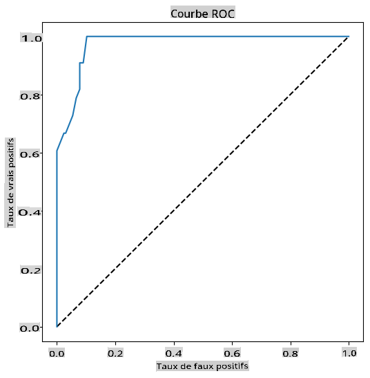

<!--
CO_OP_TRANSLATOR_METADATA:
{
  "original_hash": "72b5bae0879baddf6aafc82bb07b8776",
  "translation_date": "2025-09-03T22:23:34+00:00",
  "source_file": "2-Regression/4-Logistic/README.md",
  "language_code": "fr"
}
-->
# Régression logistique pour prédire des catégories


## [Quiz avant le cours](https://gray-sand-07a10f403.1.azurestaticapps.net/quiz/15/)

> ### [Cette leçon est disponible en R !](../../../../2-Regression/4-Logistic/solution/R/lesson_4.html)

## Introduction

Dans cette dernière leçon sur la régression, l'une des techniques classiques de base en apprentissage automatique, nous allons examiner la régression logistique. Vous utiliseriez cette technique pour découvrir des modèles permettant de prédire des catégories binaires. Ce bonbon est-il au chocolat ou non ? Cette maladie est-elle contagieuse ou non ? Ce client choisira-t-il ce produit ou non ?

Dans cette leçon, vous apprendrez :

- Une nouvelle bibliothèque pour la visualisation des données
- Des techniques pour la régression logistique

✅ Approfondissez votre compréhension de ce type de régression dans ce [module d'apprentissage](https://docs.microsoft.com/learn/modules/train-evaluate-classification-models?WT.mc_id=academic-77952-leestott)

## Prérequis

Après avoir travaillé avec les données sur les citrouilles, nous sommes maintenant suffisamment familiers avec elles pour réaliser qu'il existe une catégorie binaire sur laquelle nous pouvons travailler : `Color`.

Construisons un modèle de régression logistique pour prédire, à partir de certaines variables, _quelle couleur une citrouille donnée est susceptible d'avoir_ (orange 🎃 ou blanche 👻).

> Pourquoi parlons-nous de classification binaire dans une leçon sur la régression ? C'est uniquement pour des raisons linguistiques, car la régression logistique est [en réalité une méthode de classification](https://scikit-learn.org/stable/modules/linear_model.html#logistic-regression), bien qu'elle soit basée sur des principes linéaires. Découvrez d'autres façons de classifier les données dans le prochain groupe de leçons.

## Définir la question

Pour nos besoins, nous exprimerons cela comme une binaire : 'Blanche' ou 'Non blanche'. Il existe également une catégorie 'rayée' dans notre ensemble de données, mais elle contient peu d'exemples, donc nous ne l'utiliserons pas. Elle disparaît de toute façon une fois que nous supprimons les valeurs nulles de l'ensemble de données.

> 🎃 Fait amusant : nous appelons parfois les citrouilles blanches des citrouilles 'fantômes'. Elles ne sont pas très faciles à sculpter, donc elles ne sont pas aussi populaires que les citrouilles oranges, mais elles ont un look sympa ! Nous pourrions donc reformuler notre question ainsi : 'Fantôme' ou 'Non fantôme'. 👻

## À propos de la régression logistique

La régression logistique diffère de la régression linéaire, que vous avez apprise précédemment, de plusieurs manières importantes.

[](https://youtu.be/KpeCT6nEpBY "ML pour débutants - Comprendre la régression logistique pour la classification en apprentissage automatique")

> 🎥 Cliquez sur l'image ci-dessus pour une courte vidéo sur la régression logistique.

### Classification binaire

La régression logistique n'offre pas les mêmes fonctionnalités que la régression linéaire. La première propose une prédiction sur une catégorie binaire ("blanche ou non blanche"), tandis que la seconde est capable de prédire des valeurs continues, par exemple, en fonction de l'origine d'une citrouille et du moment de la récolte, _de combien son prix augmentera_.


> Infographie par [Dasani Madipalli](https://twitter.com/dasani_decoded)

### Autres classifications

Il existe d'autres types de régression logistique, notamment multinomiale et ordinale :

- **Multinomiale**, qui implique d'avoir plus d'une catégorie - "Orange, Blanche et Rayée".
- **Ordinale**, qui implique des catégories ordonnées, utile si nous voulons ordonner nos résultats logiquement, comme nos citrouilles classées par un nombre fini de tailles (mini, petite, moyenne, grande, XL, XXL).


### Les variables n'ont PAS besoin d'être corrélées

Vous vous souvenez que la régression linéaire fonctionnait mieux avec des variables plus corrélées ? La régression logistique est l'opposé - les variables n'ont pas besoin d'être alignées. Cela fonctionne pour ces données qui ont des corrélations relativement faibles.

### Vous avez besoin de beaucoup de données propres

La régression logistique donnera des résultats plus précis si vous utilisez davantage de données ; notre petit ensemble de données n'est pas optimal pour cette tâche, donc gardez cela à l'esprit.

[](https://youtu.be/B2X4H9vcXTs "ML pour débutants - Analyse et préparation des données pour la régression logistique")

> 🎥 Cliquez sur l'image ci-dessus pour une courte vidéo sur la préparation des données pour la régression linéaire.

✅ Réfléchissez aux types de données qui se prêtent bien à la régression logistique.

## Exercice - nettoyer les données

Tout d'abord, nettoyez un peu les données en supprimant les valeurs nulles et en sélectionnant uniquement certaines colonnes :

1. Ajoutez le code suivant :

    ```python
  
    columns_to_select = ['City Name','Package','Variety', 'Origin','Item Size', 'Color']
    pumpkins = full_pumpkins.loc[:, columns_to_select]

    pumpkins.dropna(inplace=True)
    ```

    Vous pouvez toujours jeter un coup d'œil à votre nouveau dataframe :

    ```python
    pumpkins.info
    ```

### Visualisation - graphique catégoriel

À ce stade, vous avez chargé le [notebook de départ](./notebook.ipynb) avec les données sur les citrouilles et les avez nettoyées pour conserver un ensemble de données contenant quelques variables, y compris `Color`. Visualisons le dataframe dans le notebook en utilisant une bibliothèque différente : [Seaborn](https://seaborn.pydata.org/index.html), qui est construite sur Matplotlib que nous avons utilisé précédemment.

Seaborn offre des moyens intéressants de visualiser vos données. Par exemple, vous pouvez comparer les distributions des données pour chaque `Variety` et `Color` dans un graphique catégoriel.

1. Créez un tel graphique en utilisant la fonction `catplot`, avec nos données sur les citrouilles `pumpkins`, et en spécifiant une correspondance de couleurs pour chaque catégorie de citrouilles (orange ou blanche) :

    ```python
    import seaborn as sns
    
    palette = {
    'ORANGE': 'orange',
    'WHITE': 'wheat',
    }

    sns.catplot(
    data=pumpkins, y="Variety", hue="Color", kind="count",
    palette=palette, 
    )
    ```

    

    En observant les données, vous pouvez voir comment les données de couleur se rapportent à la variété.

    ✅ À partir de ce graphique catégoriel, quelles explorations intéressantes pouvez-vous envisager ?

### Prétraitement des données : encodage des caractéristiques et des étiquettes

Notre ensemble de données sur les citrouilles contient des valeurs de type chaîne pour toutes ses colonnes. Travailler avec des données catégoriques est intuitif pour les humains mais pas pour les machines. Les algorithmes d'apprentissage automatique fonctionnent bien avec des nombres. C'est pourquoi l'encodage est une étape très importante dans la phase de prétraitement des données, car il nous permet de transformer des données catégoriques en données numériques, sans perdre aucune information. Un bon encodage permet de construire un bon modèle.

Pour l'encodage des caractéristiques, il existe deux principaux types d'encodeurs :

1. Encodeur ordinal : il convient bien aux variables ordinales, qui sont des variables catégoriques dont les données suivent un ordre logique, comme la colonne `Item Size` dans notre ensemble de données. Il crée une correspondance de sorte que chaque catégorie soit représentée par un nombre, qui est l'ordre de la catégorie dans la colonne.

    ```python
    from sklearn.preprocessing import OrdinalEncoder

    item_size_categories = [['sml', 'med', 'med-lge', 'lge', 'xlge', 'jbo', 'exjbo']]
    ordinal_features = ['Item Size']
    ordinal_encoder = OrdinalEncoder(categories=item_size_categories)
    ```

2. Encodeur catégoriel : il convient bien aux variables nominales, qui sont des variables catégoriques dont les données ne suivent pas un ordre logique, comme toutes les caractéristiques différentes de `Item Size` dans notre ensemble de données. Il s'agit d'un encodage one-hot, ce qui signifie que chaque catégorie est représentée par une colonne binaire : la variable encodée est égale à 1 si la citrouille appartient à cette variété et à 0 sinon.

    ```python
    from sklearn.preprocessing import OneHotEncoder

    categorical_features = ['City Name', 'Package', 'Variety', 'Origin']
    categorical_encoder = OneHotEncoder(sparse_output=False)
    ```

Ensuite, `ColumnTransformer` est utilisé pour combiner plusieurs encodeurs en une seule étape et les appliquer aux colonnes appropriées.

```python
    from sklearn.compose import ColumnTransformer
    
    ct = ColumnTransformer(transformers=[
        ('ord', ordinal_encoder, ordinal_features),
        ('cat', categorical_encoder, categorical_features)
        ])
    
    ct.set_output(transform='pandas')
    encoded_features = ct.fit_transform(pumpkins)
```

D'autre part, pour encoder l'étiquette, nous utilisons la classe `LabelEncoder` de scikit-learn, qui est une classe utilitaire pour normaliser les étiquettes de sorte qu'elles contiennent uniquement des valeurs entre 0 et n_classes-1 (ici, 0 et 1).

```python
    from sklearn.preprocessing import LabelEncoder

    label_encoder = LabelEncoder()
    encoded_label = label_encoder.fit_transform(pumpkins['Color'])
```

Une fois que nous avons encodé les caractéristiques et l'étiquette, nous pouvons les fusionner dans un nouveau dataframe `encoded_pumpkins`.

```python
    encoded_pumpkins = encoded_features.assign(Color=encoded_label)
```

✅ Quels sont les avantages d'utiliser un encodeur ordinal pour la colonne `Item Size` ?

### Analyser les relations entre les variables

Maintenant que nous avons prétraité nos données, nous pouvons analyser les relations entre les caractéristiques et l'étiquette pour avoir une idée de la capacité du modèle à prédire l'étiquette à partir des caractéristiques. La meilleure façon de réaliser ce type d'analyse est de tracer les données. Nous utiliserons à nouveau la fonction `catplot` de Seaborn pour visualiser les relations entre `Item Size`, `Variety` et `Color` dans un graphique catégoriel. Pour mieux tracer les données, nous utiliserons la colonne encodée `Item Size` et la colonne non encodée `Variety`.

```python
    palette = {
    'ORANGE': 'orange',
    'WHITE': 'wheat',
    }
    pumpkins['Item Size'] = encoded_pumpkins['ord__Item Size']

    g = sns.catplot(
        data=pumpkins,
        x="Item Size", y="Color", row='Variety',
        kind="box", orient="h",
        sharex=False, margin_titles=True,
        height=1.8, aspect=4, palette=palette,
    )
    g.set(xlabel="Item Size", ylabel="").set(xlim=(0,6))
    g.set_titles(row_template="{row_name}")
```


### Utiliser un graphique en essaim

Étant donné que `Color` est une catégorie binaire (Blanche ou Non), elle nécessite 'une [approche spécialisée](https://seaborn.pydata.org/tutorial/categorical.html?highlight=bar) pour la visualisation'. Il existe d'autres façons de visualiser la relation de cette catégorie avec d'autres variables.

Vous pouvez visualiser les variables côte à côte avec des graphiques Seaborn.

1. Essayez un graphique en essaim pour montrer la distribution des valeurs :

    ```python
    palette = {
    0: 'orange',
    1: 'wheat'
    }
    sns.swarmplot(x="Color", y="ord__Item Size", data=encoded_pumpkins, palette=palette)
    ```

    

**Attention** : le code ci-dessus pourrait générer un avertissement, car Seaborn échoue à représenter une telle quantité de points de données dans un graphique en essaim. Une solution possible est de réduire la taille du marqueur, en utilisant le paramètre 'size'. Cependant, soyez conscient que cela affecte la lisibilité du graphique.

> **🧮 Montrez-moi les mathématiques**
>
> La régression logistique repose sur le concept de 'maximum de vraisemblance' en utilisant des [fonctions sigmoïdes](https://wikipedia.org/wiki/Sigmoid_function). Une 'fonction sigmoïde' sur un graphique ressemble à une forme en 'S'. Elle prend une valeur et la mappe entre 0 et 1. Sa courbe est également appelée 'courbe logistique'. Sa formule ressemble à ceci :
>
> 
>
> où le point médian de la sigmoïde se trouve au point 0 de x, L est la valeur maximale de la courbe, et k est la pente de la courbe. Si le résultat de la fonction est supérieur à 0,5, l'étiquette en question sera attribuée à la classe '1' du choix binaire. Sinon, elle sera classée comme '0'.

## Construisez votre modèle

Construire un modèle pour trouver ces classifications binaires est étonnamment simple avec Scikit-learn.

[](https://youtu.be/MmZS2otPrQ8 "ML pour débutants - Régression logistique pour la classification des données")

> 🎥 Cliquez sur l'image ci-dessus pour une courte vidéo sur la construction d'un modèle de régression linéaire.

1. Sélectionnez les variables que vous souhaitez utiliser dans votre modèle de classification et divisez les ensembles d'entraînement et de test en appelant `train_test_split()` :

    ```python
    from sklearn.model_selection import train_test_split
    
    X = encoded_pumpkins[encoded_pumpkins.columns.difference(['Color'])]
    y = encoded_pumpkins['Color']

    X_train, X_test, y_train, y_test = train_test_split(X, y, test_size=0.2, random_state=0)
    
    ```

2. Maintenant, vous pouvez entraîner votre modèle en appelant `fit()` avec vos données d'entraînement, et afficher son résultat :

    ```python
    from sklearn.metrics import f1_score, classification_report 
    from sklearn.linear_model import LogisticRegression

    model = LogisticRegression()
    model.fit(X_train, y_train)
    predictions = model.predict(X_test)

    print(classification_report(y_test, predictions))
    print('Predicted labels: ', predictions)
    print('F1-score: ', f1_score(y_test, predictions))
    ```

    Regardez le tableau de bord de votre modèle. Ce n'est pas mal, compte tenu du fait que vous avez seulement environ 1000 lignes de données :

    ```output
                       precision    recall  f1-score   support
    
                    0       0.94      0.98      0.96       166
                    1       0.85      0.67      0.75        33
    
        accuracy                                0.92       199
        macro avg           0.89      0.82      0.85       199
        weighted avg        0.92      0.92      0.92       199
    
        Predicted labels:  [0 0 0 0 0 0 0 0 0 0 0 0 0 0 0 0 0 0 0 0 1 0 0 1 0 0 0 0 0 0 0 0 1 0 0 0 0
        0 0 0 0 0 1 0 1 0 0 1 0 0 0 0 0 1 0 1 0 1 0 1 0 0 0 0 0 0 0 0 0 0 0 0 0 0
        1 0 0 0 0 0 0 0 1 0 0 0 0 0 0 0 1 0 0 0 0 0 0 0 0 1 0 1 0 0 0 0 0 0 0 1 0
        0 0 0 0 0 0 0 0 0 0 0 0 0 0 0 0 0 0 0 0 0 1 0 0 0 0 0 0 0 0 1 0 0 0 1 1 0
        0 0 0 0 1 0 0 0 0 0 1 0 0 0 0 0 0 0 0 0 0 0 0 0 0 0 0 0 0 0 0 0 0 0 0 0 1
        0 0 0 1 0 0 0 0 0 0 0 0 1 1]
        F1-score:  0.7457627118644068
    ```

## Meilleure compréhension via une matrice de confusion

Bien que vous puissiez obtenir un rapport de tableau de bord [termes](https://scikit-learn.org/stable/modules/generated/sklearn.metrics.classification_report.html?highlight=classification_report#sklearn.metrics.classification_report) en imprimant les éléments ci-dessus, vous pourriez comprendre votre modèle plus facilement en utilisant une [matrice de confusion](https://scikit-learn.org/stable/modules/model_evaluation.html#confusion-matrix) pour nous aider à comprendre comment le modèle fonctionne.

> 🎓 Une '[matrice de confusion](https://wikipedia.org/wiki/Confusion_matrix)' (ou 'matrice d'erreur') est un tableau qui exprime les vrais vs faux positifs et négatifs de votre modèle, évaluant ainsi la précision des prédictions.

1. Pour utiliser une matrice de confusion, appelez `confusion_matrix()` :

    ```python
    from sklearn.metrics import confusion_matrix
    confusion_matrix(y_test, predictions)
    ```

    Regardez la matrice de confusion de votre modèle :

    ```output
    array([[162,   4],
           [ 11,  22]])
    ```

Dans Scikit-learn, les lignes (axe 0) sont les étiquettes réelles et les colonnes (axe 1) sont les étiquettes prédites.

|       |   0   |   1   |
| :---: | :---: | :---: |
|   0   |  TN   |  FP   |
|   1   |  FN   |  TP   |

Que se passe-t-il ici ? Disons que notre modèle est chargé de classifier les citrouilles entre deux catégories binaires, catégorie 'blanche' et catégorie 'non blanche'.

- Si votre modèle prédit qu'une citrouille n'est pas blanche et qu'elle appartient à la catégorie 'non blanche' en réalité, nous appelons cela un vrai négatif, indiqué par le nombre en haut à gauche.
- Si votre modèle prédit qu'une citrouille est blanche et qu'elle appartient à la catégorie 'non blanche' en réalité, nous appelons cela un faux négatif, indiqué par le nombre en bas à gauche.
- Si votre modèle prédit qu'une citrouille n'est pas blanche et qu'elle appartient à la catégorie 'blanche' en réalité, nous appelons cela un faux positif, indiqué par le nombre en haut à droite.
- Si votre modèle prédit qu'une citrouille est blanche et qu'elle appartient à la catégorie 'blanche' en réalité, nous appelons cela un vrai positif, indiqué par le nombre en bas à droite.

Comme vous l'avez probablement deviné, il est préférable d'avoir un plus grand nombre de vrais positifs et de vrais négatifs et un plus petit nombre de faux positifs et de faux négatifs, ce qui implique que le modèle fonctionne mieux.
Comment la matrice de confusion est-elle liée à la précision et au rappel ? Rappelez-vous, le rapport de classification imprimé ci-dessus montrait une précision (0,85) et un rappel (0,67).

Précision = tp / (tp + fp) = 22 / (22 + 4) = 0,8461538461538461

Rappel = tp / (tp + fn) = 22 / (22 + 11) = 0,6666666666666666

✅ Q : Selon la matrice de confusion, comment le modèle s'en est-il sorti ?  
R : Pas mal ; il y a un bon nombre de vrais négatifs mais aussi quelques faux négatifs.

Revisitons les termes que nous avons vus précédemment à l'aide de la cartographie TP/TN et FP/FN de la matrice de confusion :

🎓 Précision : TP/(TP + FP) La fraction des instances pertinentes parmi les instances récupérées (par exemple, quels labels ont été bien étiquetés).

🎓 Rappel : TP/(TP + FN) La fraction des instances pertinentes qui ont été récupérées, qu'elles soient bien étiquetées ou non.

🎓 f1-score : (2 * précision * rappel)/(précision + rappel) Une moyenne pondérée de la précision et du rappel, avec le meilleur score étant 1 et le pire étant 0.

🎓 Support : Le nombre d'occurrences de chaque label récupéré.

🎓 Exactitude : (TP + TN)/(TP + TN + FP + FN) Le pourcentage de labels prédits correctement pour un échantillon.

🎓 Macro Moyenne : Le calcul de la moyenne non pondérée des métriques pour chaque label, sans tenir compte du déséquilibre des labels.

🎓 Moyenne Pondérée : Le calcul de la moyenne des métriques pour chaque label, en tenant compte du déséquilibre des labels en les pondérant par leur support (le nombre d'instances réelles pour chaque label).

✅ Pouvez-vous réfléchir à quelle métrique surveiller si vous voulez que votre modèle réduise le nombre de faux négatifs ?

## Visualiser la courbe ROC de ce modèle

[](https://youtu.be/GApO575jTA0 "ML pour débutants - Analyse de la performance de la régression logistique avec les courbes ROC")

> 🎥 Cliquez sur l'image ci-dessus pour une courte vidéo sur les courbes ROC.

Faisons une autre visualisation pour voir la fameuse courbe 'ROC' :

```python
from sklearn.metrics import roc_curve, roc_auc_score
import matplotlib
import matplotlib.pyplot as plt
%matplotlib inline

y_scores = model.predict_proba(X_test)
fpr, tpr, thresholds = roc_curve(y_test, y_scores[:,1])

fig = plt.figure(figsize=(6, 6))
plt.plot([0, 1], [0, 1], 'k--')
plt.plot(fpr, tpr)
plt.xlabel('False Positive Rate')
plt.ylabel('True Positive Rate')
plt.title('ROC Curve')
plt.show()
```

En utilisant Matplotlib, tracez la [caractéristique de fonctionnement du récepteur](https://scikit-learn.org/stable/auto_examples/model_selection/plot_roc.html?highlight=roc) ou ROC du modèle. Les courbes ROC sont souvent utilisées pour obtenir une vue d'ensemble des résultats d'un classificateur en termes de vrais positifs contre faux positifs. "Les courbes ROC présentent généralement le taux de vrais positifs sur l'axe Y et le taux de faux positifs sur l'axe X." Ainsi, la pente de la courbe et l'espace entre la ligne médiane et la courbe sont importants : vous voulez une courbe qui monte rapidement et dépasse la ligne. Dans notre cas, il y a des faux positifs au départ, puis la ligne monte correctement :



Enfin, utilisez l'API [`roc_auc_score`](https://scikit-learn.org/stable/modules/generated/sklearn.metrics.roc_auc_score.html?highlight=roc_auc#sklearn.metrics.roc_auc_score) de Scikit-learn pour calculer la véritable 'Surface sous la courbe' (AUC) :

```python
auc = roc_auc_score(y_test,y_scores[:,1])
print(auc)
```  
Le résultat est `0.9749908725812341`. Étant donné que l'AUC varie de 0 à 1, vous voulez un score élevé, car un modèle qui est 100 % correct dans ses prédictions aura une AUC de 1 ; dans ce cas, le modèle est _plutôt bon_.

Dans les prochaines leçons sur les classifications, vous apprendrez comment itérer pour améliorer les scores de votre modèle. Mais pour l'instant, félicitations ! Vous avez terminé ces leçons sur la régression !

---
## 🚀Défi

Il y a beaucoup plus à découvrir sur la régression logistique ! Mais la meilleure façon d'apprendre est d'expérimenter. Trouvez un ensemble de données qui se prête à ce type d'analyse et construisez un modèle avec celui-ci. Qu'apprenez-vous ? Astuce : essayez [Kaggle](https://www.kaggle.com/search?q=logistic+regression+datasets) pour des ensembles de données intéressants.

## [Quiz post-lecture](https://gray-sand-07a10f403.1.azurestaticapps.net/quiz/16/)

## Révision & Auto-étude

Lisez les premières pages de [cet article de Stanford](https://web.stanford.edu/~jurafsky/slp3/5.pdf) sur quelques utilisations pratiques de la régression logistique. Réfléchissez aux tâches qui conviennent mieux à l'un ou l'autre type de tâches de régression que nous avons étudiées jusqu'à présent. Qu'est-ce qui fonctionnerait le mieux ?

## Devoir

[Reprendre cette régression](assignment.md)

---

**Avertissement** :  
Ce document a été traduit à l'aide du service de traduction automatique [Co-op Translator](https://github.com/Azure/co-op-translator). Bien que nous nous efforcions d'assurer l'exactitude, veuillez noter que les traductions automatisées peuvent contenir des erreurs ou des inexactitudes. Le document original dans sa langue d'origine doit être considéré comme la source faisant autorité. Pour des informations critiques, il est recommandé de recourir à une traduction professionnelle réalisée par un humain. Nous déclinons toute responsabilité en cas de malentendus ou d'interprétations erronées résultant de l'utilisation de cette traduction.