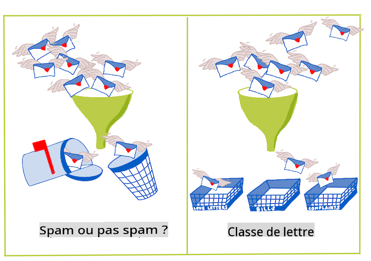
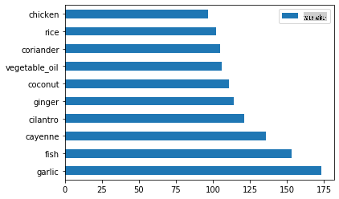
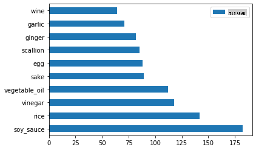
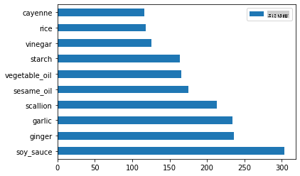
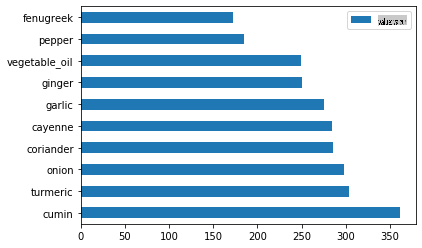
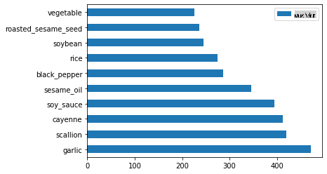

<!--
CO_OP_TRANSLATOR_METADATA:
{
  "original_hash": "76438ce4e5d48982d48f1b55c981caac",
  "translation_date": "2025-09-04T00:01:04+00:00",
  "source_file": "4-Classification/1-Introduction/README.md",
  "language_code": "fr"
}
-->
# Introduction à la classification

Dans ces quatre leçons, vous allez explorer un aspect fondamental de l'apprentissage automatique classique : _la classification_. Nous allons utiliser divers algorithmes de classification avec un ensemble de données sur les cuisines brillantes d'Asie et d'Inde. Préparez-vous à avoir faim !


> Célébrez les cuisines pan-asiatiques dans ces leçons ! Image par [Jen Looper](https://twitter.com/jenlooper)

La classification est une forme d'[apprentissage supervisé](https://wikipedia.org/wiki/Supervised_learning) qui partage de nombreux points communs avec les techniques de régression. Si l'apprentissage automatique consiste à prédire des valeurs ou des noms en utilisant des ensembles de données, alors la classification se divise généralement en deux groupes : _classification binaire_ et _classification multicatégorie_.

[](https://youtu.be/eg8DJYwdMyg "Introduction à la classification")

> 🎥 Cliquez sur l'image ci-dessus pour une vidéo : John Guttag du MIT introduit la classification

Rappel :

- **La régression linéaire** vous a aidé à prédire les relations entre les variables et à faire des prédictions précises sur la position d'un nouveau point de données par rapport à cette ligne. Par exemple, vous pourriez prédire _quel serait le prix d'une citrouille en septembre par rapport à décembre_.
- **La régression logistique** vous a permis de découvrir des "catégories binaires" : à ce prix, _cette citrouille est-elle orange ou non-orange_ ?

La classification utilise divers algorithmes pour déterminer d'autres façons d'attribuer une étiquette ou une classe à un point de données. Travaillons avec ces données sur les cuisines pour voir si, en observant un groupe d'ingrédients, nous pouvons déterminer leur origine culinaire.

## [Quiz avant la leçon](https://gray-sand-07a10f403.1.azurestaticapps.net/quiz/19/)

> ### [Cette leçon est disponible en R !](../../../../4-Classification/1-Introduction/solution/R/lesson_10.html)

### Introduction

La classification est l'une des activités fondamentales du chercheur en apprentissage automatique et du data scientist. De la classification basique d'une valeur binaire ("cet email est-il un spam ou non ?") à la classification et segmentation complexe d'images utilisant la vision par ordinateur, il est toujours utile de pouvoir trier les données en classes et leur poser des questions.

Pour exprimer le processus de manière plus scientifique, votre méthode de classification crée un modèle prédictif qui vous permet de cartographier la relation entre les variables d'entrée et les variables de sortie.



> Problèmes binaires vs multicatégorie pour les algorithmes de classification. Infographie par [Jen Looper](https://twitter.com/jenlooper)

Avant de commencer le processus de nettoyage de nos données, de leur visualisation et de leur préparation pour nos tâches d'apprentissage automatique, apprenons un peu plus sur les différentes façons dont l'apprentissage automatique peut être utilisé pour classer des données.

Dérivée des [statistiques](https://wikipedia.org/wiki/Statistical_classification), la classification utilisant l'apprentissage automatique classique utilise des caractéristiques telles que `smoker`, `weight` et `age` pour déterminer _la probabilité de développer une maladie X_. En tant que technique d'apprentissage supervisé similaire aux exercices de régression que vous avez effectués précédemment, vos données sont étiquetées et les algorithmes d'apprentissage automatique utilisent ces étiquettes pour classer et prédire les classes (ou "caractéristiques") d'un ensemble de données et les attribuer à un groupe ou un résultat.

✅ Prenez un moment pour imaginer un ensemble de données sur les cuisines. Qu'est-ce qu'un modèle multicatégorie pourrait répondre ? Qu'est-ce qu'un modèle binaire pourrait répondre ? Et si vous vouliez déterminer si une cuisine donnée était susceptible d'utiliser du fenugrec ? Et si vous vouliez voir si, avec un sac de courses contenant de l'anis étoilé, des artichauts, du chou-fleur et du raifort, vous pourriez créer un plat typique indien ?

[](https://youtu.be/GuTeDbaNoEU "Paniers mystères fous")

> 🎥 Cliquez sur l'image ci-dessus pour une vidéo. Tout le concept de l'émission 'Chopped' repose sur le 'panier mystère' où les chefs doivent préparer un plat à partir d'un choix aléatoire d'ingrédients. Un modèle d'apprentissage automatique aurait sûrement aidé !

## Bonjour 'classificateur'

La question que nous voulons poser à cet ensemble de données sur les cuisines est en fait une **question multicatégorie**, car nous avons plusieurs cuisines nationales potentielles avec lesquelles travailler. Étant donné un lot d'ingrédients, à laquelle de ces nombreuses classes les données correspondent-elles ?

Scikit-learn propose plusieurs algorithmes différents pour classer les données, selon le type de problème que vous souhaitez résoudre. Dans les deux prochaines leçons, vous apprendrez à utiliser plusieurs de ces algorithmes.

## Exercice - nettoyer et équilibrer vos données

La première tâche à accomplir, avant de commencer ce projet, est de nettoyer et **équilibrer** vos données pour obtenir de meilleurs résultats. Commencez avec le fichier _notebook.ipynb_ vierge dans le dossier racine.

La première chose à installer est [imblearn](https://imbalanced-learn.org/stable/). Il s'agit d'un package Scikit-learn qui vous permettra d'équilibrer les données plus efficacement (vous en apprendrez davantage sur cette tâche dans un instant).

1. Pour installer `imblearn`, exécutez `pip install`, comme suit :

    ```python
    pip install imblearn
    ```

1. Importez les packages nécessaires pour importer vos données et les visualiser, et importez également `SMOTE` depuis `imblearn`.

    ```python
    import pandas as pd
    import matplotlib.pyplot as plt
    import matplotlib as mpl
    import numpy as np
    from imblearn.over_sampling import SMOTE
    ```

    Vous êtes maintenant prêt à importer les données.

1. La tâche suivante consiste à importer les données :

    ```python
    df  = pd.read_csv('../data/cuisines.csv')
    ```

   Utiliser `read_csv()` permettra de lire le contenu du fichier csv _cusines.csv_ et de le placer dans la variable `df`.

1. Vérifiez la forme des données :

    ```python
    df.head()
    ```

   Les cinq premières lignes ressemblent à ceci :

    ```output
    |     | Unnamed: 0 | cuisine | almond | angelica | anise | anise_seed | apple | apple_brandy | apricot | armagnac | ... | whiskey | white_bread | white_wine | whole_grain_wheat_flour | wine | wood | yam | yeast | yogurt | zucchini |
    | --- | ---------- | ------- | ------ | -------- | ----- | ---------- | ----- | ------------ | ------- | -------- | --- | ------- | ----------- | ---------- | ----------------------- | ---- | ---- | --- | ----- | ------ | -------- |
    | 0   | 65         | indian  | 0      | 0        | 0     | 0          | 0     | 0            | 0       | 0        | ... | 0       | 0           | 0          | 0                       | 0    | 0    | 0   | 0     | 0      | 0        |
    | 1   | 66         | indian  | 1      | 0        | 0     | 0          | 0     | 0            | 0       | 0        | ... | 0       | 0           | 0          | 0                       | 0    | 0    | 0   | 0     | 0      | 0        |
    | 2   | 67         | indian  | 0      | 0        | 0     | 0          | 0     | 0            | 0       | 0        | ... | 0       | 0           | 0          | 0                       | 0    | 0    | 0   | 0     | 0      | 0        |
    | 3   | 68         | indian  | 0      | 0        | 0     | 0          | 0     | 0            | 0       | 0        | ... | 0       | 0           | 0          | 0                       | 0    | 0    | 0   | 0     | 0      | 0        |
    | 4   | 69         | indian  | 0      | 0        | 0     | 0          | 0     | 0            | 0       | 0        | ... | 0       | 0           | 0          | 0                       | 0    | 0    | 0   | 0     | 1      | 0        |
    ```

1. Obtenez des informations sur ces données en appelant `info()` :

    ```python
    df.info()
    ```

    Votre sortie ressemble à :

    ```output
    <class 'pandas.core.frame.DataFrame'>
    RangeIndex: 2448 entries, 0 to 2447
    Columns: 385 entries, Unnamed: 0 to zucchini
    dtypes: int64(384), object(1)
    memory usage: 7.2+ MB
    ```

## Exercice - découvrir les cuisines

Maintenant, le travail commence à devenir plus intéressant. Découvrons la distribution des données par cuisine.

1. Tracez les données sous forme de barres en appelant `barh()` :

    ```python
    df.cuisine.value_counts().plot.barh()
    ```

    

    Il existe un nombre fini de cuisines, mais la distribution des données est inégale. Vous pouvez corriger cela ! Avant de le faire, explorez un peu plus.

1. Découvrez combien de données sont disponibles par cuisine et imprimez-les :

    ```python
    thai_df = df[(df.cuisine == "thai")]
    japanese_df = df[(df.cuisine == "japanese")]
    chinese_df = df[(df.cuisine == "chinese")]
    indian_df = df[(df.cuisine == "indian")]
    korean_df = df[(df.cuisine == "korean")]
    
    print(f'thai df: {thai_df.shape}')
    print(f'japanese df: {japanese_df.shape}')
    print(f'chinese df: {chinese_df.shape}')
    print(f'indian df: {indian_df.shape}')
    print(f'korean df: {korean_df.shape}')
    ```

    La sortie ressemble à ceci :

    ```output
    thai df: (289, 385)
    japanese df: (320, 385)
    chinese df: (442, 385)
    indian df: (598, 385)
    korean df: (799, 385)
    ```

## Découvrir les ingrédients

Vous pouvez maintenant approfondir les données et découvrir quels sont les ingrédients typiques par cuisine. Vous devriez nettoyer les données récurrentes qui créent de la confusion entre les cuisines, alors apprenons-en davantage sur ce problème.

1. Créez une fonction `create_ingredient()` en Python pour créer un dataframe d'ingrédients. Cette fonction commencera par supprimer une colonne inutile et triera les ingrédients par leur nombre :

    ```python
    def create_ingredient_df(df):
        ingredient_df = df.T.drop(['cuisine','Unnamed: 0']).sum(axis=1).to_frame('value')
        ingredient_df = ingredient_df[(ingredient_df.T != 0).any()]
        ingredient_df = ingredient_df.sort_values(by='value', ascending=False,
        inplace=False)
        return ingredient_df
    ```

   Vous pouvez maintenant utiliser cette fonction pour avoir une idée des dix ingrédients les plus populaires par cuisine.

1. Appelez `create_ingredient()` et tracez les données en appelant `barh()` :

    ```python
    thai_ingredient_df = create_ingredient_df(thai_df)
    thai_ingredient_df.head(10).plot.barh()
    ```

    

1. Faites de même pour les données japonaises :

    ```python
    japanese_ingredient_df = create_ingredient_df(japanese_df)
    japanese_ingredient_df.head(10).plot.barh()
    ```

    

1. Maintenant pour les ingrédients chinois :

    ```python
    chinese_ingredient_df = create_ingredient_df(chinese_df)
    chinese_ingredient_df.head(10).plot.barh()
    ```

    

1. Tracez les ingrédients indiens :

    ```python
    indian_ingredient_df = create_ingredient_df(indian_df)
    indian_ingredient_df.head(10).plot.barh()
    ```

    

1. Enfin, tracez les ingrédients coréens :

    ```python
    korean_ingredient_df = create_ingredient_df(korean_df)
    korean_ingredient_df.head(10).plot.barh()
    ```

    

1. Maintenant, supprimez les ingrédients les plus courants qui créent de la confusion entre les cuisines distinctes, en appelant `drop()` :

   Tout le monde aime le riz, l'ail et le gingembre !

    ```python
    feature_df= df.drop(['cuisine','Unnamed: 0','rice','garlic','ginger'], axis=1)
    labels_df = df.cuisine #.unique()
    feature_df.head()
    ```

## Équilibrer l'ensemble de données

Maintenant que vous avez nettoyé les données, utilisez [SMOTE](https://imbalanced-learn.org/dev/references/generated/imblearn.over_sampling.SMOTE.html) - "Synthetic Minority Over-sampling Technique" - pour les équilibrer.

1. Appelez `fit_resample()`, cette stratégie génère de nouveaux échantillons par interpolation.

    ```python
    oversample = SMOTE()
    transformed_feature_df, transformed_label_df = oversample.fit_resample(feature_df, labels_df)
    ```

    En équilibrant vos données, vous obtiendrez de meilleurs résultats lors de leur classification. Pensez à une classification binaire. Si la majorité de vos données appartient à une classe, un modèle d'apprentissage automatique va prédire cette classe plus fréquemment, simplement parce qu'il y a plus de données pour elle. L'équilibrage des données permet de corriger ce déséquilibre.

1. Vous pouvez maintenant vérifier le nombre d'étiquettes par ingrédient :

    ```python
    print(f'new label count: {transformed_label_df.value_counts()}')
    print(f'old label count: {df.cuisine.value_counts()}')
    ```

    Votre sortie ressemble à ceci :

    ```output
    new label count: korean      799
    chinese     799
    indian      799
    japanese    799
    thai        799
    Name: cuisine, dtype: int64
    old label count: korean      799
    indian      598
    chinese     442
    japanese    320
    thai        289
    Name: cuisine, dtype: int64
    ```

    Les données sont propres, équilibrées et très appétissantes !

1. La dernière étape consiste à sauvegarder vos données équilibrées, y compris les étiquettes et les caractéristiques, dans un nouveau dataframe qui peut être exporté dans un fichier :

    ```python
    transformed_df = pd.concat([transformed_label_df,transformed_feature_df],axis=1, join='outer')
    ```

1. Vous pouvez jeter un dernier coup d'œil aux données en utilisant `transformed_df.head()` et `transformed_df.info()`. Sauvegardez une copie de ces données pour les utiliser dans les leçons futures :

    ```python
    transformed_df.head()
    transformed_df.info()
    transformed_df.to_csv("../data/cleaned_cuisines.csv")
    ```

    Ce nouveau fichier CSV se trouve maintenant dans le dossier racine des données.

---

## 🚀Défi

Ce programme contient plusieurs ensembles de données intéressants. Explorez les dossiers `data` et voyez si certains contiennent des ensembles de données qui seraient appropriés pour une classification binaire ou multicatégorie. Quelles questions poseriez-vous à cet ensemble de données ?

## [Quiz après la leçon](https://gray-sand-07a10f403.1.azurestaticapps.net/quiz/20/)

## Révision et auto-apprentissage

Explorez l'API de SMOTE. Pour quels cas d'utilisation est-elle la mieux adaptée ? Quels problèmes résout-elle ?

## Devoir 

[Explorez les méthodes de classification](assignment.md)

---

**Avertissement** :  
Ce document a été traduit à l'aide du service de traduction automatique [Co-op Translator](https://github.com/Azure/co-op-translator). Bien que nous nous efforcions d'assurer l'exactitude, veuillez noter que les traductions automatisées peuvent contenir des erreurs ou des inexactitudes. Le document original dans sa langue d'origine doit être considéré comme la source faisant autorité. Pour des informations critiques, il est recommandé de faire appel à une traduction humaine professionnelle. Nous déclinons toute responsabilité en cas de malentendus ou d'interprétations erronées résultant de l'utilisation de cette traduction.